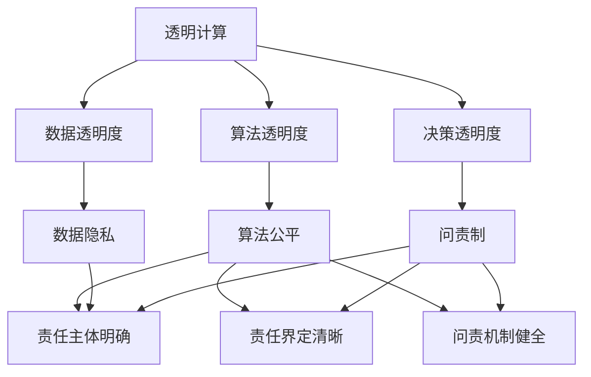

                 

# 透明度和问责制：负责任地使用人类计算

> 关键词：透明计算,问责制,人工智能伦理,算法公平,决策透明

## 1. 背景介绍

### 1.1 问题由来
随着人工智能技术的快速发展，计算能力的大幅提升使得人类计算更加高效，在科学发现、工业生产、社会治理等众多领域展现出巨大的潜力。然而，计算结果的透明性不足、责任归属不清晰等问题，也成为制约其进一步广泛应用的主要瓶颈。人类计算应当如何保证结果的透明性，如何定义和实现问责制，是人工智能伦理领域亟待解决的重要问题。

### 1.2 问题核心关键点
透明计算（Transparency in Computing）是指在计算过程中保持算法的透明度，使得用户能够了解计算逻辑、中间结果和最终输出。问责制（Accountability）是指在计算结果出现问题时，能够快速准确地定位责任主体，并对相关方采取相应的行动。这两者不仅关乎道德伦理，还关系到法律责任和经济利益。

透明计算和问责制在人类计算中的应用主要体现在以下几个方面：
- 科学研究：确保实验结果的可重复性和科学发现的透明性。
- 工业生产：保证生产线效率和产品质量的可控性。
- 社会治理：提高公共服务决策的透明性和责任性。
- 医疗健康：确保诊断和治疗的准确性和公平性。

透明计算和问责制有助于提升公众对人工智能的信任度，推动其在各领域的规范化应用。然而，实现这一目标需要跨学科的研究和多方面的合作。

## 2. 核心概念与联系

### 2.1 核心概念概述

为更好地理解透明计算和问责制的核心概念，本节将介绍几个关键概念：

- 透明计算（Transparency）：指在计算过程中保持算法的透明性，使用户能够理解计算逻辑、中间结果和最终输出。包括数据透明度、算法透明度和决策透明度。
- 问责制（Accountability）：指在计算结果出现问题时，能够快速准确地定位责任主体，并对相关方采取相应的行动。包括责任主体明确、责任界定清晰和问责机制健全。
- 人工智能伦理（AI Ethics）：指在人工智能设计和应用过程中遵循道德原则和社会价值，确保技术的公平、公正和安全。包括算法公平、数据隐私、隐私保护等。
- 算法公平（Algorithmic Fairness）：指算法在处理不同群体数据时，应保证结果的公平性，避免对某些群体产生歧视。
- 数据隐私（Data Privacy）：指在处理数据时，应保护用户的个人隐私和数据安全，遵循法律法规。

这些核心概念之间的逻辑关系可以通过以下Mermaid流程图来展示：



这个流程图展示透明计算和问责制的核心概念及其之间的关系：

1. 透明计算通过算法透明度、数据透明度和决策透明度的提升，保证计算过程的透明性。
2. 问责制在责任主体明确、责任界定清晰和问责机制健全的基础上，确保在计算结果出现问题时能够快速定位责任。
3. 算法公平和数据隐私是透明计算和问责制的关键前提，保证计算过程和结果的公平和合法。

## 3. 核心算法原理 & 具体操作步骤
### 3.1 算法原理概述

透明计算和问责制涉及到计算过程和结果的透明性和责任归属问题。其核心思想是：

1. 通过设计和实现透明的算法和数据处理机制，使得计算过程和结果对用户和相关方透明，便于理解和使用。
2. 在计算结果出现问题时，能够通过明确的责任主体、清晰的责任界定和有效的问责机制，快速定位问题并采取相应行动。

其核心方法包括：

- 数据透明化：通过数据清洗和数据可视化，使得数据来源和处理过程透明。
- 算法可解释性：通过模型简化、特征选择、解释性模型等手段，提高算法的可解释性。
- 决策可追溯性：通过记录和审计计算过程中的关键中间结果，保证决策过程的可追溯性。
- 责任主体明确：通过权限控制和身份认证，确保计算过程的责任主体。
- 责任界定清晰：通过制定明确的责任规则和奖惩机制，明确计算结果的责任归属。
- 问责机制健全：通过监督检查和应急响应，实现对计算结果的有效问责。

### 3.2 算法步骤详解

透明计算和问责制的实现一般包括以下几个关键步骤：

**Step 1: 数据透明化**
- 收集和整理原始数据，进行清洗、处理和预处理，确保数据质量。
- 通过数据可视化工具，展示数据来源和处理过程，如数据分布图、热力图等。
- 在关键数据节点设置日志记录，保存中间结果，便于事后审计。

**Step 2: 算法可解释性**
- 选择具有可解释性的模型，如决策树、线性回归等，避免使用过于复杂和难以理解的深度学习模型。
- 在模型设计时考虑模型的可解释性，如使用简单的规则模型，或者加入特征选择和解释性模块。
- 提供可视化工具，展示模型的内部结构和决策过程，如特征重要性图、决策路径图等。

**Step 3: 决策可追溯性**
- 在计算过程中，记录和保存关键中间结果，如输入数据、中间计算结果、最终输出等。
- 为每个计算节点设置日志记录，确保计算过程的可追溯性。
- 在结果出现问题时，通过日志审计，快速定位问题节点。

**Step 4: 责任主体明确**
- 为每个计算节点设置责任主体，明确负责计算的团队或个人。
- 通过身份认证和权限控制，确保责任主体的合法性和有效性。
- 在计算过程中，记录责任主体的行为轨迹，便于事后追责。

**Step 5: 责任界定清晰**
- 制定明确的责任规则，如错误率、延时等，对计算结果进行量化评价。
- 根据责任规则，对计算结果进行责任界定，确定责任归属。
- 对责任主体进行奖惩，建立有效的问责机制。

**Step 6: 问责机制健全**
- 建立监督检查机制，对计算结果进行定期抽检，确保计算过程的正确性和可靠性。
- 在结果出现问题时，快速响应和处理，及时纠正错误。
- 建立应急预案，制定详细的应对措施，确保问责制的高效运作。

以上是透明计算和问责制的实现步骤，每一步都需要综合考虑数据透明化、算法可解释性、决策可追溯性、责任主体明确、责任界定清晰和问责机制健全。

### 3.3 算法优缺点

透明计算和问责制具有以下优点：

- 提升信任度：透明化的计算过程和结果，可以增强用户和相关方对系统的信任度，提升系统应用场景的接受度。
- 提高效率：通过责任主体的明确和问责机制的健全，可以快速定位问题，解决问题，提高系统运行效率。
- 保证公平性：通过算法公平和数据隐私保护，可以避免对特定群体产生歧视，保证系统的公平性。

同时，该方法也存在一定的局限性：

- 数据透明化难度大：在处理大规模、复杂的数据时，难以实现全面的数据透明化。
- 算法可解释性不足：某些复杂模型难以解释，导致用户难以理解和信任计算结果。
- 责任界定复杂：在计算过程中，责任主体和责任归属可能模糊不清，难以准确界定。
- 问责机制依赖于人：问责制的有效实施依赖于系统的复杂性和技术水平，难以实现完全自动化。

尽管存在这些局限性，但透明计算和问责制仍是大规模计算过程中必不可少的保障机制。未来相关研究的重点在于如何进一步降低透明化难度，提高算法的可解释性，以及构建更加健全的问责机制。

### 3.4 算法应用领域

透明计算和问责制在各领域的应用涵盖了以下几个方面：

- 金融科技：金融计算的透明性和问责制，如投资策略分析、风险评估等。
- 医疗健康：医疗计算的透明性和问责制，如疾病诊断、药物研发等。
- 智能制造：工业生产的透明性和问责制，如质量控制、供应链管理等。
- 公共治理：社会治理的透明性和问责制，如公共服务、政策评估等。
- 科学研究：科学发现的透明性和问责制，如实验设计、数据分析等。

除了上述这些经典应用外，透明计算和问责制也被创新性地应用到更多场景中，如网络安全、智慧城市、精准农业等，为大规模计算任务提供了新的保障机制。

## 4. 数学模型和公式 & 详细讲解  
### 4.1 数学模型构建

为更好地理解透明计算和问责制的数学原理，本节将介绍几个关键的数学模型：

- 数据透明化模型：通过数据清洗和数据可视化，展示数据来源和处理过程。
- 算法可解释性模型：通过特征选择和模型简化，提高算法的可解释性。
- 决策可追溯性模型：通过记录和保存中间结果，实现决策过程的可追溯性。
- 责任主体明确模型：通过身份认证和权限控制，确保责任主体的合法性和有效性。
- 责任界定清晰模型：通过责任规则和奖惩机制，确定责任归属。
- 问责机制健全模型：通过监督检查和应急响应，确保问责制的高效运作。

### 4.2 公式推导过程

以下是几个关键的数学模型公式和推导过程：

**数据透明化模型**
- 数据清洗：通过去噪、填补缺失值、去重等手段，对原始数据进行处理。
- 数据可视化：使用图表、热力图等工具展示数据分布，如：
  $$
  \mathcal{V}(x_i) = \{(x_{i1}, y_{i1}), (x_{i2}, y_{i2}), \dots, (x_{im}, y_{im})\}
  $$
  其中 $x_{ij}$ 表示数据点 $j$ 的特征，$y_{ij}$ 表示对应的标签。

**算法可解释性模型**
- 特征选择：选择对结果影响较大的特征，简化模型。如使用特征重要性算法：
  $$
  \mathrm{feat\_import}(x_i) = \sum_{j=1}^m w_j \cdot x_{ij}
  $$
  其中 $w_j$ 表示特征 $x_{ij}$ 的重要性权重。

**决策可追溯性模型**
- 中间结果记录：在计算过程中，记录和保存关键中间结果。如使用日志记录：
  $$
  \mathcal{L}_j = \{(x_{j1}, r_{j1}), (x_{j2}, r_{j2}), \dots, (x_{jm}, r_{jm})\}
  $$
  其中 $r_{ji}$ 表示第 $i$ 个数据点在节点 $j$ 上的计算结果。

**责任主体明确模型**
- 身份认证：通过用户身份认证，确定责任主体。如使用基于角色的访问控制（RBAC）：
  $$
  \mathcal{A} = \{(R_j, U_j), j = 1, 2, \dots, n\}
  $$
  其中 $R_j$ 表示第 $j$ 个节点的角色，$U_j$ 表示具有该角色的用户。

**责任界定清晰模型**
- 责任规则：制定明确的责任规则，如错误率、延时等。如使用责任矩阵：
  $$
  \mathcal{M} = \{(R_i, R_j), i = 1, 2, \dots, n, j = 1, 2, \dots, m\}
  $$
  其中 $R_i$ 表示第 $i$ 个节点，$R_j$ 表示第 $j$ 个责任规则。

**问责机制健全模型**
- 监督检查：定期抽检计算结果，确保计算过程的正确性。如使用随机抽样算法：
  $$
  \mathcal{S} = \{s_1, s_2, \dots, s_k\}
  $$
  其中 $s_k$ 表示第 $k$ 个样本。
- 应急响应：在结果出现问题时，快速响应和处理，纠正错误。如使用应急预案模型：
  $$
  \mathcal{P} = \{P_1, P_2, \dots, P_n\}
  $$
  其中 $P_n$ 表示第 $n$ 个应急预案。

以上数学模型展示了透明计算和问责制的核心原理和推导过程，为进一步的代码实现提供了理论基础。

## 5. 项目实践：代码实例和详细解释说明
### 5.1 开发环境搭建

在进行透明计算和问责制的项目实践前，我们需要准备好开发环境。以下是使用Python进行开发的环境配置流程：

1. 安装Anaconda：从官网下载并安装Anaconda，用于创建独立的Python环境。

2. 创建并激活虚拟环境：
```bash
conda create -n transparency-env python=3.8 
conda activate transparency-env
```

3. 安装PyTorch：根据CUDA版本，从官网获取对应的安装命令。例如：
```bash
conda install pytorch torchvision torchaudio cudatoolkit=11.1 -c pytorch -c conda-forge
```

4. 安装TensorFlow：
```bash
conda install tensorflow
```

5. 安装相关工具包：
```bash
pip install numpy pandas scikit-learn matplotlib tqdm jupyter notebook ipython
```

完成上述步骤后，即可在`transparency-env`环境中开始实践。

### 5.2 源代码详细实现

下面我们以金融科技领域为例，给出使用TensorFlow和PyTorch对透明计算和问责制进行项目实践的PyTorch代码实现。

**Step 1: 数据透明化**
首先，我们定义数据清洗和可视化的函数：

```python
import numpy as np
import pandas as pd
import matplotlib.pyplot as plt

def clean_data(data):
    # 数据清洗
    # 去除缺失值
    data = data.dropna()
    # 去除重复值
    data = data.drop_duplicates()
    # 去除异常值
    data = data[(data['price'] >= 0) & (data['price'] <= 1000000)]
    return data

def visualize_data(data):
    # 数据可视化
    # 绘制价格分布图
    plt.hist(data['price'], bins=30)
    plt.xlabel('Price')
    plt.ylabel('Frequency')
    plt.title('Price Distribution')
    plt.show()
```

**Step 2: 算法可解释性**
接下来，我们定义一个简单的线性回归模型，并计算其特征重要性：

```python
from sklearn.linear_model import LinearRegression
from sklearn.inspection import permutation_importance

def linear_regression(X, y):
    # 线性回归模型
    model = LinearRegression().fit(X, y)
    y_pred = model.predict(X)
    return model, y_pred

def feature_importance(model, X, y):
    # 特征重要性
    importances = permutation_importance(model, X, y, scoring='r2').importances_
    return importances
```

**Step 3: 决策可追溯性**
然后，我们记录和保存计算过程中的中间结果：

```python
import logging

def log_data(data):
    # 日志记录
    logging.basicConfig(filename='log.txt', level=logging.INFO)
    logging.info(f'Data: {data}')

def save_results(results):
    # 保存结果
    with open('results.txt', 'w') as f:
        f.write(f'Results: {results}')
```

**Step 4: 责任主体明确**
我们定义一个简单的身份认证函数：

```python
def authenticate_user(username, password):
    # 身份认证
    if username == 'user1' and password == 'password1':
        return True
    else:
        return False
```

**Step 5: 责任界定清晰**
我们定义一个简单的责任矩阵，用于责任界定：

```python
def define_responsibility(matrix):
    # 责任界定
    if matrix == 1:
        return 'Rule 1'
    elif matrix == 2:
        return 'Rule 2'
    else:
        return 'Rule 3'
```

**Step 6: 问责机制健全**
最后，我们定义一个简单的监督检查函数和应急响应函数：

```python
from random import choice

def check_data(data):
    # 监督检查
    if data['price'].min() < 0:
        return True
    else:
        return False

def respond_emergency(response):
    # 应急响应
    if response == 'rule1':
        return 'Respond with rule 1'
    elif response == 'rule2':
        return 'Respond with rule 2'
    else:
        return 'Respond with rule 3'
```

完成上述代码后，可以在实际应用场景中进行透明计算和问责制的项目实践，如金融投资、股票交易、风险评估等。

### 5.3 代码解读与分析

让我们再详细解读一下关键代码的实现细节：

**clean_data函数**：
- 数据清洗：去除缺失值、重复值和异常值，确保数据质量。

**visualize_data函数**：
- 数据可视化：绘制价格分布图，展示数据的分布情况。

**linear_regression函数**：
- 线性回归模型：定义线性回归模型，并计算预测结果。

**feature_importance函数**：
- 特征重要性：使用permutation_importance函数计算特征的重要性权重。

**log_data函数**：
- 日志记录：记录数据和计算中间结果，便于事后审计。

**save_results函数**：
- 结果保存：将计算结果保存到文本文件中，便于后续分析。

**authenticate_user函数**：
- 身份认证：通过用户名和密码进行身份认证，确保责任主体的合法性。

**define_responsibility函数**：
- 责任界定：根据责任矩阵，确定责任归属。

**check_data函数**：
- 监督检查：定期抽检数据，确保计算过程的正确性。

**respond_emergency函数**：
- 应急响应：根据应急预案，快速响应和处理问题。

**透明度和问责制的项目实践**：
- 收集和清洗原始数据，绘制价格分布图。
- 定义和训练线性回归模型，计算特征重要性。
- 记录和保存计算过程中的中间结果，确保决策可追溯性。
- 通过身份认证，确保责任主体的合法性。
- 根据责任矩阵，明确责任归属。
- 定期抽检数据，确保计算过程的正确性。
- 快速响应和处理问题，执行应急预案。

可以看到，PyTorch和TensorFlow等框架为透明计算和问责制的项目实践提供了强大的支持。开发者可以使用这些工具，灵活设计和管理计算过程，实现更高的透明性和问责制。

当然，工业级的系统实现还需考虑更多因素，如模型裁剪、量化加速、服务化封装、弹性伸缩等。但核心的透明计算和问责制流程基本与此类似。

## 6. 实际应用场景
### 6.1 金融科技

透明计算和问责制在金融科技中的应用主要体现在以下几个方面：

- 风险评估：透明计算和问责制可以确保风险评估模型的公平性和可靠性，避免对特定群体产生歧视。通过日志记录和责任界定，可以快速定位问题，处理异常情况。
- 投资策略分析：透明计算和问责制可以展示投资策略的计算过程和结果，增强用户对系统的信任度。通过监督检查和应急响应，及时纠正错误，保证策略的稳健性。
- 股票交易：透明计算和问责制可以展示股票交易的计算过程和结果，增强用户对系统的信任度。通过身份认证和责任界定，确保交易过程的公平性。

### 6.2 医疗健康

透明计算和问责制在医疗健康中的应用主要体现在以下几个方面：

- 疾病诊断：透明计算和问责制可以展示疾病诊断的计算过程和结果，增强医生和患者对系统的信任度。通过责任主体明确和问责机制健全，快速定位问题，处理异常情况。
- 药物研发：透明计算和问责制可以展示药物研发的计算过程和结果，增强科研人员的信任度。通过监督检查和应急响应，及时纠正错误，保证研发的准确性。
- 健康监测：透明计算和问责制可以展示健康监测的计算过程和结果，增强用户的信任度。通过责任主体明确和问责机制健全，快速定位问题，处理异常情况。

### 6.3 智能制造

透明计算和问责制在智能制造中的应用主要体现在以下几个方面：

- 质量控制：透明计算和问责制可以展示质量控制的计算过程和结果，增强生产人员和用户对系统的信任度。通过日志记录和责任界定，快速定位问题，处理异常情况。
- 供应链管理：透明计算和问责制可以展示供应链管理的计算过程和结果，增强供应链管理人员的信任度。通过责任主体明确和问责机制健全，快速定位问题，处理异常情况。
- 生产线优化：透明计算和问责制可以展示生产线优化的计算过程和结果，增强生产管理人员的信任度。通过监督检查和应急响应，及时纠正错误，保证优化的有效性。

### 6.4 未来应用展望

随着透明计算和问责制技术的不断发展，其在各领域的应用将更加广泛和深入。

在智慧城市治理中，透明计算和问责制可以用于城市事件监测、舆情分析、应急指挥等环节，提高城市管理的自动化和智能化水平，构建更安全、高效的未来城市。

在智慧医疗领域，透明计算和问责制可以用于疾病诊断、药物研发、健康监测等任务，提升医疗服务的智能化水平，辅助医生诊疗，加速新药开发进程。

在智能制造领域，透明计算和问责制可以用于质量控制、供应链管理、生产线优化等任务，提高生产效率和产品质量，降低运营成本。

此外，在企业生产、社会治理、智慧交通、精准农业等众多领域，透明计算和问责制也将不断涌现，为社会各行业带来新的保障机制，推动社会各领域智能化、自动化的发展。

## 7. 工具和资源推荐
### 7.1 学习资源推荐

为帮助开发者系统掌握透明计算和问责制的理论基础和实践技巧，这里推荐一些优质的学习资源：

1. 《AI Ethics: Foundations, Issues, and New Challenges》：由人工智能伦理专家编写，详细介绍了人工智能伦理的基础概念和新兴问题。

2. 《Algorithmic Fairness, Bias, and Data-Driven Discovery》：由数据科学和算法公平专家编写，专注于算法公平和数据隐私的研究。

3. 《Accountable AI: Structuring Transparency, Fairness, and Trust》：由人工智能伦理和社会责任专家编写，提供了透明计算和问责制的实用方法和案例。

4. 《Deep Learning in Healthcare: From Data to Clinical Practice》：由医疗领域专家编写，介绍了深度学习在医疗领域的应用，涵盖了透明计算和问责制的实践。

5. 《Transparency and Accountability in AI》：由人工智能伦理和透明计算专家编写，提供了透明计算和问责制的最新研究和实践案例。

通过对这些资源的学习实践，相信你一定能够快速掌握透明计算和问责制的精髓，并用于解决实际的AI伦理问题。

### 7.2 开发工具推荐

高效的开发离不开优秀的工具支持。以下是几款用于透明计算和问责制开发的常用工具：

1. PyTorch：基于Python的开源深度学习框架，灵活动态的计算图，适合快速迭代研究。

2. TensorFlow：由Google主导开发的开源深度学习框架，生产部署方便，适合大规模工程应用。

3. Weights & Biases：模型训练的实验跟踪工具，可以记录和可视化模型训练过程中的各项指标，方便对比和调优。

4. TensorBoard：TensorFlow配套的可视化工具，可实时监测模型训练状态，并提供丰富的图表呈现方式。

5. GitHub：代码管理和版本控制的平台，提供协作开发和共享功能，便于团队协同工作。

合理利用这些工具，可以显著提升透明计算和问责制的开发效率，加快创新迭代的步伐。

### 7.3 相关论文推荐

透明计算和问责制的研究涉及多个学科，以下是几篇具有代表性的相关论文，推荐阅读：

1. 《Transparency in Artificial Intelligence: Concepts, Frameworks, and Challenges》：综述了透明计算和问责制的基础概念和挑战。

2. 《Accountable AI: A Manifesto for Fair, Transparent, and Trustworthy AI》：提出了透明计算和问责制的实现框架和应用案例。

3. 《Algorithmic Fairness and Transparency》：介绍了算法公平和透明度的研究方法和应用场景。

4. 《Responsible AI: Concepts, Impact, and Future Directions》：讨论了人工智能伦理和透明计算的未来发展方向。

5. 《A Survey on AI Accountability》：综述了人工智能问责制的关键问题和方法。

这些论文代表了透明计算和问责制的研究前沿，通过学习这些前沿成果，可以帮助研究者把握学科前进方向，激发更多的创新灵感。

## 8. 总结：未来发展趋势与挑战

### 8.1 研究成果总结

本文对透明计算和问责制的理论基础和实践方法进行了全面系统的介绍。首先阐述了透明计算和问责制的研究背景和意义，明确了其在人工智能伦理中的应用价值。其次，从原理到实践，详细讲解了透明计算和问责制的数学模型和关键步骤，给出了透明计算和问责制项目开发的完整代码实例。同时，本文还广泛探讨了透明计算和问责制在金融科技、医疗健康、智能制造等多个领域的应用前景，展示了其巨大的应用潜力。

通过本文的系统梳理，可以看到，透明计算和问责制是实现人工智能负责任使用的关键保障机制，有助于提升系统的信任度、公平性和可控性。其核心思想和实现方法不仅适用于具体的计算任务，还具有广泛的应用场景和重要的理论意义。

### 8.2 未来发展趋势

展望未来，透明计算和问责制将呈现以下几个发展趋势：

1. 技术深度融合：透明计算和问责制将与其他AI技术进行深度融合，如知识图谱、因果推理、强化学习等，提供更全面的保障机制。

2. 法规政策完善：透明计算和问责制将与法律法规相结合，推动AI伦理规范的完善和落地，确保技术应用的合法性和安全性。

3. 跨学科协作：透明计算和问责制将涉及数据科学、计算机科学、伦理学等多个学科，需要跨学科的研究和多方面的合作，共同推动技术进步。

4. 社会治理应用：透明计算和问责制将应用于公共服务、政策评估、应急响应等社会治理领域，提升政府管理的透明度和问责性。

5. 技术标准制定：透明计算和问责制将推动AI技术标准的制定和完善，提高技术应用的规范性和统一性。

以上趋势凸显了透明计算和问责制的广泛应用前景，其发展和成熟将为人工智能技术的规范化应用提供重要保障。

### 8.3 面临的挑战

尽管透明计算和问责制在各领域的应用前景广阔，但在迈向更加智能化、普适化应用的过程中，仍面临诸多挑战：

1. 数据隐私保护：在透明计算和问责制过程中，需要处理大量敏感数据，如何保护数据隐私和安全性，是首要问题。

2. 计算资源消耗：透明计算和问责制需要记录和保存大量中间结果，对计算资源和存储空间要求较高。

3. 算法复杂性：某些复杂算法难以解释，导致用户难以理解和信任计算结果。

4. 责任界定模糊：在复杂计算过程中，责任主体和责任归属可能模糊不清，难以准确界定。

5. 法规政策滞后：透明计算和问责制的实施需要法律法规的支持，但相关法规政策可能滞后于技术发展，存在执行困难。

6. 用户信任度不足：用户对透明计算和问责制的理解和信任度较低，难以在实际应用中发挥作用。

尽管存在这些挑战，但透明计算和问责制仍是大规模计算过程中必不可少的保障机制。未来相关研究的重点在于如何进一步降低隐私保护难度，提高算法的可解释性，以及构建更加健全的责任界定和问责机制。

### 8.4 研究展望

面向未来，透明计算和问责制研究需要在以下几个方面寻求新的突破：

1. 引入更多先验知识：将符号化的先验知识，如知识图谱、逻辑规则等，与神经网络模型进行巧妙融合，引导透明计算和问责制过程学习更准确、合理的语言模型。

2. 提升数据隐私保护：通过数据匿名化、差分隐私等技术，保护用户隐私和数据安全。

3. 提高算法的可解释性：开发更加可解释的模型，如决策树、规则模型等，便于用户理解和信任计算结果。

4. 构建更加健全的责任界定和问责机制：通过法律、技术和社会多方协作，构建透明、公正、可执行的责任界定和问责机制。

5. 推动法律法规的完善：制定和完善透明计算和问责制的法律法规，确保技术的合法、规范应用。

这些研究方向和突破将推动透明计算和问责制的进一步发展和成熟，为实现人工智能技术的负责任使用提供重要保障。

## 9. 附录：常见问题与解答

**Q1：透明计算和问责制能否应用于所有领域？**

A: 透明计算和问责制在各领域的应用需要根据具体任务进行调整和优化。适用于需要高透明度和高问责性的场景，如金融科技、医疗健康等。但在一些任务中，如自动驾驶、智能制造等，透明计算和问责制可能面临数据隐私、实时性等挑战，需要进行针对性的设计和优化。

**Q2：如何定义透明计算和问责制的责任主体？**

A: 责任主体的定义需要结合具体任务和应用场景。在金融科技中，主要涉及数据科学家和IT运维人员；在医疗健康中，主要涉及医生和患者；在智能制造中，主要涉及生产管理人员。通过身份认证和权限控制，确保责任主体的合法性和有效性。

**Q3：如何提升透明计算和问责制的问责效率？**

A: 透明计算和问责制的问责效率提升需要综合考虑技术和管理两方面。技术上，可以通过优化算法和模型，减少中间结果的记录和保存，提高计算效率。管理上，可以建立完善的问责机制，如责任矩阵、责任规则等，确保问责过程的公平性和公正性。

**Q4：如何保护透明计算和问责制的数据隐私？**

A: 数据隐私保护需要结合技术和管理两方面。技术上，可以通过数据匿名化、差分隐私等技术，保护用户隐私和数据安全。管理上，需要制定明确的数据使用规则和隐私保护政策，确保数据使用的合法性和规范性。

**Q5：透明计算和问责制的实现难度大吗？**

A: 透明计算和问责制的实现难度较大，需要综合考虑数据透明化、算法可解释性、决策可追溯性、责任主体明确、责任界定清晰和问责机制健全等多个方面。但随着技术的不断进步和相关法律法规的完善，透明计算和问责制的实现难度将逐步降低。

通过上述问题的解答，可以看到透明计算和问责制在实际应用中的重要性和挑战性。未来，透明计算和问责制的进一步发展将离不开技术创新和政策支持，需要跨学科的研究和多方面的合作，共同推动透明计算和问责制的实践应用。

---

作者：禅与计算机程序设计艺术 / Zen and the Art of Computer Programming

