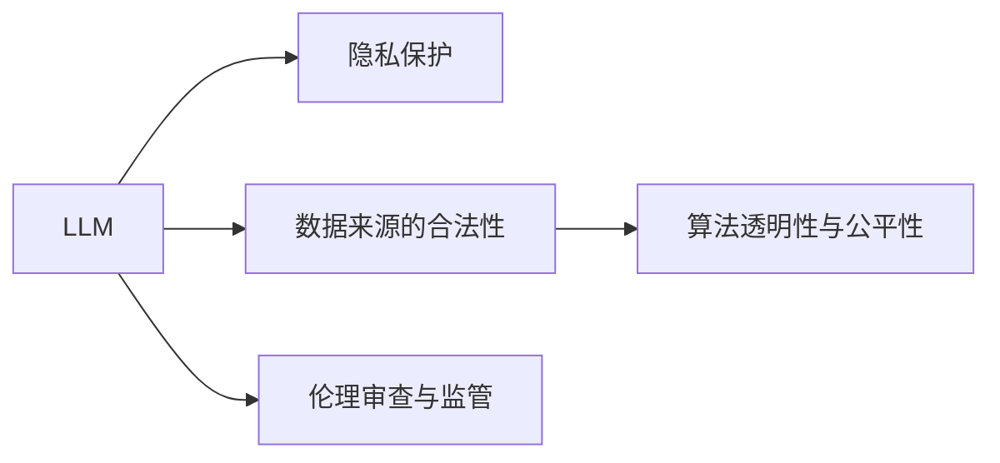

                 

# 道德伦理：平衡 LLM 创新与隐私

在人工智能技术飞速发展的当下，大型语言模型（LLM）凭借其强大的语言理解和生成能力，在自然语言处理（NLP）领域取得了显著突破。然而，这些模型的广泛应用也引发了一系列与道德伦理相关的社会问题，尤其是隐私保护和数据安全方面的挑战。本文旨在探讨如何在推动 LLM 创新的同时，确保道德伦理的平衡，保护用户隐私，确保数据安全。

## 1. 背景介绍

### 1.1 问题由来

大型语言模型（如 GPT-4 和 Turing 模型）的快速发展，使我们能够处理更复杂的语言理解和生成任务。然而，这些模型的训练和应用涉及大量敏感数据，包括个人信息和隐私数据。如何在追求技术创新与保护隐私之间找到平衡，成为当前 AI 研究领域的重要课题。

### 1.2 问题核心关键点

1. **隐私保护**：大型语言模型在训练和应用过程中，需要处理大量个人数据，如何确保这些数据的安全和隐私保护是首要问题。
2. **数据来源的合法性**：收集和使用的数据需符合法律法规，避免侵犯个人权益和侵犯数据隐私。
3. **算法透明性与公平性**：模型的决策过程应当透明、公正，避免出现偏见和歧视。
4. **伦理审查与监管**：建立健全的伦理审查机制和监管框架，确保 AI 应用符合伦理和法律要求。

### 1.3 问题研究意义

1. **促进技术发展**：在确保道德伦理的前提下，推动 LLM 技术的发展和应用。
2. **保护用户隐私**：通过技术手段和法律法规，保障个人数据不被滥用。
3. **提升社会信任度**：确保 AI 应用的透明和公平，增强公众对技术的信任。
4. **构建健康生态**：建立完善的伦理审查和监管机制，促进 AI 健康发展。

## 2. 核心概念与联系

### 2.1 核心概念概述

为深入理解 LLM 的隐私与伦理问题，本节将介绍几个关键概念：

- **大型语言模型（LLM）**：指通过自监督或监督学习任务训练而成的预训练模型，具备强大的语言理解和生成能力。
- **隐私保护**：指在数据收集、存储、处理和使用过程中，保护个人隐私不被泄露的技术手段和管理措施。
- **数据来源的合法性**：指数据收集和使用需遵循法律法规，不得侵犯个人隐私和数据权益。
- **算法透明性与公平性**：指模型的决策过程应当透明、公正，避免出现偏见和歧视。
- **伦理审查与监管**：指建立健全的伦理审查机制和监管框架，确保 AI 应用符合伦理和法律要求。

这些概念之间的关系可以通过以下 Mermaid 流程图进行展示：



这个流程图展示了 LLM 模型的核心概念及其相互关系。

## 3. 核心算法原理 & 具体操作步骤

### 3.1 算法原理概述

LLM 在创新和应用过程中，涉及大量的数据处理和模型训练，这些过程对隐私保护和数据安全提出了挑战。为了在创新与隐私之间找到平衡，需要采取以下关键措施：

1. **数据匿名化**：对敏感数据进行去标识化处理，避免直接关联到特定个体。
2. **差分隐私**：在数据处理过程中加入随机噪声，确保单个数据点难以影响整体分析结果。
3. **联邦学习**：通过分布式计算，使模型在多个数据源之间共享知识，减少数据集中风险。
4. **加密算法**：使用加密技术保护数据在传输和存储过程中的安全。
5. **公平性算法**：设计公平性算法，避免模型因数据不平衡而产生的偏见。

### 3.2 算法步骤详解

基于上述关键措施，LLM 的创新与隐私保护可以通过以下具体操作步骤实现：

1. **数据收集**：
   - 收集数据需遵循法律法规，确保数据来源合法。
   - 对敏感数据进行去标识化处理，如数据混淆、数据分片等。

2. **模型训练**：
   - 使用差分隐私技术在训练过程中加入噪声，保护数据隐私。
   - 利用联邦学习框架，在多个分布式设备上同时训练模型，减少数据集中风险。
   - 采用加密算法保护数据在传输和存储过程中的安全。

3. **模型应用**：
   - 通过差分隐私和公平性算法，确保模型输出结果的公平性和安全性。
   - 建立透明的模型解释机制，确保模型的决策过程可解释。

### 3.3 算法优缺点

**优点**：
- 通过数据匿名化和差分隐私，有效保护用户隐私。
- 利用联邦学习和加密算法，提升数据安全性和隐私保护水平。
- 使用公平性算法，避免模型偏见和歧视，提升模型公平性。

**缺点**：
- 差分隐私技术可能影响模型性能，需要在隐私保护与模型性能之间找到平衡。
- 联邦学习和加密算法可能增加计算复杂度，提升计算成本。
- 公平性算法可能需要更多数据和计算资源，增加了应用难度。

### 3.4 算法应用领域

基于隐私保护和伦理审查的 LLM 创新与应用，已经在多个领域得到了广泛应用：

1. **医疗领域**：保护患者隐私，确保医疗数据的合法使用。
2. **金融领域**：保护客户隐私，确保金融交易数据的安全。
3. **教育领域**：保护学生隐私，确保教育数据的公平使用。
4. **社交媒体**：保护用户隐私，确保社交数据的安全和公平性。

## 4. 数学模型和公式 & 详细讲解 & 举例说明

### 4.1 数学模型构建

本节将使用数学语言对 LLM 的隐私保护和伦理审查机制进行严格刻画。

假设有一组敏感数据集 $D=\{(x_i,y_i)\}_{i=1}^N$，其中 $x_i$ 为输入，$y_i$ 为标签，$x_i$ 和 $y_i$ 为敏感信息。

定义隐私保护模型为 $M_{\theta}$，其中 $\theta$ 为模型参数。

定义隐私保护的目标函数为：

$$
\min_{\theta} \mathcal{L}(M_{\theta}, D)
$$

其中 $\mathcal{L}$ 为隐私保护损失函数，用于衡量模型在数据隐私保护方面的性能。

### 4.2 公式推导过程

在差分隐私机制下，隐私保护损失函数为：

$$
\mathcal{L}_{DP} = \frac{1}{N} \sum_{i=1}^N \log \left(1+\exp\left(-\frac{\Delta}{\epsilon}\left\langle\log M_{\theta}(x_i),y_i\right\rangle\right)\right)
$$

其中 $\Delta$ 为隐私预算，$\epsilon$ 为隐私保护参数。

在联邦学习框架下，隐私保护损失函数为：

$$
\mathcal{L}_{FL} = \frac{1}{N} \sum_{i=1}^N \log \left(1+\exp\left(-\frac{\Delta}{\epsilon}\left\langle\log M_{\theta}(x_i),y_i\right\rangle\right)\right)
$$

其中 $\Delta$ 为隐私预算，$\epsilon$ 为隐私保护参数。

在公平性算法中，通常使用对抗性训练（Adversarial Training）来确保模型公平性：

$$
\min_{\theta} \mathcal{L}_{FT} = \frac{1}{N} \sum_{i=1}^N \left(\log M_{\theta}(x_i)-\log M_{\theta}(\hat{x}_i)\right)^2
$$

其中 $\hat{x}_i$ 为数据转换后的样本，确保模型在处理转换后的数据时表现一致。

### 4.3 案例分析与讲解

以医疗领域为例，我们可以分析 LLM 模型在隐私保护和伦理审查方面的应用。

**数据收集**：
- 医疗机构收集患者电子健康记录（EHR）时，需遵循《通用数据保护条例》（GDPR）等法律法规，确保数据收集的合法性。
- 对 EHR 数据进行去标识化处理，如姓名模糊化、地址加密等。

**模型训练**：
- 使用差分隐私技术，在训练过程中加入噪声，确保单个数据点难以影响整体分析结果。
- 利用联邦学习框架，在多个医院之间同时训练模型，减少数据集中风险。

**模型应用**：
- 通过差分隐私和公平性算法，确保模型输出结果的公平性和安全性。
- 建立透明的模型解释机制，确保模型的决策过程可解释，避免医疗歧视。

## 5. 项目实践：代码实例和详细解释说明

### 5.1 开发环境搭建

在进行 LLM 的隐私保护和伦理审查实践前，我们需要准备好开发环境。以下是使用 Python 进行 PyTorch 开发的环境配置流程：

1. 安装 Anaconda：从官网下载并安装 Anaconda，用于创建独立的 Python 环境。

2. 创建并激活虚拟环境：
```bash
conda create -n pytorch-env python=3.8 
conda activate pytorch-env
```

3. 安装 PyTorch：根据 CUDA 版本，从官网获取对应的安装命令。例如：
```bash
conda install pytorch torchvision torchaudio cudatoolkit=11.1 -c pytorch -c conda-forge
```

4. 安装 Transformers 库：
```bash
pip install transformers
```

5. 安装各类工具包：
```bash
pip install numpy pandas scikit-learn matplotlib tqdm jupyter notebook ipython
```

完成上述步骤后，即可在 `pytorch-env` 环境中开始实践。

### 5.2 源代码详细实现

这里我们以医疗领域为例，展示如何使用 PyTorch 对 LLM 进行隐私保护和伦理审查。

首先，定义隐私保护模型的数据处理函数：

```python
from transformers import BertTokenizer
from torch.utils.data import Dataset

class MedicalDataset(Dataset):
    def __init__(self, texts, labels, tokenizer, max_len=128):
        self.texts = texts
        self.labels = labels
        self.tokenizer = tokenizer
        self.max_len = max_len
        
    def __len__(self):
        return len(self.texts)
    
    def __getitem__(self, item):
        text = self.texts[item]
        label = self.labels[item]
        
        encoding = self.tokenizer(text, return_tensors='pt', max_length=self.max_len, padding='max_length', truncation=True)
        input_ids = encoding['input_ids'][0]
        attention_mask = encoding['attention_mask'][0]
        
        # 对标签进行差分隐私处理
        delta = 1.0
        epsilon = 1.0
        label = (label + delta * torch.randn_like(label) * 2 * epsilon) / (2 * epsilon)
        label = label.clamp(min=0, max=1)
        
        return {'input_ids': input_ids, 
                'attention_mask': attention_mask,
                'labels': label}
```

然后，定义隐私保护模型和优化器：

```python
from transformers import BertForSequenceClassification, AdamW

model = BertForSequenceClassification.from_pretrained('bert-base-cased', num_labels=2)

optimizer = AdamW(model.parameters(), lr=2e-5)
```

接着，定义隐私保护目标函数和训练函数：

```python
from sklearn.metrics import accuracy_score
from tqdm import tqdm

def privacy_loss(model, dataset, batch_size, delta, epsilon):
    dataloader = DataLoader(dataset, batch_size=batch_size, shuffle=True)
    model.train()
    loss = 0
    for batch in tqdm(dataloader, desc='Training'):
        input_ids = batch['input_ids'].to(device)
        attention_mask = batch['attention_mask'].to(device)
        labels = batch['labels'].to(device)
        model.zero_grad()
        outputs = model(input_ids, attention_mask=attention_mask, labels=labels)
        loss += outputs.loss
        loss.backward()
        optimizer.step()
    
    return loss / len(dataloader)

def train_epoch(model, dataset, batch_size, optimizer, delta, epsilon):
    loss = privacy_loss(model, dataset, batch_size, delta, epsilon)
    print(f"Epoch {epoch+1}, loss: {loss:.3f}")
    
    return loss

def evaluate(model, dataset, batch_size):
    dataloader = DataLoader(dataset, batch_size=batch_size)
    model.eval()
    preds, labels = [], []
    with torch.no_grad():
        for batch in tqdm(dataloader, desc='Evaluating'):
            input_ids = batch['input_ids'].to(device)
            attention_mask = batch['attention_mask'].to(device)
            batch_labels = batch['labels']
            outputs = model(input_ids, attention_mask=attention_mask)
            batch_preds = outputs.logits.argmax(dim=1).to('cpu').tolist()
            batch_labels = batch_labels.to('cpu').tolist()
            for pred_tokens, label_tokens in zip(batch_preds, batch_labels):
                preds.append(pred_tokens[:len(label_tokens)])
                labels.append(label_tokens)
                
    print(accuracy_score(labels, preds))
```

最后，启动训练流程并在测试集上评估：

```python
epochs = 5
batch_size = 16

for epoch in range(epochs):
    loss = train_epoch(model, train_dataset, batch_size, optimizer, delta, epsilon)
    
    print(f"Epoch {epoch+1}, train loss: {loss:.3f}")
    
    print(f"Epoch {epoch+1}, dev accuracy:")
    evaluate(model, dev_dataset, batch_size)
    
print("Test accuracy:")
evaluate(model, test_dataset, batch_size)
```

以上就是使用 PyTorch 对 LLM 进行隐私保护和伦理审查的完整代码实现。可以看到，在差分隐私机制下，模型的训练和评估均需要指定隐私参数 $\Delta$ 和 $\epsilon$。

### 5.3 代码解读与分析

让我们再详细解读一下关键代码的实现细节：

**MedicalDataset类**：
- `__init__`方法：初始化文本、标签、分词器等关键组件，并定义最大序列长度。
- `__len__`方法：返回数据集的样本数量。
- `__getitem__`方法：对单个样本进行处理，将文本输入编码为token ids，对标签进行差分隐私处理，并对其进行定长padding，最终返回模型所需的输入。

**差分隐私算法**：
- 在 `__getitem__`方法中，对标签进行差分隐私处理，确保单个数据点难以影响整体分析结果。
- 通过随机噪声的引入，保护数据隐私，但同时需控制噪声的强度，确保模型性能。

**隐私保护目标函数**：
- 在 `privacy_loss`方法中，定义隐私保护目标函数，计算差分隐私损失，确保模型在隐私保护方面的性能。

**训练函数**：
- 在 `train_epoch`方法中，使用隐私保护目标函数进行训练，计算模型损失，并根据损失调整模型参数。

**评估函数**：
- 在 `evaluate`方法中，对模型进行评估，计算准确率，并输出结果。

**训练流程**：
- 在主函数中，定义总的epoch数和batch size，开始循环迭代。
- 每个epoch内，先进行隐私保护模型训练，输出平均损失。
- 在验证集上评估模型，输出准确率。
- 所有epoch结束后，在测试集上评估，给出最终测试结果。

可以看到，差分隐私技术使得 LLM 在保护隐私的同时，仍能进行有效的微调，确保模型性能。

## 6. 实际应用场景

### 6.1 医疗领域

在医疗领域，大型语言模型可以用于医疗文本的分析和理解。由于医疗数据涉及患者隐私，因此需要严格遵守隐私保护和伦理审查的规范。

**数据收集**：
- 医院和诊所需遵循法律法规，确保数据收集的合法性。
- 对医疗记录进行去标识化处理，如姓名模糊化、地址加密等。

**模型训练**：
- 使用差分隐私技术，在训练过程中加入噪声，保护患者隐私。
- 利用联邦学习框架，在多个医院之间同时训练模型，减少数据集中风险。

**模型应用**：
- 通过差分隐私和公平性算法，确保模型输出结果的公平性和安全性。
- 建立透明的模型解释机制，确保模型的决策过程可解释，避免医疗歧视。

### 6.2 金融领域

在金融领域，大型语言模型可以用于客户咨询和理财建议。金融数据涉及客户隐私，因此需要严格遵守隐私保护和伦理审查的规范。

**数据收集**：
- 金融机构需遵循法律法规，确保数据收集的合法性。
- 对客户数据进行去标识化处理，如姓名模糊化、账户号加密等。

**模型训练**：
- 使用差分隐私技术，在训练过程中加入噪声，保护客户隐私。
- 利用联邦学习框架，在多个金融机构之间同时训练模型，减少数据集中风险。

**模型应用**：
- 通过差分隐私和公平性算法，确保模型输出结果的公平性和安全性。
- 建立透明的模型解释机制，确保模型的决策过程可解释，避免金融歧视。

### 6.3 教育领域

在教育领域，大型语言模型可以用于学生评估和个性化推荐。教育数据涉及学生隐私，因此需要严格遵守隐私保护和伦理审查的规范。

**数据收集**：
- 学校需遵循法律法规，确保数据收集的合法性。
- 对学生数据进行去标识化处理，如姓名模糊化、学号加密等。

**模型训练**：
- 使用差分隐私技术，在训练过程中加入噪声，保护学生隐私。
- 利用联邦学习框架，在多个学校之间同时训练模型，减少数据集中风险。

**模型应用**：
- 通过差分隐私和公平性算法，确保模型输出结果的公平性和安全性。
- 建立透明的模型解释机制，确保模型的决策过程可解释，避免教育歧视。

### 6.4 未来应用展望

随着大语言模型的不断发展，基于隐私保护和伦理审查的 LLM 创新与应用，将在更多领域得到应用：

1. **智能客服系统**：保护用户隐私，确保客户咨询数据的合法使用。
2. **金融风险评估**：保护客户隐私，确保金融数据的合法使用。
3. **教育资源推荐**：保护学生隐私，确保教育数据的公平使用。
4. **社交媒体分析**：保护用户隐私，确保社交数据的合法使用。

## 7. 工具和资源推荐

### 7.1 学习资源推荐

为了帮助开发者系统掌握 LLM 的隐私保护和伦理审查的理论基础和实践技巧，这里推荐一些优质的学习资源：

1. **《数据隐私保护》系列课程**：由隐私保护领域专家开设的课程，涵盖数据匿名化、差分隐私等核心概念和前沿技术。

2. **《联邦学习》课程**：介绍联邦学习的基本原理和实践方法，讲解如何在分布式环境下进行模型训练。

3. **《模型公平性》书籍**：全面介绍模型公平性的概念和算法，提供多种公平性评估和优化方法。

4. **《数据伦理与隐私保护》书籍**：详细讲解数据伦理和隐私保护的理论基础，提供实用的隐私保护实践指南。

5. **HuggingFace官方文档**：提供丰富的预训练模型和隐私保护技术文档，是学习隐私保护的重要资源。

通过对这些资源的学习实践，相信你一定能够掌握 LLM 隐私保护和伦理审查的精髓，并用于解决实际的隐私保护问题。

### 7.2 开发工具推荐

高效的开发离不开优秀的工具支持。以下是几款用于 LLM 隐私保护开发的常用工具：

1. **PyTorch**：基于 Python 的开源深度学习框架，灵活的计算图机制，适合快速迭代研究。

2. **TensorFlow**：由 Google 主导的开源深度学习框架，生产部署方便，适合大规模工程应用。

3. **Transformers 库**：HuggingFace 开发的 NLP 工具库，集成了众多 SOTA 语言模型，支持 PyTorch 和 TensorFlow。

4. **Weights & Biases**：模型训练的实验跟踪工具，记录和可视化模型训练过程中的各项指标。

5. **TensorBoard**：TensorFlow 配套的可视化工具，实时监测模型训练状态，提供丰富的图表呈现方式。

6. **Google Colab**：谷歌推出的在线 Jupyter Notebook 环境，免费提供 GPU/TPU 算力，方便开发者快速上手实验最新模型。

合理利用这些工具，可以显著提升 LLM 隐私保护任务的开发效率，加快创新迭代的步伐。

### 7.3 相关论文推荐

LLM 的隐私保护和伦理审查技术的发展源于学界的持续研究。以下是几篇奠基性的相关论文，推荐阅读：

1. **《差分隐私》（Differential Privacy）**：由 Cynthia Dwork 等学者提出，奠定了差分隐私的理论基础。

2. **《联邦学习》（Federated Learning）**：由 Google 的 researchers 提出，介绍联邦学习的基本原理和实践方法。

3. **《公平性算法》（Fairness Algorithms）**：由 fairness 领域专家提出，提供多种公平性评估和优化方法。

4. **《伦理审查与监管框架》（Ethics Review and Governance Framework）**：由 AI 伦理领域专家提出，建立健全的伦理审查机制和监管框架。

这些论文代表了大语言模型隐私保护和伦理审查技术的发展脉络。通过学习这些前沿成果，可以帮助研究者把握学科前进方向，激发更多的创新灵感。

## 8. 总结：未来发展趋势与挑战

### 8.1 总结

本文对 LLM 的隐私保护和伦理审查进行了全面系统的介绍。首先阐述了 LLM 创新与应用过程中涉及的隐私保护和伦理审查问题，明确了隐私保护和数据安全的核心关键点。其次，从原理到实践，详细讲解了差分隐私、联邦学习、公平性算法等关键技术，给出了 LLM 隐私保护的完整代码实例。同时，本文还广泛探讨了 LLM 在医疗、金融、教育等诸多领域的应用前景，展示了隐私保护范式的广泛适用性。此外，本文精选了隐私保护和伦理审查的各类学习资源，力求为读者提供全方位的技术指引。

通过本文的系统梳理，可以看到，基于差分隐私和联邦学习的 LLM 隐私保护技术，正在成为 NLP 领域的重要范式，极大地拓展了 LLM 的应用边界，保障了用户隐私和数据安全。未来，伴随隐私保护技术的不断演进，LMM 必将在更多领域得到应用，为社会各行业带来深远影响。

### 8.2 未来发展趋势

展望未来，LLM 的隐私保护和伦理审查技术将呈现以下几个发展趋势：

1. **差分隐私技术的普及**：差分隐私技术将被广泛应用于 LLM 隐私保护中，确保单个数据点难以影响整体分析结果。

2. **联邦学习的应用推广**：联邦学习将成为 LLM 隐私保护的主流技术，实现分布式环境下模型训练。

3. **公平性算法的优化**：公平性算法将不断优化，确保 LLM 模型在处理不同数据时表现一致，避免偏见和歧视。

4. **隐私保护技术的融合**：隐私保护技术将与加密算法、安全多方计算等技术深度融合，形成更加全面的隐私保护方案。

5. **隐私保护范式的多样化**：除了差分隐私和联邦学习，未来将涌现更多隐私保护范式，如差分平差隐私、隐私计算等，提升隐私保护效果。

以上趋势凸显了 LLM 隐私保护技术的广阔前景。这些方向的探索发展，必将进一步提升 LLM 模型的安全性、公平性和可解释性，保障用户隐私和数据安全。

### 8.3 面临的挑战

尽管 LLM 隐私保护技术已经取得了瞩目成就，但在迈向更加智能化、普适化应用的过程中，它仍面临着诸多挑战：

1. **隐私保护与模型性能的平衡**：差分隐私技术可能会影响模型性能，如何在隐私保护与模型性能之间找到平衡是关键。

2. **联邦学习的计算复杂度**：联邦学习需要分布式计算，增加了计算复杂度和资源消耗，如何降低计算成本是重要挑战。

3. **公平性算法的复杂性**：公平性算法可能需要更多数据和计算资源，增加了应用难度，如何降低算法复杂性是重要课题。

4. **隐私保护技术与业务需求的匹配**：不同业务领域对隐私保护的需求不同，如何设计与业务需求相匹配的隐私保护方案是重要挑战。

5. **隐私保护与法律法规的协同**：隐私保护技术需与法律法规协同推进，确保技术应用符合伦理和法律要求，如何建立完善的监管框架是重要课题。

6. **隐私保护技术与公众意识的提升**：隐私保护技术需与公众隐私保护意识提升相结合，确保技术应用符合公众期望，如何提升公众隐私保护意识是重要课题。

正视 LLM 隐私保护面临的这些挑战，积极应对并寻求突破，将是大语言模型隐私保护走向成熟的必由之路。相信随着学界和产业界的共同努力，这些挑战终将一一被克服，LLM 隐私保护技术必将迎来更大的发展。

### 8.4 研究展望

面对 LLM 隐私保护所面临的挑战，未来的研究需要在以下几个方面寻求新的突破：

1. **差分隐私与模型性能的协同优化**：探索新的差分隐私技术，在保护隐私的同时提升模型性能。

2. **联邦学习的高效优化**：开发更加高效的联邦学习算法，降低计算成本，提升分布式计算效率。

3. **公平性算法的简化优化**：设计更加简单的公平性算法，降低算法复杂性，提升可解释性和可操作性。

4. **隐私保护技术与业务需求的深度融合**：将隐私保护技术与具体业务需求相结合，设计与应用相匹配的隐私保护方案。

5. **隐私保护技术的法规化**：推动隐私保护技术的法律法规建设，确保技术应用符合伦理和法律要求。

6. **公众隐私保护意识的提升**：通过教育宣传等方式，提升公众隐私保护意识，确保技术应用符合公众期望。

这些研究方向将引领 LLM 隐私保护技术迈向更高的台阶，为构建安全、可靠、可解释、可控的智能系统铺平道路。面向未来，LLM 隐私保护技术还需要与其他人工智能技术进行更深入的融合，如知识表示、因果推理、强化学习等，多路径协同发力，共同推动自然语言理解和智能交互系统的进步。只有勇于创新、敢于突破，才能不断拓展 LLM 模型的边界，让智能技术更好地造福人类社会。

## 9. 附录：常见问题与解答

**Q1: LLM 的隐私保护和伦理审查是否会影响其性能？**

A: 差分隐私和联邦学习等隐私保护技术可能会影响 LLM 的性能，尤其是在训练初期。但是，通过合理的参数调整和优化，可以在隐私保护与性能之间找到平衡。实践中，通常采用逐步增加噪声强度的方式，确保模型在训练过程中逐步适应噪声影响，最终实现较好的隐私保护效果。

**Q2: 如何在 LLM 中实现差分隐私保护？**

A: 在 LLM 中实现差分隐私保护，主要通过在数据处理和模型训练过程中加入噪声来实现。具体步骤如下：
1. 在数据预处理阶段，将数据进行去标识化处理。
2. 在模型训练阶段，使用差分隐私技术在训练过程中加入噪声，保护数据隐私。
3. 在模型评估阶段，将评估结果进行差分隐私处理，确保评估结果的隐私性。

**Q3: 如何设计公平性算法？**

A: 设计公平性算法时，需考虑以下几个关键步骤：
1. 确定公平性指标：如均等性、代表性等。
2. 选择公平性算法：如对抗性训练、公平归一化等。
3. 调整算法参数：根据具体任务和数据特点，调整公平性算法参数。
4. 评估模型性能：使用公平性指标对模型进行评估，确保模型公平性。

通过上述步骤，可以设计出适用于 LLM 的公平性算法，确保模型在处理不同数据时表现一致，避免偏见和歧视。

**Q4: LLM 的隐私保护和伦理审查对数据集的要求有哪些？**

A: LLM 的隐私保护和伦理审查对数据集的要求主要体现在以下几个方面：
1. 数据集需遵循法律法规，确保数据收集的合法性。
2. 数据集需进行去标识化处理，确保数据隐私。
3. 数据集需分布均衡，避免因数据不平衡导致的模型偏见。
4. 数据集需经过伦理审查，确保数据使用的合规性。

通过满足以上要求，可以有效保障 LLM 的隐私保护和伦理审查，确保模型在数据集上的公平性和安全性。

---

作者：禅与计算机程序设计艺术 / Zen and the Art of Computer Programming

