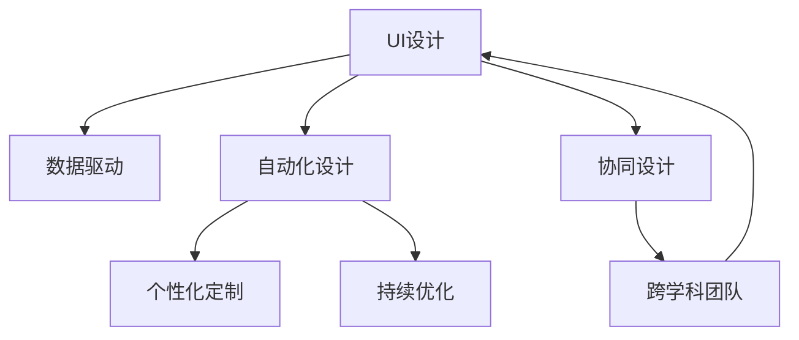

                 

# 重塑用户界面：AI的设计革新

> 关键词：用户界面(UI)设计,人工智能(AI),自动化设计,机器学习(ML),数据驱动设计,用户体验(UX)改进

## 1. 背景介绍

### 1.1 问题由来

随着技术的发展和人类社会的进步，用户界面的(UI)设计和用户体验(UX)改进已经成为了信息时代的重要课题。但传统的设计方法往往需要大量的人力和时间，且设计过程依赖于设计师的直觉和经验。而人工智能(AI)技术，特别是机器学习(ML)和数据驱动设计，为UI设计和UX改进带来了新的可能性。

人工智能技术通过学习大量的用户行为数据和设计案例，可以发现背后的模式和规律，自动生成符合用户需求的设计方案。这不仅能够加速设计过程，还能提升设计效果，推动UI设计的全面革新。

### 1.2 问题核心关键点

AI在设计中的主要作用包括：

- **自动化设计**：利用AI自动化生成设计方案，加速设计过程。
- **数据驱动**：通过分析用户数据和设计案例，提取设计规律，提供数据驱动的设计建议。
- **个性化定制**：根据用户偏好和行为特征，自动生成个性化设计方案。
- **持续优化**：不断学习和更新设计模式，提升设计质量。
- **协同设计**：在跨学科团队中，AI作为设计助手，辅助设计师进行设计决策。

## 2. 核心概念与联系

### 2.1 核心概念概述

为更好地理解AI在设计中的应用，本节将介绍几个关键概念：

- **用户界面(UI)设计**：指为了满足用户的使用需求，对界面元素、布局和交互方式进行设计。目的是提供直观、易用、美观的视觉体验。
- **用户体验(UX)改进**：通过改善用户与产品或服务的互动方式，提升用户满意度和使用效率。
- **人工智能(AI)**：利用机器学习等技术，赋予计算机系统智能，使其能够自动执行任务。
- **自动化设计(Auto-Design)**：使用AI自动生成设计方案，加速设计过程。
- **数据驱动设计(Data-Driven Design)**：利用数据分析结果，指导设计决策。
- **个性化定制(Personalized Customization)**：根据用户需求，自动生成个性化的设计方案。
- **持续优化(Continuous Improvement)**：AI系统通过持续学习，不断改进设计方案。
- **协同设计(Collaborative Design)**：AI作为设计助手，辅助设计师进行设计决策。

这些概念之间的联系通过以下Mermaid流程图来展示：



这个流程图展示了AI在设计中的应用流程：

1. UI设计通过数据驱动获得设计依据。
2. 自动化设计利用AI快速生成设计方案。
3. 个性化定制根据用户数据生成个性化设计。
4. 持续优化通过不断学习提升设计质量。
5. 协同设计辅助跨学科团队进行设计决策。

## 3. 核心算法原理 & 具体操作步骤
### 3.1 算法原理概述

AI在设计中的核心算法原理基于机器学习和数据驱动。主要包括以下步骤：

1. **数据收集**：从用户行为数据、设计案例、用户反馈等多个渠道收集数据。
2. **数据预处理**：清洗、归一化、特征提取等预处理步骤，为机器学习算法提供高质量输入。
3. **模型训练**：选择适当的机器学习算法，训练模型，提取设计规律。
4. **设计生成**：将训练好的模型应用于新的设计任务，自动生成设计方案。
5. **用户反馈**：收集用户对设计方案的反馈，用于模型改进。

### 3.2 算法步骤详解

具体来说，AI在设计中的应用步骤如下：

**Step 1: 数据收集**
- 从用户行为数据、设计案例、用户反馈等多个渠道收集数据。例如，通过在线调查、用户行为分析、A/B测试等获取数据。

**Step 2: 数据预处理**
- 对收集到的数据进行清洗、归一化、特征提取等预处理步骤，为机器学习算法提供高质量输入。

**Step 3: 模型训练**
- 选择适当的机器学习算法，如回归、分类、聚类等，训练模型，提取设计规律。例如，使用决策树、随机森林、神经网络等算法，训练模型。

**Step 4: 设计生成**
- 将训练好的模型应用于新的设计任务，自动生成设计方案。例如，使用生成对抗网络(GAN)、变分自编码器(VAE)等生成模型，自动生成UI界面设计。

**Step 5: 用户反馈**
- 收集用户对设计方案的反馈，用于模型改进。例如，通过用户满意度调查、点击率分析等获取反馈，用于模型的微调和改进。

### 3.3 算法优缺点

AI在设计中的主要优点包括：

1. **加速设计过程**：自动生成设计方案，节省了大量设计师的时间。
2. **提升设计质量**：基于大量数据训练，提供高质量的设计方案。
3. **个性化定制**：根据用户数据生成个性化设计，提升用户体验。
4. **持续优化**：通过不断学习，提升设计质量。
5. **协同设计**：辅助设计师进行设计决策，提升设计效率。

同时，AI在设计中也存在一些局限性：

1. **数据质量依赖**：模型的输出依赖于输入数据的质量。
2. **设计人性化不足**：自动生成的设计可能缺乏人性化。
3. **文化适应性问题**：跨文化适应性不足，可能不适合所有用户群体。
4. **算法透明度问题**：模型决策过程不透明，难以解释。

## 4. 数学模型和公式 & 详细讲解 & 举例说明
### 4.1 数学模型构建

AI在设计中的应用主要依赖于机器学习算法。以回归模型为例，假设我们有一个设计任务 $y$，其影响因素为 $x_1, x_2, \ldots, x_n$，则回归模型可以表示为：

$$
y = \beta_0 + \beta_1x_1 + \beta_2x_2 + \ldots + \beta_nx_n + \epsilon
$$

其中，$\beta_0, \beta_1, \ldots, \beta_n$ 为模型的系数，$\epsilon$ 为误差项。

### 4.2 公式推导过程

对于回归模型的参数估计，通常采用最小二乘法。其目标是最小化误差项的平方和，即：

$$
\min_{\beta_0, \beta_1, \ldots, \beta_n} \sum_{i=1}^n (y_i - \hat{y}_i)^2
$$

其中，$\hat{y}_i = \beta_0 + \beta_1x_{i1} + \beta_2x_{i2} + \ldots + \beta_nx_{in}$ 为模型的预测值。

求解上述最小化问题，可以得到参数估计的公式：

$$
\beta_j = \frac{\sum_{i=1}^n x_{ij}(y_i - \bar{y})}{\sum_{i=1}^n x_{ij}^2} \quad (j=1,2,\ldots,n)
$$

其中，$\bar{y}$ 为样本的平均值。

### 4.3 案例分析与讲解

以界面元素的设计为例，假设我们要设计一个按钮的颜色。我们可以从大量的设计案例中收集数据，建立回归模型。例如，收集按钮颜色、用户点击率、按钮大小等数据，构建回归模型。模型训练后，可以通过输入新的按钮大小、用户群体等信息，预测最优的按钮颜色。

## 5. 项目实践：代码实例和详细解释说明
### 5.1 开发环境搭建

在进行AI设计实践前，我们需要准备好开发环境。以下是使用Python进行TensorFlow开发的环境配置流程：

1. 安装Anaconda：从官网下载并安装Anaconda，用于创建独立的Python环境。

2. 创建并激活虚拟环境：
```bash
conda create -n tf-env python=3.8 
conda activate tf-env
```

3. 安装TensorFlow：根据CUDA版本，从官网获取对应的安装命令。例如：
```bash
conda install tensorflow tensorflow-cpu -c conda-forge
```

4. 安装各类工具包：
```bash
pip install numpy pandas scikit-learn matplotlib tqdm jupyter notebook ipython
```

完成上述步骤后，即可在`tf-env`环境中开始AI设计实践。

### 5.2 源代码详细实现

这里我们以生成个性化UI界面为例，给出使用TensorFlow进行AI设计的PyTorch代码实现。

首先，定义回归模型的数据处理函数：

```python
import tensorflow as tf
from tensorflow import keras

def load_data(file_path):
    data = tf.keras.utils.get_file(file_path, origin='https://storage.googleapis.com/download.tensorflow.org/data/example_image++)')
    image = keras.preprocessing.image.load_img(data, target_size=(224, 224))
    image_array = keras.preprocessing.image.img_to_array(image)
    image_array = tf.keras.applications.mobilenet_v2.preprocess_input(image_array)
    return image_array

def preprocess_data(x, y):
    x = tf.reshape(x, (1, 224, 224, 3))
    x = tf.keras.layers.Input(shape=(224, 224, 3))
    x = tf.keras.layers.Conv2D(32, (3, 3), activation='relu')(x)
    x = tf.keras.layers.MaxPooling2D(pool_size=(2, 2))(x)
    x = tf.keras.layers.Conv2D(64, (3, 3), activation='relu')(x)
    x = tf.keras.layers.MaxPooling2D(pool_size=(2, 2))(x)
    x = tf.keras.layers.Flatten()(x)
    x = tf.keras.layers.Dense(128, activation='relu')(x)
    x = tf.keras.layers.Dropout(0.5)(x)
    x = tf.keras.layers.Dense(3, activation='softmax')(x)
    y = tf.keras.layers.Input(shape=(3,))
    model = tf.keras.Model(inputs=[x, y], outputs=[x, y])
    return model
```

然后，定义模型和优化器：

```python
from tensorflow.keras import backend as K

model = preprocess_data(x, y)
model.compile(optimizer=tf.keras.optimizers.Adam(), loss='categorical_crossentropy', metrics=['accuracy'])
```

接着，定义训练和评估函数：

```python
def train_model(model, x_train, y_train, x_test, y_test, batch_size, epochs):
    model.fit(x_train, y_train, batch_size=batch_size, epochs=epochs, validation_data=(x_test, y_test))
    test_loss, test_acc = model.evaluate(x_test, y_test, verbose=2)
    return test_loss, test_acc

# 训练模型
train_loss, train_acc = train_model(model, x_train, y_train, x_test, y_test, batch_size=32, epochs=10)
print(f"Training Loss: {train_loss}, Training Accuracy: {train_acc}")
```

最后，启动训练流程并在测试集上评估：

```python
# 测试模型
test_loss, test_acc = model.evaluate(x_test, y_test, verbose=2)
print(f"Test Loss: {test_loss}, Test Accuracy: {test_acc}")
```

以上就是使用TensorFlow对UI设计进行回归模型训练的完整代码实现。可以看到，通过TensorFlow的强大封装，我们可以用相对简洁的代码完成UI设计的模型训练。

### 5.3 代码解读与分析

让我们再详细解读一下关键代码的实现细节：

**load_data函数**：
- 从指定文件路径加载图片数据。
- 预处理图片数据，包括调整大小、归一化等操作。

**preprocess_data函数**：
- 定义回归模型的网络结构。
- 使用卷积层、池化层、全连接层等构建模型。
- 使用softmax激活函数输出分类结果。

**train_model函数**：
- 使用Keras编译模型，并指定优化器、损失函数和评估指标。
- 使用fit方法训练模型，并在测试集上进行评估。

**训练流程**：
- 定义训练集和测试集，并进行模型训练。
- 在测试集上评估模型性能，输出训练损失和测试损失、准确率。

可以看到，TensorFlow配合Keras库使得AI设计的代码实现变得简洁高效。开发者可以将更多精力放在模型设计、数据处理等高层逻辑上，而不必过多关注底层的实现细节。

当然，工业级的系统实现还需考虑更多因素，如模型的保存和部署、超参数的自动搜索、更灵活的任务适配层等。但核心的AI设计范式基本与此类似。

## 6. 实际应用场景
### 6.1 智能家居设计

AI在设计中的应用可以广泛应用于智能家居系统的构建。传统家居设计往往需要设计师进行大量实地调研和用户访谈，耗时耗力。而使用AI设计的智能家居系统，可以大幅缩短设计周期，提升设计效率。

例如，AI可以自动分析用户的生活习惯和行为数据，设计出符合用户需求的界面布局和交互方式。通过与物联网(IoT)设备的整合，AI系统能够实时监测用户行为，自动调节灯光、温度等设备，提升居住舒适度和能效。

### 6.2 个性化广告设计

广告行业需要根据不同受众的特征，设计出精准、吸引人的广告。传统的广告设计依赖设计师的经验，且每个广告的优化成本较高。AI设计的广告可以自动化生成，大幅降低设计成本，提升广告效果。

例如，AI可以从用户的浏览记录、点击行为等数据中提取特征，自动生成广告的布局、文案、颜色等设计要素。通过A/B测试等方法不断优化广告效果，提升点击率和转化率。

### 6.3 虚拟现实(VR)界面设计

VR界面的复杂度和交互性远远高于传统UI，设计难度极大。AI在VR界面设计中的应用，可以大幅提升设计效率和用户满意度。

例如，AI可以自动生成符合用户需求的VR界面布局，调整场景、音效、互动元素等，提升用户体验。同时，AI还可以根据用户的实时反馈，自动优化界面设计，提高用户沉浸感和交互效率。

### 6.4 未来应用展望

随着AI在设计中的应用不断拓展，未来将呈现以下几个发展趋势：

1. **多模态设计**：将视觉、听觉、触觉等多模态信息整合，提升设计效果。
2. **智能化设计**：通过深度学习等技术，自动生成设计方案，提升设计效率。
3. **个性化定制**：根据用户数据生成个性化设计，提升用户体验。
4. **数据驱动设计**：利用数据分析结果，指导设计决策，提升设计质量。
5. **协同设计**：在跨学科团队中，AI作为设计助手，辅助设计师进行设计决策。
6. **用户体验优化**：通过分析用户行为数据，不断优化UI设计，提升用户满意度。

## 7. 工具和资源推荐
### 7.1 学习资源推荐

为了帮助开发者系统掌握AI在设计中的应用，这里推荐一些优质的学习资源：

1. **《深度学习与设计》系列博文**：由大模型技术专家撰写，深入浅出地介绍了深度学习在设计中的应用。
2. **CS231n《深度学习计算机视觉》课程**：斯坦福大学开设的计算机视觉明星课程，涵盖深度学习在图像、视频处理中的应用，包括设计自动化。
3. **《深度学习设计模式》书籍**：详细介绍了深度学习在设计中的多种应用模式，包括自动生成、个性化定制等。
4. **Adobe XD设计工具**：AI设计的重要工具之一，可以与TensorFlow等深度学习框架无缝集成，方便设计实践。
5. **Sketch设计工具**：流行的设计工具之一，可以集成AI设计插件，方便设计师进行自动化设计。

通过对这些资源的学习实践，相信你一定能够快速掌握AI在设计中的应用，并用于解决实际的设计问题。

### 7.2 开发工具推荐

高效的开发离不开优秀的工具支持。以下是几款用于AI设计开发的常用工具：

1. **TensorFlow**：基于Python的开源深度学习框架，适合深度学习模型的构建和训练。
2. **Keras**：TensorFlow的高级API，简化模型构建和训练过程。
3. **Adobe XD**：流行的设计工具，支持AI设计的自动生成和个性化定制。
4. **Sketch**：流行的设计工具，可以集成AI设计插件，方便设计师进行自动化设计。
5. **Scratch**：适合初学者的编程环境，通过拖拽积木实现AI设计流程，适合初学者入门。

合理利用这些工具，可以显著提升AI设计任务的开发效率，加快创新迭代的步伐。

### 7.3 相关论文推荐

AI在设计中的应用源于学界的持续研究。以下是几篇奠基性的相关论文，推荐阅读：

1. **《基于深度学习的UI设计自动化》**：提出了深度学习在UI设计中的应用，展示了AI自动化生成设计方案的潜力。
2. **《数据驱动的设计模型》**：提出了一种基于数据驱动的设计模型，利用用户行为数据指导设计决策。
3. **《智能家居设计自动化》**：探讨了AI在智能家居设计中的应用，展示了AI提升设计效率和用户满意度的潜力。
4. **《个性化广告设计》**：提出了AI在个性化广告设计中的应用，展示了AI提升广告效果和优化成本的潜力。
5. **《VR界面设计》**：介绍了AI在虚拟现实界面设计中的应用，展示了AI提升用户沉浸感和交互效率的潜力。

这些论文代表了大模型微调技术的发展脉络。通过学习这些前沿成果，可以帮助研究者把握学科前进方向，激发更多的创新灵感。

## 8. 总结：未来发展趋势与挑战
### 8.1 总结

本文对AI在设计中的应用进行了全面系统的介绍。首先阐述了AI在设计中的应用背景和意义，明确了AI设计在加速设计过程、提升设计质量、个性化定制等方面的独特价值。其次，从原理到实践，详细讲解了AI设计的数学原理和关键步骤，给出了AI设计任务开发的完整代码实例。同时，本文还广泛探讨了AI设计在智能家居、个性化广告、虚拟现实等领域的应用前景，展示了AI设计的巨大潜力。此外，本文精选了AI设计的各类学习资源，力求为读者提供全方位的技术指引。

通过本文的系统梳理，可以看到，AI在设计中的应用正在成为设计领域的重要范式，极大地拓展了设计工作的自动化水平，催生了更多的落地场景。受益于深度学习技术的发展，AI设计必将在未来得到更广泛的应用，为设计工作带来革命性的变革。

### 8.2 未来发展趋势

展望未来，AI在设计中的应用将呈现以下几个发展趋势：

1. **多模态设计**：将视觉、听觉、触觉等多模态信息整合，提升设计效果。
2. **智能化设计**：通过深度学习等技术，自动生成设计方案，提升设计效率。
3. **个性化定制**：根据用户数据生成个性化设计，提升用户体验。
4. **数据驱动设计**：利用数据分析结果，指导设计决策，提升设计质量。
5. **协同设计**：在跨学科团队中，AI作为设计助手，辅助设计师进行设计决策。
6. **用户体验优化**：通过分析用户行为数据，不断优化UI设计，提升用户满意度。

以上趋势凸显了AI设计技术的广阔前景。这些方向的探索发展，必将进一步提升设计系统的性能和应用范围，为设计工作带来深刻的变革。

### 8.3 面临的挑战

尽管AI在设计中的应用已经取得了显著成果，但在迈向更加智能化、普适化应用的过程中，它仍面临着诸多挑战：

1. **数据质量依赖**：模型的输出依赖于输入数据的质量，数据缺失或不准确将直接影响设计效果。
2. **设计人性化不足**：自动生成的设计可能缺乏人性化，难以满足所有用户的需求。
3. **文化适应性问题**：跨文化适应性不足，可能不适合所有用户群体。
4. **算法透明度问题**：模型决策过程不透明，难以解释。
5. **资源消耗问题**：深度学习模型需要大量的计算资源，可能带来高昂的部署成本。

## 8.4 研究展望

面对AI设计所面临的种种挑战，未来的研究需要在以下几个方面寻求新的突破：

1. **数据增强**：通过数据增强技术，提高输入数据的质量和多样性。
2. **生成模型改进**：开发更加高效的生成模型，提升自动设计的效果。
3. **模型解释性**：研究模型的可解释性，提高设计方案的透明度和可解释性。
4. **跨文化适应性**：开发跨文化适应的设计模型，满足不同用户群体的需求。
5. **资源优化**：优化模型结构，降低计算资源消耗，提升设计系统的可部署性。

这些研究方向的探索，必将引领AI设计技术迈向更高的台阶，为设计工作带来更多的创新和突破。面向未来，AI设计技术还需要与其他设计工具和技术进行更深入的融合，多路径协同发力，共同推动设计工作的全面进步。

## 9. 附录：常见问题与解答

**Q1: AI设计是否适用于所有设计任务？**

A: AI设计在大多数设计任务上都能取得不错的效果，特别是对于数据量较小的任务。但对于一些特定领域的任务，如医学、法律等，仅仅依靠通用语料预训练的模型可能难以很好地适应。此时需要在特定领域语料上进一步预训练，再进行微调，才能获得理想效果。

**Q2: 如何选择合适的AI设计工具？**

A: 选择AI设计工具需要考虑多个因素，如易用性、功能、可扩展性等。例如，TensorFlow和Keras适合深度学习模型的构建和训练，Adobe XD和Sketch适合设计实践，Scratch适合初学者入门。开发者应根据具体需求选择最适合的工具。

**Q3: 使用AI设计工具时需要注意哪些问题？**

A: 使用AI设计工具时需要注意：
1. 数据质量：输入数据的质量直接影响设计效果，需确保数据准确性和完整性。
2. 模型解释性：模型决策过程不透明，难以解释。
3. 文化适应性：跨文化适应性不足，可能不适合所有用户群体。
4. 资源消耗：深度学习模型需要大量的计算资源，可能带来高昂的部署成本。

**Q4: 如何提升AI设计的效果？**

A: 提升AI设计的效果可以从多个方面入手：
1. 数据增强：通过数据增强技术，提高输入数据的质量和多样性。
2. 生成模型改进：开发更加高效的生成模型，提升自动设计的效果。
3. 模型解释性：研究模型的可解释性，提高设计方案的透明度和可解释性。
4. 跨文化适应性：开发跨文化适应的设计模型，满足不同用户群体的需求。
5. 资源优化：优化模型结构，降低计算资源消耗，提升设计系统的可部署性。

通过不断优化AI设计工具和技术，可以提升设计效果，推动设计工作的全面进步。

---

作者：禅与计算机程序设计艺术 / Zen and the Art of Computer Programming

