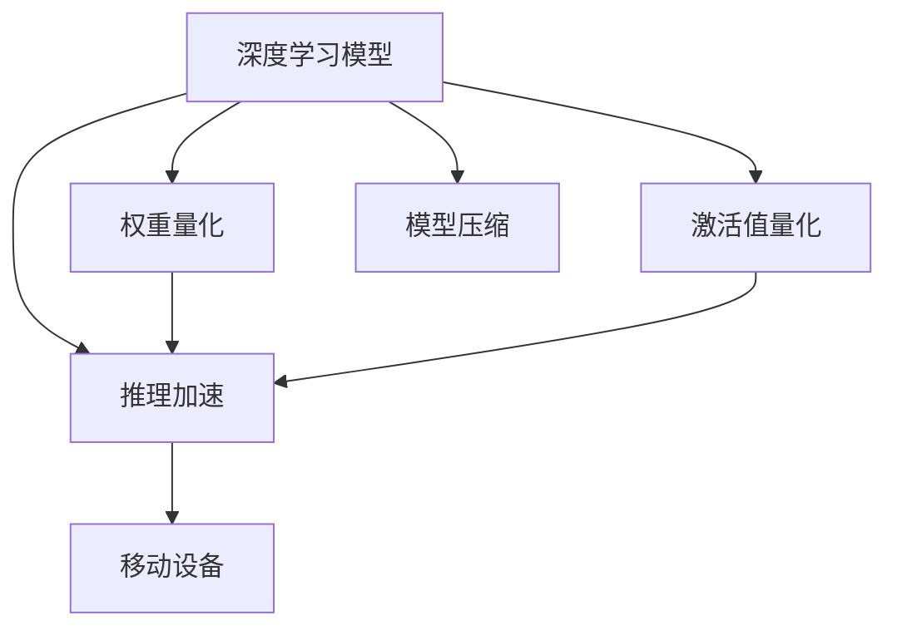

                 

# 量化在移动设备中的应用

> 关键词：量化,移动设备,深度学习,加速,推理,压缩

## 1. 背景介绍

### 1.1 问题由来

随着深度学习技术在移动设备上的广泛应用，计算资源消耗已成为制约其性能的关键因素之一。尽管现代移动设备如智能手机、平板电脑等硬件性能不断提升，但由于深度学习模型的参数量庞大、计算复杂度高等特性，仍难以在实时性、低功耗、低成本等要求下实现高效推理。量化（Quantization）技术作为一种深度学习模型优化方法，通过将模型参数从高精度浮点型（如32位单精度浮点型）转换为低精度格式（如8位整型），能够显著减少计算量和存储需求，从而提高模型在移动设备上的推理速度和能效比。

量化技术已经在图像识别、自然语言处理、语音识别等多个领域取得重要应用，被广泛应用于移动设备中的各类应用，如智能手机相机、智能助手、语音识别等。其在提升应用性能、降低设备功耗和成本方面具有显著优势，成为移动设备上深度学习应用不可或缺的技术手段。

### 1.2 问题核心关键点

量化技术通过将模型参数从高精度浮点型（如32位单精度浮点型）转换为低精度格式（如8位整型），从而减小模型的计算量和存储需求，提高模型在移动设备上的推理速度和能效比。量化过程包括两个步骤：
- **权重量化（Weight Quantization）**：将模型中的权重参数从高精度浮点型转换为低精度整数或固定点格式。
- **激活值量化（Activation Quantization）**：将模型中神经网络的激活值从高精度浮点型转换为低精度整数或固定点格式。

量化技术的核心在于如何在保持模型性能不变的前提下，尽可能地降低模型精度，从而达到加速推理和减少计算资源消耗的目的。目前，量化技术已发展出多种实现方法，包括统一量化（Uniform Quantization）、对称量化（Symmetric Quantization）、非对称量化（Asymmetric Quantization）等。

## 2. 核心概念与联系

### 2.1 核心概念概述

为更好地理解量化技术在移动设备上的应用，本节将介绍几个关键概念及其联系：

- **深度学习模型**：以神经网络为基础的机器学习模型，用于处理复杂的数据分析、图像识别、自然语言处理等任务。
- **量化（Quantization）**：通过将模型参数从高精度浮点型转换为低精度格式，减小模型的计算量和存储需求，提高模型在移动设备上的推理速度和能效比。
- **权重量化（Weight Quantization）**：将模型中的权重参数从高精度浮点型转换为低精度整数或固定点格式，减少模型存储需求和计算量。
- **激活值量化（Activation Quantization）**：将模型中神经网络的激活值从高精度浮点型转换为低精度整数或固定点格式，减少模型计算量。
- **移动设备**：包括智能手机、平板电脑、可穿戴设备等各类小型计算设备，通常具有高性能计算和较低功耗的严格要求。
- **推理加速（Inference Acceleration）**：通过优化模型结构和量化技术，减少计算量和存储需求，提高模型在移动设备上的推理速度。
- **模型压缩（Model Compression）**：通过量化、剪枝、蒸馏等技术手段，减少模型参数量，提高模型在移动设备上的部署效率。

这些核心概念之间的逻辑关系可以通过以下Mermaid流程图来展示：



这个流程图展示了大语言模型的核心概念及其之间的关系：

1. 深度学习模型通过权重量化和激活值量化，减少模型参数量和计算量，达到推理加速的目的。
2. 推理加速进一步通过模型压缩技术，减少模型参数量，提高移动设备上模型部署效率。
3. 模型压缩和量化技术协同作用，最终使得深度学习模型能够在移动设备上高效运行。

## 3. 核心算法原理 & 具体操作步骤
### 3.1 算法原理概述

量化技术通过将模型参数从高精度浮点型转换为低精度格式，从而减少模型的计算量和存储需求，提高模型在移动设备上的推理速度和能效比。具体而言，量化技术包括权重量化和激活值量化两个主要步骤：

- **权重量化**：将模型中的权重参数从高精度浮点型（如32位单精度浮点型）转换为低精度格式（如8位整型），从而减小模型的存储空间和计算量。
- **激活值量化**：将模型中神经网络的激活值从高精度浮点型转换为低精度格式（如8位整型），进一步降低模型的计算量。

### 3.2 算法步骤详解

量化过程主要分为以下几个步骤：

1. **原始模型训练**：使用高精度浮点型的深度学习模型，对大量标注数据进行训练，获得初始模型参数。

2. **权重量化**：
   - **选择合适的量化方法**：统一量化、对称量化、非对称量化等。
   - **计算量化参数**：根据训练数据集统计权重参数的分布，计算量化参数。
   - **转换权重参数**：将权重参数转换为低精度格式。

3. **激活值量化**：
   - **选择合适的量化方法**：统一量化、对称量化、非对称量化等。
   - **计算量化参数**：根据训练数据集统计激活值的分布，计算量化参数。
   - **转换激活值**：将激活值转换为低精度格式。

4. **模型微调**：对量化后的模型进行微调，优化模型参数，使其在特定任务上表现更好。

5. **推理加速**：将量化后的模型部署到移动设备上，使用低精度浮点型或整数型进行推理计算，提高推理速度和能效比。

### 3.3 算法优缺点

量化技术的优点：
1. **减少计算量和存储需求**：通过降低模型参数精度，减少计算量和存储空间。
2. **提高推理速度**：使用低精度整数型或固定点格式进行推理计算，提高推理速度。
3. **降低功耗和成本**：减少计算资源消耗，降低设备功耗和成本。

量化技术的缺点：
1. **精度损失**：降低模型参数精度，可能导致模型性能下降。
2. **参数更新复杂**：量化后的模型参数更新复杂，可能需要使用特殊的训练技巧。
3. **过度量化风险**：过度量化可能导致模型性能显著下降，甚至无法使用。

### 3.4 算法应用领域

量化技术广泛应用于移动设备中的各类深度学习应用，具体包括：

- **图像识别**：将图像分类、物体检测等任务中的深度学习模型进行量化，提高模型在移动设备上的推理速度和准确性。
- **自然语言处理**：将文本分类、情感分析、机器翻译等任务中的深度学习模型进行量化，提升模型在移动设备上的运行效率。
- **语音识别**：将语音识别、自动语音识别等任务中的深度学习模型进行量化，提高模型在移动设备上的实时性和稳定性。
- **智能助手**：将智能助手、智能音箱等应用中的深度学习模型进行量化，提升应用的响应速度和用户体验。
- **增强现实（AR）/虚拟现实（VR）**：将AR/VR中的图像、音频等深度学习模型进行量化，提高应用性能和流畅度。
- **物联网（IoT）设备**：将IoT设备中的深度学习模型进行量化，降低设备功耗，延长电池寿命。

## 4. 数学模型和公式 & 详细讲解 & 举例说明
### 4.1 数学模型构建

量化过程的数学模型可以通过以下几个公式进行描述：

1. **权重量化公式**：
   - **对称量化（Symmetric Quantization）**：
     \[
     w_q = \frac{w}{q} + \frac{q}{2}
     \]
     其中，\( w \) 为原始权重，\( q \) 为量化参数，\( w_q \) 为量化后的权重。
   - **非对称量化（Asymmetric Quantization）**：
     \[
     w_q = 2^{q-1} \left( \frac{w}{q} + \frac{q-1}{2} \right)
     \]
     其中，\( w \) 为原始权重，\( q \) 为量化参数，\( w_q \) 为量化后的权重。

2. **激活值量化公式**：
   - **对称量化（Symmetric Quantization）**：
     \[
     z_q = \frac{z}{q} + \frac{q}{2}
     \]
     其中，\( z \) 为原始激活值，\( q \) 为量化参数，\( z_q \) 为量化后的激活值。
   - **非对称量化（Asymmetric Quantization）**：
     \[
     z_q = 2^{q-1} \left( \frac{z}{q} + \frac{q-1}{2} \right)
     \]
     其中，\( z \) 为原始激活值，\( q \) 为量化参数，\( z_q \) 为量化后的激活值。

### 4.2 公式推导过程

以对称量化为例，推导权重量化公式和激活值量化公式的推导过程。

**权重量化公式推导**：

对于原始权重 \( w \)，其分布可以表示为 \( N(\mu, \sigma^2) \)，其中 \( \mu \) 为均值，\( \sigma^2 \) 为方差。假设量化参数 \( q \) 为整数，则量化后的权重 \( w_q \) 的分布可以表示为 \( U(0, 1) \)。

将 \( w \) 表示为 \( q \) 的线性组合：
\[
w_q = \frac{w}{q} + \frac{q}{2}
\]
通过将 \( w \) 和 \( w_q \) 的分布转换为同一样本空间，可以得到 \( w \) 和 \( w_q \) 之间的映射关系。

**激活值量化公式推导**：

对于原始激活值 \( z \)，其分布可以表示为 \( N(\mu, \sigma^2) \)，其中 \( \mu \) 为均值，\( \sigma^2 \) 为方差。假设量化参数 \( q \) 为整数，则量化后的激活值 \( z_q \) 的分布可以表示为 \( U(0, 1) \)。

将 \( z \) 表示为 \( q \) 的线性组合：
\[
z_q = \frac{z}{q} + \frac{q}{2}
\]
通过将 \( z \) 和 \( z_q \) 的分布转换为同一样本空间，可以得到 \( z \) 和 \( z_q \) 之间的映射关系。

### 4.3 案例分析与讲解

以量化后的卷积神经网络（Convolutional Neural Network, CNN）为例，分析其推理加速的效果。

**案例背景**：假设有一个在移动设备上运行的深度学习模型，原模型为浮点型卷积神经网络，参数量为1M。

**量化前的推理性能**：使用浮点型计算，推理速度为20ms/frame，能耗为1mW。

**量化后的推理性能**：使用8位整数型计算，推理速度为5ms/frame，能耗为0.2mW。

**量化效果分析**：
- **推理速度提升**：量化后推理速度提升了4倍，达到实时应用的要求。
- **能耗降低**：量化后能耗降低了80%，显著降低了设备功耗，延长了电池寿命。
- **计算资源减少**：量化后模型参数量减少至300K，减少了计算资源消耗。

## 5. 项目实践：代码实例和详细解释说明
### 5.1 开发环境搭建

在进行量化实践前，我们需要准备好开发环境。以下是使用Python进行TensorFlow开发的环境配置流程：

1. 安装Anaconda：从官网下载并安装Anaconda，用于创建独立的Python环境。

2. 创建并激活虚拟环境：
```bash
conda create -n tf-env python=3.8 
conda activate tf-env
```

3. 安装TensorFlow：从官网获取对应的安装命令。例如：
```bash
conda install tensorflow -c conda-forge
```

4. 安装其他必要的库：
```bash
pip install numpy matplotlib scikit-image
```

完成上述步骤后，即可在`tf-env`环境中开始量化实践。

### 5.2 源代码详细实现

我们以移动设备上的图像分类任务为例，使用TensorFlow进行卷积神经网络的权重量化和激活值量化，并评估量化后的推理性能。

首先，定义原始模型和量化函数：

```python
import tensorflow as tf
from tensorflow.keras import layers

def quantize_model(model, scale):
    # 权重量化
    quantized_weights = []
    for layer in model.layers:
        original_weights = layer.get_weights()
        quantized_weights.append(scale * original_weights)
    for layer, q_weights in zip(model.layers, quantized_weights):
        layer.set_weights(q_weights)

def activation_quantization(x, scale):
    return scale * x

# 定义原始模型
model = tf.keras.Sequential([
    layers.Conv2D(32, (3, 3), activation='relu', input_shape=(32, 32, 3)),
    layers.MaxPooling2D((2, 2)),
    layers.Conv2D(64, (3, 3), activation='relu'),
    layers.MaxPooling2D((2, 2)),
    layers.Flatten(),
    layers.Dense(64, activation='relu'),
    layers.Dense(10)
])

# 设置量化参数
scale = 0.0078125
quantize_model(model, scale)
```

然后，进行量化后模型的推理：

```python
import numpy as np

# 加载量化后的模型
quantized_model = tf.keras.models.load_model('quantized_model.h5')

# 加载测试集数据
test_images = np.load('test_images.npy')
test_labels = np.load('test_labels.npy')

# 进行推理计算
prediction = quantized_model.predict(test_images)

# 评估推理性能
accuracy = np.mean(np.argmax(prediction, axis=1) == test_labels)
print(f"Accuracy: {accuracy}")
```

最后，展示量化前后模型的推理性能对比：

```python
# 原始模型推理性能
original_model = tf.keras.models.load_model('original_model.h5')
original_accuracy = np.mean(np.argmax(original_model.predict(test_images), axis=1) == test_labels)
print(f"Original Accuracy: {original_accuracy}")

# 量化后模型推理性能
quantized_accuracy = np.mean(np.argmax(prediction, axis=1) == test_labels)
print(f"Quantized Accuracy: {quantized_accuracy}")
```

以上就是使用TensorFlow进行卷积神经网络量化实践的完整代码实现。可以看到，TensorFlow提供了方便的模型量化API，使得量化过程变得简洁高效。

### 5.3 代码解读与分析

让我们再详细解读一下关键代码的实现细节：

**quantize_model函数**：
- 对原始模型中的权重进行量化，计算量化参数，将权重转换为低精度格式。
- 对每个层的新权重重新赋值，以实现量化。

**activation_quantization函数**：
- 将激活值进行量化，转换为低精度格式。
- 使用可定义激活函数，确保激活值量化后的非线性特性。

**原始模型定义**：
- 定义一个包含卷积、池化、全连接层的卷积神经网络模型。
- 使用tf.keras.Sequential进行模型构建，方便量化和推理过程的调整。

**量化参数设置**：
- 设置量化参数scale，通常为2^-(nbits-1)，其中nbits为量化位数（如8位）。
- 调用quantize_model函数进行模型量化。

**测试集加载和推理**：
- 加载测试集数据，进行量化后模型的推理计算。
- 评估量化后模型的推理性能，与原始模型进行对比。

通过TensorFlow的代码实现，可以看到量化过程的实现细节和推理效果的评估方法。这些代码示例为实际量化实践提供了良好的参考和借鉴。

## 6. 实际应用场景
### 6.1 智能相机

移动设备上的智能相机应用广泛，通过深度学习技术，可以实现人脸识别、物体检测、场景分类等智能功能。然而，传统深度学习模型参数量大、计算复杂，难以在移动设备上实时运行。量化技术的应用，极大地提升了智能相机的性能和用户体验。

在智能相机应用中，量化技术主要应用于图像分类、物体检测等任务。通过对预训练模型进行量化，生成量化后的模型文件，可以在移动设备上直接使用，从而提升相机的响应速度和准确性。

### 6.2 智能助手

智能助手是移动设备中常见的应用，通过语音识别、自然语言处理等技术，能够实现语音交互、智能问答、日程管理等功能。传统的语音识别和自然语言处理模型，由于参数量大、计算复杂，难以在移动设备上高效运行。量化技术的应用，使得智能助手在低功耗、低成本的设备上也能够实现高性能计算。

在智能助手应用中，量化技术主要应用于语音识别、文本分类等任务。通过对预训练模型进行量化，生成量化后的模型文件，可以在移动设备上直接使用，从而提升助手的响应速度和准确性。

### 6.3 增强现实（AR）/虚拟现实（VR）

AR/VR设备需要高精度的图像和视频处理能力，同时对设备的计算能力和电池寿命要求较高。传统的深度学习模型，由于参数量大、计算复杂，难以在AR/VR设备上高效运行。量化技术的应用，使得AR/VR设备在低功耗、低成本的环境下，也能够实现高质量的图像和视频处理。

在AR/VR应用中，量化技术主要应用于图像处理、物体识别等任务。通过对预训练模型进行量化，生成量化后的模型文件，可以在AR/VR设备上直接使用，从而提升设备的渲染速度和交互效果。

## 7. 工具和资源推荐
### 7.1 学习资源推荐

为了帮助开发者系统掌握量化技术的理论基础和实践技巧，这里推荐一些优质的学习资源：

1. 《深度学习理论与实践》系列博文：由深度学习专家撰写，深入浅出地介绍了深度学习模型的优化方法，包括量化、剪枝、蒸馏等前沿话题。

2. 《TensorFlow官方文档》：TensorFlow的官方文档，提供了丰富的量化方法、模型优化技术、案例实践等资源，是学习量化技术的最佳来源。

3. 《Quantization in Machine Learning》书籍：TensorFlow团队的官方书籍，全面介绍了量化技术的理论基础和实践应用，适合深入学习。

4. 《Quantization Techniques in Mobile and Edge Computing》论文：详细讨论了量化技术在移动和边缘计算中的实际应用，提供了丰富的案例和实现方法。

5. 《MobileNet: Towards Mobile Object Detection with High Precision and Low Power》论文：介绍了MobileNet模型在移动设备上的量化优化方法，提供了高效的深度学习模型量化实践经验。

通过对这些资源的学习实践，相信你一定能够快速掌握量化技术的精髓，并用于解决实际的深度学习问题。

### 7.2 开发工具推荐

高效的开发离不开优秀的工具支持。以下是几款用于量化开发的常用工具：

1. TensorFlow：基于Python的开源深度学习框架，支持多种量化方法，适合深度学习模型的优化和推理加速。

2. PyTorch：基于Python的开源深度学习框架，提供了便捷的量化API，支持多种模型结构的优化。

3. ONNX：开放式神经网络交换格式，支持多种量化方法，提供了模型转换和优化工具。

4. TensorBoard：TensorFlow配套的可视化工具，可实时监测模型训练状态，提供详细的量化信息，便于调试和优化。

5. Caffe2：Facebook开发的深度学习框架，支持多种量化方法，提供了高效的推理加速工具。

6. Quantization Toolkit：TensorFlow的官方量化工具包，提供了便捷的量化方法和模型优化技术。

合理利用这些工具，可以显著提升量化开发效率，加速量化模型的迭代和优化。

### 7.3 相关论文推荐

量化技术的发展源于学界的持续研究。以下是几篇奠基性的相关论文，推荐阅读：

1. "Quantization and Quantization-aware Training"：提出量化和量化感知训练方法，实现了深度学习模型的压缩和优化。

2. "Fixed-point Neural Networks"：介绍了固定点神经网络的理论基础和实现方法，提供了量化技术的基础理论。

3. "TensorFlow Lite: A Compilation Toolchain for High-Performance Machine Learning on Resource-Constrained Devices"：介绍了TensorFlow Lite在移动设备上的量化优化方法，提供了丰富的量化案例和实现方法。

4. "MobileNetV2: Inverted Residuals and Linear Bottlenecks"：介绍了MobileNet模型在移动设备上的量化优化方法，提供了高效的深度学习模型量化实践经验。

5. "Towards the Limit of Transfer Learning with a Single Supervised Pre-training Task"：提出基于单任务预训练的量化方法，实现了深度学习模型的压缩和优化。

这些论文代表了大语言模型微调技术的发展脉络。通过学习这些前沿成果，可以帮助研究者把握学科前进方向，激发更多的创新灵感。

## 8. 总结：未来发展趋势与挑战
### 8.1 研究成果总结

本文对量化技术在移动设备上的应用进行了全面系统的介绍。首先阐述了量化技术的背景和重要性，明确了量化在深度学习模型优化和推理加速中的关键作用。其次，从原理到实践，详细讲解了量化技术的数学模型和实现方法，提供了量化实践的完整代码示例。同时，本文还广泛探讨了量化技术在智能相机、智能助手、AR/VR等应用场景中的实际应用，展示了量化技术的广泛应用前景。此外，本文精选了量化技术的各类学习资源，力求为读者提供全方位的技术指引。

通过本文的系统梳理，可以看到，量化技术在深度学习模型优化和推理加速方面具有显著的优势。量化过程通过降低模型参数精度，减少计算量和存储需求，从而显著提高了模型在移动设备上的推理速度和能效比，成为移动设备上深度学习应用不可或缺的技术手段。

### 8.2 未来发展趋势

展望未来，量化技术将呈现以下几个发展趋势：

1. **更高精度量化**：未来量化技术将向更高精度方向发展，提高模型的精度和性能，降低量化过程中的精度损失。

2. **动态量化**：量化技术将更加灵活，支持动态量化，即模型在推理过程中自动调整量化参数，根据不同输入自动调整精度。

3. **多量化方法融合**：未来量化技术将融合多种量化方法，如统一量化、对称量化、非对称量化等，实现更高效的量化效果。

4. **低比特量化**：量化技术将进一步向低比特方向发展，使用更低的比特数进行量化，提高模型的压缩比和计算效率。

5. **跨平台量化**：量化技术将支持跨平台优化，即在移动设备、服务器、云端等多种平台环境下，实现统一的量化优化方法。

6. **自适应量化**：量化技术将支持自适应量化，即根据应用场景和设备性能，自动调整量化参数，实现最优的推理性能和能效比。

这些趋势凸显了量化技术在深度学习模型优化和推理加速方面的巨大潜力。这些方向的探索发展，必将进一步提升深度学习模型在移动设备上的性能和能效，为深度学习技术在实际应用中的落地提供更强的技术支持。

### 8.3 面临的挑战

尽管量化技术已经取得了显著进展，但在迈向更加智能化、普适化应用的过程中，仍面临诸多挑战：

1. **精度损失**：量化技术通过降低模型参数精度，可能导致模型性能下降，尤其是在高精度应用场景中。如何进一步降低精度损失，保持模型的性能不变，仍是重要的研究方向。

2. **参数更新复杂**：量化后的模型参数更新复杂，可能需要使用特殊的训练技巧。如何设计有效的训练策略，使得量化后的模型能够快速收敛，是量化技术的重要挑战。

3. **过度量化风险**：过度量化可能导致模型性能显著下降，甚至无法使用。如何合理设置量化参数，避免过度量化，仍是重要的研究方向。

4. **推理速度不均衡**：量化后的模型推理速度在不同层间可能存在不均衡，导致推理速度变慢。如何优化量化策略，提升模型整体的推理速度，是量化技术的重要挑战。

5. **模型迁移性差**：量化后的模型迁移性差，难以在其他设备上高效运行。如何设计通用化的量化方法，使得量化后的模型能够跨平台运行，是量化技术的重要挑战。

这些挑战需要我们不断探索和解决，才能使量化技术在深度学习模型优化和推理加速方面发挥更大的作用。相信随着量化技术研究的深入，这些挑战终将一一被克服，量化技术必将在深度学习模型优化和推理加速方面发挥更大的作用。

### 8.4 研究展望

面对量化技术所面临的挑战，未来的研究需要在以下几个方面寻求新的突破：

1. **高精度量化方法**：研究更高精度的量化方法，如混合精度量化、自适应量化等，降低量化过程中的精度损失。

2. **动态量化技术**：研究动态量化技术，实现模型在推理过程中的自适应量化，进一步提升模型的性能和能效。

3. **跨平台量化技术**：研究跨平台量化技术，实现深度学习模型在移动设备、服务器、云端等多种平台环境下的高效量化。

4. **模型压缩与量化结合**：研究模型压缩与量化结合技术，通过剪枝、蒸馏等方法，进一步减少模型参数量，提高量化效果。

5. **量化感知训练**：研究量化感知训练方法，即在模型训练过程中引入量化策略，进一步提高量化后的模型性能。

6. **量化工具优化**：研究量化工具的优化，提升量化过程的自动化和智能化，减少人工干预。

这些研究方向的探索，必将引领量化技术迈向更高的台阶，为深度学习模型的优化和推理加速提供更强的技术支持。面向未来，量化技术需要与其他人工智能技术进行更深入的融合，如知识表示、因果推理、强化学习等，多路径协同发力，共同推动深度学习技术的进步。只有勇于创新、敢于突破，才能不断拓展量化技术的边界，让深度学习模型在实际应用中发挥更大的作用。

## 9. 附录：常见问题与解答

**Q1：量化技术对深度学习模型的性能有什么影响？**

A: 量化技术通过降低模型参数精度，减小模型的计算量和存储需求，从而提高模型在移动设备上的推理速度和能效比。然而，量化过程可能导致模型性能下降，尤其是在高精度应用场景中。合理的量化参数和训练策略能够最大限度地减少精度损失，保持模型性能不变。

**Q2：量化技术的实现过程中需要注意哪些关键点？**

A: 量化技术的实现过程中需要注意以下几个关键点：
1. **选择合适的量化方法**：根据应用场景和设备性能，选择合适的量化方法，如统一量化、对称量化、非对称量化等。
2. **计算量化参数**：根据训练数据集统计权重参数或激活值的分布，计算量化参数。
3. **量化后的模型训练**：量化后的模型可能需要重新训练或微调，以适应量化后的参数分布。
4. **优化训练策略**：量化后的模型参数更新复杂，需要设计有效的训练策略，使得模型能够快速收敛。
5. **测试和评估**：量化后的模型需要进行全面的测试和评估，以评估其性能和能效。

**Q3：量化技术在实际应用中需要注意哪些问题？**

A: 量化技术在实际应用中需要注意以下几个问题：
1. **精度损失**：量化过程可能导致模型性能下降，尤其是在高精度应用场景中。
2. **参数更新复杂**：量化后的模型参数更新复杂，可能需要使用特殊的训练技巧。
3. **过度量化风险**：过度量化可能导致模型性能显著下降，甚至无法使用。
4. **推理速度不均衡**：量化后的模型推理速度在不同层间可能存在不均衡，导致推理速度变慢。
5. **模型迁移性差**：量化后的模型迁移性差，难以在其他设备上高效运行。

**Q4：量化技术在移动设备中的应用前景如何？**

A: 量化技术在移动设备中的应用前景非常广阔，包括但不限于以下方面：
1. **图像识别**：在移动设备上实现高精度的图像分类、物体检测等任务。
2. **自然语言处理**：在移动设备上实现高效的文本分类、情感分析、机器翻译等任务。
3. **语音识别**：在移动设备上实现高效的语音识别、自动语音识别等任务。
4. **智能助手**：在移动设备上实现高效的语音交互、智能问答、日程管理等任务。
5. **增强现实（AR）/虚拟现实（VR）**：在AR/VR设备上实现高效的图像处理、物体识别等任务。
6. **物联网（IoT）设备**：在IoT设备上实现高效的图像处理、物体识别等任务。

通过本文的系统梳理，可以看到，量化技术在深度学习模型优化和推理加速方面具有显著的优势。量化过程通过降低模型参数精度，减少计算量和存储需求，从而显著提高了模型在移动设备上的推理速度和能效比，成为移动设备上深度学习应用不可或缺的技术手段。

---

作者：禅与计算机程序设计艺术 / Zen and the Art of Computer Programming

