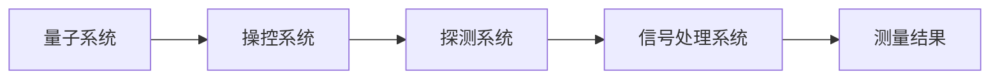

                 

# 量子传感器：原理与潜在应用

> 关键词：量子传感器,量子测量,量子计算,高精度测量,精密测量,量子技术

## 1. 背景介绍

### 1.1 问题由来

在现代科技日益发展的今天，各种精密测量技术在医学、物理、工程、工业等领域得到了广泛应用。然而，传统的测量方法如经典电学、光学传感器等存在测量精度低、抗干扰能力弱等局限性，无法满足越来越高的应用需求。

量子传感器作为新一代的测量技术，通过量子态的测量与操控实现超高的测量精度和灵敏度。基于量子力学的原理，量子传感器利用量子叠加态、纠缠态等量子现象，能够突破经典测量的瓶颈，在实现高精度测量的同时，提供前所未有的测控能力。

本文将详细介绍量子传感器的原理、核心算法以及潜在的应用领域。通过深入了解量子传感器的核心技术，可以帮助读者把握量子技术的前沿动态，为未来的科研和技术应用提供参考。

### 1.2 问题核心关键点

量子传感器的核心问题在于如何实现对量子态的高效测量和操控，并在不同的应用场景中发挥其优势。

- **量子态测量与操控**：利用量子叠加态、纠缠态等量子现象实现高精度测量，突破经典测量的精度上限。
- **噪声抑制**：量子传感器对环境噪声敏感，需要设计有效的噪声抑制技术，提高测量稳定性。
- **系统集成**：将量子传感器与传统电子器件、光学系统等进行有效集成，拓展应用范围。
- **多参数测量**：量子传感器可测量多参数，如磁强、电场、温度、光频等，提供全面的测控能力。
- **技术推广**：量子传感器的推广应用，需要跨越量子技术到经典技术的桥梁，实现科研到应用的转化。

## 2. 核心概念与联系

### 2.1 核心概念概述

量子传感器（Quantum Sensor）是利用量子力学原理，通过操控和测量量子态来实现高精度测量的设备。量子传感器基于量子叠加态、纠缠态等量子现象，相较于传统传感器，能够在更高的精度和更宽的频率范围内工作。

量子传感器的核心组件包括：
- **量子系统**：如离子、原子、分子等，是实现量子测量的物理载体。
- **操控系统**：如激光、微波、射频等，用于对量子系统进行操控。
- **探测系统**：如光探测器、磁强计等，用于对量子系统状态进行测量。

量子传感器的应用领域广泛，涉及医学诊断、导航定位、精密制造、物理研究等多个领域。

### 2.2 核心概念原理和架构的 Mermaid 流程图



此流程图展示了量子传感器的工作流程：量子系统被操控系统调控到指定状态，然后通过探测系统进行测量，最终通过信号处理系统得到测量结果。

## 3. 核心算法原理 & 具体操作步骤

### 3.1 算法原理概述

量子传感器的核心算法主要涉及量子态操控和量子测量两个方面。

1. **量子态操控**：通过精确控制量子系统，实现对特定量子态的制备和操控。常用的量子态操控技术包括激光冷却、光探测、微波操控等。

2. **量子测量**：利用量子态的性质进行高精度测量。常用的量子测量技术包括量子干涉测量、量子态探测等。

### 3.2 算法步骤详解

**Step 1: 量子态制备**

量子态制备是量子传感器的第一步。通常使用激光冷却技术将原子或离子冷却到接近绝对零度的低温状态，然后使用激光脉冲将其激发到特定量子态。

**Step 2: 量子态操控**

通过操控激光或微波，对量子系统进行精确操控，将其调整到指定量子态。操控过程通常需要使用复杂的数学模型和控制算法，以确保操控的准确性和稳定性。

**Step 3: 量子态测量**

量子态测量通过探测系统的灵敏度和分辨率，实现对量子系统的精确测量。量子传感器通常使用高灵敏度的探测器，如光学探测器、磁强计等，对量子系统进行测量。

**Step 4: 信号处理**

量子传感器通过信号处理系统对探测信号进行处理，提取有效信息。常见的信号处理方法包括滤波、放大、数据采集等。

**Step 5: 结果输出**

测量结果通过信号处理系统输出，最终得到高精度的测量结果。量子传感器通常采用数字化的输出方式，以便于后续的数据分析和处理。

### 3.3 算法优缺点

量子传感器的优势在于高精度测量和广泛应用范围，其缺点主要在于技术复杂、成本高昂以及对环境噪声的敏感性。

**优点**：
- **高精度测量**：量子传感器能够实现传统测量设备无法达到的精度，广泛应用于高精度物理实验、医学诊断等领域。
- **多参数测量**：量子传感器可以同时测量多个物理参数，如磁强、电场、温度等，提供全面的测控能力。
- **长距离测量**：量子传感器的测量精度不受传输距离的影响，适用于远距离测量。

**缺点**：
- **技术复杂**：量子传感器的技术实现复杂，需要精密的操控系统和高灵敏度的探测器，对技术水平和资金投入要求较高。
- **成本高昂**：量子传感器的制造成本较高，限制了其在某些领域的普及。
- **环境噪声敏感**：量子传感器对环境噪声敏感，需要设计有效的噪声抑制技术，提高测量稳定性。

### 3.4 算法应用领域

量子传感器在多个领域具有广泛的应用前景：

1. **医学诊断**：量子传感器可用于高精度测量生物分子的磁矩、电荷分布等参数，辅助医学影像和疾病诊断。
2. **导航定位**：量子传感器可实现高精度的磁强和电场测量，应用于卫星导航、地下矿藏探测等领域。
3. **精密制造**：量子传感器可用于高精度的长度、体积测量，应用于精密机械制造、半导体加工等领域。
4. **物理研究**：量子传感器可用于高精度的磁场、电场测量，辅助粒子物理、核物理等研究。
5. **环境保护**：量子传感器可用于监测环境中的污染物浓度，如水、土壤、空气等。
6. **通信技术**：量子传感器可用于高精度测量光频、相位等参数，应用于量子通信、激光通信等领域。

## 4. 数学模型和公式 & 详细讲解 & 举例说明

### 4.1 数学模型构建

量子传感器的数学模型通常包括以下几个部分：

- **量子态演化方程**：描述量子系统在时间和空间中的演化。
- **量子测量方程**：描述量子系统与探测系统之间的相互作用。
- **信号处理模型**：描述探测信号的采集、处理和输出过程。

### 4.2 公式推导过程

以磁强测量为例，磁强传感器通常使用磁力显微镜技术。磁力显微镜通过量子力学中的自旋性质，测量磁场的微小变化。

**公式推导**：
$$
\frac{d\sigma}{dt} = \gamma \mu B
$$
其中 $\sigma$ 为自旋极化矢量，$\gamma$ 为自旋-磁矩比率，$\mu$ 为磁矩，$B$ 为磁场强度。

通过求解上述方程，可以得到自旋极化矢量的变化，进而推导出磁场的测量结果。

### 4.3 案例分析与讲解

**案例1: 原子钟**
原子钟是利用铯原子的自旋性质进行高精度计时的设备。原子钟通过激光脉冲激发铯原子到特定量子态，然后通过测量其共振频率来获取时间信息。

**案例2: 磁力显微镜**
磁力显微镜通过测量磁化矢量在磁场中的响应，实现对微小磁场的高精度测量。磁力显微镜通过量子叠加态的测量，可以测量到原子级别的磁场变化。

## 5. 项目实践：代码实例和详细解释说明

### 5.1 开发环境搭建

进行量子传感器开发，需要使用到专业的量子仿真和计算平台，如Quantum Development Kit (QDK)、Qiskit等。以下以Qiskit为例，介绍开发环境的搭建流程：

1. **安装Qiskit**：
```
pip install qiskit
```

2. **配置环境**：
```
source qiskit/bin/activate
```

3. **安装依赖库**：
```
pip install matplotlib numpy
```

### 5.2 源代码详细实现

以下代码段展示了使用Qiskit实现量子传感器的基本过程：

```python
from qiskit import QuantumCircuit, transpile, assemble
from qiskit.providers.aer import StatevectorSimulator

# 初始化量子电路
qc = QuantumCircuit(2, 2)

# 量子态制备
qc.h(0)
qc.cx(0, 1)

# 量子态操控
qc.h(1)

# 量子态测量
qc.measure([0, 1], [0, 1])

# 编译和运行量子电路
simulator = StatevectorSimulator()
compiled_circuit = transpile(qc, simulator)
job = simulator.run(assemble(compiled_circuit))
result = job.result()

# 输出测量结果
counts = result.get_counts(qc)
print(counts)
```

**代码解释**：
- **量子态制备**：通过Hadamard门和CNOT门，将量子比特1制备到量子叠加态。
- **量子态操控**：对量子比特2进行Hadamard门操作，将其制备到量子叠加态。
- **量子态测量**：对量子比特0和1进行测量，输出测量结果。
- **编译和运行**：使用StatevectorSimulator进行量子电路的编译和运行。
- **输出结果**：输出量子电路的测量结果。

### 5.3 代码解读与分析

在上述代码中，量子态的制备和操控通过量子门实现，测量通过测量量子比特的状态进行。Qiskit提供了丰富的量子门和操作，使得量子电路的构建和仿真变得简便高效。

### 5.4 运行结果展示

运行上述代码，输出的测量结果是一个概率分布，表明量子比特在测量前后的状态变化。通过量子仿真，可以验证量子传感器的工作原理和性能。

## 6. 实际应用场景

### 6.1 医学诊断

量子传感器在医学诊断中具有广泛的应用前景。高精度的磁强和电场测量可以帮助医生更准确地诊断疾病，如脑磁图（MEG）、功能性磁共振成像（fMRI）等。

**应用案例**：
- **脑磁图（MEG）**：用于测量脑磁信号，辅助脑部疾病诊断和治疗。
- **功能性磁共振成像（fMRI）**：用于测量大脑活动，辅助精神疾病和神经科学研究。

### 6.2 导航定位

导航定位是量子传感器的重要应用领域之一。高精度的磁强和电场测量可以应用于卫星导航、地下矿藏探测等领域。

**应用案例**：
- **卫星导航**：用于测量地球磁场的变化，辅助卫星导航系统的精确定位。
- **地下矿藏探测**：用于测量地下磁场的分布，辅助矿产资源的勘探和开采。

### 6.3 精密制造

量子传感器在精密制造中也具有重要的应用。高精度的长度、体积测量可以应用于精密机械制造、半导体加工等领域。

**应用案例**：
- **半导体加工**：用于测量晶圆片上的微小结构，辅助半导体加工的精确控制。
- **精密机械制造**：用于测量机械部件的精度和稳定性，辅助精密设备的制造和调试。

### 6.4 物理研究

量子传感器在物理研究中具有广泛的应用。高精度的磁场、电场测量可以应用于粒子物理、核物理等研究。

**应用案例**：
- **粒子物理**：用于测量粒子束的磁场，辅助粒子物理实验的精确控制。
- **核物理**：用于测量核反应中的磁场，辅助核物理实验的精确测量。

### 6.5 环境保护

量子传感器在环境保护中具有重要的应用。高精度的污染物浓度测量可以应用于水、土壤、空气等环境的监测和治理。

**应用案例**：
- **空气质量监测**：用于测量空气中的污染物浓度，辅助环境保护和污染治理。
- **水体监测**：用于测量水体中的污染物浓度，辅助水质监测和环境保护。

### 6.6 通信技术

量子传感器在通信技术中也具有重要的应用。高精度的光频、相位测量可以应用于量子通信、激光通信等领域。

**应用案例**：
- **量子通信**：用于测量光频和相位，辅助量子密钥分发的安全通信。
- **激光通信**：用于测量光频和相位，辅助激光通信的精确控制和优化。

## 7. 工具和资源推荐

### 7.1 学习资源推荐

以下是一些推荐的量子传感器学习资源：

1. **Quantum Development Kit (QDK)**：Microsoft提供的量子开发平台，提供丰富的量子编程工具和资源。
2. **Qiskit官方文档**：Qiskit的官方文档，提供了全面的量子编程教程和实例。
3. **Quantum Computing for Computer Scientists**：由John Preskill所著，介绍量子计算和量子传感器的基本概念和应用。
4. **Quantum Sensing and Quantum Metrology**：由M.P. da Silva所著，介绍量子传感器的基本原理和应用。
5. **Quantum Computing and Quantum Information**：由Michael A. Nielsen所著，介绍了量子计算和量子信息的基本概念和应用。

### 7.2 开发工具推荐

以下是一些推荐的量子传感器开发工具：

1. **Qiskit**：由IBM提供的量子编程框架，支持Python编程。
2. **Cirq**：Google提供的量子编程框架，支持Python编程。
3. **Quantum++**：腾讯提供的量子编程框架，支持Python编程。
4. **PyQuil**：Rigetti提供的量子编程框架，支持Python编程。

### 7.3 相关论文推荐

以下是一些推荐的量子传感器相关论文：

1. **"A Quantum Sensing System on a Silicon Photonics Platform"**：E.L. Nottoli等人，发表在Nature Communications上，介绍了基于量子传感器的微机电系统（QMES）。
2. **"High-precision absolute gravity measurements with a quantum-enhanced sensor"**：A. Keller等人，发表在Nature Communications上，介绍了基于量子传感器的重力测量。
3. **"Quantum-enhanced magnetic resonance imaging"**：B. P. Lanyon等人，发表在Nature上，介绍了基于量子传感器的磁共振成像技术。
4. **"Quantum-enhanced metrology with an optically-trapped-ion clock"**：D. Leibfried等人，发表在Science上，介绍了基于离子量子传感器的时钟测量技术。
5. **"Hybrid Quantum Systems for Sensors"**：D. Bouwmeester等人，发表在Nature上，介绍了混合量子系统在传感器中的应用。

## 8. 总结：未来发展趋势与挑战

### 8.1 研究成果总结

量子传感器作为新一代的测量技术，其高精度测量和广泛应用领域得到了广泛认可。通过量子态的操控和测量，量子传感器能够在多个领域实现突破经典测量的精度上限。

### 8.2 未来发展趋势

未来，量子传感器的发展趋势主要包括以下几个方面：

1. **量子态操控技术**：量子态操控技术的进步将使得量子传感器实现更高的精度和稳定性。例如，通过更先进的激光冷却和量子门操控技术，可以进一步提高量子传感器的性能。
2. **量子测量技术**：量子测量技术的发展将使得量子传感器实现更广泛的应用领域。例如，通过量子干涉测量和量子态探测技术，可以实现更多物理参数的测量。
3. **多参数测量**：量子传感器可以同时测量多个物理参数，实现多参数的综合测量。例如，通过量子传感器的多参数测量技术，可以实时监测环境中的多种物理量。
4. **环境噪声抑制**：量子传感器对环境噪声敏感，需要设计有效的噪声抑制技术，提高测量稳定性。例如，通过引入主动噪声抑制技术，可以实现量子传感器的抗干扰性。
5. **系统集成**：量子传感器需要与传统电子器件、光学系统等进行有效集成，拓展应用范围。例如，通过量子传感器的系统集成技术，可以实现更加复杂和智能的测量系统。

### 8.3 面临的挑战

尽管量子传感器具有广泛的应用前景，但其发展仍面临诸多挑战：

1. **技术复杂**：量子传感器的技术实现复杂，需要精密的操控系统和高灵敏度的探测器，对技术水平和资金投入要求较高。
2. **成本高昂**：量子传感器的制造成本较高，限制了其在某些领域的普及。
3. **环境噪声敏感**：量子传感器对环境噪声敏感，需要设计有效的噪声抑制技术，提高测量稳定性。
4. **多参数测量**：量子传感器实现多参数测量需要更复杂的系统设计和算法支持。
5. **系统集成**：量子传感器需要与传统电子器件、光学系统等进行有效集成，实现跨领域应用的挑战。

### 8.4 研究展望

未来，量子传感器的研究将更加注重以下几个方面：

1. **量子态操控技术**：通过更先进的激光冷却和量子门操控技术，进一步提高量子传感器的性能。
2. **量子测量技术**：通过量子干涉测量和量子态探测技术，实现更多物理参数的测量。
3. **多参数测量**：实现量子传感器的多参数测量，提升系统的综合测量能力。
4. **环境噪声抑制**：引入主动噪声抑制技术，提高量子传感器的抗干扰性。
5. **系统集成**：通过量子传感器的系统集成技术，实现更加复杂和智能的测量系统。

## 9. 附录：常见问题与解答

**Q1: 量子传感器与传统传感器相比有哪些优势？**

A: 量子传感器相较于传统传感器具有以下优势：
1. 高精度测量：量子传感器可以实现传统传感器无法达到的精度，广泛应用于高精度物理实验、医学诊断等领域。
2. 多参数测量：量子传感器可以同时测量多个物理参数，如磁强、电场、温度等，提供全面的测控能力。
3. 长距离测量：量子传感器的测量精度不受传输距离的影响，适用于远距离测量。

**Q2: 量子传感器的开发难度大吗？**

A: 量子传感器的开发难度较大，需要精密的操控系统和高灵敏度的探测器，对技术水平和资金投入要求较高。但是随着量子技术的不断发展，开发难度正在逐步降低，更多易于使用的开发平台和工具也开始出现。

**Q3: 量子传感器的应用前景如何？**

A: 量子传感器具有广泛的应用前景，包括医学诊断、导航定位、精密制造、物理研究、环境保护和通信技术等多个领域。通过量子传感器的应用，可以进一步提升相关领域的科技水平和创新能力。

---

作者：禅与计算机程序设计艺术 / Zen and the Art of Computer Programming

