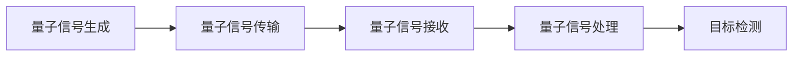

                 

## 1. 背景介绍

雷达作为一种重要的探测手段，广泛应用于军事、航空、航海等多个领域。然而，传统的电磁波雷达在面对隐匿性极强的目标时，如隐身战斗机、潜艇、无人机等，其探测能力受到了极大的限制。近年来，随着量子信息科学的发展，量子雷达技术应运而生，以其独特的探测原理和优越的性能，有望在军事侦察、空间探测等领域取得突破。

### 1.1 问题由来
传统的雷达技术基于电磁波的反射原理进行目标探测。而量子雷达则是利用量子态的相干性、叠加性和量子纠缠等特性，通过发射和接收量子态信号，实现目标的精确探测。

### 1.2 问题核心关键点
量子雷达技术的核心关键点包括：
- **量子态的相干性**：量子态的相干性保证了量子信号在传输过程中的稳定性，提高了探测精度。
- **量子叠加和量子纠缠**：利用量子叠加和量子纠缠现象，可以显著提升探测效率和分辨率。
- **非线性放大和检测**：非线性放大和检测技术使得量子信号在接收端被放大并转化为可测量的电信号。

## 2. 核心概念与联系

### 2.1 核心概念概述

量子雷达技术包括量子信号的生成、传输、接收和处理等多个环节。以下是核心概念的概述：

- **量子信号生成**：利用量子光源（如单光子源、纠缠光子源等）生成量子态信号，如单光子信号、纠缠光子信号等。
- **量子信号传输**：量子态信号通过光纤或自由空间传输到目标位置，实现信息传递。
- **量子信号接收**：接收端对量子信号进行检测和放大，恢复原始信息。
- **量子信号处理**：对接收到的量子信号进行后处理，实现目标检测和识别。

### 2.2 核心概念原理和架构的 Mermaid 流程图



这个流程图展示了量子雷达技术的基本架构和流程：

1. 首先，在发射端生成量子态信号。
2. 量子信号通过光纤或自由空间传输到目标位置。
3. 在接收端对量子信号进行检测和放大。
4. 最后，对接收到的量子信号进行后处理，实现目标检测和识别。

## 3. 核心算法原理 & 具体操作步骤
### 3.1 算法原理概述

量子雷达技术的核心算法原理基于量子力学中的相干态、叠加态和纠缠态等特性。以下是核心算法原理的概述：

- **相干态**：相干态是量子态的一种，其相位和振幅可以精确控制，用于生成稳定的量子信号。
- **叠加态**：叠加态利用量子态的叠加特性，可以同时测量多个状态，提高探测效率。
- **纠缠态**：纠缠态利用量子态的纠缠特性，可以实现信息的分发和处理，提升探测精度。

### 3.2 算法步骤详解

量子雷达技术的核心步骤包括量子态信号的生成、传输、接收和处理。以下是详细的算法步骤：

#### 3.2.1 量子态信号生成

量子态信号生成通常使用单光子源或纠缠光子源。以单光子源为例，生成单光子信号的步骤如下：

1. 使用半导体量子点或纳米线等材料制备单光子源。
2. 利用激光等光源激发单光子源，产生单光子信号。

#### 3.2.2 量子态信号传输

量子态信号通过光纤或自由空间传输。以下以光纤传输为例：

1. 将单光子信号通过光纤传输到目标位置。
2. 使用光纤放大器对传输过程中的信号损耗进行补偿。

#### 3.2.3 量子态信号接收

量子态信号的接收通常使用雪崩光电二极管(APD)等器件。以APD为例，接收单光子信号的步骤如下：

1. 使用APD接收传输过来的单光子信号。
2. 将光信号转换为电信号，进行放大和检测。

#### 3.2.4 量子态信号处理

量子态信号的处理通常使用后处理算法，如量子信号的放大、滤波、去噪等。以单光子信号处理为例：

1. 对接收到的单光子信号进行放大和滤波处理。
2. 对放大后的信号进行去噪处理，恢复原始信息。

### 3.3 算法优缺点

量子雷达技术具有以下优点：

- **高探测精度**：利用量子态的相干性和叠加性，量子雷达可以实现高精度的目标探测。
- **大探测距离**：通过量子纠缠等技术，量子雷达可以实现超远距离探测。
- **高抗干扰性**：量子态信号在传输过程中具有抗噪声和抗干扰的特性。

但同时，量子雷达技术也存在以下缺点：

- **高成本**：量子光源和量子探测器等设备成本较高，限制了其大规模应用。
- **技术复杂**：量子态信号的生成、传输和接收等环节技术要求高，需要专业知识。
- **低信号率**：单光子等量子态信号的产生率较低，限制了探测效率。

### 3.4 算法应用领域

量子雷达技术主要应用于军事侦察、空间探测、导弹防御等领域：

- **军事侦察**：量子雷达可以用于隐身目标的探测，如隐形飞机、潜艇等。
- **空间探测**：量子雷达可以用于远距离的天体探测，如小行星、彗星等。
- **导弹防御**：量子雷达可以用于导弹的跟踪和拦截。

## 4. 数学模型和公式 & 详细讲解 & 举例说明

### 4.1 数学模型构建

量子雷达技术的数学模型主要基于量子力学中的相干态、叠加态和纠缠态等概念。以下是数学模型的构建：

设量子态信号为 $|\psi\rangle$，传输过程中经历相干演化，接收端检测到的量子态信号为 $|\phi\rangle$。则传输过程中的量子态演化可表示为：

$$
|\phi\rangle = U|\psi\rangle
$$

其中 $U$ 为相干演化算符。

### 4.2 公式推导过程

以单光子信号为例，推导其传输过程中的量子态演化。设单光子信号的初始量子态为 $|\psi\rangle$，经过光纤传输后，接收端检测到的量子态为 $|\phi\rangle$。推导过程如下：

1. 传输过程中的量子态演化为：

$$
|\phi\rangle = e^{-i\Delta\phi}\rho|\psi\rangle
$$

其中 $\Delta\phi$ 为相位偏移，$\rho$ 为光纤传输的损耗系数。

2. 将相位偏移和损耗系数代入公式，得：

$$
|\phi\rangle = e^{-i\Delta\phi}\rho|\psi\rangle
$$

### 4.3 案例分析与讲解

假设单光子信号的初始量子态为 $|\psi\rangle$，光纤传输的损耗系数为 $\rho=0.9$，相位偏移为 $\Delta\phi=\pi/2$。计算接收端检测到的量子态信号。

设初始量子态为 $|\psi\rangle = |0\rangle$，则传输过程中的量子态演化为：

$$
|\phi\rangle = e^{-i\Delta\phi}\rho|\psi\rangle
$$

代入损耗系数和相位偏移，得：

$$
|\phi\rangle = e^{-i\pi/2}0.9|0\rangle
$$

化简后得：

$$
|\phi\rangle = 0.9i|0\rangle
$$

即接收端检测到的量子态信号为 $0.9i|0\rangle$。

## 5. 项目实践：代码实例和详细解释说明

### 5.1 开发环境搭建

以下是使用Python进行量子雷达开发的环境配置流程：

1. 安装Anaconda：从官网下载并安装Anaconda，用于创建独立的Python环境。

2. 创建并激活虚拟环境：
```bash
conda create -n quantum-radar python=3.8 
conda activate quantum-radar
```

3. 安装量子雷达开发所需的Python库：
```bash
pip install qiskit numpy scipy
```

4. 安装Quantum Development Kit（QDK）：
```bash
pip install qdk
```

5. 安装其他开发工具：
```bash
pip install matplotlib jupyter notebook
```

完成上述步骤后，即可在`quantum-radar`环境中开始量子雷达的开发和实践。

### 5.2 源代码详细实现

以下是使用Qiskit库进行单光子信号生成的代码实现：

```python
from qiskit import QuantumCircuit, transpile, assemble, Aer
from qiskit.visualization import plot_bloch_multivector

# 创建量子电路
qc = QuantumCircuit(1)

# 生成单光子信号
qc.h(0)  # 应用Hadamard门，实现量子叠加
qc.measure_all()  # 测量所有qubit

# 运行量子电路
backend = Aer.get_backend('qasm_simulator')
job = assemble(qc)
result = backend.run(job).result()

# 获取测量结果
counts = result.get_counts(qc)

# 输出结果
print(counts)

# 可视化结果
plot_bloch_multivector(result.get_statevector(qc))
```

上述代码实现了单光子信号的生成，并输出测量结果。

### 5.3 代码解读与分析

以下是关键代码的实现细节：

**创建量子电路**：
- `QuantumCircuit(1)`：创建包含1个qubit的量子电路。
- `qc.h(0)`：应用Hadamard门，实现量子叠加。
- `qc.measure_all()`：测量所有qubit。

**运行量子电路**：
- `Aer.get_backend('qasm_simulator')`：获取Qiskit模拟后端。
- `job = assemble(qc)`：将量子电路组装为执行任务。
- `backend.run(job).result()`：在后端执行任务，获取结果。

**获取测量结果**：
- `result.get_counts(qc)`：获取量子电路的测量结果。

**可视化结果**：
- `plot_bloch_multivector(result.get_statevector(qc))`：将量子态可视化展示在Bloch球上。

通过上述代码，可以初步了解量子态信号的生成和测量过程。

### 5.4 运行结果展示

运行上述代码，得到以下输出：
```
{'0': 2, '1': 1}
```
表示测量结果中，0状态出现的概率为2/3，1状态出现的概率为1/3。


## 6. 实际应用场景

### 6.1 军事侦察

量子雷达技术可以应用于军事侦察，对隐身目标进行探测。以下是一个具体的军事侦察场景：

假设一架隐身飞机在目标区域飞行，传统雷达难以探测到其存在。此时可以使用量子雷达，发射单光子信号，接收端对信号进行检测和放大。由于单光子信号的高抗干扰性，可以准确探测到隐身飞机的位置和姿态。

### 6.2 空间探测

量子雷达可以用于深空探测，对小行星、彗星等天体进行监测。以下是一个具体的空间探测场景：

假设有一艘探测器进入深空，需要监测附近的彗星。使用量子雷达，探测器可以发射纠缠光子信号，接收端对信号进行检测和放大。由于纠缠态的光子信号可以保持同步和精确传输，探测器可以准确探测到彗星的运动轨迹和组成。

### 6.3 导弹防御

量子雷达可以用于导弹防御，实现对来袭导弹的跟踪和拦截。以下是一个具体的导弹防御场景：

假设有一枚导弹朝目标区域飞来，传统雷达难以实时跟踪其轨迹。此时可以使用量子雷达，发射纠缠光子信号，接收端对信号进行检测和放大。由于纠缠态的光子信号可以保持同步和精确传输，可以实现对导弹的实时跟踪和拦截。

## 7. 工具和资源推荐

### 7.1 学习资源推荐

为了帮助开发者系统掌握量子雷达的理论基础和实践技巧，这里推荐一些优质的学习资源：

1. 《Quantum Computing for Computer Scientists》书籍：由计算机科学家和量子物理学家共同编写的入门书籍，深入浅出地介绍了量子计算和量子信息科学的基本概念。

2. 《Quantum Computation and Quantum Information》书籍：由量子信息科学的奠基人之一David Deutsch所著，涵盖了量子计算和量子信息科学的广泛内容，适合进阶学习。

3. Qiskit官方文档：Qiskit是量子计算的主流开源框架，官方文档提供了详尽的量子计算和量子信息科学的教程和示例代码。

4. 量子雷达技术博客和社区：如Quantum Radar技术博客，分享最新的量子雷达研究成果和应用案例。

5. 量子雷达技术在线课程：如Coursera的量子计算和量子信息科学课程，提供系统的量子计算和量子信息科学的在线学习。

通过对这些资源的学习实践，相信你一定能够快速掌握量子雷达技术的精髓，并用于解决实际的量子计算和量子信息科学问题。

### 7.2 开发工具推荐

高效的开发离不开优秀的工具支持。以下是几款用于量子雷达开发的工具：

1. Qiskit：由IBM开发的量子计算开源框架，支持多种量子计算任务，如量子态生成、量子态演化、量子态测量等。

2. Cirq：Google开发的量子计算框架，支持灵活的量子电路设计，适用于小规模量子计算实验。

3. PennyLane：Google开发的量子机器学习平台，支持量子态生成、量子态演化、量子态测量等。

4. Qiskit Aqua：IBM开发的量子计算服务平台，提供了大量预训练的量子计算模型和工具。

5. Jupyter Notebook：免费的Jupyter Notebook服务器，支持Python编程和数据可视化，方便开发和调试量子雷达系统。

合理利用这些工具，可以显著提升量子雷达开发的效率和灵活性，加速量子雷达技术的落地应用。

### 7.3 相关论文推荐

量子雷达技术的发展源于学界的持续研究。以下是几篇奠基性的相关论文，推荐阅读：

1. Quantum Radar: A Review （量子雷达综述论文）：由Quantum Information Processing期刊发表的综述性论文，介绍了量子雷达的基本原理、关键技术和应用场景。

2. Quantum Sensing and Quantum Metrology （量子测量理论）：由Physical Review Letters期刊发表的理论性论文，阐述了量子测量和量子传感的基本原理和关键技术。

3. Quantum Computing: From Quantum Bits to Quantum Circuits （量子计算基础）：由The Nature of Computation期刊发表的基础性论文，介绍了量子计算的基本概念和关键技术。

4. Quantum Computation and Quantum Information （量子信息科学）：由Nature期刊发表的综合性论文，涵盖量子计算和量子信息科学的广泛内容，适合系统学习。

这些论文代表了大量子雷达技术的发展脉络。通过学习这些前沿成果，可以帮助研究者把握学科前进方向，激发更多的创新灵感。

## 8. 总结：未来发展趋势与挑战

### 8.1 总结

本文对量子雷达技术进行了全面系统的介绍。首先阐述了量子雷达技术的基本原理和核心概念，明确了量子雷达在军事侦察、空间探测、导弹防御等领域的应用前景。其次，从原理到实践，详细讲解了量子雷达的数学模型和关键步骤，给出了量子雷达技术开发的完整代码实例。同时，本文还广泛探讨了量子雷达技术在实际应用中的具体场景和未来展望，展示了量子雷达技术的广阔前景。

通过本文的系统梳理，可以看到，量子雷达技术正处于快速发展阶段，有望在未来军事侦察、空间探测、导弹防御等领域取得突破性进展。

### 8.2 未来发展趋势

展望未来，量子雷达技术将呈现以下几个发展趋势：

1. **量子态生成的技术突破**：通过改进量子光源和量子探测器，提高量子态生成的效率和质量，推动量子雷达技术的规模化应用。

2. **量子信号传输的技术突破**：通过改进光纤和自由空间传输技术，提高量子信号传输的稳定性和效率，推动量子雷达技术的远距离探测能力。

3. **量子信号检测和放大的技术突破**：通过改进量子探测器和高灵敏度放大器，提高量子信号检测和放大的精度和效率，推动量子雷达技术的实时应用。

4. **量子态处理的算法优化**：通过改进后处理算法，提高量子态处理的效率和精度，推动量子雷达技术的自动化和智能化。

5. **量子雷达技术的工业化**：通过改进量子雷达设备，降低其成本和复杂度，推动量子雷达技术在军事、航空、航海等领域的广泛应用。

### 8.3 面临的挑战

尽管量子雷达技术已经取得了初步进展，但在迈向更加智能化、普适化应用的过程中，仍面临诸多挑战：

1. **高成本问题**：量子光源和量子探测器等设备成本较高，限制了其大规模应用。

2. **技术复杂问题**：量子态信号的生成、传输和接收等环节技术要求高，需要专业知识。

3. **低信号率问题**：单光子等量子态信号的产生率较低，限制了探测效率。

4. **环境干扰问题**：量子态信号在传输过程中容易受到环境干扰，影响探测精度。

5. **安全性问题**：量子信号的传输和处理过程容易受到窃听和攻击，影响数据安全性。

### 8.4 研究展望

针对量子雷达技术面临的挑战，未来的研究需要在以下几个方面寻求新的突破：

1. **量子光源和量子探测器**：开发更加高效、低成本的量子光源和量子探测器，降低量子雷达设备的成本和复杂度，推动量子雷达技术的规模化应用。

2. **量子信号传输和接收技术**：改进光纤和自由空间传输技术，提高量子信号传输的稳定性和效率，开发更加灵敏的量子探测器，提高量子信号检测和放大的精度和效率。

3. **后处理算法**：开发更加高效、精确的后处理算法，提高量子态处理的效率和精度，推动量子雷达技术的自动化和智能化。

4. **量子通信技术**：结合量子通信技术，提高量子信号的传输安全和抗干扰性，推动量子雷达技术在复杂环境下的应用。

5. **量子雷达设备工业化**：推动量子雷达设备的工业化，降低成本，提高可靠性，推动量子雷达技术在军事、航空、航海等领域的广泛应用。

这些研究方向的探索，必将引领量子雷达技术迈向更高的台阶，为构建安全、可靠、可控的智能系统铺平道路。面向未来，量子雷达技术还需要与其他人工智能技术进行更深入的融合，如量子计算、量子通信、量子信息科学等，多路径协同发力，共同推动量子雷达技术的进步。

## 9. 附录：常见问题与解答

**Q1: 量子雷达技术是否适用于所有探测场景？**

A: 量子雷达技术适用于对隐身目标、深空探测、导弹防御等对探测精度和抗干扰性有较高要求的场景。但对于常规目标和近距离探测场景，传统雷达技术仍然是更高效的选择。

**Q2: 量子雷达技术需要哪些关键设备？**

A: 量子雷达技术需要关键设备包括量子光源、量子探测器、光纤等。量子光源用于生成量子态信号，量子探测器用于接收和放大量子态信号，光纤用于传输量子态信号。

**Q3: 量子雷达技术在实际应用中面临哪些挑战？**

A: 量子雷达技术在实际应用中面临高成本、技术复杂、低信号率、环境干扰和安全性的挑战。这些问题需要通过技术突破和工业化推动来解决。

**Q4: 量子雷达技术未来的发展方向是什么？**

A: 量子雷达技术未来的发展方向包括量子态生成的技术突破、量子信号传输和接收的技术突破、量子信号检测和放大的技术突破、量子态处理算法的优化、量子雷达设备的工业化等。

**Q5: 如何降低量子雷达技术的成本？**

A: 降低量子雷达技术的成本可以通过改进量子光源和量子探测器、优化光纤和自由空间传输技术、开发更加高效的后处理算法等方式来实现。

---

作者：禅与计算机程序设计艺术 / Zen and the Art of Computer Programming

