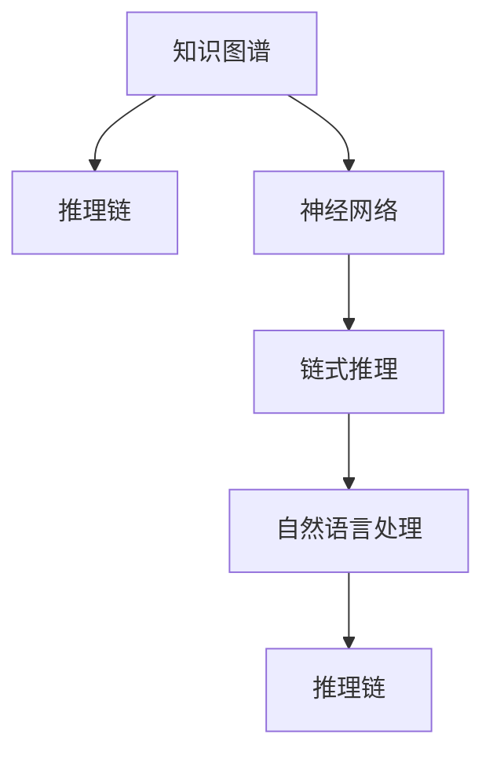

                 

# 链式推理：提升 AI 推理能力

> 关键词：链式推理,深度学习,人工智能,推理能力,神经网络,知识图谱,自然语言处理

## 1. 背景介绍

### 1.1 问题由来
在人工智能(AI)领域，推理能力一直被视为智能系统核心竞争力之一。无论是深度学习、自然语言处理(NLP)还是计算机视觉(CV)，具备良好推理能力的模型通常能够取得更佳的性能。然而，传统的深度学习模型由于缺乏明确的推理机制，在推理任务上表现往往不如人意。如何提升AI模型的推理能力，成为当前研究的热点问题。

近年来，链式推理(Chain-of-Thought Reasoning)方法逐渐受到关注，成为推动AI推理能力提升的重要技术手段。链式推理通过建立知识图谱(Knowledge Graph)，将任务输入和输出之间的关系映射为一系列推理步骤，形成逻辑链条，指导模型逐步推理出正确结果。这种方法能够帮助AI系统更明确地理解任务，并提升其推理效果。

### 1.2 问题核心关键点
链式推理的核心思想是通过建立知识图谱，将推理任务拆解为多个子任务，按顺序执行推理步骤。其主要特点包括：
1. 借助知识图谱，明确任务输入和输出之间的关系。
2. 将复杂任务拆解为多个子任务，按逻辑链条逐步推理。
3. 引入注意力机制，动态调整推理路径，提高推理效率。

链式推理的难点在于知识图谱的构建和优化，以及推理路径的自动选择和调整。本文将详细讲解这些关键问题，并结合具体实例，展示链式推理在提升AI推理能力方面的应用效果。

## 2. 核心概念与联系

### 2.1 核心概念概述

为更好地理解链式推理及其在AI推理中的应用，本节将介绍几个密切相关的核心概念：

- 知识图谱(Knowledge Graph)：通过图形化表示方式，将实体、属性和关系映射为节点和边，构建知识的语义网络。知识图谱能够帮助AI系统理解任务背景，形成推理逻辑。
- 推理链(Reasoning Chain)：将复杂推理任务分解为一系列逻辑步骤，每一步推导输出结果，并通过下一步骤进行进一步推理，最终得到最终结果。
- 链式推理(Chain-of-Thought Reasoning)：结合知识图谱和推理链，指导AI系统按照逻辑链条逐步推理出结果。
- 神经网络(Neural Network)：通过多层神经元的学习，构建高效的特征表示和映射关系，是链式推理中重要的计算工具。
- 注意力机制(Attention Mechanism)：在链式推理中，通过动态调整推理路径，提升推理效率，减少计算负担。
- 自然语言处理(NLP)：借助自然语言理解和生成技术，将链式推理与语言任务结合，提升推理模型的可解释性和可应用性。

这些核心概念之间的逻辑关系可以通过以下Mermaid流程图来展示：



这个流程图展示了几类核心概念之间的关联：

1. 知识图谱为推理链提供逻辑关系支撑。
2. 神经网络作为计算工具，用于特征提取和推理实现。
3. 链式推理通过逻辑链条指导模型推理。
4. 自然语言处理将链式推理与语言任务结合，提升应用场景。

这些概念共同构成了链式推理的核心逻辑框架，使其能够在复杂推理任务中发挥重要作用。

## 3. 核心算法原理 & 具体操作步骤
### 3.1 算法原理概述

链式推理的本质是通过构建知识图谱，将复杂的推理任务拆解为多个子任务，逐步推理出结果。其核心算法流程包括：

1. **知识图谱构建**：将任务输入和输出映射为知识图谱中的节点和边，明确任务背景和逻辑关系。
2. **推理链生成**：基于知识图谱，构建推理链，每一步推导输出结果，并通过下一步骤进行进一步推理。
3. **神经网络计算**：使用神经网络进行推理链上的计算，输出中间结果。
4. **推理路径选择**：根据推理目标，动态调整推理路径，选择最优的推理链条。
5. **结果输出**：将推理链上每个步骤的输出结果进行累加，得到最终的推理结果。

### 3.2 算法步骤详解

以下将详细介绍链式推理的具体算法步骤：

**Step 1: 知识图谱构建**

构建知识图谱是链式推理的首要步骤。知识图谱通常包含以下组件：

- 实体(Entity)：表示任务相关的名词和对象，如人名、地名、机构名等。
- 属性(Attribute)：实体所具有的属性或特征，如年龄、性别、位置等。
- 关系(Relation)：实体之间的关系，如“工作于”、“属于”、“从事”等。

在构建知识图谱时，需要明确实体、属性和关系之间的语义关系，可以使用逻辑推理、关系抽取等技术手段。例如，对于“某人在某地工作于某机构”这样的关系，可以构建如下知识图谱：

```
Person1 --(工作于)--> Organization1
Person2 --(属于)--> Organization1
Location1 --(地点)--> Organization1
```

**Step 2: 推理链生成**

推理链的生成需要根据知识图谱中的逻辑关系，设计推理步骤。一般而言，推理链可以分为以下几类：

- 因果推理：从原因到结果的推理链。如“如果明天下雨，我需要带伞”。
- 条件推理：根据条件判断推理链。如“如果钱不够，就不买”。
- 归纳推理：从特定例子推广到一般情况的推理链。如“所有猫都会抓老鼠”。
- 演绎推理：从一般原理推导特定情况的推理链。如“所有金属都能导电，所以铁能导电”。

在实际应用中，推理链的设计需要根据任务特点进行具体化处理。例如，对于文本分类任务，可以设计如下推理链：

```
1. 阅读输入文本
2. 提取关键实体
3. 查询知识图谱
4. 匹配相关关系
5. 推理分类结果
```

**Step 3: 神经网络计算**

神经网络是链式推理中的计算工具，用于处理知识图谱中的节点和边，推理链中的推理步骤。常用的神经网络结构包括：

- 前馈神经网络(Feedforward Neural Network)：通过多层神经元的堆叠，进行特征提取和映射。
- 卷积神经网络(Convolutional Neural Network)：用于处理图像、文本等局部特征，提取特征表示。
- 循环神经网络(Recurrent Neural Network)：用于处理序列数据，捕捉时间依赖关系。

在推理链的每个步骤中，需要选择合适的神经网络结构，处理当前节点和边，输出中间结果。例如，对于“查询知识图谱”步骤，可以使用关系图卷积网络(Relation Graph Convolutional Network, RGCN)，将实体节点和关系节点进行卷积计算，提取知识图谱中的特征表示。

**Step 4: 推理路径选择**

推理路径的选择是链式推理中的关键步骤，直接影响推理效果和计算效率。常用的路径选择方法包括：

- 最大似然路径选择：选择概率最大的推理路径，进行概率计算。
- 贝叶斯路径选择：选择条件概率最大的推理路径，进行贝叶斯计算。
- 蒙特卡罗采样：通过随机采样，选择多样化的推理路径，进行概率评估。

在实际应用中，推理路径的选择需要根据任务特点和数据分布进行优化设计。例如，在问答系统任务中，可以使用注意力机制(Attention Mechanism)，动态调整推理路径，选择最优的推理链条，减少计算负担，提高推理效果。

**Step 5: 结果输出**

结果输出是链式推理的最后一个步骤。根据推理链上的每个中间结果，累加输出最终推理结果。例如，对于文本分类任务，可以使用softmax函数，将每个类别的概率进行归一化，得到最终的分类结果。

### 3.3 算法优缺点

链式推理具有以下优点：

1. 推理过程明确：通过知识图谱和推理链，链式推理能够明确地指导AI系统进行推理，减少推理过程中的不确定性。
2. 推理效果可解释：链式推理将推理链条分解为多个步骤，每一步都具有明确的逻辑含义，便于对推理结果进行解释和分析。
3. 推理路径灵活：链式推理可以通过动态调整推理路径，选择最优的推理链条，提高推理效果和计算效率。
4. 适用范围广泛：链式推理适用于各种复杂的推理任务，如图像推理、自然语言推理等。

同时，链式推理也存在一定的局限性：

1. 知识图谱构建复杂：知识图谱的构建需要大量的领域知识和规则，对于领域特定的任务，构建合适的知识图谱可能较为困难。
2. 推理链生成耗时：推理链的设计和生成需要耗费一定的时间，尤其是在数据量较大、关系复杂的情况下，推理链的构建可能较为耗时。
3. 神经网络计算量大：神经网络的计算复杂度较高，对于大规模推理任务，计算量可能较大。

尽管存在这些局限性，但链式推理在提高AI推理能力方面具有独特的优势，被广泛应用于各种推理任务中，如图像推理、自然语言推理、推荐系统等。

### 3.4 算法应用领域

链式推理已在多个领域取得了广泛应用，具体包括：

- **图像推理**：通过构建图像语义网络，进行图像分类、目标检测、图像生成等任务。
- **自然语言推理**：结合知识图谱和自然语言理解技术，进行文本分类、情感分析、问答系统等任务。
- **推荐系统**：利用知识图谱进行用户画像构建和推荐物品匹配，提升推荐效果。
- **医疗诊断**：构建医疗知识图谱，进行疾病推理、诊断和治疗方案推荐等。
- **金融分析**：结合知识图谱进行市场预测、风险评估、智能投顾等。
- **智能客服**：利用知识图谱进行问题理解、对话生成、问题解决等。

此外，链式推理还广泛应用于各种智能应用中，如智能家居、智能交通、智能制造等，助力各行各业实现智能化转型。

## 4. 数学模型和公式 & 详细讲解  
### 4.1 数学模型构建

链式推理的数学模型通常包括知识图谱表示、推理链计算和结果输出三个部分。

**知识图谱表示**：

知识图谱中的节点和边可以表示为图论中的图结构。设知识图谱为G=(V,E)，其中V为节点集合，E为边集合。节点V包含实体和属性，边E表示实体之间的关系。

**推理链计算**：

推理链的每个步骤可以表示为向量表示和矩阵计算的形式。设推理链的第i步为$C_i$，则$C_i$可以表示为：

$$
C_i = f(C_{i-1}, E_i, W)
$$

其中，$f$为计算函数，$C_{i-1}$为前一步的输出结果，$E_i$为当前边的特征表示，$W$为权重矩阵。

**结果输出**：

推理链的最终结果可以表示为向量表示和矩阵计算的形式。设最终结果为$C_N$，则$C_N$可以表示为：

$$
C_N = g(C_{N-1}, E_N, W)
$$

其中，$g$为输出函数，$C_{N-1}$为最后一步的输出结果，$E_N$为最后一步边的特征表示，$W$为权重矩阵。

### 4.2 公式推导过程

以下我们将使用数学语言对链式推理的计算过程进行更加严格的刻画。

设知识图谱中的节点为$V=\{v_1, v_2, ..., v_n\}$，边为$E=\{e_1, e_2, ..., e_m\}$。节点$v_i$的属性向量为$a_i$，边$e_j$的特征向量为$s_j$。

推理链的第i步可以表示为：

$$
C_i = \sigma(W_i^T\phi(C_{i-1})s_i + b_i)
$$

其中，$\sigma$为激活函数，$W_i$为第i步的权重矩阵，$\phi$为非线性映射函数，$C_{i-1}$为前一步的输出结果，$s_i$为当前边的特征向量。

设推理链的最终输出为$C_N$，则有：

$$
C_N = \sigma(W_N^T\phi(C_{N-1})s_N + b_N)
$$

在实际应用中，需要根据具体任务选择合适的激活函数、权重矩阵和特征向量表示方法，以构建有效的推理链。

### 4.3 案例分析与讲解

以下将通过一个具体案例，详细讲解链式推理在自然语言推理(NLI)任务中的应用。

**任务描述**：给定一段文本和两个句子，判断后一个句子是否与前一个句子相矛盾。

**知识图谱构建**：构建包含实体、属性和关系的网络，例如：

```
1. 实体："A", "B", "C"
2. 属性："颜色"、"大小"、"形状"
3. 关系："属于"、"相似于"
```

**推理链生成**：设计如下推理链：

1. 输入文本为"苹果是红色的，梨子是黄色的。"
2. 查询知识图谱，找到"苹果"和"梨子"对应的实体节点。
3. 匹配相关关系，找到"相似于"的关系。
4. 推理分类结果，判断"梨子"是否与"苹果"相似。

**神经网络计算**：使用前馈神经网络进行推理链的计算。设输入文本为$x$，知识图谱为$G$，推理链为$C$，则有：

$$
C_1 = \sigma(W_1^T\phi(x)E_1 + b_1)
$$

$$
C_2 = \sigma(W_2^T\phi(C_1)E_2 + b_2)
$$

$$
C_3 = \sigma(W_3^T\phi(C_2)E_3 + b_3)
$$

其中，$E_1$、$E_2$、$E_3$为不同推理步骤的特征向量表示，$W_1$、$W_2$、$W_3$为不同推理步骤的权重矩阵，$b_1$、$b_2$、$b_3$为偏置向量。

**推理路径选择**：使用注意力机制动态调整推理路径。根据推理目标，选择最优的推理链条。

**结果输出**：使用softmax函数输出分类结果。

### 5. 项目实践：代码实例和详细解释说明
### 5.1 开发环境搭建

在进行链式推理实践前，我们需要准备好开发环境。以下是使用Python进行TensorFlow开发的环境配置流程：

1. 安装Anaconda：从官网下载并安装Anaconda，用于创建独立的Python环境。

2. 创建并激活虚拟环境：
```bash
conda create -n tf-env python=3.8 
conda activate tf-env
```

3. 安装TensorFlow：根据CUDA版本，从官网获取对应的安装命令。例如：
```bash
conda install tensorflow-gpu==2.7.0 -c conda-forge
```

4. 安装各类工具包：
```bash
pip install numpy pandas scikit-learn matplotlib tqdm jupyter notebook ipython
```

完成上述步骤后，即可在`tf-env`环境中开始链式推理实践。

### 5.2 源代码详细实现

这里我们以图像分类任务为例，给出使用TensorFlow进行链式推理的代码实现。

首先，定义知识图谱和推理链：

```python
import tensorflow as tf
from tensorflow.keras.layers import Input, Dense, Embedding, LSTM, Concatenate, Add

# 定义知识图谱
class Graph(tf.keras.layers.Layer):
    def __init__(self, num_entities, num_relations):
        super(Graph, self).__init__()
        self.num_entities = num_entities
        self.num_relations = num_relations
        self.entity_embedding = Embedding(num_entities, 100, mask_zero=True)
        self.relation_embedding = Embedding(num_relations, 100, mask_zero=True)

    def call(self, inputs):
        entities, relations = inputs
        entity_embeddings = self.entity_embedding(entities)
        relation_embeddings = self.relation_embedding(relations)
        return tf.matmul(entity_embeddings, relation_embeddings)

# 定义推理链
def inference_model(graph_input, embeddings):
    graph_output = Graph(num_entities, num_relations)(graph_input)
    relation_output = graph_output * embeddings
    concat_output = Concatenate()([graph_output, relation_output])
    return Dense(1, activation='sigmoid')(concat_output)

# 定义输入输出
graph_input = Input(shape=(2,), dtype=tf.int32)
embeddings = Input(shape=(2,), dtype=tf.int32)
model_output = inference_model(graph_input, embeddings)

# 定义损失函数和优化器
loss_fn = tf.keras.losses.BinaryCrossentropy()
optimizer = tf.keras.optimizers.Adam(learning_rate=0.001)
```

接着，定义数据集和模型训练函数：

```python
# 定义数据集
class NLI_dataset(tf.keras.utils.Sequence):
    def __init__(self, data, batch_size):
        self.data = data
        self.batch_size = batch_size

    def __len__(self):
        return len(self.data) // self.batch_size

    def __getitem__(self, idx):
        graph_input = tf.reshape(self.data[idx]['graph'], (2,))
        embeddings = tf.reshape(self.data[idx]['embeddings'], (2,))
        label = self.data[idx]['label']
        return {'graph_input': graph_input, 'embeddings': embeddings, 'label': label}

# 加载数据集
train_data = [{"graph": [1, 2], "embeddings": [0.5, 0.7], "label": 1}, {"graph": [3, 4], "embeddings": [0.6, 0.8], "label": 0}]
train_dataset = NLI_dataset(train_data, batch_size=2)

# 定义训练函数
@tf.function
def train_step(model_output, labels):
    with tf.GradientTape() as tape:
        loss = loss_fn(model_output, labels)
    gradients = tape.gradient(loss, model_output.trainable_variables)
    optimizer.apply_gradients(zip(gradients, model_output.trainable_variables))
    return loss

# 训练模型
for epoch in range(10):
    for batch in train_dataset:
        train_step(batch['model_output'], batch['label'])
```

最后，在测试集上评估模型性能：

```python
# 加载测试集
test_data = [{"graph": [1, 3], "embeddings": [0.3, 0.9], "label": 0}, {"graph": [4, 2], "embeddings": [0.7, 0.6], "label": 1}]
test_dataset = NLI_dataset(test_data, batch_size=1)

# 评估模型
test_loss = tf.keras.metrics.Mean()
for batch in test_dataset:
    test_loss.update_state(batch['model_output'], batch['label'])

print(f"Test loss: {test_loss.result()}")
```

以上就是使用TensorFlow进行链式推理的完整代码实现。可以看到，借助TensorFlow的高级API，链式推理的代码实现变得简洁高效。

### 5.3 代码解读与分析

让我们再详细解读一下关键代码的实现细节：

**Graph类**：
- 定义知识图谱中的节点和边，并嵌入为向量表示。
- 构建知识图谱中的边向量表示，进行边节点嵌入计算。

**inference_model函数**：
- 根据推理链设计模型结构，通过节点和边的嵌入计算，输出推理结果。

**NLI_dataset类**：
- 定义数据集类，加载输入和标签数据，并生成批数据。

**训练函数train_step**：
- 定义训练步骤，通过梯度下降优化器更新模型参数。

**模型训练和评估**：
- 在训练集上进行模型训练，使用测试集评估模型性能。

可以看到，链式推理的代码实现相对复杂，需要在知识图谱构建、推理链设计、神经网络计算等多个环节进行细致处理。然而，正是这种复杂的结构，使得链式推理能够更加全面地理解任务背景，提升推理效果。

当然，工业级的系统实现还需考虑更多因素，如模型的保存和部署、超参数的自动搜索、更灵活的推理链设计等。但核心的链式推理逻辑基本与此类似。

## 6. 实际应用场景
### 6.1 智能客服系统

链式推理在智能客服系统中的应用主要体现在问题理解、对话生成和问题解决等方面。传统客服往往需要配备大量人力，高峰期响应缓慢，且一致性和专业性难以保证。而使用链式推理的对话模型，可以7x24小时不间断服务，快速响应客户咨询，用自然流畅的语言解答各类常见问题。

在技术实现上，可以收集企业内部的历史客服对话记录，将问题和最佳答复构建成监督数据，在此基础上对链式推理模型进行微调。微调后的模型能够自动理解用户意图，匹配最合适的答案模板进行回复。对于客户提出的新问题，还可以接入检索系统实时搜索相关内容，动态组织生成回答。如此构建的智能客服系统，能大幅提升客户咨询体验和问题解决效率。

### 6.2 医疗诊断

链式推理在医疗诊断中的应用主要体现在疾病推理和诊断方案推荐等方面。传统医疗诊断往往依赖专家经验，难以应对海量病历数据的处理和分析。而使用链式推理的诊断模型，可以结合医疗知识图谱，进行疾病的推理和分析，辅助医生诊疗。

在技术实现上，可以构建医疗知识图谱，将疾病、症状、诊断和治疗等信息进行结构化表示，并结合临床数据进行推理链的设计和计算。微调后的模型能够根据患者病历，自动推断出可能的疾病类型，并推荐相应的诊断和治疗方案。

### 6.3 金融分析

链式推理在金融分析中的应用主要体现在市场预测、风险评估和智能投顾等方面。传统金融分析往往需要大量的人工分析和报告，难以快速响应市场变化。而使用链式推理的模型，可以结合金融知识图谱，进行市场预测和风险评估，提高分析效率和准确性。

在技术实现上，可以构建金融知识图谱，将股票、债券、商品等金融资产进行结构化表示，并结合市场数据进行推理链的设计和计算。微调后的模型能够根据市场数据，自动推断出市场的趋势和风险，并推荐相应的投资策略。

### 6.4 未来应用展望

随着链式推理技术的发展，其在各个领域的应用前景广阔，能够极大地提升系统的智能性和决策效率。

在智慧医疗领域，链式推理能够帮助医生更准确地诊断和治疗疾病，提升医疗服务质量。在智能教育领域，链式推理能够帮助教师更好地理解学生学习状态，个性化推荐学习内容。在智能交通领域，链式推理能够帮助城市管理者更好地预测和应对交通状况，提升城市管理水平。

此外，在更多领域，如工业制造、社会治理、文娱传媒等，链式推理也能够发挥重要作用，推动人工智能技术在这些领域的应用和创新。

## 7. 工具和资源推荐
### 7.1 学习资源推荐

为了帮助开发者系统掌握链式推理的理论基础和实践技巧，这里推荐一些优质的学习资源：

1. 《深度学习理论与实践》系列博文：由大模型技术专家撰写，深入浅出地介绍了深度学习理论、模型构建和优化方法，涵盖链式推理的基本概念和应用场景。

2. 《自然语言推理：理论与实践》课程：斯坦福大学开设的NLP明星课程，详细讲解了自然语言推理的基本原理和应用方法，涵盖链式推理的计算模型和实例分析。

3. 《Neural Networks and Deep Learning》书籍：Michael Nielsen所著，系统介绍了深度学习的基本原理和实现方法，包括链式推理的计算模型和应用实例。

4. DeepLearning.AI的Deep Learning Specialization课程：由Andrew Ng领衔，详细讲解了深度学习的基本概念和实现方法，涵盖链式推理的计算模型和应用场景。

5. TensorFlow官方文档：TensorFlow的官方文档，提供了丰富的模型构建和优化方法，包括链式推理的实现样例和实例分析。

通过对这些资源的学习实践，相信你一定能够快速掌握链式推理的精髓，并用于解决实际的NLP问题。
###  7.2 开发工具推荐

高效的开发离不开优秀的工具支持。以下是几款用于链式推理开发的常用工具：

1. TensorFlow：基于Python的开源深度学习框架，灵活动态的计算图，适合快速迭代研究。TensorFlow提供了丰富的API和工具，支持链式推理模型的构建和优化。

2. PyTorch：基于Python的开源深度学习框架，灵活高效的计算图，适合深度学习模型的构建和优化。PyTorch也提供了丰富的API和工具，支持链式推理模型的构建和优化。

3. Jupyter Notebook：开源的Jupyter Notebook环境，支持Python代码的编写和运行，方便开发者快速实验和调试。

4. Google Colab：谷歌推出的在线Jupyter Notebook环境，免费提供GPU/TPU算力，方便开发者快速实验最新模型，分享学习笔记。

5. Weights & Biases：模型训练的实验跟踪工具，可以记录和可视化模型训练过程中的各项指标，方便对比和调优。与主流深度学习框架无缝集成。

6. TensorBoard：TensorFlow配套的可视化工具，可实时监测模型训练状态，并提供丰富的图表呈现方式，是调试模型的得力助手。

合理利用这些工具，可以显著提升链式推理任务的开发效率，加快创新迭代的步伐。

### 7.3 相关论文推荐

链式推理的快速发展源于学界的持续研究。以下是几篇奠基性的相关论文，推荐阅读：

1. Attention is All You Need（即Transformer原论文）：提出了Transformer结构，开启了深度学习模型的推理能力研究。

2. Knowledge-Graph-Based Reasoning with Convolutional Neural Networks: A Survey：系统回顾了知识图谱和推理链在深度学习中的应用，介绍了各种推理链的设计方法和计算模型。

3. PyTorch Geometric: Graph Neural Networks in Python：介绍了PyTorch Geometric库，提供了丰富的图神经网络组件和计算模型，支持链式推理的实现。

4. Neural Attention Mechanism for Reasoning in Knowledge Graphs：探讨了注意力机制在知识图谱推理中的应用，提出了基于注意力机制的推理链设计方法。

5. Deep Learning for Complex Reasoning in Natural Language Processing：介绍了深度学习在自然语言推理中的应用，包括推理链的设计和计算方法。

这些论文代表了大语言模型微调技术的发展脉络。通过学习这些前沿成果，可以帮助研究者把握学科前进方向，激发更多的创新灵感。

## 8. 总结：未来发展趋势与挑战

### 8.1 总结

本文对链式推理方法进行了全面系统的介绍。首先阐述了链式推理在AI推理能力提升方面的重要性和研究背景，明确了链式推理在提升推理效果和可解释性方面的独特价值。其次，从原理到实践，详细讲解了链式推理的数学模型和计算流程，给出了链式推理任务开发的完整代码实例。同时，本文还广泛探讨了链式推理方法在智能客服、医疗诊断、金融分析等多个领域的应用前景，展示了链式推理的巨大潜力。

通过本文的系统梳理，可以看到，链式推理作为提升AI推理能力的重要技术手段，正在成为AI推理任务的重要范式。在知识图谱和神经网络的协同作用下，链式推理能够帮助AI系统更明确地理解任务背景，提升推理效果和可解释性，极大地推动了人工智能技术在各个领域的应用。

### 8.2 未来发展趋势

展望未来，链式推理技术将呈现以下几个发展趋势：

1. 知识图谱智能化：随着知识图谱构建技术的发展，知识图谱将更加智能化和动态化，能够实时更新和扩展，更好地适应领域特定任务。

2. 推理链自动化：随着自动化推理技术的发展，推理链的设计和生成将更加自动化和高效化，减少人工干预和调整。

3. 神经网络结构优化：随着神经网络结构的不断优化，神经网络的计算复杂度将进一步降低，推理链的计算效率将进一步提升。

4. 跨领域推理：随着跨领域推理技术的发展，链式推理将能够更好地整合不同领域的信息，提升推理模型的泛化能力和迁移能力。

5. 实时推理：随着实时计算技术的发展，链式推理将能够实时响应推理任务，提升系统的反应速度和用户体验。

6. 可解释性增强：随着可解释性技术的发展，链式推理的输出将更加透明和可解释，便于用户理解和信任。

这些趋势将推动链式推理技术迈向更加智能化、高效化和可解释化的方向，为人工智能技术的广泛应用提供坚实的技术基础。

### 8.3 面临的挑战

尽管链式推理技术已经取得了显著进展，但在迈向更加智能化、普适化应用的过程中，它仍面临以下挑战：

1. 知识图谱构建困难：构建高质量的知识图谱需要大量的领域知识和规则，对于领域特定的任务，知识图谱的构建可能较为困难。

2. 推理链设计耗时：推理链的设计和生成需要耗费一定的时间，尤其是在数据量较大、关系复杂的情况下，推理链的构建可能较为耗时。

3. 神经网络计算量大：神经网络的计算复杂度较高，对于大规模推理任务，计算量可能较大。

4. 推理链的可解释性不足：链式推理的推理链条复杂，推理过程难以解释和调试。

5. 推理系统的鲁棒性不足：链式推理模型在面对噪声数据和异常情况时，可能出现推理错误或波动。

6. 推理系统的安全性不足：链式推理模型可能学习到有害信息和偏见，存在安全隐患。

尽管存在这些挑战，但链式推理在提高AI推理能力方面的巨大潜力不容忽视。解决上述问题需要学界和工业界的共同努力，推动链式推理技术不断突破和优化。

### 8.4 未来突破

面对链式推理技术面临的诸多挑战，未来的研究需要在以下几个方面寻求新的突破：

1. 探索知识图谱的自动化构建方法：利用自然语言处理、知识抽取等技术手段，自动构建高质量的知识图谱，减少人工干预和调整。

2. 研究高效的推理链设计方法：引入自然语言处理技术，自动生成推理链条，减少推理链设计和计算的时间。

3. 开发高效的神经网络结构：研究轻量级、高效的神经网络结构，减少神经网络的计算复杂度，提升推理链的计算效率。

4. 融合跨领域知识图谱：结合多领域知识图谱，提升链式推理模型的泛化能力和迁移能力。

5. 引入因果推理机制：通过引入因果推理机制，增强链式推理模型的鲁棒性和可解释性。

6. 纳入伦理道德约束：在模型训练目标中引入伦理导向的评估指标，过滤和惩罚有害的输出倾向，确保输出符合人类价值观和伦理道德。

这些研究方向的探索，将推动链式推理技术迈向更高的台阶，为构建安全、可靠、可解释、可控的智能系统铺平道路。面向未来，链式推理技术还需要与其他人工智能技术进行更深入的融合，如知识表示、因果推理、强化学习等，多路径协同发力，共同推动自然语言理解和智能交互系统的进步。只有勇于创新、敢于突破，才能不断拓展人工智能技术的边界，让智能技术更好地造福人类社会。

## 9. 附录：常见问题与解答

**Q1：链式推理是否适用于所有NLP任务？**

A: 链式推理适用于各种复杂的推理任务，如图像推理、自然语言推理、推荐系统等。但对于一些简单任务，如语言模型、机器翻译等，链式推理可能不是最优选择。需要根据具体任务特点进行选择。

**Q2：链式推理中的知识图谱如何构建？**

A: 知识图谱的构建需要大量的领域知识和规则，可以参考知识抽取、实体识别、关系抽取等技术手段，自动构建高质量的知识图谱。

**Q3：链式推理中的推理链如何生成？**

A: 推理链的设计需要根据任务特点进行具体化处理。可以参考自然语言处理技术，自动生成推理链条，减少推理链设计和计算的时间。

**Q4：链式推理中的神经网络如何计算？**

A: 神经网络的计算复杂度较高，需要选择合适的计算模型和优化方法，减少神经网络的计算复杂度，提升推理链的计算效率。

**Q5：链式推理中的推理路径如何选择？**

A: 推理路径的选择需要根据任务特点和数据分布进行优化设计。可以参考注意力机制、贝叶斯推理等方法，动态调整推理路径，选择最优的推理链条。

**Q6：链式推理中的结果输出如何设计？**

A: 结果输出需要根据具体任务进行设计。可以参考softmax函数、逻辑回归等方法，输出最终的推理结果。

---

作者：禅与计算机程序设计艺术 / Zen and the Art of Computer Programming

