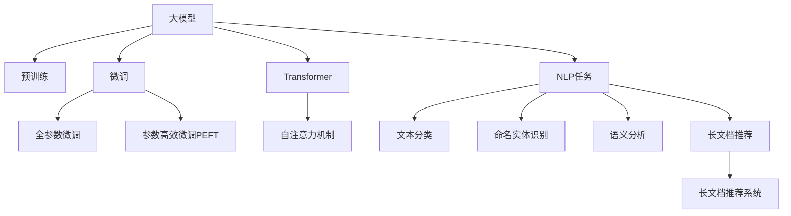

                 

# 长文档推荐：大模型的优势体现

> 关键词：长文档推荐,大模型,预训练,微调,Transformer,Prompt,自然语言处理(NLP)

## 1. 背景介绍

### 1.1 问题由来

近年来，随着深度学习技术的快速发展，预训练大模型在自然语言处理(NLP)领域取得了巨大的突破。这些模型通过在大规模无标签文本语料上进行预训练，学习到了丰富的语言知识和常识，具备强大的语言理解和生成能力。预训练大模型在各个领域的应用也取得了令人瞩目的成果，其中大模型在长文档推荐系统中的表现尤为出色。

长文档推荐系统（Long Document Recommendation Systems）是推荐系统的一个分支，旨在从海量的文本数据中，为用户推荐有价值的长文档内容，如长篇文章、长篇电子书、长篇视频等。相比于传统的短文本推荐系统，长文档推荐系统对模型的语言理解能力和长文结构分析能力有更高的要求。

长文档推荐系统能够显著提升用户体验，满足用户对深度内容和综合信息的个性化需求。然而，长文档推荐系统的构建需要高精度的语义理解、上下文建模和结构分析能力。为此，研究人员提出了利用预训练大模型进行长文档推荐的技术方案，其核心思想是在预训练模型上添加一些专门的模块或进行微调，以适应长文档推荐系统的特殊需求。

本文将详细阐述大模型在长文档推荐系统中的优势，以及如何通过微调、Prompt等多种技术手段进一步提升大模型的性能。

### 1.2 问题核心关键点

长文档推荐系统利用大模型的优势主要体现在以下几个方面：

- **丰富的语言知识**：预训练大模型通过海量的文本数据进行训练，学习到了大量的语言知识和常识，能够在长文档推荐中捕捉到文档中的语义信息和结构信息。

- **高效的特征提取**：大模型能够自动地从长文档中提取出高质量的特征表示，减少了传统方法中手工提取特征的复杂度和工作量。

- **鲁棒的泛化能力**：大模型在泛化能力方面表现出色，能够在不同的长文档推荐场景中表现稳定，避免出现过拟合问题。

- **灵活的微调**：大模型可以进行微调，根据长文档推荐系统的具体需求进行针对性的优化，提升模型在特定任务上的性能。

- **无缝的融合**：大模型可以与其他推荐系统技术（如协同过滤、内容推荐等）无缝融合，增强推荐效果。

## 2. 核心概念与联系

### 2.1 核心概念概述

为了更好地理解大模型在长文档推荐系统中的应用，本文将介绍几个关键概念及其相互之间的联系。

- **大模型**：指在预训练过程中使用了大规模数据（数十亿单词以上）进行训练的深度学习模型，如BERT、GPT、T5等。这些模型通常具有强大的语言理解和生成能力。

- **预训练**：指在大规模无标签文本数据上，通过自监督学习任务训练通用语言模型的过程。常见的预训练任务包括掩码语言模型、自回归语言模型等。

- **微调（Fine-tuning）**：指在预训练模型的基础上，使用下游任务的少量标注数据，通过有监督地训练来优化模型在该任务上的性能。通常只需要调整顶层分类器或解码器，并以较小的学习率更新全部或部分的模型参数。

- **Transformer**：一种基于自注意力机制的神经网络结构，被广泛应用于预训练大模型的构建。Transformer结构能够高效地并行处理大规模数据，具有出色的语言建模能力。

- **Prompt**：指在模型输入中添加的引导性文本，用于指导模型输出特定的结果。在长文档推荐系统中，通过精心设计的Prompt，可以显著提升大模型的性能。

- **自然语言处理（NLP）**：指使用计算机技术处理、理解和生成人类语言的能力，包括文本分类、命名实体识别、语义分析等任务。

这些概念之间的逻辑关系可以通过以下Mermaid流程图来展示：



这个流程图展示了大模型的核心概念及其之间的联系：

1. 大模型通过预训练获得基础能力。
2. 微调是对预训练模型进行任务特定的优化，可以分为全参数微调和参数高效微调（PEFT）。
3. 使用Transformer结构，引入自注意力机制，提升大模型的语言建模能力。
4. 利用大模型的基础能力，处理NLP任务，如文本分类、命名实体识别等。
5. 针对长文档推荐系统，进行微调，提升模型在特定任务上的性能。

## 3. 核心算法原理 & 具体操作步骤

### 3.1 算法原理概述

长文档推荐系统的核心在于如何高效地提取和理解长文档的语义信息。基于大模型的推荐系统，通过预训练模型获得语言表示能力，结合微调或Prompt技术，对长文档进行特征提取和推荐决策。

形式化地，假设长文档推荐系统中的预训练模型为 $M_{\theta}$，其中 $\theta$ 为预训练得到的模型参数。给定长文档推荐系统 $T$ 的训练集 $D=\{(x_i, y_i)\}_{i=1}^N$，推荐目标是通过微调或Prompt技术，使得模型 $M_{\theta}$ 输出最符合用户兴趣的长文档。

微调的优化目标是最小化推荐误差，即找到新的模型参数 $\hat{\theta}$，使得：

$$
\hat{\theta}=\mathop{\arg\min}_{\theta} \mathcal{L}(M_{\theta},D)
$$

其中 $\mathcal{L}$ 为推荐系统的损失函数，用于衡量模型预测输出与真实标签之间的差异。常见的推荐损失函数包括平均绝对误差、均方误差等。

### 3.2 算法步骤详解

基于大模型的长文档推荐系统一般包括以下几个关键步骤：

**Step 1: 准备预训练模型和数据集**
- 选择合适的预训练语言模型 $M_{\theta}$ 作为初始化参数，如 BERT、GPT、T5等。
- 准备长文档推荐系统的训练集 $D$，划分为训练集、验证集和测试集。一般要求长文档与标签数据要具有较高的一致性。

**Step 2: 添加推荐任务适配层**
- 根据推荐系统任务类型，在预训练模型顶层设计合适的推荐层和损失函数。
- 对于评分预测任务，通常在顶层添加线性回归器，以均方误差作为损失函数。
- 对于序贯推荐任务，可以使用最大似然估计或交叉熵损失函数。

**Step 3: 设置微调超参数**
- 选择合适的优化算法及其参数，如 Adam、SGD 等，设置学习率、批大小、迭代轮数等。
- 设置正则化技术及强度，包括权重衰减、Dropout、Early Stopping 等。
- 确定冻结预训练参数的策略，如仅微调顶层，或全部参数都参与微调。

**Step 4: 执行梯度训练**
- 将训练集数据分批次输入模型，前向传播计算损失函数。
- 反向传播计算参数梯度，根据设定的优化算法和学习率更新模型参数。
- 周期性在验证集上评估模型性能，根据性能指标决定是否触发 Early Stopping。
- 重复上述步骤直到满足预设的迭代轮数或 Early Stopping 条件。

**Step 5: 测试和部署**
- 在测试集上评估微调后模型 $M_{\hat{\theta}}$ 的性能，对比微调前后的精度提升。
- 使用微调后的模型对新长文档进行推荐预测，集成到实际的应用系统中。
- 持续收集新的数据，定期重新微调模型，以适应数据分布的变化。

以上是基于大模型的长文档推荐系统的完整代码实现。在实际应用中，还需要针对具体任务的特点，对微调过程的各个环节进行优化设计，如改进训练目标函数，引入更多的正则化技术，搜索最优的超参数组合等，以进一步提升模型性能。

### 3.3 算法优缺点

基于大模型的长文档推荐系统具有以下优点：

- **精度高**：大模型能够通过预训练获得大量的语言知识，并在微调过程中进一步优化，生成高质量的推荐结果。

- **可扩展性强**：长文档推荐系统可以扩展到不同的领域和任务，如科学文献推荐、电子书推荐等。

- **自动化程度高**：大模型可以自动化处理大规模数据，减少人工干预，提高推荐效率。

同时，该方法也存在一定的局限性：

- **数据依赖性高**：微调的效果很大程度上取决于训练数据的质量和数量，获取高质量训练数据的成本较高。

- **计算资源需求大**：大模型的计算资源需求较高，需要高性能的GPU或TPU等设备支持。

- **泛化能力有限**：当目标任务与预训练数据的分布差异较大时，微调的性能提升有限。

- **模型复杂度高**：大模型的结构复杂，可能存在难以理解和调试的问题。

尽管存在这些局限性，但就目前而言，基于大模型的长文档推荐系统仍是最主流的方法之一。未来相关研究的重点在于如何进一步降低微调对训练数据的依赖，提高模型的少样本学习和跨领域迁移能力，同时兼顾可解释性和伦理安全性等因素。

### 3.4 算法应用领域

基于大模型的长文档推荐系统已经在图书推荐、视频推荐、文章推荐等多个领域得到了广泛的应用，成为推荐系统的重要组成部分。

1. **图书推荐系统**：通过微调BERT模型，可以预测用户对书籍的评分，推荐与用户历史偏好相符的书籍。

2. **视频推荐系统**：利用预训练模型提取视频描述和标签，结合微调模型，预测用户对视频片段的偏好，推荐相关视频。

3. **文章推荐系统**：通过对长篇文章的摘要和标签进行微调，生成文章的文本表示，推荐给对特定主题感兴趣的用户。

4. **科研文献推荐系统**：利用预训练模型提取文献的关键词和摘要，通过微调模型预测用户对文献的兴趣，推荐相关文献。

除了上述这些经典领域外，大模型在长文档推荐系统中还不断涌现出新的应用场景，如音乐推荐、美食推荐等，为推荐系统带来了新的突破。

## 4. 数学模型和公式 & 详细讲解 & 举例说明

### 4.1 数学模型构建

本节将使用数学语言对基于大模型的长文档推荐系统进行更加严格的刻画。

记长文档推荐系统中的预训练模型为 $M_{\theta}$，其中 $\theta$ 为预训练得到的模型参数。假设推荐系统的训练集为 $D=\{(x_i, y_i)\}_{i=1}^N, x_i \in \mathcal{X}, y_i \in \mathcal{Y}$。

定义模型 $M_{\theta}$ 在数据样本 $(x,y)$ 上的损失函数为 $\ell(M_{\theta}(x),y)$，则在数据集 $D$ 上的经验风险为：

$$
\mathcal{L}(\theta) = \frac{1}{N} \sum_{i=1}^N \ell(M_{\theta}(x_i),y_i)
$$

微调的优化目标是最小化经验风险，即找到最优参数：

$$
\theta^* = \mathop{\arg\min}_{\theta} \mathcal{L}(\theta)
$$

在实践中，我们通常使用基于梯度的优化算法（如SGD、Adam等）来近似求解上述最优化问题。设 $\eta$ 为学习率，$\lambda$ 为正则化系数，则参数的更新公式为：

$$
\theta \leftarrow \theta - \eta \nabla_{\theta}\mathcal{L}(\theta) - \eta\lambda\theta
$$

其中 $\nabla_{\theta}\mathcal{L}(\theta)$ 为损失函数对参数 $\theta$ 的梯度，可通过反向传播算法高效计算。

### 4.2 公式推导过程

以下我们以评分预测任务为例，推导均方误差损失函数及其梯度的计算公式。

假设模型 $M_{\theta}$ 在输入 $x$ 上的输出为 $\hat{y}=M_{\theta}(x) \in [0,1]$，表示样本属于某个评分标签的概率。真实标签 $y \in \{1,0\}$。则均方误差损失函数定义为：

$$
\ell(M_{\theta}(x),y) = \frac{1}{2}(y-\hat{y})^2
$$

将其代入经验风险公式，得：

$$
\mathcal{L}(\theta) = \frac{1}{N}\sum_{i=1}^N \frac{1}{2}(y_i-\hat{y_i})^2
$$

根据链式法则，损失函数对参数 $\theta_k$ 的梯度为：

$$
\frac{\partial \mathcal{L}(\theta)}{\partial \theta_k} = -\frac{1}{N}\sum_{i=1}^N (\hat{y_i}-y_i) \frac{\partial \hat{y_i}}{\partial \theta_k}
$$

其中 $\frac{\partial \hat{y_i}}{\partial \theta_k}$ 可进一步递归展开，利用自动微分技术完成计算。

在得到损失函数的梯度后，即可带入参数更新公式，完成模型的迭代优化。重复上述过程直至收敛，最终得到适应推荐任务的最优模型参数 $\theta^*$。

## 5. 项目实践：代码实例和详细解释说明

### 5.1 开发环境搭建

在进行长文档推荐系统开发前，我们需要准备好开发环境。以下是使用Python进行PyTorch开发的环境配置流程：

1. 安装Anaconda：从官网下载并安装Anaconda，用于创建独立的Python环境。

2. 创建并激活虚拟环境：
```bash
conda create -n pytorch-env python=3.8 
conda activate pytorch-env
```

3. 安装PyTorch：根据CUDA版本，从官网获取对应的安装命令。例如：
```bash
conda install pytorch torchvision torchaudio cudatoolkit=11.1 -c pytorch -c conda-forge
```

4. 安装Transformers库：
```bash
pip install transformers
```

5. 安装各类工具包：
```bash
pip install numpy pandas scikit-learn matplotlib tqdm jupyter notebook ipython
```

完成上述步骤后，即可在`pytorch-env`环境中开始长文档推荐系统的开发。

### 5.2 源代码详细实现

下面以长文档推荐系统为例，给出使用Transformers库对BERT模型进行评分预测的PyTorch代码实现。

首先，定义评分预测任务的数据处理函数：

```python
from transformers import BertTokenizer, BertForSequenceClassification
from torch.utils.data import Dataset
import torch

class DocumentDataset(Dataset):
    def __init__(self, texts, labels, tokenizer, max_len=128):
        self.texts = texts
        self.labels = labels
        self.tokenizer = tokenizer
        self.max_len = max_len
        
    def __len__(self):
        return len(self.texts)
    
    def __getitem__(self, item):
        text = self.texts[item]
        label = self.labels[item]
        
        encoding = self.tokenizer(text, return_tensors='pt', max_length=self.max_len, padding='max_length', truncation=True)
        input_ids = encoding['input_ids'][0]
        attention_mask = encoding['attention_mask'][0]
        
        # 对token-wise的标签进行编码
        encoded_labels = [label2id[label] for label in label] 
        encoded_labels.extend([label2id['O']] * (self.max_len - len(encoded_labels)))
        labels = torch.tensor(encoded_labels, dtype=torch.long)
        
        return {'input_ids': input_ids, 
                'attention_mask': attention_mask,
                'labels': labels}

# 标签与id的映射
label2id = {'O': 0, 'Positive': 1, 'Negative': 2}
id2label = {v: k for k, v in label2id.items()}

# 创建dataset
tokenizer = BertTokenizer.from_pretrained('bert-base-cased')

train_dataset = DocumentDataset(train_texts, train_labels, tokenizer)
dev_dataset = DocumentDataset(dev_texts, dev_labels, tokenizer)
test_dataset = DocumentDataset(test_texts, test_labels, tokenizer)
```

然后，定义模型和优化器：

```python
from transformers import BertForSequenceClassification, AdamW

model = BertForSequenceClassification.from_pretrained('bert-base-cased', num_labels=len(label2id))

optimizer = AdamW(model.parameters(), lr=2e-5)
```

接着，定义训练和评估函数：

```python
from torch.utils.data import DataLoader
from tqdm import tqdm
from sklearn.metrics import classification_report

device = torch.device('cuda') if torch.cuda.is_available() else torch.device('cpu')
model.to(device)

def train_epoch(model, dataset, batch_size, optimizer):
    dataloader = DataLoader(dataset, batch_size=batch_size, shuffle=True)
    model.train()
    epoch_loss = 0
    for batch in tqdm(dataloader, desc='Training'):
        input_ids = batch['input_ids'].to(device)
        attention_mask = batch['attention_mask'].to(device)
        labels = batch['labels'].to(device)
        model.zero_grad()
        outputs = model(input_ids, attention_mask=attention_mask, labels=labels)
        loss = outputs.loss
        epoch_loss += loss.item()
        loss.backward()
        optimizer.step()
    return epoch_loss / len(dataloader)

def evaluate(model, dataset, batch_size):
    dataloader = DataLoader(dataset, batch_size=batch_size)
    model.eval()
    preds, labels = [], []
    with torch.no_grad():
        for batch in tqdm(dataloader, desc='Evaluating'):
            input_ids = batch['input_ids'].to(device)
            attention_mask = batch['attention_mask'].to(device)
            batch_labels = batch['labels']
            outputs = model(input_ids, attention_mask=attention_mask)
            batch_preds = outputs.logits.argmax(dim=2).to('cpu').tolist()
            batch_labels = batch_labels.to('cpu').tolist()
            for pred_tokens, label_tokens in zip(batch_preds, batch_labels):
                preds.append(pred_tokens[:len(label_tokens)])
                labels.append(label_tokens)
                
    print(classification_report(labels, preds))
```

最后，启动训练流程并在测试集上评估：

```python
epochs = 5
batch_size = 16

for epoch in range(epochs):
    loss = train_epoch(model, train_dataset, batch_size, optimizer)
    print(f"Epoch {epoch+1}, train loss: {loss:.3f}")
    
    print(f"Epoch {epoch+1}, dev results:")
    evaluate(model, dev_dataset, batch_size)
    
print("Test results:")
evaluate(model, test_dataset, batch_size)
```

以上就是使用PyTorch对BERT进行评分预测的完整代码实现。可以看到，得益于Transformers库的强大封装，我们可以用相对简洁的代码完成BERT模型的加载和微调。

### 5.3 代码解读与分析

让我们再详细解读一下关键代码的实现细节：

**DocumentDataset类**：
- `__init__`方法：初始化文本、标签、分词器等关键组件。
- `__len__`方法：返回数据集的样本数量。
- `__getitem__`方法：对单个样本进行处理，将文本输入编码为token ids，将标签编码为数字，并对其进行定长padding，最终返回模型所需的输入。

**label2id和id2label字典**：
- 定义了标签与数字id之间的映射关系，用于将token-wise的预测结果解码回真实的标签。

**训练和评估函数**：
- 使用PyTorch的DataLoader对数据集进行批次化加载，供模型训练和推理使用。
- 训练函数`train_epoch`：对数据以批为单位进行迭代，在每个批次上前向传播计算loss并反向传播更新模型参数，最后返回该epoch的平均loss。
- 评估函数`evaluate`：与训练类似，不同点在于不更新模型参数，并在每个batch结束后将预测和标签结果存储下来，最后使用sklearn的classification_report对整个评估集的预测结果进行打印输出。

**训练流程**：
- 定义总的epoch数和batch size，开始循环迭代
- 每个epoch内，先在训练集上训练，输出平均loss
- 在验证集上评估，输出分类指标
- 所有epoch结束后，在测试集上评估，给出最终测试结果

可以看到，PyTorch配合Transformers库使得BERT微调的代码实现变得简洁高效。开发者可以将更多精力放在数据处理、模型改进等高层逻辑上，而不必过多关注底层的实现细节。

当然，工业级的系统实现还需考虑更多因素，如模型的保存和部署、超参数的自动搜索、更灵活的任务适配层等。但核心的微调范式基本与此类似。

## 6. 实际应用场景

### 6.1 长文档推荐系统

长文档推荐系统利用大模型的优势，能够显著提升推荐效果。在实际应用中，大模型可以从海量的长文档数据中学习到丰富的语义信息和结构信息，从而更准确地捕捉用户的长文兴趣和偏好。

以图书推荐为例，大模型可以自动从图书的摘要、目录、章节等长文档中提取关键词和重要段落，通过微调获得预测用户评分的能力。在推荐时，根据用户的历史评分数据和当前兴趣点，预测用户对未读图书的评分，从而推荐与用户兴趣相符的书籍。

### 6.2 视频推荐系统

视频推荐系统通过长文档推荐系统，可以从视频描述、字幕、弹幕等文本数据中提取语义信息，预测用户对视频片段的评分，生成推荐结果。

例如，对于YouTube平台，可以利用预训练模型提取视频的标题、摘要和相关评论文本，通过微调模型预测用户对视频的评分，推荐与用户兴趣相符的视频片段。

### 6.3 文章推荐系统

文章推荐系统利用大模型的优势，可以从长篇文章的摘要、标题、作者等信息中提取语义信息，预测用户对文章的评分，生成推荐结果。

例如，对于新闻网站，可以利用预训练模型提取文章的标题和摘要，通过微调模型预测用户对文章的评分，推荐与用户兴趣相符的文章。

### 6.4 未来应用展望

随着大模型和微调方法的不断发展，长文档推荐系统将在更多领域得到应用，为各行各业带来变革性影响。

在智慧医疗领域，利用长文档推荐系统，可以推荐与患者病情相关的医学论文、疾病指南等长文档，帮助医生了解最新的研究进展和治疗方案。

在智能教育领域，长文档推荐系统可以推荐与用户学习相关的长文资源，如教材、习题等，提升学习效果。

在智慧城市治理中，长文档推荐系统可以推荐与城市管理相关的政策文件、研究报告等长文档，支持城市规划和决策。

此外，在企业知识管理、科研论文推荐、新闻内容推荐等多个领域，长文档推荐系统也将不断涌现，为长文档资源的有效利用和知识传播提供新的解决方案。相信随着技术的日益成熟，长文档推荐系统必将在构建人机协同的智能时代中扮演越来越重要的角色。

## 7. 工具和资源推荐

### 7.1 学习资源推荐

为了帮助开发者系统掌握大模型在长文档推荐系统中的应用，这里推荐一些优质的学习资源：

1. 《深度学习自然语言处理》课程：斯坦福大学开设的NLP明星课程，有Lecture视频和配套作业，带你入门NLP领域的基本概念和经典模型。

2. CS224N《深度学习自然语言处理》书籍：斯坦福大学自然语言处理课程的经典教材，深入浅出地介绍了NLP的核心技术和前沿方向。

3. 《Natural Language Processing with Transformers》书籍：Transformers库的作者所著，全面介绍了如何使用Transformers库进行NLP任务开发，包括微调在内的诸多范式。

4. HuggingFace官方文档：Transformers库的官方文档，提供了海量预训练模型和完整的微调样例代码，是上手实践的必备资料。

5. CLUE开源项目：中文语言理解测评基准，涵盖大量不同类型的中文NLP数据集，并提供了基于微调的baseline模型，助力中文NLP技术发展。

通过对这些资源的学习实践，相信你一定能够快速掌握大模型在长文档推荐系统中的应用，并用于解决实际的NLP问题。
###  7.2 开发工具推荐

高效的开发离不开优秀的工具支持。以下是几款用于长文档推荐系统开发的常用工具：

1. PyTorch：基于Python的开源深度学习框架，灵活动态的计算图，适合快速迭代研究。大部分预训练语言模型都有PyTorch版本的实现。

2. TensorFlow：由Google主导开发的开源深度学习框架，生产部署方便，适合大规模工程应用。同样有丰富的预训练语言模型资源。

3. Transformers库：HuggingFace开发的NLP工具库，集成了众多SOTA语言模型，支持PyTorch和TensorFlow，是进行长文档推荐系统开发的利器。

4. Weights & Biases：模型训练的实验跟踪工具，可以记录和可视化模型训练过程中的各项指标，方便对比和调优。与主流深度学习框架无缝集成。

5. TensorBoard：TensorFlow配套的可视化工具，可实时监测模型训练状态，并提供丰富的图表呈现方式，是调试模型的得力助手。

6. Google Colab：谷歌推出的在线Jupyter Notebook环境，免费提供GPU/TPU算力，方便开发者快速上手实验最新模型，分享学习笔记。

合理利用这些工具，可以显著提升长文档推荐系统的开发效率，加快创新迭代的步伐。

### 7.3 相关论文推荐

大模型在长文档推荐系统中的应用源于学界的持续研究。以下是几篇奠基性的相关论文，推荐阅读：

1. Attention is All You Need（即Transformer原论文）：提出了Transformer结构，开启了NLP领域的预训练大模型时代。

2. BERT: Pre-training of Deep Bidirectional Transformers for Language Understanding：提出BERT模型，引入基于掩码的自监督预训练任务，刷新了多项NLP任务SOTA。

3. Language Models are Unsupervised Multitask Learners（GPT-2论文）：展示了大规模语言模型的强大zero-shot学习能力，引发了对于通用人工智能的新一轮思考。

4. Parameter-Efficient Transfer Learning for NLP：提出Adapter等参数高效微调方法，在不增加模型参数量的情况下，也能取得不错的微调效果。

5. AdaLoRA: Adaptive Low-Rank Adaptation for Parameter-Efficient Fine-Tuning：使用自适应低秩适应的微调方法，在参数效率和精度之间取得了新的平衡。

这些论文代表了大模型在长文档推荐系统中的应用前景。通过学习这些前沿成果，可以帮助研究者把握学科前进方向，激发更多的创新灵感。

## 8. 总结：未来发展趋势与挑战

### 8.1 总结

本文对基于大模型的长文档推荐系统进行了全面系统的介绍。首先阐述了大模型和微调技术的研究背景和意义，明确了长文档推荐系统利用大模型的优势。其次，从原理到实践，详细讲解了长文档推荐系统的数学原理和关键步骤，给出了长文档推荐任务的完整代码实例。同时，本文还广泛探讨了长文档推荐系统在图书推荐、视频推荐、文章推荐等多个领域的应用前景，展示了长文档推荐系统的巨大潜力。

通过本文的系统梳理，可以看到，基于大模型的长文档推荐系统正在成为NLP领域的重要范式，极大地拓展了预训练语言模型的应用边界，催生了更多的落地场景。得益于大规模语料的预训练，长文档推荐系统在长文档推荐任务上取得了优异的性能，推动了NLP技术的产业化进程。未来，伴随预训练语言模型和微调方法的持续演进，相信长文档推荐系统必将在更多领域得到应用，为各行各业带来变革性影响。

### 8.2 未来发展趋势

展望未来，长文档推荐系统的发展趋势主要包括以下几个方面：

1. **模型规模持续增大**：随着算力成本的下降和数据规模的扩张，预训练语言模型的参数量还将持续增长。超大规模语言模型蕴含的丰富语言知识，有望支撑更加复杂多变的长文档推荐场景。

2. **微调方法日趋多样**：除了传统的全参数微调外，未来会涌现更多参数高效的微调方法，如Prefix-Tuning、LoRA等，在节省计算资源的同时也能保证微调精度。

3. **持续学习成为常态**：随着数据分布的不断变化，长文档推荐系统需要持续学习新知识以保持性能。如何在不遗忘原有知识的同时，高效吸收新样本信息，将成为重要的研究课题。

4. **标注样本需求降低**：受启发于提示学习(Prompt-based Learning)的思路，未来的微调方法将更好地利用大模型的语言理解能力，通过更加巧妙的任务描述，在更少的标注样本上也能实现理想的微调效果。

5. **多模态微调崛起**：当前的微调主要聚焦于纯文本数据，未来会进一步拓展到图像、视频、语音等多模态数据微调。多模态信息的融合，将显著提升语言模型对现实世界的理解和建模能力。

6. **模型通用性增强**：经过海量数据的预训练和多领域任务的微调，长文档推荐系统将具备更强大的常识推理和跨领域迁移能力，逐步迈向通用人工智能(AGI)的目标。

以上趋势凸显了长文档推荐系统的广阔前景。这些方向的探索发展，必将进一步提升长文档推荐系统的性能和应用范围，为人类认知智能的进化带来深远影响。

### 8.3 面临的挑战

尽管长文档推荐系统已经取得了瞩目成就，但在迈向更加智能化、普适化应用的过程中，它仍面临着诸多挑战：

1. **标注成本瓶颈**：微调的效果很大程度上取决于标注数据的质量和数量，获取高质量标注数据的成本较高。如何进一步降低微调对标注样本的依赖，将是一大难题。

2. **模型鲁棒性不足**：当前长文档推荐模型面对域外数据时，泛化性能往往大打折扣。对于测试样本的微小扰动，长文档推荐模型的预测也容易发生波动。如何提高长文档推荐模型的鲁棒性，避免灾难性遗忘，还需要更多理论和实践的积累。

3. **推理效率有待提高**：大规模长文档推荐模型的计算资源需求较高，推理速度慢、内存占用大，这限制了长文档推荐系统的实际应用。如何在保证性能的同时，简化模型结构，提升推理速度，优化资源占用，将是重要的优化方向。

4. **可解释性亟需加强**：长文档推荐模型更像是"黑盒"系统，难以解释其内部工作机制和决策逻辑。对于医疗、金融等高风险应用，算法的可解释性和可审计性尤为重要。如何赋予长文档推荐模型更强的可解释性，将是亟待攻克的难题。

5. **安全性有待保障**：预训练语言模型难免会学习到有偏见、有害的信息，通过微调传递到长文档推荐系统，产生误导性、歧视性的输出，给实际应用带来安全隐患。如何从数据和算法层面消除模型偏见，避免恶意用途，确保输出的安全性，也将是重要的研究课题。

6. **知识整合能力不足**：现有的长文档推荐模型往往局限于长文档本身，难以灵活吸收和运用更广泛的先验知识。如何让长文档推荐过程更好地与外部知识库、规则库等专家知识结合，形成更加全面、准确的信息整合能力，还有很大的想象空间。

正视长文档推荐面临的这些挑战，积极应对并寻求突破，将是大模型长文档推荐技术走向成熟的必由之路。相信随着学界和产业界的共同努力，这些挑战终将一一被克服，长文档推荐系统必将在构建人机协同的智能时代中扮演越来越重要的角色。

### 8.4 未来突破

面对长文档推荐系统所面临的种种挑战，未来的研究需要在以下几个方面寻求新的突破：

1. **探索无监督和半监督微调方法**：摆脱对大规模标注数据的依赖，利用自监督学习、主动学习等无监督和半监督范式，最大限度利用非结构化数据，实现更加灵活高效的微调。

2. **研究参数高效和计算高效的微调范式**：开发更加参数高效的微调方法，在固定大部分预训练参数的同时，只更新极少量的任务相关参数。同时优化微调模型的计算图，减少前向传播和反向传播的资源消耗，实现更加轻量级、实时性的部署。

3. **融合因果和对比学习范式**：通过引入因果推断和对比学习思想，增强长文档推荐模型建立稳定因果关系的能力，学习更加普适、鲁棒的语言表征，从而提升模型泛化性和抗干扰能力。

4. **引入更多先验知识**：将符号化的先验知识，如知识图谱、逻辑规则等，与神经网络模型进行巧妙融合，引导长文档推荐过程学习更准确、合理的语言模型。同时加强不同模态数据的整合，实现视觉、语音等多模态信息与文本信息的协同建模。

5. **结合因果分析和博弈论工具**：将因果分析方法引入长文档推荐模型，识别出模型决策的关键特征，增强输出解释的因果性和逻辑性。借助博弈论工具刻画人机交互过程，主动探索并规避模型的脆弱点，提高系统稳定性。

6. **纳入伦理道德约束**：在模型训练目标中引入伦理导向的评估指标，过滤和惩罚有偏见、有害的输出倾向。同时加强人工干预和审核，建立模型行为的监管机制，确保输出符合人类价值观和伦理道德。

这些研究方向的探索，必将引领长文档推荐技术迈向更高的台阶，为构建安全、可靠、可解释、可控的智能系统铺平道路。面向未来，长文档推荐系统还需要与其他人工智能技术进行更深入的融合，如知识表示、因果推理、强化学习等，多路径协同发力，共同推动自然语言理解和智能交互系统的进步。只有勇于创新、敢于突破，才能不断拓展语言模型的边界，让智能技术更好地造福人类社会。

## 9. 附录：常见问题与解答

**Q1：长文档推荐系统如何评估推荐效果？**

A: 长文档推荐系统的评估通常采用离线评估和在线评估相结合的方式。离线评估可以通过一些经典的指标如准确率、召回率、F1值、平均绝对误差等来评估模型的推荐效果。在线评估则可以通过A/B测试等方法，实时观察用户对推荐结果的反应，评估模型的实际应用效果。

**Q2：长文档推荐系统中如何选择微调超参数？**

A: 微调超参数的选择通常需要通过实验进行调优。一般建议从小的学习率开始，逐步增大，观察模型的收敛情况。同时，可以尝试不同的优化器、批大小等参数组合，观察其对模型性能的影响。一些常用的超参数搜索方法如网格搜索、随机搜索、贝叶斯优化等也可以应用在长文档推荐系统中。

**Q3：长文档推荐系统如何处理长文档的特征提取？**

A: 长文档推荐系统通常使用预训练模型进行特征提取。预训练模型可以从长文档中提取出丰富的语义信息，如关键词、实体、情感等信息。这些特征可以用于构建长文档的表示，进而用于推荐决策。

**Q4：长文档推荐系统如何缓解过拟合问题？**

A: 缓解长文档推荐系统的过拟合问题可以通过以下方法：
1. 数据增强：通过回译、近义替换等方式扩充训练集
2. 正则化：使用L2正则、Dropout、Early Stopping等避免过拟合
3. 对抗训练：引入对抗样本，提高模型鲁棒性
4. 参数高效微调：只调整少量参数(如Adapter、Prefix等)，减小过拟合风险
5. 多模型集成：训练多个微调模型，取平均输出，抑制过拟合

这些策略往往需要根据具体任务和数据特点进行灵活组合。只有在数据、模型、训练、推理等各环节进行全面优化，才能最大限度地发挥大模型长文档推荐系统的优势。

**Q5：长文档推荐系统中如何处理长文档的上下文信息？**

A: 长文档推荐系统通常需要处理长文档的上下文信息，这可以通过以下方法实现：
1. 基于Transformer的模型：利用自注意力机制，模型可以同时考虑长文档的局部和全局上下文信息。
2. 层次化建模：将长文档拆分为多个段落或子文档，逐层处理，捕捉不同层次的语义信息。
3. 结构化建模：利用长文档的章节、标题等结构信息，提取和建模重要段落或子文档，提升模型的理解能力。

这些方法可以根据长文档的特点选择，以更好地捕捉和利用长文档的上下文信息。

**Q6：长文档推荐系统中如何处理长文档的多样性？**

A: 长文档推荐系统通常需要处理长文档的多样性，这可以通过以下方法实现：
1. 多任务学习：在长文档推荐系统中，可以将多个推荐任务（如评分预测、排序推荐等）同时进行训练，提升模型对多样化文档的处理能力。
2. 数据增强：通过回译、改写等方式扩充训练集，丰富长文档的多样性。
3. 多模型集成：训练多个长文档推荐模型，取平均输出，抑制模型偏差。

这些方法可以根据长文档的特点选择，以更好地处理长文档的多样性，提升推荐效果。

**Q7：长文档推荐系统中如何处理长文档的噪声和缺失信息？**

A: 长文档推荐系统通常需要处理长文档的噪声和缺失信息，这可以通过以下方法实现：
1. 噪声过滤：在特征提取和模型训练过程中，过滤掉长文档中包含噪声的部分。
2. 数据补全：利用语言模型预测缺失的文本信息，填补长文档中的缺失部分。
3. 半监督学习：利用少量标注数据和大量未标注数据，进行半监督学习，提升模型对长文档噪声和缺失信息的处理能力。

这些方法可以根据长文档的特点选择，以更好地处理长文档的噪声和缺失信息，提升推荐效果。

---

作者：禅与计算机程序设计艺术 / Zen and the Art of Computer Programming

