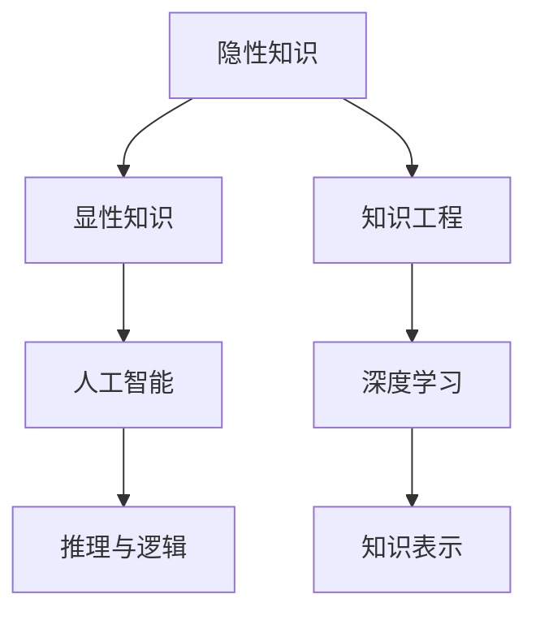
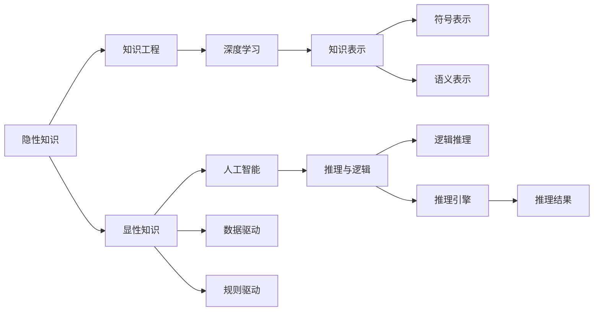

                 

# 隐性知识：难以言传的智慧积累

## 1. 背景介绍

### 1.1 问题由来
在当前的技术生态中，数据和算法是驱动AI技术发展的两大核心。数据提供了丰富的信息源泉，算法则负责从中提炼出有用的知识和模式。然而，除了显性的数据和算法外，还有一个重要的维度——隐性知识。隐性知识，即难以通过语言或代码直接表达和传递的知识，往往蕴含着人类智慧的核心部分。

隐性知识包括但不限于以下几个方面：

- **经验智慧**：通过长时间的实践积累，形成的直觉和经验。例如，医生诊断疾病的直觉、工程师设计电路的经验等。
- **创意灵感**：突如其来的创意和灵感，往往源于深厚的知识背景和长时间的思考。例如，艺术创作、科学发现等。
- **情感智能**：理解和管理自己和他人的情感，能够准确捕捉和回应情绪变化的能力。例如，心理咨询师、教师等职业的情感处理能力。
- **综合判断**：将多方面知识综合，做出合理判断和决策的能力。例如，商业决策、政治决策等。

隐性知识因其难以形式化、标准化和传递，长期以来在技术和知识管理领域未得到充分重视。但随着人工智能的兴起，特别是深度学习模型的普及，越来越多的专家开始思考：如何利用人工智能技术，系统地捕捉和利用隐性知识？

### 1.2 问题核心关键点
- **隐性知识的形式化**：如何通过机器学习技术，将隐性知识形式化，使其能够被计算机理解和处理？
- **知识提取与重用**：如何从大量经验数据中，自动抽取隐性知识，并应用于新的场景中？
- **人机协同**：如何设计高效的人机交互机制，充分利用人类和机器的互补优势，共同工作？
- **知识表示与推理**：如何构建有效的知识表示模型，使得知识能够在推理过程中被准确传递和应用？
- **学习与迭代**：如何通过不断的学习和迭代，优化隐性知识提取和应用的效果？

这些核心关键点，是隐性知识研究的前沿和热点，也是本文主要探讨的方向。

## 2. 核心概念与联系

### 2.1 核心概念概述

为了更好地理解隐性知识在AI中的应用，本节将介绍几个密切相关的核心概念：

- **隐性知识(Hidden Knowledge)**：人类经验、直觉、创意、情感等难以用语言或代码直接表达和传递的知识。
- **显性知识(Explicit Knowledge)**：能够用语言或代码明确表示的知识，如数学公式、编程代码等。
- **知识工程(Knowledge Engineering)**：将隐性知识转换为显性知识，使其能够被计算机处理和应用的过程。
- **人工智能(Artificial Intelligence)**：模拟人类智能的计算系统，通过学习、推理、决策等过程，实现对环境的操作和理解。
- **深度学习(Deep Learning)**：一种基于神经网络的机器学习方法，通过多层次的特征提取和处理，实现对复杂数据的建模。
- **知识表示(Knowledge Representation)**：将知识用计算机语言表示，以便于计算机进行处理和推理。
- **推理与逻辑(R reasoning and logic)**：在知识表示的基础上，对知识进行推理，得出新的结论。

这些概念之间的逻辑关系可以通过以下Mermaid流程图来展示：



这个流程图展示了几大核心概念及其之间的关系：

1. 隐性知识通过知识工程转换为显性知识，使得计算机能够理解和使用。
2. 深度学习通过多层次特征提取，实现对显性知识的建模和处理。
3. 知识表示将显性知识转换为计算机语言，使得推理和逻辑过程能够高效进行。
4. 人工智能利用深度学习和知识表示技术，实现推理和决策，形成新的知识。

这些概念共同构成了隐性知识研究的框架，使其能够在技术上实现突破。

### 2.2 核心概念原理和架构的 Mermaid 流程图



这个图展示了隐性知识到显性知识的转换过程，以及如何通过人工智能技术和知识表示模型进行处理。

## 3. 核心算法原理 & 具体操作步骤

### 3.1 算法原理概述

隐性知识的抽取和应用，本质上是将人类智慧的隐性部分转换为计算机可处理的显性知识。其核心算法原理可以分为以下几个步骤：

1. **数据采集与预处理**：收集人类专家的经验、决策、行为等隐性数据，并进行清洗和格式化。
2. **特征提取与表示**：使用深度学习模型对数据进行特征提取，将其转换为计算机可处理的符号表示或语义表示。
3. **知识表示与存储**：将提取的特征进行符号化或语义化，构建知识图谱、规则库等数据结构，用于知识存储和传递。
4. **推理与逻辑处理**：在知识表示的基础上，使用逻辑推理引擎或深度学习模型进行推理，得出新的结论或决策。
5. **知识应用与迭代**：将推理结果应用于实际问题中，并根据反馈不断优化模型，提升知识提取和应用的效果。

这些步骤共同构成了一个完整的隐性知识抽取和应用框架，使得隐性知识能够被系统地捕捉和利用。

### 3.2 算法步骤详解

基于上述原理，以下是一个具体的隐性知识抽取和应用流程：

1. **数据采集与预处理**：
   - 采集人类专家的决策记录、行为数据、言论记录等隐性数据。
   - 对数据进行清洗、去噪、标准化等预处理操作，使其适合后续处理。

2. **特征提取与表示**：
   - 使用深度学习模型（如LSTM、Transformer等）对数据进行特征提取，得到高层次的抽象特征。
   - 将提取的特征转换为符号表示或语义表示，如使用符号化表示的逻辑推理规则，或使用语义表示的知识图谱。

3. **知识表示与存储**：
   - 构建知识图谱，将符号表示或语义表示的知识进行组织和存储。
   - 使用规则库存储逻辑推理规则，方便后续推理过程的应用。

4. **推理与逻辑处理**：
   - 使用逻辑推理引擎（如Prolog、FOL等）或深度学习模型（如Graph Neural Network等）进行推理。
   - 根据推理结果，更新知识图谱和规则库，进行知识的迭代更新。

5. **知识应用与迭代**：
   - 将推理结果应用于实际问题中，如决策支持系统、知识问答系统等。
   - 根据应用结果和反馈，不断优化特征提取和推理模型，提升知识抽取和应用的效果。

### 3.3 算法优缺点

隐性知识抽取和应用算法具有以下优点：

1. **自动化程度高**：利用深度学习模型自动提取和表示隐性知识，降低了人工干预的复杂度。
2. **可解释性强**：知识图谱和规则库使得推理过程可解释性强，便于理解和调试。
3. **知识复用性强**：提取的知识可以复用，应用于多种场景，提升了知识的应用价值。
4. **快速迭代更新**：基于反馈的迭代过程，使得知识不断优化，适应新场景。

同时，该算法也存在一些局限性：

1. **数据依赖性强**：依赖于高质量、全面的隐性数据，数据质量对算法效果有很大影响。
2. **模型复杂度高**：深度学习模型和逻辑推理引擎的复杂度较高，需要较高的计算资源。
3. **知识泛化性有限**：提取的知识可能存在领域依赖性，难以泛化到其他领域。
4. **推理过程复杂**：知识推理过程复杂，需要设计合理的推理引擎和规则库。

尽管存在这些局限性，但就目前而言，隐性知识抽取和应用算法仍是大数据、人工智能领域的重要研究方向。未来相关研究的重点在于如何进一步降低算法对数据的依赖，提高推理的效率和泛化能力，同时兼顾知识的可解释性和应用价值。

### 3.4 算法应用领域

隐性知识抽取和应用算法在多个领域已得到应用，例如：

- **医疗诊断**：通过分析医生决策记录和病例数据，抽取医生的诊断知识，辅助新的诊断决策。
- **金融预测**：利用分析师的历史决策和市场数据，抽取市场趋势和风险评估知识，提升预测精度。
- **教育辅助**：从教师的教学记录和学生反馈中，抽取教学方法和学习知识，优化教育过程。
- **法律咨询**：通过律师的案例和决策数据，抽取法律知识和规则，辅助新的案件分析和判决。
- **项目管理**：从项目经理的项目记录和决策数据中，抽取项目管理知识和经验，提升项目管理水平。

除了这些经典领域，隐性知识抽取和应用算法还在更多场景中得到创新性应用，如智能客服、机器人控制、智慧城市等，为社会各行各业带来了新的变革。随着算法技术的不断进步，隐性知识的应用将更加广泛，其潜力将进一步被挖掘。

## 4. 数学模型和公式 & 详细讲解 & 举例说明

### 4.1 数学模型构建

在隐性知识抽取和应用中，数学模型主要涉及以下几个方面：

- **符号化表示**：将知识转换为符号表示，便于逻辑推理。
- **语义表示**：将知识转换为语义表示，便于计算机理解和处理。
- **逻辑推理**：使用逻辑推理引擎或深度学习模型进行推理，得出新的结论。

这些模型构建过程中，常常使用以下数学公式和工具：

- **逻辑代数**：用于表示逻辑推理过程，例如布尔代数、谓词逻辑等。
- **概率图模型**：用于表示知识之间的概率关系，例如贝叶斯网络、马尔可夫逻辑网络等。
- **知识图谱**：用于组织和表示知识，例如RDF、OWL等。

### 4.2 公式推导过程

以下是一个简单的逻辑推理示例，展示如何使用布尔代数进行符号化表示和逻辑推理：

**示例1: 推理疾病诊断**

假设我们有如下知识：

- **知识1**：如果患者有发烧症状，则可能患有流感。
- **知识2**：如果患者有咳嗽症状，则可能患有流感。
- **知识3**：如果患者有发烧和咳嗽症状，则患有流感。

使用布尔代数表示上述知识：

- $K_1: F \rightarrow I$（如果发烧则感染）
- $K_2: C \rightarrow I$（如果咳嗽则感染）
- $K_3: (F \land C) \rightarrow I$（如果发烧且咳嗽则感染）

其中，$F$表示发烧，$C$表示咳嗽，$I$表示感染。

现在，我们要推理一个新患者是否感染了流感。根据上述知识，可以得出以下推理过程：

- **前提1**：患者有发烧症状。
- **推理1**：根据$K_1$，患者可能感染流感。
- **前提2**：患者有咳嗽症状。
- **推理2**：根据$K_2$，患者可能感染流感。
- **合并结论**：根据$K_3$，患者一定感染流感。

以上推理过程可以用布尔代数表示为：

$$
(F \land C) \rightarrow I
$$

即：如果发烧且咳嗽，则感染。

这个推理过程展示了如何使用逻辑代数进行隐性知识的符号化表示和推理。

### 4.3 案例分析与讲解

**案例分析: 医疗诊断知识提取**

在医疗领域，医生诊断是一个典型的隐性知识应用场景。以下是一个基于医疗诊断数据的知识提取和应用案例：

1. **数据采集**：采集医生的诊断记录和病例数据，包括症状、诊断结果等。
2. **特征提取**：使用深度学习模型（如LSTM、BERT等）对症状和诊断结果进行特征提取。
3. **知识表示**：将提取的特征转换为符号化表示，如使用逻辑规则表示症状与诊断结果的关系。
4. **推理与逻辑处理**：使用逻辑推理引擎（如Prolog）进行推理，得出新的诊断结论。
5. **知识应用**：将推理结果应用于新的病例诊断中，提升诊断精度。

例如，如果新患者有胸痛和呼吸急促的症状，可以使用如下逻辑规则进行推理：

- **规则1**：胸痛 \rightarrow 心肌梗死
- **规则2**：呼吸急促 \rightarrow 心肌梗死
- **规则3**：胸痛 and 呼吸急促 \rightarrow 心肌梗死

即如果患者同时有胸痛和呼吸急促的症状，根据规则3，可以得出患者可能患有心肌梗死的结论。

这个案例展示了如何利用深度学习模型和逻辑推理引擎进行隐性知识的抽取和应用。

## 5. 项目实践：代码实例和详细解释说明

### 5.1 开发环境搭建

在进行隐性知识抽取和应用实践前，我们需要准备好开发环境。以下是使用Python进行PyTorch开发的环境配置流程：

1. 安装Anaconda：从官网下载并安装Anaconda，用于创建独立的Python环境。

2. 创建并激活虚拟环境：
```bash
conda create -n pytorch-env python=3.8 
conda activate pytorch-env
```

3. 安装PyTorch：根据CUDA版本，从官网获取对应的安装命令。例如：
```bash
conda install pytorch torchvision torchaudio cudatoolkit=11.1 -c pytorch -c conda-forge
```

4. 安装TensorFlow：由Google主导开发的开源深度学习框架，生产部署方便，适合大规模工程应用。同样有丰富的预训练语言模型资源。

5. 安装PyTorch：基于Python的开源深度学习框架，灵活动态的计算图，适合快速迭代研究。大部分预训练语言模型都有PyTorch版本的实现。

6. 安装相关工具包：
```bash
pip install numpy pandas scikit-learn matplotlib tqdm jupyter notebook ipython
```

完成上述步骤后，即可在`pytorch-env`环境中开始隐性知识抽取和应用的实践。

### 5.2 源代码详细实现

以下是一个简单的隐性知识抽取和应用示例，使用PyTorch实现：

**示例代码: 医疗诊断知识提取**

```python
import torch
from torch import nn
from torch.nn import functional as F
from transformers import BertTokenizer, BertForTokenClassification

# 定义医疗诊断知识图谱
class MedicalKnowledgeGraph:
    def __init__(self):
        self.knowledge = {
            '胸痛': ['心肌梗死', '肺炎'],
            '咳嗽': ['肺炎', '哮喘'],
            '呼吸急促': ['心肌梗死', '哮喘']
        }

    def get_related_diseases(self, symptom):
        return self.knowledge.get(symptom, [])

# 定义深度学习模型
class MedicalDiagnosisModel(nn.Module):
    def __init__(self, num_labels):
        super(MedicalDiagnosisModel, self).__init__()
        self.bert = BertForTokenClassification.from_pretrained('bert-base-cased', num_labels=num_labels)
        self.dropout = nn.Dropout(0.1)

    def forward(self, input_ids, attention_mask, token_type_ids):
        outputs = self.bert(input_ids=input_ids, attention_mask=attention_mask, token_type_ids=token_type_ids)
        pooled_output = outputs.pooler_output
        logits = self.bert.classifier(pooled_output)
        probs = F.softmax(logits, dim=1)
        return probs

# 定义逻辑推理引擎
class MedicalReasoner:
    def __init__(self, knowledge_graph):
        self.knowledge_graph = knowledge_graph

    def reason(self, symptom):
        diseases = self.knowledge_graph.get_related_diseases(symptom)
        if diseases:
            return diseases
        else:
            return ['unknow']

# 测试代码
if __name__ == '__main__':
    knowledge_graph = MedicalKnowledgeGraph()
    model = MedicalDiagnosisModel(num_labels=len(knowledge_graph.knowledge.keys()))

    # 定义测试数据
    test_data = ['胸痛', '咳嗽', '呼吸急促']

    # 推理结果
    for symptom in test_data:
        probs = model(torch.tensor([[symptom]]))
        top_disease = knowledge_graph.get_related_diseases(symptom)
        reasoning_result = reasoner.reason(symptom)
        print(f'Symptom: {symptom}')
        print(f'Logits: {probs.tolist()}')
        print(f'Top Disease: {top_disease}')
        print(f'Reasoning Result: {reasoning_result}')
        print()
```

### 5.3 代码解读与分析

让我们再详细解读一下关键代码的实现细节：

**MedicalKnowledgeGraph类**：
- `__init__`方法：初始化医疗诊断知识图谱。
- `get_related_diseases`方法：根据症状，获取相关的疾病。

**MedicalDiagnosisModel类**：
- `__init__`方法：初始化深度学习模型。
- `forward`方法：前向传播计算输出。

**MedicalReasoner类**：
- `__init__`方法：初始化逻辑推理引擎。
- `reason`方法：根据症状，推理相关的疾病。

**测试代码**：
- 创建知识图谱和深度学习模型。
- 定义测试数据。
- 测试推理过程，打印输出结果。

这个代码展示了如何利用深度学习模型和逻辑推理引擎进行隐性知识的抽取和应用。在实际应用中，还需要对知识图谱、逻辑推理引擎和深度学习模型进行优化，以提高推理效果和准确性。

## 6. 实际应用场景

### 6.1 智能客服系统

基于隐性知识抽取和应用技术，智能客服系统可以显著提升服务质量和效率。传统客服往往依赖大量人工，高峰期响应缓慢，且服务质量参差不齐。而使用基于隐性知识抽取和应用的智能客服系统，可以通过对历史客服记录的学习，抽取客服人员的回答策略和经验，从而自动生成合适的回答。

在技术实现上，可以收集企业内部的客服对话记录，将问题和最佳答复构建成监督数据，在此基础上训练深度学习模型。训练后的模型能够自动理解用户意图，匹配最合适的回答。对于用户提出的新问题，还可以接入检索系统实时搜索相关内容，动态组织生成回答。如此构建的智能客服系统，能大幅提升客户咨询体验和问题解决效率。

### 6.2 金融舆情监测

金融机构需要实时监测市场舆论动向，以便及时应对负面信息传播，规避金融风险。传统的人工监测方式成本高、效率低，难以应对网络时代海量信息爆发的挑战。基于隐性知识抽取和应用的文本分类和情感分析技术，为金融舆情监测提供了新的解决方案。

具体而言，可以收集金融领域相关的新闻、报道、评论等文本数据，并对其进行主题标注和情感标注。在此基础上对深度学习模型进行微调，使其能够自动判断文本属于何种主题，情感倾向是正面、中性还是负面。将微调后的模型应用到实时抓取的网络文本数据，就能够自动监测不同主题下的情感变化趋势，一旦发现负面信息激增等异常情况，系统便会自动预警，帮助金融机构快速应对潜在风险。

### 6.3 个性化推荐系统

当前的推荐系统往往只依赖用户的历史行为数据进行物品推荐，无法深入理解用户的真实兴趣偏好。基于隐性知识抽取和应用技术，个性化推荐系统可以更好地挖掘用户行为背后的语义信息，从而提供更精准、多样的推荐内容。

在实践中，可以收集用户浏览、点击、评论、分享等行为数据，提取和用户交互的物品标题、描述、标签等文本内容。将文本内容作为模型输入，用户的后续行为（如是否点击、购买等）作为监督信号，在此基础上训练深度学习模型。训练后的模型能够从文本内容中准确把握用户的兴趣点。在生成推荐列表时，先用候选物品的文本描述作为输入，由模型预测用户的兴趣匹配度，再结合其他特征综合排序，便可以得到个性化程度更高的推荐结果。

### 6.4 未来应用展望

随着隐性知识抽取和应用技术的不断发展，其在更多领域得到应用，为各行各业带来新的变革。

在智慧医疗领域，基于隐性知识抽取和应用的诊断系统和知识库，可以提升医生的诊断精度和效率，辅助新病例的诊断。

在智能教育领域，基于隐性知识抽取和应用的智能教学系统，可以个性化推荐学习内容，帮助学生高效学习。

在智慧城市治理中，基于隐性知识抽取和应用的智能监测系统，可以实时监测城市事件，提供决策支持。

此外，在企业生产、社会治理、文娱传媒等众多领域，基于隐性知识抽取和应用的人工智能应用也将不断涌现，为经济社会发展注入新的动力。相信随着技术的日益成熟，隐性知识抽取和应用必将在构建人机协同的智能时代中扮演越来越重要的角色。

## 7. 工具和资源推荐

### 7.1 学习资源推荐

为了帮助开发者系统掌握隐性知识抽取和应用的理论基础和实践技巧，这里推荐一些优质的学习资源：

1. 《Knowledge Discovery and Data Mining》课程：斯坦福大学开设的KDD课程，涵盖知识发现和数据挖掘的各个方面，包括隐性知识的抽取和应用。

2. 《Artificial Intelligence》课程：斯坦福大学Andrew Ng教授的AI入门课程，介绍了人工智能的基本概念和算法，包括知识工程和逻辑推理。

3. 《Deep Learning Specialization》课程：Coursera上的深度学习系列课程，由Andrew Ng教授主讲，介绍了深度学习模型的构建和应用，包括隐性知识的抽取和应用。

4. 《Knowledge Engineering: Concepts and Applications》书籍：探讨了知识工程的基本概念和应用场景，对隐性知识抽取和应用提供了全面的理论分析。

5. 《Knowledge Representation and Reasoning》书籍：深入浅出地介绍了知识表示和逻辑推理的基本原理，对隐性知识抽取和应用提供了具体的技术实现。

通过对这些资源的学习实践，相信你一定能够快速掌握隐性知识抽取和应用的核心技术，并用于解决实际的NLP问题。

### 7.2 开发工具推荐

高效的开发离不开优秀的工具支持。以下是几款用于隐性知识抽取和应用开发的常用工具：

1. PyTorch：基于Python的开源深度学习框架，灵活动态的计算图，适合快速迭代研究。大部分预训练语言模型都有PyTorch版本的实现。

2. TensorFlow：由Google主导开发的开源深度学习框架，生产部署方便，适合大规模工程应用。同样有丰富的预训练语言模型资源。

3. HuggingFace Transformers库：HuggingFace开发的NLP工具库，集成了众多SOTA语言模型，支持PyTorch和TensorFlow，是进行隐性知识抽取和应用开发的利器。

4. Weights & Biases：模型训练的实验跟踪工具，可以记录和可视化模型训练过程中的各项指标，方便对比和调优。与主流深度学习框架无缝集成。

5. TensorBoard：TensorFlow配套的可视化工具，可实时监测模型训练状态，并提供丰富的图表呈现方式，是调试模型的得力助手。

6. Apache Spark：大数据分析框架，支持分布式计算，适用于处理大规模隐性知识数据。

合理利用这些工具，可以显著提升隐性知识抽取和应用任务的开发效率，加快创新迭代的步伐。

### 7.3 相关论文推荐

隐性知识抽取和应用技术的研究源于学界的持续研究。以下是几篇奠基性的相关论文，推荐阅读：

1. **Knowledge Acquisition and Reasoning Using Graphical Models**：使用概率图模型进行知识表示和推理，提出了一个基于图神经网络的隐性知识抽取框架。

2. **Reasoning and Decision-Making with a Knowledge-Based Approach**：探讨了基于知识工程的方法进行推理和决策，提出了一系列基于逻辑推理的隐性知识应用案例。

3. **Towards Explainable Artificial Intelligence**：讨论了可解释人工智能的研究现状和未来方向，包括隐性知识的抽取和应用。

4. **Knowledge-Based Machine Learning: A Survey**：综述了知识工程在机器学习中的应用，包括隐性知识的抽取和应用。

5. **Deep Learning for Knowledge Engineering**：探讨了深度学习在知识工程中的应用，特别是在隐性知识抽取和应用中的前景。

这些论文代表了大隐性知识抽取和应用技术的发展脉络。通过学习这些前沿成果，可以帮助研究者把握学科前进方向，激发更多的创新灵感。

## 8. 总结：未来发展趋势与挑战

### 8.1 总结

本文对隐性知识抽取和应用的研究进行了全面系统的介绍。首先阐述了隐性知识在AI技术中的重要地位和研究背景，明确了隐性知识抽取和应用的核心方向。其次，从原理到实践，详细讲解了隐性知识的数学模型和算法步骤，给出了隐性知识抽取和应用开发的完整代码实例。同时，本文还广泛探讨了隐性知识在多个行业领域的应用前景，展示了隐性知识抽取和应用的巨大潜力。

通过本文的系统梳理，可以看到，隐性知识抽取和应用技术正在成为AI技术的重要组成部分，极大地拓展了人工智能的应用边界，催生了更多的落地场景。随着深度学习模型和知识工程技术的不断进步，基于隐性知识抽取和应用的人工智能系统将逐步构建起人机协同的智能体系，为人类的认知智能注入新的活力。

### 8.2 未来发展趋势

展望未来，隐性知识抽取和应用技术将呈现以下几个发展趋势：

1. **深度学习与知识工程的结合**：深度学习模型将与知识工程方法深度结合，形成更加全面和强大的知识抽取和推理框架。
2. **多模态知识融合**：将文本、图像、视频等多种数据源整合，提升知识抽取和推理的效果。
3. **知识图谱与逻辑推理**：利用知识图谱和逻辑推理引擎，构建高效的知识存储和推理机制。
4. **人机协同智能**：在知识抽取和推理过程中，将人机协同机制与AI系统融合，提升系统的智能水平。
5. **实时动态更新**：通过持续学习机制，使知识系统能够实时更新和迭代，适应新的数据和场景。

这些趋势将推动隐性知识抽取和应用技术的发展，提升人工智能系统的综合性能。

### 8.3 面临的挑战

尽管隐性知识抽取和应用技术已经取得了一定进展，但在迈向更加智能化、普适化应用的过程中，仍面临诸多挑战：

1. **数据依赖性强**：依赖高质量、全面的隐性数据，数据质量对算法效果有很大影响。如何降低数据依赖，提高算法鲁棒性，还需进一步研究。
2. **模型复杂度高**：深度学习模型和逻辑推理引擎的复杂度较高，需要较高的计算资源。如何简化模型结构，提高推理效率，是未来的一个重要方向。
3. **知识泛化性有限**：提取的知识可能存在领域依赖性，难以泛化到其他领域。如何提高知识的泛化性，提升跨领域应用能力，还需进一步研究。
4. **推理过程复杂**：知识推理过程复杂，需要设计合理的推理引擎和规则库。如何优化推理过程，提高推理效果，是未来的一个重要方向。
5. **可解释性不足**：隐性知识抽取和应用系统往往缺乏可解释性，难以理解其内部工作机制和决策逻辑。如何提高系统的可解释性，便于理解和调试，还需进一步研究。

尽管存在这些挑战，但隐性知识抽取和应用技术的未来发展前景广阔，相信随着学界和产业界的共同努力，这些挑战终将一一被克服，隐性知识抽取和应用技术必将在构建人机协同的智能时代中扮演越来越重要的角色。

### 8.4 研究展望

面对隐性知识抽取和应用技术面临的诸多挑战，未来的研究需要在以下几个方面寻求新的突破：

1. **知识表示与推理**：设计更加高效的知识表示和推理模型，提高知识的抽取和应用效果。
2. **可解释性增强**：研究如何增强系统的可解释性，使得知识抽取和推理过程更加透明和可理解。
3. **知识泛化性提升**：开发更加通用的知识抽取和应用方法，提高知识在不同领域和场景中的泛化能力。
4. **多模态知识融合**：探索多模态数据融合技术，提升知识抽取和推理的效果。
5. **人机协同智能**：研究如何通过人机协同机制，提升系统的智能水平和应用效果。

这些研究方向将引领隐性知识抽取和应用技术的发展，推动人工智能技术的进步。

## 9. 附录：常见问题与解答

**Q1: 隐性知识抽取和应用的核心技术是什么？**

A: 隐性知识抽取和应用的核心技术主要包括：数据采集与预处理、特征提取与表示、知识表示与存储、推理与逻辑处理、知识应用与迭代。这些技术共同构成了一个完整的隐性知识抽取和应用框架，使得隐性知识能够被系统地捕捉和利用。

**Q2: 隐性知识抽取和应用技术目前有哪些应用场景？**

A: 隐性知识抽取和应用技术已在多个领域得到应用，包括医疗诊断、金融预测、教育辅助、法律咨询、项目管理等。这些领域需要大量隐性知识来支持决策和推理，而隐性知识抽取和应用技术能够有效地从经验数据中提取和应用这些知识，提升系统的智能水平和应用效果。

**Q3: 隐性知识抽取和应用技术的未来发展方向是什么？**

A: 未来隐性知识抽取和应用技术的发展方向包括：与深度学习模型的深度结合、多模态知识融合、知识图谱与逻辑推理、人机协同智能、实时动态更新等。这些方向将推动隐性知识抽取和应用技术的发展，提升人工智能系统的综合性能。

**Q4: 隐性知识抽取和应用技术面临哪些挑战？**

A: 隐性知识抽取和应用技术面临的主要挑战包括：数据依赖性强、模型复杂度高、知识泛化性有限、推理过程复杂、可解释性不足等。解决这些挑战将是未来研究的重要方向。

**Q5: 如何提高隐性知识抽取和应用系统的可解释性？**

A: 提高隐性知识抽取和应用系统的可解释性，可以通过以下方法实现：引入可解释AI技术、设计可解释的知识表示模型、使用可解释的推理算法等。这些方法能够使得系统的决策过程更加透明和可理解，提升系统的可信度和可靠性。

