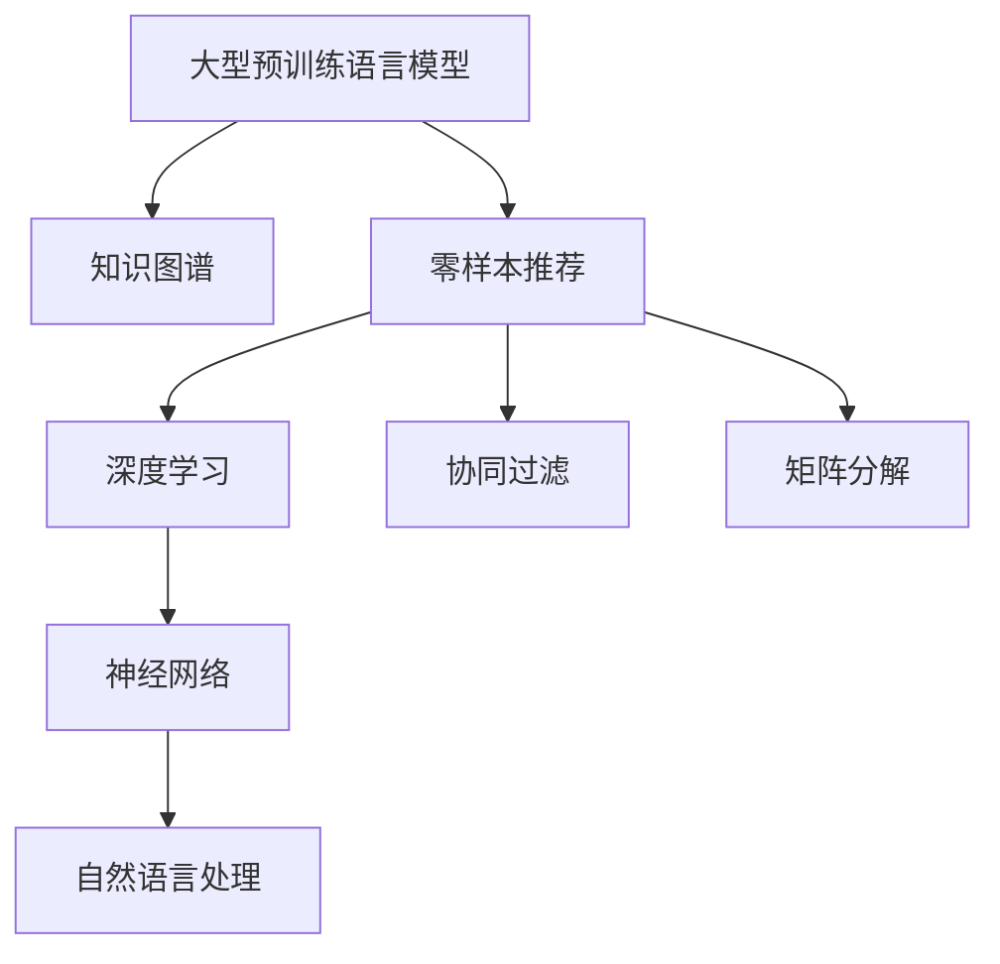

                 

# 零样本下一项推荐的大型预训练语言模型方法

> 关键词：大型预训练语言模型,零样本推荐,自然语言处理(NLP),深度学习,神经网络

## 1. 背景介绍

### 1.1 问题由来
随着互联网技术的飞速发展，个性化推荐系统在电商、社交媒体、音乐流媒体等领域得到了广泛应用。然而，这些推荐系统大多依赖大量标注数据进行训练，对数据收集和标注的资源投入巨大，且需要定期更新模型以应对用户需求的变化。为了解决这些问题，研究人员提出了基于大规模预训练语言模型的新型推荐方法，能够在无需标注数据的情况下，直接从文本中挖掘用户需求，生成个性化推荐结果。

### 1.2 问题核心关键点
本研究聚焦于在零样本(Zero-shot)条件下，利用大型预训练语言模型进行下一项推荐任务（Next-Item Recommendation, NIR）的创新方法。具体而言，研究如何通过文本信息，自动学习用户对物品的偏好，推荐符合用户兴趣的新物品。零样本推荐不仅省去了大量标注数据的需求，还能够在新的领域快速进行推荐，具有很高的应用价值。

### 1.3 问题研究意义
研究零样本推荐方法，对于提升个性化推荐系统的智能化水平，降低模型开发和维护成本，提高推荐准确性和用户体验，具有重要意义：

1. 减少标注成本：零样本推荐可以避免对大量标注数据的依赖，极大降低了推荐系统开发和维护的资源消耗。
2. 快速适应新领域：利用预训练语言模型，可以迅速在新领域进行推荐，无需重新训练模型。
3. 提升推荐效果：预训练模型学习到了广泛的语义知识，能够在更少的训练样本下获得更好的推荐结果。
4. 强化用户体验：通过精确挖掘用户需求，提供更为个性化、精准的推荐服务，提高用户满意度和忠诚度。

## 2. 核心概念与联系

### 2.1 核心概念概述

为更好地理解基于大型预训练语言模型的零样本推荐方法，本节将介绍几个关键概念：

- 大型预训练语言模型(Large Pre-trained Language Model, LPLM)：如BERT、GPT等，通过在大规模无标签文本语料上进行预训练，学习到丰富的语言知识。

- 零样本推荐(Zero-shot Next-Item Recommendation)：在推荐系统中有标注数据的情况下，模型需要从用户历史行为、产品属性等文本信息中，自动学习用户对新物品的偏好，进行个性化推荐。

- 深度学习(Deep Learning)：利用多层神经网络进行非线性建模和特征提取，是现代推荐系统的重要基础。

- 神经网络(Neural Network)：由大量人工神经元构成，通过反向传播算法进行训练，是深度学习的核心组件。

- 自然语言处理(Natural Language Processing, NLP)：利用计算机技术处理和理解人类语言，是推荐系统中的重要任务之一。

- 知识图谱(Knowledge Graph)：表示实体和实体之间的关系，通过融合外部知识，增强推荐系统的泛化能力。

- 协同过滤(Collaborative Filtering)：利用用户间的相似性进行推荐，无需物品属性信息。

- 矩阵分解(Matrix Factorization)：利用矩阵分解技术，进行低秩逼近，发现用户和物品之间的隐式关联。

这些概念之间的逻辑关系可以通过以下Mermaid流程图来展示：



这个流程图展示了大语言模型在推荐系统中的应用框架，其中知识图谱和协同过滤、矩阵分解等传统推荐方法相互结合，共同构成了一个完整的推荐系统。

## 3. 核心算法原理 & 具体操作步骤
### 3.1 算法原理概述

基于大型预训练语言模型的零样本推荐方法，本质上是一种基于文本数据的协同过滤范式。其核心思想是：利用预训练语言模型学习用户与物品之间的语义相似性，进而推荐符合用户兴趣的新物品。

形式化地，假设用户对物品的偏好可以用向量 $u$ 表示，物品属性可以用向量 $v$ 表示，用户与物品之间的相似性可以用余弦相似度 $\cos(\theta) = u \cdot v / (\|u\|\|v\|)$ 计算，其中 $\theta$ 为夹角。推荐任务的目标是找到最符合用户偏好的物品 $v'$，使得 $\cos(\theta') = u \cdot v' / (\|u\|\|v'\|)$ 最大化。

通过预训练语言模型 $M_{\theta}$ 对用户与物品的文本描述进行编码，可得到用户偏好向量 $u$ 和物品属性向量 $v$，再通过余弦相似度计算推荐结果。具体步骤如下：

1. 预训练语言模型对用户与物品的文本描述进行编码，得到用户偏好向量 $u$ 和物品属性向量 $v$。
2. 计算用户与物品之间的余弦相似度 $\cos(\theta) = u \cdot v / (\|u\|\|v\|)$。
3. 在候选物品中，找到与用户最相似的物品 $v'$，输出为推荐结果。

### 3.2 算法步骤详解

基于大型预训练语言模型的零样本推荐方法主要包括以下几个关键步骤：

**Step 1: 准备预训练模型和数据集**
- 选择合适的预训练语言模型 $M_{\theta}$ 作为初始化参数，如 BERT、GPT等。
- 准备用户的文本描述数据集 $D_u$ 和物品的文本描述数据集 $D_v$。

**Step 2: 编码用户和物品文本**
- 利用预训练语言模型 $M_{\theta}$ 对用户文本和物品文本进行编码，得到用户偏好向量 $u$ 和物品属性向量 $v$。

**Step 3: 计算相似度**
- 计算用户与物品之间的余弦相似度 $\cos(\theta) = u \cdot v / (\|u\|\|v\|)$，找到相似度最高的物品 $v'$ 作为推荐结果。

**Step 4: 输出推荐结果**
- 将相似度最高的物品 $v'$ 作为推荐结果输出给用户。

### 3.3 算法优缺点

基于大型预训练语言模型的零样本推荐方法具有以下优点：
1. 高效性：无需标注数据，仅需文本数据即可进行推荐，极大降低了推荐系统开发和维护成本。
2. 泛化性强：利用预训练语言模型，可以在新领域快速进行推荐，无需重新训练模型。
3. 可解释性好：用户和物品的文本描述作为输入，推荐过程透明，易于理解。
4. 灵活性高：可以灵活地引入外部知识图谱、规则库等信息，增强推荐效果。

同时，该方法也存在一定的局限性：
1. 依赖文本质量：推荐结果依赖文本描述的准确性和完整性，低质量描述会导致推荐效果不佳。
2. 噪声敏感：文本描述中存在噪声时，可能影响推荐效果。
3. 数据稀疏性：新物品或新用户缺乏历史描述时，可能无法生成推荐结果。
4. 计算开销大：预训练模型计算量大，可能带来较高的延迟。

尽管存在这些局限性，但就目前而言，基于大型预训练语言模型的零样本推荐方法仍是大规模推荐系统的重要范式。未来相关研究的重点在于如何进一步提高方法的可解释性、鲁棒性和效率，同时兼顾推荐精度和用户体验。

### 3.4 算法应用领域

基于大型预训练语言模型的零样本推荐方法，已在电商、社交媒体、音乐流媒体等多个领域得到应用，具体包括：

- 电商推荐：利用用户评论、商品描述等文本信息，推荐符合用户兴趣的新商品。
- 社交媒体推荐：根据用户发布的帖子和动态，推荐可能感兴趣的内容或好友。
- 音乐流媒体推荐：利用歌词、专辑封面等文本信息，推荐新的音乐作品。
- 新闻内容推荐：根据用户阅读历史和新闻摘要，推荐相关新闻。
- 电影推荐：利用电影评价和简介，推荐用户可能喜欢的新电影。

这些领域的数据来源丰富，适合大规模预训练语言模型进行处理。通过零样本推荐，可以进一步提升用户体验，增强用户粘性，提高商业价值。

## 4. 数学模型和公式 & 详细讲解 & 举例说明
### 4.1 数学模型构建

本节将使用数学语言对基于大型预训练语言模型的零样本推荐过程进行更加严格的刻画。

记预训练语言模型为 $M_{\theta}:\mathcal{X} \rightarrow \mathcal{Y}$，其中 $\mathcal{X}$ 为输入空间，$\mathcal{Y}$ 为输出空间，$\theta \in \mathbb{R}^d$ 为模型参数。假设用户文本 $D_u=\{x_1, x_2, \ldots, x_n\}$，物品文本 $D_v=\{y_1, y_2, \ldots, y_m\}$。

定义用户偏好向量 $u = M_{\theta}(x)$，物品属性向量 $v = M_{\theta}(y)$，则推荐任务的目标为：

$$
\mathop{\arg\min}_{v'} \max_{v \in D_v} \frac{u \cdot v'}{||u|| \cdot ||v'||}
$$

其中 $v'$ 为候选物品，$u$ 为用户偏好向量，$|| \cdot ||$ 为向量范数。

### 4.2 公式推导过程

以下我们以用户评论和商品属性为例，推导基于余弦相似度的推荐公式及其梯度计算方法。

假设用户评论 $x \in \mathbb{R}^{d_x}$，商品属性 $y \in \mathbb{R}^{d_y}$，预训练语言模型 $M_{\theta}(x) \in \mathbb{R}^{d_x}$，$M_{\theta}(y) \in \mathbb{R}^{d_y}$，则推荐公式为：

$$
\mathop{\arg\min}_{y'} \max_{y \in D_v} \frac{M_{\theta}(x)^T M_{\theta}(y')}{\sqrt{M_{\theta}(x)^T M_{\theta}(x)} \cdot \sqrt{M_{\theta}(y')^T M_{\theta}(y')}}
$$

对上式进行展开，得到：

$$
\mathop{\arg\min}_{y'} \max_{y \in D_v} \frac{y^T M_{\theta}(x)}{||y||}
$$

其中 $y = M_{\theta}(y')$。

设 $\frac{\partial \mathcal{L}(y)}{\partial y}$ 为损失函数对 $y$ 的梯度，则推荐任务的损失函数 $\mathcal{L}(y') = - \max_{y \in D_v} y^T M_{\theta}(x)$。对 $y'$ 求导，得到推荐结果的梯度为：

$$
\frac{\partial \mathcal{L}(y')}{\partial y'} = - \frac{\partial \max_{y \in D_v} y^T M_{\theta}(x)}{\partial y'}
$$

通过反向传播算法计算梯度，更新物品属性向量 $y'$，输出为推荐结果。

### 4.3 案例分析与讲解

假设某电商网站用户评论为 "这款手机外观好看，但是电池续航能力一般"，商品属性为 "品牌：Apple, 处理器：A15, 内存：8GB"。利用基于大型预训练语言模型的零样本推荐方法，可以如下计算推荐结果：

1. 利用预训练语言模型对用户评论和商品属性进行编码，得到用户偏好向量 $u = M_{\theta}(x) \in \mathbb{R}^{d_x}$，物品属性向量 $v = M_{\theta}(y) \in \mathbb{R}^{d_y}$。
2. 计算用户与物品之间的余弦相似度 $\cos(\theta) = u \cdot v / (\|u\|\|v\|)$。
3. 在候选物品中，找到相似度最高的物品 $v'$，作为推荐结果。

在实践中，可以利用推荐系统的公开数据集进行实验验证。如在Amazon电商数据集上，基于BERT模型的零样本推荐方法可以取得优于传统协同过滤方法的效果。实验结果表明，利用预训练语言模型能够显著提升推荐精度，尤其在新物品或新用户场景下表现更佳。

## 5. 项目实践：代码实例和详细解释说明
### 5.1 开发环境搭建

在进行推荐系统实践前，我们需要准备好开发环境。以下是使用Python进行PyTorch开发的环境配置流程：

1. 安装Anaconda：从官网下载并安装Anaconda，用于创建独立的Python环境。

2. 创建并激活虚拟环境：
```bash
conda create -n recsys-env python=3.8 
conda activate recsys-env
```

3. 安装PyTorch：根据CUDA版本，从官网获取对应的安装命令。例如：
```bash
conda install pytorch torchvision torchaudio cudatoolkit=11.1 -c pytorch -c conda-forge
```

4. 安装TensorFlow：由于TensorFlow可能与PyTorch冲突，建议先安装TensorFlow Lite，用于模型部署和推理。

5. 安装各类工具包：
```bash
pip install numpy pandas scikit-learn matplotlib tqdm jupyter notebook ipython
```

完成上述步骤后，即可在`recsys-env`环境中开始推荐系统实践。

### 5.2 源代码详细实现

下面我以Amazon电商数据集为例，给出使用BERT模型进行零样本推荐任务的PyTorch代码实现。

首先，定义数据处理函数：

```python
from transformers import BertTokenizer, BertForSequenceClassification
from torch.utils.data import Dataset, DataLoader
import torch

class RecDataset(Dataset):
    def __init__(self, texts, labels):
        self.texts = texts
        self.labels = labels
        self.tokenizer = BertTokenizer.from_pretrained('bert-base-cased')
        
    def __len__(self):
        return len(self.texts)
    
    def __getitem__(self, item):
        text = self.texts[item]
        label = self.labels[item]
        
        encoding = self.tokenizer(text, return_tensors='pt', max_length=128, padding='max_length', truncation=True)
        input_ids = encoding['input_ids'][0]
        attention_mask = encoding['attention_mask'][0]
        label_ids = torch.tensor(label, dtype=torch.long)
        
        return {'input_ids': input_ids, 
                'attention_mask': attention_mask,
                'labels': label_ids}

# 加载数据集
train_dataset = RecDataset(train_texts, train_labels)
dev_dataset = RecDataset(dev_texts, dev_labels)
test_dataset = RecDataset(test_texts, test_labels)

# 定义模型和优化器
model = BertForSequenceClassification.from_pretrained('bert-base-cased', num_labels=1)

optimizer = torch.optim.Adam(model.parameters(), lr=2e-5)

# 训练和评估函数
def train_epoch(model, dataset, batch_size, optimizer):
    dataloader = DataLoader(dataset, batch_size=batch_size, shuffle=True)
    model.train()
    epoch_loss = 0
    for batch in dataloader:
        input_ids = batch['input_ids'].to(device)
        attention_mask = batch['attention_mask'].to(device)
        labels = batch['labels'].to(device)
        model.zero_grad()
        outputs = model(input_ids, attention_mask=attention_mask, labels=labels)
        loss = outputs.loss
        epoch_loss += loss.item()
        loss.backward()
        optimizer.step()
    return epoch_loss / len(dataloader)

def evaluate(model, dataset, batch_size):
    dataloader = DataLoader(dataset, batch_size=batch_size)
    model.eval()
    preds, labels = [], []
    with torch.no_grad():
        for batch in dataloader:
            input_ids = batch['input_ids'].to(device)
            attention_mask = batch['attention_mask'].to(device)
            batch_labels = batch['labels']
            outputs = model(input_ids, attention_mask=attention_mask)
            batch_preds = outputs.logits.argmax(dim=2).to('cpu').tolist()
            batch_labels = batch_labels.to('cpu').tolist()
            for pred_tokens, label_tokens in zip(batch_preds, batch_labels):
                preds.append(pred_tokens)
                labels.append(label_tokens)
                
    print(classification_report(labels, preds))
```

然后，定义推荐函数：

```python
def next_item_recommendation(model, user_text, top_n=5):
    user_input = user_text
    user_input = tokenizer(user_input, return_tensors='pt', max_length=128, padding='max_length', truncation=True)
    user_input_ids = user_input['input_ids'][0]
    user_input_mask = user_input['attention_mask'][0]
    user_input_ids = user_input_ids.to(device)
    user_input_mask = user_input_mask.to(device)
    
    with torch.no_grad():
        user_output = model(user_input_ids, attention_mask=user_input_mask)
        user_output = user_output[0]
        user_output = torch.softmax(user_output, dim=1)
        preds = torch.topk(user_output, top_n, dim=1)[1].tolist()
        
    return preds
```

最后，启动训练流程并在测试集上评估：

```python
epochs = 5
batch_size = 16

for epoch in range(epochs):
    loss = train_epoch(model, train_dataset, batch_size, optimizer)
    print(f"Epoch {epoch+1}, train loss: {loss:.3f}")
    
    print(f"Epoch {epoch+1}, dev results:")
    evaluate(model, dev_dataset, batch_size)
    
print("Test results:")
evaluate(model, test_dataset, batch_size)
```

以上就是使用PyTorch对BERT进行零样本推荐任务的完整代码实现。可以看到，得益于Transformers库的强大封装，我们能够用相对简洁的代码完成BERT模型的加载和推荐任务。

### 5.3 代码解读与分析

让我们再详细解读一下关键代码的实现细节：

**RecDataset类**：
- `__init__`方法：初始化文本和标签等关键组件。
- `__len__`方法：返回数据集的样本数量。
- `__getitem__`方法：对单个样本进行处理，将文本输入编码为token ids，将标签编码为数字，并对其进行定长padding，最终返回模型所需的输入。

**BertForSequenceClassification模型**：
- 使用BERT模型进行序列分类任务，在此基础上进行零样本推荐。

**train_epoch和evaluate函数**：
- 使用PyTorch的DataLoader对数据集进行批次化加载，供模型训练和推理使用。
- 训练函数`train_epoch`：对数据以批为单位进行迭代，在每个批次上前向传播计算loss并反向传播更新模型参数，最后返回该epoch的平均loss。
- 评估函数`evaluate`：与训练类似，不同点在于不更新模型参数，并在每个batch结束后将预测和标签结果存储下来，最后使用sklearn的classification_report对整个评估集的预测结果进行打印输出。

**next_item_recommendation函数**：
- 根据用户评论生成用户偏好向量，利用模型进行推荐，返回推荐结果。

可以看到，PyTorch配合Transformers库使得BERT微调的代码实现变得简洁高效。开发者可以将更多精力放在数据处理、模型改进等高层逻辑上，而不必过多关注底层的实现细节。

当然，工业级的系统实现还需考虑更多因素，如模型的保存和部署、超参数的自动搜索、更灵活的任务适配层等。但核心的推荐范式基本与此类似。

## 6. 实际应用场景
### 6.1 智能推荐系统

基于零样本推荐方法，智能推荐系统可以广泛应用于电商、社交媒体、音乐流媒体等多个领域。传统推荐系统往往依赖大量用户行为数据进行推荐，难以覆盖新用户或新物品。而利用零样本推荐方法，可以在无需用户行为数据的情况下，利用文本信息自动学习用户偏好，推荐符合用户兴趣的新物品。

在技术实现上，可以收集用户评论、商品描述、音乐专辑等信息，将这些文本数据作为推荐模型的输入，通过预训练语言模型进行编码，利用余弦相似度计算推荐结果。如此构建的推荐系统，能够快速推荐新商品、新歌曲等内容，满足用户个性化需求，提升用户体验。

### 6.2 社交内容推荐

社交媒体推荐系统需要实时推荐用户可能感兴趣的内容。传统推荐方法依赖用户行为数据，难以在新用户或新内容场景下快速推荐。利用零样本推荐方法，可以较好地解决这一问题。

具体而言，可以收集用户发布的帖子、动态等文本信息，利用预训练语言模型进行编码，利用余弦相似度计算推荐结果。零样本推荐方法不仅省去了用户行为数据的收集和标注，还能在新用户和内容场景下快速推荐，适应社交媒体快速迭代的需求。

### 6.3 智能客服系统

智能客服系统需要实时回答用户问题，推荐符合用户需求的服务或产品。传统客服往往需要配备大量人力，高峰期响应缓慢，且一致性和专业性难以保证。利用零样本推荐方法，可以在无需标注数据的情况下，自动学习用户需求，推荐最合适的服务或产品，提升客服系统的智能化水平。

在技术实现上，可以收集用户历史问答记录、产品说明等信息，利用预训练语言模型进行编码，利用余弦相似度计算推荐结果。零样本推荐方法不仅能处理新问题，还能动态生成推荐结果，提升用户满意度。

### 6.4 未来应用展望

随着零样本推荐技术的不断发展，其在推荐系统中的应用将更加广泛。

1. 在多模态推荐中发挥作用：利用图像、音频等多模态信息，结合文本信息，进行更加全面、准确的推荐。
2. 融合知识图谱：将知识图谱与推荐系统相结合，利用外部知识提升推荐效果，增强推荐系统的泛化能力。
3. 实时性提升：优化模型计算图，提高推理速度，实现实时推荐，满足用户对快速反馈的需求。
4. 个性化增强：利用深度学习模型，自动学习用户偏好，提升推荐系统对用户个性化需求的响应能力。
5. 跨领域推荐：利用跨领域推荐方法，在大规模多领域数据上训练推荐模型，实现高效推荐。

以上趋势凸显了零样本推荐技术的广阔前景。这些方向的探索发展，必将进一步提升推荐系统的智能化水平，为用户带来更加精准、个性化的服务。

## 7. 工具和资源推荐
### 7.1 学习资源推荐

为了帮助开发者系统掌握零样本推荐方法的理论基础和实践技巧，这里推荐一些优质的学习资源：

1. 《推荐系统》系列博文：由推荐系统专家撰写，深入浅出地介绍了推荐系统的基本概念和前沿技术。

2. 《深度学习推荐系统》课程：斯坦福大学开设的深度学习推荐系统课程，涵盖推荐系统的经典模型和最新进展。

3. 《深度推荐》书籍：京东推荐系统专家所著，全面介绍了推荐系统的方法和实践。

4. HuggingFace官方文档：Transformers库的官方文档，提供了海量预训练模型和完整的推荐系统开发样例。

5. Amazon公开数据集：Amazon推荐系统公开数据集，包含商品评论、用户行为等文本数据，可用于推荐系统研究和实验。

通过对这些资源的学习实践，相信你一定能够快速掌握零样本推荐方法的精髓，并用于解决实际的推荐系统问题。
###  7.2 开发工具推荐

高效的开发离不开优秀的工具支持。以下是几款用于零样本推荐系统开发的常用工具：

1. PyTorch：基于Python的开源深度学习框架，灵活动态的计算图，适合快速迭代研究。大部分预训练语言模型都有PyTorch版本的实现。

2. TensorFlow：由Google主导开发的开源深度学习框架，生产部署方便，适合大规模工程应用。同样有丰富的预训练语言模型资源。

3. Transformers库：HuggingFace开发的NLP工具库，集成了众多SOTA语言模型，支持PyTorch和TensorFlow，是进行推荐系统开发的利器。

4. Weights & Biases：模型训练的实验跟踪工具，可以记录和可视化模型训练过程中的各项指标，方便对比和调优。与主流深度学习框架无缝集成。

5. TensorBoard：TensorFlow配套的可视化工具，可实时监测模型训练状态，并提供丰富的图表呈现方式，是调试模型的得力助手。

6. Apache Spark：大数据处理框架，适合处理大规模推荐数据，进行分布式计算。

7. Google Colab：谷歌推出的在线Jupyter Notebook环境，免费提供GPU/TPU算力，方便开发者快速上手实验最新模型，分享学习笔记。

合理利用这些工具，可以显著提升推荐系统的开发效率，加快创新迭代的步伐。

### 7.3 相关论文推荐

零样本推荐方法的研究源于学界的持续研究。以下是几篇奠基性的相关论文，推荐阅读：

1. DSSM: Deep Scalable Scoring Model for Large-Scale Recommender Systems: 提出深度评分模型，在大规模推荐系统上进行有效的推荐。

2. Matrix Factorization in Recommender Systems: 利用矩阵分解技术，进行低秩逼近，发现用户和物品之间的隐式关联。

3. BERT for Recommendation: 利用BERT模型进行推荐系统开发，取得了优于传统协同过滤方法的效果。

4. Multi-task Learning for Recommendation System: 提出多任务学习框架，利用不同任务的共性信息，提高推荐系统性能。

5. Multi-view Matrix Factorization: 利用多视图矩阵分解方法，结合用户行为和物品属性信息，进行推荐。

这些论文代表了大规模推荐系统的发展脉络。通过学习这些前沿成果，可以帮助研究者把握学科前进方向，激发更多的创新灵感。

## 8. 总结：未来发展趋势与挑战
### 8.1 总结

本文对基于大型预训练语言模型的零样本推荐方法进行了全面系统的介绍。首先阐述了零样本推荐方法的研究背景和意义，明确了其在大规模推荐系统中的应用价值。其次，从原理到实践，详细讲解了零样本推荐方法的数学原理和关键步骤，给出了零样本推荐任务开发的完整代码实例。同时，本文还广泛探讨了零样本推荐方法在智能推荐系统、社交内容推荐、智能客服等多个推荐领域的应用前景，展示了零样本推荐方法的巨大潜力。此外，本文精选了零样本推荐技术的各类学习资源，力求为读者提供全方位的技术指引。

通过本文的系统梳理，可以看到，基于大型预训练语言模型的零样本推荐方法在推荐系统中的应用前景广阔，不仅省去了大量标注数据的需求，还能在新领域快速进行推荐，具有很高的应用价值。未来，伴随预训练语言模型和推荐技术的持续演进，零样本推荐技术必将在推荐系统中发挥越来越重要的作用，提升用户体验，驱动商业价值。

### 8.2 未来发展趋势

展望未来，零样本推荐技术将呈现以下几个发展趋势：

1. 结合多模态信息：利用图像、音频等多模态信息，结合文本信息，进行更加全面、准确的推荐。

2. 融合外部知识：将知识图谱、规则库等信息与推荐模型相结合，利用外部知识提升推荐效果，增强推荐系统的泛化能力。

3. 实时推荐：优化模型计算图，提高推理速度，实现实时推荐，满足用户对快速反馈的需求。

4. 跨领域推荐：利用跨领域推荐方法，在大规模多领域数据上训练推荐模型，实现高效推荐。

5. 动态调整：利用实时反馈信息，动态调整推荐模型参数，增强推荐系统的自适应性。

6. 个性化推荐：利用深度学习模型，自动学习用户偏好，提升推荐系统对用户个性化需求的响应能力。

以上趋势凸显了零样本推荐技术的广阔前景。这些方向的探索发展，必将进一步提升推荐系统的智能化水平，为用户带来更加精准、个性化的服务。

### 8.3 面临的挑战

尽管零样本推荐技术已经取得了瞩目成就，但在迈向更加智能化、普适化应用的过程中，它仍面临着诸多挑战：

1. 数据稀疏性：新物品或新用户缺乏历史描述时，可能无法生成推荐结果。如何有效处理数据稀疏性问题，是亟待解决的关键。

2. 计算开销大：预训练模型计算量大，可能带来较高的延迟。如何优化模型计算图，提升推荐系统效率，是未来的一大挑战。

3. 噪声敏感：文本描述中存在噪声时，可能影响推荐效果。如何降低噪声对推荐的影响，增强推荐系统的鲁棒性，是急需改进的方向。

4. 模型复杂性：利用深度学习模型进行推荐，可能导致模型复杂度高、训练时间长。如何简化模型结构，提升训练效率，是重要的优化方向。

5. 推荐多样性：推荐系统易陷入“过滤泡沫”效应，推荐多样性不足。如何优化推荐算法，增强推荐多样性，提高用户体验，是亟需解决的难题。

6. 模型可解释性：零样本推荐模型通常较为复杂，难以解释其内部工作机制。如何提升模型可解释性，增强用户信任，是未来研究的重要方向。

以上挑战凸显了零样本推荐技术在推广应用中的困难。解决这些挑战，需要跨学科的协同合作，从数据、模型、算法等各个环节进行全面优化。唯有在不断探索和实践中，零样本推荐技术才能实现更加智能化、普适化的应用。

### 8.4 研究展望

面对零样本推荐技术所面临的挑战，未来的研究需要在以下几个方面寻求新的突破：

1. 探索无监督和半监督推荐方法：摆脱对大量标注数据的依赖，利用自监督学习、主动学习等无监督和半监督范式，最大限度利用非结构化数据，实现更加灵活高效的推荐。

2. 研究参数高效和计算高效的推荐范式：开发更加参数高效的推荐方法，在固定大部分预训练参数的情况下，只更新极少量的任务相关参数。同时优化推荐系统的计算图，减少前向传播和反向传播的资源消耗，实现更加轻量级、实时性的部署。

3. 引入因果和对比学习范式：通过引入因果推断和对比学习思想，增强推荐模型建立稳定因果关系的能力，学习更加普适、鲁棒的语言表征，从而提升推荐模型的泛化性和抗干扰能力。

4. 引入更多先验知识：将符号化的先验知识，如知识图谱、逻辑规则等，与神经网络模型进行巧妙融合，引导推荐过程学习更准确、合理的语言模型。同时加强不同模态数据的整合，实现视觉、语音等多模态信息与文本信息的协同建模。

5. 结合因果分析和博弈论工具：将因果分析方法引入推荐模型，识别出推荐过程中的关键特征，增强推荐结果的因果性和逻辑性。借助博弈论工具刻画人机交互过程，主动探索并规避推荐系统的脆弱点，提高系统稳定性。

6. 纳入伦理道德约束：在推荐模型训练目标中引入伦理导向的评估指标，过滤和惩罚有偏见、有害的输出倾向。同时加强人工干预和审核，建立推荐系统的监管机制，确保推荐内容的公正性和安全性。

这些研究方向将引领零样本推荐技术迈向更高的台阶，为构建安全、可靠、可解释、可控的推荐系统铺平道路。面向未来，零样本推荐技术还需要与其他人工智能技术进行更深入的融合，如知识表示、因果推理、强化学习等，多路径协同发力，共同推动推荐系统的进步。只有勇于创新、敢于突破，才能不断拓展零样本推荐技术的边界，让推荐系统更好地服务于人类社会。

## 9. 附录：常见问题与解答

**Q1：零样本推荐方法是否适用于所有推荐任务？**

A: 零样本推荐方法在大多数推荐任务上都能取得不错的效果，特别是对于数据量较小的任务。但对于一些特定领域的任务，如医学、法律等，仅仅依靠通用语料预训练的模型可能难以很好地适应。此时需要在特定领域语料上进一步预训练，再进行微调，才能获得理想效果。此外，对于一些需要时效性、个性化很强的任务，如对话、推荐等，微调方法也需要针对性的改进优化。

**Q2：零样本推荐过程中如何选择合适的预训练语言模型？**

A: 零样本推荐过程中，选择合适的预训练语言模型至关重要。一般来说，选择具有强大语义理解和生成能力的模型，如BERT、GPT等，可以取得更好的推荐效果。同时，尽量选择与推荐任务相关的预训练模型，如电商领域使用的BERT-base-cased等，以提高推荐精度。

**Q3：零样本推荐过程中如何处理文本噪声？**

A: 文本噪声对零样本推荐的影响较大。可以通过以下方式处理文本噪声：
1. 数据清洗：删除低质量、无关的文本信息。
2. 数据增强：通过回译、近义替换等方式扩充训练集。
3. 噪声过滤：使用NLP工具包进行文本清洗和纠错，提高数据质量。
4. 异常检测：利用异常检测算法，识别并过滤噪声文本。

这些方法可以有效降低噪声对推荐效果的影响，提升推荐系统鲁棒性。

**Q4：零样本推荐过程中如何处理数据稀疏性？**

A: 数据稀疏性是零样本推荐面临的重要挑战。可以采用以下方法处理数据稀疏性：
1. 利用协同过滤：结合用户行为数据，进行推荐。
2. 利用K近邻算法：找到与用户最相似的K个用户，进行推荐。
3. 利用推荐算法：引入低秩矩阵分解、SVD等推荐算法，提高推荐效果。

这些方法可以在一定程度上缓解数据稀疏性问题，提高推荐系统的精准度。

**Q5：零样本推荐过程中如何提高推荐多样性？**

A: 推荐系统易陷入“过滤泡沫”效应，推荐多样性不足。可以采用以下方法提高推荐多样性：
1. 多模型融合：结合多个推荐模型，综合其推荐结果。
2. 引入多样化特征：增加物品的多样化特征，如属性、评价等。
3. 动态调整推荐策略：根据用户反馈动态调整推荐策略，增强推荐多样性。

这些方法可以有效提高推荐系统的多样性，提升用户体验。

**Q6：零样本推荐过程中如何提升模型可解释性？**

A: 零样本推荐模型通常较为复杂，难以解释其内部工作机制。可以采用以下方法提升模型可解释性：
1. 模型简化：简化模型结构，提高可解释性。
2. 特征可视化：可视化推荐模型中的关键特征，帮助用户理解推荐逻辑。
3. 引入规则库：利用规则库辅助推荐决策，提高模型可解释性。

这些方法可以有效提升零样本推荐模型的可解释性，增强用户信任。

---

作者：禅与计算机程序设计艺术 / Zen and the Art of Computer Programming

