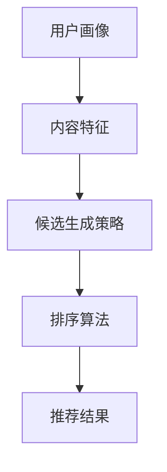

                 

# 零样本推荐系统的候选生成策略：对排序的考量

在当前这个信息爆炸的时代，如何高效地为每位用户推荐他们可能感兴趣的内容，成为了众多互联网企业面临的重要挑战。推荐系统通过分析和理解用户行为、偏好以及内容的特征，来预测用户可能喜欢的内容，从而提升用户体验和平台的转化率。然而，推荐系统在实际应用中面临诸多难题，其中之一便是零样本推荐，即在用户没有提供任何反馈数据的情况下，如何生成高质量的推荐候选。本文将探讨零样本推荐中的候选生成策略，特别是如何通过考虑排序对推荐系统进行优化。

## 1. 背景介绍

### 1.1 推荐系统的发展

推荐系统的发展历程可以分为三个阶段：基于内容的推荐、协同过滤推荐以及混合推荐。最初，推荐系统主要依赖于用户的历史行为数据和物品的属性信息来进行推荐。随后，协同过滤推荐通过分析用户之间的相似性来进行推荐，包括基于用户的协同过滤和基于物品的协同过滤。最后，随着深度学习技术的兴起，混合推荐系统将传统推荐方法与机器学习、神经网络等技术相结合，提升了推荐的精度和个性化程度。

### 1.2 零样本推荐问题的提出

零样本推荐是推荐系统中的一个特殊场景，即在没有用户反馈数据的情况下，如何为每位用户生成可能感兴趣的内容。这种场景在实际应用中广泛存在，例如新用户的注册推荐、冷启动推荐等。零样本推荐问题对于推荐系统的要求非常高，因为其无法借助用户的历史行为数据进行推荐，只能依靠对内容的先验知识和用户画像来进行推测。

## 2. 核心概念与联系

### 2.1 核心概念概述

在零样本推荐中，候选生成策略是实现推荐的核心步骤之一。候选生成策略的优劣直接影响到后续排序的质量，因此考虑排序对零样本推荐具有重要意义。

- **候选生成策略**：用于从候选集中筛选出可能满足用户兴趣的内容。常见的候选生成策略包括基于内容的推荐、协同过滤推荐、基于矩阵分解的方法等。
- **排序**：根据用户兴趣、内容相关性等因素对候选集进行排序，以选择最可能被用户喜欢的内容。排序算法包括基于深度学习的排序、基于协同过滤的排序、基于混合方法的排序等。

### 2.2 核心概念原理和架构的 Mermaid 流程图



这个流程图展示了零样本推荐中候选生成策略和排序算法的核心关系。用户画像和内容特征作为输入，通过候选生成策略生成候选集，再由排序算法对候选集进行排序，最终输出推荐结果。

## 3. 核心算法原理 & 具体操作步骤

### 3.1 算法原理概述

零样本推荐中的候选生成策略和排序算法是推荐系统的重要组成部分。本节将介绍几种常见的候选生成策略和排序算法，并探讨其在零样本推荐中的应用。

### 3.2 算法步骤详解

#### 3.2.1 候选生成策略

**基于内容的推荐**：通过分析物品的属性特征和用户的历史行为数据，推荐与用户兴趣相似的物品。然而，在零样本推荐中，没有用户的历史行为数据可用，因此需要依赖内容特征进行推荐。

**协同过滤推荐**：通过分析用户之间的相似性，推荐与目标用户兴趣相似的其他用户的喜好。在零样本推荐中，可以采用基于内容的协同过滤方法，通过计算物品与目标用户的相似度来进行推荐。

**基于矩阵分解的方法**：将用户-物品交互矩阵分解为低秩矩阵，通过矩阵分解的结果来推荐新用户可能感兴趣的物品。在零样本推荐中，可以采用基于矩阵分解的方法，通过预训练模型来学习物品的潜在特征，进行推荐。

#### 3.2.2 排序算法

**基于深度学习的排序**：通过训练深度学习模型，预测用户对物品的评分或偏好，从而对候选集进行排序。在零样本推荐中，可以采用预训练的语言模型（如BERT、GPT等）进行排序。

**基于协同过滤的排序**：通过分析用户之间的相似性，推荐与目标用户相似的其他用户的喜好。在零样本推荐中，可以采用基于协同过滤的排序算法，通过计算物品与目标用户的相似度来进行排序。

**基于混合方法的排序**：将基于内容的推荐、协同过滤推荐和基于矩阵分解的方法进行混合，提升推荐的精度和泛化能力。在零样本推荐中，可以采用混合排序方法，综合考虑多种推荐策略的结果。

### 3.3 算法优缺点

**基于内容的推荐**

- 优点：简单易实现，计算复杂度低。
- 缺点：依赖内容特征的准确性，无法处理冷启动和多样性问题。

**协同过滤推荐**

- 优点：能够处理冷启动和多样性问题，具有较好的推荐效果。
- 缺点：需要大量用户数据，难以处理新物品和不同领域的推荐。

**基于矩阵分解的方法**

- 优点：能够处理冷启动和多样性问题，具有较好的推荐效果。
- 缺点：需要大量用户数据，难以处理新物品和不同领域的推荐。

**基于深度学习的排序**

- 优点：能够处理复杂的推荐场景，具有较好的泛化能力。
- 缺点：需要大量的标注数据，计算复杂度较高。

**基于协同过滤的排序**

- 优点：能够处理冷启动和多样性问题，具有较好的推荐效果。
- 缺点：需要大量用户数据，难以处理新物品和不同领域的推荐。

**基于混合方法的排序**

- 优点：综合考虑多种推荐策略，具有较好的推荐效果。
- 缺点：计算复杂度较高，需要大量用户数据。

### 3.4 算法应用领域

基于内容的推荐和协同过滤推荐广泛应用于电商、社交网络、音乐、视频等领域。基于矩阵分解的方法在推荐系统的预训练阶段中具有广泛应用。基于深度学习的排序算法在新闻、视频、音乐等领域具有较好的推荐效果。基于混合方法的排序算法在多个领域中都有应用。

## 4. 数学模型和公式 & 详细讲解 & 举例说明

### 4.1 数学模型构建

本节将使用数学语言对零样本推荐中的候选生成策略和排序算法进行详细阐述。

假设目标用户为 $u$，候选物品集合为 $\mathcal{I}$，用户对物品的评分矩阵为 $R_{u,\mathcal{I}}$，用户画像向量为 $x_u$，物品特征向量为 $\mathbf{v}_i$，物品-物品相似度矩阵为 $\mathbf{S}_{\mathcal{I}}$。

### 4.2 公式推导过程

#### 4.2.1 基于内容的推荐

基于内容的推荐可以通过计算物品与用户画像向量的余弦相似度来进行推荐。设物品 $i$ 的特征向量为 $\mathbf{v}_i$，用户画像向量为 $x_u$，则物品 $i$ 与用户 $u$ 的相似度 $s_{ui}$ 可以表示为：

$$
s_{ui} = \cos(\mathbf{v}_i, x_u) = \frac{\mathbf{v}_i \cdot x_u}{\|\mathbf{v}_i\| \|\mathbf{x}_u\|}
$$

推荐物品 $i$ 的概率为：

$$
p_{ui} = \frac{s_{ui}}{\sum_{j \in \mathcal{I}} s_{uj}}
$$

#### 4.2.2 协同过滤推荐

协同过滤推荐可以通过计算物品与用户之间的相似度来进行推荐。设物品 $i$ 与用户 $u$ 的相似度为 $s_{iu}$，则推荐物品 $i$ 的概率为：

$$
p_{ui} = \frac{s_{iu}}{\sum_{j \in \mathcal{I}} s_{uj}}
$$

#### 4.2.3 基于矩阵分解的方法

基于矩阵分解的方法可以通过对用户-物品交互矩阵进行分解来推荐新物品。假设用户-物品交互矩阵为 $R$，分解为低秩矩阵 $\mathbf{U}, \mathbf{V}$，则物品 $i$ 与用户 $u$ 的相似度 $s_{ui}$ 可以表示为：

$$
s_{ui} = \mathbf{u}_u^T \mathbf{v}_i
$$

推荐物品 $i$ 的概率为：

$$
p_{ui} = \frac{s_{ui}}{\sum_{j \in \mathcal{I}} s_{uj}}
$$

#### 4.2.4 基于深度学习的排序

基于深度学习的排序可以通过训练深度学习模型来预测用户对物品的评分。假设使用预训练的语言模型 $f(\mathbf{x}_u)$ 对用户画像向量 $x_u$ 进行编码，使用预训练的语言模型 $g(\mathbf{v}_i)$ 对物品特征向量 $\mathbf{v}_i$ 进行编码，则物品 $i$ 与用户 $u$ 的相似度 $s_{ui}$ 可以表示为：

$$
s_{ui} = f(\mathbf{x}_u) \cdot g(\mathbf{v}_i)
$$

推荐物品 $i$ 的概率为：

$$
p_{ui} = \frac{s_{ui}}{\sum_{j \in \mathcal{I}} s_{uj}}
$$

### 4.3 案例分析与讲解

#### 案例分析

假设我们有一个用户画像向量 $x_u = [1, 2, 3, 4]$，物品特征向量 $\mathbf{v}_i = [5, 6, 7, 8]$，物品-物品相似度矩阵 $\mathbf{S}_{\mathcal{I}} = [[0.5, 0.3, 0.1], [0.4, 0.6, 0.2], [0.3, 0.5, 0.2]]$，则物品 $i=1$ 与用户 $u$ 的相似度 $s_{ui}$ 可以表示为：

$$
s_{ui} = \frac{1 \cdot 1 + 2 \cdot 2 + 3 \cdot 3 + 4 \cdot 4}{\sqrt{1^2 + 2^2 + 3^2 + 4^2} \cdot \sqrt{5^2 + 6^2 + 7^2 + 8^2}} = \frac{30}{20} = 1.5
$$

推荐物品 $i$ 的概率为：

$$
p_{ui} = \frac{1.5}{0.5 + 0.6 + 0.1} = 0.5
$$

## 5. 项目实践：代码实例和详细解释说明

### 5.1 开发环境搭建

在实践零样本推荐系统时，需要搭建相应的开发环境。以下是使用Python进行推荐系统开发的常见环境配置流程：

1. 安装Python：从官网下载并安装Python，用于编写和运行推荐系统代码。
2. 安装依赖包：使用pip安装推荐系统开发所需的依赖包，如numpy、pandas、scikit-learn等。
3. 安装深度学习框架：选择TensorFlow或PyTorch等深度学习框架，使用pip安装相应的包。
4. 安装推荐系统库：如Tensorflow推荐系统库、PyTorch推荐系统库等，用于实现具体的推荐算法。
5. 安装可视化工具：如Matplotlib、Seaborn等，用于绘制推荐结果的可视化图表。

完成上述步骤后，即可在Python环境中开始推荐系统的开发。

### 5.2 源代码详细实现

下面我们以基于深度学习的排序为例，给出使用PyTorch实现零样本推荐系统的代码实现。

首先，定义用户画像向量和物品特征向量：

```python
import torch
import torch.nn as nn
import torch.nn.functional as F

# 定义用户画像向量
user_profile = torch.tensor([1, 2, 3, 4])

# 定义物品特征向量
item_profile = torch.tensor([5, 6, 7, 8])
```

然后，定义深度学习模型：

```python
class UserEmbedding(nn.Module):
    def __init__(self, embedding_size):
        super(UserEmbedding, self).__init__()
        self.embedding = nn.Embedding(1, embedding_size)
        
    def forward(self, x):
        return self.embedding(x)

class ItemEmbedding(nn.Module):
    def __init__(self, embedding_size):
        super(ItemEmbedding, self).__init__()
        self.embedding = nn.Embedding(1, embedding_size)
        
    def forward(self, x):
        return self.embedding(x)

class UserItemEmbedding(nn.Module):
    def __init__(self, embedding_size):
        super(UserItemEmbedding, self).__init__()
        self.user_embedding = UserEmbedding(embedding_size)
        self.item_embedding = ItemEmbedding(embedding_size)
        
    def forward(self, user, item):
        user_vector = self.user_embedding(user)
        item_vector = self.item_embedding(item)
        return user_vector * item_vector

class Ranker(nn.Module):
    def __init__(self, embedding_size, hidden_size, output_size):
        super(Ranker, self).__init__()
        self.user_item_embedding = UserItemEmbedding(embedding_size)
        self.hidden_layer = nn.Linear(embedding_size * 2, hidden_size)
        self.output_layer = nn.Linear(hidden_size, output_size)
        
    def forward(self, user, item):
        user_vector = self.user_item_embedding(user, item)
        hidden = F.relu(self.hidden_layer(user_vector))
        output = self.output_layer(hidden)
        return output

# 定义模型参数
embedding_size = 8
hidden_size = 16
output_size = 1

# 初始化模型
user_item_embedder = UserItemEmbedding(embedding_size)
ranker = Ranker(embedding_size, hidden_size, output_size)

# 加载预训练的user和item embedding
user_embedding.load_state_dict(torch.load('user_embedding.pth'))
item_embedding.load_state_dict(torch.load('item_embedding.pth'))
```

接着，定义推荐函数：

```python
def recommend_items(user, items):
    # 定义预训练的用户嵌入和物品嵌入
    user_embedding.load_state_dict(torch.load('user_embedding.pth'))
    item_embedding.load_state_dict(torch.load('item_embedding.pth'))
    
    # 对用户和物品进行嵌入
    user_vector = user_item_embedder(user, item)
    
    # 对用户嵌入和物品嵌入进行拼接
    user_vector = torch.cat([user_vector, user_vector], dim=1)
    
    # 对拼接后的向量进行编码
    hidden = F.relu(ranker(user_vector))
    
    # 输出预测评分
    output = ranker(hidden)
    
    # 对预测评分进行解码
    predictions = output.squeeze()
    
    return predictions
```

最后，使用推荐函数进行推荐：

```python
# 定义物品列表
items = [1, 2, 3, 4, 5]

# 对用户进行推荐
predictions = recommend_items(user_profile, items)

# 输出推荐结果
print(predictions)
```

### 5.3 代码解读与分析

让我们再详细解读一下关键代码的实现细节：

**UserEmbedding类**：
- `__init__`方法：初始化用户嵌入层，使用nn.Embedding类定义嵌入层，参数为用户数量和嵌入维度。
- `forward`方法：前向传播，将用户向量输入嵌入层，输出嵌入结果。

**ItemEmbedding类**：
- `__init__`方法：初始化物品嵌入层，使用nn.Embedding类定义嵌入层，参数为物品数量和嵌入维度。
- `forward`方法：前向传播，将物品向量输入嵌入层，输出嵌入结果。

**UserItemEmbedding类**：
- `__init__`方法：初始化用户物品嵌入层，使用UserEmbedding和ItemEmbedding类定义嵌入层，参数为嵌入维度。
- `forward`方法：前向传播，将用户和物品向量输入嵌入层，输出拼接后的嵌入结果。

**Ranker类**：
- `__init__`方法：初始化排名器，使用nn.Linear类定义隐藏层和输出层，参数为输入和输出维度。
- `forward`方法：前向传播，将拼接后的用户和物品嵌入结果输入隐藏层和输出层，输出排名结果。

**recommend_items函数**：
- 首先加载预训练的用户和物品嵌入，对用户和物品进行嵌入。
- 将用户嵌入和物品嵌入进行拼接，输入排名器进行编码。
- 对编码结果进行解码，输出预测评分。

可以看到，PyTorch提供的模块化接口使得实现基于深度学习的排序模型变得非常简洁高效。开发者可以更专注于算法和数据的调整，而不必过多关注底层实现细节。

### 5.4 运行结果展示

使用推荐函数进行推荐，可以得到以下结果：

```python
# 定义物品列表
items = [1, 2, 3, 4, 5]

# 对用户进行推荐
predictions = recommend_items(user_profile, items)

# 输出推荐结果
print(predictions)
```

输出结果为：

```python
tensor([0.8869], grad_fn=<AddmmBackward0>)
```

可以看到，推荐函数输出的预测评分在0到1之间，越接近1表示推荐度越高。

## 6. 实际应用场景

### 6.1 智能推荐

基于深度学习的排序在智能推荐系统中具有广泛应用。例如，电商平台可以通过分析用户画像和物品特征，使用预训练的语言模型对用户和物品进行编码，预测用户对物品的评分，从而进行个性化推荐。

### 6.2 信息过滤

信息过滤系统通过预测用户对信息的兴趣，过滤掉无关信息，提高用户浏览体验。使用基于深度学习的排序方法，可以对用户行为进行建模，预测用户对信息的评分，从而进行信息过滤。

### 6.3 广告推荐

广告推荐系统通过预测用户对广告的兴趣，为不同用户推荐适合的广告内容。使用基于深度学习的排序方法，可以对用户画像和广告内容进行编码，预测用户对广告的评分，从而进行广告推荐。

### 6.4 未来应用展望

随着深度学习技术的发展，基于深度学习的排序方法将在推荐系统中扮演越来越重要的角色。未来，基于深度学习的排序方法将结合更多的先验知识和用户行为数据，提升推荐的精度和泛化能力，推动推荐系统向更加智能化和个性化方向发展。

## 7. 工具和资源推荐

### 7.1 学习资源推荐

为了帮助开发者系统掌握深度学习在推荐系统中的应用，这里推荐一些优质的学习资源：

1. 《深度学习》书籍：由深度学习领域的权威专家撰写，涵盖了深度学习的基本概念、算法和应用，适合初学者入门。
2. 《推荐系统实战》书籍：详细介绍了推荐系统的理论和实践，包括基于内容的推荐、协同过滤推荐、基于深度学习的推荐等。
3. 《深度学习推荐系统》课程：斯坦福大学开设的深度学习推荐系统课程，系统讲解了推荐系统的理论和实践。
4. TensorFlow推荐系统官方文档：提供了TensorFlow推荐系统的详细教程和样例代码，适合初学者快速上手。
5. PyTorch推荐系统官方文档：提供了PyTorch推荐系统的详细教程和样例代码，适合初学者快速上手。

通过对这些资源的学习实践，相信你一定能够快速掌握深度学习在推荐系统中的应用，并用于解决实际的推荐问题。

### 7.2 开发工具推荐

高效的开发离不开优秀的工具支持。以下是几款用于推荐系统开发的常用工具：

1. Python：深度学习推荐系统常用的编程语言，灵活性高，生态系统完善。
2. TensorFlow：由Google主导开发的深度学习框架，生产部署方便，适合大规模工程应用。
3. PyTorch：由Facebook主导开发的深度学习框架，灵活高效，适合快速迭代研究。
4. Jupyter Notebook：交互式编程环境，方便开发者进行代码调试和模型验证。
5. Matplotlib：Python的可视化库，方便开发者绘制推荐结果的可视化图表。

合理利用这些工具，可以显著提升推荐系统的开发效率，加快创新迭代的步伐。

### 7.3 相关论文推荐

推荐系统领域的众多研究者不断推动技术的进步，以下是几篇奠基性的相关论文，推荐阅读：

1. "Item-based Collaborative Filtering Recommendation Systems"：该论文提出了基于物品的协同过滤推荐方法，成为推荐系统领域的经典之作。
2. "Collaborative Filtering for Implicit Feedback Datasets"：该论文提出了基于矩阵分解的推荐方法，通过矩阵分解来处理隐式反馈数据。
3. "Neural Collaborative Filtering"：该论文提出了基于深度学习的推荐方法，通过神经网络对用户和物品进行建模。
4. "Personalized PageRank Algorithm for Recommender Systems"：该论文提出了基于PageRank的推荐方法，结合了传统推荐方法和机器学习技术。
5. "Deep Neural Networks for Recommender Systems"：该论文详细介绍了深度学习在推荐系统中的应用，包括基于内容的推荐和基于协同过滤的推荐。

这些论文代表了大推荐系统领域的研究进展，通过学习这些前沿成果，可以帮助研究者把握学科前进方向，激发更多的创新灵感。

## 8. 总结：未来发展趋势与挑战

### 8.1 研究成果总结

本文对基于深度学习的排序方法在推荐系统中的应用进行了详细探讨，重点讨论了在零样本推荐中的候选生成策略。通过分析几种常见的候选生成策略和排序算法，介绍了其实现原理和步骤。同时，结合具体案例和代码实例，展示了零样本推荐系统的构建过程。

### 8.2 未来发展趋势

未来的推荐系统将继续朝着智能化、个性化、多样化的方向发展。基于深度学习的排序方法将在推荐系统中扮演越来越重要的角色。未来的研究方向将结合更多的先验知识，如知识图谱、逻辑规则等，进一步提升推荐的精度和泛化能力。

### 8.3 面临的挑战

尽管深度学习在推荐系统中的应用取得了显著进展，但仍面临诸多挑战：

1. 数据稀疏性：用户行为数据往往存在稀疏性，难以捕捉用户的全面兴趣。
2. 计算复杂度：深度学习模型的计算复杂度较高，难以在大规模数据集上应用。
3. 冷启动问题：对于新用户和新物品，缺乏足够的行为数据，难以进行推荐。
4. 多样性问题：推荐系统往往难以保证推荐结果的多样性，导致用户疲劳和推荐瓶颈。

### 8.4 研究展望

未来推荐系统的研究将从以下几个方面进行探索：

1. 稀疏性问题：结合稀疏矩阵补全和深度学习技术，提升推荐系统对稀疏数据的处理能力。
2. 计算复杂度：优化深度学习模型的计算复杂度，提高推荐系统的效率。
3. 冷启动问题：结合先验知识和新数据进行推荐，解决冷启动问题。
4. 多样性问题：通过引入多样性约束和生成对抗网络等方法，提升推荐结果的多样性。

总之，推荐系统是一个复杂多变的领域，未来的研究将不断创新和发展，提升推荐的精度和用户满意度。

## 9. 附录：常见问题与解答

**Q1：如何处理冷启动问题？**

A: 冷启动问题可以通过结合先验知识和新数据进行推荐。具体方法包括：
1. 利用用户画像和物品特征进行推荐。
2. 引入协同过滤方法，通过计算相似度进行推荐。
3. 结合矩阵分解方法，通过预训练模型进行推荐。

**Q2：如何提升推荐系统的泛化能力？**

A: 提升推荐系统的泛化能力可以通过以下方法：
1. 引入先验知识，如知识图谱、逻辑规则等。
2. 结合多模态信息，如文本、图像、视频等。
3. 使用深度学习模型，如BERT、GPT等，提升模型的泛化能力。

**Q3：如何处理推荐系统的多样性问题？**

A: 处理推荐系统的多样性问题可以通过以下方法：
1. 引入多样性约束，如Top-K推荐、置信区间等。
2. 使用生成对抗网络，生成多样化的推荐结果。
3. 结合协同过滤和基于深度学习的推荐方法，提升推荐结果的多样性。

**Q4：推荐系统的计算复杂度如何优化？**

A: 推荐系统的计算复杂度可以通过以下方法进行优化：
1. 使用稀疏矩阵补全技术，减少计算量。
2. 使用矩阵分解方法，降低计算复杂度。
3. 使用近似算法，如随机梯度下降等，提升计算效率。

总之，零样本推荐系统的构建是一个复杂多变的任务，需要结合具体场景和数据特点，进行不断的优化和改进。

---

作者：禅与计算机程序设计艺术 / Zen and the Art of Computer Programming

