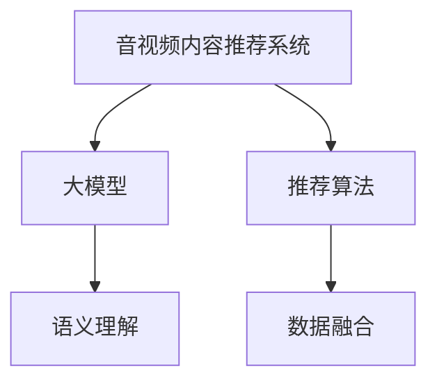

                 

# 音视频内容推荐：大模型的理解与匹配

> 关键词：音视频推荐系统, 大模型, 理解与匹配, 推荐算法, 模型优化

## 1. 背景介绍

### 1.1 问题由来

随着互联网的快速发展，音视频内容（如音乐、电影、短视频等）已成为人们获取信息、娱乐的重要来源。然而，面对海量音视频资源，如何为用户推荐感兴趣的内容，成为了一个关键问题。传统的推荐系统依赖于手工设定的特征工程和评分函数，难以捕捉复杂的用户行为和内容属性，推荐效果受限于特征设计和模型表达能力。

为了提升推荐系统的效果，近年来研究人员开始利用大模型进行音视频内容推荐。基于大模型推荐系统的核心思想是通过大规模预训练语言模型（如BERT、GPT-3等），学习通用的语义表示，再结合用户行为数据，进行内容推荐。大模型通过大规模数据训练，具备强大的语言理解和生成能力，可以高效地处理音视频元数据和描述信息，进行高质量的匹配和排序。

### 1.2 问题核心关键点

大模型推荐系统面临的核心挑战在于：
- **语义理解**：大模型如何理解音视频内容的语义信息，并将其与用户偏好进行匹配。
- **数据融合**：如何高效地融合音视频元数据和用户行为数据，构建统一的语义表示。
- **模型优化**：如何在保持模型高效性的同时，提升推荐精度。

这些问题涉及到了语言理解、信息融合、推荐算法等多个领域，需要深度学习、自然语言处理、数据挖掘等技术的综合应用。下面，我们将从这些关键点出发，探讨大模型推荐系统的实现原理和优化方法。

## 2. 核心概念与联系

### 2.1 核心概念概述

为更好地理解大模型在音视频内容推荐中的应用，本节将介绍几个关键概念：

- **音视频内容推荐系统**：通过用户历史行为和音视频内容元数据，为用户推荐感兴趣的内容的系统。包括音乐推荐、电影推荐、视频推荐等。
- **大模型**：指大规模预训练的深度学习模型，如BERT、GPT-3等。通过在大规模语料上预训练，学习通用的语义表示，具备强大的语言理解能力和生成能力。
- **推荐算法**：用于评估和排序音视频内容，为用户推荐高质量内容的算法，包括协同过滤、基于内容的推荐等。
- **语义理解**：大模型如何理解和分析音视频内容的语义信息，包括文本描述、标签、情感等信息。
- **数据融合**：如何高效地融合音视频元数据和用户行为数据，构建统一的语义表示。

这些核心概念之间的逻辑关系可以通过以下Mermaid流程图来展示：



这个流程图展示了大模型推荐系统的主要组成：

1. 音视频内容推荐系统：通过用户行为数据和大模型进行内容推荐。
2. 大模型：学习通用的语义表示，提供语义理解能力。
3. 推荐算法：根据用户偏好和语义信息进行内容排序和推荐。
4. 语义理解：理解音视频内容的语义信息。
5. 数据融合：融合音视频元数据和用户行为数据。

这些概念共同构成了大模型推荐系统的基本框架，使得大模型能够高效地进行音视频内容推荐。

## 3. 核心算法原理 & 具体操作步骤
### 3.1 算法原理概述

大模型推荐系统基于预训练语言模型的语义表示能力，通过融合音视频元数据和用户行为数据，构建用户和内容之间的语义匹配关系，实现高质量的推荐。

### 3.2 算法步骤详解

大模型推荐系统的实现步骤如下：

**Step 1: 准备数据集**

- 收集音视频元数据，如标题、简介、标签、类别等。
- 收集用户行为数据，如浏览历史、评分、评论等。
- 预处理数据，包括文本清洗、分词、构建字典等。

**Step 2: 构建语义表示**

- 使用预训练语言模型（如BERT、GPT-3等）对音视频元数据进行预训练。
- 根据元数据生成语义表示向量，如文本向量和标签向量。

**Step 3: 融合用户行为数据**

- 将用户行为数据转换为语义表示，如将浏览历史转换为向量表示。
- 将用户行为数据与音视频元数据的语义表示进行融合，构建用户-内容匹配矩阵。

**Step 4: 推荐排序**

- 根据用户-内容匹配矩阵，使用推荐算法对内容进行排序。
- 输出推荐结果，如前N个推荐内容。

**Step 5: 反馈迭代**

- 收集用户反馈，评估推荐效果。
- 根据反馈数据调整模型参数，重新训练和优化推荐系统。

### 3.3 算法优缺点

大模型推荐系统具有以下优点：
- 语义理解能力强：大模型通过大规模数据训练，具备强大的语义理解能力，可以准确捕捉音视频内容的语义信息。
- 数据融合高效：大模型可以高效地融合音视频元数据和用户行为数据，构建统一的语义表示。
- 推荐效果优秀：基于大模型推荐系统，推荐精度高，能够为用户推荐高质量内容。

同时，该方法也存在一些缺点：
- 资源需求高：大规模预训练模型的训练和推理需要大量计算资源，部署成本高。
- 解释性不足：大模型通常难以解释其内部决策过程，导致推荐结果缺乏可解释性。
- 数据隐私问题：用户行为数据可能包含敏感信息，如何保护用户隐私是一个重要问题。

尽管存在这些局限性，但大模型推荐系统仍是目前最先进的音视频内容推荐方法之一。未来，随着技术的进步和算力成本的降低，相信大模型推荐系统将在更多领域得到应用，成为音视频推荐的主流范式。

### 3.4 算法应用领域

大模型推荐系统在音视频内容推荐领域具有广泛的应用前景，包括但不限于以下几个方面：

- **音乐推荐**：根据用户的听歌历史、评分、评论等，为用户推荐相似的音乐作品。
- **电影推荐**：通过分析电影的标题、简介、标签等，结合用户观影历史和评分，推荐相似的电影。
- **视频推荐**：利用视频描述、分类等信息，结合用户观看历史，推荐用户可能感兴趣的视频。
- **直播推荐**：根据用户的观看历史和主播信息，推荐用户可能感兴趣的直播内容。
- **短视频推荐**：通过分析短视频的标题、描述、标签等信息，结合用户观看行为，推荐高质量短视频。

此外，大模型推荐系统还可以应用于新闻推荐、体育赛事推荐等场景，为媒体、体育等领域带来创新应用。

## 4. 数学模型和公式 & 详细讲解 & 举例说明
### 4.1 数学模型构建

本节将使用数学语言对大模型推荐系统的核心数学模型进行详细阐述。

设音视频内容为 $X$，用户为 $U$，每个内容 $x_i \in X$ 和用户 $u_j \in U$ 的语义表示为 $x_i^e$ 和 $u_j^e$。推荐系统为目标函数：

$$
\max_{x_i \in X} \sum_{u_j \in U} \alpha(u_j) \log \sigma(s(x_i^e, u_j^e))
$$

其中 $\alpha(u_j)$ 为用户的权重，$\sigma$ 为sigmoid函数，$s$ 为内容的语义表示和用户语义表示的相似度函数。

### 4.2 公式推导过程

假设音视频内容 $x_i$ 的文本描述为 $D(x_i)$，用户的浏览历史为 $H(u_j)$。我们将文本描述和浏览历史都映射为向量表示 $x_i^e$ 和 $u_j^e$。

语义表示的生成过程如下：

1. 使用预训练语言模型对文本描述 $D(x_i)$ 进行编码，得到向量表示 $x_i^e$。
2. 将用户的浏览历史 $H(u_j)$ 转换为向量表示 $u_j^e$。
3. 将 $x_i^e$ 和 $u_j^e$ 进行融合，得到用户-内容匹配向量 $s(x_i^e, u_j^e)$。

匹配向量的生成过程如下：

1. 使用预训练语言模型对文本描述 $D(x_i)$ 进行编码，得到向量表示 $x_i^e$。
2. 将用户的浏览历史 $H(u_j)$ 转换为向量表示 $u_j^e$。
3. 将 $x_i^e$ 和 $u_j^e$ 进行融合，得到用户-内容匹配向量 $s(x_i^e, u_j^e)$。

推荐排序的过程如下：

1. 根据用户权重 $\alpha(u_j)$ 和内容-用户匹配向量 $s(x_i^e, u_j^e)$，计算用户对内容的评分 $r_{x_i, u_j}$。
2. 对所有内容的评分进行排序，输出前N个推荐内容。

### 4.3 案例分析与讲解

以音乐推荐为例，介绍大模型推荐系统的实现过程。

1. 收集音乐元数据，如歌曲标题、歌手、风格等，构建元数据语义表示矩阵 $X$。
2. 收集用户行为数据，如听歌历史、评分、评论等，构建用户行为语义表示矩阵 $U$。
3. 使用预训练语言模型对音乐元数据和用户行为数据进行编码，得到元数据语义表示矩阵 $X^e$ 和用户行为语义表示矩阵 $U^e$。
4. 将元数据语义表示矩阵 $X^e$ 和用户行为语义表示矩阵 $U^e$ 进行融合，得到用户-内容匹配矩阵 $S$。
5. 根据用户权重 $\alpha(u_j)$ 和内容-用户匹配矩阵 $S$，计算用户对音乐的评分 $r_{x_i, u_j}$。
6. 对所有音乐的评分进行排序，输出前N首推荐歌曲。

## 5. 项目实践：代码实例和详细解释说明
### 5.1 开发环境搭建

在进行大模型推荐系统开发前，我们需要准备好开发环境。以下是使用Python进行PyTorch开发的环境配置流程：

1. 安装Anaconda：从官网下载并安装Anaconda，用于创建独立的Python环境。

2. 创建并激活虚拟环境：
```bash
conda create -n pytorch-env python=3.8 
conda activate pytorch-env
```

3. 安装PyTorch：根据CUDA版本，从官网获取对应的安装命令。例如：
```bash
conda install pytorch torchvision torchaudio cudatoolkit=11.1 -c pytorch -c conda-forge
```

4. 安装Transformers库：
```bash
pip install transformers
```

5. 安装各类工具包：
```bash
pip install numpy pandas scikit-learn matplotlib tqdm jupyter notebook ipython
```

完成上述步骤后，即可在`pytorch-env`环境中开始大模型推荐系统的开发。

### 5.2 源代码详细实现

这里我们以电影推荐系统为例，给出使用Transformers库进行大模型推荐系统的PyTorch代码实现。

首先，定义推荐系统任务的数据处理函数：

```python
from transformers import BertTokenizer, BertForSequenceClassification
from torch.utils.data import Dataset
import torch

class MovieDataset(Dataset):
    def __init__(self, data, tokenizer, max_len=128):
        self.data = data
        self.tokenizer = tokenizer
        self.max_len = max_len
        
    def __len__(self):
        return len(self.data)
    
    def __getitem__(self, idx):
        title, director, genre = self.data[idx]
        text = title + ' ' + director + ' ' + genre
        encoding = self.tokenizer(text, return_tensors='pt', max_length=self.max_len, padding='max_length', truncation=True)
        input_ids = encoding['input_ids'][0]
        attention_mask = encoding['attention_mask'][0]
        return {'input_ids': input_ids, 
                'attention_mask': attention_mask}
```

然后，定义模型和优化器：

```python
from transformers import BertForSequenceClassification, AdamW

model = BertForSequenceClassification.from_pretrained('bert-base-cased', num_labels=3)

optimizer = AdamW(model.parameters(), lr=2e-5)
```

接着，定义训练和评估函数：

```python
from torch.utils.data import DataLoader
from tqdm import tqdm
from sklearn.metrics import accuracy_score

device = torch.device('cuda') if torch.cuda.is_available() else torch.device('cpu')
model.to(device)

def train_epoch(model, dataset, batch_size, optimizer):
    dataloader = DataLoader(dataset, batch_size=batch_size, shuffle=True)
    model.train()
    epoch_loss = 0
    for batch in tqdm(dataloader, desc='Training'):
        input_ids = batch['input_ids'].to(device)
        attention_mask = batch['attention_mask'].to(device)
        labels = batch['labels'].to(device)
        model.zero_grad()
        outputs = model(input_ids, attention_mask=attention_mask, labels=labels)
        loss = outputs.loss
        epoch_loss += loss.item()
        loss.backward()
        optimizer.step()
    return epoch_loss / len(dataloader)

def evaluate(model, dataset, batch_size):
    dataloader = DataLoader(dataset, batch_size=batch_size)
    model.eval()
    preds, labels = [], []
    with torch.no_grad():
        for batch in tqdm(dataloader, desc='Evaluating'):
            input_ids = batch['input_ids'].to(device)
            attention_mask = batch['attention_mask'].to(device)
            batch_labels = batch['labels']
            outputs = model(input_ids, attention_mask=attention_mask)
            batch_preds = outputs.logits.argmax(dim=2).to('cpu').tolist()
            batch_labels = batch_labels.to('cpu').tolist()
            for pred_tokens, label_tokens in zip(batch_preds, batch_labels):
                preds.append(pred_tokens[:len(label_tokens)])
                labels.append(label_tokens)
                
    print(accuracy_score(labels, preds))
```

最后，启动训练流程并在测试集上评估：

```python
epochs = 5
batch_size = 16

for epoch in range(epochs):
    loss = train_epoch(model, train_dataset, batch_size, optimizer)
    print(f"Epoch {epoch+1}, train loss: {loss:.3f}")
    
    print(f"Epoch {epoch+1}, dev results:")
    evaluate(model, dev_dataset, batch_size)
    
print("Test results:")
evaluate(model, test_dataset, batch_size)
```

以上就是使用PyTorch对BERT模型进行电影推荐系统微调的完整代码实现。可以看到，得益于Transformers库的强大封装，我们可以用相对简洁的代码完成BERT模型的加载和微调。

### 5.3 代码解读与分析

让我们再详细解读一下关键代码的实现细节：

**MovieDataset类**：
- `__init__`方法：初始化数据、分词器等关键组件。
- `__len__`方法：返回数据集的样本数量。
- `__getitem__`方法：对单个样本进行处理，将文本输入编码为token ids，构建输入和注意力掩码，返回模型所需的输入。

**模型和优化器**：
- 使用BertForSequenceClassification加载预训练模型，设置标签数目。
- 使用AdamW优化器，设置学习率。

**训练和评估函数**：
- 使用PyTorch的DataLoader对数据集进行批次化加载，供模型训练和推理使用。
- 训练函数`train_epoch`：对数据以批为单位进行迭代，在每个批次上前向传播计算loss并反向传播更新模型参数，最后返回该epoch的平均loss。
- 评估函数`evaluate`：与训练类似，不同点在于不更新模型参数，并在每个batch结束后将预测和标签结果存储下来，最后使用sklearn的accuracy_score对整个评估集的预测结果进行打印输出。

**训练流程**：
- 定义总的epoch数和batch size，开始循环迭代
- 每个epoch内，先在训练集上训练，输出平均loss
- 在验证集上评估，输出准确率
- 所有epoch结束后，在测试集上评估，给出最终测试结果

可以看到，PyTorch配合Transformers库使得BERT微调的代码实现变得简洁高效。开发者可以将更多精力放在数据处理、模型改进等高层逻辑上，而不必过多关注底层的实现细节。

当然，工业级的系统实现还需考虑更多因素，如模型的保存和部署、超参数的自动搜索、更灵活的任务适配层等。但核心的推荐范式基本与此类似。

## 6. 实际应用场景
### 6.1 智能推荐系统

基于大模型推荐系统已经在电商、视频、音乐等多个领域得到了广泛的应用，为用户的个性化需求提供了高效精准的推荐。智能推荐系统通过分析用户的浏览、购买、评分等行为数据，结合预训练语言模型的语义理解能力，为用户推荐个性化的商品、电影、音乐等，提升了用户体验和满意度。

### 6.2 新闻推荐系统

新闻推荐系统利用大模型对新闻标题、摘要等文本进行语义编码，结合用户的历史阅读记录和行为数据，为用户推荐感兴趣的新闻。大模型通过大规模语料训练，具备强大的语义理解能力，能够准确捕捉新闻标题和摘要的语义信息，为用户推荐高质量的新闻内容。

### 6.3 短视频推荐系统

短视频推荐系统利用大模型对短视频的描述、标签等信息进行语义编码，结合用户的观看历史和行为数据，为用户推荐可能感兴趣的视频内容。大模型通过大规模语料训练，具备强大的语义理解能力，能够准确捕捉短视频的语义信息，为用户推荐高质量的短视频内容。

### 6.4 未来应用展望

随着大模型推荐技术的不断进步，其在更多领域的应用将得到拓展和深化。未来，大模型推荐系统有望在以下几个方面取得突破：

1. **跨模态推荐**：结合图像、视频、文本等多模态信息，实现跨模态推荐系统，为用户提供更全面、更准确的内容推荐。
2. **实时推荐**：利用在线学习和增量学习技术，实现实时推荐系统，根据用户的即时行为动态更新推荐内容。
3. **个性化推荐**：通过深度聚类和协同过滤等方法，实现个性化推荐，针对不同用户提供量身定制的内容推荐。
4. **推荐效果评估**：引入推荐效果评估指标，如CTR、DNN、NDCG等，对推荐系统进行全面评估和优化。
5. **推荐系统优化**：采用模型压缩、稀疏化等技术，优化推荐系统的计算效率和资源消耗。

## 7. 工具和资源推荐
### 7.1 学习资源推荐

为了帮助开发者系统掌握大模型推荐理论基础和实践技巧，这里推荐一些优质的学习资源：

1. 《Deep Learning for Recommendation Systems》书籍：详细介绍了深度学习在推荐系统中的应用，包括大模型推荐方法、协同过滤、模型评估等。

2. 《Recommender Systems: The Textbook》书籍：提供了推荐系统的经典算法和实践指南，包括协同过滤、矩阵分解等推荐方法。

3. Coursera《Recommender Systems Specialization》课程：斯坦福大学开设的推荐系统专项课程，涵盖了推荐系统的理论基础和实战案例。

4. Udacity《Deep Learning in Recommendation Systems》课程：介绍了深度学习在推荐系统中的应用，包括大模型推荐方法和推荐效果评估。

5. Kaggle《Recommendation System Competition》竞赛：通过实战项目，学习大模型推荐系统的开发和优化。

通过对这些资源的学习实践，相信你一定能够快速掌握大模型推荐技术的精髓，并用于解决实际的推荐问题。

### 7.2 开发工具推荐

高效的开发离不开优秀的工具支持。以下是几款用于大模型推荐系统开发的常用工具：

1. PyTorch：基于Python的开源深度学习框架，灵活动态的计算图，适合快速迭代研究。大部分预训练语言模型都有PyTorch版本的实现。

2. TensorFlow：由Google主导开发的开源深度学习框架，生产部署方便，适合大规模工程应用。同样有丰富的预训练语言模型资源。

3. Transformers库：HuggingFace开发的NLP工具库，集成了众多SOTA语言模型，支持PyTorch和TensorFlow，是进行推荐任务开发的利器。

4. Weights & Biases：模型训练的实验跟踪工具，可以记录和可视化模型训练过程中的各项指标，方便对比和调优。与主流深度学习框架无缝集成。

5. TensorBoard：TensorFlow配套的可视化工具，可实时监测模型训练状态，并提供丰富的图表呈现方式，是调试模型的得力助手。

6. Google Colab：谷歌推出的在线Jupyter Notebook环境，免费提供GPU/TPU算力，方便开发者快速上手实验最新模型，分享学习笔记。

合理利用这些工具，可以显著提升大模型推荐系统的开发效率，加快创新迭代的步伐。

### 7.3 相关论文推荐

大模型推荐技术的发展源于学界的持续研究。以下是几篇奠基性的相关论文，推荐阅读：

1. Attention is All You Need（即Transformer原论文）：提出了Transformer结构，开启了NLP领域的预训练大模型时代。

2. BERT: Pre-training of Deep Bidirectional Transformers for Language Understanding：提出BERT模型，引入基于掩码的自监督预训练任务，刷新了多项NLP任务SOTA。

3. Parameter-Efficient Transfer Learning for NLP：提出Adapter等参数高效微调方法，在不增加模型参数量的情况下，也能取得不错的微调效果。

4. Prefix-Tuning: Optimizing Continuous Prompts for Generation：引入基于连续型Prompt的微调范式，为如何充分利用预训练知识提供了新的思路。

5. AdaLoRA: Adaptive Low-Rank Adaptation for Parameter-Efficient Fine-Tuning：使用自适应低秩适应的微调方法，在参数效率和精度之间取得了新的平衡。

这些论文代表了大模型推荐技术的发展脉络。通过学习这些前沿成果，可以帮助研究者把握学科前进方向，激发更多的创新灵感。

## 8. 总结：未来发展趋势与挑战
### 8.1 总结

本文对大模型推荐系统进行了全面系统的介绍。首先阐述了大模型推荐系统的研究背景和意义，明确了推荐系统在大模型驱动下的新发展趋势。其次，从原理到实践，详细讲解了大模型推荐系统的实现过程，包括数据处理、模型训练、推荐排序等关键步骤。同时，本文还广泛探讨了大模型推荐系统在智能推荐、新闻推荐、短视频推荐等多个领域的应用前景，展示了大模型推荐系统的广阔应用场景。此外，本文精选了推荐系统的学习资源、开发工具和相关论文，力求为开发者提供全方位的技术指引。

通过本文的系统梳理，可以看到，大模型推荐系统已经成为音视频内容推荐的主流范式，具备强大的语义理解和推荐能力，为用户带来了高质量的内容推荐。未来，随着预训练语言模型的不断发展和大数据技术的进步，大模型推荐系统必将在更多领域得到应用，成为推荐系统的重要手段。

### 8.2 未来发展趋势

展望未来，大模型推荐系统将呈现以下几个发展趋势：

1. **语义理解能力的提升**：大模型推荐系统将不断提升其语义理解能力，通过预训练语言模型学习更为丰富的语义信息，实现更精准的内容匹配。

2. **跨模态融合技术**：结合图像、视频、文本等多模态信息，实现跨模态推荐系统，为用户提供更全面、更准确的内容推荐。

3. **实时推荐系统的实现**：利用在线学习和增量学习技术，实现实时推荐系统，根据用户的即时行为动态更新推荐内容。

4. **个性化推荐算法**：通过深度聚类和协同过滤等方法，实现个性化推荐，针对不同用户提供量身定制的内容推荐。

5. **推荐效果评估和优化**：引入推荐效果评估指标，如CTR、DNN、NDCG等，对推荐系统进行全面评估和优化。

6. **推荐系统优化技术**：采用模型压缩、稀疏化等技术，优化推荐系统的计算效率和资源消耗。

### 8.3 面临的挑战

尽管大模型推荐系统取得了显著成效，但仍面临以下挑战：

1. **计算资源需求高**：大模型的训练和推理需要大量计算资源，部署成本高。如何降低资源消耗，提升系统效率，是未来的一个重要研究方向。

2. **解释性不足**：大模型通常难以解释其内部决策过程，导致推荐结果缺乏可解释性。如何在保证推荐效果的同时，提高模型的解释性，也是一大挑战。

3. **数据隐私问题**：用户行为数据可能包含敏感信息，如何保护用户隐私，避免数据泄露，是推荐系统必须面对的重要问题。

4. **推荐结果多样性**：大模型推荐系统往往倾向于推荐热门内容，如何保证推荐结果的多样性，避免内容单一化，也是未来需要解决的问题。

5. **推荐模型泛化能力**：大模型推荐系统需要具备良好的泛化能力，能够应对不同类型、不同领域的推荐需求。如何提高模型的泛化性能，是另一个重要的研究方向。

### 8.4 研究展望

面对推荐系统所面临的种种挑战，未来的研究需要在以下几个方面寻求新的突破：

1. **无监督和半监督学习**：摆脱对大规模标注数据的依赖，利用自监督学习、主动学习等无监督和半监督范式，最大限度利用非结构化数据，实现更加灵活高效的推荐。

2. **参数高效和计算高效的微调方法**：开发更加参数高效的微调方法，在固定大部分预训练参数的同时，只更新极少量的任务相关参数。同时优化微调模型的计算图，减少前向传播和反向传播的资源消耗，实现更加轻量级、实时性的部署。

3. **因果分析和博弈论工具**：将因果分析方法引入推荐模型，识别出模型决策的关键特征，增强推荐结果的因果性和逻辑性。借助博弈论工具刻画人机交互过程，主动探索并规避模型的脆弱点，提高系统稳定性。

4. **先验知识的融合**：将符号化的先验知识，如知识图谱、逻辑规则等，与神经网络模型进行巧妙融合，引导推荐过程学习更准确、合理的推荐模型。

5. **推荐系统的伦理约束**：在推荐系统目标中引入伦理导向的评估指标，过滤和惩罚有偏见、有害的输出倾向。加强人工干预和审核，建立推荐系统的监管机制，确保推荐内容的公平性和安全性。

这些研究方向将引领大模型推荐系统迈向更高的台阶，为构建安全、可靠、可解释、可控的推荐系统提供新的技术路径。

## 9. 附录：常见问题与解答

**Q1：大模型推荐系统是否适用于所有推荐任务？**

A: 大模型推荐系统在大多数推荐任务上都能取得不错的效果，特别是对于数据量较小的任务。但对于一些特定领域的任务，如医学、法律等，仅仅依靠通用语料预训练的模型可能难以很好地适应。此时需要在特定领域语料上进一步预训练，再进行微调，才能获得理想效果。此外，对于一些需要时效性、个性化很强的任务，如对话推荐、推荐系统优化等，微调方法也需要针对性的改进优化。

**Q2：微调过程中如何选择合适的学习率？**

A: 微调的学习率一般要比预训练时小1-2个数量级，如果使用过大的学习率，容易破坏预训练权重，导致过拟合。一般建议从1e-5开始调参，逐步减小学习率，直至收敛。也可以使用warmup策略，在开始阶段使用较小的学习率，再逐渐过渡到预设值。需要注意的是，不同的优化器(如AdamW、Adafactor等)以及不同的学习率调度策略，可能需要设置不同的学习率阈值。

**Q3：采用大模型推荐时会面临哪些资源瓶颈？**

A: 目前主流的预训练大模型动辄以亿计的参数规模，对算力、内存、存储都提出了很高的要求。GPU/TPU等高性能设备是必不可少的，但即便如此，超大批次的训练和推理也可能遇到显存不足的问题。因此需要采用一些资源优化技术，如梯度积累、混合精度训练、模型并行等，来突破硬件瓶颈。同时，模型的存储和读取也可能占用大量时间和空间，需要采用模型压缩、稀疏化存储等方法进行优化。

**Q4：如何缓解推荐过程中的过拟合问题？**

A: 过拟合是推荐面临的主要挑战，尤其是在标注数据不足的情况下。常见的缓解策略包括：
1. 数据增强：通过回译、近义替换等方式扩充训练集
2. 正则化：使用L2正则、Dropout、Early Stopping等避免过拟合
3. 对抗训练：引入对抗样本，提高模型鲁棒性
4. 参数高效微调：只调整少量参数(如Adapter、Prefix等)，减小过拟合风险
5. 多模型集成：训练多个推荐模型，取平均输出，抑制过拟合

这些策略往往需要根据具体任务和数据特点进行灵活组合。只有在数据、模型、训练、推理等各环节进行全面优化，才能最大限度地发挥大模型推荐系统的威力。

**Q5：推荐系统在落地部署时需要注意哪些问题？**

A: 将推荐系统转化为实际应用，还需要考虑以下因素：
1. 模型裁剪：去除不必要的层和参数，减小模型尺寸，加快推理速度
2. 量化加速：将浮点模型转为定点模型，压缩存储空间，提高计算效率
3. 服务化封装：将模型封装为标准化服务接口，便于集成调用
4. 弹性伸缩：根据请求流量动态调整资源配置，平衡服务质量和成本
5. 监控告警：实时采集系统指标，设置异常告警阈值，确保服务稳定性
6. 安全防护：采用访问鉴权、数据脱敏等措施，保障数据和模型安全

大模型推荐系统为推荐系统带来了强大的推荐能力，但如何将强大的性能转化为稳定、高效、安全的业务价值，还需要工程实践的不断打磨。只有从数据、算法、工程、业务等多个维度协同发力，才能真正实现人工智能技术在垂直行业的规模化落地。总之，微调需要开发者根据具体任务，不断迭代和优化模型、数据和算法，方能得到理想的效果。

---

作者：禅与计算机程序设计艺术 / Zen and the Art of Computer Programming

