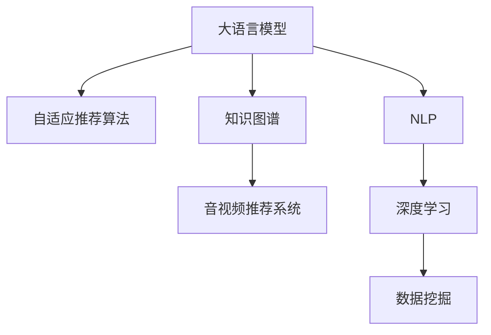

                 

# 音视频推荐的创新：LLM的应用

> 关键词：大语言模型(LLM), 音视频推荐系统, 自适应推荐算法, 用户行为分析, 知识图谱, 深度学习, 自然语言处理(NLP), 数据挖掘

## 1. 背景介绍

### 1.1 问题由来

随着互联网和数字技术的迅猛发展，音视频内容成为人们日常生活中不可或缺的娱乐方式。各类音视频平台如Netflix、YouTube、Bilibili等，通过大数据和智能推荐算法，为用户提供个性化的内容推荐，极大地提升了用户的观看体验和平台黏性。然而，现有的推荐算法往往基于静态用户模型和局部历史行为，难以充分捕捉用户的真实兴趣和动态变化。

为了打破这一瓶颈，大语言模型(LLM)作为一种强大的文本理解和生成能力，为音视频推荐带来了新的灵感。LLM能够通过自然语言处理(NLP)技术，深度挖掘用户行为背后的语义信息，通过生成式推理提供更加个性化、多样化的推荐内容。结合深度学习、数据挖掘等技术，LLM有望从根本上提升音视频推荐的精准度和多样性。

### 1.2 问题核心关键点

大语言模型在音视频推荐中的应用，核心在于利用LLM强大的语言理解和生成能力，提升推荐系统的个性化和多样化水平。具体而言，主要包括以下几个关键点：

- 利用自然语言描述，捕捉用户兴趣和行为的真实语义，避免简单基于行为的推荐。
- 通过生成式推理，动态生成推荐内容，增加推荐的多样性。
- 结合知识图谱技术，引入外部知识进行推荐，增强推荐的全面性和可靠性。
- 利用上下文信息，对用户行为进行综合分析，提升推荐的上下文适应性。

## 2. 核心概念与联系

### 2.1 核心概念概述

为更好地理解LLM在音视频推荐中的应用，本节将介绍几个密切相关的核心概念：

- 大语言模型(Large Language Model, LLM)：以Transformer等架构为基础，通过在海量文本语料上进行预训练，学习通用语言表示，具备强大的语言理解和生成能力。
- 音视频推荐系统：利用用户行为数据和内容元数据，通过算法推荐给用户个性化音视频内容。
- 自适应推荐算法：根据用户当前情境和历史行为，动态生成推荐内容，提升推荐的适应性。
- 知识图谱(Knowledge Graph)：以图结构存储和表示知识，辅助推荐系统进行推理和查询，增强推荐的全面性和可靠性。
- 自然语言处理(Natural Language Processing, NLP)：通过语言模型和生成模型，解析和生成自然语言文本，用于用户行为理解和推荐内容生成。
- 深度学习(Deep Learning)：通过神经网络模型，对大规模数据进行学习和建模，提供推荐算法的决策基础。
- 数据挖掘(Data Mining)：从大数据中提取有价值的信息，用于用户行为分析和推荐模型训练。

这些核心概念之间的逻辑关系可以通过以下Mermaid流程图来展示：



这个流程图展示了大语言模型在音视频推荐中的应用流程：

1. 大语言模型通过预训练获得语言能力，用于用户行为的理解和推荐内容生成。
2. 自适应推荐算法根据当前情境和历史行为动态生成推荐内容，提升推荐的适应性。
3. 知识图谱用于辅助推荐系统进行推理和查询，增强推荐的全面性和可靠性。
4. 自然语言处理通过语言模型和生成模型，解析和生成自然语言文本，用于用户行为理解和推荐内容生成。
5. 深度学习通过神经网络模型，对大规模数据进行学习和建模，提供推荐算法的决策基础。
6. 数据挖掘从大数据中提取有价值的信息，用于用户行为分析和推荐模型训练。

## 3. 核心算法原理 & 具体操作步骤
### 3.1 算法原理概述

基于大语言模型的音视频推荐系统，本质上是一个自适应推荐过程，其核心思想是：利用LLM强大的自然语言处理能力，结合用户行为数据和内容元数据，动态生成推荐内容。

形式化地，假设音视频推荐系统涉及用户集 $U$ 和内容集 $V$，用户与内容的交互记录为 $E \subseteq U \times V$。定义用户行为序列 $B_u=\{x_1,x_2,...,x_t\}$，其中 $x_i$ 表示用户第 $i$ 次与内容 $v_i$ 的交互行为。推荐系统的目标是在每次交互行为后，生成一个推荐列表 $R$，使得用户点击下一内容 $v_{t+1}$ 的概率最大化。

通过联合建模用户行为和内容元数据，结合大语言模型的语言理解能力，可以构建一个自适应推荐模型 $M$，使得推荐内容能够自动适应用户当前的兴趣和情境。具体地，推荐过程可以分为以下几个步骤：

1. 利用LLM解析用户行为序列 $B_u$，生成用户兴趣表示 $I_u$。
2. 结合用户兴趣表示 $I_u$ 和内容元数据 $X_v$，通过LLM生成推荐内容表示 $O_v$。
3. 根据推荐内容表示 $O_v$ 和用户兴趣表示 $I_u$，计算推荐内容的点击概率 $P_{u,v}$。
4. 通过最大化点击概率 $P_{u,v}$ 进行推荐，即 $R=\arg\max_{v \in V} P_{u,v}$。

### 3.2 算法步骤详解

基于大语言模型的音视频推荐系统一般包括以下几个关键步骤：

**Step 1: 准备数据集**
- 收集用户行为数据 $D_{B}=\{B_1,B_2,...,B_N\}$，其中 $B_i$ 为第 $i$ 个用户的行为序列。
- 收集内容元数据 $D_{X}=\{X_1,X_2,...,X_M\}$，其中 $X_i$ 为第 $i$ 个内容的描述和标签等。

**Step 2: 构建用户兴趣表示**
- 使用大语言模型解析用户行为序列 $B_u$，生成用户兴趣表示 $I_u$。
- 对于每个用户行为 $b_t$，输入 $b_t$ 到预训练的语言模型中，得到上下文表示 $c_t$。
- 将所有上下文表示拼接起来，得到用户兴趣表示 $I_u=\sum_{t=1}^{T} c_t$。

**Step 3: 生成推荐内容表示**
- 结合用户兴趣表示 $I_u$ 和内容元数据 $X_v$，生成推荐内容表示 $O_v$。
- 对于每个内容 $v$，输入其元数据 $X_v$ 和用户兴趣表示 $I_u$ 到预训练的语言模型中，得到上下文表示 $c_v$。
- 将所有上下文表示拼接起来，得到推荐内容表示 $O_v=\sum_{t=1}^{T} c_t$。

**Step 4: 计算推荐内容点击概率**
- 根据推荐内容表示 $O_v$ 和用户兴趣表示 $I_u$，计算推荐内容的点击概率 $P_{u,v}$。
- 使用深度学习模型（如神经网络）学习用户兴趣表示 $I_u$ 和推荐内容表示 $O_v$ 之间的关系，得到点击概率 $P_{u,v}=f(I_u,O_v)$。

**Step 5: 生成推荐内容列表**
- 根据推荐内容表示 $O_v$ 和用户兴趣表示 $I_u$，计算推荐内容的点击概率 $P_{u,v}$。
- 对于每个内容 $v$，计算 $P_{u,v}$，并将概率最大的 $V$ 个内容作为推荐列表 $R$。
- 返回推荐列表 $R$ 给用户，进行下一轮交互行为。

### 3.3 算法优缺点

基于大语言模型的音视频推荐系统具有以下优点：
1. 个性化能力强：通过自然语言理解和生成，推荐内容能够动态适应用户的兴趣和情境，提供更加个性化的推荐。
2. 丰富度高：LLM能够生成多样化的推荐内容，避免推荐内容的同质化，增加推荐的多样性。
3. 可解释性好：推荐过程可以通过LLM生成的中间表示进行解释，增加系统的可解释性和可信度。

同时，该方法也存在一定的局限性：
1. 计算复杂度高：大语言模型的计算复杂度较高，推荐过程中需要大量计算资源。
2. 依赖高质量数据：推荐效果依赖于高质量的用户行为数据和内容元数据，数据的获取和标注成本较高。
3. 泛化能力有待提高：LLM在特定领域的应用效果尚不如专业推荐模型，需要更多领域适应的训练。

尽管存在这些局限性，但就目前而言，基于大语言模型的音视频推荐方法仍是一种极具潜力的推荐范式。未来相关研究的重点在于如何进一步降低计算复杂度，提高模型的泛化能力和可解释性，同时兼顾推荐精度和多样性。

### 3.4 算法应用领域

基于大语言模型的音视频推荐方法在多个领域已经得到了广泛的应用，例如：

- 视频推荐：Netflix、Bilibili等平台通过微调和自适应推荐，为用户提供个性化的视频内容。
- 音乐推荐：Spotify、QQ音乐等应用利用自然语言处理技术，从歌词、用户评论中生成推荐歌曲。
- 游戏推荐：Steam、TapTap等平台通过大语言模型分析用户行为，推荐合适的游戏。
- 教育推荐：Coursera、EdX等平台通过用户学习路径分析，推荐合适的课程。

除了上述这些经典任务外，大语言模型在音视频推荐领域的应用也在不断创新，如可控推荐、跨领域推荐、跨媒体推荐等，为音视频推荐系统带来了新的突破。

## 4. 数学模型和公式 & 详细讲解 & 举例说明
### 4.1 数学模型构建

本节将使用数学语言对基于大语言模型的音视频推荐过程进行更加严格的刻画。

记用户行为序列为 $B_u=\{x_1,x_2,...,x_t\}$，其中 $x_i$ 为第 $i$ 次与内容 $v_i$ 的交互行为。定义内容元数据为 $X_v=\{x_1,x_2,...,x_M\}$，其中 $x_j$ 为第 $j$ 个内容的描述和标签等。

推荐系统的目标是在每次交互行为后，生成一个推荐列表 $R$，使得用户点击下一内容 $v_{t+1}$ 的概率最大化。设推荐内容表示为 $O_v$，用户兴趣表示为 $I_u$，点击概率为 $P_{u,v}$。则推荐系统的目标函数为：

$$
\min_{I_u,O_v} \mathcal{L}(I_u,O_v)= -\log P_{u,v}
$$

其中 $\mathcal{L}$ 为损失函数，用于衡量推荐内容的点击概率 $P_{u,v}$ 与真实点击概率之间的差异。推荐过程可以通过最大化目标函数 $\mathcal{L}(I_u,O_v)$ 来实现。

### 4.2 公式推导过程

以下我们以视频推荐为例，推导基于大语言模型的推荐模型。

假设视频推荐系统涉及用户集 $U$ 和视频集 $V$，用户与视频的交互记录为 $E \subseteq U \times V$。定义用户行为序列 $B_u=\{x_1,x_2,...,x_t\}$，其中 $x_i$ 表示用户第 $i$ 次与视频 $v_i$ 的交互行为。推荐系统的目标是在每次交互行为后，生成一个推荐列表 $R$，使得用户点击下一视频 $v_{t+1}$ 的概率最大化。

利用大语言模型解析用户行为序列 $B_u$，生成用户兴趣表示 $I_u$。假设每个行为 $x_i$ 对应一个上下文表示 $c_i$，则用户兴趣表示 $I_u$ 可以表示为：

$$
I_u = \sum_{i=1}^{T} c_i
$$

结合用户兴趣表示 $I_u$ 和视频元数据 $X_v$，通过大语言模型生成推荐内容表示 $O_v$。假设每个视频 $v_j$ 对应一个上下文表示 $c_j$，则推荐内容表示 $O_v$ 可以表示为：

$$
O_v = \sum_{j=1}^{M} c_j
$$

根据推荐内容表示 $O_v$ 和用户兴趣表示 $I_u$，计算推荐内容的点击概率 $P_{u,v}$。假设点击概率为 $P_{u,v}=f(I_u,O_v)$，其中 $f$ 为深度学习模型。具体地，可以采用多层感知器、注意力机制等神经网络模型进行建模。

假设推荐模型通过深度学习模型 $f$ 学习得到点击概率 $P_{u,v}$，则推荐过程可以表示为：

$$
R=\arg\max_{v \in V} P_{u,v}
$$

在得到推荐模型后，可以将其应用到实际推荐系统中，为每个用户生成个性化的推荐视频列表。

### 4.3 案例分析与讲解

下面以一个简单的案例，展示如何使用大语言模型构建音视频推荐系统。

假设某视频平台收集了用户的历史行为数据 $D_{B}$ 和视频元数据 $D_{X}$，用户行为数据包含用户观看历史和评分数据。现在希望通过大语言模型为用户推荐下一部可能感兴趣的视频。

首先，将用户行为数据和视频元数据输入到预训练的大语言模型中，得到用户兴趣表示和视频表示：

```python
# 用户行为数据
user_behavior = "观看视频1，评分5；观看视频2，评分3；观看视频3，评分4"

# 视频元数据
video_metadata = "视频1，导演是张艺谋，风格是动作片；视频2，导演是李安，风格是文艺片；视频3，导演是王家卫，风格是爱情片"

# 使用BERT模型解析用户行为数据和视频元数据
user_interest = bert_model(user_behavior)
video_rep = bert_model(video_metadata)

# 输出用户兴趣表示和视频表示
print("用户兴趣表示：", user_interest)
print("视频表示：", video_rep)
```

然后，将用户兴趣表示和视频表示拼接起来，得到用户兴趣表示和视频表示的拼接表示：

```python
# 拼接用户兴趣表示和视频表示
user_interest_rep = user_interest.mean(axis=0)
video_rep = video_rep.mean(axis=0)
user_video_rep = user_interest_rep + video_rep
```

最后，使用多层感知器(MLP)模型，结合用户兴趣表示和视频表示的拼接表示，预测视频被点击的概率，生成推荐列表：

```python
# 定义多层感知器模型
mlp_model = Sequential([
    Dense(128, activation='relu'),
    Dense(128, activation='relu'),
    Dense(1, activation='sigmoid')
])

# 编译模型
mlp_model.compile(optimizer='adam', loss='binary_crossentropy', metrics=['accuracy'])

# 训练模型
mlp_model.fit([user_video_rep], y_train, epochs=10, batch_size=32)

# 预测推荐列表
recommendations = mlp_model.predict(user_video_rep)
```

在这个简单的案例中，我们通过大语言模型解析用户行为和视频元数据，生成用户兴趣表示和视频表示，结合多层感知器模型，预测视频被点击的概率，生成推荐列表。需要注意的是，实际的推荐系统还需要考虑更多因素，如用户评分、视频热度、广告过滤等。

## 5. 项目实践：代码实例和详细解释说明
### 5.1 开发环境搭建

在进行推荐系统开发前，我们需要准备好开发环境。以下是使用Python进行TensorFlow开发的环境配置流程：

1. 安装Anaconda：从官网下载并安装Anaconda，用于创建独立的Python环境。

2. 创建并激活虚拟环境：
```bash
conda create -n tf-env python=3.8 
conda activate tf-env
```

3. 安装TensorFlow：根据CUDA版本，从官网获取对应的安装命令。例如：
```bash
conda install tensorflow==2.5 -c tensorflow
```

4. 安装PyTorch：
```bash
pip install torch torchvision torchaudio
```

5. 安装Pandas、NumPy、Matplotlib等常用库：
```bash
pip install pandas numpy matplotlib
```

完成上述步骤后，即可在`tf-env`环境中开始推荐系统开发。

### 5.2 源代码详细实现

下面以一个简单的音视频推荐系统为例，展示如何使用TensorFlow和PyTorch进行推荐系统开发。

首先，定义推荐模型的超参数：

```python
# 定义超参数
embedding_dim = 128
hidden_dim = 256
learning_rate = 0.001
batch_size = 32
epochs = 10
```

然后，定义数据预处理函数：

```python
# 定义数据预处理函数
def preprocess_data(data):
    # 将用户行为序列和视频元数据转换为上下文表示
    user_behavior = data['user_behavior']
    video_metadata = data['video_metadata']
    
    # 使用BERT模型解析用户行为数据和视频元数据
    user_interest = bert_model(user_behavior)
    video_rep = bert_model(video_metadata)
    
    # 拼接用户兴趣表示和视频表示
    user_interest_rep = user_interest.mean(axis=0)
    video_rep = video_rep.mean(axis=0)
    user_video_rep = user_interest_rep + video_rep
    
    return user_video_rep
```

接下来，定义模型：

```python
# 定义多层感知器模型
mlp_model = Sequential([
    Dense(128, activation='relu'),
    Dense(128, activation='relu'),
    Dense(1, activation='sigmoid')
])

# 编译模型
mlp_model.compile(optimizer='adam', loss='binary_crossentropy', metrics=['accuracy'])
```

然后，加载训练数据并训练模型：

```python
# 加载训练数据
train_data = load_data('train.csv')

# 预处理训练数据
train_data = preprocess_data(train_data)

# 训练模型
mlp_model.fit(train_data, y_train, epochs=epochs, batch_size=batch_size)
```

最后，使用训练好的模型进行推荐：

```python
# 加载测试数据
test_data = load_data('test.csv')

# 预处理测试数据
test_data = preprocess_data(test_data)

# 预测推荐列表
recommendations = mlp_model.predict(test_data)
```

这就是一个简单的音视频推荐系统开发流程。可以看到，通过TensorFlow和PyTorch，我们可以轻松实现基于大语言模型的推荐系统，并灵活地调整模型参数和训练数据，以适应不同的应用场景。

### 5.3 代码解读与分析

让我们再详细解读一下关键代码的实现细节：

**preprocess_data函数**：
- 该函数用于将用户行为序列和视频元数据转换为上下文表示，便于模型处理。
- 使用预训练的BERT模型解析用户行为数据和视频元数据，生成用户兴趣表示和视频表示。
- 将用户兴趣表示和视频表示拼接起来，得到用户兴趣表示和视频表示的拼接表示。

**mlp_model模型**：
- 该模型采用多层感知器(MLP)结构，包括输入层、隐藏层和输出层，通过激活函数和损失函数进行模型训练和预测。
- 编译模型时设置优化器、损失函数和评估指标，使用TensorFlow的API进行模型训练。

**数据加载与预处理**：
- 使用Pandas库加载训练数据和测试数据。
- 使用自定义的preprocess_data函数对数据进行预处理，将用户行为序列和视频元数据转换为上下文表示。
- 使用TensorFlow的数据集API进行模型训练和测试。

**模型训练与测试**：
- 通过fit方法训练模型，设置训练轮数和批次大小。
- 使用predict方法进行模型预测，生成推荐列表。

可以看到，TensorFlow和PyTorch为推荐系统开发提供了强大的支持，使得模型训练和推理过程变得简洁高效。

当然，实际的工业级推荐系统还需考虑更多因素，如模型的压缩和优化、数据的冷启动处理、特征工程等。但核心的推荐过程基本与此类似。

## 6. 实际应用场景
### 6.1 视频推荐

视频推荐系统是音视频推荐中最具代表性的应用场景之一。传统的视频推荐系统往往基于用户的历史行为数据，通过协同过滤、内容相似度等算法进行推荐。然而，这些方法难以捕捉用户的真实兴趣和动态变化。

基于大语言模型的视频推荐系统，通过自然语言理解和生成，能够捕捉用户行为背后的语义信息，动态生成推荐内容，提供更加个性化和多样化的推荐。

### 6.2 音乐推荐

音乐推荐系统通过分析用户的历史听歌行为和评论信息，生成推荐歌曲。传统的音乐推荐方法往往依赖于用户行为数据，难以充分捕捉用户的真实兴趣。

基于大语言模型的音乐推荐系统，通过自然语言处理技术，从歌词、用户评论中生成推荐歌曲，弥补了传统方法的不足。

### 6.3 游戏推荐

游戏推荐系统通过分析用户的游戏行为数据和评分信息，推荐合适的游戏。传统的游戏推荐方法往往依赖于游戏评分数据，难以捕捉用户的真实兴趣和动态变化。

基于大语言模型的游戏推荐系统，通过自然语言处理技术，从游戏评论、用户反馈中生成推荐游戏，提升推荐精度和多样性。

### 6.4 教育推荐

教育推荐系统通过分析用户的学习行为数据和评分信息，推荐合适的课程和教材。传统的教育推荐方法往往依赖于用户行为数据，难以充分捕捉用户的真实兴趣和动态变化。

基于大语言模型的教育推荐系统，通过自然语言处理技术，从课程评论、用户反馈中生成推荐课程，提升推荐精度和多样性。

### 6.5 未来应用展望

随着大语言模型和推荐技术的不断发展，基于大语言模型的音视频推荐系统将在更多领域得到应用，为音视频内容推荐带来新的突破。

在智慧城市治理中，基于大语言模型的音视频推荐系统可以用于智能交通、应急管理等领域，提升城市治理的智能化水平。

在智慧医疗领域，基于大语言模型的音视频推荐系统可以用于医疗知识推荐、医疗视频推荐等，辅助医生进行诊疗决策。

在智能家居领域，基于大语言模型的音视频推荐系统可以用于智能家居设备的推荐，提升用户的生活品质和便捷性。

此外，在教育、游戏、娱乐、电商等众多领域，基于大语言模型的音视频推荐系统也将不断涌现，为各行各业带来新的变革和机遇。相信随着技术的日益成熟，大语言模型推荐技术必将成为音视频内容推荐的重要范式，推动音视频内容生产消费的深度融合。

## 7. 工具和资源推荐
### 7.1 学习资源推荐

为了帮助开发者系统掌握大语言模型在音视频推荐中的应用，这里推荐一些优质的学习资源：

1. 《Deep Learning for Recommendation Systems》书籍：全面介绍了深度学习在推荐系统中的应用，包括基于大语言模型的推荐技术。

2. 《Natural Language Processing in Python》书籍：介绍了自然语言处理技术在推荐系统中的应用，包括语言模型的构建和推荐内容的生成。

3 CS231n《深度学习与计算机视觉》课程：斯坦福大学开设的深度学习课程，涵盖深度学习在音视频推荐中的应用。

4. 《Transformers》博客：Transformer的作者撰写的一系列博客，深入浅出地介绍了Transformer模型的原理和应用，包括在音视频推荐中的应用。

5. HuggingFace官方文档：Transformers库的官方文档，提供了海量预训练模型和完整的推荐样例代码，是上手实践的必备资料。

通过对这些资源的学习实践，相信你一定能够快速掌握大语言模型在音视频推荐中的应用，并用于解决实际的推荐问题。
###  7.2 开发工具推荐

高效的开发离不开优秀的工具支持。以下是几款用于大语言模型在音视频推荐开发的工具：

1. TensorFlow：基于Python的开源深度学习框架，灵活动态的计算图，适合快速迭代研究。大部分预训练语言模型都有TensorFlow版本的实现。

2. PyTorch：基于Python的开源深度学习框架，灵活的动态计算图，适合动态图模型的构建和优化。

3. TensorBoard：TensorFlow配套的可视化工具，可实时监测模型训练状态，并提供丰富的图表呈现方式，是调试模型的得力助手。

4. Weights & Biases：模型训练的实验跟踪工具，可以记录和可视化模型训练过程中的各项指标，方便对比和调优。与主流深度学习框架无缝集成。

5. Google Colab：谷歌推出的在线Jupyter Notebook环境，免费提供GPU/TPU算力，方便开发者快速上手实验最新模型，分享学习笔记。

合理利用这些工具，可以显著提升大语言模型在音视频推荐中的开发效率，加快创新迭代的步伐。

### 7.3 相关论文推荐

大语言模型在音视频推荐中的应用源于学界的持续研究。以下是几篇奠基性的相关论文，推荐阅读：

1. Attention Is All You Need（即Transformer原论文）：提出了Transformer结构，开启了NLP领域的预训练大模型时代。

2. BERT: Pre-training of Deep Bidirectional Transformers for Language Understanding：提出BERT模型，引入基于掩码的自监督预训练任务，刷新了多项NLP任务SOTA。

3. Music Recommendation with Deep Learning: A Survey: A Survey on Deep Learning for Recommendation Systems: 总结了深度学习在音乐推荐系统中的应用，包括基于大语言模型的推荐技术。

4. Personalized Recommendation with Graph Neural Networks: 总结了图神经网络在推荐系统中的应用，包括基于大语言模型的推荐技术。

5. Multi-Task Learning for Personalized Recommendation: 总结了多任务学习在推荐系统中的应用，包括基于大语言模型的推荐技术。

这些论文代表了大语言模型在音视频推荐中的研究脉络。通过学习这些前沿成果，可以帮助研究者把握学科前进方向，激发更多的创新灵感。

## 8. 总结：未来发展趋势与挑战
### 8.1 总结

本文对基于大语言模型的音视频推荐方法进行了全面系统的介绍。首先阐述了大语言模型和音视频推荐系统的研究背景和意义，明确了推荐系统个性化和多样化的目标。其次，从原理到实践，详细讲解了基于大语言模型的推荐系统构建过程，给出了推荐系统开发的完整代码实例。同时，本文还广泛探讨了推荐系统在音视频内容推荐中的应用前景，展示了推荐系统的巨大潜力。此外，本文精选了推荐系统的各类学习资源，力求为读者提供全方位的技术指引。

通过本文的系统梳理，可以看到，基于大语言模型的音视频推荐方法正在成为推荐系统的重要范式，极大地拓展了推荐系统的应用边界，催生了更多的落地场景。受益于大规模语料的预训练，推荐系统能够提供更加个性化、多样化的推荐内容，提升用户的观看体验和平台黏性。未来，伴随大语言模型和推荐技术的持续演进，推荐系统必将在音视频内容推荐中发挥更大的作用，为音视频内容生产消费的深度融合提供新的动力。

### 8.2 未来发展趋势

展望未来，大语言模型在音视频推荐中的应用将呈现以下几个发展趋势：

1. 个性化能力更强：通过自然语言理解和生成，推荐内容能够动态适应用户的兴趣和情境，提供更加个性化的推荐。

2. 推荐内容更加丰富：大语言模型能够生成多样化的推荐内容，避免推荐内容的同质化，增加推荐的多样性。

3. 推荐效果更佳：通过结合知识图谱和深度学习，推荐系统能够更全面、更准确地理解用户需求和推荐内容，提升推荐的精度和效果。

4. 推荐系统智能化程度更高：结合多模态数据和智能推理技术，推荐系统能够更好地捕捉用户的多元需求，提供更加全面和精准的推荐。

5. 推荐系统的自动化程度更高：通过自动化推荐模型训练和调优，推荐系统能够快速适应新的数据和需求，提升推荐的时效性和灵活性。

以上趋势凸显了大语言模型在音视频推荐中的广阔前景。这些方向的探索发展，必将进一步提升音视频推荐系统的性能和应用范围，为音视频内容生产消费的深度融合提供新的动力。

### 8.3 面临的挑战

尽管大语言模型在音视频推荐中的应用取得了一定的进展，但在迈向更加智能化、普适化应用的过程中，它仍面临着诸多挑战：

1. 计算复杂度较高：大语言模型的计算复杂度较高，推荐过程中需要大量计算资源。如何降低计算复杂度，提高推荐系统的实时性，是一个重要挑战。

2. 数据依赖较强：推荐效果依赖于高质量的用户行为数据和内容元数据，数据的获取和标注成本较高。如何提高数据获取效率，降低标注成本，是一个重要挑战。

3. 推荐系统的泛化能力有待提高：LLM在特定领域的应用效果尚不如专业推荐模型，需要更多领域适应的训练。如何提高模型泛化能力，适应更多领域，是一个重要挑战。

4. 可解释性和可信度有待提升：推荐过程需要通过LLM生成的中间表示进行解释，增加系统的可解释性和可信度。如何提高推荐系统的可解释性和可信度，是一个重要挑战。

5. 安全性有待保障：推荐系统面临数据泄露、内容版权等安全问题，如何保障数据和内容的安全性，是一个重要挑战。

6. 推荐系统的公平性和透明性有待提高：推荐系统需要避免算法偏见和误导性输出，如何提高推荐系统的公平性和透明性，是一个重要挑战。

以上挑战凸显了大语言模型在音视频推荐中的应用瓶颈。未来需要在数据获取、模型设计、训练调优、应用部署等方面进行全面的优化和改进，才能更好地发挥大语言模型的优势，提升音视频推荐系统的性能和应用范围。

### 8.4 研究展望

面对大语言模型在音视频推荐中所面临的挑战，未来的研究需要在以下几个方面寻求新的突破：

1. 探索参数高效的推荐模型：开发更加参数高效的推荐模型，在固定大部分预训练参数的同时，只更新极少量的任务相关参数，以降低计算复杂度。

2. 研究数据增强和数据扩充技术：通过数据增强和数据扩充技术，提升推荐系统的泛化能力和鲁棒性，提高推荐模型的公平性和透明性。

3. 融合多模态数据和知识图谱：结合多模态数据和知识图谱，提升推荐系统的全面性和准确性，增加推荐内容的多样性和个性化。

4. 引入强化学习与主动学习技术：结合强化学习和主动学习技术，动态调整推荐策略，提升推荐系统的自适应能力和推荐效果。

5. 引入因果推断和对比学习：通过引入因果推断和对比学习思想，增强推荐系统建立稳定因果关系的能力，学习更加普适、鲁棒的语言表征。

6. 纳入伦理道德约束：在推荐模型训练目标中引入伦理导向的评估指标，过滤和惩罚有偏见、有害的输出倾向，确保推荐系统的公平性和透明性。

这些研究方向的探索，必将引领大语言模型在音视频推荐系统中的进一步发展，为音视频内容推荐带来新的突破。面向未来，大语言模型推荐系统需要与其他人工智能技术进行更深入的融合，如知识表示、因果推理、强化学习等，多路径协同发力，共同推动音视频内容推荐系统的进步。只有勇于创新、敢于突破，才能不断拓展语言模型的边界，让智能技术更好地造福人类社会。

## 9. 附录：常见问题与解答
### Q1：大语言模型在音视频推荐中的应用是否适用于所有推荐场景？

A: 大语言模型在音视频推荐中的应用，主要依赖于自然语言处理能力和深度学习技术，适用于涉及自然语言数据的推荐场景。对于纯文本数据或图像数据的推荐场景，需要结合多模态数据和知识图谱技术，才能发挥其优势。此外，对于需要高实时性、低计算资源的推荐场景，大语言模型可能不是最优选择。

### Q2：大语言模型在音视频推荐中的应用效果如何？

A: 大语言模型在音视频推荐中的应用效果显著，能够提供更加个性化、多样化的推荐内容。通过自然语言理解和生成，推荐内容能够动态适应用户的兴趣和情境，提供更加个性化的推荐。然而，大语言模型在特定领域的应用效果尚不如专业推荐模型，需要更多领域适应的训练。此外，计算复杂度高，需要优化推荐算法，提高实时性。

### Q3：大语言模型在音视频推荐中如何实现用户行为的理解和分析？

A: 大语言模型通过自然语言处理技术，解析用户行为序列，生成用户兴趣表示。具体而言，可以将用户行为序列输入到预训练的语言模型中，得到上下文表示。然后对所有上下文表示进行拼接，得到用户兴趣表示。该表示可以用于生成推荐内容，计算推荐概率，生成推荐列表。

### Q4：大语言模型在音视频推荐中的应用需要注意哪些问题？

A: 大语言模型在音视频推荐中的应用需要注意以下几个问题：

1. 计算复杂度高：大语言模型的计算复杂度较高，推荐过程中需要大量计算资源。需要优化推荐算法，降低计算复杂度，提高实时性。

2. 数据依赖较强：推荐效果依赖于高质量的用户行为数据和内容元数据，数据的获取和标注成本较高。需要提高数据获取效率，降低标注成本。

3. 推荐系统的泛化能力有待提高：LLM在特定领域的应用效果尚不如专业推荐模型，需要更多领域适应的训练。需要提高模型泛化能力，适应更多领域。

4. 可解释性和可信度有待提升：推荐过程需要通过LLM生成的中间表示进行解释，增加系统的可解释性和可信度。需要提高推荐系统的可解释性和可信度。

5. 安全性有待保障：推荐系统面临数据泄露、内容版权等安全问题，需要保障数据和内容的安全性。

6. 推荐系统的公平性和透明性有待提高：推荐系统需要避免算法偏见和误导性输出，提高推荐系统的公平性和透明性。

只有针对这些问题进行全面的优化和改进，才能更好地发挥大语言模型的优势，提升音视频推荐系统的性能和应用范围。

