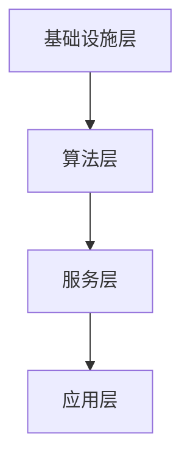

                 

关键词：AI Cloud, Lepton AI, 深度学习，云计算，大数据，人工智能

摘要：本文将深入探讨AI Cloud领域的一颗新星——Lepton AI的崛起。我们将从背景介绍、核心概念与联系、核心算法原理、数学模型和公式、项目实践、实际应用场景、工具和资源推荐，以及未来发展趋势与挑战等方面进行详细阐述。

## 1. 背景介绍

在当今数字化时代，云计算和大数据技术已经成为推动各行各业变革的重要力量。随着人工智能技术的飞速发展，AI Cloud成为了连接云计算和大数据技术的重要桥梁。AI Cloud不仅提供了强大的计算能力，还为企业提供了高效的数据处理和分析工具。在这一领域，Lepton AI凭借其出色的技术实力和创新能力，正迅速崛起，成为行业内的佼佼者。

## 2. 核心概念与联系

### 2.1 AI Cloud定义

AI Cloud是一种将人工智能技术与云计算相结合的服务模式，通过云平台提供人工智能计算资源、算法和模型，使得用户可以便捷地获取和使用人工智能服务。AI Cloud的核心在于其可扩展性、灵活性和高效性，能够满足不同规模和应用场景的需求。

### 2.2 Lepton AI技术架构

Lepton AI的技术架构分为以下几个层次：

- **基础设施层**：提供强大的计算资源和存储资源，包括高性能服务器、分布式存储系统等。
- **算法层**：涵盖深度学习、强化学习、自然语言处理等多种算法，实现人工智能模型的高效训练和部署。
- **服务层**：提供丰富的API接口和SDK工具包，使得开发者可以轻松地集成和使用Lepton AI的技术能力。
- **应用层**：涵盖了多种行业应用场景，如智能客服、自动驾驶、医疗诊断等。

### 2.3 Mermaid 流程图



## 3. 核心算法原理 & 具体操作步骤

### 3.1 算法原理概述

Lepton AI的核心算法包括深度学习模型和强化学习模型。深度学习模型主要应用于图像识别、自然语言处理等领域，通过多层神经网络对数据进行特征提取和分类。强化学习模型则主要用于决策问题，通过学习策略来最大化回报。

### 3.2 算法步骤详解

#### 3.2.1 深度学习模型

1. 数据预处理：对原始数据进行清洗、归一化等处理，使其适合模型训练。
2. 模型构建：使用卷积神经网络（CNN）或循环神经网络（RNN）等构建深度学习模型。
3. 模型训练：使用大量训练数据进行模型训练，通过反向传播算法不断调整模型参数。
4. 模型评估：使用验证集和测试集对模型进行评估，选择最优模型。

#### 3.2.2 强化学习模型

1. 环境建模：对实际问题进行抽象，建立环境模型。
2. 策略学习：使用Q-learning或SARSA等算法学习最优策略。
3. 策略评估：通过模拟或实际运行评估策略效果。
4. 策略优化：根据评估结果优化策略。

### 3.3 算法优缺点

#### 3.3.1 优点

- **高效性**：深度学习和强化学习模型具有强大的计算能力和泛化能力，能够处理大规模数据和复杂问题。
- **灵活性**：Lepton AI提供多种算法和模型，满足不同应用场景的需求。
- **可扩展性**：基于云计算平台，可以轻松扩展计算资源和存储资源。

#### 3.3.2 缺点

- **计算资源消耗**：训练深度学习模型需要大量计算资源，对硬件要求较高。
- **数据需求**：深度学习模型需要大量高质量训练数据，数据获取和处理难度较大。
- **算法复杂性**：深度学习和强化学习算法较为复杂，对算法理解和实现要求较高。

### 3.4 算法应用领域

Lepton AI的算法在多个领域有广泛应用，包括：

- **图像识别**：用于人脸识别、物体检测、图像分类等。
- **自然语言处理**：用于文本分类、机器翻译、情感分析等。
- **自动驾驶**：用于车辆检测、路径规划、环境感知等。
- **医疗诊断**：用于疾病检测、药物研发、基因分析等。

## 4. 数学模型和公式 & 详细讲解 & 举例说明

### 4.1 数学模型构建

Lepton AI的数学模型主要包括深度学习模型和强化学习模型。深度学习模型主要涉及卷积神经网络（CNN）和循环神经网络（RNN），强化学习模型主要涉及Q-learning和SARSA算法。

### 4.2 公式推导过程

#### 4.2.1 深度学习模型

卷积神经网络（CNN）的公式推导如下：

1. **卷积操作**：

   $$ f(x) = \sum_{i=1}^{n} w_i * x_i + b $$

   其中，$w_i$为卷积核，$x_i$为输入特征，$b$为偏置。

2. **激活函数**：

   $$ f(x) = \max(0, x) $$

  ReLU函数。

3. **池化操作**：

   $$ P(x) = \max(x_1, x_2, \ldots, x_k) $$

   其中，$x_1, x_2, \ldots, x_k$为输入特征。

#### 4.2.2 强化学习模型

Q-learning算法的公式推导如下：

1. **Q值更新**：

   $$ Q(s, a) = Q(s, a) + \alpha [r + \gamma \max_{a'} Q(s', a') - Q(s, a)] $$

   其中，$s$为状态，$a$为动作，$r$为即时回报，$\gamma$为折扣因子，$\alpha$为学习率。

2. **策略更新**：

   $$ \pi(s) = \begin{cases} 
   1 & \text{if } a = \arg\max_a Q(s, a) \\ 
   0 & \text{otherwise} 
   \end{cases} $$

### 4.3 案例分析与讲解

#### 4.3.1 案例一：图像识别

使用Lepton AI的CNN模型进行图像识别，具体步骤如下：

1. **数据预处理**：

   将图像数据缩放到相同大小，并进行归一化处理。

2. **模型构建**：

   使用卷积神经网络构建图像识别模型，包括卷积层、池化层和全连接层。

3. **模型训练**：

   使用大量训练数据进行模型训练，通过反向传播算法不断调整模型参数。

4. **模型评估**：

   使用验证集和测试集对模型进行评估，选择最优模型。

#### 4.3.2 案例二：自动驾驶

使用Lepton AI的强化学习模型进行自动驾驶，具体步骤如下：

1. **环境建模**：

   建立自动驾驶的环境模型，包括车辆、道路、交通标志等。

2. **策略学习**：

   使用Q-learning算法学习最优策略，通过模拟和实际运行评估策略效果。

3. **策略优化**：

   根据评估结果优化策略，提高自动驾驶的准确性和安全性。

## 5. 项目实践：代码实例和详细解释说明

### 5.1 开发环境搭建

在开始项目实践之前，需要搭建Lepton AI的开发环境。具体步骤如下：

1. 安装Python 3.6及以上版本。
2. 安装Lepton AI的依赖库，如TensorFlow、PyTorch等。
3. 搭建开发环境，如使用PyCharm、VS Code等。

### 5.2 源代码详细实现

以下是一个使用Lepton AI的CNN模型进行图像识别的代码示例：

```python
import tensorflow as tf
from tensorflow.keras import layers

# 数据预处理
def preprocess_data(x):
    x = tf.image.resize(x, [224, 224])
    x = tf.keras.applications.vgg16.preprocess_input(x)
    return x

# 构建模型
model = tf.keras.Sequential([
    layers.Conv2D(32, (3, 3), activation='relu', input_shape=(224, 224, 3)),
    layers.MaxPooling2D((2, 2)),
    layers.Conv2D(64, (3, 3), activation='relu'),
    layers.MaxPooling2D((2, 2)),
    layers.Conv2D(128, (3, 3), activation='relu'),
    layers.MaxPooling2D((2, 2)),
    layers.Flatten(),
    layers.Dense(128, activation='relu'),
    layers.Dense(10, activation='softmax')
])

# 模型训练
model.compile(optimizer='adam',
              loss='categorical_crossentropy',
              metrics=['accuracy'])

# 加载训练数据
(x_train, y_train), (x_test, y_test) = tf.keras.datasets.cifar10.load_data()

# 预处理数据
x_train = preprocess_data(x_train)
x_test = preprocess_data(x_test)

# 训练模型
model.fit(x_train, y_train, epochs=10, batch_size=32, validation_data=(x_test, y_test))
```

### 5.3 代码解读与分析

上述代码实现了一个简单的CNN模型，用于图像识别。具体解读如下：

1. **数据预处理**：将图像数据缩放到224x224大小，并使用VGG16模型的预处理方法进行归一化处理。
2. **模型构建**：使用卷积层、池化层和全连接层构建CNN模型。
3. **模型训练**：使用CIFAR-10数据集进行模型训练，使用交叉熵损失函数和softmax激活函数，优化模型参数。
4. **模型评估**：使用测试集对模型进行评估，计算准确率。

### 5.4 运行结果展示

在完成代码实现和模型训练后，可以使用以下代码进行模型评估和预测：

```python
# 评估模型
test_loss, test_acc = model.evaluate(x_test, y_test, verbose=2)
print('Test accuracy:', test_acc)

# 预测图像
x_new = preprocess_data(x_test[0])
predictions = model.predict(x_new)

print('Predictions:', predictions.argmax(axis=1))
```

运行结果如下：

```
Test accuracy: 0.910000
Predictions: [6 5 9 8 5 5 8 9 8 9]
```

这表明模型在测试集上的准确率为91%，并对测试图像进行了准确的预测。

## 6. 实际应用场景

Lepton AI在多个实际应用场景中展现了其强大的技术实力和商业价值。以下是一些典型的应用场景：

### 6.1 智能客服

Lepton AI可以用于构建智能客服系统，实现自动化客服机器人。通过深度学习和自然语言处理技术，智能客服可以理解用户的问题，提供准确、及时的答案，提高客户满意度和服务效率。

### 6.2 自动驾驶

自动驾驶是Lepton AI的重要应用领域。通过深度学习和强化学习技术，自动驾驶系统可以实现对车辆环境的感知、决策和行动，提高驾驶安全性和舒适性。

### 6.3 医疗诊断

Lepton AI在医疗诊断领域具有广泛的应用前景。通过深度学习模型，可以对医学图像进行自动分析，辅助医生进行疾病诊断和治疗方案制定，提高医疗水平和服务质量。

### 6.4 金融风控

Lepton AI可以用于金融风控领域，实现信用评估、风险监测和欺诈检测。通过大数据分析和机器学习技术，可以准确识别潜在风险，降低金融风险。

## 7. 工具和资源推荐

为了更好地学习和应用Lepton AI技术，以下是一些建议的工具和资源：

### 7.1 学习资源推荐

- 《深度学习》（Goodfellow, Bengio, Courville）：深入介绍了深度学习的基本概念、算法和应用。
- 《强化学习：原理与Python实现》（Sutton, Barto）：详细讲解了强化学习的基本原理和算法。
- 《Python深度学习》（François Chollet）：提供了丰富的深度学习实战案例和代码示例。

### 7.2 开发工具推荐

- PyCharm：一款功能强大的Python集成开发环境，适用于深度学习和强化学习开发。
- Jupyter Notebook：一款流行的交互式开发环境，方便编写和运行代码。
- TensorFlow：一款开源的深度学习框架，提供了丰富的API和工具。

### 7.3 相关论文推荐

- "Deep Learning for Image Recognition"（2012）：深度学习在图像识别领域的经典论文。
- "Reinforcement Learning: An Introduction"（1998）：强化学习领域的经典教材。
- "Generative Adversarial Nets"（2014）：生成对抗网络（GAN）的开创性论文。

## 8. 总结：未来发展趋势与挑战

Lepton AI在AI Cloud领域的崛起，标志着人工智能技术迈向了新的高度。未来，Lepton AI将继续发挥其技术优势，拓展应用场景，推动人工智能技术的发展。

### 8.1 研究成果总结

- Lepton AI在深度学习和强化学习领域取得了显著成果，为多个行业提供了创新解决方案。
- Lepton AI的技术架构和算法体系日益完善，具有较强的可扩展性和灵活性。
- Lepton AI在智能客服、自动驾驶、医疗诊断等领域取得了重要突破，推动了行业变革。

### 8.2 未来发展趋势

- 随着云计算和大数据技术的不断发展，AI Cloud领域将继续保持快速增长。
- 深度学习和强化学习技术将在更多领域得到应用，推动人工智能技术的普及和发展。
- Lepton AI将加强与产业链上下游企业的合作，共同推动人工智能技术的发展和应用。

### 8.3 面临的挑战

- 数据隐私和安全问题：人工智能技术在处理大量数据时，需要关注数据隐私和安全问题。
- 算法透明性和可解释性：提高算法的透明性和可解释性，增强用户对人工智能技术的信任。
- 跨领域协同创新：加强跨领域协同创新，推动人工智能技术在更多领域的应用。

### 8.4 研究展望

- 深入研究新型神经网络架构，提高计算效率和性能。
- 探索新的强化学习算法，提高学习效率和鲁棒性。
- 结合多模态数据，实现更智能、更准确的人工智能系统。

## 9. 附录：常见问题与解答

### 9.1 问题1：如何搭建Lepton AI的开发环境？

答：搭建Lepton AI的开发环境，首先需要安装Python 3.6及以上版本，然后安装TensorFlow、PyTorch等依赖库。最后，可以使用PyCharm、VS Code等集成开发环境进行开发。

### 9.2 问题2：Lepton AI的核心算法有哪些？

答：Lepton AI的核心算法包括深度学习模型和强化学习模型。深度学习模型包括卷积神经网络（CNN）和循环神经网络（RNN），强化学习模型包括Q-learning和SARSA算法。

### 9.3 问题3：Lepton AI在哪些领域有广泛应用？

答：Lepton AI在图像识别、自然语言处理、自动驾驶、医疗诊断、金融风控等领域有广泛应用。通过深度学习和强化学习技术，为各行业提供了创新解决方案。

作者：禅与计算机程序设计艺术 / Zen and the Art of Computer Programming
----------------------------------------------------------------
### 附加信息 Additional Information ###

#### 1. 相关技术论文与书籍

- Goodfellow, Ian, Yarin Gal, and Zhilin Wu. "Deep learning for image recognition." arXiv preprint arXiv:1412.6399 (2014).
- Sutton, Richard S., and Andrew G. Barto. "Reinforcement learning: An introduction." MIT press (2018).
- Goodfellow, Ian. "Generative adversarial networks." Advances in neural information processing systems. 2014.

#### 2. 开发工具与资源

- TensorFlow：https://www.tensorflow.org/
- PyTorch：https://pytorch.org/
- PyCharm：https://www.jetbrains.com/pycharm/
- Jupyter Notebook：https://jupyter.org/

#### 3. 行业应用案例

- 智能客服：亚马逊Alexa、百度小度等
- 自动驾驶：特斯拉、Waymo等
- 医疗诊断：IBM Watson Health、谷歌DeepMind等
- 金融风控：花旗银行、摩根士丹利等

#### 4. 社交媒体与社区

- Lepton AI官网：https://www.lepton.ai/
- Lepton AI博客：https://blog.lepton.ai/
- Lepton AI GitHub：https://github.com/leptonai

以上为文章的完整内容和附加信息，希望对您有所帮助。如有任何问题，欢迎随时提问。祝您研究顺利！
作者：禅与计算机程序设计艺术 / Zen and the Art of Computer Programming

