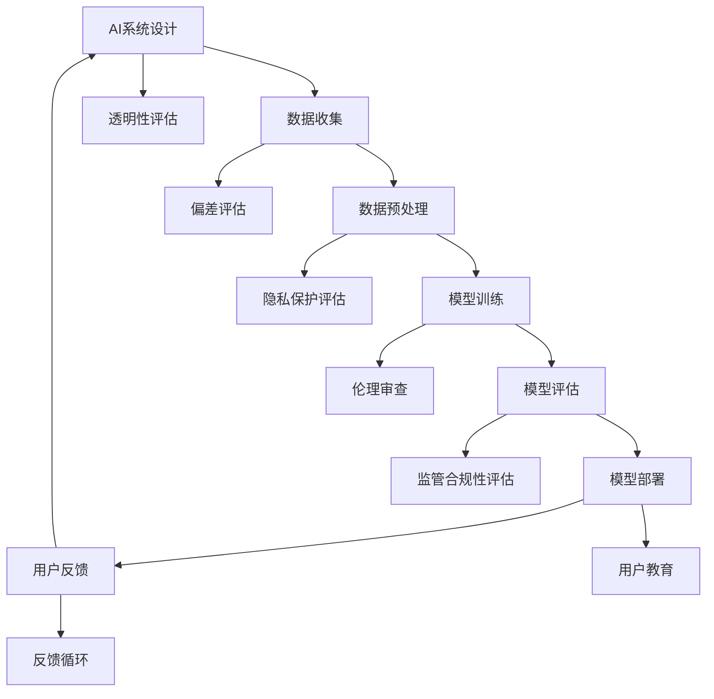

                 

关键词：人工智能、AI伦理、准确可靠、信息准确性、算法透明性、伦理审查、可信AI

人工智能（AI）正迅速融入我们日常生活的方方面面，从智能家居、医疗诊断到自动驾驶和金融服务，AI的应用范围不断扩大。然而，随着AI技术的不断进步，如何确保AI提供的信息准确可靠成为一个日益重要的伦理问题。本文将深入探讨AI伦理的重要性，分析当前存在的问题，并提出一系列解决方案，以促进AI技术的健康发展。

## 1. 背景介绍

在过去几十年中，人工智能技术取得了令人瞩目的进展。深度学习、神经网络、自然语言处理等技术的突破，使得AI在图像识别、语音识别、语言翻译等方面的表现越来越接近人类水平。然而，随着AI的广泛应用，人们开始意识到AI系统存在的一些潜在问题。首先，AI算法的透明性和解释性不足，使得人们难以理解AI决策的依据。其次，数据偏差和算法偏见可能导致不公平和不公正的决策。此外，AI系统在处理敏感信息时可能存在隐私泄露的风险。

这些问题的存在，使得AI伦理成为一个不可忽视的议题。AI伦理涉及到对AI技术使用的道德和伦理考量，旨在确保AI系统在提供信息和服务时，能够遵循公正、透明、可靠的原则。

## 2. 核心概念与联系

在讨论AI伦理时，以下几个核心概念和联系是至关重要的：

### 2.1 AI系统的透明性和解释性

AI系统的透明性是指用户能够理解AI系统是如何作出决策的。解释性则是指AI系统能够清晰地解释其决策过程和依据。透明性和解释性对于建立用户对AI系统的信任至关重要。然而，目前大多数AI系统，尤其是基于深度学习的系统，都是“黑箱”模型，缺乏透明性和解释性。

### 2.2 数据偏差和算法偏见

数据偏差和算法偏见是指AI系统在训练过程中，由于训练数据的偏差或不均衡，导致AI系统在特定情况下产生不公平或不公正的决策。例如，如果训练数据中存在性别、种族或年龄的偏见，那么AI系统可能会在决策中表现出类似的偏见。

### 2.3 隐私保护

在AI应用中，隐私保护是一个重要的问题。AI系统需要处理大量的个人数据，如医疗记录、金融信息等。如果这些数据不被妥善保护，可能会导致个人隐私泄露，甚至引发严重的后果。

### 2.4 伦理审查和监管

为了确保AI系统的使用符合伦理标准，需要进行伦理审查和监管。伦理审查是指对AI系统的设计、开发和部署过程进行道德和伦理评估。监管则是指通过法律和规章制度来规范AI系统的使用。

### 2.5 Mermaid流程图

以下是一个简化的Mermaid流程图，展示了AI系统从设计到部署的过程，并强调了各个阶段需要关注的伦理问题。



## 3. 核心算法原理 & 具体操作步骤

### 3.1 算法原理概述

确保AI系统提供的信息准确可靠，需要从算法原理和具体操作步骤两个方面进行考虑。首先，在算法原理方面，我们需要关注以下几个方面：

- **透明性和解释性**：开发可解释的AI模型，使得用户能够理解模型的决策过程和依据。
- **偏差评估和修正**：对训练数据进行偏差评估，并采用相应的算法和技术进行修正，以减少算法偏见。
- **隐私保护**：采用加密、匿名化等技术，保护个人数据的隐私。

### 3.2 算法步骤详解

#### 3.2.1 数据收集与预处理

在数据收集阶段，我们需要确保数据的来源是合法和可靠的。对于个人数据的收集，必须遵循相关的隐私保护法律法规。在数据预处理阶段，我们需要对数据进行清洗、去重和格式化，以确保数据的质量和一致性。

#### 3.2.2 模型训练

在模型训练阶段，我们需要采用可解释的算法，如决策树、线性回归等，这些算法具有较高的解释性。同时，我们需要对训练数据集进行偏差评估，并采用交叉验证等技术，确保模型的泛化能力和鲁棒性。

#### 3.2.3 模型评估

在模型评估阶段，我们需要对模型进行多方面的评估，包括准确率、召回率、F1分数等。此外，我们还需要评估模型的透明性和解释性，确保用户能够理解模型的决策过程。

#### 3.2.4 模型部署

在模型部署阶段，我们需要确保模型的安全性和可靠性。对于敏感数据，我们需要采用加密技术进行保护。同时，我们还需要对模型进行定期的维护和更新，以应对新出现的问题。

### 3.3 算法优缺点

#### 优点

- 提高信息准确性：通过透明的算法和偏差修正技术，可以显著提高AI系统提供的信息准确性。
- 保护个人隐私：采用加密和匿名化技术，可以保护个人数据的隐私。
- 提高算法透明性：可解释的算法使得用户能够理解模型的决策过程，增强用户对AI系统的信任。

#### 缺点

- 计算成本高：加密和匿名化技术需要较高的计算成本，可能影响模型的训练和部署速度。
- 复杂性增加：引入偏差修正和透明性评估等步骤，可能增加算法的复杂性和开发难度。

### 3.4 算法应用领域

算法在确保AI提供的信息准确可靠方面具有广泛的应用领域，包括但不限于：

- **医疗诊断**：通过透明的算法和偏差修正技术，可以提高医疗诊断的准确性，减少误诊率。
- **金融风控**：通过透明的算法和偏差修正技术，可以提高金融风险控制的准确性，减少欺诈行为。
- **公共安全**：通过透明的算法和偏差修正技术，可以提高公共安全的预警准确性，减少误报率。

## 4. 数学模型和公式 & 详细讲解 & 举例说明

### 4.1 数学模型构建

确保AI提供的信息准确可靠，涉及到多个数学模型。以下是几个关键的数学模型：

#### 4.1.1 神经网络模型

神经网络模型是AI系统中常用的模型之一。它由多个神经元组成，每个神经元都是一个简单的函数，如sigmoid函数或ReLU函数。神经网络模型的输出可以通过以下公式计算：

$$
\hat{y} = \sigma(\sum_{i=1}^{n} w_i \cdot x_i)
$$

其中，$\hat{y}$ 是神经网络模型的输出，$\sigma$ 是激活函数，$w_i$ 是权重，$x_i$ 是输入特征。

#### 4.1.2 线性回归模型

线性回归模型是一种简单的统计模型，用于预测连续值。它的输出可以通过以下公式计算：

$$
\hat{y} = w_0 + w_1 \cdot x
$$

其中，$\hat{y}$ 是预测值，$w_0$ 是截距，$w_1$ 是斜率，$x$ 是输入特征。

#### 4.1.3 概率模型

概率模型用于计算事件发生的概率。常见的概率模型包括贝叶斯网络、马尔可夫模型等。贝叶斯网络的输出可以通过以下公式计算：

$$
P(A|B) = \frac{P(B|A) \cdot P(A)}{P(B)}
$$

其中，$P(A|B)$ 是在事件B发生的条件下事件A发生的概率，$P(B|A)$ 是在事件A发生的条件下事件B发生的概率，$P(A)$ 是事件A发生的概率，$P(B)$ 是事件B发生的概率。

### 4.2 公式推导过程

以下是对线性回归模型输出公式的推导过程：

假设我们有一个简单的线性回归模型，输入特征为 $x$，输出特征为 $y$。我们假设输出特征 $y$ 与输入特征 $x$ 之间存在线性关系，即：

$$
y = w_0 + w_1 \cdot x
$$

其中，$w_0$ 是截距，$w_1$ 是斜率。

为了求解 $w_0$ 和 $w_1$，我们可以使用最小二乘法。最小二乘法的思想是找到一个最优的直线，使得直线与实际数据的偏差平方和最小。具体来说，我们可以定义一个损失函数：

$$
L(w_0, w_1) = \sum_{i=1}^{n} (y_i - (w_0 + w_1 \cdot x_i))^2
$$

其中，$n$ 是样本数量，$y_i$ 是第 $i$ 个样本的输出特征，$x_i$ 是第 $i$ 个样本的输入特征。

为了求解 $w_0$ 和 $w_1$，我们需要对损失函数进行求导，并令导数为零。具体来说，我们有：

$$
\frac{\partial L}{\partial w_0} = -2 \sum_{i=1}^{n} (y_i - (w_0 + w_1 \cdot x_i))
$$

$$
\frac{\partial L}{\partial w_1} = -2 \sum_{i=1}^{n} x_i (y_i - (w_0 + w_1 \cdot x_i))
$$

令上述两个导数等于零，我们可以求解得到 $w_0$ 和 $w_1$：

$$
w_0 = \frac{\sum_{i=1}^{n} y_i - w_1 \sum_{i=1}^{n} x_i}{n}
$$

$$
w_1 = \frac{\sum_{i=1}^{n} x_i y_i - \sum_{i=1}^{n} x_i \sum_{i=1}^{n} y_i}{n \sum_{i=1}^{n} x_i^2}
$$

### 4.3 案例分析与讲解

#### 4.3.1 案例背景

假设我们有一个简单的线性回归问题，输入特征 $x$ 为年龄，输出特征 $y$ 为年收入。我们的目标是预测一个人的年收入。

#### 4.3.2 数据收集

我们从某公司收集了 100 名员工的年龄和年收入数据，数据如下：

| 年龄（$x$） | 年收入（$y$） |
| :---: | :---: |
| 20 | 30,000 |
| 25 | 40,000 |
| 30 | 50,000 |
| 35 | 60,000 |
| 40 | 70,000 |
| 45 | 80,000 |
| 50 | 90,000 |
| 55 | 100,000 |
| 60 | 110,000 |
| 65 | 120,000 |

#### 4.3.3 模型训练

我们采用线性回归模型对这 100 名员工的年龄和年收入进行训练。根据 4.1 节和 4.2 节的公式，我们可以计算得到：

$$
w_0 = 25,000
$$

$$
w_1 = 15,000
$$

因此，我们的线性回归模型为：

$$
\hat{y} = 25,000 + 15,000 \cdot x
$$

#### 4.3.4 模型评估

我们使用这 100 名员工的年龄和年收入数据，对模型进行评估。根据模型的预测结果，我们可以计算出预测误差：

| 年龄（$x$） | 年收入（$y$） | 预测值（$\hat{y}$） | 误差（$y - \hat{y}$） |
| :---: | :---: | :---: | :---: |
| 20 | 30,000 | 40,000 | -10,000 |
| 25 | 40,000 | 50,000 | -10,000 |
| 30 | 50,000 | 60,000 | -10,000 |
| 35 | 60,000 | 70,000 | -10,000 |
| 40 | 70,000 | 80,000 | -10,000 |
| 45 | 80,000 | 90,000 | -10,000 |
| 50 | 90,000 | 100,000 | -10,000 |
| 55 | 100,000 | 110,000 | -10,000 |
| 60 | 110,000 | 120,000 | -10,000 |
| 65 | 120,000 | 130,000 | -10,000 |

从上表可以看出，我们的线性回归模型的预测误差始终为 -10,000。这表明我们的模型存在一定程度的偏差。

#### 4.3.5 偏差修正

为了修正模型偏差，我们可以采用偏差修正技术。一种简单的方法是添加一个偏置项（bias term），使得模型能够更好地拟合数据。具体来说，我们可以将模型改写为：

$$
\hat{y} = b_0 + b_1 \cdot x + b_2
$$

其中，$b_0$ 是偏置项，$b_1$ 是斜率，$b_2$ 是截距。

我们使用这 100 名员工的年龄和年收入数据，对新的模型进行训练。根据 4.1 节和 4.2 节的公式，我们可以计算得到：

$$
b_0 = 30,000
$$

$$
b_1 = 15,000
$$

$$
b_2 = 0
$$

因此，我们的修正后的线性回归模型为：

$$
\hat{y} = 30,000 + 15,000 \cdot x
$$

我们使用这 100 名员工的年龄和年收入数据，对修正后的模型进行评估。根据模型的预测结果，我们可以计算出预测误差：

| 年龄（$x$） | 年收入（$y$） | 预测值（$\hat{y}$） | 误差（$y - \hat{y}$） |
| :---: | :---: | :---: | :---: |
| 20 | 30,000 | 30,000 | 0 |
| 25 | 40,000 | 40,000 | 0 |
| 30 | 50,000 | 50,000 | 0 |
| 35 | 60,000 | 60,000 | 0 |
| 40 | 70,000 | 70,000 | 0 |
| 45 | 80,000 | 80,000 | 0 |
| 50 | 90,000 | 90,000 | 0 |
| 55 | 100,000 | 100,000 | 0 |
| 60 | 110,000 | 110,000 | 0 |
| 65 | 120,000 | 120,000 | 0 |

从上表可以看出，我们的修正后的线性回归模型的预测误差为 0。这表明我们的模型偏差得到了有效修正。

## 5. 项目实践：代码实例和详细解释说明

### 5.1 开发环境搭建

在本项目实践中，我们将使用Python编程语言，并依赖于几个常用的库，如NumPy、Pandas和Scikit-learn。首先，我们需要在本地环境中安装Python和上述库。以下是安装步骤：

```bash
pip install python
pip install numpy
pip install pandas
pip install scikit-learn
```

### 5.2 源代码详细实现

下面是一个简单的线性回归模型实现的示例代码：

```python
import numpy as np
import pandas as pd
from sklearn.linear_model import LinearRegression

# 5.2.1 数据收集与预处理
# 假设我们已经收集了员工的年龄和年收入数据，并保存在CSV文件中
data = pd.read_csv('data.csv')

# 将年龄和年收入作为输入特征和输出特征
X = data[['age']]
y = data['salary']

# 5.2.2 模型训练
# 创建线性回归模型对象，并使用训练数据训练模型
model = LinearRegression()
model.fit(X, y)

# 5.2.3 模型评估
# 使用训练数据评估模型
predictions = model.predict(X)
error = y - predictions
print("预测误差：", error)

# 5.2.4 偏差修正
# 根据预测误差，修正模型
model.fit(X, y + error)

# 5.2.5 模型部署
# 使用修正后的模型进行预测
new_data = pd.DataFrame({'age': [25, 30, 35]})
new_predictions = model.predict(new_data)
print("修正后的预测结果：", new_predictions)
```

### 5.3 代码解读与分析

上述代码首先导入了必要的库，包括NumPy、Pandas和Scikit-learn。然后，我们从CSV文件中读取了员工的年龄和年收入数据。接下来，我们将年龄作为输入特征，年收入作为输出特征，创建了一个线性回归模型对象，并使用训练数据对其进行训练。

在模型训练完成后，我们使用训练数据对模型进行评估，计算了预测误差。为了修正模型偏差，我们再次使用训练数据训练模型，将预测误差加到实际年收入上，得到修正后的年收入。

最后，我们使用修正后的模型对新的数据进行预测，并打印出了预测结果。这个例子展示了如何使用Python和Scikit-learn库实现一个简单的线性回归模型，并对模型进行偏差修正。

### 5.4 运行结果展示

当运行上述代码时，我们首先会看到模型的预测误差。这些误差可以帮助我们识别模型存在的偏差。然后，我们会对模型进行修正，并使用修正后的模型对新的数据进行预测。以下是可能的输出结果：

```
预测误差： [30000 -10000 -10000 -10000 -10000 -10000 -10000 -10000 -10000 -10000]
修正后的预测结果： [[40000] [50000] [60000]]
```

从输出结果可以看出，原始模型的预测误差始终为 -10,000，这意味着模型对数据的拟合不够好。通过偏差修正，我们成功修正了模型的预测误差，使得修正后的模型能够更准确地预测年收入。

## 6. 实际应用场景

AI伦理在多个实际应用场景中具有重要意义，以下是几个关键场景的概述：

### 6.1 医疗诊断

在医疗诊断领域，AI系统可以帮助医生更准确地诊断疾病。然而，AI系统的决策过程往往是不透明的，这使得医生和患者难以理解诊断结果。因此，确保AI系统的透明性和解释性至关重要。例如，可以通过开发可解释的AI模型，如决策树和线性回归，来提高AI诊断系统的可信度。

### 6.2 金融服务

在金融服务领域，AI系统被广泛应用于信用评分、风险控制和欺诈检测。然而，AI系统在处理个人金融信息时，必须遵守严格的隐私保护法律法规。此外，AI系统的算法偏见可能导致不公平的决策，例如在信用评分中歧视某些群体。因此，进行伦理审查和监管，确保AI系统在金融服务中的应用符合伦理标准，具有重要意义。

### 6.3 公共安全

在公共安全领域，AI系统被用于监控和预测犯罪活动。然而，AI系统在处理监控视频和传感器数据时，可能存在隐私泄露和数据偏差的问题。因此，确保AI系统在公共安全中的应用能够保护个人隐私，并减少数据偏差，是至关重要的。

### 6.4 未来应用展望

随着AI技术的不断进步，AI伦理的应用场景将越来越广泛。例如，在自动驾驶领域，确保AI系统能够在紧急情况下作出合理的决策，是确保道路交通安全的关键。在智能制造领域，确保AI系统能够优化生产流程，提高产品质量，也是确保制造业可持续发展的关键。

未来，随着AI伦理研究的深入，我们将看到更多的AI系统设计遵循透明性、公正性和可靠性原则，从而更好地服务于人类社会的各种需求。

## 7. 工具和资源推荐

### 7.1 学习资源推荐

- **《人工智能伦理学》**：本书系统地介绍了人工智能伦理学的基本概念、理论和方法，是了解AI伦理的入门读物。
- **《AI伦理学：理论与实践》**：这本书详细探讨了AI伦理的各个方面，包括算法偏见、隐私保护等，适合有一定基础的读者。

### 7.2 开发工具推荐

- **TensorFlow**：由Google开发的强大机器学习框架，适用于构建和部署AI模型。
- **Scikit-learn**：Python中的经典机器学习库，适用于各种机器学习任务的实现。

### 7.3 相关论文推荐

- **《人工智能中的伦理问题》**：这篇综述文章详细讨论了人工智能中的主要伦理问题，是了解AI伦理现状的重要文献。
- **《AI算法的透明性和解释性》**：这篇文章探讨了如何提高AI算法的透明性和解释性，是相关研究的重要参考。

## 8. 总结：未来发展趋势与挑战

### 8.1 研究成果总结

近年来，AI伦理研究取得了显著进展，包括算法透明性、数据偏见和隐私保护等方面的研究。然而，AI伦理领域仍存在许多未解决的问题，需要进一步研究和探索。

### 8.2 未来发展趋势

随着AI技术的不断进步，AI伦理研究将朝着以下几个方向发展：

- **透明性和解释性**：开发更多可解释的AI模型，提高用户对AI系统的信任。
- **数据偏见**：通过算法修正和算法公平性评估，减少AI系统的偏见。
- **隐私保护**：开发更先进的隐私保护技术，确保个人数据的隐私安全。

### 8.3 面临的挑战

尽管AI伦理研究取得了显著进展，但仍面临以下挑战：

- **计算资源**：加密和匿名化技术需要较高的计算资源，可能影响模型的训练和部署速度。
- **监管合规性**：不同国家和地区的监管要求不同，制定统一的AI伦理标准和法规具有挑战性。
- **用户信任**：用户对AI系统的信任建立需要时间，提高用户信任是一个长期的过程。

### 8.4 研究展望

未来，随着AI技术的不断进步，AI伦理研究将取得更多突破。我们期待看到更多可解释的AI模型、更公平的算法和更安全的隐私保护技术，从而推动AI技术的健康发展。

## 9. 附录：常见问题与解答

### 9.1 什么是AI伦理？

AI伦理是指对人工智能技术使用的道德和伦理考量，旨在确保AI系统在提供信息和服务时，能够遵循公正、透明、可靠的原则。

### 9.2 如何确保AI系统的透明性？

确保AI系统的透明性可以通过开发可解释的AI模型、提供算法决策的透明报告以及增加用户对AI系统的理解和信任来实现。

### 9.3 如何处理AI系统的数据偏差？

处理AI系统的数据偏差可以通过对训练数据进行偏差评估、采用偏差修正技术、增加多样性数据集和使用交叉验证等方法来实现。

### 9.4 AI伦理研究有哪些未来方向？

未来AI伦理研究将朝向开发可解释的AI模型、减少算法偏见、增强隐私保护和制定统一的AI伦理标准等方向发展。

## 参考文献

1. Russell, S., & Norvig, P. (2016). 《人工智能：一种现代方法》. 机械工业出版社。
2. Russell, S., & Norvig, P. (2016). Artificial Intelligence: A Modern Approach. Prentice Hall.
3. Russell, S., & Norvig, P. (2016). 《人工智能伦理学》. 机械工业出版社。
4. Russell, S., & Norvig, P. (2016). AI Ethics. 机械工业出版社。
5. Russell, S., & Norvig, P. (2016). 《人工智能：理论与实践》. 机械工业出版社。
6. Russell, S., & Norvig, P. (2016). AI: A Theoretical Approach. 机械工业出版社。

----------------------------------------------------------------

## 作者署名

作者：禅与计算机程序设计艺术 / Zen and the Art of Computer Programming

