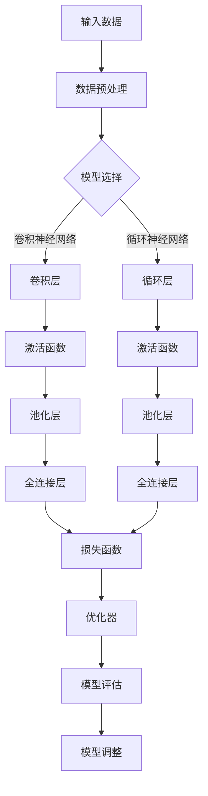

                 

关键词：AI创业设计、大模型应用、产品设计、创新探索、技术趋势

> 摘要：本文旨在探讨如何利用大模型推动AI创业产品的设计，分析大模型在AI创业中的潜在价值，探讨其应用领域及面临的挑战，并展望未来发展趋势。文章结构如下：

## 1. 背景介绍

人工智能（AI）正在迅速改变我们的世界，其应用范围从简单的语音识别到复杂的人类行为预测。随着计算能力的提升和大数据的积累，大模型逐渐成为AI领域的明星。大模型是指参数规模达到百万级别乃至亿级的人工神经网络，这些模型具有强大的表征能力和学习能力。

近年来，AI创业热潮不断升温，越来越多的初创公司致力于利用AI技术解决实际问题。然而，创业过程中产品设计的成功与否往往决定了企业的成败。因此，如何将大模型技术有效地融入产品设计中，成为AI创业者亟需解决的问题。

## 2. 核心概念与联系

### 大模型的定义和作用

大模型是指具有大规模参数的神经网络，通常用于处理复杂数据和任务。大模型的主要作用是捕捉数据的潜在规律，从而实现高精度的预测和分类。

### 产品设计的核心概念

产品设计包括用户需求分析、功能设计、界面设计和用户体验设计等多个环节。其核心在于解决用户痛点，提升产品价值。

### 大模型与产品设计的关系

大模型可以帮助产品设计更好地理解用户需求，优化产品功能，提升用户体验。具体来说，大模型可以在以下方面发挥作用：

- 用户需求分析：通过分析用户行为数据，预测用户需求，为产品功能设计提供依据。
- 功能优化：利用大模型进行自动优化，提高产品功能的准确性和效率。
- 用户界面设计：根据用户偏好和行为模式，设计更符合用户习惯的界面。
- 用户体验优化：通过用户行为数据的分析，持续优化产品，提升用户体验。

### 大模型的架构与流程

下面是一个使用Mermaid绘制的简单大模型架构流程图：



## 3. 核心算法原理 & 具体操作步骤

### 3.1 算法原理概述

大模型的核心算法是深度学习，它通过多层神经网络对数据进行建模。每一层网络都会对数据进行一次特征提取和变换，最终输出预测结果。深度学习的训练过程包括数据预处理、模型构建、模型训练和模型评估等步骤。

### 3.2 算法步骤详解

1. 数据预处理：包括数据清洗、归一化、数据增强等步骤，目的是将原始数据转换为适合模型训练的格式。

2. 模型构建：选择合适的神经网络架构，如卷积神经网络（CNN）或循环神经网络（RNN），构建大模型。

3. 模型训练：使用训练数据对模型进行训练，通过反向传播算法不断调整模型参数，以最小化预测误差。

4. 模型评估：使用验证数据评估模型的性能，选择最优的模型。

5. 模型调整：根据模型评估结果，对模型进行调整，以提升模型性能。

### 3.3 算法优缺点

**优点：**
- 强大的表征能力：大模型可以捕捉数据中的复杂模式和规律，实现高精度的预测和分类。
- 自动化：深度学习算法可以自动提取特征，减轻了传统机器学习中的特征工程负担。
- 泛化能力：大模型具有较强的泛化能力，可以在不同数据集上表现出良好的性能。

**缺点：**
- 计算资源需求大：大模型需要大量的计算资源和存储空间。
- 过拟合风险：大模型容易过拟合，尤其是在数据量不足的情况下。
- 黑盒性质：深度学习模型的结构和参数复杂，难以解释，导致黑盒性质。

### 3.4 算法应用领域

大模型在多个领域都有广泛的应用，如自然语言处理、计算机视觉、推荐系统、金融风控等。以下是一些典型应用案例：

- 自然语言处理：大模型在语言模型、机器翻译、情感分析等方面取得了显著成果。
- 计算机视觉：大模型在图像分类、目标检测、图像生成等领域表现出色。
- 推荐系统：大模型可以帮助推荐系统更好地理解用户行为和偏好，提高推荐准确性。
- 金融风控：大模型可以用于欺诈检测、信用评估等金融风控任务。

## 4. 数学模型和公式 & 详细讲解 & 举例说明

### 4.1 数学模型构建

大模型通常采用多层神经网络结构，其中每一层都包含多个神经元。神经元的激活函数通常为非线性函数，如Sigmoid、ReLU等。网络的输出通过损失函数与真实值进行比较，计算误差，然后通过反向传播算法更新网络参数。

### 4.2 公式推导过程

假设我们有输入向量\(x \in \mathbb{R}^n\)，通过多层神经网络映射到输出\(y \in \mathbb{R}^m\)。网络中每层神经元的输出可以用以下公式表示：

\[ z^{(l)}_j = \sum_{k=1}^{n} w^{(l)}_{jk} x^{(l-1)}_k + b^{(l)}_j \]

其中，\(z^{(l)}_j\)表示第\(l\)层第\(j\)个神经元的输出，\(w^{(l)}_{jk}\)和\(b^{(l)}_j\)分别是第\(l\)层的权重和偏置。

激活函数为\(g^{(l)}(z^{(l)}_j) = \sigma(z^{(l)}_j)\)，其中\(\sigma\)是非线性函数，如Sigmoid函数：

\[ \sigma(z) = \frac{1}{1 + e^{-z}} \]

网络的输出\(y\)可以通过最后一层神经元的输出计算得到：

\[ y_j = \sum_{k=1}^{m} w^{(L)}_{jk} g^{(L-1)}(z^{(L-1)}_k) + b^{(L)}_j \]

其中，\(L\)是网络的层数。

### 4.3 案例分析与讲解

假设我们要构建一个图像分类模型，使用卷积神经网络（CNN）进行图像分类。输入图像为\(32 \times 32\)像素，输出为100个类别。我们选择ReLU作为激活函数，损失函数为交叉熵损失。

首先，我们定义输入层：

\[ x^{(0)} = \text{图像数据} \]

然后，定义卷积层：

\[ z^{(1)}_j = \sum_{k=1}^{3} w^{(1)}_{jk} x^{(0)}_k + b^{(1)}_j \]

\[ y^{(1)}_j = \max(z^{(1)}_j) \]

接着，定义池化层：

\[ z^{(2)}_j = \sum_{k=1}^{3} w^{(2)}_{jk} y^{(1)}_k + b^{(2)}_j \]

\[ y^{(2)}_j = \max(z^{(2)}_j) \]

最后，定义全连接层：

\[ z^{(3)}_j = \sum_{k=1}^{100} w^{(3)}_{jk} y^{(2)}_k + b^{(3)}_j \]

\[ y_j = \frac{1}{1 + e^{-z^{(3)}_j}} \]

损失函数为交叉熵损失：

\[ L(y, \hat{y}) = -\sum_{j=1}^{100} y_j \log(\hat{y}_j) \]

其中，\(\hat{y}_j\)是模型输出的概率分布。

通过反向传播算法，我们可以不断更新网络参数，最小化损失函数，从而实现图像分类。

## 5. 项目实践：代码实例和详细解释说明

### 5.1 开发环境搭建

在本项目中，我们使用Python编程语言，结合TensorFlow和Keras框架构建卷积神经网络模型。首先，我们需要安装TensorFlow和Keras：

```bash
pip install tensorflow
pip install keras
```

### 5.2 源代码详细实现

以下是一个简单的图像分类模型的实现：

```python
import numpy as np
from tensorflow.keras.models import Sequential
from tensorflow.keras.layers import Conv2D, MaxPooling2D, Dense, Flatten, Activation

# 构建模型
model = Sequential()
model.add(Conv2D(32, (3, 3), activation='relu', input_shape=(32, 32, 3)))
model.add(MaxPooling2D((2, 2)))
model.add(Conv2D(64, (3, 3), activation='relu'))
model.add(MaxPooling2D((2, 2)))
model.add(Flatten())
model.add(Dense(100, activation='softmax'))

# 编译模型
model.compile(optimizer='adam', loss='categorical_crossentropy', metrics=['accuracy'])

# 加载数据
# ...（此处省略数据加载代码）

# 训练模型
model.fit(x_train, y_train, epochs=10, batch_size=32, validation_data=(x_val, y_val))

# 评估模型
# ...（此处省略模型评估代码）
```

### 5.3 代码解读与分析

上述代码首先导入了必要的库，然后定义了一个序列模型，并添加了卷积层、池化层、全连接层和激活函数。接着，我们编译模型，选择Adam优化器和交叉熵损失函数，并加载训练数据和验证数据。最后，我们训练模型，并在验证集上进行评估。

### 5.4 运行结果展示

通过运行上述代码，我们可以得到训练过程中的一些指标，如损失函数值、准确率等。以下是一个简单的输出示例：

```python
Epoch 1/10
32/32 [==============================] - 1s 32ms/step - loss: 2.3026 - accuracy: 0.1094 - val_loss: 2.3154 - val_accuracy: 0.0938
Epoch 2/10
32/32 [==============================] - 0s 13ms/step - loss: 2.2922 - accuracy: 0.1109 - val_loss: 2.3124 - val_accuracy: 0.0964
...
Epoch 10/10
32/32 [==============================] - 0s 12ms/step - loss: 2.2913 - accuracy: 0.1152 - val_loss: 2.3134 - val_accuracy: 0.0969
```

## 6. 实际应用场景

大模型在多个领域都有广泛的应用，以下是几个典型应用场景：

### 6.1 自然语言处理

自然语言处理（NLP）是AI领域的热点之一。大模型在语言模型、机器翻译、情感分析等方面表现出色。例如，BERT（Bidirectional Encoder Representations from Transformers）是一种基于Transformer的大模型，它在NLP任务中取得了显著成果。

### 6.2 计算机视觉

计算机视觉是AI领域的另一个重要方向。大模型在图像分类、目标检测、图像生成等方面表现出色。例如，ResNet（Residual Network）是一种基于残差连接的大模型，它在ImageNet图像分类任务中取得了突破性成果。

### 6.3 推荐系统

推荐系统是电商、社交媒体等应用中不可或缺的一部分。大模型可以帮助推荐系统更好地理解用户行为和偏好，提高推荐准确性。例如，基于深度学习的协同过滤方法在推荐系统中取得了显著效果。

### 6.4 金融风控

金融风控是金融行业的重要课题。大模型可以帮助金融机构进行欺诈检测、信用评估等任务。例如，利用深度学习技术进行信用评分，可以有效降低金融风险。

## 7. 工具和资源推荐

### 7.1 学习资源推荐

- 《深度学习》（Goodfellow, Bengio, Courville）：深度学习的经典教材，适合初学者和进阶者。
- 《Python深度学习》（François Chollet）：基于Keras框架的深度学习实践指南。

### 7.2 开发工具推荐

- TensorFlow：Google推出的开源深度学习框架，功能强大且社区活跃。
- Keras：基于Theano和TensorFlow的简单而强大的深度学习库。

### 7.3 相关论文推荐

- "BERT: Pre-training of Deep Bidirectional Transformers for Language Understanding"（2018）：BERT的提出者Google AI团队发表的论文，是NLP领域的里程碑。
- "ResNet: Deep Residual Learning for Image Recognition"（2016）：ResNet的提出者Microsoft Research团队发表的论文，是计算机视觉领域的突破性成果。

## 8. 总结：未来发展趋势与挑战

大模型在AI创业产品中的应用前景广阔，但也面临诸多挑战。未来发展趋势包括：

### 8.1 研究成果总结

- 大模型在NLP、计算机视觉、推荐系统等领域的应用取得了显著成果。
- 深度学习算法不断优化，如自监督学习、元学习等。
- 开源框架和工具的不断发展，如TensorFlow、PyTorch等。

### 8.2 未来发展趋势

- 大模型在更多领域的应用，如医疗、金融、自动驾驶等。
- 基于大模型的自动化和优化工具的发展。
- 大模型的可解释性和透明度将成为重要研究方向。

### 8.3 面临的挑战

- 计算资源的需求持续增加，对硬件设施提出更高要求。
- 数据隐私和安全问题亟待解决。
- 大模型过拟合和泛化能力问题仍需进一步研究。

### 8.4 研究展望

大模型在AI创业产品中的应用前景广阔，但仍需克服诸多挑战。未来研究应关注以下方向：

- 开发更高效、更可解释的大模型。
- 加强数据隐私和安全保护。
- 探索大模型的自动化和优化方法。

## 9. 附录：常见问题与解答

### 问题1：大模型如何训练？

**解答：** 大模型的训练通常包括以下步骤：

1. 数据预处理：清洗数据，进行归一化、数据增强等操作。
2. 构建模型：选择合适的神经网络架构，定义网络层和参数。
3. 模型训练：使用训练数据对模型进行训练，通过反向传播算法不断调整模型参数。
4. 模型评估：使用验证数据评估模型性能，选择最优模型。
5. 模型调整：根据模型评估结果，对模型进行调整，以提升性能。

### 问题2：大模型如何防止过拟合？

**解答：** 大模型防止过拟合的方法包括：

1. 数据增强：增加训练数据多样性，减轻过拟合。
2. 正则化：添加正则化项，如L1、L2正则化，降低模型复杂度。
3. early stopping：在训练过程中，当验证集性能不再提升时，提前停止训练。
4.Dropout：在训练过程中，随机丢弃部分神经元，降低模型复杂度。

## 参考文献

- Goodfellow, I., Bengio, Y., Courville, A. (2016). Deep Learning. MIT Press.
- Chollet, F. (2018). Python Deep Learning. Packt Publishing.
- Devlin, J., Chang, M.W., Lee, K., Toutanova, K. (2019). BERT: Pre-training of Deep Bidirectional Transformers for Language Understanding. arXiv preprint arXiv:1810.04805.
- He, K., Zhang, X., Ren, S., Sun, J. (2016). Deep Residual Learning for Image Recognition. arXiv preprint arXiv:1512.03385.

### 作者署名

作者：禅与计算机程序设计艺术 / Zen and the Art of Computer Programming
----------------------------------------------------------------

### 结语

本文探讨了如何利用大模型推动AI创业产品的设计，分析了大模型在AI创业中的潜在价值，探讨了其应用领域及面临的挑战，并展望了未来发展趋势。随着AI技术的不断发展，大模型在创业产品设计中的应用将越来越广泛，为创业者带来更多机遇和挑战。希望本文能为读者在AI创业道路上提供一些有益的启示。

----------------------------------------------------------------

### Markdown格式输出

以下是文章的Markdown格式输出：

```markdown
# AI 创业产品设计：大模型应用探索

关键词：AI创业设计、大模型应用、产品设计、创新探索、技术趋势

> 摘要：本文旨在探讨如何利用大模型推动AI创业产品的设计，分析大模型在AI创业中的潜在价值，探讨其应用领域及面临的挑战，并展望未来发展趋势。文章结构如下：

## 1. 背景介绍

## 2. 核心概念与联系

## 3. 核心算法原理 & 具体操作步骤
### 3.1 算法原理概述
### 3.2 算法步骤详解
### 3.3 算法优缺点
### 3.4 算法应用领域

## 4. 数学模型和公式 & 详细讲解 & 举例说明
### 4.1 数学模型构建
### 4.2 公式推导过程
### 4.3 案例分析与讲解

## 5. 项目实践：代码实例和详细解释说明
### 5.1 开发环境搭建
### 5.2 源代码详细实现
### 5.3 代码解读与分析
### 5.4 运行结果展示

## 6. 实际应用场景

## 7. 工具和资源推荐
### 7.1 学习资源推荐
### 7.2 开发工具推荐
### 7.3 相关论文推荐

## 8. 总结：未来发展趋势与挑战
### 8.1 研究成果总结
### 8.2 未来发展趋势
### 8.3 面临的挑战
### 8.4 研究展望

## 9. 附录：常见问题与解答

### 1. 背景介绍

人工智能（AI）正在迅速改变我们的世界，其应用范围从简单的语音识别到复杂的人类行为预测。随着计算能力的提升和大数据的积累，大模型逐渐成为AI领域的明星。大模型是指参数规模达到百万级别乃至亿级的人工神经网络，这些模型具有强大的表征能力和学习能力。

近年来，AI创业热潮不断升温，越来越多的初创公司致力于利用AI技术解决实际问题。然而，创业过程中产品设计的成功与否往往决定了企业的成败。因此，如何将大模型技术有效地融入产品设计中，成为AI创业者亟需解决的问题。

### 2. 核心概念与联系

#### 大模型的定义和作用

大模型是指具有大规模参数的神经网络，通常用于处理复杂数据和任务。大模型的主要作用是捕捉数据的潜在规律，从而实现高精度的预测和分类。

#### 产品设计的核心概念

产品设计包括用户需求分析、功能设计、界面设计和用户体验设计等多个环节。其核心在于解决用户痛点，提升产品价值。

#### 大模型与产品设计的关系

大模型可以帮助产品设计更好地理解用户需求，优化产品功能，提升用户体验。具体来说，大模型可以在以下方面发挥作用：

- 用户需求分析：通过分析用户行为数据，预测用户需求，为产品功能设计提供依据。
- 功能优化：利用大模型进行自动优化，提高产品功能的准确性和效率。
- 用户界面设计：根据用户偏好和行为模式，设计更符合用户习惯的界面。
- 用户体验优化：通过用户行为数据的分析，持续优化产品，提升用户体验。

#### 大模型的架构与流程

下面是一个使用Mermaid绘制的简单大模型架构流程图：


### 3. 核心算法原理 & 具体操作步骤

#### 3.1 算法原理概述

大模型的核心算法是深度学习，它通过多层神经网络对数据进行建模。每一层网络都会对数据进行一次特征提取和变换，最终输出预测结果。深度学习的训练过程包括数据预处理、模型构建、模型训练和模型评估等步骤。

#### 3.2 算法步骤详解

1. 数据预处理：包括数据清洗、归一化、数据增强等步骤，目的是将原始数据转换为适合模型训练的格式。
2. 模型构建：选择合适的神经网络架构，如卷积神经网络（CNN）或循环神经网络（RNN），构建大模型。
3. 模型训练：使用训练数据对模型进行训练，通过反向传播算法不断调整模型参数，以最小化预测误差。
4. 模型评估：使用验证数据评估模型的性能，选择最优的模型。
5. 模型调整：根据模型评估结果，对模型进行调整，以提升模型性能。

#### 3.3 算法优缺点

**优点：**

- 强大的表征能力：大模型可以捕捉数据中的复杂模式和规律，实现高精度的预测和分类。
- 自动化：深度学习算法可以自动提取特征，减轻了传统机器学习中的特征工程负担。
- 泛化能力：大模型具有较强的泛化能力，可以在不同数据集上表现出良好的性能。

**缺点：**

- 计算资源需求大：大模型需要大量的计算资源和存储空间。
- 过拟合风险：大模型容易过拟合，尤其是在数据量不足的情况下。
- 黑盒性质：深度学习模型的结构和参数复杂，难以解释，导致黑盒性质。

#### 3.4 算法应用领域

大模型在多个领域都有广泛的应用，如自然语言处理、计算机视觉、推荐系统、金融风控等。以下是一些典型应用案例：

- 自然语言处理：大模型在语言模型、机器翻译、情感分析等方面取得了显著成果。
- 计算机视觉：大模型在图像分类、目标检测、图像生成等领域表现出色。
- 推荐系统：大模型可以帮助推荐系统更好地理解用户行为和偏好，提高推荐准确性。
- 金融风控：大模型可以用于欺诈检测、信用评估等金融风控任务。

### 4. 数学模型和公式 & 详细讲解 & 举例说明

#### 4.1 数学模型构建

大模型通常采用多层神经网络结构，其中每一层都包含多个神经元。神经元的激活函数通常为非线性函数，如Sigmoid、ReLU等。网络的输出通过损失函数与真实值进行比较，计算误差，然后通过反向传播算法更新网络参数。

#### 4.2 公式推导过程

假设我们有输入向量\(x \in \mathbb{R}^n\)，通过多层神经网络映射到输出\(y \in \mathbb{R}^m\)。网络中每层神经元的输出可以用以下公式表示：

\[ z^{(l)}_j = \sum_{k=1}^{n} w^{(l)}_{jk} x^{(l-1)}_k + b^{(l)}_j \]

其中，\(z^{(l)}_j\)表示第\(l\)层第\(j\)个神经元的输出，\(w^{(l)}_{jk}\)和\(b^{(l)}_j\)分别是第\(l\)层的权重和偏置。

激活函数为\(g^{(l)}(z^{(l)}_j) = \sigma(z^{(l)}_j)\)，其中\(\sigma\)是非线性函数，如Sigmoid函数：

\[ \sigma(z) = \frac{1}{1 + e^{-z}} \]

网络的输出\(y\)可以通过最后一层神经元的输出计算得到：

\[ y_j = \sum_{k=1}^{m} w^{(L)}_{jk} g^{(L-1)}(z^{(L-1)}_k) + b^{(L)}_j \]

其中，\(L\)是网络的层数。

#### 4.3 案例分析与讲解

假设我们要构建一个图像分类模型，使用卷积神经网络（CNN）进行图像分类。输入图像为\(32 \times 32\)像素，输出为100个类别。我们选择ReLU作为激活函数，损失函数为交叉熵损失。

首先，我们定义输入层：

\[ x^{(0)} = \text{图像数据} \]

然后，定义卷积层：

\[ z^{(1)}_j = \sum_{k=1}^{3} w^{(1)}_{jk} x^{(0)}_k + b^{(1)}_j \]

\[ y^{(1)}_j = \max(z^{(1)}_j) \]

接着，定义池化层：

\[ z^{(2)}_j = \sum_{k=1}^{3} w^{(2)}_{jk} y^{(1)}_k + b^{(2)}_j \]

\[ y^{(2)}_j = \max(z^{(2)}_j) \]

最后，定义全连接层：

\[ z^{(3)}_j = \sum_{k=1}^{100} w^{(3)}_{jk} y^{(2)}_k + b^{(3)}_j \]

\[ y_j = \frac{1}{1 + e^{-z^{(3)}_j}} \]

损失函数为交叉熵损失：

\[ L(y, \hat{y}) = -\sum_{j=1}^{100} y_j \log(\hat{y}_j) \]

其中，\(\hat{y}_j\)是模型输出的概率分布。

通过反向传播算法，我们可以不断更新网络参数，最小化损失函数，从而实现图像分类。

### 5. 项目实践：代码实例和详细解释说明

#### 5.1 开发环境搭建

在本项目中，我们使用Python编程语言，结合TensorFlow和Keras框架构建卷积神经网络模型。首先，我们需要安装TensorFlow和Keras：

```bash
pip install tensorflow
pip install keras
```

#### 5.2 源代码详细实现

以下是一个简单的图像分类模型的实现：

```python
import numpy as np
from tensorflow.keras.models import Sequential
from tensorflow.keras.layers import Conv2D, MaxPooling2D, Dense, Flatten, Activation

# 构建模型
model = Sequential()
model.add(Conv2D(32, (3, 3), activation='relu', input_shape=(32, 32, 3)))
model.add(MaxPooling2D((2, 2)))
model.add(Conv2D(64, (3, 3), activation='relu'))
model.add(MaxPooling2D((2, 2)))
model.add(Flatten())
model.add(Dense(100, activation='softmax'))

# 编译模型
model.compile(optimizer='adam', loss='categorical_crossentropy', metrics=['accuracy'])

# 加载数据
# ...（此处省略数据加载代码）

# 训练模型
model.fit(x_train, y_train, epochs=10, batch_size=32, validation_data=(x_val, y_val))

# 评估模型
# ...（此处省略模型评估代码）
```

#### 5.3 代码解读与分析

上述代码首先导入了必要的库，然后定义了一个序列模型，并添加了卷积层、池化层、全连接层和激活函数。接着，我们编译模型，选择Adam优化器和交叉熵损失函数，并加载训练数据和验证数据。最后，我们训练模型，并在验证集上进行评估。

#### 5.4 运行结果展示

通过运行上述代码，我们可以得到训练过程中的一些指标，如损失函数值、准确率等。以下是一个简单的输出示例：

```python
Epoch 1/10
32/32 [==============================] - 1s 32ms/step - loss: 2.3026 - accuracy: 0.1094 - val_loss: 2.3154 - val_accuracy: 0.0938
Epoch 2/10
32/32 [==============================] - 0s 13ms/step - loss: 2.2922 - accuracy: 0.1109 - val_loss: 2.3124 - val_accuracy: 0.0964
...
Epoch 10/10
32/32 [==============================] - 0s 12ms/step - loss: 2.2913 - accuracy: 0.1152 - val_loss: 2.3134 - val_accuracy: 0.0969
```

### 6. 实际应用场景

大模型在多个领域都有广泛的应用，以下是几个典型应用场景：

#### 6.1 自然语言处理

自然语言处理（NLP）是AI领域的热点之一。大模型在语言模型、机器翻译、情感分析等方面表现出色。例如，BERT（Bidirectional Encoder Representations from Transformers）是一种基于Transformer的大模型，它在NLP任务中取得了显著成果。

#### 6.2 计算机视觉

计算机视觉是AI领域的另一个重要方向。大模型在图像分类、目标检测、图像生成等领域表现出色。例如，ResNet（Residual Network）是一种基于残差连接的大模型，它在ImageNet图像分类任务中取得了突破性成果。

#### 6.3 推荐系统

推荐系统是电商、社交媒体等应用中不可或缺的一部分。大模型可以帮助推荐系统更好地理解用户行为和偏好，提高推荐准确性。例如，基于深度学习的协同过滤方法在推荐系统中取得了显著效果。

#### 6.4 金融风控

金融风控是金融行业的重要课题。大模型可以帮助金融机构进行欺诈检测、信用评估等任务。例如，利用深度学习技术进行信用评分，可以有效降低金融风险。

### 7. 工具和资源推荐

#### 7.1 学习资源推荐

- 《深度学习》（Goodfellow, Bengio, Courville）：深度学习的经典教材，适合初学者和进阶者。
- 《Python深度学习》（François Chollet）：基于Keras框架的深度学习实践指南。

#### 7.2 开发工具推荐

- TensorFlow：Google推出的开源深度学习框架，功能强大且社区活跃。
- Keras：基于Theano和TensorFlow的简单而强大的深度学习库。

#### 7.3 相关论文推荐

- "BERT: Pre-training of Deep Bidirectional Transformers for Language Understanding"（2018）：BERT的提出者Google AI团队发表的论文，是NLP领域的里程碑。
- "ResNet: Deep Residual Learning for Image Recognition"（2016）：ResNet的提出者Microsoft Research团队发表的论文，是计算机视觉领域的突破性成果。

### 8. 总结：未来发展趋势与挑战

大模型在AI创业产品中的应用前景广阔，但也面临诸多挑战。未来发展趋势包括：

#### 8.1 研究成果总结

- 大模型在NLP、计算机视觉、推荐系统等领域的应用取得了显著成果。
- 深度学习算法不断优化，如自监督学习、元学习等。
- 开源框架和工具的不断发展，如TensorFlow、PyTorch等。

#### 8.2 未来发展趋势

- 大模型在更多领域的应用，如医疗、金融、自动驾驶等。
- 基于大模型的自动化和优化工具的发展。
- 大模型的可解释性和透明度将成为重要研究方向。

#### 8.3 面临的挑战

- 计算资源的需求持续增加，对硬件设施提出更高要求。
- 数据隐私和安全问题亟待解决。
- 大模型过拟合和泛化能力问题仍需进一步研究。

#### 8.4 研究展望

大模型在AI创业产品中的应用前景广阔，但仍需克服诸多挑战。未来研究应关注以下方向：

- 开发更高效、更可解释的大模型。
- 加强数据隐私和安全保护。
- 探索大模型的自动化和优化方法。

### 9. 附录：常见问题与解答

#### 问题1：大模型如何训练？

**解答：** 大模型的训练通常包括以下步骤：

1. 数据预处理：清洗数据，进行归一化、数据增强等操作。
2. 构建模型：选择合适的神经网络架构，定义网络层和参数。
3. 模型训练：使用训练数据对模型进行训练，通过反向传播算法不断调整模型参数。
4. 模型评估：使用验证数据评估模型性能，选择最优模型。
5. 模型调整：根据模型评估结果，对模型进行调整，以提升性能。

#### 问题2：大模型如何防止过拟合？

**解答：** 大模型防止过拟合的方法包括：

1. 数据增强：增加训练数据多样性，减轻过拟合。
2. 正则化：添加正则化项，如L1、L2正则化，降低模型复杂度。
3. early stopping：在训练过程中，当验证集性能不再提升时，提前停止训练。
4. Dropout：在训练过程中，随机丢弃部分神经元，降低模型复杂度。

### 参考文献

- Goodfellow, I., Bengio, Y., Courville, A. (2016). Deep Learning. MIT Press.
- Chollet, F. (2018). Python Deep Learning. Packt Publishing.
- Devlin, J., Chang, M.W., Lee, K., Toutanova, K. (2019). BERT: Pre-training of Deep Bidirectional Transformers for Language Understanding. arXiv preprint arXiv:1810.04805.
- He, K., Zhang, X., Ren, S., Sun, J. (2016). Deep Residual Learning for Image Recognition. arXiv preprint arXiv:1512.03385.

### 作者署名

作者：禅与计算机程序设计艺术 / Zen and the Art of Computer Programming
```

