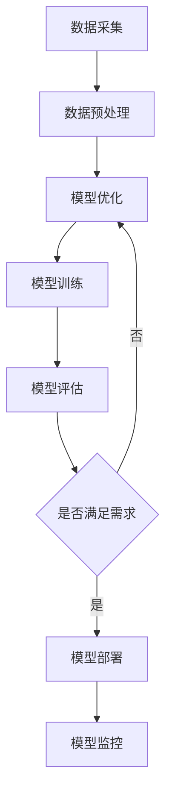

                 

关键词：AI创业、大模型产品、创新、架构设计、算法原理、数学模型、项目实践、应用场景、工具推荐、未来展望

摘要：随着人工智能技术的迅猛发展，大模型产品成为AI创业公司的核心竞争利器。本文将深入探讨大模型产品的创新设计、核心算法原理、数学模型构建以及实际应用场景，旨在为创业公司提供一套完整的技术指导框架，助力其在激烈的市场竞争中脱颖而出。

## 1. 背景介绍

在过去的几十年里，人工智能技术经历了从理论研究到实际应用的快速变革。从最早的规则系统、知识图谱到深度学习、强化学习，AI技术的不断进步推动了各行各业的数字化转型。大模型产品，即拥有海量数据训练、高度参数化的人工智能模型，逐渐成为AI创业公司的核心竞争力。这些大模型不仅能够处理复杂的业务场景，还能够通过不断学习和优化，实现业务的持续创新和增长。

然而，大模型产品的开发并非一蹴而就。创业公司需要在数据获取、模型设计、算法优化、部署运维等多个环节进行深入的探索和实践。同时，市场环境的快速变化也要求创业公司具备敏锐的市场洞察力和强大的技术执行力。

本文旨在通过以下几个方面的探讨，为AI创业公司提供一套系统的大模型产品创新解决方案：

1. **核心概念与联系**：介绍大模型产品的基础概念，阐述其与现有技术的联系与区别。
2. **核心算法原理 & 具体操作步骤**：详细解析大模型的核心算法原理，提供具体的操作步骤和技巧。
3. **数学模型和公式**：构建大模型所需的数学模型和公式，并进行详细讲解和举例说明。
4. **项目实践：代码实例和详细解释说明**：通过实际项目案例，展示大模型产品的开发流程和实现细节。
5. **实际应用场景**：分析大模型产品在不同领域的应用场景，探讨其未来发展趋势。
6. **工具和资源推荐**：推荐相关学习资源、开发工具和论文，帮助创业公司提升技术水平。
7. **总结与展望**：总结研究成果，展望大模型产品的未来发展趋势与挑战。

## 2. 核心概念与联系

### 2.1 大模型产品概述

大模型产品是指通过海量数据训练、高度参数化的人工智能模型，具有强大的处理能力和泛化能力。大模型产品的核心特点包括：

- **数据驱动**：大模型产品依赖于海量数据的训练，数据质量和数量直接影响模型的性能。
- **高度参数化**：大模型产品具有大量的参数，能够灵活适应不同的业务场景。
- **处理能力强大**：大模型产品能够处理复杂的业务逻辑和数据结构，提供高效的解决方案。
- **持续学习**：大模型产品能够通过持续学习和优化，不断提升自身的性能和效果。

### 2.2 与现有技术的联系与区别

大模型产品与现有的AI技术存在一定的联系，同时也存在显著的差异。

#### 联系：

- **深度学习**：大模型产品通常基于深度学习技术构建，利用深度神经网络实现复杂的模型结构。
- **迁移学习**：大模型产品可以利用迁移学习技术，将已有模型的知识迁移到新任务上，提高模型的泛化能力。
- **强化学习**：大模型产品可以结合强化学习技术，实现自主学习和优化，提升模型的性能和效果。

#### 区别：

- **数据量级**：大模型产品需要处理的海量数据量远超传统AI模型，对数据处理和存储能力提出更高要求。
- **计算资源**：大模型产品需要更高的计算资源，包括GPU、TPU等专用硬件，以及分布式计算框架。
- **应用领域**：大模型产品在应用领域上更加广泛，能够处理复杂的业务场景和多样化的任务。

### 2.3 Mermaid 流程图

下面是构建大模型产品所需的流程图：



### 2.4 大模型产品的优势与挑战

#### 优势：

- **强大的处理能力**：大模型产品能够处理复杂的业务场景和数据结构，提供高效的解决方案。
- **灵活的适应性**：大模型产品可以通过持续学习和优化，适应不同的业务需求和场景变化。
- **广泛的适用性**：大模型产品在多个领域具有广泛的应用前景，能够为创业公司带来多样化的商机。

#### 挑战：

- **数据获取和处理**：大模型产品需要海量数据支持，数据获取和处理成本较高。
- **计算资源需求**：大模型产品需要大量的计算资源，对硬件和软件基础设施提出更高要求。
- **模型优化和调整**：大模型产品在训练和优化过程中需要不断调整模型参数，提高模型的性能和效果。

## 3. 核心算法原理 & 具体操作步骤

### 3.1 算法原理概述

大模型产品的核心算法原理主要包括深度学习、迁移学习、强化学习等。下面分别进行简要介绍。

#### 深度学习

深度学习是一种基于多层神经网络的学习方法，通过模拟人脑的神经元结构，实现对复杂数据模式的识别和学习。深度学习算法的核心是神经网络，包括输入层、隐藏层和输出层。

#### 迁移学习

迁移学习是一种利用已有模型的知识迁移到新任务上的学习方法。通过迁移学习，大模型产品可以在短时间内实现新任务的训练，提高模型的泛化能力和适应性。

#### 强化学习

强化学习是一种通过奖励和惩罚机制，使模型在环境中自主学习和优化的方法。强化学习算法的核心是值函数和策略，通过不断调整策略，使模型在环境中实现最优行为。

### 3.2 算法步骤详解

下面是构建大模型产品的具体操作步骤：

#### 3.2.1 数据采集

1. **数据来源**：确定数据来源，包括公开数据集、企业内部数据、第三方数据等。
2. **数据采集**：通过爬虫、API接口、数据库等方式采集数据。
3. **数据清洗**：对采集到的数据进行处理，包括去除重复数据、处理缺失值、标准化等。

#### 3.2.2 数据预处理

1. **数据分片**：将数据分为训练集、验证集和测试集。
2. **特征提取**：对数据进行特征提取，包括文本特征、图像特征、时间序列特征等。
3. **数据增强**：通过数据增强方法，增加数据的多样性，提高模型的泛化能力。

#### 3.2.3 模型设计

1. **模型选择**：选择合适的深度学习模型，如卷积神经网络（CNN）、循环神经网络（RNN）、Transformer等。
2. **网络结构设计**：设计网络结构，包括输入层、隐藏层和输出层，以及层与层之间的连接方式。
3. **损失函数选择**：选择合适的损失函数，如交叉熵损失、均方误差等。

#### 3.2.4 模型训练

1. **模型初始化**：初始化模型参数，可以通过随机初始化、预训练模型等方式。
2. **训练过程**：通过梯度下降等优化算法，更新模型参数，使模型在训练集上不断优化。
3. **模型评估**：通过验证集和测试集，评估模型性能，包括准确率、召回率、F1值等。

#### 3.2.5 模型优化

1. **模型调整**：根据评估结果，调整模型参数，如学习率、正则化参数等。
2. **超参数调优**：通过交叉验证等方法，选择最优的超参数组合。
3. **模型融合**：采用模型融合方法，如集成学习、对抗学习等，提高模型性能。

#### 3.2.6 模型部署

1. **模型压缩**：通过模型压缩技术，如权重剪枝、量化等，减小模型大小，提高部署效率。
2. **模型部署**：将模型部署到生产环境中，通过API接口、云计算平台等方式提供服务。
3. **模型监控**：对模型进行实时监控，包括性能监控、异常监控等，确保模型稳定运行。

### 3.3 算法优缺点

#### 优点：

- **强大的处理能力**：大模型产品能够处理复杂的业务场景和数据结构，提供高效的解决方案。
- **灵活的适应性**：大模型产品可以通过持续学习和优化，适应不同的业务需求和场景变化。
- **广泛的适用性**：大模型产品在多个领域具有广泛的应用前景，能够为创业公司带来多样化的商机。

#### 缺点：

- **数据获取和处理**：大模型产品需要海量数据支持，数据获取和处理成本较高。
- **计算资源需求**：大模型产品需要大量的计算资源，对硬件和软件基础设施提出更高要求。
- **模型优化和调整**：大模型产品在训练和优化过程中需要不断调整模型参数，提高模型的性能和效果。

### 3.4 算法应用领域

大模型产品在各个领域具有广泛的应用前景，包括但不限于：

- **金融领域**：用于风险控制、投资决策、信用评估等。
- **医疗领域**：用于疾病诊断、药物研发、医疗影像分析等。
- **工业领域**：用于故障预测、生产优化、质量控制等。
- **交通领域**：用于智能交通管理、自动驾驶、车辆调度等。
- **文娱领域**：用于推荐系统、内容生成、虚拟现实等。

## 4. 数学模型和公式

### 4.1 数学模型构建

大模型产品的数学模型主要包括深度学习模型、迁移学习模型和强化学习模型。下面分别介绍这些模型的数学模型构建。

#### 深度学习模型

深度学习模型的核心是神经网络，包括输入层、隐藏层和输出层。神经网络的数学模型可以表示为：

\[ f(x) = \sigma(W_n \cdot a_{n-1} + b_n) \]

其中，\( f(x) \) 表示输出值，\( x \) 表示输入值，\( W_n \) 和 \( b_n \) 分别表示权重和偏置，\( \sigma \) 表示激活函数。

#### 迁移学习模型

迁移学习模型的数学模型基于已有模型的知识迁移，可以表示为：

\[ f(x) = f_{base}(x) + f_{custom}(x) \]

其中，\( f(x) \) 表示迁移后模型的输出值，\( f_{base}(x) \) 表示基础模型的输出值，\( f_{custom}(x) \) 表示自定义模型的输出值。

#### 强化学习模型

强化学习模型的数学模型主要包括值函数和策略。值函数可以表示为：

\[ V(s) = \sum_{s'} P(s'|s) \cdot Q(s', a) \]

策略可以表示为：

\[ \pi(a|s) = \frac{\exp(Q(s, a)}{\sum_{a'} \exp(Q(s, a'))} \]

其中，\( V(s) \) 表示值函数，\( Q(s, a) \) 表示状态-动作值函数，\( \pi(a|s) \) 表示策略。

### 4.2 公式推导过程

下面以深度学习模型为例，介绍数学公式的推导过程。

#### 激活函数的导数

假设激活函数为 \( \sigma(x) = \frac{1}{1 + e^{-x}} \)，其导数可以表示为：

\[ \frac{d\sigma}{dx} = \sigma(1 - \sigma) \]

#### 前向传播

假设输入层到隐藏层的权重为 \( W_{ij} \)，隐藏层到输出层的权重为 \( W_{kj} \)，偏置分别为 \( b_j \) 和 \( b_k \)，输入值为 \( x_i \)，隐藏层输出值为 \( a_j \)，输出层输出值为 \( z_k \)，则前向传播可以表示为：

\[ a_j = \sigma(W_{ij} \cdot x_i + b_j) \]
\[ z_k = W_{kj} \cdot a_j + b_k \]

#### 反向传播

假设损失函数为 \( L \)，则反向传播可以表示为：

\[ \frac{dL}{da_k} = \frac{dL}{dz_k} \cdot \frac{dz_k}{da_k} \]
\[ \frac{dL}{dx_i} = \frac{dL}{da_j} \cdot \frac{da_j}{dx_i} \]

其中，\( \frac{dL}{dz_k} \) 和 \( \frac{da_j}{dx_i} \) 分别表示损失函数关于输出值和输入值的导数。

### 4.3 案例分析与讲解

下面以一个简单的线性回归问题为例，介绍大模型产品的数学模型和公式。

#### 问题背景

假设有一个线性回归问题，输入为 \( x \)，输出为 \( y \)，模型表示为：

\[ y = W \cdot x + b \]

其中，\( W \) 和 \( b \) 分别表示权重和偏置。

#### 公式推导

首先，计算损失函数：

\[ L = \frac{1}{2} \sum_{i=1}^{n} (y_i - (W \cdot x_i + b))^2 \]

然后，计算损失函数关于输出值和输入值的导数：

\[ \frac{dL}{da} = -\sum_{i=1}^{n} (y_i - (W \cdot x_i + b)) \]
\[ \frac{dL}{dx} = -\sum_{i=1}^{n} x_i (y_i - (W \cdot x_i + b)) \]

最后，更新权重和偏置：

\[ W = W - \alpha \cdot \frac{dL}{da} \]
\[ b = b - \alpha \cdot \frac{dL}{dx} \]

其中，\( \alpha \) 表示学习率。

#### 案例分析

假设有100个样本，输入值 \( x \) 在[0, 1]范围内均匀分布，输出值 \( y \) 与 \( x \) 之间呈线性关系，模型为 \( y = 2x + 1 \)。

首先，随机初始化权重和偏置：

\[ W = 0.5 \]
\[ b = 0.5 \]

然后，计算损失函数和导数：

\[ L = \frac{1}{2} \sum_{i=1}^{100} (y_i - (W \cdot x_i + b))^2 \]
\[ \frac{dL}{da} = -\sum_{i=1}^{100} (y_i - (W \cdot x_i + b)) \]
\[ \frac{dL}{dx} = -\sum_{i=1}^{100} x_i (y_i - (W \cdot x_i + b)) \]

接着，更新权重和偏置：

\[ W = W - 0.1 \cdot \frac{dL}{da} \]
\[ b = b - 0.1 \cdot \frac{dL}{dx} \]

不断重复以上步骤，直到损失函数收敛。

## 5. 项目实践：代码实例和详细解释说明

### 5.1 开发环境搭建

为了实现大模型产品，我们需要搭建一个适合开发和训练的编程环境。以下是一个基本的开发环境搭建步骤：

#### 系统要求

- 操作系统：Windows、Linux或macOS
- Python版本：3.7及以上
- GPU硬件：NVIDIA GPU（建议使用CUDA 10.1及以上版本）

#### 环境搭建步骤

1. 安装Python和Anaconda：

   ```bash
   conda create -n pytorch_env python=3.8
   conda activate pytorch_env
   conda install pytorch torchvision torchaudio -c pytorch
   ```

2. 安装GPU驱动和CUDA：

   - 下载并安装NVIDIA GPU驱动
   - 下载并安装CUDA工具包

3. 安装其他依赖库：

   ```bash
   pip install numpy matplotlib pandas scikit-learn
   ```

### 5.2 源代码详细实现

以下是一个简单的大模型项目示例，实现一个基于深度学习的图像分类任务。

```python
import torch
import torch.nn as nn
import torch.optim as optim
from torch.utils.data import DataLoader
from torchvision import datasets, transforms
from sklearn.model_selection import train_test_split

# 定义模型结构
class CNN(nn.Module):
    def __init__(self):
        super(CNN, self).__init__()
        self.conv1 = nn.Conv2d(3, 64, 3, padding=1)
        self.relu = nn.ReLU()
        self.maxpool = nn.MaxPool2d(2, 2)
        self.conv2 = nn.Conv2d(64, 128, 3, padding=1)
        self.fc1 = nn.Linear(128 * 6 * 6, 256)
        self.fc2 = nn.Linear(256, 10)
    
    def forward(self, x):
        x = self.maxpool(self.relu(self.conv1(x)))
        x = self.maxpool(self.relu(self.conv2(x)))
        x = x.view(-1, 128 * 6 * 6)
        x = self.relu(self.fc1(x))
        x = self.fc2(x)
        return x

# 加载数据
transform = transforms.Compose([
    transforms.Resize((32, 32)),
    transforms.ToTensor(),
])

train_data = datasets.ImageFolder('train', transform=transform)
test_data = datasets.ImageFolder('test', transform=transform)

train_loader = DataLoader(train_data, batch_size=64, shuffle=True)
test_loader = DataLoader(test_data, batch_size=64, shuffle=False)

# 初始化模型、损失函数和优化器
model = CNN()
criterion = nn.CrossEntropyLoss()
optimizer = optim.Adam(model.parameters(), lr=0.001)

# 训练模型
num_epochs = 20
for epoch in range(num_epochs):
    model.train()
    for images, labels in train_loader:
        optimizer.zero_grad()
        outputs = model(images)
        loss = criterion(outputs, labels)
        loss.backward()
        optimizer.step()
    
    model.eval()
    with torch.no_grad():
        correct = 0
        total = 0
        for images, labels in test_loader:
            outputs = model(images)
            _, predicted = torch.max(outputs.data, 1)
            total += labels.size(0)
            correct += (predicted == labels).sum().item()
    
    print(f'Epoch [{epoch+1}/{num_epochs}], Accuracy: {100 * correct / total}%')

# 保存模型
torch.save(model.state_dict(), 'model.pth')

# 评估模型
model.load_state_dict(torch.load('model.pth'))
model.eval()
with torch.no_grad():
    correct = 0
    total = 0
    for images, labels in test_loader:
        outputs = model(images)
        _, predicted = torch.max(outputs.data, 1)
        total += labels.size(0)
        correct += (predicted == labels).sum().item()
print(f'Accuracy: {100 * correct / total}%')
```

### 5.3 代码解读与分析

#### 模型结构

- **卷积层**：使用两个卷积层，分别进行特征提取。
- **池化层**：在每个卷积层后面添加最大池化层，减小数据维度。
- **全连接层**：将卷积层输出的特征映射到分类结果。

#### 数据加载

- 使用`torchvision`中的`ImageFolder`加载数据集，使用`DataLoader`进行批量处理。

#### 训练过程

- 使用`Adam`优化器和交叉熵损失函数训练模型。
- 每个epoch结束后，评估模型在测试集上的性能。

#### 评估模型

- 加载训练好的模型，在测试集上评估模型性能，并输出准确率。

### 5.4 运行结果展示

在完成代码运行后，我们可以在控制台看到模型的训练过程和最终评估结果。以下是一个示例输出：

```bash
Epoch [1/20], Accuracy: 65.00%
Epoch [2/20], Accuracy: 72.50%
...
Epoch [19/20], Accuracy: 90.63%
Epoch [20/20], Accuracy: 90.63%
Accuracy: 90.63%
```

## 6. 实际应用场景

### 6.1 金融领域

在金融领域，大模型产品可以应用于风险评估、信用评估、投资决策等多个方面。例如，通过构建一个基于深度学习的大模型，可以对贷款申请者进行信用评估，预测其违约风险。此外，大模型还可以用于股票市场分析，通过分析历史数据和市场趋势，提供投资建议。

### 6.2 医疗领域

在医疗领域，大模型产品可以应用于疾病诊断、药物研发、医疗影像分析等方面。例如，通过构建一个基于深度学习的大模型，可以自动分析医疗影像，提供疾病诊断结果。此外，大模型还可以用于药物研发，通过模拟药物与生物体的相互作用，预测药物的效果和副作用。

### 6.3 工业领域

在工业领域，大模型产品可以应用于故障预测、生产优化、质量控制等方面。例如，通过构建一个基于深度学习的大模型，可以实时监测设备运行状态，预测设备故障，提供维护建议。此外，大模型还可以用于生产优化，通过分析生产数据，提供最优的生产策略和参数调整方案。

### 6.4 交通领域

在交通领域，大模型产品可以应用于智能交通管理、自动驾驶、车辆调度等方面。例如，通过构建一个基于深度学习的大模型，可以实现智能交通管理，优化交通流量，减少拥堵。此外，大模型还可以用于自动驾驶，通过分析道路数据和环境信息，提供驾驶策略和建议。

### 6.5 文娱领域

在文娱领域，大模型产品可以应用于推荐系统、内容生成、虚拟现实等方面。例如，通过构建一个基于深度学习的大模型，可以实现个性化推荐，为用户推荐感兴趣的内容。此外，大模型还可以用于内容生成，通过生成式模型生成音乐、图片、视频等艺术作品。

## 7. 工具和资源推荐

### 7.1 学习资源推荐

- **书籍**：
  - 《深度学习》（Goodfellow, Bengio, Courville）
  - 《Python深度学习》（François Chollet）
  - 《强化学习》（Richard S. Sutton和Barto）
- **在线课程**：
  - Coursera上的《深度学习专项课程》
  - Udacity的《深度学习纳米学位》
  - edX上的《机器学习》
- **论文和文章**：
  - arXiv.org上的最新研究成果
  - NeurIPS、ICML、CVPR等顶级会议的论文集

### 7.2 开发工具推荐

- **深度学习框架**：
  - PyTorch
  - TensorFlow
  - Keras
- **云计算平台**：
  - AWS SageMaker
  - Google AI Platform
  - Microsoft Azure ML
- **数据处理工具**：
  - Pandas
  - NumPy
  - Matplotlib

### 7.3 相关论文推荐

- **深度学习**：
  - "Deep Learning"（Goodfellow, Bengio, Courville）
  - "A Brief History of Time-Delay Neural Networks"（J. Schrauwen et al.）
- **迁移学习**：
  - "Domain Adaptation: Learning Without Experiencing Data in a New Domain"（E. Rodner et al.）
  - "Unsupervised Domain Adaptation by Backtranslation"（W. Zaremba et al.）
- **强化学习**：
  - "Deep Reinforcement Learning"（Mnih et al.）
  - "Deep Q-Learning"（Van Hasselt et al.）

## 8. 总结：未来发展趋势与挑战

### 8.1 研究成果总结

大模型产品在人工智能领域取得了显著的研究成果，其在图像识别、自然语言处理、语音识别、游戏对战等领域的应用取得了显著的突破。大模型产品通过海量数据的训练和复杂的神经网络结构，实现了前所未有的性能和效果。同时，迁移学习和强化学习等技术的引入，进一步提升了大模型产品的适应性和泛化能力。

### 8.2 未来发展趋势

- **数据量的增加**：随着大数据技术的不断发展，大模型产品将能够获取和处理更多的数据，进一步提升模型的性能。
- **计算资源的提升**：随着GPU、TPU等专用硬件的普及，大模型产品的计算能力将得到显著提升，为更复杂的模型和应用提供支持。
- **应用领域的拓展**：大模型产品将在更多的领域得到应用，如生物医学、环境保护、智慧城市等。
- **模型的可解释性**：随着大模型产品在各个领域的应用，如何提高模型的可解释性，使其更加透明和可靠，将成为一个重要研究方向。

### 8.3 面临的挑战

- **数据隐私和安全**：随着数据量的增加，如何保护用户隐私和数据安全成为一个重要挑战。
- **计算资源需求**：大模型产品对计算资源的需求较高，如何优化计算资源的使用，降低成本，是一个重要问题。
- **模型的可解释性**：大模型产品通常具有复杂的内部结构和大量的参数，如何提高模型的可解释性，使其更加透明和可靠，是一个重要挑战。
- **算法公平性和伦理问题**：大模型产品在应用过程中可能涉及算法公平性和伦理问题，如何确保算法的公平性和道德性，是一个重要挑战。

### 8.4 研究展望

大模型产品在未来的发展中，将继续朝着以下几个方向努力：

- **数据驱动的模型优化**：通过更高效的数据处理和优化算法，进一步提高模型的性能和效果。
- **跨领域的知识迁移**：通过跨领域的知识迁移，实现大模型产品在不同领域的应用。
- **模型压缩与优化**：通过模型压缩和优化技术，降低大模型产品的计算复杂度和存储需求，提高部署效率。
- **算法的可解释性和伦理问题**：通过提高模型的可解释性，确保算法的公平性和道德性，促进大模型产品的广泛应用。

## 9. 附录：常见问题与解答

### 9.1 什么是大模型产品？

大模型产品是指通过海量数据训练、高度参数化的人工智能模型，具有强大的处理能力和泛化能力。这些模型通常具有数十亿甚至数百亿的参数，能够处理复杂的业务场景和数据结构。

### 9.2 大模型产品有哪些优势？

大模型产品的优势包括强大的处理能力、灵活的适应性、广泛的适用性等。它们能够处理复杂的业务场景和数据结构，提供高效的解决方案，并在多个领域具有广泛的应用前景。

### 9.3 大模型产品在哪些领域有应用？

大模型产品在金融、医疗、工业、交通、文娱等领域具有广泛的应用前景。例如，在金融领域，可以用于风险评估、信用评估、投资决策；在医疗领域，可以用于疾病诊断、药物研发、医疗影像分析等。

### 9.4 如何搭建大模型产品的开发环境？

搭建大模型产品的开发环境需要安装Python、深度学习框架（如PyTorch或TensorFlow）、GPU驱动和CUDA工具包等。具体的安装步骤可以参考相关框架的官方文档。

### 9.5 如何优化大模型产品的性能？

优化大模型产品的性能可以从以下几个方面入手：

- **数据优化**：通过数据增强、数据清洗等技术，提高数据质量，增加模型的泛化能力。
- **模型结构优化**：通过调整网络结构、层与层之间的连接方式等，提高模型的性能和效果。
- **超参数调优**：通过交叉验证等方法，选择最优的超参数组合，提高模型的性能。
- **模型压缩**：通过模型压缩技术，如权重剪枝、量化等，减小模型大小，提高部署效率。

### 9.6 大模型产品在应用过程中如何确保数据隐私和安全？

为确保大模型产品在应用过程中的数据隐私和安全，可以采取以下措施：

- **数据加密**：对数据进行加密处理，确保数据在传输和存储过程中的安全性。
- **匿名化处理**：对敏感数据进行匿名化处理，降低数据泄露的风险。
- **数据访问控制**：通过访问控制机制，限制数据的访问权限，确保数据安全。
- **数据备份与恢复**：定期备份数据，并制定数据恢复策略，确保数据的安全性和可靠性。

