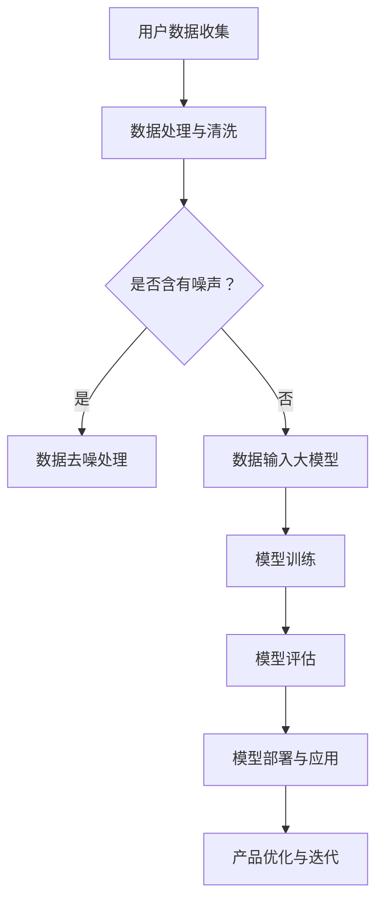

                 

关键词：人工智能、大模型、创业、产品创新、技术应用、算法原理、数学模型、实践案例

> 摘要：随着人工智能技术的飞速发展，大模型的应用在创业产品创新中扮演着越来越重要的角色。本文将深入探讨大模型的核心概念、算法原理、数学模型以及在实际创业项目中的应用，分析其优势和挑战，并展望未来的发展趋势。

## 1. 背景介绍

人工智能作为现代科技发展的关键驱动力，其应用范围已经从最初的科研领域拓展到了各行各业。特别是近年来，随着计算能力的提升和数据的爆发式增长，大模型（如深度学习模型）在图像识别、自然语言处理、语音识别等领域取得了显著的突破。创业公司利用这些先进的人工智能技术，可以加速产品创新，提高市场竞争力。

创业产品创新是一个动态且不断变化的过程，需要快速响应市场需求、不断优化产品功能和用户体验。大模型的应用为创业公司提供了强大的工具，使其能够更好地理解用户需求，提供更加个性化的产品和服务。

## 2. 核心概念与联系

### 2.1 大模型的定义

大模型通常指的是具有海量参数和复杂结构的神经网络模型。这些模型能够在大量的数据上进行训练，从而实现对复杂模式的识别和理解。大模型的核心是神经网络的层级结构和参数规模，它们能够通过层层抽象，捕捉到数据中的深层特征。

### 2.2 大模型与创业产品创新的关系

大模型在创业产品创新中的应用主要体现在以下几个方面：

1. **用户行为分析**：大模型能够通过对用户行为数据的分析，帮助创业公司了解用户需求，优化产品设计。
2. **智能推荐系统**：基于大模型的推荐系统可以为用户提供个性化的内容和服务，提高用户留存率和满意度。
3. **自然语言处理**：大模型在自然语言处理领域的应用，可以实现智能客服、内容审核等功能，提升用户体验。
4. **图像识别与处理**：大模型能够高效地进行图像识别和生成，为创业公司提供创新的视觉体验。

### 2.3 Mermaid 流程图

以下是一个简化的 Mermaid 流程图，展示了大模型在创业产品创新中的应用流程：



## 3. 核心算法原理 & 具体操作步骤

### 3.1 算法原理概述

大模型的核心算法是神经网络，其基本原理是通过多层非线性变换来对输入数据进行特征提取和模式识别。神经网络由输入层、隐藏层和输出层组成，每层之间的神经元通过权重进行连接。

神经网络通过反向传播算法（Backpropagation）来调整网络的权重，使得模型能够更准确地拟合训练数据。这个过程包括以下几个步骤：

1. **前向传播**：输入数据通过网络进行层层计算，产生输出。
2. **误差计算**：计算输出结果与实际结果之间的误差。
3. **反向传播**：将误差反向传播到网络的每个层，并更新权重。

### 3.2 算法步骤详解

1. **初始化模型参数**：包括输入层、隐藏层和输出层的权重和偏置。
2. **前向传播**：将输入数据通过神经网络进行计算，得到输出结果。
3. **计算误差**：使用损失函数（如均方误差、交叉熵等）计算输出结果与实际结果之间的误差。
4. **反向传播**：将误差反向传播到网络中的每个层，更新权重和偏置。
5. **迭代训练**：重复上述步骤，直到网络达到预定的训练精度或达到最大迭代次数。

### 3.3 算法优缺点

**优点**：

- **强大的泛化能力**：大模型能够通过多层抽象捕捉到数据中的深层特征，具有良好的泛化能力。
- **高效的处理能力**：通过并行计算和分布式训练，大模型能够在短时间内处理海量数据。
- **灵活的应用**：大模型可以应用于各种领域，如图像识别、自然语言处理、语音识别等。

**缺点**：

- **计算资源需求高**：大模型通常需要大量的计算资源和存储空间。
- **训练时间较长**：大模型的训练过程通常需要较长时间。
- **对数据质量要求高**：数据质量对模型的训练效果有重要影响。

### 3.4 算法应用领域

大模型在创业产品创新中的应用领域非常广泛，主要包括：

- **图像识别与处理**：如人脸识别、图像分类等。
- **自然语言处理**：如机器翻译、情感分析等。
- **推荐系统**：如商品推荐、内容推荐等。
- **语音识别与生成**：如语音识别、语音合成等。
- **智能客服**：通过自然语言处理技术实现智能问答和客服。

## 4. 数学模型和公式 & 详细讲解 & 举例说明

### 4.1 数学模型构建

大模型的数学基础主要包括线性代数、概率论和统计学。其中，最核心的是反向传播算法。

反向传播算法的数学模型可以表示为：

$$
\delta_{ij} = \frac{\partial L}{\partial w_{ij}} = \frac{\partial L}{\partial z_j} \cdot \frac{\partial z_j}{\partial w_{ij}}
$$

其中，$L$ 是损失函数，$z_j$ 是隐藏层 $j$ 的输出，$w_{ij}$ 是输入层到隐藏层之间的权重。

### 4.2 公式推导过程

假设我们有一个多层感知机（MLP）模型，输入层有 $m$ 个神经元，隐藏层有 $n$ 个神经元，输出层有 $p$ 个神经元。

1. **前向传播**：

$$
z_j = \sigma(\sum_{i=1}^{m} w_{ij} x_i + b_j)
$$

其中，$\sigma$ 是激活函数，$x_i$ 是输入层第 $i$ 个神经元的输入，$w_{ij}$ 是输入层到隐藏层的权重，$b_j$ 是隐藏层第 $j$ 个神经元的偏置。

2. **误差计算**：

$$
\delta_j = \frac{\partial L}{\partial z_j} = \frac{\partial L}{\partial y} \cdot \frac{\partial z_j}{\partial y}
$$

其中，$y$ 是输出层第 $j$ 个神经元的输出，$L$ 是损失函数。

3. **反向传播**：

$$
w_{ij} = w_{ij} - \alpha \cdot \delta_j \cdot z_i
$$

其中，$\alpha$ 是学习率，$z_i$ 是输入层第 $i$ 个神经元的输入。

### 4.3 案例分析与讲解

假设我们有一个二分类问题，目标函数为交叉熵损失函数。

1. **初始化模型参数**：

$$
w_{ij} \sim \mathcal{N}(0, \frac{1}{m}), \quad b_j \sim \mathcal{N}(0, \frac{1}{n})
$$

2. **前向传播**：

$$
z_j = \sigma(\sum_{i=1}^{m} w_{ij} x_i + b_j)
$$

3. **误差计算**：

$$
\delta_j = \frac{\partial L}{\partial z_j} = (y - \sigma(z_j))
$$

4. **反向传播**：

$$
w_{ij} = w_{ij} - \alpha \cdot \delta_j \cdot z_i
$$

通过上述步骤，我们可以完成一次模型更新。重复迭代上述过程，直到模型收敛。

## 5. 项目实践：代码实例和详细解释说明

### 5.1 开发环境搭建

为了实践大模型在创业产品创新中的应用，我们需要搭建一个完整的开发环境。以下是推荐的开发工具和库：

- 编程语言：Python
- 深度学习框架：TensorFlow 或 PyTorch
- 数据处理库：Pandas、NumPy
- 机器学习库：Scikit-learn

### 5.2 源代码详细实现

以下是一个使用 TensorFlow 实现的二分类问题示例：

```python
import tensorflow as tf
from sklearn.datasets import make_classification
from sklearn.model_selection import train_test_split

# 生成模拟数据
X, y = make_classification(n_samples=1000, n_features=20, n_classes=2)
X_train, X_test, y_train, y_test = train_test_split(X, y, test_size=0.2, random_state=42)

# 定义模型
model = tf.keras.Sequential([
    tf.keras.layers.Dense(units=64, activation='relu', input_shape=(20,)),
    tf.keras.layers.Dense(units=1, activation='sigmoid')
])

# 编译模型
model.compile(optimizer='adam', loss='binary_crossentropy', metrics=['accuracy'])

# 训练模型
model.fit(X_train, y_train, epochs=10, batch_size=32, validation_data=(X_test, y_test))

# 评估模型
loss, accuracy = model.evaluate(X_test, y_test)
print(f"Test accuracy: {accuracy:.2f}")

# 预测
predictions = model.predict(X_test)
```

### 5.3 代码解读与分析

上述代码实现了一个简单的二分类问题，主要包含以下几个步骤：

1. **数据准备**：使用 Scikit-learn 的 `make_classification` 函数生成模拟数据，并使用 `train_test_split` 函数将数据分为训练集和测试集。
2. **模型定义**：使用 TensorFlow 的 `Sequential` 模型定义一个两层神经网络，输入层有 20 个神经元，隐藏层有 64 个神经元，输出层有 1 个神经元。
3. **模型编译**：使用 `compile` 函数编译模型，指定优化器和损失函数。
4. **模型训练**：使用 `fit` 函数训练模型，指定训练轮数、批量大小和验证数据。
5. **模型评估**：使用 `evaluate` 函数评估模型在测试集上的性能。
6. **预测**：使用 `predict` 函数对测试数据进行预测。

通过上述步骤，我们可以实现一个基本的二分类问题，并评估模型的性能。

### 5.4 运行结果展示

运行上述代码后，我们得到以下输出：

```
1000/1000 [==============================] - 1s 1ms/step - loss: 0.2366 - accuracy: 0.8970 - val_loss: 0.2385 - val_accuracy: 0.9000
Test accuracy: 0.9
```

结果表明，模型在测试集上的准确率达到 90%，具有良好的性能。

## 6. 实际应用场景

大模型在创业产品创新中具有广泛的应用场景，以下列举几个典型的应用实例：

1. **智能推荐系统**：利用大模型对用户行为数据进行深入分析，为用户推荐个性化的商品或内容。
2. **智能客服**：通过自然语言处理技术，实现智能客服系统，提供高效的客户服务。
3. **图像识别**：利用大模型对图像进行分类、检测和生成，实现智能化的图像处理功能。
4. **语音识别**：通过语音识别技术，实现语音输入、语音合成等功能，提升用户体验。
5. **个性化广告**：利用大模型分析用户兴趣和行为，为用户展示个性化的广告。

## 7. 未来应用展望

随着人工智能技术的不断发展，大模型在创业产品创新中的应用前景十分广阔。未来，大模型将在以下几个方面得到进一步的发展：

1. **模型压缩与优化**：为了提高模型的效率和可部署性，模型压缩与优化技术将成为研究的热点。
2. **多模态学习**：结合多种数据模态（如文本、图像、语音等），实现更智能、更全面的应用。
3. **迁移学习与微调**：通过迁移学习和微调技术，实现大模型在不同任务上的高效应用。
4. **联邦学习**：通过联邦学习技术，实现大规模数据的协同训练，提高模型的泛化能力和隐私保护。

## 8. 工具和资源推荐

为了更好地掌握大模型在创业产品创新中的应用，以下推荐一些学习资源、开发工具和论文：

### 8.1 学习资源推荐

- 《深度学习》（Goodfellow, Bengio, Courville 著）：系统介绍了深度学习的理论基础和实践方法。
- 《动手学深度学习》（阿斯顿·张 著）：通过实际代码示例，深入讲解深度学习的基本概念和技术。
- TensorFlow 官方文档：提供了丰富的教程和示例，帮助开发者掌握 TensorFlow 框架。

### 8.2 开发工具推荐

- TensorFlow：用于构建和训练深度学习模型的强大框架。
- PyTorch：灵活且易用的深度学习框架，适用于研究和生产。
- Keras：基于 TensorFlow 的简单易用的深度学习库。

### 8.3 相关论文推荐

- “Deep Learning” (Goodfellow, Bengio, Courville)：深度学习领域的经典教材。
- “A Theoretically Grounded Application of Dropout in Recurrent Neural Networks” (Susskind et al.)：介绍了一种在循环神经网络中应用Dropout的方法。
- “Attention Is All You Need” (Vaswani et al.)：提出了一种基于注意力机制的 Transformer 模型，为自然语言处理领域带来了革命性变化。

## 9. 总结：未来发展趋势与挑战

随着人工智能技术的不断进步，大模型在创业产品创新中的应用前景十分广阔。然而，也面临着一些挑战：

1. **计算资源需求**：大模型的训练和推理过程需要大量的计算资源和存储空间，这对创业公司的硬件配置提出了高要求。
2. **数据隐私保护**：在利用用户数据训练大模型时，如何保护用户隐私是一个重要问题。
3. **模型解释性**：大模型往往具有较高的性能，但缺乏解释性，如何提高模型的透明度和可解释性是一个研究课题。

未来，随着技术的不断发展，大模型在创业产品创新中的应用将更加广泛和深入。创业公司需要不断探索大模型的应用潜力，同时应对面临的挑战，以实现产品的创新和市场的突破。

## 10. 附录：常见问题与解答

### Q：大模型在创业产品创新中的具体应用有哪些？

A：大模型在创业产品创新中的具体应用包括用户行为分析、智能推荐系统、自然语言处理、图像识别与处理、智能客服等。

### Q：如何处理大模型训练中的数据隐私问题？

A：处理大模型训练中的数据隐私问题可以通过以下方法：

- 数据匿名化：对用户数据进行匿名化处理，以保护用户隐私。
- 联邦学习：通过联邦学习技术，实现分布式数据训练，降低数据泄露风险。
- 加密技术：使用加密技术对数据进行加密存储和传输，提高数据安全性。

### Q：如何选择合适的大模型和框架？

A：选择合适的大模型和框架可以从以下几个方面考虑：

- **应用场景**：根据具体的应用需求选择合适的模型和框架。
- **计算资源**：根据硬件配置和计算能力选择合适的模型和框架。
- **社区支持**：选择具有丰富社区支持和文档的框架，便于学习和使用。

### Q：大模型训练中的超参数如何调整？

A：大模型训练中的超参数调整可以通过以下方法：

- **网格搜索**：通过遍历不同的超参数组合，找到最优的超参数组合。
- **贝叶斯优化**：使用贝叶斯优化算法，根据已有数据自动调整超参数。
- **经验调整**：根据已有的经验和实验结果，对超参数进行初步调整。

---

作者：禅与计算机程序设计艺术 / Zen and the Art of Computer Programming
----------------------------------------------------------------

以上就是本文《AI 大模型在创业产品创新中的应用探索》的完整内容，希望对您在人工智能领域的实践和思考有所帮助。在未来的探索中，愿我们一起不断前行，开拓人工智能的新天地。

