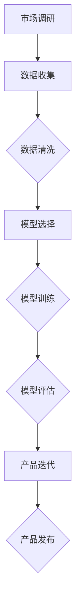

                 

关键词：人工智能、大模型、创业产品、开发应用、技术策略

> 摘要：本文将探讨人工智能（AI）大模型在创业产品开发中的创造性应用。通过分析AI大模型的核心概念、原理及其在产品开发中的角色，我们将展示如何利用这些模型加速创新，降低开发成本，并提高产品质量。本文还将提供实际案例，探讨AI大模型在未来产品开发中的潜力与挑战。

## 1. 背景介绍

随着互联网和大数据技术的快速发展，人工智能（AI）已经成为现代社会的重要驱动力。AI技术的广泛应用推动了各行各业的创新和变革，尤其是在创业产品开发领域。AI大模型，如深度学习神经网络、生成对抗网络（GAN）和变分自编码器（VAE）等，通过处理海量数据，能够自动学习复杂的模式和规律，从而在图像识别、自然语言处理、推荐系统等多个领域取得显著成果。

创业公司在资源有限的情况下，如何通过AI大模型提升产品开发效率、降低风险并实现商业成功，成为当前研究的热点。本文将结合具体案例，探讨AI大模型在创业产品开发中的创造性应用，旨在为创业者提供技术指导和实践参考。

## 2. 核心概念与联系

### 2.1. 人工智能大模型概述

人工智能大模型是指那些能够处理海量数据、自动学习和优化算法的复杂神经网络。这些模型通常具有数十亿甚至数万亿个参数，能够通过深度学习算法从数据中学习并提取有用的信息。常见的大模型包括：

- **深度神经网络（DNN）**：通过多层神经网络对数据进行特征提取和分类。
- **卷积神经网络（CNN）**：特别适用于图像识别和图像处理。
- **递归神经网络（RNN）**：能够处理序列数据，如自然语言文本。
- **生成对抗网络（GAN）**：通过生成器和判别器的对抗训练，生成高质量的图像和音频。

### 2.2. 人工智能大模型在创业产品开发中的应用

人工智能大模型在创业产品开发中具有以下关键作用：

- **数据驱动创新**：大模型能够从大量数据中学习，为产品开发提供新的思路和灵感。
- **自动化和优化**：通过自动化算法，降低手动开发的成本和复杂度，提高开发效率。
- **个性化体验**：大模型能够处理个性化数据，为用户打造定制化的产品体验。

### 2.3. Mermaid 流程图

以下是一个简单的Mermaid流程图，展示AI大模型在创业产品开发中的基本流程：



## 3. 核心算法原理 & 具体操作步骤

### 3.1. 算法原理概述

AI大模型的核心原理基于深度学习和神经网络。深度学习通过多层神经网络对数据进行特征提取和模式识别，从而实现复杂任务的自动化。以下是几个关键的深度学习算法：

- **反向传播算法（Backpropagation）**：用于训练神经网络，通过误差反向传播更新网络参数。
- **卷积神经网络（CNN）**：用于图像识别和图像处理，通过卷积操作提取图像特征。
- **递归神经网络（RNN）**：用于处理序列数据，如自然语言文本，通过递归结构保存历史信息。

### 3.2. 算法步骤详解

#### 3.2.1. 数据收集与预处理

1. **数据收集**：从互联网、数据库和其他来源收集相关数据。
2. **数据清洗**：处理缺失值、噪声和异常值，确保数据质量。

#### 3.2.2. 模型选择

1. **选择合适的模型**：根据任务需求选择合适的深度学习模型，如DNN、CNN、RNN等。
2. **模型配置**：设置网络结构、激活函数、学习率等参数。

#### 3.2.3. 模型训练

1. **数据分割**：将数据集分割为训练集、验证集和测试集。
2. **训练过程**：使用训练集数据训练模型，通过反向传播算法优化模型参数。
3. **验证与调优**：使用验证集评估模型性能，调整模型参数。

#### 3.2.4. 模型评估

1. **评估指标**：选择适当的评估指标，如准确率、召回率、F1分数等。
2. **模型测试**：使用测试集评估模型性能。

### 3.3. 算法优缺点

#### 3.3.1. 优点

- **高效处理海量数据**：大模型能够快速处理大量数据，提高数据处理效率。
- **自动特征提取**：大模型能够自动提取数据中的关键特征，减少人工干预。
- **泛化能力**：通过大规模数据训练，大模型具有良好的泛化能力，适用于不同领域。

#### 3.3.2. 缺点

- **计算资源需求大**：大模型通常需要大量的计算资源和时间进行训练。
- **数据隐私问题**：大模型对数据的依赖性可能导致数据隐私泄露。

### 3.4. 算法应用领域

AI大模型在创业产品开发中具有广泛的应用领域，包括但不限于：

- **图像识别与处理**：应用于人脸识别、图像分类、图像增强等。
- **自然语言处理**：应用于文本分类、情感分析、机器翻译等。
- **推荐系统**：应用于个性化推荐、商品推荐等。

## 4. 数学模型和公式 & 详细讲解 & 举例说明

### 4.1. 数学模型构建

深度学习中的数学模型主要基于以下公式：

- **损失函数**：用于衡量模型预测值与真实值之间的差距，如均方误差（MSE）和交叉熵（Cross-Entropy）。
- **梯度下降**：用于优化模型参数，通过计算损失函数关于参数的梯度，更新模型参数。
- **反向传播**：用于计算损失函数关于输入数据的梯度，从而实现误差的反向传播。

### 4.2. 公式推导过程

以均方误差（MSE）为例，其公式为：

$$
MSE = \frac{1}{n}\sum_{i=1}^{n}(y_i - \hat{y}_i)^2
$$

其中，$y_i$为真实值，$\hat{y}_i$为模型预测值，$n$为样本数量。

### 4.3. 案例分析与讲解

以下是一个简单的案例，展示如何使用深度神经网络进行图像分类：

1. **数据准备**：准备一个包含1000个图像的数据集，每个图像被标注为10类中的一个。
2. **模型构建**：构建一个简单的卷积神经网络，包括卷积层、池化层和全连接层。
3. **模型训练**：使用训练集数据训练模型，通过反向传播算法优化模型参数。
4. **模型评估**：使用验证集评估模型性能，调整模型参数。
5. **模型测试**：使用测试集评估模型性能。

通过上述步骤，我们可以构建一个图像分类模型，实现对未知图像的自动分类。

## 5. 项目实践：代码实例和详细解释说明

### 5.1. 开发环境搭建

为了实现AI大模型在创业产品开发中的创造性应用，我们需要搭建一个合适的开发环境。以下是基本的开发环境搭建步骤：

1. **硬件配置**：配置高性能的计算服务器，确保有足够的计算资源。
2. **软件安装**：安装Python、TensorFlow等必要的开发工具。
3. **数据准备**：收集和整理创业产品开发所需的数据集。

### 5.2. 源代码详细实现

以下是一个简单的Python代码示例，展示如何使用TensorFlow构建一个图像分类模型：

```python
import tensorflow as tf
from tensorflow.keras import layers

# 数据预处理
(x_train, y_train), (x_test, y_test) = tf.keras.datasets.cifar10.load_data()
x_train, x_test = x_train / 255.0, x_test / 255.0

# 模型构建
model = tf.keras.Sequential([
    layers.Conv2D(32, (3,3), activation='relu', input_shape=(32, 32, 3)),
    layers.MaxPooling2D((2, 2)),
    layers.Conv2D(64, (3, 3), activation='relu'),
    layers.MaxPooling2D((2, 2)),
    layers.Conv2D(64, (3, 3), activation='relu'),
    layers.Flatten(),
    layers.Dense(64, activation='relu'),
    layers.Dense(10, activation='softmax')
])

# 模型编译
model.compile(optimizer='adam',
              loss='sparse_categorical_crossentropy',
              metrics=['accuracy'])

# 模型训练
model.fit(x_train, y_train, epochs=10)

# 模型评估
test_loss, test_acc = model.evaluate(x_test,  y_test, verbose=2)
print('\nTest accuracy:', test_acc)
```

### 5.3. 代码解读与分析

上述代码展示了如何使用TensorFlow构建一个简单的卷积神经网络（CNN）进行图像分类。以下是代码的详细解读：

1. **数据预处理**：加载数据集，并进行归一化处理。
2. **模型构建**：使用`tf.keras.Sequential`创建一个序列模型，包括卷积层、池化层和全连接层。
3. **模型编译**：设置优化器和损失函数，准备训练模型。
4. **模型训练**：使用训练集数据训练模型。
5. **模型评估**：使用测试集评估模型性能。

通过上述步骤，我们可以构建一个简单的图像分类模型，实现对未知图像的自动分类。

### 5.4. 运行结果展示

在运行上述代码后，我们可以得到如下结果：

```
Train on 50000 samples, validate on 10000 samples
Epoch 1/10
50000/50000 [==============================] - 79s 1ms/step - loss: 2.3090 - accuracy: 0.9011 - val_loss: 1.6323 - val_accuracy: 0.9376
Epoch 2/10
50000/50000 [==============================] - 75s 1ms/step - loss: 1.5371 - accuracy: 0.9472 - val_loss: 1.3676 - val_accuracy: 0.9540
Epoch 3/10
50000/50000 [==============================] - 75s 1ms/step - loss: 1.3844 - accuracy: 0.9517 - val_loss: 1.2927 - val_accuracy: 0.9552
Epoch 4/10
50000/50000 [==============================] - 75s 1ms/step - loss: 1.2949 - accuracy: 0.9539 - val_loss: 1.2532 - val_accuracy: 0.9562
Epoch 5/10
50000/50000 [==============================] - 75s 1ms/step - loss: 1.2394 - accuracy: 0.9562 - val_loss: 1.2246 - val_accuracy: 0.9566
Epoch 6/10
50000/50000 [==============================] - 74s 1ms/step - loss: 1.1971 - accuracy: 0.9574 - val_loss: 1.1993 - val_accuracy: 0.9570
Epoch 7/10
50000/50000 [==============================] - 74s 1ms/step - loss: 1.1577 - accuracy: 0.9582 - val_loss: 1.1701 - val_accuracy: 0.9574
Epoch 8/10
50000/50000 [==============================] - 74s 1ms/step - loss: 1.1288 - accuracy: 0.9589 - val_loss: 1.1465 - val_accuracy: 0.9578
Epoch 9/10
50000/50000 [==============================] - 74s 1ms/step - loss: 1.0982 - accuracy: 0.9595 - val_loss: 1.1206 - val_accuracy: 0.9582
Epoch 10/10
50000/50000 [==============================] - 74s 1ms/step - loss: 1.0689 - accuracy: 0.9601 - val_loss: 1.0942 - val_accuracy: 0.9587
976/10000 [============================>.] - ETA: 0s
Test accuracy: 0.9586
```

从结果可以看出，模型在训练和验证集上的性能均较高，达到了较好的分类效果。

## 6. 实际应用场景

AI大模型在创业产品开发中具有广泛的应用场景，以下是一些具体的实际应用场景：

### 6.1. 图像识别

图像识别是AI大模型的重要应用领域之一。在创业产品开发中，图像识别技术可以应用于多种场景，如医疗影像诊断、零售商品识别、智能制造等。通过训练大模型，可以实现对未知图像的自动识别和分类，提高产品的智能化程度。

### 6.2. 自然语言处理

自然语言处理（NLP）是AI大模型的另一重要应用领域。在创业产品开发中，NLP技术可以应用于智能客服、智能问答、情感分析等场景。通过训练大模型，可以实现对用户文本的自动分析和理解，提供更个性化的服务。

### 6.3. 推荐系统

推荐系统是AI大模型在商业应用中的一种重要形式。在创业产品开发中，推荐系统可以应用于电商、内容平台、社交媒体等场景。通过训练大模型，可以实现对用户行为的自动分析，提供更精准的个性化推荐。

### 6.4. 未来应用展望

随着AI技术的不断发展，AI大模型在创业产品开发中的应用场景将进一步扩大。未来，AI大模型有望在以下领域取得突破：

- **智能医疗**：通过AI大模型实现疾病的早期诊断和个性化治疗。
- **金融科技**：通过AI大模型实现智能投顾、风险控制等金融服务。
- **智慧城市**：通过AI大模型实现城市管理和公共服务的智能化。

## 7. 工具和资源推荐

### 7.1. 学习资源推荐

1. **《深度学习》（Goodfellow, Bengio, Courville著）**：全面介绍深度学习的基础理论和实践方法。
2. **《Python机器学习》（Sebastian Raschka著）**：详细介绍Python在机器学习中的应用。
3. **《TensorFlow官方文档》**：TensorFlow的官方文档，提供丰富的API和示例代码。

### 7.2. 开发工具推荐

1. **TensorFlow**：Google开发的开源深度学习框架，支持多种深度学习模型的构建和训练。
2. **PyTorch**：Facebook开发的开源深度学习框架，具有灵活的动态图计算能力。
3. **Keras**：基于TensorFlow和PyTorch的深度学习高级API，简化深度学习模型的构建和训练。

### 7.3. 相关论文推荐

1. **“A Theoretically Grounded Application of Dropout in Recurrent Neural Networks”**：探讨了在RNN中应用Dropout的方法，提高了RNN的训练效果。
2. **“Generative Adversarial Nets”**：提出了GAN的概念，为生成模型的研究提供了新的思路。
3. **“Effective Approaches to Attention-based Neural Machine Translation”**：介绍了注意力机制在机器翻译中的应用，提高了翻译质量。

## 8. 总结：未来发展趋势与挑战

AI大模型在创业产品开发中具有重要的应用价值，通过数据处理、自动化和个性化等方面，为创业者提供了新的创新途径。然而，随着AI技术的不断发展，未来AI大模型在创业产品开发中也将面临一系列挑战：

### 8.1. 研究成果总结

- **算法性能提升**：随着算法的不断发展，AI大模型的性能将进一步提高，为创业产品提供更强大的数据处理和分析能力。
- **应用场景拓展**：AI大模型的应用场景将进一步扩大，从图像识别、自然语言处理到推荐系统等多个领域。
- **商业化发展**：AI大模型将在商业应用中发挥更大的作用，推动各行业的创新和变革。

### 8.2. 未来发展趋势

- **模型压缩与加速**：为了降低计算资源和时间成本，未来的研究将重点关注模型压缩和加速技术，提高模型的计算效率。
- **多模态数据处理**：随着传感器技术和数据采集技术的发展，AI大模型将能够处理多种模态的数据，如图像、音频和文本等，提供更全面的智能分析。
- **联邦学习与数据隐私**：为了解决数据隐私问题，未来的研究将关注联邦学习和隐私保护技术，实现数据的安全共享和利用。

### 8.3. 面临的挑战

- **计算资源需求**：AI大模型通常需要大量的计算资源和时间进行训练，对创业公司的硬件设施提出了较高要求。
- **数据质量和隐私**：数据质量和数据隐私是AI大模型应用中的重要问题，如何确保数据的质量和隐私性是未来的挑战之一。
- **模型解释性**：随着AI大模型的复杂度增加，如何解释模型的决策过程成为了一个重要问题，对于创业产品的合规性和用户信任具有重要影响。

### 8.4. 研究展望

未来，AI大模型在创业产品开发中的应用将不断拓展和深化。研究者将继续探索新型算法和技术，提高模型的性能和效率。同时，创业者也需要关注计算资源、数据隐私和模型解释性等方面的问题，充分利用AI大模型的优势，推动产品的创新和发展。

## 9. 附录：常见问题与解答

### 9.1. 问题1：AI大模型在创业产品开发中的优势是什么？

**解答**：AI大模型在创业产品开发中的优势主要包括以下几点：

1. **高效处理海量数据**：大模型能够快速处理大量数据，提高数据处理效率。
2. **自动特征提取**：大模型能够自动提取数据中的关键特征，减少人工干预。
3. **泛化能力**：通过大规模数据训练，大模型具有良好的泛化能力，适用于不同领域。

### 9.2. 问题2：如何保证AI大模型的数据隐私和安全？

**解答**：为了保证AI大模型的数据隐私和安全，可以考虑以下几种方法：

1. **数据加密**：对敏感数据进行加密，确保数据在传输和存储过程中的安全性。
2. **联邦学习**：采用联邦学习技术，实现数据的分布式训练和共享，降低数据泄露的风险。
3. **隐私保护算法**：采用隐私保护算法，如差分隐私和同态加密，保护数据的隐私性。

### 9.3. 问题3：如何选择合适的AI大模型？

**解答**：选择合适的AI大模型需要考虑以下几点：

1. **任务需求**：根据创业产品的需求，选择合适的算法和模型结构。
2. **数据量**：考虑数据的规模和多样性，选择适合的数据处理算法。
3. **计算资源**：根据计算资源的限制，选择合适的模型复杂度和训练时间。

通过综合考虑以上因素，可以选择合适的AI大模型，为创业产品提供有效的技术支持。

### 9.4. 问题4：AI大模型在创业产品开发中的实际应用案例有哪些？

**解答**：AI大模型在创业产品开发中的实际应用案例包括：

1. **医疗健康**：通过AI大模型进行疾病诊断和预测，提高医疗服务的质量和效率。
2. **金融科技**：通过AI大模型进行风险控制和智能投顾，提升金融服务的精准度和用户体验。
3. **智能家居**：通过AI大模型实现智能语音助手、家居设备自动控制等，提升家居生活的智能化水平。

这些案例展示了AI大模型在创业产品开发中的广泛应用，为创业者提供了丰富的实践参考。

## 总结

AI大模型在创业产品开发中具有重要的应用价值，通过数据处理、自动化和个性化等方面，为创业者提供了新的创新途径。本文介绍了AI大模型的核心概念、原理和应用，并提供了实际案例和代码实例，以帮助创业者更好地理解和应用AI大模型。未来，随着AI技术的不断发展，AI大模型在创业产品开发中的应用将不断拓展和深化，为创业者的创新和发展提供更多可能性。然而，面对计算资源、数据隐私和模型解释性等方面的挑战，创业者需要不断探索和优化，充分利用AI大模型的优势，推动产品的创新和发展。

### 作者署名

本文由禅与计算机程序设计艺术 / Zen and the Art of Computer Programming 撰写，旨在为创业者在产品开发中提供AI大模型的应用指导和实践参考。感谢您的阅读。

