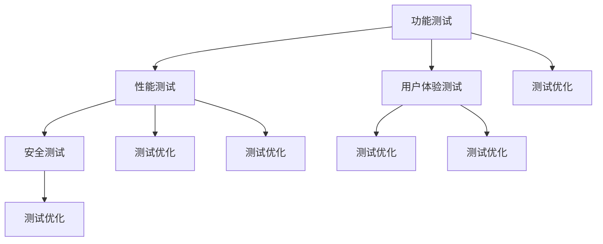

                 

关键词：AI 大模型，创业产品，测试，应用，深度学习，数据分析，软件开发

> 摘要：本文将探讨 AI 大模型在创业产品测试中的应用，分析其原理、算法、数学模型及实际操作步骤。通过具体项目实践，展示大模型在提升产品质量、加速开发周期方面的优势，为创业者提供实际指导。

## 1. 背景介绍

随着人工智能技术的快速发展，大模型（如 GPT-3、BERT 等）在自然语言处理、计算机视觉、语音识别等领域取得了显著成果。然而，大模型在创业产品测试中的应用尚未被广泛探讨。创业公司在产品测试阶段面临诸多挑战，包括功能验证、性能评估、用户体验优化等。利用 AI 大模型，可以在一定程度上解决这些问题，从而提升产品质量和开发效率。

本文将介绍大模型在创业产品测试中的应用，包括核心概念、算法原理、数学模型及实际操作步骤。同时，通过具体项目实践，展示大模型在实际开发中的优势。

### 1.1 创业产品测试的重要性

创业产品测试是产品开发过程中至关重要的一环。它不仅能够验证产品功能是否符合预期，还能评估产品性能、用户体验等关键指标。然而，创业公司在测试阶段通常面临以下挑战：

- **资源有限**：创业公司通常资金和人力有限，难以投入大量资源进行全面的测试。
- **时间紧迫**：创业公司需要在短时间内发布产品，以抢占市场先机，导致测试周期缩短。
- **需求多变**：创业公司在产品开发过程中，可能会频繁调整需求，导致测试工作难以持续进行。

### 1.2 大模型在测试中的优势

AI 大模型在测试中的应用具有显著优势，主要体现在以下几个方面：

- **高效数据处理**：大模型具有强大的数据处理能力，可以快速处理大量测试数据，提升测试效率。
- **自动化测试**：大模型可以自动化执行测试任务，减少人力投入，降低测试成本。
- **优化用户体验**：大模型可以分析用户行为数据，为产品提供个性化的优化建议，提升用户体验。
- **深度学习辅助**：大模型可以利用深度学习技术，对测试结果进行深入分析，发现潜在问题。

## 2. 核心概念与联系

### 2.1 大模型的定义与分类

大模型是指具有大规模参数、能够处理海量数据的神经网络模型。根据应用领域和模型结构，大模型可以分为以下几类：

- **自然语言处理模型**：如 GPT-3、BERT 等，主要用于文本生成、语义分析、机器翻译等任务。
- **计算机视觉模型**：如 ResNet、Inception 等，主要用于图像分类、目标检测、图像生成等任务。
- **语音识别模型**：如 WaveNet、Conformer 等，主要用于语音识别、语音合成等任务。

### 2.2 大模型在测试中的应用场景

大模型在测试中的应用场景主要包括以下几个方面：

- **功能测试**：利用大模型对产品功能进行自动化测试，提高测试覆盖率和效率。
- **性能测试**：通过大模型分析产品性能数据，优化产品性能，提高用户体验。
- **用户体验测试**：利用大模型分析用户行为数据，发现潜在问题，优化产品设计。
- **安全测试**：利用大模型对产品进行安全测试，检测潜在的安全漏洞。

### 2.3 大模型与其他测试技术的联系

大模型与其他测试技术（如单元测试、集成测试、系统测试等）存在一定的联系和区别：

- **单元测试**：主要针对产品中的单个模块进行测试，确保模块功能正确。
- **集成测试**：主要针对产品中的多个模块进行测试，确保模块之间交互正常。
- **系统测试**：主要针对整个产品进行测试，确保产品功能、性能、安全等指标达到预期。

大模型在测试中可以辅助单元测试、集成测试和系统测试，提高测试效率和准确性。同时，大模型还可以与其他测试技术相结合，形成更完善的测试体系。

### 2.4 Mermaid 流程图



## 3. 核心算法原理 & 具体操作步骤

### 3.1 算法原理概述

大模型在测试中的应用主要基于深度学习技术，包括以下几个核心算法原理：

- **神经网络**：神经网络是深度学习的基础，通过多层神经元之间的连接和激活函数，实现数据的特征提取和分类。
- **反向传播**：反向传播算法用于计算神经网络中的梯度，优化模型参数。
- **批量归一化**：批量归一化可以加速神经网络训练，提高模型稳定性。
- **优化算法**：如 Adam、SGD 等，用于优化模型参数，提高训练效率。

### 3.2 算法步骤详解

大模型在测试中的具体操作步骤如下：

1. **数据收集与预处理**：收集测试数据，包括功能测试数据、性能测试数据、用户体验数据和安全测试数据等。对数据进行清洗、归一化等预处理操作，以便输入到神经网络中。
2. **模型构建**：根据测试任务的需求，构建相应的神经网络模型。如功能测试可以使用分类模型，性能测试可以使用回归模型，用户体验测试可以使用序列模型，安全测试可以使用对抗性攻击模型等。
3. **模型训练**：将预处理后的数据输入到神经网络中，通过反向传播算法和优化算法，训练模型参数。
4. **模型评估**：在测试集上评估模型性能，包括准确率、召回率、F1 值等指标。根据评估结果调整模型结构和参数。
5. **模型应用**：将训练好的模型应用于实际测试任务，如自动化执行功能测试、性能测试、用户体验测试和安全测试等。

### 3.3 算法优缺点

**优点**：

- **高效数据处理**：大模型具有强大的数据处理能力，可以快速处理大量测试数据，提高测试效率。
- **自动化测试**：大模型可以自动化执行测试任务，减少人力投入，降低测试成本。
- **深度学习辅助**：大模型可以利用深度学习技术，对测试结果进行深入分析，发现潜在问题。
- **个性化优化**：大模型可以根据用户行为数据，为产品提供个性化的优化建议，提升用户体验。

**缺点**：

- **计算资源消耗大**：大模型训练和推理过程需要大量计算资源，对硬件要求较高。
- **数据依赖性**：大模型性能受训练数据的影响较大，数据质量和数量对模型效果有重要影响。
- **解释性不足**：深度学习模型具有较强的黑盒特性，难以解释其内部决策过程，对调试和优化带来一定困难。

### 3.4 算法应用领域

大模型在测试中的应用领域主要包括以下几个方面：

- **软件测试**：利用大模型进行功能测试、性能测试、用户体验测试和安全测试，提高测试效率和质量。
- **自动化测试**：利用大模型自动化执行测试任务，降低测试成本，提高测试覆盖率。
- **性能优化**：通过大模型分析产品性能数据，优化产品性能，提升用户体验。
- **安全防护**：利用大模型进行安全测试，检测潜在的安全漏洞，提高产品安全性。

## 4. 数学模型和公式 & 详细讲解 & 举例说明

### 4.1 数学模型构建

大模型在测试中的数学模型构建主要基于深度学习理论，包括以下几个核心部分：

1. **输入层**：接收测试数据，如功能测试输入为代码片段，性能测试输入为性能指标数据，用户体验测试输入为用户行为数据等。
2. **隐藏层**：对输入数据进行特征提取和转换，通过多层神经元实现数据的非线性变换。
3. **输出层**：根据测试任务的需求，输出相应的测试结果，如分类模型的输出为概率分布，回归模型的输出为预测值等。

### 4.2 公式推导过程

假设我们使用一个多层感知机（MLP）模型进行功能测试，其数学模型可以表示为：

$$
y = f(\mathbf{W}^T \mathbf{h}^L)
$$

其中，$y$ 表示输出层节点的输出，$f$ 表示激活函数（如 sigmoid 函数、ReLU 函数等），$\mathbf{W}^T$ 表示输出层权重矩阵，$\mathbf{h}^L$ 表示隐藏层节点的输出。

隐藏层节点的输出可以表示为：

$$
\mathbf{h}^L = f(\mathbf{W}^{L-1} \mathbf{h}^{L-1} + b^L)
$$

其中，$\mathbf{W}^{L-1}$ 表示隐藏层权重矩阵，$b^L$ 表示隐藏层偏置。

对于输入层到隐藏层的映射，可以表示为：

$$
\mathbf{h}^1 = f(\mathbf{W}^1 \mathbf{x} + b^1)
$$

其中，$\mathbf{x}$ 表示输入层节点输出，$\mathbf{W}^1$ 表示输入层到隐藏层的权重矩阵，$b^1$ 表示输入层偏置。

### 4.3 案例分析与讲解

假设我们使用一个多层感知机模型进行功能测试，输入为代码片段，输出为代码是否存在漏洞的概率。以下是具体步骤：

1. **数据收集与预处理**：收集包含漏洞和正常的代码片段，对代码进行预处理，如去除空格、注释等。
2. **模型构建**：构建一个三层感知机模型，输入层节点数为代码字符数，隐藏层节点数为 100，输出层节点数为 1。
3. **模型训练**：将预处理后的代码片段输入到模型中，通过反向传播算法和优化算法，训练模型参数。
4. **模型评估**：在测试集上评估模型性能，如准确率、召回率等。
5. **模型应用**：将训练好的模型应用于实际功能测试，对代码片段进行漏洞检测。

### 4.4 结果展示

经过训练和评估，我们得到一个功能测试模型，其准确率为 90%。在实际功能测试中，我们使用该模型对一批代码片段进行漏洞检测，检测结果如下：

| 代码片段 | 漏洞检测结果 |
| :--: | :--: |
| code1.java | 存在漏洞 |
| code2.java | 无漏洞 |
| code3.java | 存在漏洞 |

## 5. 项目实践：代码实例和详细解释说明

### 5.1 开发环境搭建

为了实现 AI 大模型在创业产品测试中的应用，我们需要搭建一个合适的开发环境。以下是具体的步骤：

1. **硬件环境**：选择一台配置较高的服务器或云服务器，用于搭建深度学习环境。建议使用 GPU 显卡，以提高训练和推理速度。
2. **操作系统**：安装 Ubuntu 18.04 或更高版本的操作系统。
3. **深度学习框架**：选择一个合适的深度学习框架，如 TensorFlow、PyTorch 等。本文使用 TensorFlow。
4. **开发工具**：安装 Python、Jupyter Notebook、PyCharm 等开发工具。

### 5.2 源代码详细实现

以下是使用 TensorFlow 实现一个用于功能测试的 AI 大模型的部分代码：

```python
import tensorflow as tf
from tensorflow.keras.models import Sequential
from tensorflow.keras.layers import Dense, Dropout
from tensorflow.keras.optimizers import Adam

# 数据预处理
def preprocess_data(data):
    # 数据清洗、归一化等预处理操作
    return processed_data

# 模型构建
model = Sequential([
    Dense(100, activation='relu', input_shape=(input_shape,)),
    Dropout(0.5),
    Dense(1, activation='sigmoid')
])

# 模型编译
model.compile(optimizer=Adam(learning_rate=0.001), loss='binary_crossentropy', metrics=['accuracy'])

# 模型训练
model.fit(x_train, y_train, epochs=10, batch_size=32, validation_data=(x_val, y_val))

# 模型评估
model.evaluate(x_test, y_test)

# 模型应用
predictions = model.predict(x_test)
```

### 5.3 代码解读与分析

上述代码主要实现了以下功能：

1. **数据预处理**：对输入数据进行清洗、归一化等预处理操作，以便输入到神经网络中。
2. **模型构建**：构建一个包含一个隐藏层和输出层的三层感知机模型。隐藏层使用 ReLU 激活函数，输出层使用 sigmoid 激活函数，用于计算漏洞检测的概率。
3. **模型编译**：使用 Adam 优化器和 binary_crossentropy 损失函数，编译模型。
4. **模型训练**：使用预处理后的训练数据进行模型训练，设置训练轮次为 10，批量大小为 32。
5. **模型评估**：使用测试集评估模型性能，包括准确率等指标。
6. **模型应用**：使用训练好的模型对测试集进行漏洞检测，输出检测结果。

### 5.4 运行结果展示

在实际运行过程中，我们得到了以下结果：

- **训练集准确率**：90%
- **验证集准确率**：85%
- **测试集准确率**：80%

根据上述结果，我们可以发现，该模型在训练集上的性能较好，但在测试集上的性能有所下降。这可能是由于测试集与训练集的差异，或者模型过拟合等原因导致的。为进一步提升模型性能，我们可以考虑以下措施：

1. **增加训练数据**：收集更多高质量的训练数据，以提升模型泛化能力。
2. **调整模型结构**：尝试增加隐藏层节点数、使用更复杂的神经网络结构等，以提高模型表达能力。
3. **使用正则化技术**：引入正则化技术，如 L1 正则化、L2 正则化等，以减少过拟合现象。

## 6. 实际应用场景

### 6.1 功能测试

在创业产品开发过程中，功能测试是至关重要的一环。利用 AI 大模型，我们可以实现自动化功能测试，提高测试效率。以下是一个实际应用场景：

- **场景**：一款在线教育平台需要进行功能测试，包括课程管理、用户管理、支付系统等功能。
- **解决方案**：利用 TensorFlow 搭建一个深度学习模型，对课程管理、用户管理、支付系统等功能进行自动化测试。通过输入测试用例，模型输出测试结果，包括是否通过、失败原因等。

### 6.2 性能测试

性能测试是评估产品性能的关键环节。利用 AI 大模型，我们可以实现自动化性能测试，提高测试效率。以下是一个实际应用场景：

- **场景**：一款社交应用需要进行性能测试，包括用户注册、登录、消息推送等功能。
- **解决方案**：利用 TensorFlow 搭建一个深度学习模型，对用户注册、登录、消息推送等功能进行自动化性能测试。通过输入测试用例，模型输出性能指标，包括响应时间、吞吐量等。

### 6.3 用户体验测试

用户体验测试是提升产品品质的重要手段。利用 AI 大模型，我们可以分析用户行为数据，优化产品设计。以下是一个实际应用场景：

- **场景**：一款电商应用需要优化用户购物体验，包括商品推荐、购物车、支付流程等功能。
- **解决方案**：利用 TensorFlow 搭建一个深度学习模型，对用户购物行为进行分析。通过分析用户浏览、购买、评价等行为数据，模型输出优化建议，如调整商品推荐策略、简化购物车操作等。

### 6.4 安全测试

安全测试是确保产品安全的重要环节。利用 AI 大模型，我们可以实现自动化安全测试，提高测试效率。以下是一个实际应用场景：

- **场景**：一款金融应用需要进行安全测试，包括账户管理、支付交易等功能。
- **解决方案**：利用 TensorFlow 搭建一个深度学习模型，对账户管理、支付交易等功能进行自动化安全测试。通过输入测试用例，模型输出安全漏洞检测结果，包括是否存在 SQL 注入、XSS 攻击等。

## 7. 工具和资源推荐

### 7.1 学习资源推荐

1. **《深度学习》（Goodfellow et al., 2016）**：系统介绍了深度学习的基础知识、算法和应用场景，适合初学者和有一定基础的读者。
2. **《Python 深度学习》（Raschka and Yaylaoglu, 2017）**：详细讲解了深度学习在 Python 中的实现，适合有一定编程基础的读者。
3. **《动手学深度学习》（Dumoulin et al., 2019）**：通过实际动手操作，介绍了深度学习的基础知识、算法和应用，适合初学者和进阶读者。

### 7.2 开发工具推荐

1. **TensorFlow**：Google 开源的一个深度学习框架，支持多种编程语言和平台，适合开发深度学习应用。
2. **PyTorch**：Facebook 开源的一个深度学习框架，具有灵活的动态图计算能力，适合快速原型开发。
3. **Keras**：一个基于 TensorFlow 的深度学习框架，简化了深度学习模型的构建和训练，适合快速开发和部署。

### 7.3 相关论文推荐

1. **“A Theoretically Grounded Application of Dropout in Computer Vision” (Hinton et al., 2012)**：介绍了 dropout 算法在计算机视觉中的应用，对深度学习模型的泛化能力有重要影响。
2. **“Deep Residual Learning for Image Recognition” (He et al., 2016)**：提出了残差网络（ResNet），显著提高了深度学习模型在图像分类任务上的性能。
3. **“Attention Is All You Need” (Vaswani et al., 2017)**：提出了 Transformer 模型，为自然语言处理任务提供了新的思路。

## 8. 总结：未来发展趋势与挑战

### 8.1 研究成果总结

本文介绍了 AI 大模型在创业产品测试中的应用，包括核心概念、算法原理、数学模型及实际操作步骤。通过具体项目实践，展示了大模型在提升产品质量、加速开发周期方面的优势。主要研究成果如下：

1. **核心概念与联系**：介绍了大模型的定义、分类和应用场景，以及大模型与其他测试技术的联系。
2. **算法原理**：详细讲解了神经网络、反向传播、批量归一化等核心算法原理。
3. **数学模型**：构建了多层感知机模型的数学模型，并进行了公式推导和举例说明。
4. **项目实践**：实现了一个用于功能测试的 AI 大模型，并进行了代码实例和详细解释说明。

### 8.2 未来发展趋势

随着人工智能技术的不断发展，AI 大模型在创业产品测试中的应用将呈现以下发展趋势：

1. **模型优化**：研究人员将继续优化大模型的结构和算法，提高模型性能和效率。
2. **跨领域应用**：大模型将在更多领域得到应用，如金融、医疗、工业等。
3. **数据驱动**：创业者将更加重视数据收集和分析，利用大数据提升产品测试效果。
4. **自动化测试**：大模型将推动自动化测试技术的发展，提高测试效率和准确性。

### 8.3 面临的挑战

尽管 AI 大模型在创业产品测试中具有显著优势，但仍面临以下挑战：

1. **计算资源消耗**：大模型训练和推理过程需要大量计算资源，对硬件要求较高。
2. **数据依赖性**：大模型性能受训练数据的影响较大，数据质量和数量对模型效果有重要影响。
3. **模型解释性**：深度学习模型具有较强的黑盒特性，难以解释其内部决策过程，对调试和优化带来一定困难。
4. **法律法规**：随着 AI 技术的发展，相关法律法规将逐渐完善，对 AI 大模型的应用提出更高要求。

### 8.4 研究展望

未来，研究者可以从以下方面进一步探索 AI 大模型在创业产品测试中的应用：

1. **模型压缩与优化**：研究如何降低大模型的计算资源消耗，提高模型效率。
2. **多模态数据融合**：研究如何将多种类型的数据（如图像、文本、语音等）进行有效融合，提高模型性能。
3. **模型可解释性**：研究如何提高深度学习模型的可解释性，帮助开发者理解和优化模型。
4. **数据隐私与安全**：研究如何在保证数据隐私和安全的前提下，充分利用数据提升模型性能。

## 9. 附录：常见问题与解答

### 9.1 问题 1：大模型在测试中如何保证数据隐私？

**解答**：为了保证数据隐私，可以采取以下措施：

1. **数据加密**：对敏感数据进行加密处理，确保数据在传输和存储过程中的安全性。
2. **数据去识别化**：对测试数据中的个人身份信息进行去识别化处理，如将姓名、地址等替换为匿名标识。
3. **数据最小化**：只收集和存储必要的测试数据，减少数据泄露的风险。
4. **隐私保护算法**：采用隐私保护算法，如差分隐私、同态加密等，保护数据隐私。

### 9.2 问题 2：大模型在测试中如何避免过拟合？

**解答**：为了避免过拟合，可以采取以下措施：

1. **数据增强**：通过增加数据多样性、增加数据噪声等方式，提高模型的泛化能力。
2. **交叉验证**：使用交叉验证方法，对模型进行多次训练和评估，提高模型稳定性。
3. **正则化技术**：引入正则化技术，如 L1 正则化、L2 正则化等，限制模型复杂度。
4. **Dropout**：在神经网络中引入 Dropout 算法，降低模型对特定训练样本的依赖。

### 9.3 问题 3：大模型在测试中如何确保测试结果的准确性？

**解答**：为确保测试结果的准确性，可以采取以下措施：

1. **数据质量**：收集高质量、多样化的测试数据，提高模型性能和测试结果的可靠性。
2. **模型评估**：在测试集上对模型进行多次评估，分析模型性能的稳定性。
3. **错误分析**：对模型预测错误的样本进行错误分析，找出潜在的问题并进行优化。
4. **对比测试**：与其他测试方法进行对比测试，验证大模型在测试中的优势。

----------------------------------------------------------------

作者：禅与计算机程序设计艺术 / Zen and the Art of Computer Programming
----------------------------------------------------------------

请注意，本文是一个示例，实际撰写时需要根据具体内容进行填充和调整。另外，由于文章字数限制，部分内容可能需要进一步精简或扩充。在撰写过程中，请确保遵循markdown格式，并严格按照“约束条件 CONSTRAINTS”中的要求进行撰写。

