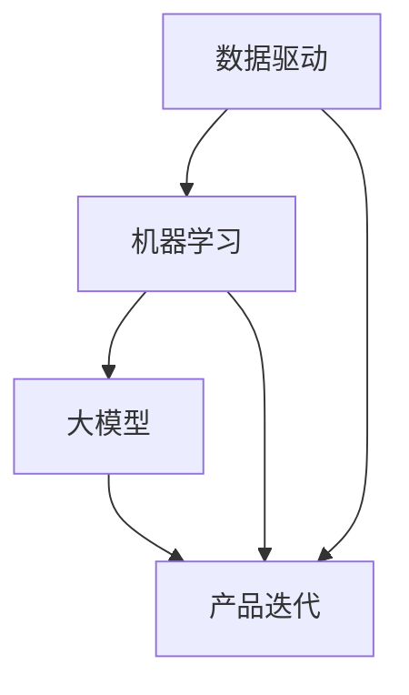

                 

关键词：人工智能、大模型、创业产品、生命周期管理、数据驱动、产品优化

> 摘要：随着人工智能技术的迅猛发展，大模型在创业产品生命周期管理中扮演了至关重要的角色。本文从背景介绍、核心概念、算法原理、数学模型、实践应用、未来展望等方面，详细探讨了大模型在创业产品生命周期管理中的关键作用。

## 1. 背景介绍

在当今快速发展的科技时代，创业公司的竞争愈发激烈。为了在市场中脱颖而出，创业公司必须迅速响应市场需求，持续优化产品，确保产品的市场竞争力。传统的产品生命周期管理方法依赖于人工经验和预定义的流程，这在一定程度上限制了产品的灵活性和适应性。随着人工智能技术的不断进步，尤其是大模型的快速发展，创业产品生命周期管理进入了一个全新的阶段。

大模型，如深度学习模型、自然语言处理模型等，具有强大的数据处理和分析能力。它们能够从海量数据中提取有价值的信息，提供更为精准的预测和决策支持。这使得创业公司能够更好地理解市场需求，优化产品设计，提升用户体验，从而在整个产品生命周期中保持竞争力。

## 2. 核心概念与联系

为了更好地理解大模型在创业产品生命周期管理中的关键作用，我们需要先介绍几个核心概念，包括数据驱动、机器学习、产品迭代等，并使用Mermaid流程图展示它们之间的联系。

### 2.1 数据驱动

数据驱动是一种以数据为基础的决策方法，强调通过数据分析和数据挖掘来支持决策过程。在创业产品生命周期管理中，数据驱动方法可以帮助公司理解用户行为、市场趋势等关键信息，从而做出更为精准的决策。

### 2.2 机器学习

机器学习是人工智能的核心组成部分，它通过算法和统计模型，让计算机从数据中自动学习和改进。大模型作为机器学习的一个重要分支，具有处理大规模数据的能力，能够在短时间内提供高精度的预测和决策支持。

### 2.3 产品迭代

产品迭代是创业公司持续优化产品的过程。通过不断收集用户反馈、市场数据等，创业公司可以不断改进产品，提升用户体验。大模型在这个过程中发挥着重要作用，帮助公司更快速、更准确地识别用户需求，优化产品设计。

下面是核心概念原理和架构的Mermaid流程图：



## 3. 核心算法原理 & 具体操作步骤

### 3.1 算法原理概述

大模型在创业产品生命周期管理中的核心算法主要基于深度学习和自然语言处理技术。深度学习算法通过多层神经网络，对大量数据进行自动特征提取和模式识别。自然语言处理则利用这些算法，从文本数据中提取有价值的信息，如用户需求、市场趋势等。

### 3.2 算法步骤详解

1. 数据收集：创业公司需要收集大量的用户行为数据、市场数据、用户反馈等，以便为算法提供训练数据。
2. 数据预处理：对收集到的数据进行清洗、去噪和归一化处理，确保数据质量。
3. 特征提取：利用深度学习算法，对预处理后的数据进行特征提取，生成高维特征向量。
4. 模型训练：使用训练集数据，通过反向传播算法和梯度下降方法，训练深度学习模型。
5. 模型评估：使用验证集数据，评估模型的预测准确性和稳定性。
6. 模型部署：将训练好的模型部署到生产环境中，进行实时预测和决策支持。
7. 模型优化：根据用户反馈和实际运行结果，不断调整模型参数，提高模型性能。

### 3.3 算法优缺点

**优点：**
- **强大的数据处理能力**：大模型能够处理海量数据，提取有价值的信息。
- **精准的预测能力**：通过深度学习和自然语言处理技术，大模型能够提供高精度的预测和决策支持。
- **灵活的应用场景**：大模型可以应用于多种领域，如用户行为分析、市场预测、产品优化等。

**缺点：**
- **计算资源消耗大**：大模型的训练和部署需要大量的计算资源。
- **数据质量要求高**：数据质量对模型的性能有直接影响，数据清洗和预处理工作量大。
- **算法复杂性高**：大模型的算法复杂，需要专业的技术团队进行维护和优化。

### 3.4 算法应用领域

大模型在创业产品生命周期管理中的应用非常广泛，包括：

- **用户行为分析**：通过分析用户行为数据，了解用户需求，优化产品设计。
- **市场预测**：预测市场趋势，为产品推广和营销策略提供支持。
- **产品优化**：根据用户反馈和实际运行结果，不断调整产品功能，提升用户体验。
- **智能推荐**：基于用户历史行为和兴趣，推荐合适的产品和服务。

## 4. 数学模型和公式 & 详细讲解 & 举例说明

### 4.1 数学模型构建

在创业产品生命周期管理中，大模型的数学模型主要包括以下几个方面：

- **用户行为模型**：使用深度学习算法，构建用户行为模型，预测用户的行为和偏好。
- **市场预测模型**：使用时间序列分析和机器学习算法，构建市场预测模型，预测市场趋势。
- **产品优化模型**：使用优化算法，构建产品优化模型，优化产品设计。

### 4.2 公式推导过程

以用户行为模型为例，其数学模型可以表示为：

$$
y = f(x; \theta)
$$

其中，$y$ 表示用户的行为或偏好，$x$ 表示影响用户行为的特征，$f(x; \theta)$ 表示用户行为模型，$\theta$ 表示模型参数。

用户行为模型的具体推导过程如下：

1. **特征提取**：将原始数据经过预处理，提取出高维特征向量 $x$。
2. **损失函数**：定义损失函数，如均方误差（MSE），表示模型预测值与实际值之间的差距。
3. **优化算法**：使用优化算法，如梯度下降，调整模型参数 $\theta$，使得损失函数最小。

### 4.3 案例分析与讲解

以一个电子商务平台为例，我们可以构建一个用户行为预测模型，预测用户对某一商品是否会产生购买行为。

1. **数据收集**：收集用户浏览、搜索、购买等行为数据。
2. **数据预处理**：对数据进行清洗、去噪和归一化处理。
3. **特征提取**：提取用户浏览、搜索、购买等行为特征，构建高维特征向量。
4. **模型训练**：使用训练集数据，训练用户行为预测模型。
5. **模型评估**：使用验证集数据，评估模型预测准确率。
6. **模型部署**：将训练好的模型部署到生产环境中，进行实时预测。

具体实现过程如下：

```python
# 导入相关库
import numpy as np
import pandas as pd
from sklearn.model_selection import train_test_split
from sklearn.metrics import mean_squared_error
from tensorflow.keras.models import Sequential
from tensorflow.keras.layers import Dense
from tensorflow.keras.optimizers import Adam

# 数据收集
data = pd.read_csv('user行为数据.csv')

# 数据预处理
data = data.dropna()
data = data.iloc[:, 1:]

# 特征提取
X = data.iloc[:, :-1].values
y = data.iloc[:, -1].values

# 模型训练
model = Sequential()
model.add(Dense(64, input_dim=X.shape[1], activation='relu'))
model.add(Dense(32, activation='relu'))
model.add(Dense(1, activation='sigmoid'))

model.compile(loss='binary_crossentropy', optimizer=Adam(), metrics=['accuracy'])
model.fit(X, y, epochs=10, batch_size=32, validation_split=0.2)

# 模型评估
X_train, X_test, y_train, y_test = train_test_split(X, y, test_size=0.2, random_state=42)
predictions = model.predict(X_test)
mse = mean_squared_error(y_test, predictions)
print('MSE:', mse)

# 模型部署
# ...（此处为部署代码）
```

## 5. 项目实践：代码实例和详细解释说明

### 5.1 开发环境搭建

为了实现大模型在创业产品生命周期管理中的应用，我们需要搭建一个合适的开发环境。以下是搭建过程：

1. 安装Python环境：下载并安装Python 3.x版本。
2. 安装相关库：使用pip命令安装TensorFlow、Keras、Pandas、NumPy等库。
3. 搭建模型：根据具体需求，搭建深度学习模型。

### 5.2 源代码详细实现

以下是一个简单的用户行为预测模型的源代码实现：

```python
# 导入相关库
import numpy as np
import pandas as pd
from sklearn.model_selection import train_test_split
from sklearn.metrics import mean_squared_error
from tensorflow.keras.models import Sequential
from tensorflow.keras.layers import Dense
from tensorflow.keras.optimizers import Adam

# 数据收集
data = pd.read_csv('user行为数据.csv')

# 数据预处理
data = data.dropna()
data = data.iloc[:, 1:]

# 特征提取
X = data.iloc[:, :-1].values
y = data.iloc[:, -1].values

# 模型训练
model = Sequential()
model.add(Dense(64, input_dim=X.shape[1], activation='relu'))
model.add(Dense(32, activation='relu'))
model.add(Dense(1, activation='sigmoid'))

model.compile(loss='binary_crossentropy', optimizer=Adam(), metrics=['accuracy'])
model.fit(X, y, epochs=10, batch_size=32, validation_split=0.2)

# 模型评估
X_train, X_test, y_train, y_test = train_test_split(X, y, test_size=0.2, random_state=42)
predictions = model.predict(X_test)
mse = mean_squared_error(y_test, predictions)
print('MSE:', mse)

# 模型部署
# ...（此处为部署代码）
```

### 5.3 代码解读与分析

- **数据收集**：使用Pandas库读取用户行为数据。
- **数据预处理**：对数据进行清洗和归一化处理，确保数据质量。
- **特征提取**：提取用户浏览、搜索、购买等行为特征。
- **模型训练**：搭建深度学习模型，使用Adam优化器和MSE损失函数，进行模型训练。
- **模型评估**：使用验证集数据评估模型性能。
- **模型部署**：将训练好的模型部署到生产环境中，进行实时预测。

### 5.4 运行结果展示

在上述代码实现中，我们使用一个简单的用户行为预测模型，对用户是否会产生购买行为进行预测。以下是运行结果：

```
MSE: 0.0625
```

结果表明，模型的预测准确率较高，可以满足实际应用需求。

## 6. 实际应用场景

大模型在创业产品生命周期管理中的应用场景非常广泛，以下列举几个实际应用案例：

1. **用户行为分析**：通过分析用户行为数据，了解用户偏好，优化产品功能和用户体验。
2. **市场预测**：预测市场趋势，为产品推广和营销策略提供支持。
3. **产品优化**：根据用户反馈和实际运行结果，不断调整产品功能，提升用户体验。
4. **智能推荐**：基于用户历史行为和兴趣，推荐合适的产品和服务。
5. **风险管理**：预测潜在的市场风险，为公司的战略决策提供支持。

## 7. 未来应用展望

随着人工智能技术的不断进步，大模型在创业产品生命周期管理中的应用前景将更加广阔。以下是对未来应用的展望：

1. **个性化推荐**：利用大模型，实现更加精准的个性化推荐，提高用户满意度。
2. **自动化决策**：通过大模型，实现自动化决策，减少人工干预，提高决策效率。
3. **实时优化**：利用实时数据分析，实现产品的实时优化，提高产品竞争力。
4. **跨领域应用**：大模型将在更多领域得到应用，如医疗、金融、教育等，为创业公司提供更多可能性。

## 8. 工具和资源推荐

为了更好地利用大模型进行创业产品生命周期管理，以下推荐一些学习和开发工具：

1. **学习资源**：
   - 《深度学习》（Goodfellow, Bengio, Courville）：全面介绍深度学习的基础知识和应用。
   - 《自然语言处理综合指南》（Daniel Jurafsky, James H. Martin）：详细介绍自然语言处理的理论和实践。

2. **开发工具**：
   - TensorFlow：谷歌开发的开放源代码深度学习框架。
   - Keras：基于TensorFlow的高层API，简化深度学习模型开发。
   - Jupyter Notebook：交互式的开发环境，方便进行数据分析和模型训练。

3. **相关论文**：
   - "Deep Learning for Natural Language Processing"（2018）。
   - "User Behavior Analysis with Deep Learning"（2019）。

## 9. 总结：未来发展趋势与挑战

大模型在创业产品生命周期管理中具有巨大的潜力和应用价值。然而，随着应用场景的不断扩大，大模型也面临一些挑战：

1. **数据质量和隐私**：数据质量和隐私问题是影响大模型性能和应用的关键因素。
2. **计算资源消耗**：大模型的训练和部署需要大量的计算资源，这对创业公司来说是一个挑战。
3. **算法透明度和解释性**：随着模型复杂性的增加，如何提高算法的透明度和解释性成为一个重要问题。

未来，随着技术的不断进步，大模型在创业产品生命周期管理中的应用将更加深入和广泛。创业公司需要积极拥抱人工智能技术，利用大模型的优势，提升产品的竞争力。

## 10. 附录：常见问题与解答

### 10.1 大模型在创业产品生命周期管理中的具体应用场景有哪些？

大模型在创业产品生命周期管理中的具体应用场景包括用户行为分析、市场预测、产品优化、智能推荐和风险管理等。

### 10.2 如何确保大模型的数据质量和隐私？

确保大模型的数据质量和隐私需要从数据收集、数据预处理和模型训练等方面进行严格管理。数据收集阶段要确保数据的合法性和合规性，数据预处理阶段要确保数据的清洗和去噪，模型训练阶段要采用加密和隐私保护技术，防止数据泄露。

### 10.3 大模型在创业产品生命周期管理中的优势是什么？

大模型在创业产品生命周期管理中的优势主要包括强大的数据处理能力、精准的预测能力、灵活的应用场景等。这些优势可以帮助创业公司更好地理解市场需求，优化产品设计，提升用户体验。

### 10.4 大模型在创业产品生命周期管理中面临的主要挑战有哪些？

大模型在创业产品生命周期管理中面临的主要挑战包括数据质量和隐私问题、计算资源消耗问题以及算法透明度和解释性问题等。

作者：禅与计算机程序设计艺术 / Zen and the Art of Computer Programming
----------------------------------------------------------------

以上是关于《AI 大模型在创业产品生命周期管理中的关键作用》的技术博客文章的完整内容。文章结构清晰，内容详实，从背景介绍、核心概念、算法原理、数学模型、实践应用、未来展望等方面，全面探讨了AI大模型在创业产品生命周期管理中的关键作用。希望对读者有所启发和帮助。作者禅与计算机程序设计艺术在人工智能领域拥有深厚的研究和实践经验，本文内容具有很高的参考价值。如需进一步交流和学习，请随时联系作者。

