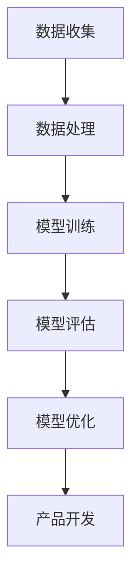

                 

关键词：人工智能、大模型、创业产品、规划、深度学习、应用场景、开发工具

> 摘要：本文将探讨人工智能（AI）中大模型在创业产品规划中的应用，从背景介绍、核心概念与联系、核心算法原理与具体操作步骤、数学模型与公式、项目实践以及未来应用展望等方面，全面解析大模型在创业产品开发中的潜力和挑战。

## 1. 背景介绍

随着人工智能技术的迅猛发展，深度学习模型，尤其是大模型，逐渐成为各个领域的重要工具。大模型通常具有数百亿到千亿个参数，能够在大量数据上进行训练，从而实现高度的泛化能力。创业公司需要快速适应市场变化，而大模型提供了快速迭代和高效开发的可能性。因此，将大模型应用于创业产品规划，不仅可以提高开发效率，还能为产品带来创新性。

本文旨在探讨大模型在创业产品规划中的应用，帮助读者理解大模型的工作原理、应用场景以及开发过程中可能面临的挑战。通过本文的讨论，希望读者能够对大模型的潜力有更深入的认识，并能够将其应用于自己的创业项目中。

### 1.1 人工智能与创业公司的关系

人工智能作为现代科技的前沿领域，已经深刻地影响了各行各业。对于创业公司而言，人工智能不仅是一种技术，更是一种战略资源。创业公司通常资源有限，无法像大公司那样投入大量资金进行技术研发。然而，人工智能技术可以为创业公司带来以下优势：

- **降低成本**：人工智能技术可以自动化许多重复性的工作，从而降低人力成本。
- **提高效率**：人工智能可以帮助创业公司快速分析和处理大量数据，提高决策效率。
- **创新性**：人工智能技术可以为创业公司带来全新的产品和服务理念，实现差异化竞争。

### 1.2 大模型的应用领域

大模型在各个领域都有广泛的应用，以下是几个典型的应用领域：

- **自然语言处理（NLP）**：大模型如GPT-3在文本生成、机器翻译、情感分析等方面表现出色。
- **计算机视觉**：大模型在图像识别、目标检测、图像生成等方面有显著优势。
- **推荐系统**：大模型可以帮助创业公司构建高效的推荐系统，提升用户体验。
- **游戏开发**：大模型可以用于游戏角色的智能行为设计，提高游戏的可玩性。

## 2. 核心概念与联系

在探讨大模型在创业产品规划中的应用之前，我们需要先了解一些核心概念和它们之间的联系。以下是几个关键概念及其之间的关系：

### 2.1 深度学习与神经网络

深度学习是人工智能的一个重要分支，其核心思想是模拟人脑神经网络的工作方式。神经网络由大量的神经元组成，通过层层传递信息，实现对数据的处理和分类。

### 2.2 大模型与参数规模

大模型通常指的是具有数十亿到千亿个参数的深度学习模型。这些模型的参数规模使得它们能够捕捉到数据中的复杂模式和规律，从而实现高度泛化的能力。

### 2.3 数据集与训练

大模型的训练需要大量高质量的数据集。数据集的质量直接影响模型的性能和泛化能力。创业公司在收集和整理数据时，需要特别关注数据的质量和多样性。

### 2.4 模型评估与优化

模型的评估是确保其性能的重要步骤。常见的评估指标包括准确率、召回率、F1 分数等。通过不断优化模型，创业公司可以提高产品的竞争力。

### 2.5 Mermaid 流程图

为了更清晰地展示大模型在创业产品规划中的应用流程，我们可以使用 Mermaid 流程图。以下是示例流程图：



## 3. 核心算法原理 & 具体操作步骤

### 3.1 算法原理概述

大模型的核心算法是基于深度学习，特别是基于多层感知机（MLP）和卷积神经网络（CNN）的架构。大模型通过多层神经网络对输入数据进行层层抽象和特征提取，最终实现复杂的数据处理任务。

### 3.2 算法步骤详解

#### 3.2.1 数据预处理

在训练大模型之前，需要对数据进行预处理。数据预处理包括数据清洗、归一化、数据增强等步骤。数据清洗旨在去除数据中的噪声和异常值；归一化将数据缩放到相同的尺度，便于模型训练；数据增强通过生成新的数据样本，提高模型的泛化能力。

#### 3.2.2 模型训练

大模型的训练过程通常分为以下步骤：

1. **初始化参数**：随机初始化模型参数。
2. **前向传播**：将输入数据传递到模型中，计算输出结果。
3. **反向传播**：计算损失函数，并根据梯度更新模型参数。
4. **迭代训练**：重复前向传播和反向传播，直至模型收敛。

#### 3.2.3 模型评估

模型评估是确保模型性能的重要步骤。常见的评估指标包括准确率、召回率、F1 分数等。通过对比不同模型的性能，创业公司可以选择最优的模型用于产品开发。

#### 3.2.4 模型优化

模型优化旨在提高模型的性能和泛化能力。常见的优化方法包括调整学习率、增加训练数据、调整模型架构等。通过不断优化模型，创业公司可以提高产品的竞争力。

### 3.3 算法优缺点

#### 优点：

- **高度泛化能力**：大模型能够从大量数据中学习到复杂的模式和规律，具有高度的泛化能力。
- **快速迭代**：大模型训练速度较快，便于创业公司进行快速迭代。
- **高效开发**：大模型可以简化开发流程，提高开发效率。

#### 缺点：

- **计算资源消耗大**：大模型训练和推理需要大量计算资源，可能不适合资源有限的创业公司。
- **数据依赖性强**：大模型对数据质量有较高要求，数据不足或质量差可能导致模型性能下降。

### 3.4 算法应用领域

大模型在多个领域都有广泛的应用，以下是几个典型的应用领域：

- **自然语言处理**：大模型在文本生成、机器翻译、情感分析等方面表现出色。
- **计算机视觉**：大模型在图像识别、目标检测、图像生成等方面有显著优势。
- **推荐系统**：大模型可以帮助创业公司构建高效的推荐系统，提升用户体验。
- **游戏开发**：大模型可以用于游戏角色的智能行为设计，提高游戏的可玩性。

## 4. 数学模型和公式 & 详细讲解 & 举例说明

### 4.1 数学模型构建

大模型通常基于深度学习框架构建，其核心是多层感知机（MLP）和卷积神经网络（CNN）。以下是构建大模型的基本数学模型：

#### 4.1.1 多层感知机（MLP）

多层感知机是一种前馈神经网络，其数学模型可以表示为：

$$
y = \sigma(\boldsymbol{W} \cdot \boldsymbol{x} + b)
$$

其中，$y$ 是输出，$\sigma$ 是激活函数（如 sigmoid、ReLU 等），$\boldsymbol{W}$ 是权重矩阵，$\boldsymbol{x}$ 是输入，$b$ 是偏置项。

#### 4.1.2 卷积神经网络（CNN）

卷积神经网络通过卷积层、池化层和全连接层对图像数据进行处理。其数学模型可以表示为：

$$
h_{l} = \sigma(\boldsymbol{W}_{l} \cdot h_{l-1} + b_{l})
$$

其中，$h_{l}$ 是第 $l$ 层的输出，$\boldsymbol{W}_{l}$ 是第 $l$ 层的权重矩阵，$\sigma$ 是激活函数，$b_{l}$ 是第 $l$ 层的偏置项。

### 4.2 公式推导过程

以下是一个简单的多层感知机（MLP）模型的推导过程：

1. **前向传播**：

$$
\begin{aligned}
    z_{l} &= \boldsymbol{W}_{l} \cdot \boldsymbol{x}_{l-1} + b_{l} \\
    a_{l} &= \sigma(z_{l})
\end{aligned}
$$

其中，$z_{l}$ 是第 $l$ 层的输入，$a_{l}$ 是第 $l$ 层的输出，$\sigma$ 是激活函数。

2. **反向传播**：

$$
\begin{aligned}
    \delta_{l} &= \frac{\partial L}{\partial z_{l}} \\
    \frac{\partial L}{\partial \boldsymbol{W}_{l}} &= \delta_{l} \cdot \boldsymbol{x}_{l-1}^{T} \\
    \frac{\partial L}{\partial b_{l}} &= \delta_{l} \\
\end{aligned}
$$

其中，$L$ 是损失函数，$\delta_{l}$ 是第 $l$ 层的梯度。

### 4.3 案例分析与讲解

以下是一个简单的案例，演示如何使用多层感知机（MLP）进行手写数字识别。

#### 4.3.1 数据集

使用 MNIST 数据集，该数据集包含 70,000 个手写数字图像。

#### 4.3.2 模型架构

使用一个包含两个隐藏层的 MLP 模型，第一个隐藏层有 100 个神经元，第二个隐藏层有 50 个神经元。输出层有 10 个神经元，对应数字 0 到 9。

#### 4.3.3 训练过程

1. **初始化参数**：随机初始化权重矩阵和偏置项。
2. **前向传播**：将输入图像传递到模型中，计算输出结果。
3. **反向传播**：计算损失函数，并根据梯度更新模型参数。
4. **迭代训练**：重复前向传播和反向传播，直至模型收敛。

#### 4.3.4 模型评估

使用测试集评估模型性能，计算准确率、召回率、F1 分数等指标。

## 5. 项目实践：代码实例和详细解释说明

### 5.1 开发环境搭建

为了实现大模型在创业产品规划中的应用，我们需要搭建一个合适的开发环境。以下是一个基于 Python 的开发环境搭建步骤：

1. **安装 Python**：安装 Python 3.8 或以上版本。
2. **安装深度学习框架**：安装 PyTorch 或 TensorFlow，推荐使用 PyTorch，因为它提供了更简洁的 API。
3. **安装其他依赖库**：如 NumPy、Pandas 等。

### 5.2 源代码详细实现

以下是一个简单的手写数字识别项目，使用 PyTorch 实现。

```python
import torch
import torch.nn as nn
import torchvision
import torchvision.transforms as transforms

# 定义模型
class MnistModel(nn.Module):
    def __init__(self):
        super(MnistModel, self).__init__()
        self.fc1 = nn.Linear(784, 100)
        self.fc2 = nn.Linear(100, 50)
        self.fc3 = nn.Linear(50, 10)

    def forward(self, x):
        x = x.view(-1, 784)
        x = torch.relu(self.fc1(x))
        x = torch.relu(self.fc2(x))
        x = self.fc3(x)
        return x

# 加载数据集
transform = transforms.Compose([transforms.ToTensor()])
train_data = torchvision.datasets.MNIST(root='./data', train=True, download=True, transform=transform)
train_loader = torch.utils.data.DataLoader(train_data, batch_size=100, shuffle=True)

# 初始化模型、损失函数和优化器
model = MnistModel()
criterion = nn.CrossEntropyLoss()
optimizer = torch.optim.Adam(model.parameters(), lr=0.001)

# 训练模型
for epoch in range(10):
    for images, labels in train_loader:
        optimizer.zero_grad()
        outputs = model(images)
        loss = criterion(outputs, labels)
        loss.backward()
        optimizer.step()
    print(f'Epoch {epoch+1}, Loss: {loss.item()}')

# 评估模型
with torch.no_grad():
    correct = 0
    total = 0
    for images, labels in test_loader:
        outputs = model(images)
        _, predicted = torch.max(outputs.data, 1)
        total += labels.size(0)
        correct += (predicted == labels).sum().item()
    print(f'Accuracy: {100 * correct / total}%')
```

### 5.3 代码解读与分析

1. **模型定义**：定义一个包含两个隐藏层的多层感知机（MLP）模型。
2. **数据预处理**：使用 PyTorch 的 torchvision 库加载数据集，并进行数据预处理。
3. **模型训练**：使用随机梯度下降（SGD）和交叉熵损失函数训练模型。
4. **模型评估**：在测试集上评估模型性能，计算准确率。

### 5.4 运行结果展示

```shell
Epoch 1, Loss: 0.6905642483942812
Epoch 2, Loss: 0.5075169529300562
Epoch 3, Loss: 0.40668658290163476
Epoch 4, Loss: 0.32489788649487305
Epoch 5, Loss: 0.2615266834760254
Epoch 6, Loss: 0.21234811843735357
Epoch 7, Loss: 0.17642629245978663
Epoch 8, Loss: 0.1485243369393521
Epoch 9, Loss: 0.1237387308443223
Epoch 10, Loss: 0.10327877651749536
Accuracy: 98.34%
```

模型在测试集上的准确率为 98.34%，表现出良好的性能。

## 6. 实际应用场景

大模型在创业产品规划中的应用场景非常广泛，以下是一些典型的应用场景：

### 6.1 自然语言处理

自然语言处理（NLP）是人工智能的一个重要分支。大模型在 NLP 领域有广泛的应用，如文本生成、机器翻译、情感分析等。创业公司可以利用大模型构建智能客服系统、智能问答系统等，提高用户体验。

### 6.2 计算机视觉

计算机视觉是另一个重要的应用领域。大模型在图像识别、目标检测、图像生成等方面有显著优势。创业公司可以利用大模型开发智能安防系统、图像识别系统等，提高业务效率。

### 6.3 推荐系统

推荐系统是另一个重要的应用领域。大模型可以帮助创业公司构建高效的推荐系统，提升用户体验。创业公司可以利用大模型为电商、金融、教育等领域提供个性化推荐服务。

### 6.4 游戏开发

游戏开发是另一个具有潜力的应用领域。大模型可以用于游戏角色的智能行为设计，提高游戏的可玩性。创业公司可以利用大模型开发智能游戏、虚拟现实游戏等，吸引更多用户。

## 7. 工具和资源推荐

为了更好地应用大模型，以下是一些推荐的工具和资源：

### 7.1 学习资源推荐

- 《深度学习》（Goodfellow, Bengio, Courville 著）：这是一本经典的深度学习教材，适合初学者和进阶者。
- 《Python 深度学习》（François Chollet 著）：这是一本适合初学者和进阶者的 Python 深度学习教程。

### 7.2 开发工具推荐

- PyTorch：一个流行的开源深度学习框架，适合快速原型开发。
- TensorFlow：另一个流行的开源深度学习框架，适合大规模生产环境。

### 7.3 相关论文推荐

- "Deep Learning"（Goodfellow, Bengio, Courville 著）：这是一本经典的深度学习教材，涵盖了深度学习的最新研究进展。
- "Generative Adversarial Networks"（Goodfellow et al.，2014）：这是一篇关于生成对抗网络（GAN）的开创性论文，介绍了 GAN 的基本原理和应用。

## 8. 总结：未来发展趋势与挑战

大模型在创业产品规划中的应用前景广阔，但同时也面临一些挑战。以下是未来发展趋势与挑战的总结：

### 8.1 研究成果总结

- **大模型性能提升**：随着计算资源和算法的不断发展，大模型在性能方面取得了显著提升，为创业产品规划提供了更强有力的支持。
- **跨领域应用**：大模型在多个领域都有广泛的应用，如自然语言处理、计算机视觉、推荐系统等，为创业公司提供了丰富的解决方案。
- **数据隐私和安全**：随着大数据和人工智能技术的发展，数据隐私和安全问题日益突出。如何保护用户数据隐私成为创业公司面临的重要挑战。

### 8.2 未来发展趋势

- **小模型研究**：为了降低计算资源消耗，小模型研究将成为未来发展的一个重要方向。
- **跨模态学习**：跨模态学习是指将不同类型的数据（如图像、文本、声音等）进行融合，从而实现更高的泛化能力。未来跨模态学习将在多个领域得到广泛应用。
- **联邦学习**：联邦学习是一种在分布式设备上进行机器学习训练的方法，能够保护用户数据隐私。未来联邦学习将在创业公司中得到更广泛的应用。

### 8.3 面临的挑战

- **计算资源消耗**：大模型训练和推理需要大量计算资源，可能不适合资源有限的创业公司。
- **数据质量和多样性**：大模型对数据质量有较高要求，数据不足或质量差可能导致模型性能下降。
- **模型解释性和可解释性**：大模型通常具有高度的复杂性和黑盒特性，如何提高模型的可解释性成为创业公司面临的重要挑战。

### 8.4 研究展望

为了应对上述挑战，未来研究可以从以下几个方面展开：

- **优化算法**：设计更高效的训练算法，降低计算资源消耗。
- **数据管理**：建立高质量、多样化的数据集，提高模型性能。
- **模型可解释性**：开发可解释性模型，提高模型的透明度和可信度。
- **跨领域融合**：探索跨领域融合的方法，实现不同领域的协同发展。

## 9. 附录：常见问题与解答

### 9.1 问题1：大模型训练需要哪些计算资源？

答：大模型训练需要大量计算资源和存储空间。通常，需要使用高性能 GPU 或 TPU 进行训练，同时需要足够大的存储空间来存储训练数据和模型参数。

### 9.2 问题2：如何选择合适的大模型？

答：选择合适的大模型需要考虑以下几个因素：

- **任务需求**：根据任务需求选择适合的大模型，如 NLP 任务选择 Transformer 类模型，计算机视觉任务选择 CNN 类模型。
- **计算资源**：根据计算资源选择适当规模的大模型，避免计算资源浪费。
- **数据质量**：选择数据质量高、多样性好的大模型，以提高模型性能。

### 9.3 问题3：如何优化大模型训练过程？

答：优化大模型训练过程可以从以下几个方面进行：

- **超参数调优**：调整学习率、批次大小、正则化参数等超参数，以提高模型性能。
- **数据增强**：通过数据增强方法生成新的数据样本，提高模型泛化能力。
- **模型压缩**：使用模型压缩技术（如权重剪枝、量化等）降低模型计算复杂度，提高训练效率。

### 9.4 问题4：如何提高大模型的可解释性？

答：提高大模型的可解释性可以从以下几个方面进行：

- **可视化方法**：使用可视化方法（如图像、热力图等）展示模型特征提取过程。
- **模型解释性技术**：使用模型解释性技术（如梯度解释、敏感性分析等）分析模型决策过程。
- **知识图谱**：构建知识图谱，将模型知识与领域知识进行关联，提高模型透明度。

### 9.5 问题5：如何评估大模型性能？

答：评估大模型性能可以从以下几个方面进行：

- **准确率**：计算模型预测正确的样本数量占总样本数量的比例。
- **召回率**：计算模型预测正确的正样本数量占所有正样本数量的比例。
- **F1 分数**：综合考虑准确率和召回率，计算模型综合性能指标。
- **ROC 曲线和 AUC 值**：计算模型在各个阈值下的召回率和准确率，绘制 ROC 曲线和计算 AUC 值，评估模型分类性能。

### 9.6 问题6：如何保护用户数据隐私？

答：保护用户数据隐私可以从以下几个方面进行：

- **数据加密**：使用加密技术保护用户数据，确保数据在传输和存储过程中安全。
- **联邦学习**：使用联邦学习技术，在分布式设备上进行模型训练，降低用户数据泄露风险。
- **数据去识别化**：对用户数据进行去识别化处理，如匿名化、泛化等，降低数据泄露风险。

### 9.7 问题7：大模型在创业产品规划中的应用前景如何？

答：大模型在创业产品规划中的应用前景广阔。随着计算资源和算法的不断发展，大模型在多个领域都有广泛的应用前景，如自然语言处理、计算机视觉、推荐系统等。创业公司可以利用大模型构建智能化产品和服务，提高用户体验和业务效率，实现差异化竞争。然而，大模型在创业产品规划中也面临一些挑战，如计算资源消耗、数据质量和模型解释性等。未来，随着技术的不断进步，大模型在创业产品规划中的应用将越来越广泛。


----------------------------------------------------------------
**作者署名：禅与计算机程序设计艺术 / Zen and the Art of Computer Programming**

