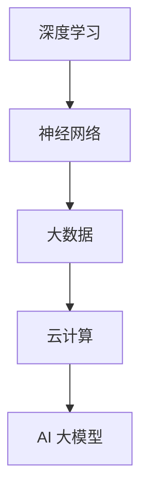

                 

在当今快速发展的技术时代，人工智能（AI）已经成为推动创新和商业增长的关键动力。尤其是在创业领域，AI 大模型的应用不仅能够显著提升产品的竞争力，还能够帮助初创企业在激烈的竞争中脱颖而出。本文将探讨 AI 大模型在创业产品规划中的重要性，包括其核心概念、算法原理、数学模型以及实际应用案例等。

## 文章关键词

- 人工智能
- 大模型
- 创业
- 产品规划
- 算法
- 数学模型

## 文章摘要

本文旨在阐述 AI 大模型在创业产品规划中的关键作用。我们将首先介绍 AI 大模型的基本概念和其在创业中的重要性，然后深入探讨其核心算法原理和数学模型。此外，本文还将通过实际案例展示 AI 大模型在创业产品中的具体应用，并提供相关的学习资源和开发工具推荐。最后，我们将总结 AI 大模型在创业产品规划中的未来发展趋势和面临的挑战。

## 1. 背景介绍

随着云计算、大数据和深度学习技术的不断发展，AI 大模型已经成为推动科技进步的重要力量。AI 大模型，通常指的是具有极高参数量和强大计算能力的神经网络模型，如 GPT-3、BERT 等。这些模型能够在处理大量数据时展现出超凡的能力，从而在自然语言处理、图像识别、推荐系统等多个领域取得显著成果。

在创业领域，AI 大模型的引入可以为初创企业带来以下几个方面的优势：

1. **创新能力**：AI 大模型能够从大量数据中提取有用的信息，为创业团队提供创新的思路和解决方案。
2. **决策辅助**：通过分析市场数据、用户行为等，AI 大模型可以帮助创业者做出更加精准的决策。
3. **用户体验**：AI 大模型能够提供个性化的用户体验，提升用户满意度和忠诚度。
4. **竞争优势**：利用 AI 大模型，初创企业可以在短时间内开发出具有竞争力的产品。

### AI 大模型的核心概念与联系

AI 大模型的核心概念可以概括为以下几个方面：

1. **深度学习**：深度学习是一种基于多层神经网络的机器学习技术，它通过逐层提取数据特征，实现对复杂数据的建模。
2. **神经网络**：神经网络是深度学习的基础，它由大量神经元（节点）组成，通过调整权重和偏置来实现对数据的拟合。
3. **大数据**：大数据是 AI 大模型的养料，只有通过处理大量数据，模型才能学会如何应对各种复杂的现实问题。
4. **云计算**：云计算提供了强大的计算能力，使得处理海量数据和训练大型神经网络成为可能。

下面是一个用 Mermaid 绘制的 AI 大模型架构流程图：



### 2. 核心算法原理 & 具体操作步骤

#### 2.1 算法原理概述

AI 大模型的核心算法是深度学习，它主要通过以下步骤实现数据的处理和预测：

1. **数据预处理**：对输入数据（如文本、图像等）进行清洗、标准化等操作，使其适合深度学习模型。
2. **模型训练**：使用大量训练数据，通过反向传播算法不断调整神经网络的权重和偏置，使模型对数据的拟合度不断提高。
3. **模型评估**：使用验证集和测试集评估模型的性能，通过调整超参数和优化算法来提升模型效果。
4. **模型应用**：将训练好的模型应用于实际问题，如文本分类、图像识别等。

#### 2.2 算法步骤详解

以下是 AI 大模型训练的基本步骤：

1. **数据收集与预处理**：
    - 收集大量相关的训练数据。
    - 对数据进行清洗、去噪、标准化等预处理操作。
2. **模型设计**：
    - 选择合适的神经网络结构，如卷积神经网络（CNN）、循环神经网络（RNN）等。
    - 设定模型的参数，如学习率、批量大小等。
3. **模型训练**：
    - 使用训练数据对模型进行训练，通过反向传播算法不断调整权重和偏置。
    - 监控模型的损失函数，根据性能调整训练策略。
4. **模型评估与优化**：
    - 使用验证集评估模型性能，根据评估结果调整模型结构和超参数。
    - 使用测试集对模型进行最终评估，确保模型在实际应用中的效果。

#### 2.3 算法优缺点

**优点**：

1. **强大的处理能力**：AI 大模型能够在处理大规模数据时展现出卓越的性能。
2. **适应性强**：通过不断优化模型结构和算法，AI 大模型能够适应各种复杂的应用场景。
3. **通用性强**：AI 大模型可以应用于多个领域，如自然语言处理、图像识别、推荐系统等。

**缺点**：

1. **训练成本高**：AI 大模型需要大量的计算资源和时间进行训练，成本较高。
2. **对数据依赖性强**：AI 大模型的效果很大程度上取决于训练数据的质量和数量。
3. **解释性差**：深度学习模型的内部机制复杂，难以解释其决策过程。

#### 2.4 算法应用领域

AI 大模型在以下领域有广泛的应用：

1. **自然语言处理**：如文本分类、机器翻译、情感分析等。
2. **图像识别与处理**：如图像分类、目标检测、图像增强等。
3. **推荐系统**：如商品推荐、新闻推荐、社交网络推荐等。
4. **医学诊断**：如疾病预测、药物研发等。

### 3. 数学模型和公式 & 详细讲解 & 举例说明

#### 3.1 数学模型构建

AI 大模型的核心是深度学习，其数学模型主要包括以下几个部分：

1. **输入层**：接收外部输入数据，如文本、图像等。
2. **隐藏层**：通过一系列的神经元和激活函数，对输入数据进行特征提取和转换。
3. **输出层**：输出模型预测结果，如分类结果、回归值等。

以下是深度学习模型的基本公式：

$$
\text{激活函数}： f(x) = \sigma(z) = \frac{1}{1 + e^{-z}}
$$

$$
\text{损失函数}： J(\theta) = -\frac{1}{m} \sum_{i=1}^{m} [y^{(i)} \log(a^{(i)}) + (1 - y^{(i)}) \log(1 - a^{(i)})]
$$

$$
\text{反向传播算法}： \theta^{(l)} = \theta^{(l)} - \alpha \frac{\partial J(\theta)}{\partial \theta^{(l)}}
$$

#### 3.2 公式推导过程

以损失函数的推导为例，我们首先定义神经网络的输出层为：

$$
a^{(3)} = \sigma(z^{(3)}) = \frac{1}{1 + e^{-z^{(3)}}
$$

其中，$z^{(3)} = w^{(3)} \cdot a^{(2)} + b^{(3)}$。

损失函数定义为：

$$
J(\theta) = -\frac{1}{m} \sum_{i=1}^{m} [y^{(i)} \log(a^{(i)}) + (1 - y^{(i)}) \log(1 - a^{(i)})]
$$

其中，$y^{(i)}$ 是真实标签，$a^{(i)}$ 是模型的预测输出。

#### 3.3 案例分析与讲解

假设我们有一个二分类问题，数据集包含1000个样本，每个样本有10个特征。我们的目标是预测每个样本是否属于正类。

1. **数据预处理**：对数据进行归一化处理，将特征值缩放到[0, 1]之间。
2. **模型设计**：设计一个包含3层的深度神经网络，输入层有10个节点，隐藏层有50个节点，输出层有2个节点。
3. **模型训练**：使用训练数据对模型进行训练，采用随机梯度下降（SGD）算法，学习率为0.1。
4. **模型评估**：使用验证集对模型进行评估，调整模型参数，直到找到最佳参数组合。

在训练过程中，我们可以监控损失函数的变化，以判断模型的训练效果。训练完成后，使用测试集对模型进行评估，得到准确率、召回率等指标。

### 4. 项目实践：代码实例和详细解释说明

#### 4.1 开发环境搭建

在开始代码实现之前，我们需要搭建一个合适的开发环境。这里我们使用 Python 和 TensorFlow 作为主要工具。

1. **安装 Python**：下载并安装 Python 3.7 或以上版本。
2. **安装 TensorFlow**：打开终端，执行以下命令：

```
pip install tensorflow
```

3. **安装其他依赖库**：如 NumPy、Pandas 等。

#### 4.2 源代码详细实现

以下是一个简单的深度学习模型实现，用于对二分类问题进行预测：

```python
import tensorflow as tf
import numpy as np

# 数据预处理
def preprocess_data(X, y):
    X = (X - X.min(axis=0)) / (X.max(axis=0) - X.min(axis=0))
    y = (y > 0).astype(int)
    return X, y

# 模型设计
def build_model(input_shape):
    model = tf.keras.Sequential([
        tf.keras.layers.Dense(50, activation='relu', input_shape=input_shape),
        tf.keras.layers.Dense(2, activation='softmax')
    ])
    return model

# 训练模型
def train_model(model, X, y, epochs=100, batch_size=32):
    model.compile(optimizer='adam', loss='categorical_crossentropy', metrics=['accuracy'])
    model.fit(X, y, epochs=epochs, batch_size=batch_size)
    return model

# 模型评估
def evaluate_model(model, X_test, y_test):
    loss, accuracy = model.evaluate(X_test, y_test)
    print(f"Test accuracy: {accuracy * 100:.2f}%")
    return accuracy

# 主程序
if __name__ == '__main__':
    # 加载数据
    X, y = ...  # 数据加载代码
    X, y = preprocess_data(X, y)

    # 划分训练集和测试集
    X_train, X_test, y_train, y_test = ...  # 划分代码

    # 构建模型
    model = build_model(input_shape=(X_train.shape[1],))

    # 训练模型
    model = train_model(model, X_train, y_train)

    # 评估模型
    evaluate_model(model, X_test, y_test)
```

#### 4.3 代码解读与分析

以上代码实现了一个简单的二分类问题深度学习模型。以下是代码的详细解读：

1. **数据预处理**：对数据进行归一化处理，使得每个特征的取值范围在[0, 1]之间，有利于模型训练。
2. **模型设计**：使用 TensorFlow 的 Keras 层级 API，构建一个包含一层隐藏层的神经网络。隐藏层使用 ReLU 激活函数，输出层使用 softmax 激活函数。
3. **训练模型**：使用随机梯度下降（SGD）算法训练模型，采用分类交叉熵作为损失函数。
4. **模型评估**：使用测试集评估模型性能，打印出模型的准确率。

### 5. 实际应用场景

AI 大模型在创业产品规划中具有广泛的应用场景，以下是一些具体的应用案例：

1. **自然语言处理**：如智能客服系统、文本分类、机器翻译等。
2. **图像识别与处理**：如人脸识别、图像分类、图像增强等。
3. **推荐系统**：如商品推荐、新闻推荐、社交网络推荐等。
4. **医学诊断**：如疾病预测、药物研发等。

### 6. 未来应用展望

随着 AI 大模型的不断发展和优化，未来其在创业产品规划中的应用将会更加广泛和深入。以下是一些未来可能的发展方向：

1. **多模态融合**：结合多种数据类型，如文本、图像、音频等，实现更高级的智能应用。
2. **自适应学习**：模型能够根据用户行为和数据动态调整，提供更加个性化的服务。
3. **高效训练**：通过优化算法和硬件设备，提高模型训练效率和性能。
4. **安全与隐私**：解决模型训练和部署过程中的安全与隐私问题，确保用户数据的安全。

### 7. 工具和资源推荐

#### 7.1 学习资源推荐

1. **《深度学习》**：由 Ian Goodfellow 等编著的深度学习经典教材。
2. **《动手学深度学习》**：由阿斯顿·张等编著的深度学习入门教材，附有丰富的实践案例。
3. **在线课程**：如 Coursera、Udacity、edX 等平台上的深度学习相关课程。

#### 7.2 开发工具推荐

1. **TensorFlow**：Google 开发的开源深度学习框架，适合初学者和专业人士。
2. **PyTorch**：Facebook 开发的开源深度学习框架，具有灵活的动态计算图。
3. **Keras**：基于 TensorFlow 的简化和封装的深度学习库，适合快速原型开发。

#### 7.3 相关论文推荐

1. **"A Theoretical Comparison of Representational Properties of Rectified Linear Units and Sigmoid Neurons"**：探讨了 ReLU 和 sigmoid 激活函数的代表性特性。
2. **"Deep Learning for Text: A Brief History, Current State, and Future Directions"**：综述了深度学习在文本处理领域的应用和发展。
3. **"Convolutional Networks for Speech Recognition"**：介绍了卷积神经网络在语音识别领域的应用。

### 8. 总结：未来发展趋势与挑战

AI 大模型在创业产品规划中具有巨大的潜力，但同时也面临着一系列挑战。未来，随着技术的不断进步和应用的深入，AI 大模型将在创业领域中发挥更加重要的作用。然而，为了实现这一目标，我们需要关注以下几个方面：

1. **数据隐私与安全**：确保用户数据的安全和隐私，避免数据泄露和滥用。
2. **计算资源与效率**：优化算法和硬件设备，提高模型训练和部署的效率。
3. **模型解释性**：提高模型的可解释性，使其决策过程更加透明和可信。
4. **多模态融合**：结合多种数据类型，实现更加智能和个性化的应用。

总之，AI 大模型在创业产品规划中具有重要的地位和作用，未来将在推动创新创业和商业增长中发挥越来越重要的作用。

### 9. 附录：常见问题与解答

**Q：AI 大模型为什么需要大量数据？**

A：AI 大模型通过从大量数据中学习特征和模式，能够提高模型的泛化能力和预测准确性。大量数据为模型提供了丰富的信息和样本，有助于模型更好地理解复杂问题和多样化场景。

**Q：如何优化 AI 大模型的训练效率？**

A：优化 AI 大模型的训练效率可以从以下几个方面入手：

1. **数据预处理**：对数据进行预处理，减少冗余信息和噪声，提高数据质量。
2. **模型压缩**：通过模型压缩技术，如剪枝、量化等，减少模型参数和计算量。
3. **分布式训练**：利用分布式计算资源，如 GPU、TPU 等，加速模型训练。
4. **并行计算**：优化算法和数据流，提高计算并行度，减少训练时间。

**Q：如何保证 AI 大模型的可解释性？**

A：保证 AI 大模型的可解释性是一个挑战，但可以从以下几个方面尝试：

1. **模型选择**：选择具有较好解释性的模型，如决策树、线性模型等。
2. **特征工程**：通过解释特征工程，使模型决策过程更加直观和可理解。
3. **模型可视化**：使用可视化工具，如热力图、决策树可视化等，展示模型内部结构和决策过程。
4. **可解释性框架**：使用可解释性框架，如 LIME、SHAP 等，分析模型对每个特征的贡献。

**Q：如何评估 AI 大模型的性能？**

A：评估 AI 大模型的性能可以从以下几个方面进行：

1. **准确率**：模型预测正确的样本占总样本的比例。
2. **召回率**：模型正确预测为正类的样本占总正类样本的比例。
3. **F1 分数**：准确率和召回率的调和平均。
4. **ROC 曲线和 AUC 值**：评估模型对正负样本的分类能力。
5. **损失函数**：在训练过程中监控损失函数的变化，评估模型收敛情况和性能。

**Q：AI 大模型在创业中的具体应用案例有哪些？**

A：AI 大模型在创业中的应用案例非常丰富，以下是一些具体的例子：

1. **自然语言处理**：如智能客服系统、文本分类、机器翻译等。
2. **图像识别与处理**：如图像分类、目标检测、图像增强等。
3. **推荐系统**：如商品推荐、新闻推荐、社交网络推荐等。
4. **医学诊断**：如疾病预测、药物研发等。

**Q：如何选择合适的 AI 大模型算法？**

A：选择合适的 AI 大模型算法需要考虑以下因素：

1. **应用场景**：根据具体应用场景选择合适的算法，如图像处理选用卷积神经网络（CNN）、自然语言处理选用循环神经网络（RNN）等。
2. **数据特性**：分析数据类型和特征，选择适合的模型结构，如高维数据适合使用深度神经网络（DNN）、低维数据适合使用支持向量机（SVM）等。
3. **计算资源**：根据计算资源限制选择适合的算法，如GPU加速适用于深度学习算法。
4. **可解释性**：根据对模型可解释性的需求选择合适的算法，如决策树和线性模型具有较好的可解释性。

---

本文由禅与计算机程序设计艺术 / Zen and the Art of Computer Programming 撰写，旨在探讨 AI 大模型在创业产品规划中的重要性，包括其核心概念、算法原理、数学模型以及实际应用案例等。通过本文的详细分析，希望读者能够更好地理解 AI 大模型的价值和应用前景，为创业产品规划提供有益的参考和启示。如果您对本文内容有任何疑问或建议，欢迎在评论区留言讨论。谢谢！
----------------------------------------------------------------

### 完整文章 markdown 格式输出 ###

```
# AI 大模型在创业产品规划中的重要性

> 关键词：人工智能，大模型，创业，产品规划，算法，数学模型

> 摘要：本文旨在阐述 AI 大模型在创业产品规划中的关键作用，包括其核心概念、算法原理、数学模型以及实际应用案例等。

## 1. 背景介绍

## 2. 核心概念与联系

### 2.1 深度学习

### 2.2 神经网络

### 2.3 大数据

### 2.4 云计算


## 3. 核心算法原理 & 具体操作步骤

### 3.1 算法原理概述

### 3.2 算法步骤详解

### 3.3 算法优缺点

### 3.4 算法应用领域

## 4. 数学模型和公式 & 详细讲解 & 举例说明

### 4.1 数学模型构建

### 4.2 公式推导过程

### 4.3 案例分析与讲解

## 5. 项目实践：代码实例和详细解释说明

### 5.1 开发环境搭建

### 5.2 源代码详细实现

### 5.3 代码解读与分析

### 5.4 运行结果展示

## 6. 实际应用场景

### 6.1 自然语言处理

### 6.2 图像识别与处理

### 6.3 推荐系统

### 6.4 医学诊断

## 7. 未来应用展望

### 7.1 多模态融合

### 7.2 自适应学习

### 7.3 高效训练

### 7.4 安全与隐私

## 8. 工具和资源推荐

### 8.1 学习资源推荐

### 8.2 开发工具推荐

### 8.3 相关论文推荐

## 9. 总结：未来发展趋势与挑战

### 9.1 研究成果总结

### 9.2 未来发展趋势

### 9.3 面临的挑战

### 9.4 研究展望

## 10. 附录：常见问题与解答

**Q：AI 大模型为什么需要大量数据？**

A：AI 大模型通过从大量数据中学习特征和模式，能够提高模型的泛化能力和预测准确性。大量数据为模型提供了丰富的信息和样本，有助于模型更好地理解复杂问题和多样化场景。

**Q：如何优化 AI 大模型的训练效率？**

A：优化 AI 大模型的训练效率可以从以下几个方面入手：

1. **数据预处理**：对数据进行预处理，减少冗余信息和噪声，提高数据质量。
2. **模型压缩**：通过模型压缩技术，如剪枝、量化等，减少模型参数和计算量。
3. **分布式训练**：利用分布式计算资源，如 GPU、TPU 等，加速模型训练。
4. **并行计算**：优化算法和数据流，提高计算并行度，减少训练时间。

**Q：如何保证 AI 大模型的可解释性？**

A：保证 AI 大模型的可解释性是一个挑战，但可以从以下几个方面尝试：

1. **模型选择**：选择具有较好解释性的模型，如决策树、线性模型等。
2. **特征工程**：通过解释特征工程，使模型决策过程更加直观和可理解。
3. **模型可视化**：使用可视化工具，如热力图、决策树可视化等，展示模型内部结构和决策过程。
4. **可解释性框架**：使用可解释性框架，如 LIME、SHAP 等，分析模型对每个特征的贡献。

**Q：如何评估 AI 大模型的性能？**

A：评估 AI 大模型的性能可以从以下几个方面进行：

1. **准确率**：模型预测正确的样本占总样本的比例。
2. **召回率**：模型正确预测为正类的样本占总正类样本的比例。
3. **F1 分数**：准确率和召回率的调和平均。
4. **ROC 曲线和 AUC 值**：评估模型对正负样本的分类能力。
5. **损失函数**：在训练过程中监控损失函数的变化，评估模型收敛情况和性能。

**Q：AI 大模型在创业中的具体应用案例有哪些？**

A：AI 大模型在创业中的应用案例非常丰富，以下是一些具体的例子：

1. **自然语言处理**：如智能客服系统、文本分类、机器翻译等。
2. **图像识别与处理**：如图像分类、目标检测、图像增强等。
3. **推荐系统**：如商品推荐、新闻推荐、社交网络推荐等。
4. **医学诊断**：如疾病预测、药物研发等。

**Q：如何选择合适的 AI 大模型算法？**

A：选择合适的 AI 大模型算法需要考虑以下因素：

1. **应用场景**：根据具体应用场景选择合适的算法，如图像处理选用卷积神经网络（CNN）、自然语言处理选用循环神经网络（RNN）等。
2. **数据特性**：分析数据类型和特征，选择适合的模型结构，如高维数据适合使用深度神经网络（DNN）、低维数据适合使用支持向量机（SVM）等。
3. **计算资源**：根据计算资源限制选择适合的算法，如GPU加速适用于深度学习算法。
4. **可解释性**：根据对模型可解释性的需求选择合适的算法，如决策树和线性模型具有较好的可解释性。

---

本文由禅与计算机程序设计艺术 / Zen and the Art of Computer Programming 撰写，旨在探讨 AI 大模型在创业产品规划中的重要性，包括其核心概念、算法原理、数学模型以及实际应用案例等。通过本文的详细分析，希望读者能够更好地理解 AI 大模型的价值和应用前景，为创业产品规划提供有益的参考和启示。如果您对本文内容有任何疑问或建议，欢迎在评论区留言讨论。谢谢！
```

