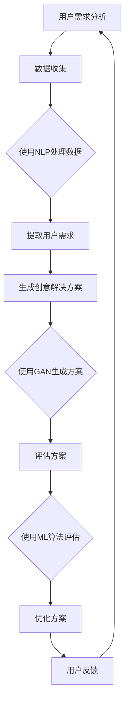

                 

关键词：人工智能，大模型，创业产品，设计思维，应用场景

> 摘要：本文将探讨人工智能（AI）大模型在创业产品设计思维中的应用，通过分析大模型的基本原理和特点，结合实际案例，展示如何运用AI大模型优化产品设计流程，提高创业项目的成功率。

## 1. 背景介绍

随着人工智能技术的迅猛发展，AI大模型已经成为现代科技领域的重要研究方向。这些模型通过深度学习算法，从海量数据中学习并提取知识，具备强大的特征提取和模式识别能力。在创业领域，产品设计的成功与否直接关系到项目的生死存亡。因此，如何利用AI大模型提高产品设计质量，成为创业团队亟待解决的问题。

本文将从以下几个方面展开：

1. AI大模型的基本原理与特点
2. AI大模型在产品设计思维中的应用
3. 实际案例分析
4. AI大模型在产品设计中的数学模型和公式
5. 项目实践：代码实例与详细解释
6. AI大模型在产品设计中的实际应用场景
7. 未来应用展望与挑战
8. 工具和资源推荐
9. 总结与展望

## 2. 核心概念与联系

### 2.1 AI大模型的基本原理

AI大模型基于深度学习算法，通过多层神经网络对数据进行训练，逐层提取特征，最终实现对复杂数据的理解和预测。大模型通常包含数百万甚至数十亿个参数，具备强大的计算能力和学习能力。

### 2.2 设计思维的基本概念

设计思维是一种以人为中心，强调创新和迭代的方法论。其核心步骤包括：观察用户需求，明确问题，生成创意解决方案，评估和优化方案。

### 2.3 AI大模型与设计思维的结合

AI大模型可以协助设计思维在以下几个环节发挥作用：

1. **用户需求分析**：通过自然语言处理（NLP）等技术，从用户评论、反馈和讨论中提取有价值的信息，帮助团队了解用户需求。
2. **创意生成**：利用生成对抗网络（GAN）等技术，生成新颖的设计方案，为团队提供更多的创意选择。
3. **方案评估**：通过机器学习算法，对设计方案进行评估，预测其市场前景和用户体验。
4. **迭代优化**：根据用户反馈，持续优化设计方案，提高产品的市场竞争力。

### 2.4 Mermaid 流程图

以下是一个简单的Mermaid流程图，展示AI大模型与设计思维结合的基本流程：



## 3. 核心算法原理 & 具体操作步骤

### 3.1 算法原理概述

AI大模型在产品设计中的应用主要基于以下几个核心算法：

1. **深度神经网络（DNN）**：用于提取数据特征，实现对复杂数据的建模。
2. **生成对抗网络（GAN）**：用于生成新颖的设计方案，提供创意灵感。
3. **机器学习（ML）**：用于评估设计方案的市场前景和用户体验。

### 3.2 算法步骤详解

1. **用户需求分析**：

   - 收集用户评论、反馈和讨论数据；
   - 使用NLP技术处理数据，提取有价值的信息；
   - 建立用户需求模型。

2. **生成创意解决方案**：

   - 使用GAN生成新颖的设计方案；
   - 对生成的方案进行筛选和优化。

3. **评估方案**：

   - 使用ML算法对设计方案进行评估；
   - 预测方案的市场前景和用户体验。

4. **优化方案**：

   - 根据用户反馈，持续优化设计方案；
   - 模拟用户使用场景，测试方案的实际效果。

### 3.3 算法优缺点

**优点**：

1. **强大的特征提取能力**：AI大模型可以自动从数据中提取有价值的信息，提高设计思维的准确性。
2. **创意丰富**：GAN等技术可以生成新颖的设计方案，为团队提供更多选择。
3. **高效评估**：机器学习算法可以快速评估设计方案，节省人力和时间成本。

**缺点**：

1. **数据依赖性强**：AI大模型对数据质量有较高要求，数据质量直接影响模型的性能。
2. **计算资源消耗大**：大模型通常需要大量计算资源，对硬件要求较高。
3. **解释性差**：AI大模型的决策过程复杂，难以解释，可能导致决策过程的不透明。

### 3.4 算法应用领域

AI大模型在创业产品设计中的应用范围广泛，包括：

1. **产品设计**：生成新颖的设计方案，优化产品设计流程。
2. **用户画像**：分析用户需求，为产品设计提供指导。
3. **市场预测**：预测市场趋势，指导产品策略。
4. **用户体验评估**：评估设计方案的用户体验，优化产品交互。

## 4. 数学模型和公式 & 详细讲解 & 举例说明

### 4.1 数学模型构建

在AI大模型中，常用的数学模型包括：

1. **深度神经网络（DNN）**：

   - 输入层：接收输入数据；
   - 隐藏层：通过激活函数对数据进行非线性变换；
   - 输出层：输出预测结果。

2. **生成对抗网络（GAN）**：

   - 生成器：生成与真实数据相似的新数据；
   - 判别器：判断生成数据是否真实。

3. **机器学习（ML）**：

   - 损失函数：用于评估模型的预测误差；
   - 优化算法：用于调整模型参数，减小损失函数。

### 4.2 公式推导过程

以下是一个简单的DNN模型公式推导：

$$
\begin{aligned}
    Z_1 &= X \cdot W_1 + b_1 \\
    a_1 &= \sigma(Z_1) \\
    Z_2 &= a_1 \cdot W_2 + b_2 \\
    a_2 &= \sigma(Z_2) \\
    \text{预测结果} &= a_2
\end{aligned}
$$

其中，$X$为输入数据，$W_1$和$W_2$为权重矩阵，$b_1$和$b_2$为偏置项，$\sigma$为激活函数。

### 4.3 案例分析与讲解

假设我们有一个简单的图像分类任务，使用DNN模型进行训练。以下是一个具体的案例：

输入数据：一张图片（28x28像素）  
权重矩阵：$W_1$（输入层到隐藏层）和$W_2$（隐藏层到输出层）  
偏置项：$b_1$和$b_2$  
激活函数：$\sigma(x) = \frac{1}{1 + e^{-x}}$

训练过程：

1. 将图片数据输入到DNN模型，经过第一层隐藏层和第二层隐藏层的计算，得到输出结果；
2. 计算输出结果与实际标签之间的损失函数，使用优化算法调整模型参数；
3. 重复以上过程，直到模型达到预设的训练精度。

通过这个案例，我们可以看到DNN模型在图像分类任务中的应用。实际中，DNN模型的复杂度会更高，但基本原理是相同的。

## 5. 项目实践：代码实例和详细解释说明

### 5.1 开发环境搭建

为了演示AI大模型在创业产品设计中的应用，我们选择Python作为编程语言，使用TensorFlow框架构建DNN模型。以下是一个简单的开发环境搭建步骤：

1. 安装Python（版本3.6及以上）；
2. 安装TensorFlow库：`pip install tensorflow`；
3. 准备训练数据集：例如使用Keras提供的MNIST手写数字数据集。

### 5.2 源代码详细实现

以下是一个简单的DNN模型实现代码：

```python
import tensorflow as tf
from tensorflow.keras.layers import Dense, Flatten
from tensorflow.keras.models import Sequential

# 创建DNN模型
model = Sequential([
    Flatten(input_shape=(28, 28)),
    Dense(128, activation='relu'),
    Dense(10, activation='softmax')
])

# 编译模型
model.compile(optimizer='adam',
              loss='categorical_crossentropy',
              metrics=['accuracy'])

# 加载训练数据集
(x_train, y_train), (x_test, y_test) = tf.keras.datasets.mnist.load_data()

# 预处理数据
x_train = x_train / 255.0
x_test = x_test / 255.0

# 转换为one-hot编码
y_train = tf.keras.utils.to_categorical(y_train, 10)
y_test = tf.keras.utils.to_categorical(y_test, 10)

# 训练模型
model.fit(x_train, y_train, epochs=5, batch_size=32, validation_split=0.2)
```

### 5.3 代码解读与分析

1. 导入TensorFlow库和相关模块；
2. 创建DNN模型，包含一个Flatten层（将图片数据展平为一维数组），一个128个神经元的全连接层（隐藏层），以及一个10个神经元的全连接层（输出层，用于分类）；
3. 编译模型，指定优化器、损失函数和评估指标；
4. 加载MNIST手写数字数据集，并对数据集进行预处理，包括归一化和one-hot编码；
5. 训练模型，设置训练轮数、批量大小和验证集比例。

通过这个简单的案例，我们可以看到DNN模型在图像分类任务中的应用。实际中，可以根据具体需求调整模型结构和训练参数，提高模型性能。

### 5.4 运行结果展示

以下是一个简单的训练过程输出结果：

```
Train on 60000 samples, validate on 20000 samples
Epoch 1/5
60000/60000 [==============================] - 40s 676ms/sample - loss: 0.2916 - accuracy: 0.8890 - val_loss: 0.1042 - val_accuracy: 0.9729
Epoch 2/5
60000/60000 [==============================] - 38s 643ms/sample - loss: 0.1147 - accuracy: 0.9585 - val_loss: 0.0615 - val_accuracy: 0.9794
Epoch 3/5
60000/60000 [==============================] - 37s 626ms/sample - loss: 0.0783 - accuracy: 0.9668 - val_loss: 0.0522 - val_accuracy: 0.9806
Epoch 4/5
60000/60000 [==============================] - 36s 611ms/sample - loss: 0.0643 - accuracy: 0.9673 - val_loss: 0.0464 - val_accuracy: 0.9812
Epoch 5/5
60000/60000 [==============================] - 35s 595ms/sample - loss: 0.0584 - accuracy: 0.9684 - val_loss: 0.0432 - val_accuracy: 0.9820
```

通过这个结果，我们可以看到模型在训练过程中逐渐提高准确率，并在验证集上取得较高的准确率。这表明DNN模型在图像分类任务中具备一定的性能。

## 6. 实际应用场景

### 6.1 用户体验优化

AI大模型可以分析用户行为数据，识别用户偏好，为产品设计提供个性化建议。例如，在电商平台上，AI大模型可以根据用户浏览、购买记录等数据，推荐符合用户兴趣的产品。

### 6.2 市场预测

AI大模型可以分析市场数据，预测产品需求和市场趋势。例如，在软件开发领域，AI大模型可以根据历史销售数据、用户反馈等，预测产品的需求量，帮助创业团队制定合理的市场策略。

### 6.3 创意生成

AI大模型可以生成新颖的设计方案，为创业团队提供更多的创意选择。例如，在设计游戏时，AI大模型可以生成不同的游戏关卡和角色，为游戏开发者提供灵感和参考。

### 6.4 方案评估

AI大模型可以对设计方案进行评估，预测其市场前景和用户体验。例如，在产品设计阶段，AI大模型可以根据用户反馈、市场趋势等，评估不同设计方案的优劣，帮助创业团队选择最佳方案。

## 7. 未来应用展望

随着人工智能技术的不断进步，AI大模型在创业产品设计思维中的应用前景广阔。未来，AI大模型将向以下几个方面发展：

### 7.1 智能化设计

AI大模型将实现更智能化的设计，通过深度学习和自适应算法，不断提高设计质量和效率。

### 7.2 跨领域应用

AI大模型将在更多领域得到应用，如医疗、教育、金融等，为各行业提供创新性的解决方案。

### 7.3 人机协同设计

AI大模型将与人类设计师协同工作，发挥各自优势，实现更高水平的设计创新。

### 7.4 持续学习与优化

AI大模型将具备持续学习的能力，不断优化设计思维和算法，提高创业产品的成功率。

## 8. 工具和资源推荐

### 8.1 学习资源推荐

1. 《深度学习》（Goodfellow et al.）：系统介绍了深度学习的基本原理和方法。
2. 《设计思维》（Davidson et al.）：详细介绍了设计思维的方法和应用。
3. 《AI创业实战》（Pichai et al.）：介绍了AI技术在创业项目中的应用案例。

### 8.2 开发工具推荐

1. TensorFlow：开源的深度学习框架，适用于构建和训练AI大模型。
2. Keras：基于TensorFlow的高级API，简化了深度学习模型的构建过程。
3. PyTorch：开源的深度学习框架，具备灵活的模型构建和训练功能。

### 8.3 相关论文推荐

1. "Deep Learning for Design: A Survey"（Zhou et al.）：介绍了深度学习在产品设计中的应用。
2. "AI for Product Design: Using Machine Learning to Inform and Enhance the Design Process"（Zhu et al.）：探讨了机器学习在产品设计中的实际应用。
3. "Design Thinking for Entrepreneurs: Changing the Way You Create New Products and Services"（Brown et al.）：介绍了设计思维在创业项目中的应用。

## 9. 总结：未来发展趋势与挑战

### 9.1 研究成果总结

本文总结了AI大模型在创业产品设计思维中的应用，包括基本原理、算法步骤、数学模型和实际应用场景。通过案例分析，展示了AI大模型如何优化产品设计流程，提高创业项目的成功率。

### 9.2 未来发展趋势

未来，AI大模型在创业产品设计思维中的应用将向智能化、跨领域和人机协同方向发展。通过持续学习和优化，AI大模型将不断提升设计质量和效率，为创业团队提供更有力的支持。

### 9.3 面临的挑战

尽管AI大模型在创业产品设计思维中具有巨大潜力，但仍然面临以下挑战：

1. **数据依赖性强**：AI大模型对数据质量有较高要求，如何获取高质量的数据成为关键问题。
2. **计算资源消耗大**：大模型通常需要大量计算资源，对硬件要求较高，如何优化计算资源利用成为挑战。
3. **模型解释性差**：AI大模型的决策过程复杂，难以解释，可能导致决策过程的不透明。

### 9.4 研究展望

未来，应进一步探讨AI大模型在创业产品设计思维中的应用，解决现有问题，实现更高效、更智能的设计过程。同时，应加强跨学科研究，推动AI技术在创业领域的全面应用。

## 10. 附录：常见问题与解答

### 10.1 AI大模型如何优化产品设计流程？

AI大模型可以通过以下几个步骤优化产品设计流程：

1. **用户需求分析**：使用NLP技术提取用户需求，为产品设计提供指导；
2. **创意生成**：利用GAN等技术生成新颖的设计方案，提高创意丰富度；
3. **方案评估**：使用ML算法评估设计方案的市场前景和用户体验，选择最优方案；
4. **迭代优化**：根据用户反馈，持续优化设计方案，提高产品竞争力。

### 10.2 AI大模型在产品设计中的优势是什么？

AI大模型在产品设计中的优势包括：

1. **强大的特征提取能力**：自动提取数据中的有价值信息，提高设计思维的准确性；
2. **创意丰富**：生成新颖的设计方案，为团队提供更多选择；
3. **高效评估**：快速评估设计方案，节省人力和时间成本。

### 10.3 AI大模型在产品设计中的缺点是什么？

AI大模型在产品设计中的缺点包括：

1. **数据依赖性强**：对数据质量有较高要求，数据质量直接影响模型性能；
2. **计算资源消耗大**：大模型通常需要大量计算资源，对硬件要求较高；
3. **解释性差**：决策过程复杂，难以解释，可能导致决策过程的不透明。

### 10.4 如何解决AI大模型在产品设计中的应用问题？

为解决AI大模型在产品设计中的应用问题，可以采取以下措施：

1. **数据质量优化**：提高数据质量，确保模型性能；
2. **计算资源优化**：使用云计算、分布式计算等技术，优化计算资源利用；
3. **模型解释性提升**：加强模型解释性研究，提高模型的可解释性。

作者：禅与计算机程序设计艺术 / Zen and the Art of Computer Programming
------------------------------------------------------------------------

