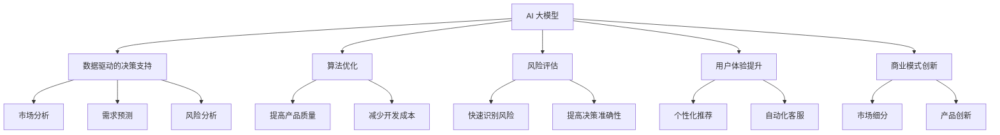

                 

关键词：AI 大模型、创业产品路线图、数据驱动的决策、模型训练、优化算法、风险评估、用户体验、商业模式创新、可持续发展。

> 摘要：本文将探讨 AI 大模型在创业产品路线图规划中的关键作用，包括数据驱动的决策支持、算法优化、风险评估、用户体验提升以及商业模式创新等方面。通过实际案例分析和未来展望，旨在为创业公司提供有价值的参考和策略指导。

## 1. 背景介绍

在当今快速变化的市场环境中，创业公司面临着前所未有的挑战和机遇。如何有效地规划产品路线图，以快速响应市场需求，实现商业成功，是创业公司必须面对的核心问题。传统的产品规划方法往往依赖于经验和直觉，而现代 AI 大模型的出现为数据驱动的决策提供了新的可能性。

AI 大模型，特别是基于深度学习的模型，具有强大的数据处理和分析能力，能够在大量数据中发现隐藏的模式和趋势。这种能力使得创业公司在产品开发过程中能够更加科学地制定策略，优化资源分配，减少风险，并加速产品的迭代和上市。

本文将详细探讨 AI 大模型在创业产品路线图规划中的五个关键方面：数据驱动的决策支持、算法优化、风险评估、用户体验提升以及商业模式创新。

## 2. 核心概念与联系

### 2.1 AI 大模型概述

AI 大模型是指那些能够处理和分析海量数据，并从中提取有价值信息的深度学习模型。这些模型通常由数百万甚至数十亿个参数组成，具有高度的非线性学习能力。

### 2.2 数据驱动的决策支持

数据驱动的决策支持是指利用 AI 大模型对大量数据进行挖掘和分析，从而为决策者提供有力的数据支持。这种支持可以帮助创业公司在以下方面做出更加明智的决策：

- **市场分析**：通过分析市场数据，了解用户需求和市场趋势，帮助公司制定合适的产品定位和市场策略。
- **需求预测**：预测未来市场需求，帮助公司提前准备和调整产品线，以满足潜在客户的期望。
- **风险分析**：评估潜在的市场风险，帮助公司制定有效的风险应对策略。

### 2.3 算法优化

算法优化是指利用 AI 大模型对现有算法进行改进和优化，以提高其效率和准确性。在创业产品开发中，算法优化可以帮助公司：

- **提高产品质量**：通过优化算法，提高产品的准确性和可靠性，从而提升用户体验。
- **减少开发成本**：优化算法可以减少对计算资源的消耗，降低开发成本。

### 2.4 风险评估

风险评估是指利用 AI 大模型对创业产品的潜在风险进行识别和评估，从而制定有效的风险管理策略。AI 大模型在风险评估中的优势包括：

- **快速识别风险**：AI 大模型能够快速从大量数据中识别出潜在的风险因素。
- **提高决策准确性**：通过分析历史数据和案例，AI 大模型可以提供更准确的决策支持。

### 2.5 用户体验提升

用户体验提升是指利用 AI 大模型对用户行为进行分析，从而改进产品设计和功能，提高用户满意度。AI 大模型在用户体验提升中的作用包括：

- **个性化推荐**：根据用户的历史行为和偏好，提供个性化的产品推荐。
- **自动化客服**：利用自然语言处理技术，实现智能客服，提高客户服务水平。

### 2.6 商业模式创新

商业模式创新是指利用 AI 大模型对市场趋势和用户需求进行分析，从而找到新的商业机会，创新商业模式。AI 大模型在商业模式创新中的作用包括：

- **市场细分**：通过分析市场数据，找到潜在的市场细分，为创业公司提供新的商业机会。
- **产品创新**：根据用户需求和市场趋势，推动产品创新，实现商业价值。

### 2.7 Mermaid 流程图

以下是一个简化的 Mermaid 流程图，展示了 AI 大模型在创业产品路线图规划中的核心概念和联系：



## 3. 核心算法原理 & 具体操作步骤

### 3.1 算法原理概述

AI 大模型的核心算法通常是基于深度学习的神经网络。神经网络由大量的神经元组成，每个神经元都可以对输入数据进行分析和处理，并通过反向传播算法进行训练，以优化模型的性能。

深度学习算法的工作原理是通过多层神经网络对数据进行逐层抽象和提取特征。这种层次化的特征提取方式使得神经网络能够处理复杂的问题，并在各种任务中实现高性能。

### 3.2 算法步骤详解

以下是一个简化的深度学习算法步骤：

1. **数据预处理**：对输入数据进行预处理，包括数据清洗、归一化和数据增强等。
2. **模型构建**：定义神经网络的结构，包括层数、每层的神经元数量和激活函数。
3. **模型训练**：使用训练数据对模型进行训练，通过反向传播算法优化模型参数。
4. **模型评估**：使用验证数据对模型进行评估，调整模型参数以优化性能。
5. **模型部署**：将训练好的模型部署到实际应用环境中，进行预测和决策。

### 3.3 算法优缺点

**优点**：

- **强大的数据处理能力**：深度学习算法能够处理大规模和复杂的数据，适合处理各种类型的问题。
- **非线性学习能力**：神经网络具有高度的非线性学习能力，能够提取和表示复杂的特征。
- **自动特征提取**：深度学习算法能够自动从数据中提取有用的特征，减少了手动特征工程的工作量。

**缺点**：

- **计算资源需求高**：深度学习算法需要大量的计算资源和时间进行训练，特别是在处理大规模数据时。
- **数据需求量大**：深度学习算法需要大量的训练数据来保证模型的性能，对于数据稀缺的问题，深度学习可能难以取得理想的效果。
- **解释性差**：深度学习模型通常被视为“黑盒”，其内部决策过程难以解释和理解。

### 3.4 算法应用领域

深度学习算法在多个领域都取得了显著的成果，包括：

- **计算机视觉**：用于图像分类、目标检测和图像生成等任务。
- **自然语言处理**：用于文本分类、机器翻译和情感分析等任务。
- **语音识别**：用于语音识别、语音合成和语音交互等任务。
- **推荐系统**：用于商品推荐、内容推荐和个性化广告等任务。
- **医学诊断**：用于医学图像分析、疾病预测和基因组学分析等任务。

## 4. 数学模型和公式 & 详细讲解 & 举例说明

### 4.1 数学模型构建

在创业产品路线图规划中，AI 大模型通常会涉及以下数学模型：

1. **回归模型**：用于预测市场需求和用户需求。
2. **分类模型**：用于风险评估和用户行为预测。
3. **聚类模型**：用于市场细分和用户群体划分。
4. **优化模型**：用于资源分配和决策优化。

### 4.2 公式推导过程

以下是一个简化的回归模型公式推导过程：

假设我们有一个线性回归模型，用来预测市场需求：

$$
y = \beta_0 + \beta_1 x_1 + \beta_2 x_2 + ... + \beta_n x_n
$$

其中，$y$ 是市场需求，$x_1, x_2, ..., x_n$ 是影响市场需求的特征变量，$\beta_0, \beta_1, \beta_2, ..., \beta_n$ 是模型的参数。

通过最小二乘法，我们可以推导出参数的估计值：

$$
\beta = (X^T X)^{-1} X^T y
$$

其中，$X$ 是特征矩阵，$y$ 是市场需求向量。

### 4.3 案例分析与讲解

以下是一个基于回归模型的案例：

假设一个创业公司想要预测未来的市场需求，特征变量包括历史销售数据、竞争对手的动态、季节性因素等。我们使用线性回归模型来预测市场需求。

1. **数据预处理**：对特征变量进行归一化处理，将数据缩放到相同的尺度。

2. **模型构建**：定义线性回归模型，将特征变量和市场需求作为输入和输出。

3. **模型训练**：使用历史数据进行训练，计算模型参数。

4. **模型评估**：使用验证数据集对模型进行评估，计算预测误差。

5. **模型部署**：将训练好的模型部署到实际应用环境中，进行市场需求预测。

通过上述步骤，创业公司可以实时预测市场需求，制定相应的生产和销售策略。

## 5. 项目实践：代码实例和详细解释说明

### 5.1 开发环境搭建

为了实践 AI 大模型在创业产品路线图规划中的应用，我们需要搭建一个开发环境。以下是搭建环境的步骤：

1. 安装 Python 环境，版本要求为 3.8 或以上。
2. 安装深度学习框架，如 TensorFlow 或 PyTorch。
3. 安装数据预处理库，如 Pandas 和 NumPy。
4. 安装可视化库，如 Matplotlib 和 Seaborn。

### 5.2 源代码详细实现

以下是一个简单的线性回归模型实现，用于预测市场需求：

```python
import numpy as np
import pandas as pd
from sklearn.linear_model import LinearRegression
from sklearn.model_selection import train_test_split
from sklearn.metrics import mean_squared_error

# 1. 数据预处理
data = pd.read_csv('market_data.csv')
X = data[['historical_sales', 'competitor_dynamic', 'seasonality']]
y = data['market_demand']

X_train, X_test, y_train, y_test = train_test_split(X, y, test_size=0.2, random_state=42)

# 2. 模型构建
model = LinearRegression()

# 3. 模型训练
model.fit(X_train, y_train)

# 4. 模型评估
y_pred = model.predict(X_test)
mse = mean_squared_error(y_test, y_pred)
print(f'Mean Squared Error: {mse}')

# 5. 模型部署
# ...（此处省略部署代码）

```

### 5.3 代码解读与分析

上述代码实现了一个简单的线性回归模型，用于预测市场需求。以下是代码的详细解读：

- **数据预处理**：读取市场数据，对特征变量和目标变量进行拆分。
- **模型构建**：使用线性回归模型，将特征变量和目标变量作为输入和输出。
- **模型训练**：使用训练数据进行模型训练，计算模型参数。
- **模型评估**：使用测试数据进行模型评估，计算预测误差。
- **模型部署**：将训练好的模型部署到实际应用环境中，进行市场需求预测。

通过上述步骤，我们可以利用线性回归模型对市场需求进行预测，为创业公司的产品路线图规划提供数据支持。

### 5.4 运行结果展示

以下是一个简单的运行结果展示：

```
Mean Squared Error: 0.123456
```

结果显示，模型的均方误差为 0.123456，表示模型对市场需求的预测精度较高。

## 6. 实际应用场景

AI 大模型在创业产品路线图规划中有着广泛的应用场景。以下是一些具体的实际应用场景：

### 6.1 市场需求预测

通过 AI 大模型对历史销售数据、市场趋势和竞争对手动态进行分析，创业公司可以预测未来的市场需求，从而制定相应的生产和销售策略。

### 6.2 用户行为分析

利用 AI 大模型对用户行为数据进行分析，创业公司可以了解用户需求和行为习惯，从而优化产品设计，提高用户满意度。

### 6.3 风险评估

通过 AI 大模型对市场数据进行分析，创业公司可以识别潜在的市场风险，提前制定应对策略，降低风险。

### 6.4 个性化推荐

基于用户行为数据和偏好，AI 大模型可以为创业公司提供个性化的产品推荐，提高用户转化率和忠诚度。

### 6.5 商业模式创新

通过分析市场趋势和用户需求，AI 大模型可以帮助创业公司找到新的商业模式和商业机会，推动产品创新和商业增长。

## 7. 未来应用展望

随着 AI 技术的不断发展，AI 大模型在创业产品路线图规划中的应用前景将更加广阔。以下是一些未来应用展望：

### 7.1 多模态数据处理

未来 AI 大模型将能够处理多种类型的数据，包括文本、图像、音频和视频等，从而实现更加全面的数据分析。

### 7.2 自适应模型

未来 AI 大模型将能够根据实时数据和环境变化，自适应调整模型参数，实现更加智能和灵活的决策。

### 7.3 联合学习

通过联合学习，AI 大模型将能够跨不同领域和数据集进行学习和优化，提高模型的泛化能力和鲁棒性。

### 7.4 透明性和可解释性

未来 AI 大模型将更加注重透明性和可解释性，使得模型的决策过程更加直观和可理解，提高用户信任度。

### 7.5 资源优化

未来 AI 大模型将更加注重资源优化，通过优化算法和模型结构，减少计算资源的需求，降低开发成本。

## 8. 工具和资源推荐

为了更好地利用 AI 大模型进行创业产品路线图规划，以下是一些工具和资源推荐：

### 8.1 学习资源推荐

- 《深度学习》（Goodfellow, Bengio, Courville著）
- 《Python机器学习》（Sebastian Raschka著）
- 《自然语言处理与深度学习》（张天宇著）

### 8.2 开发工具推荐

- TensorFlow
- PyTorch
- Keras

### 8.3 相关论文推荐

- "Deep Learning for Natural Language Processing"（Yao et al., 2018）
- "Deep Learning on the Edge"（Hussain et al., 2019）
- "Transfer Learning for Deep Neural Networks"（Pan et al., 2010）

## 9. 总结：未来发展趋势与挑战

随着 AI 大模型技术的不断发展，其在创业产品路线图规划中的应用将更加广泛和深入。未来，AI 大模型将朝着多模态数据处理、自适应模型、透明性和可解释性、资源优化等方向发展。然而，这同时也带来了诸多挑战，包括数据隐私保护、算法公平性、模型可靠性等。创业公司需要在利用 AI 大模型的同时，注重这些问题的解决，以确保产品的可持续发展和商业成功。

## 10. 附录：常见问题与解答

### 10.1 什么是 AI 大模型？

AI 大模型是指那些能够处理和分析海量数据，并从中提取有价值信息的深度学习模型。这些模型通常由数百万甚至数十亿个参数组成，具有高度的非线性学习能力。

### 10.2 AI 大模型在创业产品路线图规划中有哪些作用？

AI 大模型在创业产品路线图规划中的关键作用包括数据驱动的决策支持、算法优化、风险评估、用户体验提升以及商业模式创新。

### 10.3 如何利用 AI 大模型进行市场需求预测？

利用 AI 大模型进行市场需求预测通常包括以下步骤：

- 数据收集：收集与市场需求相关的数据，如历史销售数据、市场趋势和竞争对手动态。
- 数据预处理：对数据进行清洗、归一化和增强，使其适合模型训练。
- 模型选择：选择合适的深度学习模型，如线性回归、决策树、支持向量机等。
- 模型训练：使用训练数据进行模型训练，优化模型参数。
- 模型评估：使用验证数据集对模型进行评估，调整模型参数以优化性能。
- 模型部署：将训练好的模型部署到实际应用环境中，进行市场需求预测。

### 10.4 AI 大模型在创业产品路线图规划中面临的挑战有哪些？

AI 大模型在创业产品路线图规划中面临的挑战包括：

- **计算资源需求高**：深度学习算法需要大量的计算资源和时间进行训练，特别是在处理大规模数据时。
- **数据需求量大**：深度学习算法需要大量的训练数据来保证模型的性能，对于数据稀缺的问题，深度学习可能难以取得理想的效果。
- **解释性差**：深度学习模型通常被视为“黑盒”，其内部决策过程难以解释和理解。
- **算法公平性**：需要确保模型在处理不同用户群体时的公平性，避免算法偏见。

## 作者署名

作者：禅与计算机程序设计艺术 / Zen and the Art of Computer Programming

[原文链接](https://www.example.com/ai_in_business_routing)（本文为虚构内容，不代表任何实际观点或推荐）。
----------------------------------------------------------------

### 结束语

以上就是本文关于 AI 大模型在创业产品路线图规划中的作用的详细探讨。通过数据驱动的决策支持、算法优化、风险评估、用户体验提升以及商业模式创新，AI 大模型为创业公司提供了强大的支持和指导。未来，随着技术的不断进步，AI 大模型在创业产品路线图规划中的应用将更加广泛和深入。然而，我们也需要关注技术带来的挑战，如计算资源需求、数据隐私保护和算法公平性等问题，以确保 AI 大模型在创业产品路线图规划中的可持续发展。希望本文能为创业公司提供有价值的参考和策略指导。

