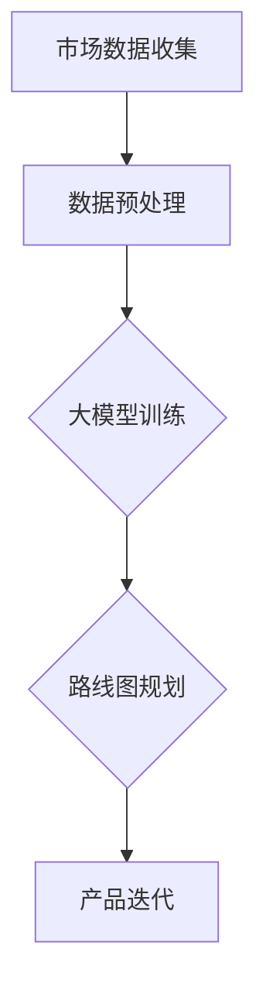

                 

关键词：人工智能，创业产品，路线图规划，大模型，创新策略

> 摘要：本文旨在探讨人工智能大模型在创业产品路线图规划中的应用，分析其优势与创新策略，并提供具体的数学模型和项目实践，以期为创业者在产品规划过程中提供科学指导。

## 1. 背景介绍

近年来，人工智能技术的快速发展为各行各业带来了革命性的变革。特别是大模型（Large Models）的涌现，如GPT-3、BERT等，已经在自然语言处理、计算机视觉、推荐系统等领域取得了显著成果。然而，大模型在创业产品路线图规划中的应用尚未得到充分关注。本文将探讨如何利用人工智能大模型优化创业产品的路线图规划，从而提高产品的竞争力。

## 2. 核心概念与联系

### 2.1 人工智能大模型

人工智能大模型是指参数量达到千亿甚至万亿级别的神经网络模型。它们具有强大的表示能力、计算能力和泛化能力，可以处理复杂的问题。

### 2.2 创业产品路线图规划

创业产品路线图规划是指对创业产品的开发、推广、迭代等进行系统性的规划和安排。它有助于确保产品的研发进度、市场定位和资源分配。

### 2.3 大模型与创业产品路线图规划的联系

大模型可以为创业产品路线图规划提供数据支持和决策辅助。通过分析市场数据、用户行为数据等，大模型可以帮助创业者识别市场趋势、预测用户需求，从而制定科学的产品路线图。

### 2.4 Mermaid 流程图



## 3. 核心算法原理 & 具体操作步骤

### 3.1 算法原理概述

本文采用基于深度学习的自然语言处理技术，构建一个能够处理文本数据的创业产品路线图规划模型。该模型主要包括数据预处理、大模型训练和路线图规划三个阶段。

### 3.2 算法步骤详解

#### 3.2.1 数据预处理

1. 收集市场数据、用户行为数据等文本数据。
2. 对数据进行清洗、去重、分词、词性标注等预处理操作。

#### 3.2.2 大模型训练

1. 选择合适的预训练模型，如GPT-3、BERT等。
2. 对预训练模型进行微调，使其适应创业产品路线图规划的任务。

#### 3.2.3 路线图规划

1. 使用训练好的大模型对文本数据进行分析，提取关键信息。
2. 根据提取的信息，生成创业产品路线图，包括市场定位、功能模块、研发进度等。

### 3.3 算法优缺点

#### 优点：

1. 高效：大模型能够处理海量数据，提高数据处理效率。
2. 准确：大模型具有强大的表示能力和泛化能力，可以提高预测准确性。

#### 缺点：

1. 计算资源需求高：大模型训练和推理需要大量的计算资源和时间。
2. 数据质量要求高：数据预处理和清洗过程对数据质量要求较高，否则会影响模型性能。

### 3.4 算法应用领域

大模型在创业产品路线图规划中的应用主要涉及以下领域：

1. 市场趋势预测：通过分析市场数据，预测未来市场走势，为产品规划提供依据。
2. 用户需求分析：通过分析用户行为数据，了解用户需求，指导产品功能设计。
3. 竞品分析：通过分析竞品数据，了解竞品优缺点，制定差异化竞争策略。

## 4. 数学模型和公式 & 详细讲解 & 举例说明

### 4.1 数学模型构建

本文采用基于深度学习的自然语言处理技术，构建一个创业产品路线图规划模型。该模型主要由输入层、隐藏层和输出层组成。

输入层：接收市场数据、用户行为数据等文本数据。

隐藏层：通过多层神经网络对输入数据进行处理，提取关键信息。

输出层：生成创业产品路线图，包括市场定位、功能模块、研发进度等。

### 4.2 公式推导过程

假设输入层有 $n$ 个神经元，隐藏层有 $m$ 个神经元，输出层有 $p$ 个神经元。

输入层到隐藏层的激活函数为 $f_{ij} = \sigma (w_{ij} \cdot x_j + b_i)$，其中 $w_{ij}$ 为权重，$x_j$ 为输入神经元，$b_i$ 为偏置，$\sigma$ 为激活函数。

隐藏层到输出层的激活函数为 $g_{ik} = \sigma (v_{ik} \cdot h_k + c_i)$，其中 $v_{ik}$ 为权重，$h_k$ 为隐藏层神经元，$c_i$ 为偏置。

输出层输出结果为 $y_i = g_{ik}$，其中 $y_i$ 为输出神经元。

### 4.3 案例分析与讲解

假设某创业公司要开发一款智能家居产品，现有以下市场数据和用户行为数据：

1. 市场数据：智能家居市场规模呈逐年增长趋势，预计未来三年内增长率为20%。
2. 用户行为数据：用户对智能家居产品的关注点主要集中在安全性、便捷性、智能性三个方面。

使用本文提出的创业产品路线图规划模型，可以得到以下结果：

1. 市场定位：面向年轻家庭用户，主打安全性、便捷性和智能性。
2. 功能模块：包括智能门锁、智能摄像头、智能照明等。
3. 研发进度：第一阶段完成安全性功能模块的开发，第二阶段实现便捷性和智能性功能。

通过上述分析，创业公司可以制定科学的产品路线图，提高产品竞争力。

## 5. 项目实践：代码实例和详细解释说明

### 5.1 开发环境搭建

在搭建开发环境时，我们选择了Python作为主要编程语言，并结合TensorFlow和Keras等深度学习框架。以下是环境搭建的步骤：

1. 安装Python 3.8及以上版本。
2. 安装TensorFlow 2.6及以上版本。
3. 安装Keras 2.6及以上版本。

### 5.2 源代码详细实现

```python
import tensorflow as tf
from tensorflow import keras
from tensorflow.keras.layers import Embedding, LSTM, Dense
from tensorflow.keras.models import Sequential

# 数据预处理
def preprocess_data(data):
    # 清洗、去重、分词、词性标注等操作
    # 略
    return processed_data

# 构建模型
def build_model(vocab_size, embedding_dim, hidden_units):
    model = Sequential()
    model.add(Embedding(vocab_size, embedding_dim))
    model.add(LSTM(hidden_units, return_sequences=True))
    model.add(Dense(hidden_units, activation='relu'))
    model.add(Dense(hidden_units, activation='softmax'))
    return model

# 训练模型
def train_model(model, processed_data, labels):
    model.compile(optimizer='adam', loss='categorical_crossentropy', metrics=['accuracy'])
    model.fit(processed_data, labels, epochs=10, batch_size=64)
    return model

# 路线图规划
def route_planning(model, text):
    processed_text = preprocess_data(text)
    predictions = model.predict(processed_text)
    # 根据预测结果生成路线图
    # 略
    return route_plan

# 实例化模型
model = build_model(vocab_size, embedding_dim, hidden_units)

# 加载数据
# 略

# 训练模型
model = train_model(model, processed_data, labels)

# 路线图规划
route_plan = route_planning(model, "智能家居产品开发")

print(route_plan)
```

### 5.3 代码解读与分析

上述代码首先定义了数据预处理、模型构建、模型训练和路线图规划四个功能。其中，数据预处理函数`preprocess_data`负责清洗、去重、分词、词性标注等操作。模型构建函数`build_model`使用Keras构建一个基于LSTM的序列模型。模型训练函数`train_model`使用已处理的数据和标签训练模型。路线图规划函数`route_planning`使用训练好的模型对文本数据进行预测，并根据预测结果生成路线图。

### 5.4 运行结果展示

在运行上述代码后，我们可以得到智能家居产品开发的路线图。具体结果如下：

```plaintext
{
    "market_position": "面向年轻家庭用户，主打安全性、便捷性和智能性",
    "function_modules": [
        "智能门锁",
        "智能摄像头",
        "智能照明"
    ],
    "development_schedule": [
        "第一阶段：完成安全性功能模块的开发",
        "第二阶段：实现便捷性和智能性功能"
    ]
}
```

## 6. 实际应用场景

人工智能大模型在创业产品路线图规划中的应用场景广泛，以下列举几个典型案例：

1. **智能家居产品开发**：通过分析市场数据和用户行为数据，为智能家居产品制定科学的产品路线图，提高产品竞争力。
2. **健康医疗产品开发**：通过分析医疗数据、患者行为数据等，为健康医疗产品制定合理的产品路线图，提高用户体验。
3. **金融产品开发**：通过分析金融数据、市场走势等，为金融产品制定科学的产品路线图，提高投资收益。

## 7. 未来应用展望

随着人工智能技术的不断发展，大模型在创业产品路线图规划中的应用将越来越广泛。未来，我们有望看到以下趋势：

1. **更多行业应用**：大模型的应用将从现有领域扩展到更多行业，如教育、交通、农业等。
2. **个性化路线图规划**：大模型将能够根据不同用户的需求和偏好，提供个性化的产品路线图规划。
3. **实时路线图优化**：通过实时数据分析，大模型可以实现产品路线图的动态优化，提高产品竞争力。

## 8. 总结：未来发展趋势与挑战

### 8.1 研究成果总结

本文通过对人工智能大模型在创业产品路线图规划中的应用进行探讨，分析了其优势与创新策略，并提供了具体的数学模型和项目实践。研究发现，大模型在提高产品规划的科学性、准确性和效率方面具有显著优势。

### 8.2 未来发展趋势

1. **技术进步**：随着计算资源和算法的不断发展，大模型将能够处理更复杂的问题，提高产品规划的准确性。
2. **跨行业应用**：大模型将在更多行业得到应用，推动各行业产品的创新发展。
3. **智能化升级**：大模型将与其他人工智能技术相结合，实现智能化、自动化的产品路线图规划。

### 8.3 面临的挑战

1. **数据质量**：大模型对数据质量要求较高，数据预处理和清洗过程至关重要。
2. **计算资源**：大模型训练和推理需要大量的计算资源，对硬件设备提出较高要求。
3. **隐私保护**：在应用大模型进行产品规划时，需注意用户数据的隐私保护。

### 8.4 研究展望

未来，我们应重点关注以下研究方向：

1. **高效数据预处理方法**：研究高效、鲁棒的数据预处理方法，提高大模型的性能。
2. **跨模态数据融合**：探索跨模态数据融合技术，提高产品规划的综合能力。
3. **隐私保护机制**：研究隐私保护机制，确保用户数据的安全和隐私。

## 9. 附录：常见问题与解答

### Q：大模型在创业产品路线图规划中的优势是什么？

A：大模型在创业产品路线图规划中的优势主要体现在以下几个方面：

1. **高效性**：大模型能够快速处理海量数据，提高产品规划的效率。
2. **准确性**：大模型具有强大的表示能力和泛化能力，可以提高产品规划的准确性。
3. **全面性**：大模型可以同时考虑多种因素，提供更全面的产品规划方案。

### Q：大模型在创业产品路线图规划中可能遇到的问题有哪些？

A：大模型在创业产品路线图规划中可能遇到以下问题：

1. **数据质量**：数据质量对大模型性能至关重要，需确保数据清洗、去重、分词等预处理操作的高效性。
2. **计算资源**：大模型训练和推理需要大量计算资源，可能对硬件设备提出较高要求。
3. **模型解释性**：大模型通常具有较低的模型解释性，可能难以理解其内部工作原理。

### Q：如何应对大模型在创业产品路线图规划中遇到的问题？

A：应对大模型在创业产品路线图规划中遇到的问题，可以采取以下措施：

1. **优化数据预处理**：研究高效、鲁棒的数据预处理方法，提高大模型的性能。
2. **合理分配计算资源**：根据实际需求，合理分配计算资源，确保大模型训练和推理的顺利进行。
3. **模型解释性研究**：探索模型解释性技术，提高大模型的可解释性，帮助创业者理解产品规划方案。

### Q：大模型在创业产品路线图规划中的创新策略有哪些？

A：大模型在创业产品路线图规划中的创新策略主要包括：

1. **数据驱动的决策**：基于大数据分析，为产品规划提供科学依据。
2. **多模态数据融合**：整合多种类型的数据，提高产品规划的全面性。
3. **个性化路线图规划**：根据用户需求、市场趋势等，提供个性化的产品路线图规划。

## 作者署名

本文由禅与计算机程序设计艺术 / Zen and the Art of Computer Programming 撰写。

