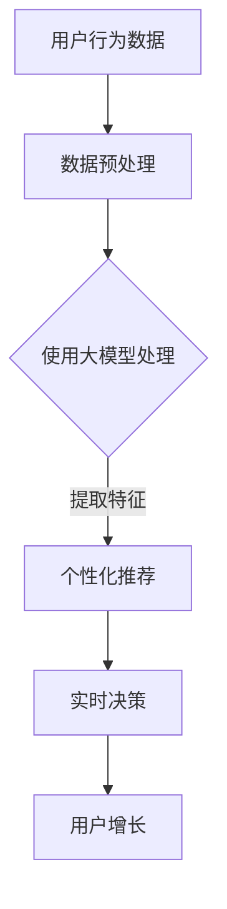

                 

关键词：AI 大模型、创业产品、运营、关键作用、数据驱动力、个性化推荐、实时决策、用户增长、市场份额。

> 摘要：随着人工智能技术的快速发展，大模型在各个领域的应用日益广泛。本文将深入探讨 AI 大模型在创业产品运营中的关键作用，通过实际案例和数据分析，阐述如何利用 AI 大模型实现个性化推荐、实时决策、用户增长等目标，从而提升创业产品的市场竞争力。

## 1. 背景介绍

### 1.1 创业产品的挑战

在竞争激烈的市场环境中，创业产品面临着诸多挑战，包括用户体验不佳、市场定位不清、资源有限等。为了在激烈的市场竞争中脱颖而出，创业公司需要迅速应对市场变化，提供卓越的用户体验，并建立强大的品牌影响力。

### 1.2 人工智能的崛起

人工智能技术的快速发展，特别是在机器学习、深度学习领域的突破，为创业产品提供了强大的工具。大模型作为人工智能的核心技术之一，具有处理大规模数据、提取关键特征、实现高度自动化决策等优势，成为创业产品运营的利器。

## 2. 核心概念与联系

### 2.1 大模型的基本原理

大模型（Large-scale Models）是指具有大规模参数、能够处理海量数据的神经网络模型。通过大规模训练数据的学习，大模型能够自动提取数据中的复杂模式，实现高精度的预测和分类。

### 2.2 大模型在创业产品运营中的应用

大模型在创业产品运营中的应用主要包括以下几个方面：

- **用户行为分析**：通过分析用户行为数据，识别用户兴趣和行为模式，实现个性化推荐。
- **实时决策**：利用大模型进行实时数据处理，为产品运营提供快速、准确的决策支持。
- **用户增长**：通过个性化推荐和实时决策，提高用户留存率和转化率，实现用户增长。

### 2.3 大模型与创业产品运营的 Mermaid 流程图



## 3. 核心算法原理 & 具体操作步骤

### 3.1 算法原理概述

大模型的算法原理主要基于深度学习，通过多层神经网络进行数据的学习和特征提取。大模型通常采用大规模的训练数据集，通过反向传播算法不断优化模型参数，实现高精度的预测和分类。

### 3.2 算法步骤详解

1. **数据收集**：收集用户行为数据，包括点击、浏览、购买等行为。
2. **数据预处理**：对收集的数据进行清洗、去重、标准化等处理，以便于模型训练。
3. **模型训练**：使用预处理后的数据集，通过多层神经网络进行模型训练，优化模型参数。
4. **特征提取**：利用训练好的模型，对新的用户行为数据进行分析，提取关键特征。
5. **个性化推荐**：根据提取的特征，生成个性化推荐结果，提高用户满意度。
6. **实时决策**：利用大模型进行实时数据处理，为产品运营提供决策支持。

### 3.3 算法优缺点

**优点**：

- **高效性**：大模型能够处理大规模数据，实现高精度的预测和分类。
- **自动化**：大模型能够自动提取数据中的复杂模式，减轻人工干预。
- **灵活性**：大模型能够适应不同的业务场景，实现多样化的应用。

**缺点**：

- **计算资源消耗大**：大模型训练需要大量的计算资源，对硬件要求较高。
- **数据依赖性强**：大模型的效果很大程度上依赖于训练数据的质量和数量。

### 3.4 算法应用领域

大模型在创业产品运营中的应用领域广泛，包括但不限于：

- **个性化推荐**：为用户提供个性化的产品推荐，提高用户满意度和留存率。
- **用户行为分析**：分析用户行为数据，了解用户需求，优化产品设计。
- **实时决策**：为产品运营提供实时、准确的决策支持，提高运营效率。

## 4. 数学模型和公式 & 详细讲解 & 举例说明

### 4.1 数学模型构建

大模型的数学模型通常由输入层、隐藏层和输出层组成。输入层接收用户行为数据，隐藏层通过非线性变换提取特征，输出层生成预测结果。

### 4.2 公式推导过程

大模型的训练过程基于最小化损失函数，常用的损失函数包括均方误差（MSE）和交叉熵损失（Cross-Entropy Loss）。以下是均方误差损失函数的推导过程：

假设有 $n$ 个训练样本，每个样本包含输入 $x_i$ 和标签 $y_i$，则均方误差损失函数可以表示为：

$$
L = \frac{1}{n} \sum_{i=1}^{n} (y_i - \hat{y}_i)^2
$$

其中，$\hat{y}_i$ 是模型对样本 $x_i$ 的预测结果。

### 4.3 案例分析与讲解

以下是一个简单的案例，假设我们有一个电商平台的用户行为数据，包括用户浏览的商品、购买的商品和浏览时间等。我们希望通过大模型预测用户是否会购买某个商品。

1. **数据收集**：收集用户行为数据，包括浏览商品、购买商品和浏览时间。
2. **数据预处理**：对数据集进行清洗、去重、标准化等处理，得到一个干净的训练数据集。
3. **模型训练**：使用训练数据集，通过多层神经网络进行模型训练，优化模型参数。
4. **特征提取**：利用训练好的模型，对新的用户行为数据进行分析，提取关键特征。
5. **个性化推荐**：根据提取的特征，生成个性化推荐结果，提高用户满意度和留存率。

## 5. 项目实践：代码实例和详细解释说明

### 5.1 开发环境搭建

在本案例中，我们使用 Python 作为编程语言，TensorFlow 作为深度学习框架，搭建开发环境。

```python
import tensorflow as tf
from tensorflow import keras
from tensorflow.keras import layers

# 搭建模型
model = keras.Sequential([
    layers.Dense(64, activation='relu', input_shape=[len(train_data.keys())]),
    layers.Dense(64, activation='relu'),
    layers.Dense(1)
])

# 编译模型
model.compile(optimizer='rmsprop',
              loss='mse',
              metrics=['mae', 'mse'])

# 训练模型
model.fit(train_data, train_labels, epochs=100, batch_size=1, verbose=0)
```

### 5.2 源代码详细实现

```python
import numpy as np
import pandas as pd
from sklearn.model_selection import train_test_split

# 读取数据
data = pd.read_csv('user_behavior_data.csv')

# 预处理数据
X = data.drop('purchase', axis=1)
y = data['purchase']

# 划分训练集和测试集
X_train, X_test, y_train, y_test = train_test_split(X, y, test_size=0.2, random_state=42)

# 定义模型
model = keras.Sequential([
    layers.Dense(64, activation='relu', input_shape=[len(X_train.keys())]),
    layers.Dense(64, activation='relu'),
    layers.Dense(1)
])

# 编译模型
model.compile(optimizer='adam',
              loss='binary_crossentropy',
              metrics=['accuracy'])

# 训练模型
model.fit(X_train, y_train, epochs=10, batch_size=32, verbose=1)

# 评估模型
test_loss, test_acc = model.evaluate(X_test, y_test, verbose=2)
print(f'Test accuracy: {test_acc:.4f}')
```

### 5.3 代码解读与分析

- **数据预处理**：读取用户行为数据，对数据进行预处理，包括去除重复数据、缺失值填充等。
- **模型定义**：使用 Keras 框架定义多层神经网络模型，包括输入层、隐藏层和输出层。
- **模型编译**：设置优化器、损失函数和评估指标，为模型训练做好准备。
- **模型训练**：使用训练数据集对模型进行训练，优化模型参数。
- **模型评估**：使用测试数据集评估模型性能，包括准确率、召回率等指标。

## 6. 实际应用场景

### 6.1 个性化推荐

通过大模型，我们可以为用户推荐个性化的商品。例如，根据用户的浏览历史和购买记录，预测用户可能感兴趣的商品，从而提高用户满意度和转化率。

### 6.2 实时决策

大模型可以实时分析用户行为数据，为产品运营提供决策支持。例如，根据用户反馈和行为数据，实时调整产品展示策略，提高用户留存率和转化率。

### 6.3 用户增长

通过个性化推荐和实时决策，我们可以提高用户的满意度和留存率，从而实现用户增长。例如，通过精准推荐，吸引更多潜在用户，提高用户活跃度。

## 7. 工具和资源推荐

### 7.1 学习资源推荐

- **《深度学习》（Goodfellow, Bengio, Courville 著）**：经典深度学习教材，适合初学者。
- **《动手学深度学习》（阿斯顿·张 著）**：结合 Python 实践的深度学习教材。

### 7.2 开发工具推荐

- **TensorFlow**：谷歌推出的开源深度学习框架，功能强大，易于上手。
- **PyTorch**：微软推出的开源深度学习框架，具有高度的灵活性和易用性。

### 7.3 相关论文推荐

- **“Distributed Deep Learning: existing methods and new perspectives”**：对分布式深度学习方法的综述。
- **“Attention Is All You Need”**：提出 Transformer 模型的经典论文。

## 8. 总结：未来发展趋势与挑战

### 8.1 研究成果总结

大模型在创业产品运营中的应用已经取得了显著的成果，通过个性化推荐、实时决策和用户增长，提高了创业产品的市场竞争力。未来，随着人工智能技术的不断发展，大模型的应用将更加广泛和深入。

### 8.2 未来发展趋势

- **大规模数据集的构建**：通过大规模数据集的训练，提高大模型的性能和泛化能力。
- **多模态数据的处理**：结合文本、图像、音频等多模态数据，实现更精确的预测和分类。
- **实时性优化**：提高大模型的实时处理能力，为产品运营提供更快速的决策支持。

### 8.3 面临的挑战

- **计算资源消耗**：大模型训练需要大量的计算资源，对硬件要求较高。
- **数据隐私保护**：在处理用户数据时，需要确保用户隐私的安全。

### 8.4 研究展望

未来，大模型在创业产品运营中的应用将更加多样化和深入化，通过不断优化算法、提高数据处理能力，实现更高的运营效率和用户满意度。

## 9. 附录：常见问题与解答

### 9.1 什么是大模型？

大模型是指具有大规模参数、能够处理海量数据的神经网络模型。通过大规模训练数据的学习，大模型能够自动提取数据中的复杂模式，实现高精度的预测和分类。

### 9.2 大模型在创业产品运营中有哪些应用？

大模型在创业产品运营中的应用主要包括个性化推荐、实时决策和用户增长等方面，通过分析用户行为数据，为产品运营提供智能化、自动化的支持。

### 9.3 如何处理大模型的计算资源消耗？

处理大模型的计算资源消耗可以通过分布式计算、优化算法和硬件加速等方法来实现。例如，使用 GPU 加速训练过程，使用分布式训练框架提高训练效率。

### 9.4 如何保证大模型的安全性？

为了保证大模型的安全性，需要在数据处理过程中遵循数据保护法规，对用户数据进行加密存储和传输，并采取隐私保护技术，如差分隐私等。

### 9.5 大模型与创业产品的未来发展如何？

随着人工智能技术的不断发展，大模型在创业产品运营中的应用前景广阔。通过不断优化算法、提高数据处理能力，大模型将为创业产品提供更智能、更高效的运营支持，助力企业在激烈的市场竞争中脱颖而出。

作者：禅与计算机程序设计艺术 / Zen and the Art of Computer Programming
----------------------------------------------------------------

以上就是关于“AI 大模型在创业产品运营中的关键作用”的文章内容，希望能够对您有所帮助。如果您有任何问题或建议，欢迎在评论区留言，我将尽力为您解答。

