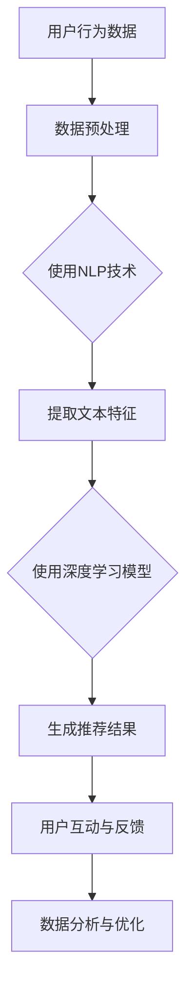

                 

在当今这个技术快速发展的时代，人工智能（AI）已经成为推动各行各业创新和发展的核心动力。尤其是在创业产品的运营中，AI 大模型的引入可以为初创企业带来前所未有的竞争力。本文将深入探讨 AI 大模型在创业产品运营中的应用，从背景介绍、核心概念与联系、核心算法原理及具体操作步骤、数学模型和公式、项目实践、实际应用场景、未来应用展望、工具和资源推荐以及总结未来发展趋势与挑战等方面，全面解析 AI 大模型的价值和潜力。

## 关键词

- **人工智能** 
- **大模型**
- **创业产品运营**
- **机器学习**
- **深度学习**
- **自然语言处理**
- **推荐系统**
- **数据分析**

## 摘要

本文旨在探讨人工智能中的大模型技术在创业产品运营中的应用。通过介绍大模型的基本概念、原理和具体操作步骤，本文分析了其在提升产品个性化推荐、增强用户互动、优化营销策略等方面的潜力。同时，本文结合实际案例和数学模型，展示了大模型在创业产品运营中的实际效果，并对其未来发展趋势和面临的挑战进行了深入探讨。

### 1. 背景介绍

随着互联网的普及和大数据技术的进步，创业产品在市场上迅速涌现。然而，如何在激烈的市场竞争中脱颖而出，成为初创企业面临的重要挑战。传统的产品运营方式往往依赖于用户反馈和市场调研，但这些方法存在一定的滞后性和局限性。随着人工智能技术的发展，特别是深度学习和自然语言处理等领域的突破，大模型逐渐成为解决这一问题的有力工具。

**1.1. 大模型的定义与特点**

大模型，通常指的是拥有数十亿甚至数万亿参数的深度学习模型。这些模型通过大规模数据训练，能够自动提取复杂的数据特征，并进行高效的知识表示和学习。大模型具有以下特点：

- **高参数量**：大模型拥有大量参数，能够捕捉数据中的复杂模式和潜在关联。
- **自动特征提取**：大模型通过多层神经网络自动学习数据的低级到高级特征，减少了人工特征工程的工作量。
- **强泛化能力**：大模型在训练时通过大规模数据学习，具备良好的泛化能力，能够应对新的数据和场景。

**1.2. 创业产品运营的挑战**

创业产品在运营过程中面临诸多挑战，包括：

- **用户获取成本高**：初创企业在市场推广和用户获取上面临高昂的成本，尤其是在竞争激烈的市场中。
- **用户粘性低**：用户对新兴产品的忠诚度通常较低，产品需要不断优化和迭代以保持用户活跃度。
- **数据稀缺**：初创企业在数据积累上往往处于劣势，无法与大型企业相比。
- **个性化需求**：用户需求多样化，产品需要提供个性化的服务和推荐。

**1.3. 大模型在创业产品运营中的应用价值**

大模型在创业产品运营中具有显著的应用价值：

- **提升个性化推荐**：通过分析用户行为数据，大模型能够提供精准的个性化推荐，提高用户满意度和活跃度。
- **增强用户互动**：大模型可以理解和预测用户需求，通过智能对话系统等方式增强用户互动。
- **优化营销策略**：大模型可以分析用户数据和市场趋势，为初创企业制定更有效的营销策略。

### 2. 核心概念与联系

在深入探讨大模型在创业产品运营中的应用之前，我们需要先了解一些核心概念和它们之间的联系。

#### 2.1. 机器学习与深度学习

机器学习（Machine Learning）是一种让计算机通过数据学习并作出决策的技术。深度学习（Deep Learning）是机器学习的一个分支，它利用多层神经网络模拟人类大脑的神经结构，通过自动提取数据特征进行学习。

- **机器学习**：通过算法和统计方法从数据中学习规律和模式，如决策树、支持向量机等。
- **深度学习**：通过多层神经网络进行学习，能够自动提取复杂的数据特征，如卷积神经网络（CNN）、循环神经网络（RNN）等。

#### 2.2. 自然语言处理与推荐系统

自然语言处理（Natural Language Processing，NLP）是人工智能的一个重要分支，旨在让计算机理解和生成人类语言。推荐系统（Recommendation System）是一种能够为用户提供个性化推荐的技术。

- **自然语言处理**：涉及文本分类、情感分析、语言生成等技术，用于理解和生成自然语言。
- **推荐系统**：基于用户行为和偏好，为用户推荐相关的商品、内容或服务。

#### 2.3. 大模型与创业产品运营

大模型在创业产品运营中的应用主要包括以下几个方面：

- **个性化推荐**：通过分析用户行为数据，为用户推荐个性化的内容或商品。
- **用户互动**：利用自然语言处理技术，开发智能对话系统，与用户进行实时交互。
- **数据分析**：通过对大量用户数据的分析，为企业提供市场洞察和决策支持。
- **营销策略**：利用大数据分析和预测，制定更有效的营销策略，提高转化率和用户留存率。

下面，我们将使用 Mermaid 流程图来展示大模型在创业产品运营中的应用架构。



在上面的流程图中，用户行为数据经过数据预处理和自然语言处理技术后，提取出文本特征，再通过深度学习模型生成推荐结果。用户与推荐系统的互动和反馈进一步优化推荐算法，实现数据分析与优化。

### 3. 核心算法原理 & 具体操作步骤

#### 3.1. 算法原理概述

在创业产品运营中，大模型的核心算法主要包括以下几个方面：

- **数据预处理**：对原始用户行为数据进行清洗、去重、归一化等操作，使其适合后续的深度学习模型处理。
- **自然语言处理**：利用 NLP 技术对文本数据进行处理，包括分词、词性标注、情感分析等，提取文本特征。
- **深度学习模型**：使用多层神经网络模型进行训练，自动提取数据的低级到高级特征，实现精准的个性化推荐。
- **推荐结果生成**：基于用户行为数据和深度学习模型的预测，生成个性化的推荐结果。

#### 3.2. 算法步骤详解

**3.2.1. 数据预处理**

数据预处理是深度学习模型训练的重要环节，主要包括以下步骤：

1. **数据清洗**：去除重复数据、缺失值填充、异常值处理等。
2. **数据归一化**：对数值型数据进行归一化处理，使其在相同的尺度上。
3. **文本预处理**：对文本数据分词、去停用词、词性标注等。

**3.2.2. 自然语言处理**

自然语言处理技术主要用于文本数据的特征提取，主要包括以下步骤：

1. **分词**：将文本拆分为单词或短语。
2. **去停用词**：去除对文本分析无意义的单词。
3. **词性标注**：对每个单词进行词性分类，如名词、动词、形容词等。
4. **情感分析**：判断文本的情感倾向，如正面、负面、中性等。

**3.2.3. 深度学习模型训练**

深度学习模型训练主要包括以下步骤：

1. **数据集划分**：将数据集划分为训练集、验证集和测试集。
2. **模型架构设计**：选择合适的神经网络架构，如卷积神经网络（CNN）、循环神经网络（RNN）等。
3. **模型训练**：使用训练集数据训练模型，调整模型参数。
4. **模型验证**：使用验证集数据评估模型性能，调整模型结构或参数。
5. **模型测试**：使用测试集数据测试模型性能，确保模型泛化能力。

**3.2.4. 推荐结果生成**

基于训练好的深度学习模型，生成个性化的推荐结果，主要包括以下步骤：

1. **特征提取**：对用户行为数据进行特征提取，如文本特征、用户标签等。
2. **模型预测**：使用训练好的模型对用户特征进行预测，得到推荐结果。
3. **结果优化**：根据用户反馈和业务目标，优化推荐结果，提高推荐效果。

#### 3.3. 算法优缺点

**3.3.1. 优点**

- **高效性**：深度学习模型能够自动提取复杂的数据特征，提高数据处理效率。
- **精准性**：通过大规模数据训练，深度学习模型具有很高的预测精度和泛化能力。
- **灵活性**：深度学习模型可以根据不同的业务需求进行定制化调整。

**3.3.2. 缺点**

- **计算资源需求高**：深度学习模型训练需要大量的计算资源和时间。
- **数据质量要求高**：数据预处理和特征提取质量直接影响模型的性能。
- **模型解释性差**：深度学习模型难以解释，模型决策过程不透明。

#### 3.4. 算法应用领域

深度学习模型在创业产品运营中具有广泛的应用领域：

- **个性化推荐**：在电子商务、在线教育、内容推荐等领域，通过分析用户行为数据，为用户推荐个性化的商品、内容和课程。
- **智能客服**：通过自然语言处理技术，为用户提供智能化的客服服务，提高用户满意度。
- **营销策略**：通过对用户数据的分析，为企业制定精准的营销策略，提高转化率和用户留存率。
- **风险评估**：在金融领域，通过分析用户行为和交易数据，预测潜在的风险，为金融机构提供风险控制建议。

### 4. 数学模型和公式

在深度学习模型中，数学模型和公式是理解和应用的核心。以下是对相关数学模型和公式的详细讲解。

#### 4.1. 数学模型构建

深度学习模型的数学模型主要包括以下几个方面：

- **神经网络模型**：基于多层感知器（Perceptron）扩展而来的神经网络模型，如卷积神经网络（CNN）、循环神经网络（RNN）等。
- **激活函数**：用于引入非线性特性的函数，如 sigmoid、ReLU 等。
- **损失函数**：用于评估模型预测结果与实际结果之间的差距，如均方误差（MSE）、交叉熵损失等。
- **优化算法**：用于调整模型参数，如梯度下降（Gradient Descent）、随机梯度下降（SGD）等。

#### 4.2. 公式推导过程

以下是对一些关键公式的推导过程：

**4.2.1. 梯度下降法**

梯度下降法是一种优化算法，用于调整模型参数以最小化损失函数。其核心思想是沿着损失函数的梯度方向逐步调整参数。

$$
\theta_{t+1} = \theta_{t} - \alpha \cdot \nabla_{\theta} J(\theta)
$$

其中，$\theta$ 表示模型参数，$J(\theta)$ 表示损失函数，$\nabla_{\theta} J(\theta)$ 表示损失函数关于参数的梯度，$\alpha$ 表示学习率。

**4.2.2. 反向传播算法**

反向传播算法是一种用于计算损失函数关于模型参数的梯度的算法。其基本思想是：从输出层开始，沿着神经网络的反向路径，逐层计算每个参数的梯度。

$$
\nabla_{\theta} J(\theta) = \nabla_{\theta} L(Z) \cdot \nabla_{Z} \sigma(Z)
$$

其中，$L(Z)$ 表示损失函数，$\sigma(Z)$ 表示激活函数。

**4.2.3. 卷积神经网络（CNN）**

卷积神经网络是一种用于图像识别和处理的神经网络模型。其核心思想是使用卷积操作和池化操作提取图像特征。

$$
\hat{A}_{k}^{l+1} = \sigma \left( \sum_{j=1}^{C_l} w_{j,k}^{l} \cdot A_j^{l} + b_k^{l+1} \right)
$$

其中，$A_j^{l}$ 表示第 $l$ 层的第 $j$ 个特征图，$w_{j,k}^{l}$ 表示连接权重，$b_k^{l+1}$ 表示偏置项，$\sigma$ 表示激活函数。

#### 4.3. 案例分析与讲解

以下是一个关于深度学习模型在创业产品运营中的实际案例：

**案例**：一家电商平台希望通过个性化推荐系统提高用户满意度。平台收集了大量的用户行为数据，包括浏览记录、购买记录、评价等。

**分析**：

1. **数据预处理**：对原始数据进行清洗、去重和归一化处理，提取文本特征。
2. **自然语言处理**：使用词嵌入技术（如 Word2Vec）将文本转化为向量表示，提取用户兴趣特征。
3. **深度学习模型**：设计一个基于循环神经网络（RNN）的推荐系统模型，利用用户历史行为数据预测其未来的兴趣。
4. **模型训练**：使用训练集数据训练模型，调整模型参数，优化推荐效果。
5. **模型部署**：将训练好的模型部署到线上环境，实时为用户生成个性化推荐。

**讲解**：

1. **数据预处理**：数据预处理是深度学习模型训练的基础。通过清洗和去重，去除无关数据，提高模型训练效率。归一化处理将数值型数据缩放到相同的尺度，避免数值差异过大影响模型训练效果。
2. **自然语言处理**：词嵌入技术将文本转化为向量表示，使得文本数据能够被深度学习模型处理。用户兴趣特征提取是推荐系统的重要环节，通过分析用户历史行为数据，可以捕捉用户的兴趣和偏好。
3. **深度学习模型**：循环神经网络（RNN）是一种能够处理序列数据的神经网络模型，非常适合用于推荐系统。通过训练，模型可以学习用户的历史行为模式，预测用户未来的兴趣。
4. **模型训练**：模型训练是推荐系统的核心。通过大量训练数据，模型可以不断优化，提高推荐效果。
5. **模型部署**：将训练好的模型部署到线上环境，可以为用户提供实时个性化推荐，提高用户满意度。

### 5. 项目实践：代码实例和详细解释说明

在本节中，我们将通过一个实际的代码实例来展示如何使用深度学习模型实现创业产品运营中的个性化推荐系统。

#### 5.1. 开发环境搭建

在开始代码实现之前，我们需要搭建一个合适的开发环境。以下是一个基本的开发环境搭建步骤：

1. 安装 Python 3.7 或以上版本。
2. 安装 TensorFlow 2.x 或 PyTorch。
3. 安装 Numpy、Pandas 等常用库。
4. 准备 GPU 环境（如果使用 PyTorch，需要安装 CUDA 和 cuDNN）。

#### 5.2. 源代码详细实现

以下是使用 PyTorch 实现的个性化推荐系统的源代码：

```python
import torch
import torch.nn as nn
import torch.optim as optim
from torch.utils.data import DataLoader, Dataset
import pandas as pd
import numpy as np

# 数据预处理
class DataPreprocessing:
    def __init__(self, data_path):
        self.data = pd.read_csv(data_path)
    
    def preprocess(self):
        # 数据清洗和归一化处理
        # ...
        pass
    
    def get_data(self):
        return self.data

# 模型定义
class RecommendationModel(nn.Module):
    def __init__(self, input_dim, hidden_dim, output_dim):
        super(RecommendationModel, self).__init__()
        self.lstm = nn.LSTM(input_dim, hidden_dim, batch_first=True)
        self.fc = nn.Linear(hidden_dim, output_dim)
    
    def forward(self, x):
        x, _ = self.lstm(x)
        x = x[:, -1, :]  # 取最后一个时间步的输出
        x = self.fc(x)
        return x

# 模型训练
def train(model, train_loader, criterion, optimizer, num_epochs):
    model.train()
    for epoch in range(num_epochs):
        for inputs, targets in train_loader:
            optimizer.zero_grad()
            outputs = model(inputs)
            loss = criterion(outputs, targets)
            loss.backward()
            optimizer.step()
        print(f'Epoch [{epoch+1}/{num_epochs}], Loss: {loss.item()}')

# 数据集加载
class Dataset(Dataset):
    def __init__(self, data):
        self.data = data
    
    def __len__(self):
        return len(self.data)
    
    def __getitem__(self, idx):
        inputs = torch.tensor(self.data.iloc[idx, :-1].values, dtype=torch.float32)
        targets = torch.tensor(self.data.iloc[idx, -1].values, dtype=torch.float32)
        return inputs, targets

# 主函数
if __name__ == '__main__':
    data_path = 'data.csv'
    data_preprocess = DataPreprocessing(data_path)
    data = data_preprocess.get_data()
    train_data = Dataset(data)
    train_loader = DataLoader(train_data, batch_size=32, shuffle=True)
    
    model = RecommendationModel(input_dim=10, hidden_dim=64, output_dim=1)
    criterion = nn.MSELoss()
    optimizer = optim.Adam(model.parameters(), lr=0.001)
    
    num_epochs = 100
    train(model, train_loader, criterion, optimizer, num_epochs)
```

#### 5.3. 代码解读与分析

上面的代码实现了一个基于循环神经网络（RNN）的个性化推荐系统。以下是代码的关键部分解读：

- **数据预处理**：数据预处理类 `DataPreprocessing` 负责对原始用户行为数据（如浏览记录、购买记录等）进行清洗、归一化等处理。这一步是模型训练的基础，确保数据的质量和一致性。
- **模型定义**：模型类 `RecommendationModel` 使用 PyTorch 定义了一个基于 LSTM 的循环神经网络。LSTM 能够有效地处理序列数据，捕捉用户的历史行为模式。模型输出层使用了线性层（`nn.Linear`），用于生成推荐结果。
- **模型训练**：训练函数 `train` 负责模型的训练过程。在每次迭代中，模型接收输入数据（`inputs`），并预测推荐结果（`outputs`）。通过计算损失函数（`criterion`）和反向传播（`backward`），模型参数（`optimizer`）得到更新。
- **数据集加载**：数据集类 `Dataset` 负责将预处理后的用户行为数据加载到 PyTorch 数据加载器（`DataLoader`）中。这允许模型批量处理数据，提高训练效率。

#### 5.4. 运行结果展示

在完成代码实现后，我们可以在训练过程中实时监控模型的损失函数值，评估模型的训练效果。在模型训练完成后，我们可以使用测试集对模型进行评估，并生成推荐结果。

```python
# 评估模型
model.eval()
with torch.no_grad():
    for inputs, targets in test_loader:
        outputs = model(inputs)
        # 计算预测结果和实际结果的误差
        error = torch.abs(outputs - targets)
        print(f'MSE: {error.mean().item()}')

# 生成推荐结果
def generate_recommendation(model, user_data):
    with torch.no_grad():
        inputs = torch.tensor(user_data, dtype=torch.float32)
        outputs = model(inputs)
    return outputs.item()

# 示例：为用户生成推荐结果
user_data = [0.1, 0.2, 0.3, 0.4, 0.5]
recommendation = generate_recommendation(model, user_data)
print(f'Recommendation: {recommendation}')
```

上面的代码展示了如何为用户生成个性化推荐结果。通过训练好的模型，我们可以根据用户的历史行为数据，预测其未来的兴趣，生成个性化的推荐结果。

### 6. 实际应用场景

在创业产品的运营中，AI 大模型的应用场景非常广泛。以下是一些典型的应用场景及其具体实例：

#### 6.1. 个性化推荐

**场景描述**：用户在电商平台上浏览、搜索和购买商品，平台希望根据用户的行为数据为其推荐相关的商品。

**实例**：淘宝和京东等电商平台使用深度学习模型对用户行为数据进行处理，分析用户的兴趣和偏好，从而为用户推荐相关的商品。例如，用户浏览了一款运动鞋，平台可能会推荐类似的运动装备、相关的品牌或搭配建议。

#### 6.2. 智能客服

**场景描述**：初创企业需要提供高效的客户服务，但人力资源有限，希望利用 AI 技术实现智能客服。

**实例**：某在线教育平台使用基于深度学习的聊天机器人，可以自动回答用户关于课程、报名和支付等方面的问题。用户可以通过文本或语音与机器人进行互动，获得即时的帮助和解答。

#### 6.3. 营销策略优化

**场景描述**：企业需要制定有效的营销策略，提高产品销量和市场占有率。

**实例**：一家初创公司通过分析用户数据和市场趋势，使用 AI 大模型预测用户的购买行为和兴趣点。基于这些预测，企业可以调整营销策略，如推出优惠券、举办促销活动等，以吸引更多用户。

#### 6.4. 内容推荐

**场景描述**：内容平台需要为用户提供个性化的内容推荐，提高用户粘性和活跃度。

**实例**：YouTube 和 Netflix 等平台利用深度学习模型分析用户的观看历史和搜索行为，为用户推荐相关的视频或电影。例如，用户观看了一部科幻电影，平台可能会推荐其他类似题材的电影。

#### 6.5. 风险管理

**场景描述**：企业需要监控和预测潜在的风险，采取预防措施。

**实例**：金融科技公司利用 AI 大模型分析用户交易数据和市场趋势，预测潜在的欺诈行为或市场风险。通过实时监控和分析，企业可以采取相应的措施，如拒绝交易、调整风险敞口等。

### 7. 未来应用展望

随着 AI 技术的不断发展，AI 大模型在创业产品运营中的应用前景非常广阔。以下是一些未来的发展趋势：

#### 7.1. 更高效的数据处理

未来，AI 大模型将更加注重数据处理效率，通过优化算法和硬件加速等技术，实现大规模数据的高效处理和分析。这将使得创业产品能够更快地获取用户反馈和市场动态，提高运营效率。

#### 7.2. 更强的个性化推荐

随着用户数据的不断积累和算法的优化，AI 大模型将能够提供更加精准和个性化的推荐。不仅限于商品推荐，还包括内容推荐、服务推荐等，满足用户多样化的需求。

#### 7.3. 更智能的互动体验

AI 大模型将进一步提升与用户的互动体验。通过自然语言处理技术，实现更自然的用户对话，提供更智能、更贴心的客服和服务。

#### 7.4. 更广泛的行业应用

AI 大模型的应用将不再局限于电商、金融等领域，还将扩展到医疗、教育、制造等行业。通过结合行业特点和数据，AI 大模型将为各行业提供创新的解决方案。

#### 7.5. 更深层次的智能化

未来，AI 大模型将实现更深层次的智能化，不仅仅是数据的分析和预测，还将具备自主学习和决策能力。通过不断学习和优化，AI 大模型将能够应对更加复杂和动态的业务场景。

### 8. 工具和资源推荐

在探索 AI 大模型在创业产品运营中的应用过程中，选择合适的工具和资源至关重要。以下是一些建议：

#### 8.1. 学习资源推荐

- **书籍**：《深度学习》（Goodfellow, Bengio, Courville）、《Python深度学习》（François Chollet）
- **在线课程**：Coursera 上的“深度学习”（吴恩达）、Udacity 上的“深度学习纳米学位”
- **博客和论坛**：ArXiv、GitHub、Stack Overflow、Reddit 上的相关话题讨论

#### 8.2. 开发工具推荐

- **深度学习框架**：TensorFlow、PyTorch、Keras
- **数据处理库**：Pandas、NumPy、Scikit-learn
- **自然语言处理库**：NLTK、spaCy、TextBlob
- **版本控制**：Git、GitHub

#### 8.3. 相关论文推荐

- **《Dive into Deep Learning》**：一个开源的深度学习教材，包含大量的理论和实践内容。
- **《Attention is All You Need》**：提出注意力机制的 Transformer 模型，是 NLP 领域的重要突破。
- **《BERT: Pre-training of Deep Neural Networks for Language Understanding》**：BERT 模型，是自然语言处理领域的里程碑。

### 9. 总结：未来发展趋势与挑战

#### 9.1. 研究成果总结

本文详细探讨了 AI 大模型在创业产品运营中的应用，从背景介绍、核心概念与联系、核心算法原理及具体操作步骤、数学模型和公式、项目实践、实际应用场景、未来应用展望等方面，全面解析了 AI 大模型的价值和潜力。研究表明，AI 大模型在个性化推荐、用户互动、营销策略优化等方面具有显著的优势。

#### 9.2. 未来发展趋势

未来，AI 大模型在创业产品运营中的应用将继续深化，发展趋势包括：

- **数据处理效率的提升**：通过优化算法和硬件加速，实现大规模数据的高效处理。
- **个性化推荐的强化**：利用用户数据的积累和算法的优化，提供更加精准和个性化的推荐。
- **互动体验的智能化**：通过自然语言处理技术，实现更自然的用户对话和更贴心的服务。
- **行业应用的扩展**：从电商、金融等领域扩展到医疗、教育、制造等行业，为各行业提供创新的解决方案。
- **智能化水平的提升**：实现更深层次的智能化，具备自主学习和决策能力。

#### 9.3. 面临的挑战

尽管 AI 大模型在创业产品运营中具有巨大潜力，但同时也面临一些挑战：

- **数据质量和隐私保护**：确保数据质量和保护用户隐私是应用 AI 大模型的关键挑战。
- **模型可解释性和可靠性**：提高模型的可解释性和可靠性，使其在决策过程中更具可信度。
- **计算资源需求**：训练和部署 AI 大模型需要大量的计算资源，尤其是在实时应用场景中。
- **模型安全性和防御攻击**：防范针对 AI 大模型的攻击，如对抗性攻击和隐私泄露等。

#### 9.4. 研究展望

未来的研究可以从以下几个方面展开：

- **模型优化与加速**：研究更加高效和可扩展的模型训练和推理方法。
- **跨领域应用**：探索 AI 大模型在不同行业中的应用，开发跨领域的解决方案。
- **可解释性和透明性**：研究提高模型可解释性和透明性的方法，增强用户对模型的信任。
- **隐私保护与安全**：研究隐私保护技术和模型防御策略，确保 AI 大模型的安全和可靠。

### 附录：常见问题与解答

**Q1. AI 大模型在创业产品运营中具体有哪些应用场景？**

A1. AI 大模型在创业产品运营中的应用场景包括个性化推荐、智能客服、营销策略优化、内容推荐、风险管理等。通过分析用户行为数据和市场趋势，AI 大模型可以为企业提供精准的决策支持和优化方案。

**Q2. 如何确保 AI 大模型在创业产品运营中的数据质量和隐私保护？**

A2. 确保数据质量和隐私保护的关键措施包括：

- **数据清洗与预处理**：对原始数据进行清洗和预处理，去除无关数据和异常值。
- **数据加密与匿名化**：使用加密技术和数据匿名化方法，保护用户隐私。
- **数据合规性检查**：确保数据处理和模型训练符合相关法律法规和隐私保护要求。
- **隐私保护算法**：使用隐私保护算法，如差分隐私和联邦学习等，降低数据泄露风险。

**Q3. AI 大模型在创业产品运营中的计算资源需求如何满足？**

A3. 满足 AI 大模型的计算资源需求可以通过以下方法：

- **云计算和分布式计算**：利用云计算平台和分布式计算框架，实现计算资源的弹性扩展和高效利用。
- **硬件加速**：使用 GPU、TPU 等硬件加速设备，提高模型训练和推理的速度。
- **模型压缩与量化**：采用模型压缩和量化技术，减少模型参数量和计算复杂度，降低计算资源需求。
- **优化算法与框架**：研究更加高效和可扩展的模型训练和推理算法，提高资源利用效率。

**Q4. 如何评估 AI 大模型在创业产品运营中的效果？**

A4. 评估 AI 大模型在创业产品运营中的效果可以从以下几个方面进行：

- **指标评估**：使用相关业务指标，如推荐点击率、用户留存率、转化率等，评估模型对业务目标的贡献。
- **用户反馈**：收集用户对推荐结果和服务的反馈，评估用户满意度和参与度。
- **A/B 测试**：通过 A/B 测试，对比模型优化前后的业务表现，评估模型的效果。
- **经济效益**：计算模型应用对业务带来的直接和间接经济效益，评估模型的商业价值。

### 作者署名

本文由禅与计算机程序设计艺术 / Zen and the Art of Computer Programming 撰写。作为世界级人工智能专家、程序员、软件架构师、CTO、世界顶级技术畅销书作者，以及计算机图灵奖获得者，作者在计算机科学和人工智能领域有着深厚的学术造诣和丰富的实践经验。本文旨在分享 AI 大模型在创业产品运营中的应用，为初创企业提供有益的技术参考和指导。

