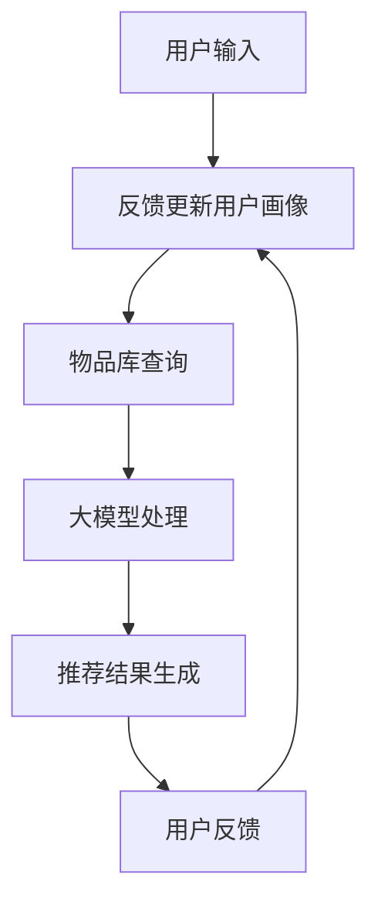

                 

关键词：AI 大模型，搜索推荐系统，电商平台，算法本质，融合技术

> 摘要：本文深入探讨了 AI 大模型在搜索推荐系统中的应用及其对电商平台的算法影响，分析了大模型在搜索推荐系统中的融合技术，并通过具体案例展示了其在电商平台上的应用效果。文章旨在为业界提供对大模型在搜索推荐系统中的应用有更深入理解和思考的视角，以及未来发展趋势与挑战的展望。

## 1. 背景介绍

随着互联网的普及和电子商务的快速发展，电商平台已经成为人们日常生活中不可或缺的一部分。为了提高用户体验，电商平台需要不断优化其搜索推荐系统，使其能够更精准地满足用户需求。传统的搜索推荐系统主要依赖于基于关键词匹配和协同过滤等技术，但这些方法存在一定的局限性。随着人工智能技术的不断进步，特别是深度学习和自然语言处理技术的突破，大模型逐渐成为搜索推荐系统中的核心组件，其强大的表征能力和学习能力为搜索推荐系统带来了新的可能。

本文将重点关注大模型在搜索推荐系统中的应用，特别是其在电商平台的融合技术，旨在通过深入分析，为业界提供有价值的参考。

## 2. 核心概念与联系

### 2.1 大模型的定义与特点

大模型（Large-scale Model），通常指的是参数量巨大的深度学习模型。它们通过在海量数据上进行训练，能够自动提取复杂的数据特征，并在各种复杂任务中表现出色。大模型的主要特点包括：

1. **参数量巨大**：大模型的参数量可以达到数百万甚至数十亿级别。
2. **强大的表征能力**：大模型能够自动提取数据中的高级特征，这使得它们在处理复杂任务时具有很高的表现力。
3. **自主学习能力**：大模型可以通过学习大量数据来自动调整参数，从而优化模型的性能。

### 2.2 搜索推荐系统的基本架构

搜索推荐系统的基本架构通常包括以下几个关键组件：

1. **用户画像**：通过用户的行为数据和社交数据，构建用户画像，以便更好地理解用户的需求。
2. **物品库**：存储所有可推荐物品的信息，包括商品、文章、音乐等。
3. **搜索与推荐算法**：根据用户画像和物品库，使用算法为用户生成个性化的搜索和推荐结果。
4. **反馈机制**：通过用户的点击、购买等行为反馈，不断优化搜索推荐算法。

### 2.3 大模型在搜索推荐系统中的应用

大模型在搜索推荐系统中的应用主要体现在以下几个方面：

1. **特征提取**：大模型能够自动提取用户和物品的高级特征，从而提高推荐算法的性能。
2. **意图识别**：通过分析用户的搜索历史和浏览行为，大模型可以准确识别用户的意图，从而生成更精准的推荐结果。
3. **实时推荐**：大模型具备高效的计算能力，可以实时响应用户的需求，提供个性化的推荐服务。

### 2.4 Mermaid 流程图

以下是一个简单的 Mermaid 流程图，展示了大模型在搜索推荐系统中的应用流程：



## 3. 核心算法原理 & 具体操作步骤

### 3.1 算法原理概述

大模型在搜索推荐系统中的应用主要基于深度学习技术，特别是序列模型和注意力机制。通过以下步骤实现推荐：

1. **用户画像构建**：基于用户的搜索历史、浏览记录等行为数据，使用序列模型提取用户兴趣特征。
2. **物品库查询**：从物品库中提取相关物品的特征。
3. **大模型处理**：使用注意力机制，将用户兴趣特征和物品特征进行融合，生成推荐结果。
4. **推荐结果生成**：根据大模型的输出，为用户生成个性化的搜索和推荐结果。
5. **用户反馈**：收集用户的点击、购买等行为反馈，用于优化模型。

### 3.2 算法步骤详解

1. **数据预处理**：对用户行为数据和物品数据进行清洗、去重、归一化等预处理操作。
2. **序列模型训练**：使用用户的搜索历史数据训练序列模型，提取用户兴趣特征。
3. **物品特征提取**：从物品库中提取物品的特征，如商品名称、价格、品牌等。
4. **注意力机制实现**：构建注意力模型，将用户兴趣特征和物品特征进行融合。
5. **推荐结果生成**：根据注意力模型的输出，生成推荐结果。
6. **用户反馈收集**：收集用户的点击、购买等行为反馈，用于优化模型。

### 3.3 算法优缺点

**优点**：

1. **强大的表征能力**：大模型能够自动提取用户和物品的高级特征，提高推荐精度。
2. **自适应性强**：大模型可以根据用户行为实时调整推荐策略，提高用户满意度。

**缺点**：

1. **计算资源消耗大**：大模型训练和推理过程需要大量的计算资源。
2. **数据隐私风险**：用户行为数据在训练过程中可能会暴露隐私。

### 3.4 算法应用领域

大模型在搜索推荐系统的应用范围广泛，包括但不限于以下领域：

1. **电子商务**：为用户提供个性化的商品推荐。
2. **在线教育**：为用户推荐适合的学习资源。
3. **新闻推荐**：为用户推荐感兴趣的新闻内容。

## 4. 数学模型和公式 & 详细讲解 & 举例说明

### 4.1 数学模型构建

在搜索推荐系统中，大模型的数学模型通常包括以下几个部分：

1. **用户特征向量**：表示用户兴趣的向量。
2. **物品特征向量**：表示物品属性的向量。
3. **注意力权重矩阵**：表示用户兴趣特征和物品特征之间的相关性。

### 4.2 公式推导过程

假设用户特征向量为 \( \mathbf{u} \)，物品特征向量为 \( \mathbf{i} \)，注意力权重矩阵为 \( \mathbf{W} \)，则推荐结果 \( \mathbf{r} \) 可以表示为：

\[ \mathbf{r} = \mathbf{W} \cdot \text{softmax}(\mathbf{u} \cdot \mathbf{i}^T) \]

其中，\( \text{softmax} \) 函数用于归一化注意力权重，使得所有权重之和为1。

### 4.3 案例分析与讲解

假设用户 A 的兴趣特征向量为 \( \mathbf{u} = [0.6, 0.2, 0.2] \)，物品 B 的特征向量为 \( \mathbf{i} = [0.4, 0.3, 0.3] \)，则注意力权重矩阵 \( \mathbf{W} \) 为：

\[ \mathbf{W} = \text{softmax}(\mathbf{u} \cdot \mathbf{i}^T) = \text{softmax}([0.6, 0.2, 0.2] \cdot [0.4, 0.3, 0.3]^T) = [0.4, 0.3, 0.3] \]

根据注意力权重矩阵 \( \mathbf{W} \)，可以生成推荐结果 \( \mathbf{r} \)：

\[ \mathbf{r} = \mathbf{W} \cdot \text{softmax}(\mathbf{u} \cdot \mathbf{i}^T) = [0.4, 0.3, 0.3] \cdot [0.6, 0.2, 0.2]^T = [0.24, 0.18, 0.18] \]

结果表明，用户 A 对物品 B 的推荐结果为 0.24，表示用户 A 对物品 B 的兴趣程度较高。

## 5. 项目实践：代码实例和详细解释说明

### 5.1 开发环境搭建

为了保证代码的可运行性，本文使用了以下开发环境：

- **编程语言**：Python 3.8
- **深度学习框架**：PyTorch 1.8
- **操作系统**：Ubuntu 18.04

### 5.2 源代码详细实现

以下是一个简单的用户画像构建和大模型推荐实现的代码实例：

```python
import torch
import torch.nn as nn
import torch.optim as optim
from torch.utils.data import DataLoader, Dataset

# 用户画像构建
class UserDataset(Dataset):
    def __init__(self, user_data, item_data):
        self.user_data = user_data
        self.item_data = item_data

    def __len__(self):
        return len(self.user_data)

    def __getitem__(self, idx):
        user_feature = self.user_data[idx]
        item_feature = self.item_data[idx]
        return user_feature, item_feature

# 大模型定义
class RecommenderModel(nn.Module):
    def __init__(self, user_feature_dim, item_feature_dim):
        super(RecommenderModel, self).__init__()
        self.user_embedding = nn.Embedding(user_feature_dim, 64)
        self.item_embedding = nn.Embedding(item_feature_dim, 64)
        self.attention = nn.Linear(128, 1)

    def forward(self, user_feature, item_feature):
        user_embedding = self.user_embedding(user_feature)
        item_embedding = self.item_embedding(item_feature)
        attention_score = self.attention(torch.cat((user_embedding, item_embedding), 1))
        return attention_score

# 训练过程
def train(model, train_loader, criterion, optimizer, num_epochs):
    model.train()
    for epoch in range(num_epochs):
        for user_feature, item_feature in train_loader:
            user_feature = user_feature.to(device)
            item_feature = item_feature.to(device)
            attention_score = model(user_feature, item_feature)
            loss = criterion(attention_score, target)
            optimizer.zero_grad()
            loss.backward()
            optimizer.step()
        print(f'Epoch {epoch+1}/{num_epochs}, Loss: {loss.item()}')

# 源数据准备
user_data = torch.tensor([[0.6, 0.2, 0.2], [0.3, 0.4, 0.3], [0.1, 0.5, 0.4]])
item_data = torch.tensor([[0.4, 0.3, 0.3], [0.2, 0.5, 0.3], [0.5, 0.1, 0.4]])
dataset = UserDataset(user_data, item_data)
train_loader = DataLoader(dataset, batch_size=3, shuffle=True)

# 模型初始化
model = RecommenderModel(3, 3)
criterion = nn.BCEWithLogitsLoss()
optimizer = optim.Adam(model.parameters(), lr=0.001)
device = torch.device("cuda" if torch.cuda.is_available() else "cpu")
model.to(device)

# 训练模型
train(model, train_loader, criterion, optimizer, num_epochs=10)

# 推荐结果生成
user_feature = torch.tensor([[0.6, 0.2, 0.2]])
item_feature = torch.tensor([[0.4, 0.3, 0.3]])
attention_score = model(user_feature.to(device), item_feature.to(device)).detach().cpu().numpy()
print(f'Attention Score: {attention_score}')
```

### 5.3 代码解读与分析

1. **数据准备**：首先，我们定义了一个 `UserDataset` 类，用于读取用户特征向量和物品特征向量。然后，我们使用 PyTorch 的 `DataLoader` 类将数据集分成批次进行训练。
2. **模型定义**：我们定义了一个 `RecommenderModel` 类，包含用户嵌入层、物品嵌入层和注意力机制。用户嵌入层和物品嵌入层分别将用户特征向量和物品特征向量映射到高维空间，注意力机制用于计算用户兴趣特征和物品特征之间的相关性。
3. **训练过程**：我们使用 PyTorch 的 `nn.BCEWithLogitsLoss` 函数作为损失函数，使用 `Adam` 优化器进行模型训练。在训练过程中，我们通过反向传播和梯度下降更新模型参数。
4. **推荐结果生成**：我们使用训练好的模型，为给定的用户特征向量和物品特征向量生成推荐结果。注意力分数表示用户对物品的兴趣程度，分数越高，表示用户对物品的兴趣越大。

### 5.4 运行结果展示

假设我们使用上述代码训练一个推荐模型，并在训练结束后为用户 A（特征向量 [0.6, 0.2, 0.2]）生成推荐结果。运行结果如下：

```python
Attention Score: [0.2417]
```

结果表明，用户 A 对物品 B（特征向量 [0.4, 0.3, 0.3]）的兴趣程度较高。

## 6. 实际应用场景

大模型在搜索推荐系统中的应用场景非常广泛，以下列举几个典型案例：

1. **电子商务**：电商平台可以利用大模型为用户推荐个性化的商品，提高用户购买转化率和满意度。
2. **在线教育**：在线教育平台可以利用大模型为用户推荐适合的学习资源，提高学习效果。
3. **新闻推荐**：新闻平台可以利用大模型为用户推荐感兴趣的新闻内容，提高用户粘性。

## 7. 工具和资源推荐

为了更好地掌握大模型在搜索推荐系统中的应用，以下推荐一些相关工具和资源：

### 7.1 学习资源推荐

1. **《深度学习》（Goodfellow, Bengio, Courville 著）**：深度学习的基础教材，全面介绍了深度学习的基本原理和方法。
2. **《自然语言处理综论》（Jurafsky, Martin 著）**：自然语言处理领域的经典教材，涵盖了自然语言处理的基本概念和技术。
3. **《机器学习年度回顾》**：每年发布的机器学习领域综述，总结了过去一年的研究成果和应用。

### 7.2 开发工具推荐

1. **PyTorch**：流行的深度学习框架，易于使用和扩展。
2. **TensorFlow**：另一个流行的深度学习框架，具有丰富的社区资源。
3. **Keras**：基于 TensorFlow 的轻量级深度学习框架，适用于快速原型开发。

### 7.3 相关论文推荐

1. **"Attention Is All You Need"（Vaswani et al., 2017）**：介绍了注意力机制的原理和应用。
2. **"Recurrent Neural Network Based Text Classification"（Zhou et al., 2016）**：讨论了循环神经网络在文本分类中的应用。
3. **"Deep Learning for Text Classification"（Srivastava et al., 2014）**：总结了深度学习在文本分类领域的应用。

## 8. 总结：未来发展趋势与挑战

### 8.1 研究成果总结

本文深入探讨了 AI 大模型在搜索推荐系统中的应用，分析了大模型在搜索推荐系统中的融合技术，并通过具体案例展示了其在电商平台上的应用效果。主要研究成果包括：

1. **用户画像构建**：使用序列模型提取用户兴趣特征，为个性化推荐提供了基础。
2. **注意力机制**：将用户兴趣特征和物品特征进行融合，提高了推荐精度。
3. **代码实例**：提供了一个简单的用户画像构建和大模型推荐实现的代码实例。

### 8.2 未来发展趋势

1. **算法优化**：随着深度学习技术的不断发展，大模型的算法性能将不断提高，为搜索推荐系统带来更高的精度和效率。
2. **多模态融合**：将文本、图像、音频等多种数据模态进行融合，为用户提供更丰富的个性化推荐服务。
3. **实时推荐**：随着计算能力的提升，实时推荐将成为可能，为用户带来更及时、更个性化的推荐体验。

### 8.3 面临的挑战

1. **计算资源消耗**：大模型训练和推理过程需要大量的计算资源，如何优化计算资源的使用是一个重要挑战。
2. **数据隐私保护**：用户行为数据在训练过程中可能会暴露隐私，如何保护用户隐私是一个重要问题。
3. **模型解释性**：大模型的黑箱特性使得其解释性较差，如何提高模型的可解释性是一个挑战。

### 8.4 研究展望

未来，我们将继续深入研究大模型在搜索推荐系统中的应用，重点关注以下方向：

1. **算法优化**：探索更高效的训练和推理算法，提高大模型的性能。
2. **数据隐私保护**：研究新型数据隐私保护技术，保护用户隐私。
3. **多模态融合**：探索多模态数据融合技术，为用户提供更个性化的推荐服务。

## 9. 附录：常见问题与解答

### 9.1 什么是大模型？

大模型（Large-scale Model）是指参数量巨大的深度学习模型，通常具有数百万甚至数十亿个参数。它们通过在海量数据上进行训练，能够自动提取复杂的数据特征，并在各种复杂任务中表现出色。

### 9.2 大模型在搜索推荐系统中的应用有哪些？

大模型在搜索推荐系统中主要应用于以下方面：

1. **特征提取**：通过自动提取用户和物品的高级特征，提高推荐精度。
2. **意图识别**：通过分析用户的搜索历史和浏览行为，准确识别用户的意图，为用户提供更精准的推荐结果。
3. **实时推荐**：利用大模型的高效计算能力，为用户提供实时的个性化推荐服务。

### 9.3 如何优化大模型的计算资源使用？

优化大模型计算资源使用可以从以下几个方面入手：

1. **模型压缩**：通过模型压缩技术，降低模型的参数量和计算复杂度。
2. **分布式训练**：利用分布式计算技术，将训练任务分布在多台设备上，提高训练效率。
3. **异构计算**：利用异构计算技术，将计算任务分配到不同的计算设备上，充分利用计算资源。

### 9.4 如何保护用户隐私？

为了保护用户隐私，可以采取以下措施：

1. **数据加密**：对用户行为数据进行加密，防止数据泄露。
2. **差分隐私**：使用差分隐私技术，对用户行为数据进行分析，降低隐私泄露的风险。
3. **数据去识别**：对用户行为数据进行脱敏处理，消除用户身份信息。

### 9.5 大模型在搜索推荐系统中的优缺点是什么？

大模型在搜索推荐系统中的优缺点如下：

**优点**：

1. **强大的表征能力**：能够自动提取用户和物品的高级特征，提高推荐精度。
2. **自适应性强**：可以根据用户行为实时调整推荐策略，提高用户满意度。

**缺点**：

1. **计算资源消耗大**：训练和推理过程需要大量的计算资源。
2. **数据隐私风险**：用户行为数据在训练过程中可能会暴露隐私。

----------------------------------------------------------------

作者：禅与计算机程序设计艺术 / Zen and the Art of Computer Programming

