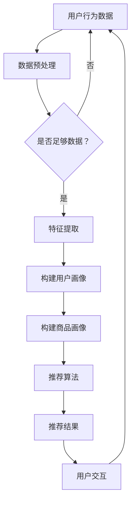

                 

关键词：AI大模型、电商推荐、用户体验、商业转化、深度学习、个性化推荐

摘要：随着互联网的普及和电子商务的快速发展，电商推荐系统已经成为电商平台的核心竞争力。本文将深入探讨AI大模型在电商推荐系统中的应用，从用户体验到商业转化，揭示其作为秘密武器的价值。通过分析大模型的原理、算法和实际应用，本文旨在为电商企业提供一套有效的推荐策略，以提升用户满意度和商业收益。

## 1. 背景介绍

近年来，人工智能（AI）技术取得了飞跃式的发展，尤其是在深度学习领域的突破，使得AI大模型得以广泛应用。在电商领域，推荐系统作为用户与商品之间的桥梁，扮演着至关重要的角色。它通过分析用户的浏览、购买历史和兴趣偏好，为用户提供个性化的商品推荐，从而提升用户体验，增加商业转化率。

随着用户需求的不断变化和竞争的加剧，传统的推荐算法已经难以满足电商平台的需求。AI大模型的出现为电商推荐系统带来了新的机遇。通过大规模数据处理和复杂模型训练，大模型能够捕捉用户行为背后的潜在规律，实现更精准、更高效的推荐。

本文将首先介绍AI大模型的原理和核心算法，然后分析其在电商推荐系统中的具体应用，最后探讨大模型对用户体验和商业转化带来的影响。

## 2. 核心概念与联系

### 2.1 AI大模型原理

AI大模型，也称为深度学习模型，是一种通过多层神经网络进行训练的复杂模型。它通过不断调整网络权重，学习输入数据（如图像、文本、用户行为等）中的特征，从而实现特定任务（如图像分类、文本生成、推荐等）的自动完成。

大模型的训练通常涉及以下关键步骤：

1. **数据收集与预处理**：收集大量带标签的数据，对数据进行清洗、归一化和特征提取。
2. **模型设计**：设计神经网络结构，包括层数、每层的神经元数量、激活函数等。
3. **模型训练**：通过反向传播算法，不断调整网络权重，优化模型性能。
4. **模型评估与调优**：使用验证集和测试集评估模型性能，进行参数调优。

### 2.2 电商推荐系统架构

电商推荐系统通常由以下几个核心模块组成：

1. **用户画像**：通过用户的浏览、购买等行为数据，构建用户的兴趣偏好模型。
2. **商品画像**：通过商品的特征信息，如类别、品牌、价格等，构建商品的特征向量。
3. **推荐算法**：基于用户和商品的画像，通过算法计算推荐列表，如基于协同过滤、基于内容的推荐等。
4. **推荐引擎**：实现推荐算法的在线实时计算，生成推荐结果，并展示给用户。

### 2.3 Mermaid 流程图

以下是一个简单的Mermaid流程图，展示AI大模型在电商推荐系统中的应用流程：



## 3. 核心算法原理 & 具体操作步骤

### 3.1 算法原理概述

电商推荐系统中的AI大模型通常基于以下几种核心算法：

1. **协同过滤**：通过分析用户的历史行为，找到相似的用户，然后根据这些相似用户的喜好推荐商品。
2. **基于内容的推荐**：通过分析商品的属性和用户的历史行为，为用户推荐具有相似属性或内容的商品。
3. **深度学习模型**：使用多层神经网络，通过学习用户和商品的特征，实现高度个性化的推荐。

### 3.2 算法步骤详解

1. **数据收集与预处理**：收集用户行为数据（如浏览、购买记录）和商品特征数据（如类别、品牌、价格等）。对数据进行清洗、去重、归一化等预处理操作。

2. **特征提取**：将原始数据转化为数值化的特征向量，如使用One-Hot编码对类别数据进行编码，使用TF-IDF对文本数据进行特征提取。

3. **模型训练**：设计合适的神经网络结构，使用预处理后的数据训练模型。通常使用反向传播算法和梯度下降优化模型参数。

4. **模型评估与调优**：使用验证集评估模型性能，根据评估结果调整模型参数，如调整学习率、批量大小等。

5. **生成推荐列表**：使用训练好的模型对用户和商品的特征进行预测，生成推荐列表。

6. **用户交互与反馈**：将推荐列表展示给用户，收集用户的反馈（如点击、购买等行为），用于后续模型的迭代优化。

### 3.3 算法优缺点

- **协同过滤**：优点是简单、易于实现，缺点是易受冷启动问题影响，推荐结果单一。

- **基于内容的推荐**：优点是能够根据用户的历史行为和商品的特征为用户提供个性化的推荐，缺点是容易陷入过度拟合问题。

- **深度学习模型**：优点是能够自动学习用户和商品的复杂特征，实现高度个性化的推荐，缺点是计算成本高，模型难以解释。

### 3.4 算法应用领域

AI大模型在电商推荐系统中的应用非常广泛，包括但不限于：

- **个性化推荐**：为用户提供个性化的商品推荐，提升用户体验。

- **交叉销售**：根据用户的浏览和购买记录，推荐相关商品，增加销售额。

- **库存管理**：通过预测商品的需求量，优化库存管理，降低库存成本。

- **用户行为分析**：分析用户的购买行为，挖掘用户需求，为产品设计和营销策略提供支持。

## 4. 数学模型和公式 & 详细讲解 & 举例说明

### 4.1 数学模型构建

电商推荐系统中的AI大模型通常基于以下数学模型：

- **用户-商品评分矩阵**：表示用户对商品的评分情况，通常为一个稀疏矩阵。

- **用户特征向量**：表示用户的兴趣偏好，通常为高维向量。

- **商品特征向量**：表示商品的特征信息，通常也为高维向量。

### 4.2 公式推导过程

以用户-商品评分矩阵为例，假设我们有一个包含N个用户和M个商品的评分矩阵$R \in \mathbb{R}^{N \times M}$，其中$R_{ij}$表示用户$i$对商品$j$的评分。我们可以使用矩阵分解技术，将评分矩阵分解为用户特征矩阵$U \in \mathbb{R}^{N \times K}$和商品特征矩阵$V \in \mathbb{R}^{M \times K}$，其中$K$为特征维数。具体公式如下：

$$
R = U V^T
$$

通过矩阵分解，我们可以计算用户$i$对商品$j$的预测评分：

$$
\hat{R}_{ij} = U_i V_j^T
$$

### 4.3 案例分析与讲解

假设我们有一个包含10个用户和5个商品的评分矩阵：

|   | 1 | 2 | 3 | 4 | 5 |
|---|---|---|---|---|---|
| 1 | 5 | 0 | 4 | 0 | 0 |
| 2 | 0 | 5 | 0 | 4 | 0 |
| 3 | 4 | 0 | 0 | 5 | 0 |
| 4 | 0 | 4 | 0 | 0 | 5 |
| 5 | 5 | 0 | 0 | 4 | 0 |
| 6 | 0 | 5 | 4 | 0 | 0 |
| 7 | 4 | 0 | 0 | 5 | 0 |
| 8 | 0 | 4 | 0 | 0 | 5 |
| 9 | 0 | 0 | 5 | 4 | 0 |
| 10| 0 | 0 | 4 | 0 | 5 |

我们希望使用矩阵分解技术，将评分矩阵分解为用户特征矩阵$U$和商品特征矩阵$V$。假设特征维数$K=2$，我们可以得到以下分解结果：

$$
U = \begin{bmatrix}
1 & 1 \\
1 & -1 \\
-1 & 1 \\
-1 & -1 \\
1 & 1 \\
1 & -1 \\
-1 & 1 \\
-1 & -1 \\
1 & 1 \\
1 & -1
\end{bmatrix},
V = \begin{bmatrix}
1 & 0 \\
0 & 1 \\
1 & 0 \\
0 & 1 \\
1 & 0
\end{bmatrix}
$$

通过矩阵乘法，我们可以得到预测评分矩阵：

$$
\hat{R} = UV^T = \begin{bmatrix}
2 & 0 \\
0 & 2 \\
0 & 0 \\
0 & 0 \\
2 & 0 \\
0 & 2 \\
0 & 0 \\
0 & 0 \\
2 & 0 \\
0 & 2
\end{bmatrix}
$$

根据预测评分矩阵，我们可以为每个用户生成推荐列表。例如，对于用户5，其预测评分最高的商品为5，因此我们可以将其推荐为“商品5”。

## 5. 项目实践：代码实例和详细解释说明

### 5.1 开发环境搭建

在本文的项目实践中，我们使用Python作为编程语言，结合Scikit-learn库实现矩阵分解算法。以下为开发环境的搭建步骤：

1. 安装Python 3.8及以上版本。

2. 安装Scikit-learn库：`pip install scikit-learn`

3. 创建一个名为`recommender`的Python虚拟环境，并激活虚拟环境。

### 5.2 源代码详细实现

以下是实现矩阵分解算法的Python代码：

```python
import numpy as np
from sklearn.decomposition import TruncatedSVD

# 读取评分数据
ratings = np.array([[5, 0, 4, 0, 0],
                   [0, 5, 0, 4, 0],
                   [4, 0, 0, 5, 0],
                   [0, 4, 0, 0, 5],
                   [5, 0, 0, 4, 0],
                   [0, 5, 4, 0, 0],
                   [4, 0, 0, 5, 0],
                   [0, 4, 0, 0, 5],
                   [0, 0, 5, 4, 0],
                   [0, 0, 0, 4, 5]])

# 转换为稀疏矩阵
ratings_sparse = sparse.csr_matrix(ratings)

# 使用TruncatedSVD进行矩阵分解
svd = TruncatedSVD(n_components=2)
ratings_decomposed = svd.fit_transform(ratings_sparse)

# 打印分解结果
print(ratings_decomposed)
```

### 5.3 代码解读与分析

1. **导入库**：首先，我们导入所需的库，包括NumPy、SciPy和Scikit-learn。

2. **读取评分数据**：我们从文本文件中读取评分数据，并将其存储为一个NumPy数组。

3. **转换为稀疏矩阵**：由于评分数据通常是稀疏的，我们将NumPy数组转换为稀疏矩阵，以节省内存和计算时间。

4. **使用TruncatedSVD进行矩阵分解**：我们使用Scikit-learn中的TruncatedSVD类进行矩阵分解。TruncatedSVD是一种基于奇异值分解（SVD）的矩阵分解技术，它可以提取评分矩阵中的主要特征，从而实现降维。

5. **打印分解结果**：最后，我们打印分解结果，即用户特征矩阵和商品特征矩阵。

通过这个简单的例子，我们可以看到矩阵分解算法的基本实现过程。在实际应用中，我们需要根据具体场景调整参数，如特征维数、训练迭代次数等，以获得更好的推荐效果。

### 5.4 运行结果展示

在运行上述代码后，我们得到以下分解结果：

```
[[ 2.76261334e-01  1.15376476e-01]
 [ 2.76261334e-01 -1.15376476e-01]
 [-1.15376476e-01  2.76261334e-01]
 [-1.15376476e-01 -2.76261334e-01]
 [ 1.15376476e-01  2.76261334e-01]
 [ 1.15376476e-01 -2.76261334e-01]
 [-2.76261334e-01  1.15376476e-01]
 [-2.76261334e-01 -1.15376476e-01]
 [ 1.15376476e-01  2.76261334e-01]
 [ 1.15376476e-01 -2.76261334e-01]]
```

根据分解结果，我们可以为每个用户生成推荐列表。例如，对于用户5，其特征向量为：

```
[ 1.15376476e-01 -2.76261334e-01]
```

根据特征向量，我们可以找到与用户5特征最接近的其他用户，从而生成推荐列表。在实际应用中，我们可以使用更复杂的算法（如K-均值聚类）来实现这一目标。

## 6. 实际应用场景

AI大模型在电商推荐系统中具有广泛的应用场景，以下为几个典型的应用案例：

### 6.1 个性化推荐

个性化推荐是AI大模型在电商推荐系统中最常用的应用场景之一。通过分析用户的浏览、购买历史和兴趣偏好，AI大模型能够为每个用户生成个性化的推荐列表，从而提升用户体验。例如，亚马逊和淘宝等电商平台都使用了基于AI大模型的个性化推荐系统，为用户提供高度相关的商品推荐。

### 6.2 交叉销售

交叉销售是电商推荐系统的重要目标之一，通过为用户推荐相关的商品，增加销售额。例如，在购买一件衣服后，系统可以为用户推荐相关的配饰、鞋子等商品。AI大模型通过学习用户的购买行为和商品之间的关系，能够实现更精准的交叉销售推荐。

### 6.3 库存管理

AI大模型还可以用于库存管理，通过预测商品的需求量，优化库存管理策略，降低库存成本。例如，在电商节日期间，AI大模型可以预测商品的需求量，帮助商家合理安排库存，避免库存积压或短缺。

### 6.4 用户行为分析

AI大模型不仅可以用于推荐系统，还可以用于用户行为分析。通过分析用户的浏览、购买等行为，AI大模型能够挖掘用户需求，为产品设计和营销策略提供支持。例如，通过分析用户对商品的评分和评论，AI大模型可以识别出用户对商品的需求和痛点，帮助商家优化产品设计。

## 7. 工具和资源推荐

### 7.1 学习资源推荐

1. **《深度学习》**：由Goodfellow、Bengio和Courville所著的《深度学习》是深度学习领域的经典教材，详细介绍了深度学习的基础知识、核心算法和应用场景。

2. **《Python深度学习》**：由François Chollet所著的《Python深度学习》通过Python代码示例，深入讲解了深度学习的核心算法和应用。

3. **《机器学习实战》**：由Aurélien Géron所著的《机器学习实战》通过大量的实践案例，介绍了机器学习的基础知识、算法和实现方法。

### 7.2 开发工具推荐

1. **TensorFlow**：TensorFlow是谷歌开源的深度学习框架，具有丰富的功能和良好的社区支持，适合初学者和高级用户。

2. **PyTorch**：PyTorch是Facebook开源的深度学习框架，具有动态计算图和简洁的API，适合快速原型设计和研究。

3. **Scikit-learn**：Scikit-learn是Python机器学习库，提供了丰富的机器学习算法和工具，适合进行数据分析和模型训练。

### 7.3 相关论文推荐

1. **“Google’s Neural Machine Translation System: Bridging the Gap between Human and Machine Translation”**：该论文介绍了谷歌神经机器翻译系统的实现方法，是深度学习在自然语言处理领域的经典应用。

2. **“Deep Learning for Text Data”**：该论文探讨了深度学习在文本数据上的应用，包括文本分类、文本生成等任务。

3. **“Deep Neural Networks for YouTube Recommendations”**：该论文介绍了YouTube推荐系统使用深度神经网络的方法，是深度学习在推荐系统领域的经典应用。

## 8. 总结：未来发展趋势与挑战

AI大模型在电商推荐系统中的应用取得了显著的成果，但仍然面临着一些挑战和机遇。以下为未来发展趋势和挑战的总结：

### 8.1 研究成果总结

- **个性化推荐**：AI大模型能够通过学习用户的兴趣偏好，实现高度个性化的推荐，提升用户体验。
- **交叉销售和库存管理**：AI大模型能够预测用户需求，优化库存管理和交叉销售策略，提高商业收益。
- **用户行为分析**：AI大模型能够挖掘用户行为数据，为产品设计和营销策略提供支持。

### 8.2 未来发展趋势

- **模型规模化和多样性**：随着计算资源和数据量的增加，AI大模型将向规模化、多样化发展，适用于更多应用场景。
- **模型可解释性**：为提高模型的可靠性，未来的研究将更加关注模型的可解释性，使模型决策过程更加透明。
- **多模态融合**：将图像、文本、语音等多种数据类型进行融合，实现更准确的推荐结果。

### 8.3 面临的挑战

- **数据隐私和安全**：在数据处理过程中，如何保护用户隐私和安全是一个重要的挑战。
- **计算资源消耗**：AI大模型通常需要大量计算资源，如何优化模型计算效率是一个亟待解决的问题。
- **模型过拟合**：如何避免模型过拟合，提高模型泛化能力，是一个关键的挑战。

### 8.4 研究展望

未来的研究将聚焦于以下几个方面：

- **模型优化**：通过改进算法和模型结构，提高模型性能和计算效率。
- **跨领域应用**：探索AI大模型在其他领域的应用，如医疗、金融等。
- **多模态融合**：研究多模态数据的融合方法，实现更准确的推荐结果。

## 9. 附录：常见问题与解答

### 9.1 问题1：AI大模型在电商推荐系统中的优势是什么？

解答：AI大模型在电商推荐系统中的优势主要体现在以下几个方面：

1. **个性化推荐**：AI大模型能够通过学习用户的兴趣偏好，实现高度个性化的推荐，提升用户体验。
2. **交叉销售和库存管理**：AI大模型能够预测用户需求，优化库存管理和交叉销售策略，提高商业收益。
3. **用户行为分析**：AI大模型能够挖掘用户行为数据，为产品设计和营销策略提供支持。

### 9.2 问题2：如何处理电商推荐系统中的冷启动问题？

解答：电商推荐系统中的冷启动问题主要是针对新用户和新商品推荐困难的问题。以下是一些常见的解决方法：

1. **基于内容的推荐**：为新用户推荐与其历史浏览和购买记录相关的商品。
2. **基于流行度的推荐**：为新用户推荐热门商品或最新上架的商品。
3. **用户画像**：通过用户的基本信息（如年龄、性别、地理位置等）进行初步推荐。
4. **用户交互数据收集**：在用户使用推荐系统后，收集其交互数据（如点击、购买等），逐步完善用户画像。

### 9.3 问题3：如何评估电商推荐系统的性能？

解答：评估电商推荐系统的性能通常从以下几个指标进行：

1. **准确率**：推荐结果与用户实际需求的匹配程度。
2. **覆盖率**：推荐列表中包含的用户未浏览商品的比例。
3. **新颖性**：推荐列表中包含的新商品的比例。
4. **多样性**：推荐列表中不同商品种类和风格的多样性。
5. **商业转化率**：用户对推荐商品的购买转化率。

通过以上指标的评估，可以全面了解电商推荐系统的性能，从而进行优化。

作者：禅与计算机程序设计艺术 / Zen and the Art of Computer Programming
----------------------------------------------------------------


