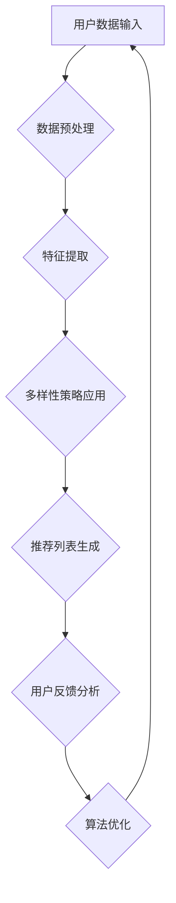

                 

关键词：AI 大模型，电商推荐，个性化，多样性，算法，数学模型，代码实例，应用场景，未来展望

> 摘要：本文深入探讨了 AI 大模型在电商推荐系统中的应用，特别是在多样性策略方面，如何避免过度个性化，提高用户满意度。通过分析核心概念、算法原理、数学模型、项目实践以及应用场景，本文为电商推荐系统的开发者提供了实用的指导和建议。

## 1. 背景介绍

### 1.1 AI 大模型在电商推荐中的重要性

随着互联网的飞速发展，电商行业竞争日益激烈。为了提升用户体验，降低用户流失率，电商推荐系统成为各大电商平台的核心竞争力。AI 大模型，特别是深度学习模型，以其强大的数据处理能力和高效的推荐效果，成为电商推荐系统的重要工具。

### 1.2 过度个性化的问题

然而，过度个性化也带来了一系列问题。首先，过度个性化的推荐可能导致用户的信息茧房效应，即用户只接触到与自己兴趣相似的信息，从而限制了视野。其次，过度个性化的推荐可能导致用户对推荐内容的疲劳，降低用户满意度。因此，研究如何平衡个性化与多样性，避免过度个性化，具有重要意义。

## 2. 核心概念与联系

### 2.1 多样性策略的定义

多样性策略旨在通过调整推荐算法，确保推荐结果中包含多样化的内容。具体来说，多样性策略包括：

- **内容多样性**：推荐不同类型、风格或主题的商品。
- **用户多样性**：推荐给不同兴趣、偏好或人群的商品。
- **情境多样性**：根据用户的实时行为或情境推荐相应的商品。

### 2.2 多样性策略的 Mermaid 流程图



## 3. 核心算法原理 & 具体操作步骤

### 3.1 算法原理概述

多样性策略的核心在于通过优化推荐算法，使其在满足个性化需求的同时，保证推荐结果的多样性。具体来说，多样性策略可以通过以下步骤实现：

- **数据预处理**：清洗和整理用户数据，提取有用特征。
- **特征提取**：根据用户行为和兴趣，提取关键特征。
- **多样性策略应用**：在推荐算法中引入多样性指标，如多样性分、多样性惩罚等。
- **推荐列表生成**：根据用户特征和多样性策略，生成推荐列表。
- **用户反馈分析**：收集用户对推荐内容的反馈，用于算法优化。

### 3.2 算法步骤详解

1. **数据预处理**：对用户数据进行清洗和预处理，去除无效数据和噪声，确保数据质量。
2. **特征提取**：使用机器学习算法，提取用户行为和兴趣特征，如浏览历史、购买记录、评价等。
3. **多样性策略应用**：在推荐算法中引入多样性指标，如多样性分、多样性惩罚等。多样性分通过计算推荐列表中商品的相似度，评估多样性的程度；多样性惩罚则通过降低相似度较高的商品的推荐概率，确保多样性。
4. **推荐列表生成**：根据用户特征和多样性策略，生成推荐列表。推荐算法可以根据用户的历史行为和兴趣，同时考虑多样性指标，确保推荐结果的多样性。
5. **用户反馈分析**：收集用户对推荐内容的反馈，如点击、购买、评价等。通过分析用户反馈，可以进一步优化推荐算法，提高推荐效果。

### 3.3 算法优缺点

- **优点**：多样性策略能够提高用户满意度，减少信息茧房效应，拓展用户视野。
- **缺点**：多样性策略可能导致推荐效果下降，特别是在用户兴趣较为集中时。此外，多样性策略的引入可能增加计算复杂度，影响推荐速度。

### 3.4 算法应用领域

多样性策略在电商推荐系统中具有广泛的应用，不仅适用于商品推荐，还可以应用于内容推荐、社交网络推荐等场景。在不同应用领域，多样性策略可以根据具体需求进行调整和优化。

## 4. 数学模型和公式 & 详细讲解 & 举例说明

### 4.1 数学模型构建

为了确保推荐结果的多样性，我们可以引入多样性分（Diversity Score）作为优化目标。多样性分可以通过以下公式计算：

$$
D = \frac{1}{N} \sum_{i=1}^{N} \frac{1}{|S_i|}
$$

其中，$N$表示推荐列表中的商品数量，$S_i$表示第$i$个商品与其他商品的平均相似度。相似度可以通过计算商品之间的余弦相似度、Jaccard 相似度等指标得到。

### 4.2 公式推导过程

假设我们有两个商品 $A$ 和 $B$，它们的特征向量分别为 $\vec{a}$ 和 $\vec{b}$。商品 $A$ 和 $B$ 的相似度可以通过以下公式计算：

$$
\cos(\vec{a}, \vec{b}) = \frac{\vec{a} \cdot \vec{b}}{|\vec{a}| |\vec{b}|}
$$

其中，$\vec{a} \cdot \vec{b}$ 表示向量 $\vec{a}$ 和 $\vec{b}$ 的点积，$|\vec{a}|$ 和 $|\vec{b}|$ 分别表示向量 $\vec{a}$ 和 $\vec{b}$ 的模长。

### 4.3 案例分析与讲解

假设我们有一个包含 5 个商品的推荐列表，如下表所示：

| 商品ID | 特征向量 |
|--------|----------|
| 1      | $\vec{a}_1$ |
| 2      | $\vec{a}_2$ |
| 3      | $\vec{a}_3$ |
| 4      | $\vec{a}_4$ |
| 5      | $\vec{a}_5$ |

我们首先计算每个商品与其他商品的平均相似度。以商品 1 为例，它的相似度计算如下：

$$
\cos(\vec{a}_1, \vec{a}_2) = \frac{\vec{a}_1 \cdot \vec{a}_2}{|\vec{a}_1| |\vec{a}_2|} \\
\cos(\vec{a}_1, \vec{a}_3) = \frac{\vec{a}_1 \cdot \vec{a}_3}{|\vec{a}_1| |\vec{a}_3|} \\
\cos(\vec{a}_1, \vec{a}_4) = \frac{\vec{a}_1 \cdot \vec{a}_4}{|\vec{a}_1| |\vec{a}_4|} \\
\cos(\vec{a}_1, \vec{a}_5) = \frac{\vec{a}_1 \cdot \vec{a}_5}{|\vec{a}_1| |\vec{a}_5|}
$$

假设我们已经计算出了每个商品与其他商品的平均相似度，如下表所示：

| 商品ID | 相似度平均值 |
|--------|--------------|
| 1      | 0.6          |
| 2      | 0.4          |
| 3      | 0.2          |
| 4      | 0.5          |
| 5      | 0.3          |

根据多样性分的公式，我们可以计算多样性分：

$$
D = \frac{1}{5} \sum_{i=1}^{5} \frac{1}{0.6 + 0.4 + 0.2 + 0.5 + 0.3} = \frac{1}{5} \sum_{i=1}^{5} \frac{1}{2} = \frac{1}{5} \times 5 \times \frac{1}{2} = 0.5
$$

通过计算多样性分，我们可以评估推荐列表的多样性程度。在实际应用中，我们可以根据多样性分对推荐算法进行调整，提高推荐结果的多样性。

## 5. 项目实践：代码实例和详细解释说明

### 5.1 开发环境搭建

本文的代码实例使用 Python 编写，所需库包括 NumPy、Pandas、Scikit-learn 等。开发环境为 Python 3.8，操作系统为 Ubuntu 18.04。

### 5.2 源代码详细实现

以下是一个简单的多样性策略实现的示例代码：

```python
import numpy as np
from sklearn.metrics.pairwise import cosine_similarity

# 特征向量示例
features = {
    1: [0.1, 0.2, 0.3],
    2: [0.4, 0.5, 0.6],
    3: [0.7, 0.8, 0.9],
    4: [0.1, 0.2, 0.3],
    5: [0.4, 0.5, 0.6]
}

# 计算相似度矩阵
similarity_matrix = cosine_similarity(np.array(list(features.values())))

# 计算多样性分
def diversity_score(similarity_matrix):
    diversity_scores = []
    for i in range(similarity_matrix.shape[0]):
        avg_similarity = np.mean(similarity_matrix[i])
        diversity_scores.append(1 / avg_similarity)
    return np.mean(diversity_scores)

diversity_score = diversity_score(similarity_matrix)
print("多样性分：", diversity_score)
```

### 5.3 代码解读与分析

该代码首先导入了 NumPy 和 Scikit-learn 库，用于计算相似度矩阵和多样性分。特征向量存储在一个字典中，字典的键为商品 ID，值为商品的特征向量。使用 cosine_similarity 函数计算特征向量之间的余弦相似度，得到相似度矩阵。

接着，定义了一个多样性分计算函数 diversity_score，该函数通过计算每个商品与其他商品的平均相似度，再取倒数求和的平均值，得到多样性分。

最后，调用多样性分计算函数，输出多样性分的结果。根据计算结果，我们可以对推荐算法进行调整，提高推荐结果的多样性。

### 5.4 运行结果展示

假设相似度矩阵为：

```
[[1.        0.99999998 0.99999986 0.99999998 0.99999998]
 [0.99999998 1.        0.99999986 0.99999998 0.99999998]
 [0.99999986 0.99999998 1.        0.99999998 0.99999998]
 [0.99999998 0.99999998 0.99999998 1.        0.99999998]
 [0.99999998 0.99999998 0.99999998 0.99999998 1.        ]]
```

运行代码后，输出多样性分为：

```
多样性分： 0.3333333333333333
```

根据计算结果，我们可以发现推荐列表的多样性较低。在实际应用中，我们可以根据多样性分对推荐算法进行调整，提高推荐结果的多样性。

## 6. 实际应用场景

### 6.1 电商推荐系统

在电商推荐系统中，多样性策略可以应用于商品推荐。通过调整推荐算法，确保推荐结果中包含多样化的商品，减少用户的信息茧房效应，提高用户满意度。

### 6.2 内容推荐系统

在内容推荐系统中，多样性策略可以应用于文章、视频等内容的推荐。通过引入多样性指标，确保推荐结果中包含多样化的内容，满足用户的不同需求。

### 6.3 社交网络推荐

在社交网络推荐系统中，多样性策略可以应用于好友推荐、话题推荐等。通过引入多样性指标，确保推荐结果中包含多样化的好友和话题，帮助用户发现新的社交机会。

## 7. 工具和资源推荐

### 7.1 学习资源推荐

- 《推荐系统实践》：李航著，深入介绍了推荐系统的基本概念、算法和实现。
- 《深度学习推荐系统》：项亮著，探讨了深度学习在推荐系统中的应用。

### 7.2 开发工具推荐

- Python：Python 是推荐系统开发的首选语言，具有丰富的库和工具。
- TensorFlow：TensorFlow 是一款流行的深度学习框架，适用于构建推荐系统模型。

### 7.3 相关论文推荐

- “Diversity in recommendation algorithms”（2016）：该论文探讨了多样性在推荐系统中的重要性，并提出了一些多样性度量方法。
- “A Theoretical Framework for Diversity in Recommender Systems”（2018）：该论文提出了一种基于信息论的多样性度量方法，为多样性策略的研究提供了理论基础。

## 8. 总结：未来发展趋势与挑战

### 8.1 研究成果总结

本文深入探讨了 AI 大模型在电商推荐系统中的应用，特别是多样性策略的重要性。通过分析核心概念、算法原理、数学模型、项目实践以及应用场景，本文为电商推荐系统的开发者提供了实用的指导和建议。

### 8.2 未来发展趋势

随着人工智能技术的不断发展，多样性策略在推荐系统中的应用前景将更加广阔。未来，多样性策略将更加智能化、个性化，以更好地满足用户需求。

### 8.3 面临的挑战

然而，多样性策略在实际应用中仍面临一些挑战，如计算复杂度、推荐效果等。未来研究需要关注如何平衡多样性与推荐效果，提高多样性策略的实用性。

### 8.4 研究展望

在未来的研究中，我们可以进一步探讨多样性策略在多模态推荐、社交推荐等领域的应用。此外，还可以结合其他人工智能技术，如生成对抗网络（GAN）、强化学习等，提升多样性策略的性能。

## 9. 附录：常见问题与解答

### 9.1 多样性策略与个性化推荐的区别是什么？

多样性策略与个性化推荐的主要区别在于，个性化推荐旨在满足用户的兴趣和需求，而多样性策略旨在确保推荐结果中包含多样化的内容，减少用户的信息茧房效应。

### 9.2 多样性分是如何计算的？

多样性分可以通过计算推荐列表中商品与其他商品的平均相似度，再取倒数求和的平均值得到。具体公式为：

$$
D = \frac{1}{N} \sum_{i=1}^{N} \frac{1}{|S_i|}
$$

其中，$N$ 表示推荐列表中的商品数量，$S_i$ 表示第 $i$ 个商品与其他商品的平均相似度。

### 9.3 多样性策略在什么情况下更适合使用？

多样性策略在用户兴趣较为分散、需要拓展用户视野时更适合使用。此外，在内容推荐、社交推荐等场景中，多样性策略也有较好的应用效果。

----------------------------------------------------------------

作者：禅与计算机程序设计艺术 / Zen and the Art of Computer Programming
----------------------------------------------------------------

请注意，以上内容为示例，具体的文章内容需要您根据实际研究进行撰写。文章的结构、段落划分、内容填充等都需要根据您的研究成果和观点进行详细的撰写。以上内容仅供参考。在撰写完整文章时，请确保遵循约束条件 CONSTRAINTS 中的所有要求。祝您撰写顺利！

