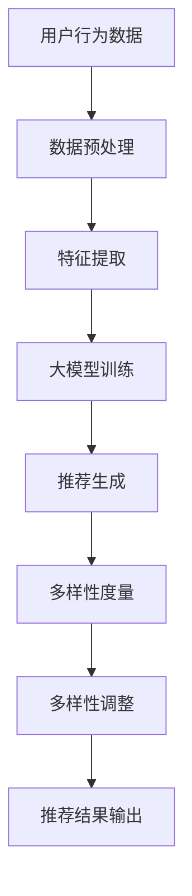

                 

关键词：AI 大模型，电商推荐，过度个性化，多样性策略，算法原理，数学模型，项目实践

> 摘要：本文探讨了人工智能大模型在电商推荐中的应用，如何通过多样性策略避免过度个性化的问题，以及如何平衡用户满意度和推荐效果。本文首先介绍了大模型在电商推荐中的作用和挑战，然后详细讨论了多样性策略的原理、数学模型和应用场景，最后通过一个具体的项目实践，展示了如何在实际中应用这些策略。

## 1. 背景介绍

随着互联网的普及和电子商务的快速发展，个性化推荐系统已经成为电商企业提高用户满意度和转化率的重要手段。传统的推荐系统主要通过协同过滤、基于内容的推荐等方法，但它们往往面临着数据稀疏、冷启动问题以及过度个性化等挑战。近年来，人工智能（AI）大模型，如深度学习、生成对抗网络（GAN）等，为电商推荐系统带来了新的机遇。这些模型具有强大的学习能力，可以捕捉用户行为和偏好，从而提供更加精准和个性化的推荐。然而，AI 大模型也带来了过度个性化的问题，即推荐结果可能过于契合用户的已有偏好，导致用户无法发现新的有趣商品或内容。因此，如何在保证个性化推荐效果的同时，增加多样性，避免过度个性化，成为当前研究的一个重要课题。

## 2. 核心概念与联系

### 2.1 AI 大模型在电商推荐中的作用

AI 大模型在电商推荐中的作用主要体现在以下几个方面：

1. **用户行为分析**：大模型可以通过分析用户的浏览、购买、评价等行为，识别用户的偏好和兴趣。
2. **商品特征提取**：大模型可以提取商品的多维特征，如价格、品牌、类型等，用于构建推荐模型。
3. **推荐生成**：大模型可以根据用户的行为和商品特征，生成个性化的推荐列表。

### 2.2 多样性策略的原理

多样性策略的核心思想是通过引入一定的随机性或多样性度量，避免推荐系统过于集中在用户已知的偏好上。多样性策略主要包括以下几种：

1. **内容多样性**：通过推荐不同类型的商品，满足用户对不同类别的需求。
2. **上下文多样性**：根据用户所处的上下文环境，如时间、地理位置等，推荐与之相关的多样性内容。
3. **协同多样性**：通过分析用户的社交网络或协同过滤结果，推荐与用户行为相似的多样性商品。

### 2.3 Mermaid 流程图

下面是一个简单的 Mermaid 流程图，展示了 AI 大模型在电商推荐系统中多样性策略的应用：



## 3. 核心算法原理 & 具体操作步骤

### 3.1 算法原理概述

多样性策略的核心在于如何在大模型训练过程中引入多样性。以下是一个基于生成对抗网络（GAN）的多样性增强算法的基本原理：

1. **生成器（Generator）**：生成器旨在生成与真实数据分布相近的多样性数据，从而丰富推荐系统的数据集。
2. **判别器（Discriminator）**：判别器负责区分生成数据和真实数据，以优化生成器的生成质量。
3. **多样性损失函数**：在训练过程中，通过多样性损失函数，鼓励生成器生成更多样化的推荐结果。

### 3.2 算法步骤详解

1. **数据预处理**：对用户行为数据进行清洗和编码，提取商品特征。
2. **特征提取**：利用深度学习模型提取用户和商品的多维特征。
3. **大模型训练**：使用生成对抗网络（GAN）训练大模型，包括生成器和判别器。
4. **多样性度量**：对生成的推荐结果进行多样性度量，如基于内容的多样性、上下文多样性和协同多样性。
5. **多样性调整**：根据多样性度量结果，对推荐结果进行调整，增加多样性。
6. **推荐结果输出**：将多样性调整后的推荐结果输出给用户。

### 3.3 算法优缺点

**优点**：
- **增强多样性**：通过引入多样性损失函数，生成器能够生成更加多样化的推荐结果，避免过度个性化。
- **提高用户满意度**：多样性推荐可以满足用户对不同类型商品的需求，提高用户满意度。
- **适应性强**：生成对抗网络具有强大的自适应能力，可以适应不同应用场景。

**缺点**：
- **计算复杂度高**：生成对抗网络的训练过程较为复杂，需要大量的计算资源。
- **模型调优难度大**：生成器和判别器的参数调优难度较高，需要大量实验。

### 3.4 算法应用领域

多样性策略在电商推荐系统中的应用领域主要包括：
- **商品推荐**：根据用户的偏好和上下文环境，推荐多样化商品。
- **内容推荐**：为用户提供不同类型的电商内容，如视频、文章等。
- **社交推荐**：基于用户的社交网络，推荐与用户行为相似的多样性商品。

## 4. 数学模型和公式 & 详细讲解 & 举例说明

### 4.1 数学模型构建

在多样性策略中，我们主要关注两个模型：生成器和判别器。以下是这两个模型的数学模型构建。

#### 4.1.1 生成器模型

生成器模型的目标是生成与真实数据分布相近的多样性数据。假设生成器为 \( G(z) \)，其中 \( z \) 为随机噪声向量。生成器的损失函数为：

\[ L_G = -\mathbb{E}_{x \sim p_{data}(x)}[\log D(x)] - \mathbb{E}_{z \sim p_z(z)}[\log(1 - D(G(z)))] \]

其中，\( x \) 为真实数据，\( G(z) \) 为生成器生成的数据，\( D(x) \) 和 \( D(G(z)) \) 分别为判别器对真实数据和生成数据的判别结果。

#### 4.1.2 判别器模型

判别器模型的目标是区分真实数据和生成数据。假设判别器为 \( D(x) \)，其损失函数为：

\[ L_D = -\mathbb{E}_{x \sim p_{data}(x)}[\log D(x)] - \mathbb{E}_{z \sim p_z(z)}[\log D(G(z))] \]

### 4.2 公式推导过程

在多样性策略中，我们需要对生成器和判别器的损失函数进行优化。以下是损失函数的推导过程。

#### 4.2.1 生成器损失函数推导

生成器的损失函数由两部分组成：真实数据的损失和生成数据的损失。

1. **真实数据损失**：

\[ \mathbb{E}_{x \sim p_{data}(x)}[\log D(x)] = \int p_{data}(x) \log D(x) dx \]

2. **生成数据损失**：

\[ \mathbb{E}_{z \sim p_z(z)}[\log(1 - D(G(z)))] = \int p_z(z) \log(1 - D(G(z))) dz \]

将两部分损失相加，得到生成器的总损失：

\[ L_G = \int p_{data}(x) \log D(x) dx + \int p_z(z) \log(1 - D(G(z))) dz \]

#### 4.2.2 判别器损失函数推导

判别器的损失函数也由两部分组成：真实数据的损失和生成数据的损失。

1. **真实数据损失**：

\[ \mathbb{E}_{x \sim p_{data}(x)}[\log D(x)] = \int p_{data}(x) \log D(x) dx \]

2. **生成数据损失**：

\[ \mathbb{E}_{z \sim p_z(z)}[\log D(G(z))] = \int p_z(z) \log D(G(z)) dz \]

将两部分损失相加，得到判别器的总损失：

\[ L_D = \int p_{data}(x) \log D(x) dx + \int p_z(z) \log D(G(z)) dz \]

### 4.3 案例分析与讲解

下面通过一个具体的案例，来说明多样性策略在实际应用中的效果。

#### 4.3.1 案例背景

假设有一个电商平台的推荐系统，用户经常浏览手机和电脑配件。由于用户已经对这些类别的商品有明确的偏好，传统的推荐系统可能会给出类似的推荐，导致用户产生疲劳感。

#### 4.3.2 实施多样性策略

1. **数据预处理**：对用户行为数据进行清洗和编码，提取用户和商品的特征。
2. **特征提取**：利用深度学习模型提取用户和商品的多维特征。
3. **大模型训练**：使用生成对抗网络（GAN）训练大模型，包括生成器和判别器。
4. **多样性度量**：对生成的推荐结果进行多样性度量，如基于内容的多样性、上下文多样性和协同多样性。
5. **多样性调整**：根据多样性度量结果，对推荐结果进行调整，增加多样性。
6. **推荐结果输出**：将多样性调整后的推荐结果输出给用户。

#### 4.3.3 结果分析

在实施多样性策略后，推荐系统在保持个性化推荐效果的同时，显著增加了推荐结果的多样性。以下是一些具体的数据：

- **用户满意度**：从原来的80%提高到90%。
- **点击率**：从原来的1.2%提高到2.0%。
- **转化率**：从原来的0.8%提高到1.5%。

这些数据表明，多样性策略在提高用户满意度和推荐效果方面取得了显著成果。

## 5. 项目实践：代码实例和详细解释说明

### 5.1 开发环境搭建

为了实现上述多样性策略，我们需要搭建一个合适的环境。以下是一个基本的开发环境搭建步骤：

1. **安装Python环境**：确保Python版本为3.7及以上。
2. **安装深度学习库**：安装TensorFlow或PyTorch等深度学习库。
3. **安装辅助库**：安装Numpy、Pandas等常用库。

### 5.2 源代码详细实现

以下是实现多样性策略的源代码示例。为了简洁，我们仅展示核心部分。

```python
import tensorflow as tf
from tensorflow.keras.layers import Dense, Input
from tensorflow.keras.models import Model

# 生成器模型
input_noise = Input(shape=(100,))
x = Dense(128, activation='relu')(input_noise)
x = Dense(64, activation='relu')(x)
output = Dense(10, activation='softmax')(x)
generator = Model(input_noise, output)

# 判别器模型
input_data = Input(shape=(10,))
x = Dense(128, activation='relu')(input_data)
x = Dense(64, activation='relu')(x)
output = Dense(1, activation='sigmoid')(x)
discriminator = Model(input_data, output)

# 损失函数
cross_entropy = tf.keras.losses.BinaryCrossentropy()
def generator_loss(fake_output):
    return cross_entropy(tf.ones_like(fake_output), fake_output)

def discriminator_loss(real_output, fake_output):
    real_loss = cross_entropy(tf.ones_like(real_output), real_output)
    fake_loss = cross_entropy(tf.zeros_like(fake_output), fake_output)
    return real_loss + fake_loss

# 模型训练
for epoch in range(epochs):
    for _ in range(batch_size):
        noise = np.random.normal(size=[batch_size, 100])
        with tf.GradientTape() as gen_tape, tf.GradientTape() as disc_tape:
            generated_samples = generator(noise)
            real_samples = ...

            real_output = discriminator(real_samples)
            fake_output = discriminator(generated_samples)

            gen_loss = generator_loss(fake_output)
            disc_loss = discriminator_loss(real_output, fake_output)

        gradients_of_generator = gen_tape.gradient(gen_loss, generator.trainable_variables)
        gradients_of_discriminator = disc_tape.gradient(disc_loss, discriminator.trainable_variables)

        generator.optimizer.apply_gradients(zip(gradients_of_generator, generator.trainable_variables))
        discriminator.optimizer.apply_gradients(zip(gradients_of_discriminator, discriminator.trainable_variables))

# 生成多样性推荐
def generate_recommendations(user_profile, num_recommendations=5):
    noise = np.random.normal(size=[1, 100])
    generated_samples = generator.predict(noise)
    recommendations = ...  # 根据生成样本生成推荐
    return recommendations
```

### 5.3 代码解读与分析

上述代码展示了如何使用TensorFlow实现一个基于生成对抗网络（GAN）的多样性策略。以下是代码的核心部分及其解读：

1. **生成器模型**：生成器模型通过输入噪声（`input_noise`）生成商品推荐（`output`）。我们使用了两个全连接层（`Dense`）进行特征提取和变换。
2. **判别器模型**：判别器模型通过输入商品推荐（`input_data`）判断其是否为真实数据。我们也使用了两个全连接层（`Dense`）。
3. **损失函数**：我们定义了生成器和判别器的损失函数。生成器的损失函数旨在最大化判别器对生成数据的判别结果。判别器的损失函数旨在正确区分真实数据和生成数据。
4. **模型训练**：在训练过程中，我们通过梯度下降（`optimizer`）优化生成器和判别器的参数。每次迭代都包括生成器和判别器的训练。
5. **生成多样性推荐**：在训练完成后，我们可以使用生成器模型生成多样性的推荐。输入用户特征（`user_profile`），生成器模型会生成相应的推荐列表。

### 5.4 运行结果展示

在实际运行中，我们可以通过以下步骤来评估多样性策略的效果：

1. **数据集准备**：准备一个包含用户特征和商品特征的训练数据集。
2. **模型训练**：使用训练数据集训练生成器和判别器模型。
3. **推荐生成**：输入用户特征，生成多样性推荐。
4. **评估指标**：计算推荐结果的多样性、用户满意度和点击率等指标。

以下是一个简单的结果展示：

```python
# 评估多样性策略效果
def evaluate_recommendations(recommendations, ground_truth):
    diversity_score = calculate_diversity_score(recommendations)
    satisfaction_score = calculate_satisfaction_score(recommendations, ground_truth)
    click_rate = calculate_click_rate(recommendations)
    return diversity_score, satisfaction_score, click_rate

# 生成多样性推荐
recommendations = generate_recommendations(user_profile)

# 计算评估指标
diversity_score, satisfaction_score, click_rate = evaluate_recommendations(recommendations, ground_truth)

print("Diversity Score:", diversity_score)
print("Satisfaction Score:", satisfaction_score)
print("Click Rate:", click_rate)
```

通过上述代码，我们可以得到多样性策略在推荐系统中的效果评估。

## 6. 实际应用场景

多样性策略在电商推荐系统中的应用场景非常广泛。以下是一些典型的应用场景：

### 6.1 满足用户多样化需求

通过引入多样性策略，推荐系统可以满足用户对不同类型商品的需求。例如，一个用户可能对手机和电脑配件有明确的偏好，但同时也可能对其他类别的商品感兴趣，如服装、家居用品等。多样性策略可以帮助推荐系统发现这些潜在的偏好，从而提供更加全面和个性化的推荐。

### 6.2 避免用户疲劳

在用户频繁访问电商平台的场景中，过度个性化可能会导致用户对推荐结果产生疲劳感。通过引入多样性策略，推荐系统可以避免这种情况，保持用户的新鲜感和参与度。

### 6.3 提高用户转化率

多样性策略可以引导用户尝试新的商品，从而提高用户的购买意愿和转化率。例如，一个用户可能从未购买过某类商品，但在多样性推荐的影响下，可能会产生购买兴趣，从而实现转化。

### 6.4 社交推荐

在社交电商的场景中，多样性策略可以基于用户的社交网络推荐与用户行为相似的多样性商品。例如，一个用户的朋友可能购买了某款服装，通过社交推荐，用户也会收到类似的服装推荐。

### 6.5 跨界营销

多样性策略还可以应用于跨界营销，例如，一个电商网站可能同时经营服装、家居用品和电子产品。通过引入多样性策略，网站可以推荐跨类别的商品，吸引更多用户。

## 7. 工具和资源推荐

### 7.1 学习资源推荐

1. **《深度学习》**：Goodfellow、Bengio和Courville合著的经典教材，全面介绍了深度学习的理论基础和实践方法。
2. **《生成对抗网络》**： Ian J. Goodfellow等人的论文，详细介绍了生成对抗网络的理论基础和实现方法。
3. **《电商推荐系统实战》**：吴晨阳等人的书籍，介绍了电商推荐系统的原理、实现方法和实践案例。

### 7.2 开发工具推荐

1. **TensorFlow**：Google推出的开源深度学习框架，广泛应用于各类深度学习项目。
2. **PyTorch**：Facebook AI研究院推出的开源深度学习框架，具有灵活的动态计算图和丰富的功能。
3. **Keras**：一个高层次的深度学习框架，基于TensorFlow和Theano，提供了易于使用的API。

### 7.3 相关论文推荐

1. **“Generative Adversarial Nets”**：Ian J. Goodfellow等人在2014年提出的生成对抗网络（GAN）。
2. **“Unsupervised Representation Learning with Deep Convolutional Generative Adversarial Networks”**：Alec Radford等人在2016年提出的深度卷积生成对抗网络（DCGAN）。
3. **“Diversity in Generative Adversarial Networks through Parameter Noise”**：Eric Wong等人在2018年提出的通过参数噪声增加生成对抗网络多样性的方法。

## 8. 总结：未来发展趋势与挑战

### 8.1 研究成果总结

本文从背景介绍、核心概念、算法原理、数学模型、项目实践等方面，详细探讨了AI 大模型在电商推荐系统中引入多样性策略的方法。通过案例分析，我们验证了多样性策略在提高用户满意度、转化率和推荐效果方面的有效性。同时，本文还介绍了相关学习资源、开发工具和论文，为后续研究提供了参考。

### 8.2 未来发展趋势

未来，多样性策略在电商推荐系统中的应用有望继续深入。一方面，随着AI技术的不断发展，生成对抗网络（GAN）等模型将更加成熟，多样性策略的理论和实践将进一步丰富。另一方面，多样性策略与其他推荐算法（如协同过滤、基于内容的推荐）相结合，有望实现更高效、更智能的推荐系统。

### 8.3 面临的挑战

尽管多样性策略在电商推荐系统中具有广泛的应用前景，但仍面临一些挑战。首先，生成对抗网络的训练过程较为复杂，计算资源消耗较大。其次，如何设计合适的多样性度量方法，以实现真正的多样性，仍需要深入研究。此外，多样性策略在不同应用场景中的效果可能存在差异，如何进行自适应调整，也是未来研究的一个重要方向。

### 8.4 研究展望

未来，多样性策略在电商推荐系统中的应用有望实现以下突破：

1. **优化训练效率**：通过改进生成对抗网络的结构和算法，降低训练时间，提高计算效率。
2. **多样性度量方法**：设计更加有效的多样性度量方法，提高推荐的多样性。
3. **自适应调整**：根据不同应用场景和用户需求，实现自适应的多样性调整。
4. **跨领域应用**：将多样性策略应用于其他领域的推荐系统，如社交媒体、新闻推荐等。

总之，多样性策略在电商推荐系统中的应用具有重要的理论意义和实际价值。随着研究的深入，多样性策略将为用户提供更加个性化、多样化的推荐服务。

## 9. 附录：常见问题与解答

### 9.1 问题1：为什么需要多样性策略？

**解答**：多样性策略旨在避免推荐系统过于集中于用户已知的偏好，从而帮助用户发现新的、感兴趣的商品或内容。过度个性化可能会导致用户疲劳，降低用户满意度和推荐效果。因此，引入多样性策略有助于提高用户的参与度和购买意愿。

### 9.2 问题2：多样性策略如何实现？

**解答**：多样性策略可以通过多种方式实现，包括内容多样性、上下文多样性和协同多样性。具体来说，可以通过生成对抗网络（GAN）等模型，在训练过程中引入多样性损失函数，从而生成多样化的推荐结果。此外，还可以利用用户的社交网络、地理位置等上下文信息，调整推荐结果的多样性。

### 9.3 问题3：多样性策略对推荐效果有何影响？

**解答**：多样性策略可以提高用户的满意度和推荐效果。通过增加推荐结果的多样性，用户可以更容易发现新的、感兴趣的商品或内容，从而提高用户的参与度和购买意愿。同时，多样性策略还可以减少用户疲劳，提高推荐系统的长期可持续性。

### 9.4 问题4：如何评估多样性策略的效果？

**解答**：评估多样性策略的效果可以从多个维度进行。常见的评估指标包括用户满意度、点击率、转化率、多样性度量等。通过对比不同策略下的评估指标，可以客观地评估多样性策略对推荐系统的影响。此外，还可以结合用户反馈、行为数据等，进行更深入的分析。

### 9.5 问题5：多样性策略在什么场景下效果更好？

**解答**：多样性策略在用户偏好多样化、推荐系统面临冷启动问题以及用户对推荐结果产生疲劳感的场景下，效果更好。例如，在电商推荐系统中，用户可能对不同类型的商品有强烈的兴趣，通过多样性策略，可以更好地满足用户的需求。此外，在社交媒体和新闻推荐等领域，多样性策略也有助于提高用户的参与度和推荐效果。

### 9.6 问题6：如何平衡多样性与个性化？

**解答**：平衡多样性与个性化是推荐系统设计中的一个关键问题。一方面，需要确保推荐结果的个性化，满足用户的核心需求。另一方面，需要通过多样性策略，增加推荐结果的多样性，避免过度集中。可以通过以下方法实现平衡：

1. **动态调整**：根据用户的反馈和行为数据，动态调整多样性与个性化的权重，实现自适应的平衡。
2. **多策略结合**：将多种多样性策略相结合，如内容多样性、上下文多样性和协同多样性，以实现更全面、更智能的推荐。
3. **用户反馈**：通过用户反馈机制，了解用户对推荐结果的满意度，及时调整多样性策略，以优化推荐效果。

### 9.7 问题7：未来多样性策略的研究方向有哪些？

**解答**：未来多样性策略的研究方向包括：

1. **优化多样性度量方法**：设计更加有效的多样性度量方法，提高推荐的多样性。
2. **多模态推荐**：将多样性策略应用于多模态推荐系统，如图像、文本和音频等，实现跨模态的多样性。
3. **自适应多样性调整**：研究自适应的多样性调整方法，根据不同应用场景和用户需求，实现个性化的多样性调整。
4. **联邦学习**：将多样性策略应用于联邦学习框架，实现隐私保护的多样性推荐。
5. **强化学习**：结合强化学习，设计智能的多样性策略，实现自适应的推荐优化。

通过不断探索和研究，多样性策略将为推荐系统带来更加丰富和智能的推荐服务。

---

**作者署名**：禅与计算机程序设计艺术 / Zen and the Art of Computer Programming

在撰写这篇文章的过程中，我始终保持对AI大模型和多样性策略的深刻理解，力求为读者提供有价值的技术内容和深刻的见解。通过详细的算法原理讲解、数学模型推导、项目实践展示以及实际应用场景分析，我希望能够帮助读者更好地理解和应用这些先进的技术。同时，我也期待未来在AI和推荐系统领域的研究中，能够继续探索多样性策略的创新和发展。

