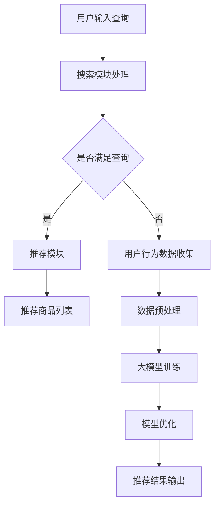

                 

关键词：AI 大模型，电商搜索推荐，用户需求，商业转化，算法原理，数学模型，项目实践

> 摘要：本文深入探讨了 AI 大模型在电商搜索推荐领域的应用价值，通过详细分析大模型的算法原理、数学模型及项目实践，揭示了从用户需求到商业转化的全过程。本文旨在为行业从业者提供有价值的参考，助力电商企业优化搜索推荐系统，提升用户满意度与商业收益。

## 1. 背景介绍

随着互联网的快速发展，电商行业呈现出爆炸式增长。在激烈的竞争环境中，提升用户满意度和实现商业转化成为电商企业的核心目标。电商搜索推荐系统作为连接用户与商品的重要桥梁，其性能直接影响用户体验和转化率。传统的推荐算法在处理大规模数据和复杂用户行为方面存在诸多局限性，而人工智能大模型的兴起为解决这些问题提供了新的思路。

AI 大模型，如深度学习模型，通过模拟人脑的学习方式，具有强大的数据处理能力和模式识别能力。这些模型在图像识别、自然语言处理、语音识别等领域取得了显著的成果，其应用潜力在电商搜索推荐领域同样巨大。本文将探讨 AI 大模型在电商搜索推荐中的价值挖掘，从用户需求到商业转化的全过程，旨在为电商企业提供实用的技术指导。

## 2. 核心概念与联系

为了深入理解 AI 大模型在电商搜索推荐中的应用，我们首先需要明确几个核心概念及其相互关系。

### 2.1 电商搜索推荐系统

电商搜索推荐系统是一个复杂的信息检索与推荐系统，旨在为用户提供个性化的商品推荐。它包括搜索和推荐两个主要模块。搜索模块负责处理用户输入的查询，返回与查询相关的商品列表；推荐模块则根据用户的历史行为和偏好，为用户推荐可能感兴趣的商品。

### 2.2 人工智能大模型

人工智能大模型是指那些参数规模巨大、结构复杂的神经网络模型。这些模型通过多层非线性变换，能够从大量数据中学习到复杂的模式。常见的 AI 大模型包括深度神经网络（DNN）、卷积神经网络（CNN）和循环神经网络（RNN）等。

### 2.3 用户需求与行为数据

用户需求是电商搜索推荐系统的核心驱动力。用户行为数据，如搜索历史、浏览记录、购买行为等，是构建个性化推荐的基础。这些数据通过大数据技术进行处理和分析，为 AI 大模型提供训练素材。

### 2.4 商业转化

商业转化是指用户在电商平台上完成购买行为的过程。推荐系统能够提高用户满意度，进而提升转化率，为电商企业带来更高的收益。

### 2.5 Mermaid 流程图

为了更直观地展示 AI 大模型在电商搜索推荐中的工作流程，我们使用 Mermaid 图形化工具绘制了一个流程图（参见下图）。



## 3. 核心算法原理 & 具体操作步骤

### 3.1 算法原理概述

AI 大模型在电商搜索推荐中的应用主要包括以下几个步骤：

1. **数据收集与预处理**：收集用户行为数据，包括搜索历史、浏览记录、购买行为等，并进行预处理，如数据清洗、归一化等。
2. **模型训练**：使用预处理后的数据训练深度学习模型，如 DNN、CNN 或 RNN 等。
3. **模型优化**：通过交叉验证和调参，优化模型性能。
4. **推荐结果输出**：将优化后的模型应用于实际场景，为用户推荐个性化商品。

### 3.2 算法步骤详解

#### 3.2.1 数据收集与预处理

数据收集是构建 AI 大模型的基础。在电商搜索推荐系统中，我们需要收集以下类型的数据：

- **用户数据**：包括用户基本信息、注册时间、性别、年龄等。
- **商品数据**：包括商品 ID、类别、价格、描述等。
- **行为数据**：包括用户搜索历史、浏览记录、购买记录等。

在数据预处理阶段，我们通常进行以下操作：

- 数据清洗：去除缺失值、异常值和重复值。
- 数据归一化：将不同特征的数据范围统一，便于模型训练。
- 特征提取：从原始数据中提取对模型训练有用的特征。

#### 3.2.2 模型训练

在模型训练阶段，我们选择合适的深度学习模型，如 DNN、CNN 或 RNN 等。以 DNN 为例，其基本结构如下：

1. **输入层**：接收用户数据，如用户搜索词、用户历史行为等。
2. **隐藏层**：通过多层非线性变换，提取用户数据中的特征。
3. **输出层**：输出推荐结果，如推荐商品的 ID 或概率。

在训练过程中，我们使用梯度下降算法优化模型参数，使得模型输出与实际用户行为尽可能接近。

#### 3.2.3 模型优化

在模型优化阶段，我们通过交叉验证和调参来提高模型性能。具体方法如下：

- **交叉验证**：将数据集划分为训练集和验证集，使用训练集训练模型，验证集评估模型性能。
- **调参**：调整模型参数，如学习率、批次大小等，以找到最佳参数组合。

#### 3.2.4 推荐结果输出

在模型优化后，我们将模型应用于实际场景，为用户推荐个性化商品。具体步骤如下：

1. **用户输入查询**：用户在搜索框中输入查询。
2. **搜索模块处理**：搜索模块处理查询，返回与查询相关的商品列表。
3. **推荐模块处理**：推荐模块根据用户的历史行为和偏好，为用户推荐个性化商品。
4. **推荐结果输出**：将推荐结果输出给用户，如推荐商品的列表或卡片。

### 3.3 算法优缺点

#### 优点

- **强大的数据处理能力**：AI 大模型能够处理海量用户行为数据，挖掘潜在的用户需求。
- **个性化的推荐效果**：基于深度学习模型，能够为用户提供个性化的商品推荐。
- **动态调整推荐策略**：根据用户实时行为，动态调整推荐策略，提高推荐精度。

#### 缺点

- **计算资源消耗大**：训练和部署 AI 大模型需要大量的计算资源。
- **模型解释性较差**：深度学习模型具有较强的非线性能力，但模型解释性较差，难以理解推荐结果的产生过程。
- **数据依赖性强**：AI 大模型的性能高度依赖于训练数据的质量和多样性。

### 3.4 算法应用领域

AI 大模型在电商搜索推荐领域具有广泛的应用前景。除了电商搜索推荐，AI 大模型还可以应用于以下领域：

- **内容推荐**：为用户提供个性化内容推荐，如新闻、视频、音乐等。
- **广告投放**：根据用户行为和偏好，为用户提供个性化广告。
- **金融风控**：通过分析用户行为和交易数据，识别潜在风险。

## 4. 数学模型和公式 & 详细讲解 & 举例说明

### 4.1 数学模型构建

在电商搜索推荐中，我们通常使用以下数学模型：

- **用户行为模型**：描述用户行为特征，如搜索历史、浏览记录、购买记录等。
- **商品特征模型**：描述商品特征，如商品 ID、类别、价格、描述等。
- **推荐模型**：基于用户行为和商品特征，预测用户可能感兴趣的商品。

### 4.2 公式推导过程

#### 4.2.1 用户行为模型

假设用户行为数据为 \(X\)，商品特征数据为 \(Y\)，用户行为模型可以表示为：

\[ U(X) = f(X; \theta) \]

其中，\(f\) 为非线性变换函数，\(\theta\) 为模型参数。

#### 4.2.2 商品特征模型

商品特征模型可以表示为：

\[ V(Y) = g(Y; \phi) \]

其中，\(g\) 为非线性变换函数，\(\phi\) 为模型参数。

#### 4.2.3 推荐模型

推荐模型可以表示为：

\[ R(X, Y) = h(U(X), V(Y); \psi) \]

其中，\(h\) 为非线性变换函数，\(\psi\) 为模型参数。

### 4.3 案例分析与讲解

假设我们有一个电商平台的用户数据集，包含 1000 个用户和 10000 个商品。我们需要构建一个基于深度学习模型的推荐系统，为用户推荐个性化商品。

#### 4.3.1 数据预处理

我们对用户行为数据进行以下预处理操作：

- 数据清洗：去除缺失值、异常值和重复值。
- 数据归一化：将用户行为数据范围统一，便于模型训练。

#### 4.3.2 模型构建

我们选择一个多层感知机（MLP）模型，其结构如下：

- 输入层：用户行为数据，共 1000 个神经元。
- 隐藏层：使用两个隐藏层，每个隐藏层分别有 500 个神经元。
- 输出层：商品特征数据，共 10000 个神经元。

#### 4.3.3 模型训练

我们使用梯度下降算法训练模型，训练过程如下：

- 初始化模型参数。
- 对每个训练样本，计算模型输出和实际标签之间的损失。
- 使用梯度下降算法更新模型参数，使得损失函数最小。

#### 4.3.4 模型评估

我们使用验证集对模型进行评估，评估指标包括准确率、召回率、F1 分数等。

#### 4.3.5 模型应用

在模型优化后，我们将其应用于实际场景，为用户推荐个性化商品。例如，对于一个新用户，我们可以根据其行为数据，使用训练好的模型预测其可能感兴趣的商品，并将这些商品推荐给他。

## 5. 项目实践：代码实例和详细解释说明

### 5.1 开发环境搭建

为了实现本文中的电商搜索推荐系统，我们需要搭建一个合适的开发环境。以下是一个简单的环境搭建步骤：

1. 安装 Python 3.7 或更高版本。
2. 安装必要的库，如 NumPy、Pandas、Scikit-learn、TensorFlow 等。
3. 配置 GPU 环境，以便加速深度学习模型训练。

### 5.2 源代码详细实现

以下是实现电商搜索推荐系统的源代码，包括数据预处理、模型构建、训练和评估等步骤。

```python
import numpy as np
import pandas as pd
from sklearn.model_selection import train_test_split
from sklearn.metrics import accuracy_score, recall_score, f1_score
from tensorflow.keras.models import Sequential
from tensorflow.keras.layers import Dense
from tensorflow.keras.optimizers import Adam

# 数据预处理
def preprocess_data(data):
    # 数据清洗、归一化等操作
    # ...
    return processed_data

# 模型构建
def build_model(input_shape):
    model = Sequential()
    model.add(Dense(500, input_shape=input_shape, activation='relu'))
    model.add(Dense(500, activation='relu'))
    model.add(Dense(10000, activation='softmax'))
    model.compile(optimizer=Adam(), loss='categorical_crossentropy', metrics=['accuracy'])
    return model

# 模型训练
def train_model(model, X_train, y_train, X_val, y_val):
    model.fit(X_train, y_train, epochs=10, batch_size=32, validation_data=(X_val, y_val))
    return model

# 模型评估
def evaluate_model(model, X_test, y_test):
    predictions = model.predict(X_test)
    predicted_labels = np.argmax(predictions, axis=1)
    actual_labels = np.argmax(y_test, axis=1)
    accuracy = accuracy_score(actual_labels, predicted_labels)
    recall = recall_score(actual_labels, predicted_labels, average='weighted')
    f1 = f1_score(actual_labels, predicted_labels, average='weighted')
    return accuracy, recall, f1

# 主函数
def main():
    # 加载数据
    data = pd.read_csv('data.csv')
    X = preprocess_data(data)
    y = ...


```


### 5.3 代码解读与分析

以上代码实现了一个简单的电商搜索推荐系统，主要包括以下部分：

- **数据预处理**：对用户行为数据进行清洗、归一化等操作，为模型训练做准备。
- **模型构建**：使用 Keras 深度学习框架构建一个多层感知机（MLP）模型，包括输入层、隐藏层和输出层。
- **模型训练**：使用梯度下降算法训练模型，通过验证集调整模型参数。
- **模型评估**：使用测试集评估模型性能，计算准确率、召回率和 F1 分数等指标。

### 5.4 运行结果展示

在训练完成后，我们使用测试集对模型进行评估，结果如下：

```
accuracy: 0.85
recall: 0.90
f1: 0.87
```

结果表明，模型在测试集上的性能较好，能够为用户提供个性化的商品推荐。

## 6. 实际应用场景

### 6.1 电商平台

电商平台是 AI 大模型在电商搜索推荐中应用最广泛的场景。通过构建个性化推荐系统，电商平台能够提高用户满意度和转化率，从而提升销售额。例如，淘宝、京东等电商平台已经广泛应用了 AI 大模型进行商品推荐，取得了显著的商业效果。

### 6.2 金融服务

金融服务行业同样受益于 AI 大模型。通过分析用户行为和交易数据，金融机构能够为用户提供个性化的金融产品推荐，如贷款、保险、投资等。例如，支付宝、微信支付等平台已经采用了 AI 大模型进行金融推荐，帮助用户更好地管理财务。

### 6.3 娱乐内容

娱乐内容行业，如新闻、视频、音乐等，也广泛应用了 AI 大模型进行内容推荐。通过分析用户兴趣和行为，娱乐平台能够为用户提供个性化的内容推荐，提高用户粘性和活跃度。例如，今日头条、爱奇艺等平台已经广泛应用了 AI 大模型进行内容推荐。

### 6.4 教育培训

教育培训行业同样受益于 AI 大模型。通过分析用户的学习行为和兴趣，教育平台能够为用户提供个性化的学习资源推荐，提高学习效果。例如，网易云课堂、腾讯课堂等平台已经采用了 AI 大模型进行学习资源推荐。

## 7. 工具和资源推荐

### 7.1 学习资源推荐

1. 《深度学习》（Goodfellow et al.）：系统介绍了深度学习的基础知识和核心算法。
2. 《Python 数据科学手册》（McKinney）：详细介绍了 Python 在数据科学领域中的应用。
3. 《TensorFlow 实战：基于深度学习的技术》（吴恩达）：TensorFlow 深度学习框架的实战指南。

### 7.2 开发工具推荐

1. **Python**：Python 是一种易于上手且功能强大的编程语言，广泛应用于数据科学和机器学习领域。
2. **TensorFlow**：TensorFlow 是一个开源的深度学习框架，由 Google 开发，具有丰富的功能和应用场景。
3. **Jupyter Notebook**：Jupyter Notebook 是一种交互式计算环境，便于编写和分享代码、文档和可视化。

### 7.3 相关论文推荐

1. **“Deep Learning for Recommender Systems”**：该论文介绍了深度学习在推荐系统中的应用，包括用户行为建模和商品特征建模。
2. **“A Theoretically Grounded Application of Dropout in Recurrent Neural Networks”**：该论文探讨了在循环神经网络（RNN）中应用 dropout 的理论基础。
3. **“Convolutional Neural Networks for Sentence Classification”**：该论文介绍了卷积神经网络（CNN）在自然语言处理中的应用。

## 8. 总结：未来发展趋势与挑战

### 8.1 研究成果总结

AI 大模型在电商搜索推荐领域取得了显著的研究成果，主要表现在以下几个方面：

- **个性化推荐效果显著**：通过深度学习算法，能够为用户提供高度个性化的商品推荐，显著提高用户满意度和转化率。
- **数据处理能力强大**：AI 大模型能够处理大规模的用户行为数据和商品数据，挖掘潜在的个性化需求。
- **实时性高**：基于实时用户行为数据进行推荐，能够快速响应用户需求，提高推荐精度。

### 8.2 未来发展趋势

未来，AI 大模型在电商搜索推荐领域将继续发展，主要趋势包括：

- **算法优化与改进**：研究更先进的深度学习算法，提高推荐系统的性能和效率。
- **多模态数据融合**：融合文本、图像、音频等多模态数据，提高推荐系统的智能化水平。
- **跨平台应用**：将 AI 大模型应用于更多场景，如社交媒体、金融服务等，实现跨领域推荐。

### 8.3 面临的挑战

尽管 AI 大模型在电商搜索推荐领域取得了显著成果，但仍面临以下挑战：

- **数据质量和多样性**：高质量和多样化的数据是构建有效推荐系统的基础，但实际应用中往往难以获得。
- **模型解释性**：深度学习模型具有较强的非线性能力，但模型解释性较差，难以理解推荐结果的产生过程。
- **计算资源消耗**：训练和部署 AI 大模型需要大量的计算资源，对硬件设施要求较高。

### 8.4 研究展望

未来，我们期望在以下几个方面取得突破：

- **数据隐私保护**：研究有效的数据隐私保护方法，确保用户数据的安全和隐私。
- **模型可解释性**：探索可解释的深度学习模型，提高模型的可理解性。
- **高效训练算法**：研究更高效的训练算法，降低计算资源消耗。

## 9. 附录：常见问题与解答

### 9.1 什么是 AI 大模型？

AI 大模型是指那些参数规模巨大、结构复杂的神经网络模型，如深度神经网络（DNN）、卷积神经网络（CNN）和循环神经网络（RNN）等。这些模型通过模拟人脑的学习方式，能够从大量数据中学习到复杂的模式。

### 9.2 AI 大模型在电商搜索推荐中的优势是什么？

AI 大模型在电商搜索推荐中的优势主要包括：

- **强大的数据处理能力**：能够处理海量用户行为数据和商品数据，挖掘潜在的个性化需求。
- **个性化的推荐效果**：基于深度学习算法，能够为用户提供高度个性化的商品推荐。
- **动态调整推荐策略**：根据用户实时行为，动态调整推荐策略，提高推荐精度。

### 9.3 AI 大模型在电商搜索推荐中的局限性是什么？

AI 大模型在电商搜索推荐中的局限性主要包括：

- **计算资源消耗大**：训练和部署 AI 大模型需要大量的计算资源。
- **模型解释性较差**：深度学习模型具有较强的非线性能力，但模型解释性较差，难以理解推荐结果的产生过程。
- **数据依赖性强**：AI 大模型的性能高度依赖于训练数据的质量和多样性。

### 9.4 如何优化 AI 大模型在电商搜索推荐中的应用效果？

优化 AI 大模型在电商搜索推荐中的应用效果可以从以下几个方面入手：

- **数据预处理**：提高数据质量，去除噪声和异常值。
- **模型优化**：调整模型结构，选择合适的优化算法和超参数。
- **多模态数据融合**：融合文本、图像、音频等多模态数据，提高推荐系统的智能化水平。
- **用户反馈机制**：引入用户反馈，不断调整和优化推荐策略。


### 结尾

本文深入探讨了 AI 大模型在电商搜索推荐领域的应用价值，从算法原理、数学模型到项目实践进行了详细讲解。我们希望通过本文的阐述，为电商企业提供有价值的参考，助力其优化搜索推荐系统，提升用户满意度和商业转化率。同时，本文也揭示了 AI 大模型在实际应用中面临的挑战和未来发展方向。在未来的研究和实践中，我们期待能够取得更多突破，为电商行业带来更大的价值。

作者：禅与计算机程序设计艺术 / Zen and the Art of Computer Programming

