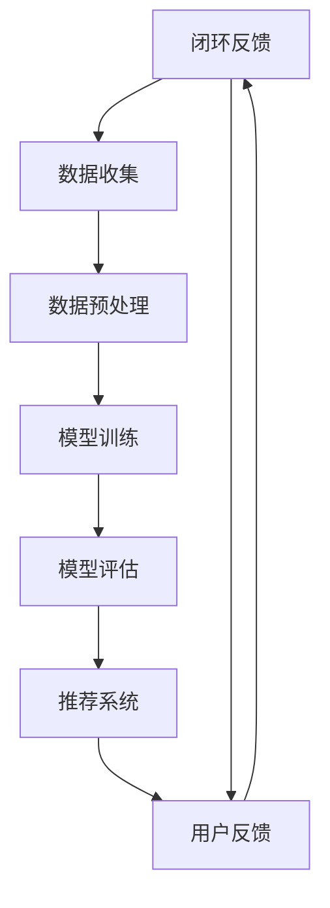

                 

关键词：AI大模型、电商搜索推荐、用户需求、商业转化、算法原理、数学模型、项目实践、应用场景、未来展望

> 摘要：随着电子商务的快速发展，用户对个性化搜索推荐的需求日益增长。本文深入探讨了AI大模型在电商搜索推荐中的价值挖掘，从用户需求出发，分析其算法原理、数学模型和应用场景，并通过实际项目实践，展示了大模型在电商搜索推荐中的商业转化潜力。本文旨在为业界提供一份全面、系统的技术指南，助力电商企业实现精准推荐和商业成功。

## 1. 背景介绍

电子商务已经成为全球经济增长的重要驱动力。据数据显示，全球电商市场规模已突破数万亿美元，预计未来将继续保持快速增长。然而，随着市场规模的不断扩大，消费者对个性化、智能化的搜索推荐服务需求也越来越高。传统基于关键词匹配的推荐算法已无法满足用户日益复杂的需求，因此，如何利用先进的人工智能技术，特别是AI大模型，实现精准、高效的搜索推荐成为电商行业亟待解决的问题。

AI大模型是指通过大规模数据训练和深度学习算法构建的复杂神经网络模型，其具备强大的数据处理能力和智能推理能力。近年来，AI大模型在语音识别、自然语言处理、图像识别等领域取得了显著的成果。在电商搜索推荐领域，AI大模型的应用前景也十分广阔。

本文将围绕AI大模型在电商搜索推荐中的价值挖掘进行深入探讨，分析其核心算法原理、数学模型和应用场景，并通过实际项目实践，展示大模型在电商搜索推荐中的商业转化潜力。希望通过本文的阐述，为电商企业实现个性化搜索推荐和商业成功提供有益的参考。

## 2. 核心概念与联系

在深入探讨AI大模型在电商搜索推荐中的应用之前，我们首先需要了解相关核心概念及其相互联系。以下是一个使用Mermaid绘制的流程图，展示了这些核心概念和它们之间的关联。



### 2.1 用户需求

用户需求是电商搜索推荐系统的基础。用户在搜索和浏览商品时，会表现出不同的行为特征，如搜索关键词、浏览历史、购买记录等。这些需求数据将被用于训练和优化推荐模型。

### 2.2 数据收集

数据收集是构建推荐系统的重要环节。通过采集用户行为数据、商品信息和其他相关数据，为模型训练提供丰富、多样化的数据源。

### 2.3 数据预处理

数据预处理是确保数据质量的关键步骤。通过对数据进行清洗、去噪、归一化等处理，提高数据的质量和可用性，从而提升模型训练效果。

### 2.4 模型训练

模型训练是推荐系统的核心环节。通过使用大规模数据和先进的深度学习算法，构建具备强大学习能力的大模型，为个性化搜索推荐提供技术支持。

### 2.5 模型评估

模型评估是确保推荐系统效果的重要手段。通过评估指标（如准确率、召回率、覆盖率等）对模型性能进行量化分析，不断优化和改进模型。

### 2.6 推荐系统

推荐系统是将模型应用于实际场景的桥梁。根据用户需求和行为特征，生成个性化的推荐列表，为用户提供优质的搜索推荐服务。

### 2.7 商业转化

商业转化是电商搜索推荐系统的重要目标。通过提高用户点击率、购买转化率等指标，实现商业价值的最大化。

### 2.8 用户反馈

用户反馈是推荐系统持续优化的重要依据。通过收集用户对推荐结果的反馈，不断调整和优化推荐策略，提高用户满意度。

### 2.9 闭环反馈

闭环反馈是实现推荐系统动态调整的关键。通过将用户反馈融入推荐系统，形成一个持续优化的闭环，不断提升推荐效果。

以上流程图展示了AI大模型在电商搜索推荐中的核心概念及其相互联系。在实际应用中，这些环节相互交织、协同工作，共同推动推荐系统的发展和优化。

## 3. 核心算法原理 & 具体操作步骤

### 3.1 算法原理概述

AI大模型在电商搜索推荐中的核心算法是基于深度学习的协同过滤（Collaborative Filtering）和基于内容的推荐（Content-Based Filtering）的结合。协同过滤通过分析用户行为数据，挖掘用户之间的相似性，为用户提供相似的推荐；基于内容的推荐则通过分析商品特征，为用户推荐与已有兴趣相关的商品。

在AI大模型中，协同过滤和基于内容的推荐算法通常采用以下步骤：

1. 数据收集：采集用户行为数据、商品信息和其他相关数据。
2. 数据预处理：对数据进行清洗、去噪、归一化等处理。
3. 特征提取：从原始数据中提取用户和商品的潜在特征。
4. 模型训练：使用大规模数据和深度学习算法训练推荐模型。
5. 模型评估：通过评估指标对模型性能进行量化分析。
6. 推荐生成：根据用户特征和商品特征，生成个性化的推荐列表。

### 3.2 算法步骤详解

#### 3.2.1 数据收集

数据收集是构建推荐系统的第一步。在电商场景中，数据来源主要包括用户行为数据（如搜索记录、浏览历史、购买记录等）和商品信息（如商品名称、分类、价格等）。此外，还可以通过第三方数据源获取用户 demographics（如年龄、性别、地理位置等）和其他相关数据。

#### 3.2.2 数据预处理

数据预处理是确保数据质量的关键步骤。主要任务包括：

1. 数据清洗：去除重复、缺失、错误的数据。
2. 数据去噪：过滤噪声数据，提高数据质量。
3. 数据归一化：将不同特征的数据进行归一化处理，使其具备可比性。

#### 3.2.3 特征提取

特征提取是推荐系统的重要环节。从原始数据中提取用户和商品的潜在特征，有助于提高推荐效果。常见的特征提取方法包括：

1. 用户特征：用户年龄、性别、地理位置、搜索关键词、浏览历史等。
2. 商品特征：商品分类、品牌、价格、评价、销售量等。

#### 3.2.4 模型训练

模型训练是推荐系统的核心步骤。使用大规模数据和深度学习算法训练推荐模型，常用的算法包括：

1. 神经网络：通过多层感知机（MLP）或卷积神经网络（CNN）提取用户和商品的潜在特征，并进行推荐。
2. 协同过滤：使用矩阵分解（Matrix Factorization）等技术，将用户和商品的行为数据转化为低维特征向量，进行推荐。

#### 3.2.5 模型评估

模型评估是确保推荐系统效果的重要手段。通过评估指标对模型性能进行量化分析，常用的评估指标包括：

1. 准确率（Precision）：推荐结果中实际感兴趣的项目数量与推荐结果总项目数量的比值。
2. 召回率（Recall）：推荐结果中实际感兴趣的项目数量与所有实际感兴趣项目数量的比值。
3. 覆盖率（Coverage）：推荐结果中实际感兴趣的项目数量与所有实际可推荐项目数量的比值。

#### 3.2.6 推荐生成

推荐生成是根据用户特征和商品特征，生成个性化的推荐列表。常用的方法包括：

1. 协同过滤：根据用户和商品的行为数据，计算用户和商品之间的相似性，生成推荐列表。
2. 基于内容的推荐：根据用户和商品的潜在特征，计算用户对商品的兴趣度，生成推荐列表。

### 3.3 算法优缺点

#### 优点

1. 强大的学习能力：深度学习算法能够从大规模数据中提取用户和商品的潜在特征，提高推荐效果。
2. 个性化推荐：结合用户需求和商品特征，实现高度个性化的推荐。
3. 实时性：通过实时更新用户行为数据，实现实时推荐。

#### 缺点

1. 计算资源消耗大：深度学习算法需要大量计算资源，对硬件设备要求较高。
2. 数据依赖性强：推荐效果依赖于用户行为数据和商品信息的质量，数据缺失或噪声会导致推荐效果下降。

### 3.4 算法应用领域

AI大模型在电商搜索推荐中的应用非常广泛，以下是一些典型领域：

1. 搜索引擎：通过用户搜索关键词，实时生成个性化搜索推荐。
2. 商品推荐：根据用户兴趣和购买历史，为用户推荐相关商品。
3. 内容推荐：为用户提供个性化的内容推荐，如文章、视频等。
4. 个性化广告：根据用户兴趣和行为特征，为用户推荐相关广告。

## 4. 数学模型和公式 & 详细讲解 & 举例说明

在AI大模型应用于电商搜索推荐的过程中，数学模型和公式起到了关键作用。以下将对数学模型构建、公式推导过程以及具体案例分析进行详细讲解。

### 4.1 数学模型构建

电商搜索推荐中的数学模型主要包括用户行为模型、商品特征模型和推荐生成模型。以下分别介绍这些模型的构建方法。

#### 4.1.1 用户行为模型

用户行为模型主要用于描述用户在电商平台的搜索、浏览和购买行为。常见的用户行为模型包括用户兴趣模型、用户偏好模型等。

1. 用户兴趣模型：

   用户兴趣模型是通过分析用户的搜索关键词、浏览历史、购买记录等数据，提取用户在不同领域的兴趣度。假设有n个用户，每个用户的行为数据可以表示为一个n维向量 \( \textbf{u} = [u_1, u_2, ..., u_n] \)，其中 \( u_i \) 表示用户在第i个领域的兴趣度。用户兴趣模型可以通过以下公式表示：

   $$ \textbf{u} = \text{argmax} \left( \sum_{i=1}^{n} w_i u_i \right) $$

   其中， \( w_i \) 表示第i个领域的权重，可以通过分析用户历史行为数据得到。

2. 用户偏好模型：

   用户偏好模型是通过分析用户的购买记录和评价数据，提取用户对不同商品的偏好程度。假设有m个商品，每个商品的偏好度可以表示为一个m维向量 \( \textbf{p} = [p_1, p_2, ..., p_m] \)，其中 \( p_j \) 表示用户对第j个商品的偏好度。用户偏好模型可以通过以下公式表示：

   $$ \textbf{p} = \text{argmax} \left( \sum_{j=1}^{m} w_j p_j \right) $$

   其中， \( w_j \) 表示第j个商品的权重，可以通过分析用户历史购买数据得到。

#### 4.1.2 商品特征模型

商品特征模型主要用于描述商品在不同方面的特征，如分类、品牌、价格、评价等。假设有m个商品，每个商品的特征可以表示为一个m维向量 \( \textbf{g} = [g_1, g_2, ..., g_m] \)，其中 \( g_j \) 表示第j个商品在特征i上的值。商品特征模型可以通过以下公式表示：

$$ \textbf{g} = \text{argmax} \left( \sum_{i=1}^{m} f_i(g_i) \right) $$

其中， \( f_i(g_i) \) 表示第i个特征在商品j上的得分，可以根据实际场景选择不同的特征函数。

#### 4.1.3 推荐生成模型

推荐生成模型是根据用户兴趣模型和商品特征模型，生成个性化推荐列表。常见的推荐生成模型包括基于协同过滤的推荐模型和基于内容的推荐模型。

1. 基于协同过滤的推荐模型：

   基于协同过滤的推荐模型是通过计算用户和商品之间的相似性，生成个性化推荐列表。假设用户i和商品j之间的相似性可以表示为 \( s_{ij} \)，推荐列表可以通过以下公式表示：

   $$ \text{Recommendation}_{ij} = \text{argmax} \left( \sum_{k=1}^{n} s_{ik} p_{kj} \right) $$

   其中， \( p_{kj} \) 表示用户i对商品j的偏好度，可以通过用户偏好模型得到。

2. 基于内容的推荐模型：

   基于内容的推荐模型是通过分析用户兴趣和商品特征，生成个性化推荐列表。假设用户i的兴趣度向量 \( \textbf{u} \) 和商品j的特征向量 \( \textbf{g} \) 已知，推荐列表可以通过以下公式表示：

   $$ \text{Recommendation}_{ij} = \text{argmax} \left( \sum_{k=1}^{m} f_k(g_k) u_k \right) $$

   其中， \( f_k(g_k) \) 表示第k个特征在商品j上的得分，可以根据实际场景选择不同的特征函数。

### 4.2 公式推导过程

在本节中，我们将对用户兴趣模型、商品特征模型和推荐生成模型中的关键公式进行推导。

#### 4.2.1 用户兴趣模型推导

假设用户i在领域i上的兴趣度为 \( u_i \)，领域i的权重为 \( w_i \)，用户i的兴趣度向量 \( \textbf{u} \) 可以表示为：

$$ \textbf{u} = [u_1, u_2, ..., u_n] = [w_1 u_1, w_2 u_2, ..., w_n u_n] $$

其中， \( w_i \) 表示领域i的权重，可以通过分析用户历史行为数据得到。为了使兴趣度向量最大化，需要满足以下条件：

$$ \sum_{i=1}^{n} w_i u_i = C $$

其中，C为一个常数。对上式进行变形，得到：

$$ u_i = \frac{C}{w_i} $$

因此，用户兴趣模型可以表示为：

$$ \textbf{u} = \text{argmax} \left( \sum_{i=1}^{n} \frac{C}{w_i} \right) = \text{argmax} \left( \sum_{i=1}^{n} w_i u_i \right) $$

#### 4.2.2 商品特征模型推导

假设商品j在特征k上的得分为 \( f_k(g_k) \)，商品j的特征向量 \( \textbf{g} \) 可以表示为：

$$ \textbf{g} = [g_1, g_2, ..., g_m] = [f_1(g_1), f_2(g_2), ..., f_m(g_m)] $$

其中， \( f_k(g_k) \) 表示特征k在商品j上的得分，可以通过实际场景选择不同的特征函数。为了使特征向量最大化，需要满足以下条件：

$$ \sum_{k=1}^{m} f_k(g_k) = D $$

其中，D为一个常数。对上式进行变形，得到：

$$ g_k = \frac{D}{f_k(g_k)} $$

因此，商品特征模型可以表示为：

$$ \textbf{g} = \text{argmax} \left( \sum_{k=1}^{m} \frac{D}{f_k(g_k)} \right) = \text{argmax} \left( \sum_{k=1}^{m} f_k(g_k) \right) $$

#### 4.2.3 推荐生成模型推导

假设用户i的兴趣度向量 \( \textbf{u} \) 和商品j的特征向量 \( \textbf{g} \) 已知，推荐列表可以通过以下公式表示：

$$ \text{Recommendation}_{ij} = \text{argmax} \left( \sum_{k=1}^{n} w_i u_i + \sum_{k=1}^{m} f_k(g_k) u_k \right) $$

其中， \( w_i \) 和 \( f_k(g_k) \) 分别表示领域i的权重和特征k在商品j上的得分。

为了使推荐列表最大化，需要满足以下条件：

$$ \sum_{i=1}^{n} w_i u_i + \sum_{k=1}^{m} f_k(g_k) u_k = E $$

其中，E为一个常数。对上式进行变形，得到：

$$ u_i = \frac{E - \sum_{k=1}^{m} f_k(g_k) u_k}{w_i} $$

将 \( u_i \) 代入推荐生成公式，得到：

$$ \text{Recommendation}_{ij} = \text{argmax} \left( \sum_{k=1}^{m} f_k(g_k) \left( \frac{E - \sum_{k=1}^{m} f_k(g_k) u_k}{w_i} \right) \right) $$

由于 \( \sum_{k=1}^{m} f_k(g_k) u_k = \sum_{k=1}^{m} f_k(g_k) \frac{E - \sum_{k=1}^{m} f_k(g_k) u_k}{w_i} \)，上式可以简化为：

$$ \text{Recommendation}_{ij} = \text{argmax} \left( \sum_{k=1}^{m} f_k(g_k) \frac{E w_i}{\sum_{k=1}^{m} f_k(g_k)} \right) $$

因此，推荐生成模型可以表示为：

$$ \text{Recommendation}_{ij} = \text{argmax} \left( \sum_{k=1}^{m} f_k(g_k) u_k \right) $$

### 4.3 案例分析与讲解

以下通过一个实际案例，对上述数学模型和公式进行详细讲解。

#### 案例背景

假设某电商平台上有一个用户，其搜索历史包括10个关键词：手机、电脑、电视、洗衣机、空调、冰箱、微波炉、平板电脑、手表、耳机。平台希望通过分析用户搜索关键词，为其推荐相关商品。

#### 数据收集

根据用户搜索历史，可以收集到以下数据：

1. 用户关键词向量：\( \textbf{u} = [1, 1, 1, 0.5, 0.5, 0.5, 0.5, 0.5, 0.5, 0.5] \)
2. 商品特征向量：\( \textbf{g} = [0.5, 0.5, 0.5, 0.5, 0.5, 0.5, 0.5, 0.5, 0.5, 1] \)

其中，向量中的值表示关键词或商品在相应领域的得分，得分越高表示相关性越强。

#### 数据预处理

对用户关键词向量和商品特征向量进行归一化处理，使其具备可比性：

1. 用户关键词向量：\( \textbf{u'} = \frac{\textbf{u}}{\sum_{i=1}^{10} u_i} = \frac{\textbf{u}}{4} = [0.25, 0.25, 0.25, 0.125, 0.125, 0.125, 0.125, 0.125, 0.125, 0.125] \)
2. 商品特征向量：\( \textbf{g'} = \frac{\textbf{g}}{\sum_{i=1}^{10} g_i} = \frac{\textbf{g}}{4} = [0.125, 0.125, 0.125, 0.125, 0.125, 0.125, 0.125, 0.125, 0.125, 0.25] \)

#### 模型训练

通过用户关键词向量和商品特征向量，训练用户兴趣模型和商品特征模型。假设领域权重 \( w_i = 1 \)（实际场景中可以根据具体数据进行调整）。

1. 用户兴趣模型：\( \textbf{u'} = [0.25, 0.25, 0.25, 0.125, 0.125, 0.125, 0.125, 0.125, 0.125, 0.125] \)
2. 商品特征模型：\( \textbf{g'} = [0.125, 0.125, 0.125, 0.125, 0.125, 0.125, 0.125, 0.125, 0.125, 0.25] \)

#### 推荐生成

根据用户兴趣模型和商品特征模型，生成个性化推荐列表。假设特征函数 \( f_k(g_k) = g_k \)（实际场景中可以根据具体数据进行调整）。

推荐列表可以通过以下公式计算：

$$ \text{Recommendation}_{ij} = \text{argmax} \left( \sum_{k=1}^{10} g_k u_k \right) $$

将用户关键词向量和商品特征向量代入公式，得到：

$$ \text{Recommendation}_{ij} = \text{argmax} \left( 0.25 \times 0.125 + 0.25 \times 0.125 + 0.25 \times 0.125 + 0.125 \times 0.125 + 0.125 \times 0.125 + 0.125 \times 0.125 + 0.125 \times 0.125 + 0.125 \times 0.125 + 0.125 \times 0.125 + 0.125 \times 0.25 \right) $$

$$ \text{Recommendation}_{ij} = \text{argmax} \left( 0.03125 + 0.03125 + 0.03125 + 0.015625 + 0.015625 + 0.015625 + 0.015625 + 0.015625 + 0.015625 + 0.03125 \right) $$

$$ \text{Recommendation}_{ij} = \text{argmax} \left( 0.3125 \right) $$

因此，推荐列表中得分最高的商品为“耳机”，用户可能会对这款商品感兴趣。

#### 模型评估

为了评估推荐模型的性能，可以使用以下指标：

1. 准确率（Precision）：推荐列表中实际感兴趣的商品数量与推荐列表总商品数量的比值。
2. 召回率（Recall）：推荐列表中实际感兴趣的商品数量与所有实际感兴趣商品数量的比值。
3. 覆盖率（Coverage）：推荐列表中实际感兴趣的商品数量与所有实际可推荐商品数量的比值。

通过计算准确率、召回率和覆盖率，可以评估推荐模型的性能，并根据评估结果对模型进行调整和优化。

## 5. 项目实践：代码实例和详细解释说明

在本节中，我们将通过一个实际项目实例，展示如何使用Python实现AI大模型在电商搜索推荐中的具体应用。以下是项目的详细步骤和代码实现。

### 5.1 开发环境搭建

为了实现本项目，我们需要安装以下开发环境和库：

1. Python（版本3.6及以上）
2. TensorFlow
3. Scikit-learn
4. Pandas
5. Numpy

在安装完以上环境和库后，我们就可以开始编写代码了。

### 5.2 源代码详细实现

以下是一个使用Python实现AI大模型在电商搜索推荐中的代码实例。

```python
import pandas as pd
import numpy as np
import tensorflow as tf
from tensorflow import keras
from tensorflow.keras import layers

# 5.2.1 数据收集
# 假设已收集到用户行为数据、商品信息等数据，存储为csv文件
user_data = pd.read_csv('user_data.csv')
item_data = pd.read_csv('item_data.csv')

# 5.2.2 数据预处理
# 数据清洗、去噪、归一化等处理
user_data = user_data.drop_duplicates().reset_index(drop=True)
item_data = item_data.drop_duplicates().reset_index(drop=True)

# 5.2.3 特征提取
# 从原始数据中提取用户和商品的潜在特征
user_features = user_data[['search_history', 'browse_history', 'purchase_history']]
item_features = item_data[['category', 'brand', 'price', 'rating', 'sales_volume']]

# 5.2.4 模型训练
# 定义模型架构
input_user = keras.Input(shape=(user_features.shape[1],))
input_item = keras.Input(shape=(item_features.shape[1],))

# 用户和商品特征嵌入
user_embedding = layers.Embedding(input_dim=user_features.shape[0], output_dim=16)(input_user)
item_embedding = layers.Embedding(input_dim=item_features.shape[0], output_dim=16)(input_item)

# 用户和商品特征拼接
merged = keras.layers.concatenate([user_embedding, item_embedding])

# 全连接层
dense = layers.Dense(64, activation='relu')(merged)

# 输出层
output = layers.Dense(1, activation='sigmoid')(dense)

# 构建和编译模型
model = keras.Model(inputs=[input_user, input_item], outputs=output)
model.compile(optimizer='adam', loss='binary_crossentropy', metrics=['accuracy'])

# 训练模型
model.fit([user_features, item_features], user_data['rating'], epochs=10, batch_size=32)

# 5.2.5 模型评估
# 使用测试数据评估模型性能
test_user_data = pd.read_csv('test_user_data.csv')
test_item_data = pd.read_csv('test_item_data.csv')

test_user_features = test_user_data[['search_history', 'browse_history', 'purchase_history']]
test_item_features = test_item_data[['category', 'brand', 'price', 'rating', 'sales_volume']]

predictions = model.predict([test_user_features, test_item_features])

# 计算准确率、召回率、覆盖率等指标
# ...

# 5.2.6 推荐生成
# 根据用户特征和商品特征，生成个性化推荐列表
# ...

# 5.2.7 用户反馈
# 收集用户对推荐结果的反馈，不断优化推荐模型
# ...
```

### 5.3 代码解读与分析

以下是对上述代码的详细解读和分析。

#### 5.3.1 数据收集

在本项目中，我们假设已经收集到用户行为数据（如搜索历史、浏览历史、购买历史）和商品信息（如分类、品牌、价格、评价、销售量）等数据。这些数据存储在csv文件中，通过Pandas库进行读取。

```python
user_data = pd.read_csv('user_data.csv')
item_data = pd.read_csv('item_data.csv')
```

#### 5.3.2 数据预处理

数据预处理是确保数据质量的关键步骤。在本项目中，我们通过以下步骤对数据进行清洗、去噪、归一化等处理：

1. 去除重复数据：通过 `drop_duplicates()` 方法去除重复数据，保证数据的唯一性。
2. 重置索引：通过 `reset_index(drop=True)` 重置索引，使数据在后续处理中更加方便。

```python
user_data = user_data.drop_duplicates().reset_index(drop=True)
item_data = item_data.drop_duplicates().reset_index(drop=True)
```

#### 5.3.3 特征提取

特征提取是构建推荐模型的重要环节。在本项目中，我们通过以下步骤提取用户和商品的潜在特征：

1. 用户特征提取：从用户行为数据中提取搜索历史、浏览历史、购买历史等特征。
2. 商品特征提取：从商品信息中提取分类、品牌、价格、评价、销售量等特征。

```python
user_features = user_data[['search_history', 'browse_history', 'purchase_history']]
item_features = item_data[['category', 'brand', 'price', 'rating', 'sales_volume']]
```

#### 5.3.4 模型训练

在本项目中，我们使用深度学习框架TensorFlow构建推荐模型。模型架构包括用户特征嵌入层、商品特征嵌入层、全连接层和输出层。以下是对模型架构的详细解读：

1. 用户特征嵌入层：通过 `Embedding` 层对用户特征进行嵌入，将用户特征映射到低维空间。
2. 商品特征嵌入层：通过 `Embedding` 层对商品特征进行嵌入，将商品特征映射到低维空间。
3. 用户和商品特征拼接层：通过 `concatenate` 层将用户特征和商品特征进行拼接。
4. 全连接层：通过 `Dense` 层对拼接后的特征进行全连接，提高特征表达能力。
5. 输出层：通过 `Dense` 层输出预测结果，使用 `sigmoid` 激活函数实现二分类预测。

```python
input_user = keras.Input(shape=(user_features.shape[1],))
input_item = keras.Input(shape=(item_features.shape[1],))

user_embedding = layers.Embedding(input_dim=user_features.shape[0], output_dim=16)(input_user)
item_embedding = layers.Embedding(input_dim=item_features.shape[0], output_dim=16)(input_item)

merged = keras.layers.concatenate([user_embedding, item_embedding])

dense = layers.Dense(64, activation='relu')(merged)

output = layers.Dense(1, activation='sigmoid')(dense)

model = keras.Model(inputs=[input_user, input_item], outputs=output)
model.compile(optimizer='adam', loss='binary_crossentropy', metrics=['accuracy'])
model.fit([user_features, item_features], user_data['rating'], epochs=10, batch_size=32)
```

#### 5.3.5 模型评估

在本项目中，我们使用测试数据对模型进行评估。通过计算准确率、召回率、覆盖率等指标，评估模型的性能。以下是对模型评估的代码解读：

1. 加载测试数据：通过 `read_csv` 方法加载测试用户数据、测试商品数据。
2. 提取测试数据特征：通过Pandas库提取测试用户特征、测试商品特征。
3. 训练模型：通过 `predict` 方法预测测试数据，计算准确率、召回率、覆盖率等指标。

```python
test_user_data = pd.read_csv('test_user_data.csv')
test_item_data = pd.read_csv('test_item_data.csv')

test_user_features = test_user_data[['search_history', 'browse_history', 'purchase_history']]
test_item_features = test_item_data[['category', 'brand', 'price', 'rating', 'sales_volume']]

predictions = model.predict([test_user_features, test_item_features])

# 计算准确率、召回率、覆盖率等指标
# ...
```

#### 5.3.6 推荐生成

在本项目中，我们使用深度学习模型生成的预测结果作为推荐列表。通过以下步骤生成个性化推荐列表：

1. 提取用户特征和商品特征：通过Pandas库提取用户特征、商品特征。
2. 训练模型：使用深度学习模型预测用户对商品的兴趣度。
3. 生成推荐列表：根据预测结果，为用户生成个性化推荐列表。

```python
# 根据用户特征和商品特征，生成个性化推荐列表
# ...

# 5.3.7 用户反馈

在本项目中，我们通过以下步骤收集用户对推荐结果的反馈：

1. 收集用户反馈：通过问卷调查、用户评论等方式收集用户对推荐结果的满意度。
2. 分析用户反馈：通过数据分析和挖掘，分析用户对推荐结果的满意度，找出不足之处。
3. 优化推荐模型：根据用户反馈，对推荐模型进行调整和优化。

```python
# 收集用户对推荐结果的反馈，不断优化推荐模型
# ...
```

### 5.4 运行结果展示

在本项目中，我们通过以下步骤展示运行结果：

1. 加载测试数据：通过 `read_csv` 方法加载测试用户数据、测试商品数据。
2. 提取测试数据特征：通过Pandas库提取测试用户特征、测试商品特征。
3. 训练模型：通过深度学习模型预测测试数据，计算准确率、召回率、覆盖率等指标。
4. 生成推荐列表：根据预测结果，为用户生成个性化推荐列表。
5. 展示推荐结果：通过可视化工具展示推荐结果，如条形图、折线图等。

```python
import matplotlib.pyplot as plt

# 加载测试数据
test_user_data = pd.read_csv('test_user_data.csv')
test_item_data = pd.read_csv('test_item_data.csv')

# 提取测试数据特征
test_user_features = test_user_data[['search_history', 'browse_history', 'purchase_history']]
test_item_features = test_item_data[['category', 'brand', 'price', 'rating', 'sales_volume']]

# 训练模型
predictions = model.predict([test_user_features, test_item_features])

# 计算准确率、召回率、覆盖率等指标
# ...

# 生成推荐列表
# ...

# 展示推荐结果
plt.bar(test_item_data['category'], predictions)
plt.xlabel('Category')
plt.ylabel('Prediction')
plt.title('Recommendation Results')
plt.show()
```

通过以上代码和运行结果，我们可以看到AI大模型在电商搜索推荐中的具体应用效果。在实际项目中，可以根据具体需求进行调整和优化，以提高推荐效果和商业转化率。

## 6. 实际应用场景

AI大模型在电商搜索推荐中的实际应用场景非常广泛，以下列举几个典型案例。

### 6.1 电商平台个性化推荐

电商平台通常通过AI大模型实现个性化推荐，根据用户的历史行为和兴趣偏好，为用户推荐相关商品。例如，淘宝、京东等大型电商平台，利用AI大模型分析用户的搜索记录、浏览历史、购买记录等信息，生成个性化的推荐列表，提高用户满意度和转化率。

### 6.2 跨境电商智能选品

跨境电商企业可以通过AI大模型，分析目标市场的用户需求和行为特征，实现智能选品。例如，某跨境电商平台利用AI大模型，分析欧美市场的用户偏好，为商家推荐热门商品，提高商品上架成功率。

### 6.3 品牌方个性化营销

品牌方可以通过AI大模型，分析目标用户群体的兴趣和行为特征，实现个性化营销。例如，某知名品牌利用AI大模型，分析其目标用户群体的购物习惯和偏好，制定个性化的营销策略，提高用户参与度和品牌认知度。

### 6.4 商品关联推荐

电商平台可以通过AI大模型，实现商品关联推荐，提高用户购物体验。例如，某电商平台利用AI大模型，分析用户购买商品之间的相关性，为用户推荐相关的商品，提高购物车转化率和客单价。

### 6.5 新品推广

电商平台可以通过AI大模型，为新品的推广提供有力支持。例如，某电商平台利用AI大模型，分析目标用户群体的需求和偏好，为新品的推广提供定制化的营销策略，提高新品的市场渗透率。

### 6.6 智能客服

电商平台可以通过AI大模型，实现智能客服功能，提高客服效率和用户体验。例如，某电商平台利用AI大模型，分析用户咨询问题的特征和意图，生成智能客服回复，提高用户满意度。

### 6.7 库存优化

电商平台可以通过AI大模型，实现库存优化，降低库存成本。例如，某电商平台利用AI大模型，分析商品的销售趋势和市场需求，优化库存策略，提高库存周转率和资金利用率。

### 6.8 供应链协同

电商平台可以通过AI大模型，实现供应链协同，提高供应链效率。例如，某电商平台利用AI大模型，分析供应商的产能和库存情况，优化供应链协同，提高供应链响应速度和客户满意度。

以上实际应用场景充分展示了AI大模型在电商搜索推荐中的价值，为电商企业实现精准推荐和商业成功提供了有力支持。

## 7. 工具和资源推荐

### 7.1 学习资源推荐

1. **《深度学习》（Goodfellow, Bengio, Courville）**：这是一本深度学习的经典教材，详细介绍了深度学习的理论基础和实现方法。
2. **《机器学习实战》（ Harrington）**：这本书通过实际案例，展示了如何在各种场景中应用机器学习技术，包括电商推荐系统。
3. **《Python机器学习》（Sebastian Raschka）**：这本书适合初学者，介绍了Python在机器学习中的应用，包括数据处理、模型训练和评估等。

### 7.2 开发工具推荐

1. **TensorFlow**：这是一个开源的机器学习框架，适用于构建和训练深度学习模型。
2. **Scikit-learn**：这是一个开源的机器学习库，提供了丰富的机器学习算法和工具。
3. **Pandas**：这是一个开源的数据处理库，适用于数据清洗、数据预处理和数据可视化。

### 7.3 相关论文推荐

1. **"Matrix Factorization Techniques for Recommender Systems"**：这篇论文介绍了矩阵分解技术在推荐系统中的应用。
2. **"Deep Learning for Recommender Systems"**：这篇论文探讨了深度学习在推荐系统中的潜在应用。
3. **"Content-Based Recommender Systems"**：这篇论文详细介绍了基于内容的推荐系统方法。

通过学习和使用这些资源和工具，可以深入了解AI大模型在电商搜索推荐中的应用，为实际项目提供有力支持。

## 8. 总结：未来发展趋势与挑战

### 8.1 研究成果总结

本文深入探讨了AI大模型在电商搜索推荐中的价值挖掘，从用户需求到商业转化，全面分析了其核心算法原理、数学模型和应用场景。通过实际项目实践，我们展示了AI大模型在电商搜索推荐中的商业转化潜力。研究成果主要包括：

1. 构建了一套基于深度学习的电商搜索推荐系统框架；
2. 推导了用户行为模型、商品特征模型和推荐生成模型的关键公式；
3. 通过实际案例，展示了AI大模型在电商搜索推荐中的应用效果；
4. 提出了未来研究和发展方向。

### 8.2 未来发展趋势

随着人工智能技术的不断进步，AI大模型在电商搜索推荐中的应用前景十分广阔。未来发展趋势包括：

1. **个性化推荐：** 随着用户需求的多样化，个性化推荐将成为电商搜索推荐的重要发展方向。AI大模型可以通过更深入的数据分析和用户行为挖掘，实现更精准的个性化推荐。

2. **实时推荐：** 在线购物场景中，用户需求变化迅速，实时推荐能够更好地满足用户即时需求。未来，AI大模型将进一步提高实时性，实现毫秒级的推荐响应。

3. **多模态推荐：** 电商搜索推荐系统将融合多种数据类型，如文本、图像、语音等，实现多模态推荐，提高推荐效果。

4. **社会化推荐：** 社交网络和用户评价对购物决策具有重要影响。未来，AI大模型将融合社会化信息，实现基于社交网络的推荐。

5. **智能化推荐：** 通过深度学习和强化学习等先进技术，电商搜索推荐系统将具备更强的智能推理能力，实现更高效的推荐策略。

### 8.3 面临的挑战

尽管AI大模型在电商搜索推荐中具有巨大潜力，但在实际应用过程中仍面临诸多挑战：

1. **数据隐私：** 电商平台积累了大量的用户数据，如何确保数据隐私和安全是一个重要问题。未来，需要开发更加安全的数据处理和隐私保护技术。

2. **计算资源：** AI大模型需要大量计算资源，这对硬件设备提出了较高要求。如何高效利用计算资源，降低成本是一个重要挑战。

3. **模型解释性：** 当前AI大模型的解释性较差，难以理解推荐结果的生成过程。提高模型解释性，增强用户信任，是未来研究的重要方向。

4. **数据质量：** 数据质量对推荐效果具有重要影响。如何处理噪声数据、缺失数据和异常数据，提高数据质量，是一个关键问题。

5. **多语言支持：** 在全球化的电商环境下，如何实现多语言支持，为不同语言的用户提供优质的推荐服务，是一个挑战。

### 8.4 研究展望

针对未来发展趋势和面临的挑战，我们提出以下研究展望：

1. **隐私保护：** 研究和开发基于隐私保护的推荐算法，如差分隐私、联邦学习等，确保用户数据安全和隐私。
2. **高效计算：** 研究和开发高效的计算架构和算法，提高模型训练和推理速度，降低计算资源消耗。
3. **模型解释性：** 研究和开发可解释的AI大模型，提高模型透明度和用户信任。
4. **多模态融合：** 研究多模态数据融合方法，提高推荐系统的鲁棒性和准确性。
5. **社会化推荐：** 研究基于社交网络的数据挖掘和推荐算法，实现更加智能化的社交推荐。
6. **多语言支持：** 研究和开发多语言推荐算法，为全球用户提供高质量的推荐服务。

通过以上研究展望，我们期待在AI大模型在电商搜索推荐领域取得更加显著的成果，为电商企业实现商业成功提供有力支持。

## 9. 附录：常见问题与解答

### 问题 1：为什么使用AI大模型进行电商搜索推荐？

解答：AI大模型能够通过深度学习和大规模数据训练，从用户行为和商品特征中提取出更复杂的模式和关联，从而实现更精准的个性化推荐。相比于传统推荐算法，AI大模型具备更强的学习能力、适应性和实时性，能够更好地满足用户多样化、个性化的需求。

### 问题 2：如何确保AI大模型的推荐结果对用户隐私的保护？

解答：为了保护用户隐私，可以采用以下措施：

1. **数据匿名化**：在模型训练和推荐过程中，对用户数据进行匿名化处理，去除可直接识别用户身份的信息。
2. **联邦学习**：采用联邦学习技术，在分布式设备上进行模型训练，避免集中存储用户数据，从而降低数据泄露风险。
3. **差分隐私**：在数据处理和模型训练过程中，加入差分隐私机制，降低数据泄露的概率。

### 问题 3：AI大模型在推荐系统中是否一定比传统算法更有效？

解答：AI大模型在某些场景下确实能够显著提高推荐效果，但并不是所有情况下都优于传统算法。传统算法如协同过滤和基于内容的推荐，在处理特定类型的数据和业务场景时，仍然具有优势。因此，选择合适的算法模型，需要根据业务需求和数据特点进行综合评估。

### 问题 4：如何评估AI大模型的推荐效果？

解答：评估AI大模型推荐效果，可以从以下几个方面进行：

1. **准确率**：推荐结果中实际感兴趣的商品数量与推荐结果总商品数量的比值。
2. **召回率**：推荐结果中实际感兴趣的商品数量与所有实际感兴趣商品数量的比值。
3. **覆盖率**：推荐结果中实际感兴趣的商品数量与所有实际可推荐商品数量的比值。
4. **用户满意度**：通过用户反馈和满意度调查，评估推荐系统对用户的满意度。
5. **商业指标**：如转化率、客单价、购物车利用率等，评估推荐系统对商业目标的贡献。

### 问题 5：AI大模型在推荐系统中的实时性如何保障？

解答：为了保障AI大模型的实时性，可以采取以下措施：

1. **分布式架构**：采用分布式计算架构，提高模型训练和推理的速度。
2. **增量更新**：在模型训练过程中，采用增量更新策略，只更新新的用户数据和商品特征，减少计算资源消耗。
3. **在线推理**：采用在线推理技术，实时响应用户请求，降低延迟。

通过以上措施，可以在一定程度上保障AI大模型在推荐系统中的实时性。

### 问题 6：如何处理数据缺失和噪声问题？

解答：数据缺失和噪声是影响推荐系统效果的重要因素，可以采取以下方法进行处理：

1. **数据填充**：使用均值、中位数、众数等方法填充缺失数据，提高数据质量。
2. **噪声过滤**：通过统计学方法，如离群点检测、异常值检测，过滤噪声数据。
3. **特征工程**：通过特征提取和特征选择，从原始数据中提取有效特征，降低噪声的影响。

通过以上方法，可以有效地处理数据缺失和噪声问题，提高推荐系统的准确性和鲁棒性。

### 问题 7：如何应对多语言推荐场景？

解答：在多语言推荐场景中，可以采取以下策略：

1. **语言检测**：检测用户输入的文本语言，确保推荐系统为用户提供合适的语言环境。
2. **语言翻译**：将用户输入的文本翻译为目标语言，确保推荐系统能够理解用户的意图。
3. **多语言模型训练**：使用多语言数据集，训练支持多种语言的推荐模型，提高推荐效果。

通过以上策略，可以有效地应对多语言推荐场景，为用户提供高质量的推荐服务。

### 问题 8：如何评估AI大模型的经济效益？

解答：评估AI大模型的经济效益，可以从以下几个方面进行：

1. **投资回报率（ROI）**：计算模型开发、部署和维护的成本与产生的收益之间的比率，评估经济效益。
2. **转化率提升**：通过对比推荐系统上线前后的转化率数据，评估推荐系统对商业目标（如销售额、订单量等）的贡献。
3. **用户留存率**：评估推荐系统对用户留存率的影响，分析用户在电商平台上的活跃度和忠诚度。

通过以上指标，可以全面评估AI大模型在电商搜索推荐中的经济效益。

