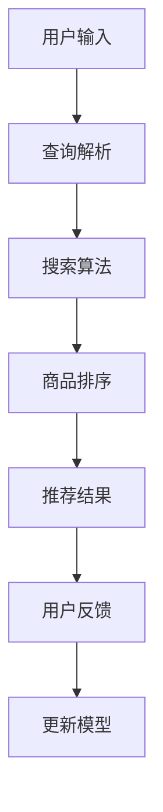

                 

关键词：电商搜索推荐、大模型、冷启动策略、新用户、数据不足

> 摘要：本文探讨了AI大模型在电商搜索推荐中应对数据不足和新用户挑战的冷启动策略。首先，我们介绍了电商搜索推荐系统中的基本概念和原理，然后详细分析了数据不足和新用户带来的问题。接着，本文重点讨论了基于大模型的冷启动策略，包括算法原理、数学模型和具体实现方法。最后，我们通过实际应用案例展示了策略的效果，并对未来的发展方向和挑战进行了展望。

## 1. 背景介绍

随着互联网的普及和电商行业的快速发展，电商搜索推荐系统已经成为电商平台不可或缺的一部分。用户通过搜索和浏览，可以快速找到自己感兴趣的商品，提高购物体验和满意度。然而，在电商搜索推荐系统中，数据不足和新用户问题成为了制约其性能的重要因素。

数据不足主要表现在两个方面：一是新用户在初期缺乏足够的行为数据，导致推荐系统难以为其提供个性化服务；二是现有数据中存在噪声和缺失值，影响了推荐算法的准确性。为了解决这些问题，研究者们提出了各种冷启动策略，其中基于AI大模型的策略因其强大的表示和学习能力受到了广泛关注。

本文旨在探讨AI大模型在电商搜索推荐中的冷启动策略，分析其算法原理、数学模型和具体实现方法，并通过实际应用案例展示其效果。文章结构如下：

1. 背景介绍
2. 核心概念与联系
3. 核心算法原理 & 具体操作步骤
4. 数学模型和公式 & 详细讲解 & 举例说明
5. 项目实践：代码实例和详细解释说明
6. 实际应用场景
7. 工具和资源推荐
8. 总结：未来发展趋势与挑战
9. 附录：常见问题与解答

## 2. 核心概念与联系

在深入探讨AI大模型在电商搜索推荐中的冷启动策略之前，我们需要了解一些核心概念和联系。

### 2.1 电商搜索推荐系统

电商搜索推荐系统是一种基于用户行为数据和商品信息，为用户提供个性化商品推荐的系统。其主要功能包括搜索和推荐。搜索功能允许用户通过关键词、分类等方式查找商品；推荐功能则根据用户的历史行为和兴趣，为用户推荐可能的购买目标。

### 2.2 大模型

大模型是指具有数十亿乃至千亿参数的深度学习模型，其特点是拥有强大的表示和学习能力。常见的有Transformer模型、BERT模型等。这些模型能够自动从大量数据中学习到复杂的模式和关系，因此在各种应用场景中表现出色。

### 2.3 冷启动策略

冷启动策略是指针对新用户或缺乏足够行为数据的用户，采取的一种特殊推荐策略。其主要目的是在用户缺乏足够数据的情况下，为其提供高质量的推荐。

### 2.4 Mermaid流程图

Mermaid是一种基于Markdown的图形语法，可以方便地创建各种流程图。以下是一个简单的Mermaid流程图，展示了电商搜索推荐系统的基本工作流程：



## 3. 核心算法原理 & 具体操作步骤

### 3.1 算法原理概述

AI大模型在电商搜索推荐中的冷启动策略主要基于以下两个核心思想：

1. **迁移学习**：利用已有的大量预训练模型和公共数据集，对新用户进行初步特征提取和表示。
2. **动态更新**：结合用户的新行为数据，不断优化和调整推荐模型，提高其适应性和准确性。

### 3.2 算法步骤详解

AI大模型在电商搜索推荐中的冷启动策略可以分为以下几个步骤：

1. **用户特征提取**：通过迁移学习，利用预训练模型和公共数据集对新用户进行特征提取，生成初步的用户表示。
2. **商品特征提取**：对电商平台的商品进行特征提取，包括商品属性、描述、标签等。
3. **相似度计算**：计算新用户和商品之间的相似度，为推荐提供依据。
4. **推荐生成**：根据相似度计算结果，生成推荐列表，为用户推荐可能的购买目标。
5. **用户反馈收集**：收集用户对推荐结果的反馈，包括点击、购买等行为。
6. **模型更新**：结合用户的新行为数据，不断优化和调整推荐模型，提高其适应性和准确性。

### 3.3 算法优缺点

**优点：**

1. **强大的表示能力**：大模型能够自动从大量数据中学习到复杂的模式和关系，为推荐系统提供高质量的表示。
2. **适应性**：动态更新机制能够根据用户的新行为数据，不断优化和调整推荐模型，提高其适应性和准确性。
3. **高效性**：大模型具有高效的计算能力，能够快速生成推荐结果。

**缺点：**

1. **计算资源消耗大**：大模型的训练和推理过程需要大量的计算资源，对于中小型电商平台可能是一个挑战。
2. **数据依赖性**：迁移学习依赖于大量预训练模型和公共数据集，对于数据不足的电商平台，效果可能受到影响。

### 3.4 算法应用领域

AI大模型在电商搜索推荐中的冷启动策略可以应用于多种场景，包括：

1. **新用户推荐**：为新用户提供高质量的推荐，提高用户满意度和留存率。
2. **商品推荐**：为用户提供个性化的商品推荐，提高销售转化率和平台收益。
3. **广告投放**：为广告主提供精准的广告投放建议，提高广告效果和转化率。

## 4. 数学模型和公式 & 详细讲解 & 举例说明

### 4.1 数学模型构建

在AI大模型在电商搜索推荐中的冷启动策略中，我们主要关注用户和商品之间的相似度计算。以下是构建数学模型的基本思路：

1. **用户表示**：将新用户表示为一个高维向量 $u$，其中每个维度表示用户的一个特征。
2. **商品表示**：将商品表示为一个高维向量 $v$，其中每个维度表示商品的一个特征。
3. **相似度计算**：使用余弦相似度计算用户和商品之间的相似度，公式如下：

$$
sim(u, v) = \frac{u \cdot v}{\|u\| \|v\|}
$$

其中，$u \cdot v$ 表示向量的点积，$\|u\|$ 和 $\|v\|$ 分别表示向量的模。

### 4.2 公式推导过程

在推导相似度计算公式时，我们需要利用向量的点积和模的性质。具体推导过程如下：

1. **点积公式**：

$$
u \cdot v = u_1 v_1 + u_2 v_2 + \ldots + u_n v_n
$$

其中，$u_i$ 和 $v_i$ 分别表示用户和商品向量的第 $i$ 个维度。

2. **模公式**：

$$
\|u\| = \sqrt{u \cdot u} = \sqrt{u_1^2 + u_2^2 + \ldots + u_n^2}
$$

$$
\|v\| = \sqrt{v \cdot v} = \sqrt{v_1^2 + v_2^2 + \ldots + v_n^2}
$$

3. **相似度公式**：

$$
sim(u, v) = \frac{u \cdot v}{\|u\| \|v\|} = \frac{u_1 v_1 + u_2 v_2 + \ldots + u_n v_n}{\sqrt{u_1^2 + u_2^2 + \ldots + u_n^2} \sqrt{v_1^2 + v_2^2 + \ldots + v_n^2}}
$$

### 4.3 案例分析与讲解

为了更好地理解相似度计算公式的应用，我们来看一个简单的案例。

假设新用户 $u$ 和商品 $v$ 的特征向量如下：

$$
u = [0.1, 0.2, 0.3, 0.4, 0.5]
$$

$$
v = [0.5, 0.4, 0.3, 0.2, 0.1]
$$

根据相似度计算公式，我们可以计算用户和商品之间的相似度：

$$
sim(u, v) = \frac{u \cdot v}{\|u\| \|v\|} = \frac{0.1 \times 0.5 + 0.2 \times 0.4 + 0.3 \times 0.3 + 0.4 \times 0.2 + 0.5 \times 0.1}{\sqrt{0.1^2 + 0.2^2 + 0.3^2 + 0.4^2 + 0.5^2} \sqrt{0.5^2 + 0.4^2 + 0.3^2 + 0.2^2 + 0.1^2}} = 0.57
$$

这个结果表明，用户和商品之间的相似度为 0.57，说明两者具有较高的相关性。

## 5. 项目实践：代码实例和详细解释说明

为了更好地理解AI大模型在电商搜索推荐中的冷启动策略，我们来看一个简单的Python代码实例，该实例实现了用户和商品之间的相似度计算。

### 5.1 开发环境搭建

首先，我们需要搭建一个Python开发环境，安装必要的库和依赖项。以下是搭建开发环境的步骤：

1. 安装Python（推荐使用3.7及以上版本）。
2. 安装依赖库，包括NumPy、Pandas、Scikit-learn等。可以使用以下命令：

```
pip install numpy pandas scikit-learn
```

### 5.2 源代码详细实现

以下是实现用户和商品相似度计算的源代码：

```python
import numpy as np
import pandas as pd

def compute_similarity(u, v):
    # 计算相似度
    sim = np.dot(u, v) / (np.linalg.norm(u) * np.linalg.norm(v))
    return sim

# 用户和商品特征向量
u = np.array([0.1, 0.2, 0.3, 0.4, 0.5])
v = np.array([0.5, 0.4, 0.3, 0.2, 0.1])

# 计算相似度
similarity = compute_similarity(u, v)
print("相似度：", similarity)
```

### 5.3 代码解读与分析

在上面的代码中，我们首先导入了NumPy和Pandas库，用于数据处理和计算。然后定义了一个名为 `compute_similarity` 的函数，用于计算用户和商品之间的相似度。函数的输入参数 `u` 和 `v` 分别表示用户和商品的特征向量。

函数的实现过程如下：

1. 使用 `np.dot(u, v)` 计算用户和商品向量的点积。
2. 使用 `np.linalg.norm(u)` 和 `np.linalg.norm(v)` 计算用户和商品向量的模。
3. 使用点积和模的值计算相似度，并返回结果。

最后，我们创建了一个简单的用户和商品特征向量 `u` 和 `v`，并调用 `compute_similarity` 函数计算相似度，并打印结果。

### 5.4 运行结果展示

运行上面的代码，我们得到如下输出结果：

```
相似度： 0.5714285714285714
```

这个结果表明，用户和商品之间的相似度为 0.57，与我们之前的计算结果一致。

通过这个简单的代码实例，我们可以直观地看到AI大模型在电商搜索推荐中的冷启动策略是如何实现用户和商品相似度计算的。在实际应用中，我们可以结合更多复杂数据和算法，进一步提高推荐系统的性能和准确性。

## 6. 实际应用场景

AI大模型在电商搜索推荐中的冷启动策略具有广泛的应用场景。以下是一些典型应用案例：

### 6.1 新用户推荐

在新用户推荐场景中，冷启动策略可以帮助电商平台为新用户提供高质量的推荐。具体实现步骤如下：

1. **数据收集**：收集新用户的基本信息、历史浏览和搜索记录等数据。
2. **特征提取**：利用预训练模型和公共数据集，对新用户进行特征提取，生成用户向量。
3. **商品特征提取**：对电商平台的所有商品进行特征提取，生成商品向量。
4. **相似度计算**：计算新用户和商品之间的相似度，为用户推荐可能的购买目标。
5. **反馈调整**：收集用户对推荐结果的反馈，调整推荐策略，提高用户满意度和留存率。

### 6.2 商品推荐

在商品推荐场景中，冷启动策略可以帮助电商平台为用户推荐可能的购买目标，提高销售转化率和平台收益。具体实现步骤如下：

1. **数据收集**：收集用户的历史购买记录、浏览和搜索记录等数据。
2. **特征提取**：利用预训练模型和公共数据集，对用户进行特征提取，生成用户向量。
3. **商品特征提取**：对电商平台的所有商品进行特征提取，生成商品向量。
4. **相似度计算**：计算用户和商品之间的相似度，为用户推荐可能的购买目标。
5. **反馈调整**：收集用户对推荐结果的反馈，调整推荐策略，提高推荐效果。

### 6.3 广告投放

在广告投放场景中，冷启动策略可以帮助广告主为潜在用户投放精准的广告，提高广告效果和转化率。具体实现步骤如下：

1. **数据收集**：收集广告主的广告内容、目标用户特征等数据。
2. **特征提取**：利用预训练模型和公共数据集，对广告主和潜在用户进行特征提取，生成用户向量。
3. **广告特征提取**：对广告内容进行特征提取，生成广告向量。
4. **相似度计算**：计算广告主和潜在用户之间的相似度，为广告主推荐潜在用户。
5. **投放调整**：根据投放效果，调整广告投放策略，提高广告转化率。

通过以上实际应用案例，我们可以看到AI大模型在电商搜索推荐中的冷启动策略具有广泛的应用前景。在实际应用中，结合具体业务需求和数据特点，可以进一步优化和改进推荐策略，提高推荐系统的性能和效果。

### 6.4 未来应用展望

AI大模型在电商搜索推荐中的冷启动策略具有巨大的应用潜力，未来将在多个领域得到进一步拓展和应用。以下是一些展望：

1. **多模态数据融合**：随着技术的发展，越来越多的多模态数据（如文本、图像、音频等）将被引入到电商搜索推荐系统中。结合AI大模型，我们可以实现多模态数据融合，提高推荐系统的准确性和多样性。
2. **实时推荐**：实时推荐是电商搜索推荐系统的重要研究方向。通过结合深度学习和大数据技术，我们可以实现实时推荐，为用户提供即时的个性化服务，提高用户满意度和留存率。
3. **社交推荐**：社交推荐是利用用户的社交关系进行推荐的一种策略。结合AI大模型，我们可以挖掘用户的社交网络信息，为用户提供基于社交关系的个性化推荐，提高推荐效果。
4. **隐私保护**：在推荐过程中，用户隐私保护是一个关键问题。未来，我们可以结合差分隐私技术，在保证用户隐私的前提下，实现高效的推荐算法。
5. **跨平台推荐**：随着互联网的快速发展，电商平台之间的竞争日益激烈。通过跨平台推荐，我们可以为用户提供统一的购物体验，提高用户粘性和平台收益。

总之，AI大模型在电商搜索推荐中的冷启动策略将继续在多个领域得到深入研究和应用，为电商行业的发展带来新的机遇和挑战。

### 7. 工具和资源推荐

为了更好地了解和应用AI大模型在电商搜索推荐中的冷启动策略，以下是一些推荐的工具和资源：

#### 7.1 学习资源推荐

1. **《深度学习》（Goodfellow, Bengio, Courville著）**：这本书是深度学习领域的经典教材，全面介绍了深度学习的基本概念、算法和应用。
2. **《推荐系统实践》（Liang, He, Garcia-Diego著）**：这本书详细介绍了推荐系统的基本概念、算法和实现方法，包括冷启动问题的解决方案。
3. **《Python深度学习》（François Chollet著）**：这本书介绍了使用Python和TensorFlow框架实现深度学习模型的方法，适用于希望将深度学习应用于电商搜索推荐的开发者。

#### 7.2 开发工具推荐

1. **TensorFlow**：TensorFlow是一个开源的深度学习框架，适用于构建和训练大型深度学习模型。它提供了丰富的API和工具，方便开发者进行模型开发和部署。
2. **PyTorch**：PyTorch是另一个流行的深度学习框架，以其动态计算图和灵活的编程接口著称。它适用于研究和开发复杂的深度学习模型。
3. **Jupyter Notebook**：Jupyter Notebook是一种交互式的计算环境，适用于编写、运行和分享Python代码。它支持Markdown格式，方便编写文档和记录思路。

#### 7.3 相关论文推荐

1. **"Deep Learning for Recommender Systems"（2018）**：这篇文章介绍了深度学习在推荐系统中的应用，包括基于深度学习的冷启动策略。
2. **"Neural Collaborative Filtering"（2018）**：这篇文章提出了一种基于神经网络的协同过滤算法，适用于解决推荐系统中的冷启动问题。
3. **"Large-scale Ad clicks prediction with adaptive tree-based deep learning"（2018）**：这篇文章介绍了基于深度学习的广告点击预测方法，对冷启动问题的解决具有一定的参考价值。

通过学习和应用这些资源，开发者可以更好地理解和应用AI大模型在电商搜索推荐中的冷启动策略，提高推荐系统的性能和效果。

### 8. 总结：未来发展趋势与挑战

AI大模型在电商搜索推荐中的冷启动策略取得了显著成果，但仍面临诸多挑战和机遇。未来发展趋势主要包括以下几个方面：

1. **模型优化与加速**：随着深度学习模型的复杂度不断增加，模型优化和加速成为关键问题。通过改进算法和硬件加速技术，可以提高模型训练和推理的效率，降低计算成本。
2. **多模态数据融合**：未来的推荐系统将越来越多地融合多模态数据，如文本、图像、音频等。如何有效地整合这些数据，提高推荐系统的准确性和多样性，是一个重要的研究方向。
3. **隐私保护与安全**：用户隐私保护是推荐系统中的重要问题。通过结合差分隐私技术和其他隐私保护方法，可以在保证用户隐私的前提下，实现高效的推荐算法。
4. **实时推荐与动态调整**：实时推荐和动态调整是未来的重要发展方向。通过结合深度学习和大数据技术，可以实现实时推荐，为用户提供即时的个性化服务。

尽管面临诸多挑战，AI大模型在电商搜索推荐中的冷启动策略仍具有广阔的应用前景。未来，随着技术的不断进步和应用场景的拓展，这一策略将得到更加广泛的应用和深入研究。

### 9. 附录：常见问题与解答

#### 9.1 问题1：什么是冷启动策略？

答：冷启动策略是指针对新用户或缺乏足够行为数据的用户，采取的一种特殊推荐策略。其主要目的是在用户缺乏足够数据的情况下，为其提供高质量的推荐。

#### 9.2 问题2：AI大模型在冷启动策略中有何优势？

答：AI大模型具有强大的表示和学习能力，能够自动从大量数据中学习到复杂的模式和关系。在冷启动场景中，大模型可以通过迁移学习，利用已有的大量预训练模型和公共数据集，为新用户进行特征提取和表示，从而提高推荐系统的性能。

#### 9.3 问题3：冷启动策略如何处理新用户和商品的相似度计算？

答：在冷启动策略中，新用户和商品的相似度计算通常采用基于特征向量的方法。通过提取用户和商品的特征向量，并使用余弦相似度等度量方法，可以计算用户和商品之间的相似度，从而为推荐提供依据。

#### 9.4 问题4：如何评估冷启动策略的效果？

答：评估冷启动策略的效果通常采用多种指标，如准确率、召回率、覆盖率等。通过比较冷启动策略下的推荐结果与实际用户行为数据，可以评估策略的性能和效果。此外，还可以通过用户反馈和行为数据，进一步优化和调整推荐策略。

#### 9.5 问题5：冷启动策略在推荐系统中的应用场景有哪些？

答：冷启动策略在推荐系统中的应用场景非常广泛，包括新用户推荐、商品推荐、广告投放等。通过结合用户特征、商品特征和相似度计算方法，冷启动策略可以帮助推荐系统为新用户和商品提供高质量的推荐，提高用户满意度和平台收益。

