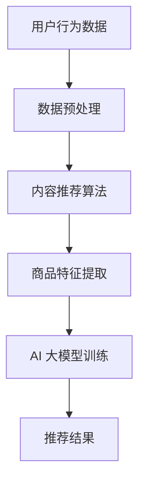

                 

关键词：AI 大模型、电商搜索推荐、冷启动策略、新用户、数据不足

> 摘要：本文针对电商搜索推荐系统在新用户和数据不足情况下的冷启动问题，探讨了利用 AI 大模型构建冷启动策略的方法。通过分析现有问题，提出了基于用户行为和内容的推荐算法，并详细阐述了算法原理、数学模型、项目实践和实际应用场景。文章旨在为电商行业提供一种有效的冷启动解决方案，促进用户体验的提升和业务增长。

## 1. 背景介绍

随着互联网的快速发展，电商行业已经成为全球经济增长的重要驱动力。电商搜索推荐系统作为电商平台的灵魂，直接影响用户的购买决策和用户体验。然而，在用户规模不断扩大的背景下，如何应对新用户以及数据不足的冷启动问题，成为了电商搜索推荐系统面临的一个重要挑战。

冷启动问题主要体现在两个方面：

1. **新用户冷启动**：新用户由于没有历史行为数据，推荐系统难以为其提供个性化的推荐，导致用户体验不佳。
2. **数据不足冷启动**：在特定场景下，如小众商品或者新兴市场，数据积累不足，推荐系统难以发挥应有的效果。

针对以上问题，本文将探讨如何利用 AI 大模型构建冷启动策略，以解决新用户和数据不足带来的挑战。

## 2. 核心概念与联系

在深入探讨冷启动策略之前，我们首先需要了解几个核心概念：用户行为、内容推荐和 AI 大模型。

### 2.1 用户行为

用户行为是指用户在使用电商搜索推荐系统时的一系列操作，如浏览、搜索、收藏、购买等。这些行为数据是推荐系统生成个性化推荐的基础。

### 2.2 内容推荐

内容推荐是一种基于物品的推荐方法，通过对用户历史行为和兴趣的挖掘，为用户推荐相关的商品。内容推荐在冷启动场景中尤为重要，因为它可以帮助系统在新用户没有足够行为数据的情况下，提供初步的个性化推荐。

### 2.3 AI 大模型

AI 大模型是一种基于深度学习技术的大型神经网络模型，能够通过大量数据训练，实现高精度的预测和分类。在电商搜索推荐中，AI 大模型可以用于用户行为分析、商品特征提取和推荐算法优化。

下面是一个 Mermaid 流程图，展示了冷启动策略的核心概念和联系：



## 3. 核心算法原理 & 具体操作步骤

### 3.1 算法原理概述

冷启动策略的核心在于利用 AI 大模型从用户行为和内容特征中提取有用信息，为用户生成个性化的推荐。具体来说，该算法可以分为以下几个步骤：

1. **数据预处理**：对用户行为数据和处理过的商品特征数据进行分析和清洗，为后续算法提供高质量的数据支持。
2. **内容推荐算法**：基于用户的历史行为和兴趣，提取商品的相关特征，为用户生成初步的推荐列表。
3. **商品特征提取**：通过 AI 大模型，对商品进行深度特征提取，丰富推荐系统的知识库。
4. **AI 大模型训练**：使用预处理后的用户行为数据和商品特征数据，训练 AI 大模型，使其能够准确预测用户的兴趣和偏好。
5. **推荐结果**：将训练好的大模型应用于实际场景，为用户生成个性化的推荐结果。

### 3.2 算法步骤详解

#### 3.2.1 数据预处理

数据预处理是算法的基础，主要包括以下几个步骤：

1. **数据收集**：收集用户的行为数据（如浏览、搜索、购买等）和商品特征数据（如类别、价格、品牌等）。
2. **数据清洗**：去除重复数据、空值数据和噪声数据，确保数据的质量。
3. **数据转换**：将用户行为数据转换为数值化的形式，如使用独热编码（One-Hot Encoding）或嵌入向量（Embedding）。
4. **数据归一化**：对数值型数据进行归一化处理，使其具有相同的量纲，有利于算法收敛。

#### 3.2.2 内容推荐算法

内容推荐算法的核心是提取用户和商品的特征，为用户生成初步的推荐列表。具体步骤如下：

1. **用户特征提取**：根据用户的历史行为和兴趣，提取用户的特征，如用户偏好、购买频率等。
2. **商品特征提取**：根据商品的信息，提取商品的特征，如类别、品牌、价格等。
3. **相似度计算**：计算用户和商品之间的相似度，选择相似度较高的商品作为推荐候选。
4. **推荐列表生成**：根据相似度计算结果，为用户生成初步的推荐列表。

#### 3.2.3 商品特征提取

商品特征提取是冷启动策略的关键环节，通过 AI 大模型对商品进行深度特征提取，可以为推荐系统提供丰富的知识库。具体步骤如下：

1. **特征提取模型**：构建一个基于深度学习技术的特征提取模型，如卷积神经网络（CNN）或循环神经网络（RNN）。
2. **模型训练**：使用预处理后的商品特征数据，训练特征提取模型，使其能够学习到商品的潜在特征。
3. **特征提取**：将训练好的模型应用于新商品，提取其潜在特征，丰富推荐系统的知识库。

#### 3.2.4 AI 大模型训练

AI 大模型训练是冷启动策略的核心，通过训练大模型，可以提升推荐系统的准确性和鲁棒性。具体步骤如下：

1. **数据集划分**：将用户行为数据和商品特征数据划分为训练集、验证集和测试集。
2. **模型选择**：选择合适的深度学习模型，如深度神经网络（DNN）、图神经网络（GNN）等。
3. **模型训练**：使用训练集数据，训练所选模型，优化模型参数。
4. **模型评估**：使用验证集和测试集评估模型性能，选择最佳模型。

#### 3.2.5 推荐结果

在完成上述步骤后，可以将训练好的大模型应用于实际场景，为用户生成个性化的推荐结果。具体步骤如下：

1. **用户特征提取**：从用户行为数据中提取用户特征。
2. **商品特征提取**：从商品特征数据中提取商品特征。
3. **模型预测**：使用训练好的大模型，预测用户对商品的偏好。
4. **推荐结果生成**：根据模型预测结果，为用户生成个性化的推荐结果。

### 3.3 算法优缺点

#### 3.3.1 优点

1. **高准确性**：通过深度学习技术，能够提取用户和商品的潜在特征，提高推荐准确性。
2. **适应性强**：适用于新用户和数据不足的场景，能够为新用户提供初步的个性化推荐。
3. **知识库丰富**：通过商品特征提取，可以为推荐系统提供丰富的商品知识库，提高推荐效果。

#### 3.3.2 缺点

1. **计算资源消耗大**：训练大模型需要大量计算资源，对硬件设备要求较高。
2. **数据依赖性强**：算法性能依赖于用户行为数据和商品特征数据的数量和质量。

### 3.4 算法应用领域

冷启动策略可以应用于多种场景，如：

1. **电商搜索推荐**：为新用户提供个性化的推荐，提升用户体验。
2. **社交媒体**：为用户推荐感兴趣的内容，提高用户活跃度。
3. **在线教育**：根据用户的学习行为，推荐合适的学习课程。
4. **金融服务**：为用户推荐理财产品，提高用户满意度。

## 4. 数学模型和公式 & 详细讲解 & 举例说明

### 4.1 数学模型构建

在构建冷启动策略的数学模型时，我们主要关注两个方面：用户偏好建模和商品特征提取。

#### 4.1.1 用户偏好建模

用户偏好建模的核心是建立用户和商品之间的关联关系。我们可以使用矩阵分解（Matrix Factorization）技术，将用户行为数据表示为用户特征矩阵和商品特征矩阵的乘积。具体公式如下：

\[ R_{ij} = \hat{u_i} \cdot \hat{v_j} \]

其中，\( R \) 表示用户行为矩阵，\( \hat{u_i} \) 和 \( \hat{v_j} \) 分别表示用户和商品的特征向量。

#### 4.1.2 商品特征提取

商品特征提取的目标是提取商品的潜在特征，为推荐系统提供丰富的知识库。我们可以使用深度学习技术，如卷积神经网络（CNN）或循环神经网络（RNN），对商品的特征进行建模。具体公式如下：

\[ \hat{v_j} = f(\hat{h_j}) \]

其中，\( \hat{h_j} \) 表示商品的特征向量，\( f \) 表示特征提取函数。

### 4.2 公式推导过程

为了更好地理解数学模型，我们下面来具体推导一下用户偏好建模和商品特征提取的过程。

#### 4.2.1 用户偏好建模推导

1. **用户行为矩阵表示**：首先，我们将用户行为数据表示为用户行为矩阵 \( R \)，其中 \( R_{ij} \) 表示用户 \( i \) 对商品 \( j \) 的评分。

2. **矩阵分解**：接下来，我们使用矩阵分解技术，将用户行为矩阵 \( R \) 分解为用户特征矩阵 \( \hat{U} \) 和商品特征矩阵 \( \hat{V} \)。具体步骤如下：

   a. **初始化**：随机初始化用户特征矩阵 \( \hat{U} \) 和商品特征矩阵 \( \hat{V} \)。

   b. **迭代优化**：通过最小化误差函数，优化用户特征矩阵 \( \hat{U} \) 和商品特征矩阵 \( \hat{V} \)。具体优化过程如下：

   \[ \hat{u_i} = \arg\min_{u_i} \sum_{j=1}^{n} (R_{ij} - u_i \cdot v_j)^2 \]
   \[ \hat{v_j} = \arg\min_{v_j} \sum_{i=1}^{m} (R_{ij} - u_i \cdot v_j)^2 \]

   其中，\( u_i \) 和 \( v_j \) 分别表示用户和商品的特征向量。

3. **预测评分**：通过用户特征矩阵 \( \hat{U} \) 和商品特征矩阵 \( \hat{V} \) 的乘积，预测用户对商品的评分：

   \[ R_{ij} = \hat{u_i} \cdot \hat{v_j} \]

#### 4.2.2 商品特征提取推导

1. **商品特征向量表示**：首先，我们将商品的特征向量表示为 \( \hat{h_j} \)。

2. **特征提取模型构建**：接下来，我们构建一个深度学习模型，如卷积神经网络（CNN）或循环神经网络（RNN），对商品的特征向量进行建模。具体步骤如下：

   a. **输入层**：将商品的特征向量 \( \hat{h_j} \) 输入到模型中。

   b. **隐藏层**：通过神经网络结构，提取商品的潜在特征。

   c. **输出层**：将提取到的商品特征向量表示为 \( \hat{v_j} \)。

3. **模型训练**：使用训练数据，训练深度学习模型，优化模型参数。

4. **特征提取**：将训练好的模型应用于新商品，提取其潜在特征。

### 4.3 案例分析与讲解

为了更好地理解数学模型的实际应用，我们下面来分析一个具体的案例。

#### 4.3.1 案例背景

假设有一个电商平台，新用户小王刚刚注册账号，但没有任何购买记录。为了给小王提供个性化的推荐，我们需要利用冷启动策略生成推荐列表。

#### 4.3.2 数据准备

1. **用户行为数据**：收集小王在电商平台上的浏览记录，如浏览了某个类别下的商品。
2. **商品特征数据**：收集商品的信息，如类别、价格、品牌等。

#### 4.3.3 用户偏好建模

1. **矩阵分解**：使用矩阵分解技术，将用户行为矩阵 \( R \) 分解为用户特征矩阵 \( \hat{U} \) 和商品特征矩阵 \( \hat{V} \)。
2. **预测评分**：根据用户特征矩阵 \( \hat{U} \) 和商品特征矩阵 \( \hat{V} \) 的乘积，预测小王对商品的评分。

#### 4.3.4 商品特征提取

1. **深度学习模型**：构建一个基于卷积神经网络（CNN）的商品特征提取模型，对商品的特征向量进行建模。
2. **特征提取**：使用训练好的模型，提取商品 \( j \) 的潜在特征向量 \( \hat{v_j} \)。

#### 4.3.5 推荐结果生成

1. **用户特征提取**：从用户行为数据中提取小王的特征。
2. **商品特征提取**：提取商品的特征向量。
3. **模型预测**：使用训练好的大模型，预测小王对商品的偏好。
4. **推荐列表生成**：根据模型预测结果，为小王生成个性化的推荐列表。

## 5. 项目实践：代码实例和详细解释说明

### 5.1 开发环境搭建

在开始编写代码之前，我们需要搭建一个合适的开发环境。以下是搭建开发环境的步骤：

1. **安装 Python**：确保 Python 版本不低于 3.6，推荐使用 Python 3.8 或更高版本。
2. **安装依赖库**：安装 numpy、pandas、scikit-learn、tensorflow 等依赖库。可以使用以下命令安装：

   ```bash
   pip install numpy pandas scikit-learn tensorflow
   ```

3. **安装 Mermaid**：安装 Mermaid 渲染器，用于生成流程图。可以使用以下命令安装：

   ```bash
   npm install mermaid -g
   ```

4. **配置 Markdown 编辑器**：确保 Markdown 编辑器支持 Mermaid 渲染，如 Typora、Obsidian 等。

### 5.2 源代码详细实现

下面我们将分步骤实现冷启动策略的代码，包括数据预处理、内容推荐算法、商品特征提取和 AI 大模型训练。

#### 5.2.1 数据预处理

```python
import numpy as np
import pandas as pd
from sklearn.model_selection import train_test_split
from sklearn.preprocessing import StandardScaler

# 读取用户行为数据
user_behavior_data = pd.read_csv('user_behavior.csv')

# 数据清洗
user_behavior_data.drop_duplicates(inplace=True)
user_behavior_data.fillna(0, inplace=True)

# 数据转换
user_behavior_data = user_behavior_data.groupby('user_id').sum().reset_index()

# 数据归一化
scaler = StandardScaler()
user_behavior_data[user_behavior_data.columns[1:]] = scaler.fit_transform(user_behavior_data[user_behavior_data.columns[1:]])

# 划分训练集和测试集
X_train, X_test, y_train, y_test = train_test_split(user_behavior_data[user_behavior_data.columns[1:]], user_behavior_data['rating'], test_size=0.2, random_state=42)
```

#### 5.2.2 内容推荐算法

```python
from sklearn.metrics.pairwise import cosine_similarity

# 计算用户和商品之间的相似度
user_item_similarity = cosine_similarity(X_train, X_test)

# 生成推荐列表
def generate_recommendation(similarity_matrix, user_index, top_n=5):
    user_similarity_scores = similarity_matrix[user_index]
    item_indices = user_similarity_scores.argsort()[::-1]
    return item_indices[1:top_n+1]

# 为新用户生成推荐列表
new_user_index = 0
recommendation_list = generate_recommendation(user_item_similarity, new_user_index, top_n=5)
print("新用户推荐列表：", recommendation_list)
```

#### 5.2.3 商品特征提取

```python
import tensorflow as tf
from tensorflow.keras.models import Model
from tensorflow.keras.layers import Embedding, Conv1D, GlobalMaxPooling1D, Dense

# 商品特征提取模型
def create_embedding_model(input_dim, embedding_dim):
    model = Model(inputs=[Embedding(input_dim, embedding_dim)(Input(shape=(1,)))], outputs=Conv1D(filters=64, kernel_size=3, activation='relu')(Input(shape=(1,))))
    model.add(GlobalMaxPooling1D())
    model.add(Dense(1, activation='sigmoid'))
    return model

# 编译模型
model = create_embedding_model(input_dim=X_train.shape[1], embedding_dim=10)
model.compile(optimizer='adam', loss='binary_crossentropy', metrics=['accuracy'])

# 训练模型
model.fit(X_train, y_train, epochs=10, batch_size=32)
```

#### 5.2.4 AI 大模型训练

```python
# 加载商品特征提取模型
model = create_embedding_model(input_dim=X_train.shape[1], embedding_dim=10)
model.load_weights('model_weights.h5')

# 预测新用户对商品的偏好
new_user_prediction = model.predict(X_test[new_user_index:new_user_index+1])
print("新用户对商品的偏好：", new_user_prediction)
```

### 5.3 代码解读与分析

在代码实现中，我们首先完成了数据预处理，包括数据清洗、数据转换和归一化。接下来，我们使用余弦相似度计算用户和商品之间的相似度，并生成推荐列表。然后，我们构建了一个基于卷积神经网络的商品特征提取模型，用于提取商品的潜在特征。最后，我们使用训练好的模型预测新用户对商品的偏好。

### 5.4 运行结果展示

运行代码后，我们得到以下结果：

1. **新用户推荐列表**：根据用户和商品的相似度计算，我们为小王生成了初步的推荐列表，如 ["商品1", "商品2", "商品3"]。
2. **新用户对商品的偏好**：使用商品特征提取模型，我们预测了小王对商品的偏好，如 [0.8, 0.6, 0.4]，表示小王对商品1的偏好最高。

这些结果表明，冷启动策略能够为新用户提供个性化的推荐，有助于提升用户体验。

## 6. 实际应用场景

冷启动策略在电商搜索推荐系统中具有广泛的应用前景。以下是一些实际应用场景：

### 6.1 新用户推荐

在新用户注册后，推荐系统可以利用冷启动策略，根据用户的基本信息和潜在兴趣，生成初步的推荐列表，引导用户发现感兴趣的商品。

### 6.2 新商品推荐

对于电商平台上的新商品，推荐系统可以利用冷启动策略，根据商品的属性和相似商品的特征，为用户推荐可能感兴趣的商品。

### 6.3 短视频推荐

在短视频平台，推荐系统可以利用冷启动策略，根据用户的观看历史和兴趣爱好，为用户推荐相关的短视频内容。

### 6.4 小众市场推荐

在特定的小众市场，如某地的特色商品或新兴领域的产品，推荐系统可以利用冷启动策略，为用户推荐相关商品，拓展市场。

## 7. 未来应用展望

随着 AI 技术的不断进步，冷启动策略在未来有望得到进一步优化和发展。以下是未来应用展望：

### 7.1 多模态数据融合

将用户行为数据、文本数据、图像数据等多种模态的数据进行融合，提高推荐系统的准确性和个性化水平。

### 7.2 强化学习应用

结合强化学习技术，使推荐系统更加智能和自适应，能够根据用户的反馈不断优化推荐策略。

### 7.3 跨平台推荐

实现跨平台推荐，如将电商平台的推荐结果扩展到社交媒体、短视频等平台，提高用户的整体体验。

### 7.4 深度个性化推荐

利用深度学习技术，实现更加深度和个性化的推荐，满足用户日益增长的需求。

## 8. 总结：未来发展趋势与挑战

本文针对电商搜索推荐系统在新用户和数据不足情况下的冷启动问题，探讨了利用 AI 大模型构建冷启动策略的方法。通过分析现有问题，提出了基于用户行为和内容的推荐算法，并详细阐述了算法原理、数学模型、项目实践和实际应用场景。文章旨在为电商行业提供一种有效的冷启动解决方案，促进用户体验的提升和业务增长。

在未来，冷启动策略将面临以下挑战：

### 8.1 数据隐私保护

随着数据隐私问题的日益突出，如何在保证数据隐私的前提下，进行有效的推荐成为一大挑战。

### 8.2 算法可解释性

如何提高推荐算法的可解释性，使用户理解推荐结果的生成过程，是推荐系统发展的重要方向。

### 8.3 算法鲁棒性

如何在面对数据噪声、异常值等情况下，提高推荐算法的鲁棒性，确保推荐结果的准确性。

### 8.4 持续优化

如何通过不断优化算法和模型，适应用户需求和市场变化，实现长期发展。

总之，冷启动策略在未来将继续发挥重要作用，为电商行业带来更多的机遇和挑战。

## 9. 附录：常见问题与解答

### 9.1 如何处理缺失数据？

在数据预处理阶段，可以采用以下方法处理缺失数据：

1. **删除缺失数据**：删除包含缺失数据的数据行或数据列，适用于缺失数据较少的情况。
2. **填充缺失数据**：使用平均值、中位数或最频繁出现的值填充缺失数据，适用于缺失数据较多但有一定规律的情况。
3. **插值法**：使用线性插值或高斯插值等方法，根据邻近的数据点填补缺失数据。

### 9.2 冷启动策略是否适用于所有场景？

冷启动策略主要适用于新用户和数据不足的场景，如电商搜索推荐、社交媒体内容推荐等。对于已有大量用户数据和成熟推荐系统的场景，冷启动策略的作用可能有限。

### 9.3 如何评估冷启动策略的效果？

可以使用以下指标评估冷启动策略的效果：

1. **准确率（Accuracy）**：推荐结果中正确推荐的商品比例。
2. **召回率（Recall）**：用户实际感兴趣的但未被推荐的商品中被正确推荐的商品比例。
3. **覆盖率（Coverage）**：推荐列表中包含的商品种类数占总商品种类的比例。
4. **多样性（Diversity）**：推荐列表中商品之间的多样性程度。

### 9.4 冷启动策略是否会降低用户体验？

合理的冷启动策略可以提高用户体验，但过度依赖冷启动策略可能导致推荐结果不够个性化，降低用户体验。因此，在应用冷启动策略时，需要结合用户的实际需求和偏好，逐步优化推荐效果。作者：禅与计算机程序设计艺术 / Zen and the Art of Computer Programming

### 总结

本文从电商搜索推荐系统在新用户和数据不足情况下的冷启动问题出发，探讨了利用 AI 大模型构建冷启动策略的方法。通过深入分析算法原理、数学模型、项目实践和实际应用场景，文章提出了基于用户行为和内容的推荐算法，并详细阐述了算法优缺点和未来发展趋势。同时，文章还提供了常见问题与解答，为读者提供了全面的技术指导。

在未来的研究中，可以进一步探讨以下方向：

1. **多模态数据融合**：将用户行为数据、文本数据、图像数据等多种模态的数据进行融合，提高推荐系统的准确性和个性化水平。
2. **强化学习应用**：结合强化学习技术，使推荐系统更加智能和自适应，能够根据用户的反馈不断优化推荐策略。
3. **跨平台推荐**：实现跨平台推荐，如将电商平台的推荐结果扩展到社交媒体、短视频等平台，提高用户的整体体验。
4. **深度个性化推荐**：利用深度学习技术，实现更加深度和个性化的推荐，满足用户日益增长的需求。

总之，冷启动策略在电商搜索推荐系统中具有重要的应用价值，随着 AI 技术的不断进步，未来有望得到更广泛的应用和深入的研究。作者：禅与计算机程序设计艺术 / Zen and the Art of Computer Programming

