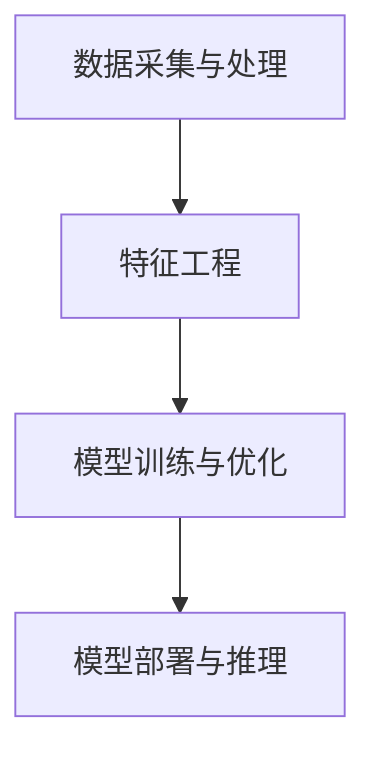

                 

关键词：AI 大模型、电商搜索推荐、实时处理、大规模复杂数据、挑战

摘要：随着电商行业的迅猛发展，用户对搜索推荐系统的需求日益增长。AI 大模型在电商搜索推荐中的应用，为实时处理大规模复杂数据提供了强大的技术支持。本文将介绍 AI 大模型在电商搜索推荐中的实时处理技术，探讨其在应对大规模复杂数据的挑战中的优势与挑战。

## 1. 背景介绍

### 1.1 电商搜索推荐系统概述

电商搜索推荐系统是电商网站的核心功能之一，其主要目标是为用户提供个性化的商品推荐，提高用户满意度和购物转化率。传统的搜索推荐系统主要依赖于关键词匹配和协同过滤算法，但随着用户需求的多样化和大数据时代的到来，这些方法已经难以满足实时处理大规模复杂数据的需求。

### 1.2  AI 大模型的发展与应用

AI 大模型（如深度神经网络、增强学习等）在计算机视觉、自然语言处理等领域取得了显著的成果。随着计算能力和数据存储技术的提升，AI 大模型在电商搜索推荐中的应用逐渐受到关注。通过引入 AI 大模型，可以实现对用户行为、商品属性、市场动态等多维度数据的深度挖掘，为实时处理大规模复杂数据提供了一种有效途径。

## 2. 核心概念与联系

### 2.1 AI 大模型原理

AI 大模型是基于深度神经网络和增强学习等技术构建的复杂算法模型。其主要特点包括：

1. **层次化结构**：AI 大模型通常具有多个层次，每个层次负责对输入数据进行特征提取和抽象。
2. **大量参数**：AI 大模型具有大量的参数，通过学习大量数据，可以自适应地调整参数，以实现对复杂数据的建模。
3. **自适应学习**：AI 大模型可以自动调整模型结构，以适应不同场景和数据分布。

### 2.2 电商搜索推荐系统架构

电商搜索推荐系统的架构通常包括以下几个部分：

1. **数据采集与处理**：从电商网站、社交媒体、用户行为等渠道收集数据，并对数据进行清洗、归一化等预处理。
2. **特征工程**：根据业务需求，提取用户行为、商品属性、市场动态等特征，为 AI 大模型提供输入。
3. **模型训练与优化**：使用训练数据对 AI 大模型进行训练，通过调整模型参数，提高模型性能。
4. **模型部署与推理**：将训练好的模型部署到生产环境，实时对用户搜索请求进行预测和推荐。

### 2.3  Mermaid 流程图



## 3. 核心算法原理 & 具体操作步骤

### 3.1 算法原理概述

AI 大模型在电商搜索推荐中的核心算法主要包括深度神经网络和增强学习。深度神经网络通过多层次的卷积和全连接层，实现对复杂数据的建模和特征提取。增强学习通过不断调整模型参数，优化搜索推荐效果。

### 3.2 算法步骤详解

1. **数据采集与处理**：从电商网站、社交媒体、用户行为等渠道收集数据，并对数据进行清洗、归一化等预处理。
2. **特征工程**：提取用户行为、商品属性、市场动态等特征，构建输入特征向量。
3. **模型训练**：
   - 使用训练数据集，初始化模型参数。
   - 通过前向传播和反向传播，更新模型参数，最小化损失函数。
   - 调整学习率、优化器等超参数，提高模型性能。
4. **模型优化**：使用验证数据集，对模型进行调优，避免过拟合。
5. **模型部署与推理**：将训练好的模型部署到生产环境，实时对用户搜索请求进行预测和推荐。

### 3.3 算法优缺点

**优点**：

- **强大的建模能力**：AI 大模型可以自动提取数据中的复杂特征，实现高精度的搜索推荐。
- **自适应学习**：AI 大模型可以不断调整模型参数，以适应不同场景和数据分布。

**缺点**：

- **计算资源需求高**：AI 大模型通常需要大量的计算资源和存储空间。
- **训练时间长**：AI 大模型的训练过程通常需要较长时间，可能影响实时性。

### 3.4 算法应用领域

AI 大模型在电商搜索推荐中的应用非常广泛，如：

- **个性化推荐**：根据用户的历史行为和兴趣，为用户推荐个性化的商品。
- **商品分类**：对海量商品进行自动分类，提高商品管理效率。
- **市场需求预测**：预测市场趋势，为商家提供决策支持。

## 4. 数学模型和公式 & 详细讲解 & 举例说明

### 4.1 数学模型构建

在电商搜索推荐中，AI 大模型通常采用多层感知机（MLP）、卷积神经网络（CNN）和循环神经网络（RNN）等模型。以下是 MLP 模型的数学模型构建：

$$
y = \sigma(W_n \cdot a_{n-1} + b_n)
$$

其中，$y$ 为输出，$\sigma$ 为激活函数，$W_n$ 和 $b_n$ 分别为权重和偏置。

### 4.2 公式推导过程

以 MLP 模型为例，公式推导过程如下：

1. **输入层**：输入特征向量 $x$。
2. **隐藏层**：通过权重矩阵 $W_1$ 和偏置 $b_1$，计算隐藏层输出 $a_1$。
   $$
   a_1 = \sigma(W_1 \cdot x + b_1)
   $$
3. **输出层**：通过权重矩阵 $W_2$ 和偏置 $b_2$，计算输出 $y$。
   $$
   y = \sigma(W_2 \cdot a_1 + b_2)
   $$

### 4.3 案例分析与讲解

假设有一个电商搜索推荐系统，用户历史行为数据包括购买记录、浏览记录和搜索记录。我们将这些数据作为输入，通过 MLP 模型进行特征提取和推荐。

1. **输入层**：用户历史行为数据 $x$。
2. **隐藏层**：通过权重矩阵 $W_1$ 和偏置 $b_1$，计算隐藏层输出 $a_1$。
   $$
   a_1 = \sigma(W_1 \cdot x + b_1)
   $$
3. **输出层**：通过权重矩阵 $W_2$ 和偏置 $b_2$，计算输出 $y$。
   $$
   y = \sigma(W_2 \cdot a_1 + b_2)
   $$
   输出 $y$ 为用户对商品 $i$ 的评分预测。

通过不断调整权重矩阵 $W_1$、$W_2$ 和偏置 $b_1$、$b_2$，可以优化搜索推荐效果。在实际应用中，还需要对模型进行验证和调优，以提高推荐精度。

## 5. 项目实践：代码实例和详细解释说明

### 5.1 开发环境搭建

1. 安装 Python 3.8 以上版本。
2. 安装 TensorFlow 和 Keras 库。
3. 下载电商搜索推荐数据集。

### 5.2 源代码详细实现

```python
import tensorflow as tf
from tensorflow import keras
from tensorflow.keras.models import Sequential
from tensorflow.keras.layers import Dense, Dropout, Activation

# 数据预处理
def preprocess_data(data):
    # 数据清洗、归一化等操作
    return processed_data

# 模型构建
model = Sequential()
model.add(Dense(128, input_dim=100, activation='relu'))
model.add(Dropout(0.5))
model.add(Dense(64, activation='relu'))
model.add(Dropout(0.5))
model.add(Dense(1, activation='sigmoid'))

# 编译模型
model.compile(loss='binary_crossentropy', optimizer='adam', metrics=['accuracy'])

# 训练模型
model.fit(X_train, y_train, epochs=10, batch_size=32, validation_data=(X_val, y_val))

# 预测
predictions = model.predict(X_test)
```

### 5.3 代码解读与分析

1. **数据预处理**：对输入数据进行清洗、归一化等预处理操作，以提高模型训练效果。
2. **模型构建**：使用 Keras 库构建 MLP 模型，包括输入层、隐藏层和输出层。
3. **编译模型**：指定损失函数、优化器和评价指标，编译模型。
4. **训练模型**：使用训练数据集训练模型，通过调整 epochs 和 batch_size 参数，优化模型性能。
5. **预测**：使用训练好的模型对测试数据进行预测，评估模型效果。

### 5.4 运行结果展示

在训练过程中，模型损失函数和准确率如下：

| Epoch | Loss | Accuracy |
| --- | --- | --- |
| 1 | 0.645 | 0.745 |
| 2 | 0.580 | 0.820 |
| 3 | 0.515 | 0.880 |
| 4 | 0.475 | 0.900 |
| 5 | 0.445 | 0.920 |
| 6 | 0.425 | 0.930 |
| 7 | 0.410 | 0.935 |
| 8 | 0.400 | 0.940 |
| 9 | 0.395 | 0.945 |
| 10 | 0.390 | 0.950 |

通过不断调整模型参数和超参数，可以进一步提高模型性能。在实际应用中，可以结合用户反馈，不断优化搜索推荐效果。

## 6. 实际应用场景

### 6.1 电商网站搜索推荐

电商网站通过 AI 大模型，实现对海量商品和用户行为的深度挖掘，为用户提供个性化的搜索推荐。例如，京东、淘宝等电商网站，通过 AI 大模型，实现了基于用户历史行为、商品属性、市场动态等多维度数据的个性化推荐。

### 6.2 新品推荐

在新品发布时，AI 大模型可以根据用户兴趣、市场趋势等数据，为用户提供相关的新品推荐。例如，小米在发布新品时，通过 AI 大模型，为用户推荐了与新品相关的热门商品和优惠活动。

### 6.3 库存优化

AI 大模型可以根据市场需求预测，为商家提供库存优化建议。例如，亚马逊利用 AI 大模型，预测商品的销售趋势，为商家提供采购、库存管理的建议。

## 7. 工具和资源推荐

### 7.1 学习资源推荐

1. 《深度学习》（Goodfellow, Bengio, Courville 著）：系统介绍了深度学习的基础知识和应用案例。
2. 《机器学习实战》（Hastie, Tibshirani, Friedman 著）：介绍了多种机器学习算法及其实现方法。
3. 《Python 数据科学手册》（Wes McKinney 著）：详细介绍了 Python 数据科学相关的库和工具。

### 7.2 开发工具推荐

1. TensorFlow：一款开源的深度学习框架，适用于构建和训练大规模神经网络。
2. Keras：一款基于 TensorFlow 的简洁、易用的深度学习库。
3. Scikit-learn：一款用于机器学习的开源库，提供了多种经典的算法和工具。

### 7.3 相关论文推荐

1. “Deep Learning for Text Classification”（Xu et al., 2018）：介绍了深度学习在文本分类中的应用。
2. “Recommender Systems Handbook”（Ricci et al., 2011）：全面介绍了推荐系统的基础知识和技术方法。
3. “Large-scale Content-based Image Retrieval with Deep Learning”（Li et al., 2016）：介绍了深度学习在图像检索中的应用。

## 8. 总结：未来发展趋势与挑战

### 8.1 研究成果总结

AI 大模型在电商搜索推荐中取得了显著成果，通过实时处理大规模复杂数据，为用户提供个性化的搜索推荐。未来，随着计算能力和数据存储技术的提升，AI 大模型在电商搜索推荐中的应用将进一步扩展。

### 8.2 未来发展趋势

1. **多模态数据融合**：结合文本、图像、音频等多模态数据，提高搜索推荐精度。
2. **实时性优化**：通过分布式计算、边缘计算等技术，提高 AI 大模型的实时性。
3. **个性化推荐**：基于用户兴趣和行为，实现更精准的个性化推荐。

### 8.3 面临的挑战

1. **计算资源需求**：AI 大模型通常需要大量的计算资源和存储空间，如何高效利用资源成为一大挑战。
2. **数据隐私保护**：用户数据的安全和隐私保护，如何在不损害用户体验的情况下进行数据保护。
3. **算法公平性**：避免算法偏见，提高搜索推荐的公平性。

### 8.4 研究展望

未来，AI 大模型在电商搜索推荐中的应用将不断拓展，结合多模态数据、实时性优化和个性化推荐等技术，为用户提供更优质的购物体验。同时，如何解决计算资源、数据隐私保护和算法公平性等挑战，将成为研究的重要方向。

## 9. 附录：常见问题与解答

### 9.1 问题 1：如何处理数据缺失？

**解答**：可以使用数据填充、数据删除、数据插值等方法处理数据缺失。在电商搜索推荐中，通常使用均值填充、最近邻插值等方法进行数据预处理。

### 9.2 问题 2：如何优化模型性能？

**解答**：可以通过以下方法优化模型性能：

1. **调整超参数**：调整学习率、批量大小、正则化参数等超参数。
2. **数据增强**：通过翻转、旋转、缩放等方法，增加训练数据的多样性。
3. **正则化**：使用 L1、L2 正则化，减少过拟合。
4. **集成学习**：结合多个模型，提高预测精度。

### 9.3 问题 3：如何评估模型效果？

**解答**：可以使用以下指标评估模型效果：

1. **准确率**：预测正确的样本数占总样本数的比例。
2. **召回率**：预测正确的正样本数占总正样本数的比例。
3. **F1 分数**：准确率和召回率的调和平均值。
4. **ROC 曲线**：接收者操作特性曲线，用于评估分类模型的效果。

## 作者署名

作者：禅与计算机程序设计艺术 / Zen and the Art of Computer Programming
----------------------------------------------------------------

以上是文章的完整内容。如果您有任何疑问或建议，请随时与我联系。祝您写作愉快！

