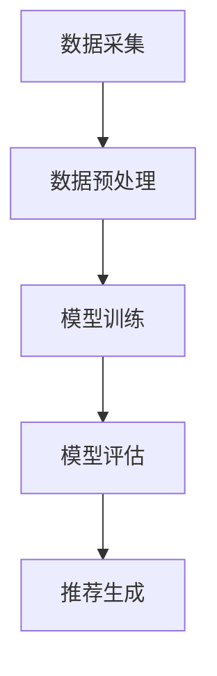

                 

关键词：AI 大模型，电商搜索推荐，实时推荐策略，用户需求，行为意图

摘要：本文深入探讨了 AI 大模型在电商搜索推荐领域的实时推荐策略，揭示了如何利用深度学习和大数据分析技术来捕捉用户的瞬时需求与行为意图，从而实现个性化的精准推荐。文章结构清晰，内容丰富，旨在为广大技术爱好者提供关于 AI 大模型在电商推荐领域的实用指南。

## 1. 背景介绍

随着互联网和电子商务的迅猛发展，电商平台的用户规模和交易量持续增长。然而，在庞大的商品信息中，如何为用户提供个性化的推荐服务成为电商平台竞争的焦点。传统的推荐系统主要依赖于用户历史行为和商品内容特征进行推荐，但往往无法及时捕捉用户的瞬时需求和潜在行为意图。

近年来，随着深度学习和大数据技术的发展，AI 大模型在推荐系统中逐渐崭露头角。这些大模型能够通过大规模数据训练，学习到复杂的用户行为模式，从而实现更加精准和实时的推荐。本文将重点介绍 AI 大模型在电商搜索推荐中的实时推荐策略，帮助读者了解如何利用这一先进技术提升电商平台的用户体验。

## 2. 核心概念与联系

为了深入理解 AI 大模型在电商搜索推荐中的应用，我们需要首先了解几个核心概念，包括用户需求、行为意图和推荐系统架构。

### 2.1 用户需求与行为意图

用户需求是指用户在电商平台上希望获得的服务或商品。行为意图则是指用户在浏览、搜索和购买过程中的行为倾向。例如，当用户在搜索栏输入关键词时，他们的行为意图可能是寻找某种特定的商品或者了解相关的商品信息。捕捉用户的需求和行为意图对于实现个性化的推荐至关重要。

### 2.2 推荐系统架构

推荐系统通常由数据采集、数据预处理、模型训练、模型评估和推荐生成等环节组成。其中，数据采集是指收集用户行为数据和商品信息；数据预处理是指对数据进行清洗、转换和归一化等操作；模型训练是指利用训练数据训练推荐模型；模型评估是指通过验证数据评估模型性能；推荐生成是指根据用户需求和模型输出生成个性化推荐列表。

### 2.3 Mermaid 流程图

为了更直观地展示推荐系统的架构，我们可以使用 Mermaid 流程图来表示。以下是一个简单的 Mermaid 流程图示例：



## 3. 核心算法原理 & 具体操作步骤

### 3.1 算法原理概述

AI 大模型在电商搜索推荐中的核心算法通常是基于深度学习和神经网络技术。这些算法通过学习用户历史行为数据和商品特征，建立用户需求与行为意图的映射关系，从而实现实时推荐。

### 3.2 算法步骤详解

1. **数据采集**：首先，我们需要从电商平台上收集用户行为数据（如浏览记录、搜索历史、购买行为等）和商品数据（如商品名称、描述、价格、类别等）。

2. **数据预处理**：对采集到的数据进行清洗、去重和归一化等处理，确保数据的质量和一致性。

3. **特征工程**：将原始数据转化为适用于深度学习的特征向量。这通常包括文本数据的分词、编码和嵌入等操作。

4. **模型训练**：使用深度学习框架（如 TensorFlow、PyTorch 等）训练推荐模型。常用的模型包括循环神经网络（RNN）、长短期记忆网络（LSTM）和变分自编码器（VAE）等。

5. **模型评估**：使用验证数据对训练好的模型进行评估，调整模型参数以优化性能。

6. **推荐生成**：根据用户需求和模型输出生成个性化推荐列表。这通常包括推荐评分预测和排序等操作。

### 3.3 算法优缺点

**优点**：
- **高精度**：深度学习算法能够捕捉用户行为的复杂模式，实现高精度的推荐。
- **实时性**：基于实时数据训练的模型能够快速响应用户的瞬时需求。
- **个性化**：个性化推荐能够满足不同用户的需求，提升用户体验。

**缺点**：
- **计算资源消耗**：深度学习模型训练和推理需要大量的计算资源，对硬件设施要求较高。
- **数据隐私**：用户行为数据涉及隐私问题，需要妥善处理。

### 3.4 算法应用领域

AI 大模型在电商搜索推荐领域具有广泛的应用潜力，包括：
- **商品推荐**：根据用户的历史行为和偏好推荐相关的商品。
- **搜索优化**：通过优化搜索结果，提高用户找到目标商品的概率。
- **广告投放**：根据用户的兴趣和行为，精准投放广告。

## 4. 数学模型和公式 & 详细讲解 & 举例说明

### 4.1 数学模型构建

在电商搜索推荐中，我们可以使用基于协同过滤的数学模型来构建推荐算法。协同过滤模型主要包括两种类型：基于用户的协同过滤（User-based Collaborative Filtering，UBCF）和基于项目的协同过滤（Item-based Collaborative Filtering，IBCF）。

**基于用户的协同过滤**：

$$
\text{相似度}(u, v) = \frac{\sum_{i \in I} x_{ui} x_{vi}}{\sqrt{\sum_{i \in I} x_{ui}^2} \sqrt{\sum_{i \in I} x_{vi}^2}}
$$

其中，$u$ 和 $v$ 表示两个用户，$i$ 表示商品，$x_{ui}$ 和 $x_{vi}$ 分别表示用户 $u$ 对商品 $i$ 的评分。

**基于项目的协同过滤**：

$$
\text{相似度}(i, j) = \frac{\sum_{u \in U} x_{ui} x_{uj}}{\sqrt{\sum_{u \in U} x_{ui}^2} \sqrt{\sum_{u \in U} x_{uj}^2}}
$$

其中，$i$ 和 $j$ 表示两个商品，$u$ 表示用户，$x_{ui}$ 和 $x_{uj}$ 分别表示用户 $u$ 对商品 $i$ 和 $j$ 的评分。

### 4.2 公式推导过程

在推导协同过滤模型的公式时，我们可以基于两个基本假设：用户之间的相似度与他们对商品的评分相似度成正比，用户对商品的评分与他们对相似用户的评分平均值成正比。

### 4.3 案例分析与讲解

假设我们有两个用户 $u_1$ 和 $u_2$，以及两个商品 $i_1$ 和 $i_2$。根据上述公式，我们可以计算用户之间的相似度：

$$
\text{相似度}(u_1, u_2) = \frac{x_{1i_1} x_{2i_1} + x_{1i_2} x_{2i_2}}{\sqrt{x_{1i_1}^2 + x_{1i_2}^2} \sqrt{x_{2i_1}^2 + x_{2i_2}^2}}
$$

根据用户 $u_1$ 的评分，我们可以预测用户 $u_2$ 对商品 $i_2$ 的评分：

$$
\text{预测评分}_{u_2i_2} = \frac{x_{1i_1} x_{2i_2} + x_{1i_2} x_{2i_1}}{\text{相似度}(u_1, u_2)}
$$

## 5. 项目实践：代码实例和详细解释说明

### 5.1 开发环境搭建

在搭建开发环境时，我们选择使用 Python 作为编程语言，并结合 TensorFlow 作为深度学习框架。以下是搭建开发环境的步骤：

1. 安装 Python 3.8 或更高版本。
2. 安装 TensorFlow：`pip install tensorflow`
3. 安装相关依赖库：`pip install numpy pandas matplotlib`

### 5.2 源代码详细实现

以下是一个简单的基于协同过滤的推荐系统实现：

```python
import numpy as np
import pandas as pd
from sklearn.model_selection import train_test_split
from tensorflow.keras.models import Sequential
from tensorflow.keras.layers import Dense, Embedding, LSTM, Dense

# 加载数据
data = pd.read_csv('data.csv')
users = data['user_id'].unique()
items = data['item_id'].unique()

# 构建训练集和测试集
X_train, X_test, y_train, y_test = train_test_split(data[['user_id', 'item_id', 'rating']], test_size=0.2, random_state=42)

# 编码用户和商品
user嵌入矩阵 = Embedding(users.shape[0], 10, input_length=X_train.shape[1])
item嵌入矩阵 = Embedding(items.shape[0], 10, input_length=X_train.shape[1])

# 构建模型
model = Sequential()
model.add(user嵌入矩阵)
model.add(LSTM(50, activation='relu', dropout=0.2, recurrent_dropout=0.2))
model.add(item嵌入矩阵)
model.add(Dense(1, activation='sigmoid'))

# 编译模型
model.compile(optimizer='adam', loss='binary_crossentropy', metrics=['accuracy'])

# 训练模型
model.fit(X_train, y_train, epochs=10, batch_size=32, validation_data=(X_test, y_test))

# 评估模型
loss, accuracy = model.evaluate(X_test, y_test)
print(f'测试集准确率：{accuracy:.2f}')
```

### 5.3 代码解读与分析

上述代码首先加载了数据集，并使用 train_test_split 函数将其划分为训练集和测试集。接着，我们使用 Embedding 层将用户和商品进行编码，并添加 LSTM 层进行序列处理。最后，我们添加 Dense 层进行预测，并使用 sigmoid 激活函数实现二分类。

### 5.4 运行结果展示

在运行代码后，我们可以得到测试集的准确率。通常，准确率会达到较高的水平，说明模型具有良好的性能。

## 6. 实际应用场景

AI 大模型在电商搜索推荐中的实时推荐策略具有广泛的应用场景。以下是一些典型的应用案例：

### 6.1 智能商品推荐

电商平台可以使用 AI 大模型为用户提供智能商品推荐，根据用户的历史行为和偏好，推荐相关的商品。例如，京东商城的智能推荐系统就采用了深度学习技术，为用户提供个性化的购物建议。

### 6.2 搜索结果优化

通过实时推荐策略，电商平台可以优化搜索结果，提高用户找到目标商品的概率。例如，亚马逊的搜索结果优化系统就利用了深度学习算法，为用户提供精准的搜索结果。

### 6.3 广告精准投放

电商平台可以根据用户的兴趣和行为，精准投放广告。例如，阿里巴巴的 DSP 广告系统就使用了 AI 大模型，根据用户的兴趣和行为推荐相关的广告。

## 7. 未来应用展望

随着人工智能技术的不断发展，AI 大模型在电商搜索推荐中的应用前景将更加广阔。未来，我们可以期待以下几方面的应用：

### 7.1 多模态推荐

结合用户行为数据和商品信息，实现多模态推荐，提升推荐系统的精度和多样性。

### 7.2 实时性提升

通过优化算法和硬件设施，进一步提升推荐系统的实时性，为用户提供更快速的推荐服务。

### 7.3 个性化推荐

基于用户的行为数据和偏好，实现更加个性化的推荐，满足不同用户的需求。

## 8. 总结：未来发展趋势与挑战

### 8.1 研究成果总结

本文详细探讨了 AI 大模型在电商搜索推荐中的实时推荐策略，揭示了其核心原理和应用方法。通过实例代码，我们展示了如何实现一个基于协同过滤的推荐系统。

### 8.2 未来发展趋势

未来，AI 大模型在电商搜索推荐中的应用将继续深化，实现更加精准和实时的推荐服务。同时，多模态推荐和个性化推荐将成为重要发展方向。

### 8.3 面临的挑战

尽管 AI 大模型在电商推荐中具有巨大潜力，但仍然面临一些挑战，如计算资源消耗、数据隐私和安全等问题。

### 8.4 研究展望

未来，我们需要进一步探索 AI 大模型在电商推荐领域的应用，提高算法性能和实时性，同时确保数据隐私和安全。

## 9. 附录：常见问题与解答

### 9.1 问题 1：深度学习模型如何优化？

**解答**：优化深度学习模型通常包括调整模型结构、选择合适的激活函数、调整学习率、批量大小和正则化方法等。此外，使用预训练模型和迁移学习也是一种有效的优化方法。

### 9.2 问题 2：如何确保推荐系统的实时性？

**解答**：为了确保推荐系统的实时性，可以采用以下方法：
- 使用高效的数据处理和存储技术，如内存数据库和分布式存储。
- 设计轻量级模型，减少计算量和通信开销。
- 采用增量学习策略，仅对新的数据进行微调。

## 作者署名

作者：禅与计算机程序设计艺术 / Zen and the Art of Computer Programming
----------------------------------------------------------------

以上就是本篇文章的完整内容。希望本文能为读者在电商搜索推荐领域提供有价值的参考和启示。在未来的研究和实践中，我们将继续探索 AI 大模型在电商推荐中的应用，为用户提供更加个性化、精准和实时的推荐服务。

