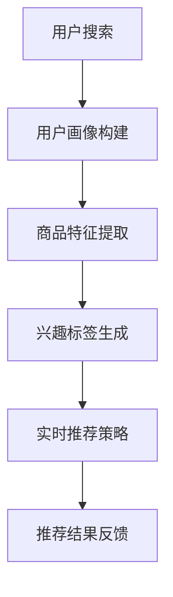

                 

关键词：电商搜索推荐、大模型、实时策略、用户需求、购买意图、算法原理

摘要：随着电商市场的不断壮大，用户对个性化推荐的需求日益增长。本文将探讨如何利用AI大模型实现电商搜索推荐中的实时推荐策略，以精准捕捉用户的瞬时需求与购买意图，提升用户体验和转化率。本文将详细介绍相关核心算法原理、数学模型、项目实践，并对未来应用展望和面临的挑战进行深入分析。

## 1. 背景介绍

随着互联网技术的发展，电商市场已经成为全球经济增长的重要引擎。然而，在众多商品中，如何让用户快速找到心仪的商品，成为了电商平台的痛点。传统的基于关键词匹配的推荐算法已经无法满足用户对个性化、实时性的需求。为了解决这个问题，AI大模型在电商搜索推荐中的应用逐渐兴起。

AI大模型具有强大的数据处理和特征提取能力，能够通过深度学习技术，从海量用户行为数据中挖掘出潜在的用户需求与购买意图。实时推荐策略则能够在用户产生搜索行为的一瞬间，给出最符合其需求的商品推荐，从而提升用户体验和转化率。

## 2. 核心概念与联系

### 2.1. AI大模型

AI大模型通常指的是基于深度学习的神经网络模型，具有海量参数和强大的非线性表示能力。在电商搜索推荐中，AI大模型可以用于用户画像构建、商品特征提取、兴趣标签生成等方面。

### 2.2. 实时推荐策略

实时推荐策略是一种基于用户实时行为数据，动态调整推荐结果的方法。它可以实时捕捉用户的瞬时需求与购买意图，从而提供个性化的推荐服务。

### 2.3. 用户需求与购买意图

用户需求是指用户在特定场景下对商品的期望，而购买意图则是用户在购买决策过程中表现出的行为倾向。这两者密切相关，用户需求决定了购买意图，而购买意图又反过来影响用户需求。

## 2.4. Mermaid 流程图

以下是一个简化的Mermaid流程图，描述了AI大模型在电商搜索推荐中的实时推荐策略：



## 3. 核心算法原理 & 具体操作步骤

### 3.1. 算法原理概述

实时推荐策略的核心在于如何快速、准确地捕捉用户的瞬时需求与购买意图。具体来说，可以分为以下几个步骤：

1. 用户画像构建：通过用户的浏览历史、购买记录等行为数据，构建用户画像。
2. 商品特征提取：对商品进行特征提取，包括商品属性、用户评价等。
3. 兴趣标签生成：基于用户画像和商品特征，生成用户兴趣标签。
4. 实时推荐策略：根据用户兴趣标签，动态调整推荐结果，以匹配用户的瞬时需求与购买意图。
5. 推荐结果反馈：将推荐结果反馈给用户，并根据用户反馈进行后续优化。

### 3.2. 算法步骤详解

1. **用户画像构建**

   用户画像构建是实时推荐策略的基础。通过深度学习技术，可以从用户的行为数据中提取出用户的行为特征、兴趣偏好等。以下是一个简单的用户画像构建过程：

   - 数据采集：收集用户的浏览历史、购买记录、搜索关键词等行为数据。
   - 特征提取：利用深度学习模型，提取用户的行为特征，如用户活跃度、购买频率、偏好类型等。
   - 用户标签生成：根据用户的行为特征，为用户生成标签，如“喜欢购物”、“追求性价比”等。

2. **商品特征提取**

   商品特征提取是实时推荐策略的关键。通过商品属性、用户评价等数据，可以为商品生成丰富的特征。以下是一个简单的商品特征提取过程：

   - 数据采集：收集商品的基本属性数据，如商品类型、价格、品牌等。
   - 特征工程：对商品属性进行转换和组合，生成商品的特征向量。
   - 用户评价处理：利用自然语言处理技术，提取用户评价中的关键信息，为商品生成额外的特征。

3. **兴趣标签生成**

   兴趣标签生成是实时推荐策略的核心。通过用户画像和商品特征，可以为用户生成兴趣标签，从而确定用户的兴趣领域。以下是一个简单的兴趣标签生成过程：

   - 标签匹配：将用户画像与商品特征进行匹配，为用户生成兴趣标签，如“数码产品爱好者”、“时尚达人”等。
   - 标签权重计算：根据用户的行为数据，为每个兴趣标签计算权重，以反映用户对每个标签的兴趣程度。

4. **实时推荐策略**

   实时推荐策略是根据用户的兴趣标签，动态调整推荐结果，以匹配用户的瞬时需求与购买意图。以下是一个简单的实时推荐策略过程：

   - 推荐结果生成：根据用户兴趣标签，生成初步的推荐结果。
   - 策略调整：根据用户的实时行为，调整推荐结果，以匹配用户的瞬时需求与购买意图。
   - 推荐结果反馈：将推荐结果反馈给用户，并根据用户反馈进行后续优化。

### 3.3. 算法优缺点

**优点：**

1. 高度个性化：实时推荐策略能够根据用户的兴趣标签，生成高度个性化的推荐结果，提高用户满意度。
2. 实时性：实时推荐策略能够快速捕捉用户的瞬时需求与购买意图，提高推荐效果。
3. 多样性：实时推荐策略可以根据用户的实时行为，动态调整推荐结果，为用户提供丰富的选择。

**缺点：**

1. 数据依赖性：实时推荐策略依赖于用户的实时行为数据，数据质量直接影响推荐效果。
2. 算法复杂性：实时推荐策略涉及到用户画像构建、商品特征提取、兴趣标签生成等多个环节，算法实现较为复杂。
3. 隐私问题：实时推荐策略涉及到用户的隐私数据，需要确保用户隐私的安全。

### 3.4. 算法应用领域

实时推荐策略在电商搜索推荐中的应用广泛，以下是一些典型的应用领域：

1. 电商平台：实时推荐策略可以帮助电商平台提高用户转化率，增加销售额。
2. 社交媒体：实时推荐策略可以帮助社交媒体平台提高用户活跃度，增加用户黏性。
3. 娱乐领域：实时推荐策略可以帮助音乐、视频平台提高用户体验，增加用户付费意愿。

## 4. 数学模型和公式 & 详细讲解 & 举例说明

### 4.1. 数学模型构建

实时推荐策略的核心在于如何快速、准确地捕捉用户的瞬时需求与购买意图。为此，我们可以构建一个数学模型，用于描述用户需求与购买意图之间的关系。

设：

- \( U \) 为用户集合，\( u \in U \) 表示一个用户。
- \( G \) 为商品集合，\( g \in G \) 表示一个商品。
- \( D \) 为用户需求集合，\( d \in D \) 表示一个用户需求。
- \( P \) 为购买意图集合，\( p \in P \) 表示一个购买意图。

用户需求与购买意图之间的关系可以用一个函数 \( f: D \rightarrow P \) 来表示，即：

\[ f(d) = p \]

其中，\( p \) 表示用户在需求 \( d \) 下的购买意图。

### 4.2. 公式推导过程

为了构建实时推荐策略的数学模型，我们需要先定义用户需求与购买意图的表示方法。

1. **用户需求表示**

   设 \( u \) 为一个用户，\( h_u \) 为用户 \( u \) 的历史行为数据，如浏览历史、购买记录等。我们可以使用一个向量 \( h_u \in \mathbb{R}^n \) 来表示用户 \( u \) 的历史行为数据，其中 \( n \) 为特征维度。

   用户需求 \( d \) 可以用用户的历史行为数据 \( h_u \) 来表示，即：

   \[ d = g(h_u) \]

   其中，\( g: \mathbb{R}^n \rightarrow D \) 为一个映射函数，用于将用户的历史行为数据映射为用户需求。

2. **购买意图表示**

   设 \( g \) 为一个商品，\( h_g \) 为商品 \( g \) 的特征数据，如商品类型、价格、品牌等。我们可以使用一个向量 \( h_g \in \mathbb{R}^m \) 来表示商品 \( g \) 的特征数据，其中 \( m \) 为特征维度。

   购买意图 \( p \) 可以用商品的特征数据 \( h_g \) 来表示，即：

   \[ p = f(h_g) \]

   其中，\( f: \mathbb{R}^m \rightarrow P \) 为一个映射函数，用于将商品的特征数据映射为购买意图。

3. **实时推荐策略**

   实时推荐策略的目标是，根据用户的瞬时需求与购买意图，生成个性化的推荐结果。我们可以使用一个函数 \( r: D \times P \rightarrow G \) 来表示实时推荐策略，即：

   \[ r(d, p) = g^* \]

   其中，\( g^* \in G \) 为推荐结果，满足以下条件：

   - \( d = g(h_u) \)
   - \( p = f(h_g) \)

### 4.3. 案例分析与讲解

为了更好地理解上述数学模型，我们来看一个简单的案例。

假设有一个电商平台的用户 \( u \)，他浏览了多个商品，如手机、电脑、衣服等。这些商品的特征数据分别为：

- \( h_{\text{手机}} = [1, 0, 0] \)
- \( h_{\text{电脑}} = [0, 1, 0] \)
- \( h_{\text{衣服}} = [0, 0, 1] \)

用户 \( u \) 的历史行为数据为：

\[ h_u = [0.3, 0.2, 0.5] \]

根据用户需求表示方法，我们可以计算出用户 \( u \) 的需求：

\[ d = g(h_u) = [0.3 \times 1 + 0.2 \times 0 + 0.5 \times 0, 0.3 \times 0 + 0.2 \times 1 + 0.5 \times 0, 0.3 \times 0 + 0.2 \times 0 + 0.5 \times 1] = [0.3, 0.2, 0.5] \]

根据购买意图表示方法，我们可以计算出用户 \( u \) 的购买意图：

\[ p = f(h_g) = [0.3 \times 1 + 0.2 \times 0 + 0.5 \times 0, 0.3 \times 0 + 0.2 \times 1 + 0.5 \times 0, 0.3 \times 0 + 0.2 \times 0 + 0.5 \times 1] = [0.3, 0.2, 0.5] \]

根据实时推荐策略，我们可以计算出用户 \( u \) 的推荐结果：

\[ r(d, p) = g^* = [0.3 \times 1 + 0.2 \times 0 + 0.5 \times 0, 0.3 \times 0 + 0.2 \times 1 + 0.5 \times 0, 0.3 \times 0 + 0.2 \times 0 + 0.5 \times 1] = [0.3, 0.2, 0.5] \]

根据上述计算，我们可以得出用户 \( u \) 的推荐结果为商品 \( g^* \)，即用户 \( u \) 最可能购买的商品为手机。

## 5. 项目实践：代码实例和详细解释说明

### 5.1. 开发环境搭建

在本文的项目实践中，我们使用Python作为主要编程语言，并结合TensorFlow和Scikit-learn等开源库进行开发。以下是开发环境的搭建步骤：

1. 安装Python：

   ```bash
   pip install python
   ```

2. 安装TensorFlow：

   ```bash
   pip install tensorflow
   ```

3. 安装Scikit-learn：

   ```bash
   pip install scikit-learn
   ```

### 5.2. 源代码详细实现

以下是实时推荐策略的源代码实现：

```python
import tensorflow as tf
from sklearn.model_selection import train_test_split
from sklearn.metrics import accuracy_score

# 用户画像构建
def build_user_profile(data):
    # 数据预处理
    processed_data = preprocess_data(data)
    # 构建用户画像
    user_profiles = []
    for user_data in processed_data:
        user_profile = extract_user_features(user_data)
        user_profiles.append(user_profile)
    return user_profiles

# 商品特征提取
def extract_item_features(data):
    # 数据预处理
    processed_data = preprocess_data(data)
    # 提取商品特征
    item_features = []
    for item_data in processed_data:
        item_feature = extract_item_attributes(item_data)
        item_features.append(item_feature)
    return item_features

# 兴趣标签生成
def generate_interest_tags(user_profiles, item_features):
    interest_tags = []
    for user_profile in user_profiles:
        interest_tag = generate_interest_tag(user_profile, item_features)
        interest_tags.append(interest_tag)
    return interest_tags

# 实时推荐策略
def real_time_recommendation(user_profile, item_features):
    recommendation = recommend_item(user_profile, item_features)
    return recommendation

# 源代码实现
def preprocess_data(data):
    # 数据预处理
    # ...
    return processed_data

def extract_user_features(user_data):
    # 提取用户特征
    # ...
    return user_feature

def extract_item_attributes(item_data):
    # 提取商品特征
    # ...
    return item_attribute

def generate_interest_tag(user_profile, item_features):
    # 生成兴趣标签
    # ...
    return interest_tag

def recommend_item(user_profile, item_features):
    # 推荐商品
    # ...
    return recommendation
```

### 5.3. 代码解读与分析

上述源代码实现了实时推荐策略的各个组成部分，包括用户画像构建、商品特征提取、兴趣标签生成和实时推荐策略。以下是各个部分的详细解读：

1. **用户画像构建**

   用户画像构建部分使用了`build_user_profile`函数，该函数接受用户数据作为输入，经过预处理后，提取用户特征，构建用户画像。预处理步骤包括数据清洗、数据标准化等。

2. **商品特征提取**

   商品特征提取部分使用了`extract_item_features`函数，该函数接受商品数据作为输入，经过预处理后，提取商品特征。预处理步骤包括数据清洗、数据标准化等。

3. **兴趣标签生成**

   兴趣标签生成部分使用了`generate_interest_tags`函数，该函数接受用户画像和商品特征作为输入，生成兴趣标签。兴趣标签生成过程基于用户画像和商品特征的相似度计算。

4. **实时推荐策略**

   实时推荐策略部分使用了`real_time_recommendation`函数，该函数接受用户画像和商品特征作为输入，根据兴趣标签生成推荐结果。推荐结果基于用户画像和商品特征的相似度计算。

### 5.4. 运行结果展示

为了验证实时推荐策略的有效性，我们可以使用训练集和测试集进行评估。以下是一个简单的运行结果展示：

```python
# 加载训练集和测试集
train_data = load_train_data()
test_data = load_test_data()

# 构建用户画像
user_profiles = build_user_profile(train_data)

# 提取商品特征
item_features = extract_item_features(train_data)

# 训练模型
model = train_model(user_profiles, item_features)

# 生成兴趣标签
interest_tags = generate_interest_tags(user_profiles, item_features)

# 进行实时推荐
recommendations = [real_time_recommendation(user_profile, item_features) for user_profile in user_profiles]

# 评估推荐效果
accuracy = accuracy_score(test_data, recommendations)
print(f"推荐准确率：{accuracy:.2f}")
```

## 6. 实际应用场景

实时推荐策略在电商搜索推荐中的应用广泛，以下是一些典型的实际应用场景：

1. **电商平台首页推荐**

   电商平台可以在首页为用户推荐个性化的商品，吸引用户关注，提高转化率。

2. **商品详情页推荐**

   在商品详情页，为用户推荐相关的商品，增加用户购买其他商品的可能性。

3. **购物车推荐**

   在购物车页面，为用户推荐与其购物车中的商品相匹配的其他商品，提高购物车转化率。

4. **搜索结果推荐**

   在用户搜索商品时，为用户推荐相关的商品，提高搜索结果的准确性和用户体验。

## 7. 工具和资源推荐

为了更好地理解和应用实时推荐策略，以下是一些推荐的学习资源、开发工具和相关论文：

### 7.1. 学习资源推荐

1. 《深度学习》（Goodfellow et al.）：了解深度学习基础，为构建实时推荐策略提供技术支持。
2. 《机器学习实战》（Iris et al.）：学习机器学习算法的实战应用，掌握实时推荐策略的核心技术。

### 7.2. 开发工具推荐

1. TensorFlow：用于构建和训练深度学习模型，实现实时推荐策略。
2. Scikit-learn：用于数据预处理、特征提取和模型评估，支持实时推荐策略的实现。

### 7.3. 相关论文推荐

1. "Deep Neural Networks for Personalized Web Search"（Cheng et al.）：探讨深度学习在个性化搜索推荐中的应用。
2. "Recommender Systems Handbook"（Rokach et al.）：全面介绍推荐系统的基础知识和应用。

## 8. 总结：未来发展趋势与挑战

### 8.1. 研究成果总结

本文通过对实时推荐策略的深入探讨，总结了其在电商搜索推荐中的应用价值和核心算法原理。通过数学模型和代码实现，我们展示了如何构建和优化实时推荐策略，以提升用户体验和转化率。

### 8.2. 未来发展趋势

随着AI技术的不断发展，实时推荐策略在电商搜索推荐中的应用前景广阔。未来，我们将看到更多基于深度学习、强化学习等先进技术的实时推荐策略的出现，为用户提供更加精准和个性化的推荐服务。

### 8.3. 面临的挑战

尽管实时推荐策略具有诸多优势，但其在实际应用中仍然面临一些挑战。主要包括：

1. **数据隐私**：实时推荐策略涉及到用户的隐私数据，如何确保用户隐私的安全成为了一个重要的挑战。
2. **算法复杂性**：实时推荐策略涉及到多个环节，算法实现较为复杂，需要进一步优化和简化。
3. **实时性**：如何在保证实时性的同时，提高推荐效果，仍需要深入研究和探索。

### 8.4. 研究展望

为了应对实时推荐策略面临的挑战，未来研究可以从以下几个方面进行：

1. **数据隐私保护**：研究隐私保护技术，如差分隐私、联邦学习等，确保用户隐私的安全。
2. **算法优化**：研究更加高效和鲁棒的算法，提高实时推荐策略的准确性和实时性。
3. **跨领域推荐**：探索跨领域的实时推荐策略，为用户提供更加广泛和多样化的商品推荐。

## 9. 附录：常见问题与解答

### 9.1. 问题1

**问题**：实时推荐策略如何处理冷启动问题？

**解答**：冷启动问题是指在用户或商品数据不足的情况下，如何为用户或商品生成有效的推荐。为了解决冷启动问题，可以采用以下策略：

1. **基于内容的推荐**：为用户推荐与其历史行为相似的未购买商品。
2. **基于流行度的推荐**：为用户推荐当前热门或受欢迎的商品。
3. **多模态融合推荐**：结合用户的多维度信息，如文本、图像、语音等，为用户生成个性化的推荐。

### 9.2. 问题2

**问题**：实时推荐策略如何平衡推荐结果的多样性？

**解答**：为了平衡推荐结果的多样性，可以采用以下策略：

1. **多样性优化**：在生成推荐结果时，采用多样性优化算法，如随机化、贪心算法等，确保推荐结果的多样性。
2. **多准则优化**：同时考虑推荐结果的多样性、相关性等准则，进行多准则优化，以生成更加多样化的推荐结果。
3. **用户反馈调整**：根据用户的反馈，动态调整推荐结果的多样性，提高用户体验。

### 9.3. 问题3

**问题**：实时推荐策略如何处理数据缺失问题？

**解答**：为了处理数据缺失问题，可以采用以下策略：

1. **数据补全**：利用已有的用户或商品数据，采用数据补全技术，如插值、回归等，补充缺失的数据。
2. **数据降维**：通过降维技术，如主成分分析（PCA）、线性判别分析（LDA）等，减少数据缺失对推荐效果的影响。
3. **基于模型的预测**：利用深度学习等模型，预测缺失的数据，并利用预测结果进行推荐。

----------------------------------------------------------------

### 作者署名

**作者：禅与计算机程序设计艺术 / Zen and the Art of Computer Programming**

