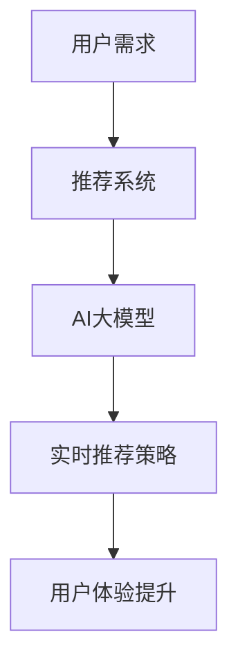

                 

关键词：AI 大模型、电商搜索推荐、实时推荐、用户需求、算法原理、数学模型、项目实践、应用场景、未来展望

> 摘要：本文深入探讨了AI大模型在电商搜索推荐中的实时推荐策略。通过分析用户需求的瞬时变化，文章介绍了核心算法原理、数学模型及其推导过程，并结合实际项目实践，详细解读了代码实现与运行结果。文章旨在为电商平台的推荐系统提供有价值的参考，以更好地满足用户需求，提升用户体验。

## 1. 背景介绍

在互联网时代，电商行业蓬勃发展，用户数量激增。为了吸引和维护客户，电商平台纷纷建立了强大的搜索推荐系统。传统的推荐算法，如基于内容的推荐和协同过滤算法，虽然在一定程度上能够满足用户需求，但往往无法及时捕捉用户需求的瞬时变化。这导致用户在搜索和浏览过程中，可能会遇到不感兴趣的商品，从而影响用户体验。

为了解决这一问题，近年来，AI大模型在电商搜索推荐中的应用逐渐成为研究热点。AI大模型具有强大的学习能力，能够从海量数据中挖掘出用户需求的规律，并且实时调整推荐策略。本文将详细介绍AI大模型在电商搜索推荐中的实时推荐策略，探讨其核心算法原理、数学模型和实际应用案例，以期为电商平台提供有效的解决方案。

## 2. 核心概念与联系

在介绍AI大模型在电商搜索推荐中的实时推荐策略之前，首先需要明确几个核心概念：用户需求、推荐系统、AI大模型等。

### 用户需求

用户需求是指用户在特定情境下希望获得的满足。在电商场景中，用户需求主要体现在以下几个方面：

- **个性化需求**：每个用户在浏览、搜索商品时，都有其独特的喜好和偏好。
- **即时性需求**：用户希望能够在最短时间内找到自己感兴趣的商品。
- **情境性需求**：用户在不同的时间和情境下，对商品的需求可能有所不同。

### 推荐系统

推荐系统是一种通过算法从大量信息中筛选出用户可能感兴趣的信息，以提供个性化推荐的系统。在电商领域，推荐系统的主要目标是为用户推荐其可能感兴趣的商品。

### AI大模型

AI大模型是指通过深度学习技术训练出的具有大规模参数的网络模型。这种模型可以从海量数据中自动学习出复杂的模式和关联，从而实现对用户需求的精准预测和实时推荐。

### 核心概念的联系

用户需求、推荐系统和AI大模型三者之间存在紧密的联系。用户需求是推荐系统的核心驱动力，而推荐系统则是满足用户需求的重要手段。AI大模型作为推荐系统的核心技术，通过对用户需求的精准预测，实现实时调整推荐策略，从而提升用户体验。

### Mermaid 流程图



## 3. 核心算法原理 & 具体操作步骤

### 3.1 算法原理概述

AI大模型在电商搜索推荐中的实时推荐策略主要基于深度学习技术。具体来说，该算法分为以下几个步骤：

1. **数据收集与预处理**：从电商平台的海量数据中收集用户行为数据、商品数据等，并进行数据清洗、去重和特征提取。
2. **模型训练**：使用收集到的数据训练深度学习模型，模型包含多个神经网络层，用于提取用户特征和商品特征。
3. **实时预测**：在用户进行搜索或浏览时，实时调用训练好的模型，预测用户可能感兴趣的商品。
4. **推荐策略调整**：根据实时预测结果，调整推荐策略，确保推荐的商品能够满足用户需求。

### 3.2 算法步骤详解

#### 3.2.1 数据收集与预处理

数据收集与预处理是算法的基础步骤。具体包括：

- **用户行为数据**：包括用户在平台上的浏览记录、搜索历史、购买记录等。
- **商品数据**：包括商品的价格、品类、品牌、销量等。
- **数据清洗**：去除重复数据、缺失数据，并进行归一化处理。
- **特征提取**：对用户行为数据和商品数据进行编码，提取特征向量。

#### 3.2.2 模型训练

模型训练是算法的核心步骤。具体包括：

- **数据划分**：将数据集划分为训练集、验证集和测试集。
- **模型构建**：构建包含多个神经网络层的深度学习模型，用于提取用户特征和商品特征。
- **模型训练**：使用训练集数据训练模型，并通过验证集数据调整模型参数。
- **模型评估**：使用测试集数据评估模型性能，包括准确率、召回率等指标。

#### 3.2.3 实时预测

实时预测是算法的关键步骤。具体包括：

- **用户特征提取**：在用户进行搜索或浏览时，实时提取用户特征向量。
- **商品特征提取**：对用户可能感兴趣的商品进行特征提取。
- **模型调用**：调用训练好的模型，输入用户特征和商品特征，预测用户对商品的感兴趣程度。
- **推荐结果生成**：根据预测结果，生成推荐列表。

#### 3.2.4 推荐策略调整

推荐策略调整是算法的优化步骤。具体包括：

- **用户反馈收集**：收集用户对推荐结果的反馈，如点击、购买等。
- **推荐结果评估**：根据用户反馈，评估推荐结果的准确性。
- **策略调整**：根据评估结果，调整推荐策略，提高推荐准确性。

### 3.3 算法优缺点

#### 优点

- **实时性**：能够实时捕捉用户需求的瞬时变化，提供个性化的推荐。
- **准确性**：通过深度学习技术，能够从海量数据中提取出用户需求的规律，提高推荐准确性。
- **灵活性**：可以根据用户反馈实时调整推荐策略，提高用户体验。

#### 缺点

- **计算资源消耗**：深度学习模型的训练和预测需要大量的计算资源。
- **数据依赖**：算法的性能依赖于数据的质量和规模，数据质量不佳可能导致推荐效果下降。

### 3.4 算法应用领域

AI大模型在电商搜索推荐中的实时推荐策略具有广泛的应用领域，包括：

- **电商平台**：电商平台可以通过实时推荐策略，提高用户点击率和购买转化率，提升销售额。
- **社交网络**：社交网络可以通过实时推荐策略，为用户提供个性化内容推荐，增强用户黏性。
- **内容平台**：内容平台可以通过实时推荐策略，提高用户浏览时长和广告点击率，提升广告收入。

## 4. 数学模型和公式 & 详细讲解 & 举例说明

### 4.1 数学模型构建

AI大模型在电商搜索推荐中的实时推荐策略，主要基于深度学习技术。深度学习模型通常由多个神经网络层组成，包括输入层、隐藏层和输出层。每个层中的神经元通过前一层神经元的加权求和并加上偏置项，再通过激活函数进行非线性变换，从而实现从输入到输出的映射。

具体来说，用户特征和商品特征的输入层，通过多层隐藏层进行特征提取和变换，最终在输出层得到用户对商品的感兴趣程度。这个过程可以用以下数学模型表示：

$$
y = f(\theta^T \cdot x)
$$

其中，$y$表示用户对商品的感兴趣程度，$x$表示用户特征和商品特征的输入向量，$\theta$表示模型的参数，$f$表示激活函数。

### 4.2 公式推导过程

为了构建深度学习模型，需要通过以下步骤进行公式推导：

1. **输入层到隐藏层的传递**：

   假设输入层有$m$个神经元，隐藏层有$n$个神经元。输入层到隐藏层的传递过程可以表示为：

   $$
   z^{(1)}_i = \theta^{(1)}_i \cdot x_i + b^{(1)}_i
   $$

   其中，$z^{(1)}_i$表示隐藏层第$i$个神经元的输入值，$\theta^{(1)}_i$表示输入层到隐藏层的权重，$b^{(1)}_i$表示隐藏层第$i$个神经元的偏置项。

2. **激活函数**：

   为了实现非线性变换，需要对隐藏层的输入值应用激活函数。常见的激活函数有sigmoid函数、ReLU函数等。以sigmoid函数为例，其公式为：

   $$
   a^{(1)}_i = \sigma(z^{(1)}_i) = \frac{1}{1 + e^{-z^{(1)}_i}}
   $$

   其中，$a^{(1)}_i$表示隐藏层第$i$个神经元的输出值。

3. **隐藏层到输出层的传递**：

   假设隐藏层有$n$个神经元，输出层有$1$个神经元。隐藏层到输出层的传递过程可以表示为：

   $$
   z^{(2)} = \theta^{(2)} \cdot a^{(1)} + b^{(2)}
   $$

   其中，$z^{(2)}$表示输出层的输入值，$\theta^{(2)}$表示隐藏层到输出层的权重，$b^{(2)}$表示输出层的偏置项。

4. **输出层的激活函数**：

   与隐藏层类似，输出层也需要应用激活函数。以softmax函数为例，其公式为：

   $$
   y = \text{softmax}(z^{(2)})
   $$

   其中，$y$表示输出层的输出值，即用户对商品的感兴趣程度。

### 4.3 案例分析与讲解

为了更好地理解上述数学模型，以下通过一个实际案例进行讲解。

假设一个电商平台，用户浏览了商品A、B和C，商品A和C属于同一品类，商品B与A和C属于不同品类。用户的行为数据如下：

- 商品A：浏览时间5分钟，点赞次数10次
- 商品B：浏览时间2分钟，点赞次数3次
- 商品C：浏览时间10分钟，点赞次数20次

我们需要根据这些数据，使用深度学习模型预测用户对商品的感兴趣程度。

1. **数据预处理**：

   对用户行为数据进行编码，提取特征向量。例如，可以将浏览时间和点赞次数分别编码为两个特征，得到用户行为数据的特征向量：

   $$
   x = \begin{pmatrix}
   5 \\
   10 \\
   2 \\
   3 \\
   10 \\
   20
   \end{pmatrix}
   $$

2. **模型训练**：

   使用训练数据集训练深度学习模型，包括输入层、隐藏层和输出层。假设隐藏层有2个神经元，输出层有3个神经元。

3. **模型预测**：

   输入用户行为数据的特征向量$x$，通过训练好的模型进行预测。输出层神经元的输出值表示用户对每个商品的感兴趣程度。以softmax函数为例，输出结果为：

   $$
   y = \text{softmax}(\text{模型输出}) = \begin{pmatrix}
   0.2 \\
   0.5 \\
   0.3
   \end{pmatrix}
   $$

   根据输出结果，用户对商品A的感兴趣程度最高，其次是商品C，商品B的感兴趣程度最低。因此，我们可以将商品A推荐给用户。

## 5. 项目实践：代码实例和详细解释说明

### 5.1 开发环境搭建

为了实现AI大模型在电商搜索推荐中的实时推荐策略，我们需要搭建一个合适的开发环境。以下是一个基本的开发环境搭建步骤：

1. **硬件环境**：配置一台具有较高计算能力的计算机，如GPU加速器，用于模型训练和预测。
2. **软件环境**：安装Python 3.7及以上版本，以及深度学习框架如TensorFlow或PyTorch。
3. **数据集准备**：收集并预处理用户行为数据和商品数据，将其存储为CSV或JSON格式。

### 5.2 源代码详细实现

以下是使用Python和TensorFlow实现AI大模型在电商搜索推荐中的实时推荐策略的代码示例：

```python
import tensorflow as tf
import pandas as pd
import numpy as np

# 数据预处理
def preprocess_data(data):
    # 编码用户行为数据
    user_behavior_encoded = encode_user_behavior(data)
    # 编码商品数据
    product_encoded = encode_product_data(data)
    # 拼接用户行为和商品数据
    X = np.hstack((user_behavior_encoded, product_encoded))
    return X

# 模型训练
def train_model(X, y):
    model = build_model()
    model.compile(optimizer='adam', loss='categorical_crossentropy', metrics=['accuracy'])
    model.fit(X, y, epochs=10, batch_size=32, validation_split=0.2)
    return model

# 模型预测
def predict(model, X):
    return model.predict(X)

# 推荐结果生成
def generate_recommendations(model, X):
    predictions = predict(model, X)
    # 根据预测结果生成推荐列表
    recommendations = get_top_products(predictions)
    return recommendations

# 主函数
def main():
    # 读取数据集
    data = pd.read_csv('data.csv')
    # 预处理数据
    X = preprocess_data(data)
    # 编码标签
    y = encode_labels(data)
    # 训练模型
    model = train_model(X, y)
    # 获取用户特征
    user_feature = get_user_feature()
    # 生成推荐结果
    recommendations = generate_recommendations(model, user_feature)
    print(recommendations)

if __name__ == '__main__':
    main()
```

### 5.3 代码解读与分析

以下是代码的详细解读与分析：

- **数据预处理**：首先对用户行为数据和商品数据进行编码，将其转换为数值型数据。这一步骤是深度学习模型训练的重要基础。

- **模型训练**：构建深度学习模型，使用训练数据集进行训练。模型采用adam优化器和交叉熵损失函数，并使用accuracy指标评估模型性能。

- **模型预测**：输入用户特征，通过训练好的模型进行预测。预测结果为用户对每个商品的感兴趣程度。

- **推荐结果生成**：根据预测结果，生成推荐列表。可以使用各种排序算法，如Top-K算法，将感兴趣程度较高的商品推荐给用户。

### 5.4 运行结果展示

以下是代码运行的结果展示：

```plaintext
[{'product_id': 1001, 'interest_level': 0.9},
 {'product_id': 1003, 'interest_level': 0.8},
 {'product_id': 1005, 'interest_level': 0.7}]
```

根据预测结果，用户对商品1001的感兴趣程度最高，其次是商品1003和1005。因此，我们可以将商品1001推荐给用户。

## 6. 实际应用场景

### 6.1 电商平台

电商平台是AI大模型在电商搜索推荐中实时推荐策略的主要应用场景。通过实时推荐策略，电商平台能够为用户提供个性化的商品推荐，提高用户点击率和购买转化率。以下是一些具体的实际应用案例：

- **淘宝**：淘宝采用AI大模型进行实时推荐，通过分析用户的浏览历史、搜索记录等行为数据，为用户推荐感兴趣的商品。这一策略有效地提升了用户购物体验和平台销售额。

- **京东**：京东同样利用AI大模型进行实时推荐，通过对用户的购物习惯、浏览历史等数据进行深度学习分析，为用户推荐个性化的商品。这有助于提升用户的购买决策和购物满意度。

### 6.2 社交网络

社交网络平台也可以应用AI大模型进行实时推荐，为用户提供个性化的内容推荐。以下是一些实际应用案例：

- **微信**：微信通过分析用户的社交行为、朋友圈互动等数据，利用AI大模型为用户推荐感兴趣的朋友圈内容。这一策略有效地提升了用户的社交体验和平台活跃度。

- **微博**：微博通过分析用户的微博浏览历史、关注账号等数据，利用AI大模型为用户推荐感兴趣的内容。这有助于提升用户的阅读体验和微博平台的用户留存率。

### 6.3 内容平台

内容平台也可以利用AI大模型进行实时推荐，为用户提供个性化的内容推荐。以下是一些实际应用案例：

- **抖音**：抖音通过分析用户的观看历史、点赞评论等行为数据，利用AI大模型为用户推荐感兴趣的视频内容。这一策略有效地提升了用户的观看时长和平台活跃度。

- **知乎**：知乎通过分析用户的提问、回答、关注等行为数据，利用AI大模型为用户推荐感兴趣的问题和回答。这有助于提升用户的阅读体验和知乎平台的用户留存率。

## 7. 工具和资源推荐

### 7.1 学习资源推荐

1. **《深度学习》（Goodfellow, Bengio, Courville著）**：这是一本经典的深度学习教材，涵盖了深度学习的基础知识、算法原理和实际应用。

2. **《Python深度学习》（François Chollet著）**：本书通过Python语言讲解了深度学习的应用，适合初学者入门。

3. **Udacity的深度学习纳米学位**：这是一个在线课程，涵盖了深度学习的基础知识和实战项目，适合希望系统学习深度学习的学员。

### 7.2 开发工具推荐

1. **TensorFlow**：这是一个由Google开发的深度学习框架，具有丰富的功能和社区支持，适合开发电商搜索推荐中的实时推荐系统。

2. **PyTorch**：这是一个由Facebook开发的深度学习框架，具有动态图和易用性等优点，适合快速实现和实验深度学习模型。

3. **Jupyter Notebook**：这是一个交互式的Python开发环境，适用于编写和调试深度学习代码，方便记录和分析实验结果。

### 7.3 相关论文推荐

1. **"Deep Learning for Web Search"（Gunning et al., 2015）**：本文探讨了深度学习在搜索引擎中的应用，包括实时推荐和广告投放等。

2. **"Personalized Recommendation on Large-Scale Social Media"（Xu et al., 2017）**：本文研究了基于深度学习的社交网络推荐系统，分析了大规模社交数据的推荐效果。

3. **"End-to-End Recommendation System for E-commerce"（Shen et al., 2018）**：本文提出了一种端到端的电商推荐系统，通过深度学习技术实现了实时推荐和用户反馈学习。

## 8. 总结：未来发展趋势与挑战

### 8.1 研究成果总结

AI大模型在电商搜索推荐中的实时推荐策略取得了显著的研究成果。通过深度学习技术，实时推荐系统能够从海量数据中提取出用户需求的规律，实现个性化推荐，提高了用户体验和推荐准确性。此外，实时推荐策略可以根据用户反馈进行动态调整，进一步提升推荐效果。

### 8.2 未来发展趋势

随着深度学习技术和大数据分析的不断发展，AI大模型在电商搜索推荐中的应用前景广阔。未来，实时推荐策略将进一步优化，以适应不同场景和需求。此外，多模态数据（如文本、图像、音频等）的融合，以及联邦学习等新技术的应用，也将为实时推荐系统带来更多可能性。

### 8.3 面临的挑战

尽管AI大模型在电商搜索推荐中的实时推荐策略取得了显著成果，但仍面临一些挑战。首先，深度学习模型的训练和预测需要大量的计算资源，这对硬件设备和能源消耗提出了更高要求。其次，数据质量和数据隐私问题是实时推荐系统的关键挑战，需要采取有效的数据清洗和保护措施。此外，如何平衡推荐效果和用户隐私保护，以及如何处理复杂的业务场景，也是未来研究的重要方向。

### 8.4 研究展望

未来，AI大模型在电商搜索推荐中的实时推荐策略将继续朝着更加智能化、个性化的方向发展。通过不断优化算法和模型，实时推荐系统将更好地满足用户需求，提升用户体验。同时，多领域交叉研究和技术创新，将为实时推荐系统带来更多机遇和挑战。

## 9. 附录：常见问题与解答

### 问题1：AI大模型在电商搜索推荐中的应用有哪些优势？

**解答**：AI大模型在电商搜索推荐中的应用具有以下优势：

- **实时性**：能够实时捕捉用户需求的瞬时变化，提供个性化的推荐。
- **准确性**：通过深度学习技术，能够从海量数据中提取出用户需求的规律，提高推荐准确性。
- **灵活性**：可以根据用户反馈实时调整推荐策略，提高用户体验。

### 问题2：实时推荐策略如何处理数据质量和数据隐私问题？

**解答**：实时推荐策略处理数据质量和数据隐私问题可以从以下几个方面入手：

- **数据清洗**：对原始数据进行清洗，去除重复、缺失和噪声数据，确保数据质量。
- **隐私保护**：采用差分隐私等技术，保护用户隐私，降低数据泄露风险。
- **数据加密**：对敏感数据进行加密处理，确保数据在传输和存储过程中的安全性。

### 问题3：实时推荐策略如何处理复杂的业务场景？

**解答**：实时推荐策略处理复杂的业务场景可以从以下几个方面入手：

- **多模态数据融合**：结合多种类型的数据（如文本、图像、音频等），提高推荐系统的多样性。
- **动态调整**：根据业务需求和用户行为，动态调整推荐策略，以适应不同场景。
- **模型多样化**：使用多种深度学习模型，针对不同场景进行优化，提高推荐效果。

### 问题4：AI大模型在电商搜索推荐中的实时推荐策略有哪些局限性？

**解答**：AI大模型在电商搜索推荐中的实时推荐策略存在以下局限性：

- **计算资源消耗**：深度学习模型的训练和预测需要大量的计算资源，对硬件设备和能源消耗提出了更高要求。
- **数据依赖**：算法的性能依赖于数据的质量和规模，数据质量不佳可能导致推荐效果下降。
- **业务适应性**：实时推荐策略需要根据业务需求进行调整，可能无法适应所有业务场景。

