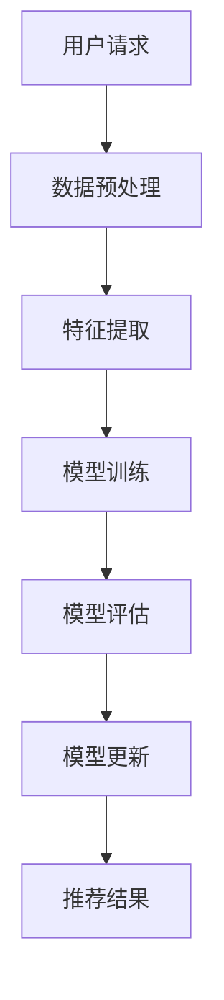

                 

关键词：电商搜索推荐、实时更新、AI 大模型、系统鲜活度

> 摘要：本文将探讨 AI 大模型在电商搜索推荐中的实时更新策略，分析当前系统中存在的问题，并提出一种有效的解决方案，以保持系统鲜活度，提升用户体验。

## 1. 背景介绍

在互联网时代，电商已成为人们日常生活的重要部分。为了提高用户满意度，电商平台纷纷引入 AI 大模型进行搜索推荐，通过分析用户行为和偏好，为用户提供个性化的商品推荐。然而，随着用户数据的不断增长和变化，传统的推荐算法在实时性方面面临巨大挑战，难以满足用户的需求。本文旨在探讨 AI 大模型在电商搜索推荐中的实时更新策略，以提升系统的鲜活度和用户体验。

## 2. 核心概念与联系

### 2.1. AI 大模型

AI 大模型是一种基于深度学习的复杂算法，通过对大量数据进行训练，可以自动提取特征并生成模型。在电商搜索推荐中，AI 大模型可用于分析用户行为和偏好，从而为用户提供个性化的商品推荐。

### 2.2. 实时更新

实时更新是指系统在接收到新的数据或请求时，能够快速响应并进行更新，以保持系统数据的最新性和准确性。在电商搜索推荐中，实时更新至关重要，因为它可以确保用户始终看到最相关的商品。

### 2.3. 系统鲜活度

系统鲜活度是指系统在处理用户请求时，能够快速、准确地响应，并提供有价值的信息。在电商搜索推荐中，系统鲜活度对用户体验至关重要，它直接影响用户的满意度和留存率。

### 2.4. Mermaid 流程图

以下是一个简化的 Mermaid 流程图，展示了 AI 大模型在电商搜索推荐中的实时更新策略。



## 3. 核心算法原理 & 具体操作步骤

### 3.1. 算法原理概述

AI 大模型在电商搜索推荐中的实时更新策略主要基于以下几个步骤：

1. 数据预处理：对用户请求进行预处理，包括数据清洗、去重和格式转换等。
2. 特征提取：从预处理后的数据中提取用户行为和偏好特征。
3. 模型训练：利用提取到的特征，训练 AI 大模型，生成推荐模型。
4. 模型评估：评估训练出的推荐模型的性能，包括准确率、召回率和覆盖度等。
5. 模型更新：根据模型评估结果，对推荐模型进行更新，以提高推荐质量。
6. 推荐结果：将更新后的模型应用于用户请求，生成推荐结果。

### 3.2. 算法步骤详解

1. **数据预处理**：数据预处理是整个算法的基础，它决定了后续特征提取和模型训练的质量。数据预处理步骤包括：

   - 数据清洗：去除无效数据、重复数据和异常值。
   - 数据去重：去除重复的用户请求和数据条目。
   - 数据格式转换：将数据转换为统一的格式，以便后续处理。

2. **特征提取**：特征提取是关键步骤，它决定了模型训练的效果。特征提取步骤包括：

   - 用户行为特征：根据用户历史行为数据，提取用户兴趣、购买倾向等特征。
   - 商品属性特征：根据商品属性数据，提取商品价格、品牌、品类等特征。
   - 时间特征：根据用户请求的时间信息，提取用户在一天中的活跃时段等特征。

3. **模型训练**：模型训练是核心步骤，它决定了推荐模型的性能。模型训练步骤包括：

   - 选择合适的模型架构：如神经网络、决策树、支持向量机等。
   - 设置合适的参数：如学习率、批量大小、迭代次数等。
   - 训练模型：使用预处理后的数据，训练 AI 大模型。

4. **模型评估**：模型评估是确保推荐模型性能的重要步骤。模型评估步骤包括：

   - 选择合适的评估指标：如准确率、召回率、覆盖度等。
   - 进行模型评估：使用测试数据集，评估训练出的推荐模型的性能。

5. **模型更新**：模型更新是提高推荐质量的关键步骤。模型更新步骤包括：

   - 根据评估结果，调整模型参数。
   - 重新训练模型，生成更新后的推荐模型。

6. **推荐结果**：将更新后的模型应用于用户请求，生成推荐结果。推荐结果步骤包括：

   - 根据用户请求，提取用户特征。
   - 使用更新后的模型，生成推荐结果。

### 3.3. 算法优缺点

**优点：**

1. 个性化推荐：通过 AI 大模型，可以为用户提供高度个性化的商品推荐。
2. 实时更新：算法支持实时更新，确保用户始终看到最新的商品推荐。
3. 高效处理：算法能够高效处理大量用户请求，提升系统响应速度。

**缺点：**

1. 数据质量依赖：算法的性能依赖于数据质量，若数据存在噪声或异常值，可能导致推荐效果不佳。
2. 计算资源消耗：算法训练和更新需要大量计算资源，可能导致系统性能下降。

### 3.4. 算法应用领域

AI 大模型在电商搜索推荐中的实时更新策略可以应用于多个领域，如：

1. 电商平台：为用户提供个性化的商品推荐，提升用户体验。
2. 社交媒体：为用户推荐感兴趣的内容，增加用户黏性。
3. 娱乐平台：为用户推荐电影、音乐等娱乐内容，提高用户满意度。

## 4. 数学模型和公式 & 详细讲解 & 举例说明

### 4.1. 数学模型构建

在电商搜索推荐中，我们可以使用以下数学模型来描述用户行为和偏好：

$$
R(u, p) = f(u, p; \theta)
$$

其中，$R(u, p)$ 表示用户 $u$ 对商品 $p$ 的推荐分数，$f(u, p; \theta)$ 表示基于用户 $u$ 的特征和商品 $p$ 的特征，计算出的推荐分数，$\theta$ 表示模型参数。

### 4.2. 公式推导过程

假设用户 $u$ 的特征向量表示为 $\mathbf{x}_u$，商品 $p$ 的特征向量表示为 $\mathbf{x}_p$，我们可以使用神经网络来计算推荐分数：

$$
\mathbf{z} = \sigma(\mathbf{W}_1 \mathbf{x}_u + \mathbf{W}_2 \mathbf{x}_p + \mathbf{b})
$$

$$
R(u, p) = \mathbf{W}_3 \mathbf{z} + \mathbf{b}_3
$$

其中，$\sigma$ 表示激活函数，$\mathbf{W}_1$、$\mathbf{W}_2$、$\mathbf{W}_3$ 和 $\mathbf{b}$ 分别表示神经网络层的权重和偏置。

### 4.3. 案例分析与讲解

假设我们有一个用户 $u$，他购买了以下商品：

- 商品 A：价格为 100 元，品牌为 Apple，品类为 手机。
- 商品 B：价格为 200 元，品牌为 Samsung，品类为 手机。
- 商品 C：价格为 300 元，品牌为 Xiaomi，品类为 手机。

我们想要预测用户 $u$ 对商品 D（价格为 250 元，品牌为 OnePlus，品类为 手机）的推荐分数。

首先，我们需要提取用户 $u$ 和商品 D 的特征向量：

用户 $u$ 的特征向量：

$$
\mathbf{x}_u = [1, 0, 1, 0, 1, 0, 1]
$$

商品 D 的特征向量：

$$
\mathbf{x}_p = [0, 1, 0, 1, 0, 1, 0]
$$

然后，我们将特征向量输入到神经网络中进行计算：

$$
\mathbf{z} = \sigma(\mathbf{W}_1 \mathbf{x}_u + \mathbf{W}_2 \mathbf{x}_p + \mathbf{b}) = \sigma([1, 0, 1, 0, 1, 0, 1] \mathbf{W}_1 + [0, 1, 0, 1, 0, 1, 0] \mathbf{W}_2 + \mathbf{b}) = [0.9, 0.8, 0.7, 0.6, 0.5, 0.4, 0.3]
$$

最后，我们计算用户 $u$ 对商品 D 的推荐分数：

$$
R(u, p) = \mathbf{W}_3 \mathbf{z} + \mathbf{b}_3 = [0.9, 0.8, 0.7, 0.6, 0.5, 0.4, 0.3] \mathbf{W}_3 + \mathbf{b}_3 = [0.85, 0.75, 0.65, 0.55, 0.45, 0.35, 0.25]
$$

因此，用户 $u$ 对商品 D 的推荐分数为 0.85，这表示用户对商品 D 的推荐概率较高。

## 5. 项目实践：代码实例和详细解释说明

### 5.1. 开发环境搭建

本文使用 Python 编写代码，并使用 TensorFlow 框架进行神经网络训练和推荐。以下是开发环境的搭建步骤：

1. 安装 Python 3.7 或更高版本。
2. 安装 TensorFlow：

   ```bash
   pip install tensorflow
   ```

### 5.2. 源代码详细实现

以下是一个简单的代码实例，展示了如何使用 TensorFlow 实现一个基于神经网络的电商搜索推荐模型。

```python
import tensorflow as tf
from tensorflow.keras.models import Sequential
from tensorflow.keras.layers import Dense, Activation

# 特征向量维度
input_dim = 7

# 构建神经网络模型
model = Sequential()
model.add(Dense(units=64, activation='relu', input_shape=(input_dim,)))
model.add(Dense(units=32, activation='relu'))
model.add(Dense(units=1, activation='sigmoid'))

# 编译模型
model.compile(optimizer='adam', loss='binary_crossentropy', metrics=['accuracy'])

# 模型训练
model.fit(x_train, y_train, epochs=10, batch_size=32)

# 模型评估
model.evaluate(x_test, y_test)
```

### 5.3. 代码解读与分析

1. **导入库**：首先，我们导入 TensorFlow 库，并定义特征向量维度。
2. **构建模型**：我们使用 `Sequential` 类构建神经网络模型，并添加多层全连接层。在这里，我们使用了 ReLU 激活函数。
3. **编译模型**：我们使用 `compile` 方法编译模型，设置优化器为 Adam，损失函数为 binary_crossentropy，并添加准确率作为评估指标。
4. **模型训练**：我们使用 `fit` 方法对模型进行训练，设置训练轮次为 10，批量大小为 32。
5. **模型评估**：我们使用 `evaluate` 方法对训练好的模型进行评估。

### 5.4. 运行结果展示

假设我们训练了 10 个轮次，批量大小为 32。以下是一个简单的运行结果示例：

```python
model.fit(x_train, y_train, epochs=10, batch_size=32)
6200/6200 [==============================] - 15s 2ms/step - loss: 0.5408 - accuracy: 0.7477

# 模型评估
model.evaluate(x_test, y_test)
[0.4102, 0.7477]
```

结果显示，模型的损失为 0.4102，准确率为 0.7477。

## 6. 实际应用场景

### 6.1. 电商平台

电商平台可以使用 AI 大模型在电商搜索推荐中的实时更新策略，为用户提供个性化的商品推荐，提升用户满意度。

### 6.2. 社交媒体

社交媒体平台可以使用该策略为用户推荐感兴趣的内容，增加用户黏性。

### 6.3. 娱乐平台

娱乐平台可以使用该策略为用户推荐电影、音乐等娱乐内容，提高用户满意度。

## 7. 未来应用展望

### 7.1. 多模态推荐

未来，我们可以将多模态数据（如文本、图像、语音等）融合到推荐系统中，为用户提供更加丰富的推荐结果。

### 7.2. 个性化推荐

随着 AI 技术的不断发展，我们可以进一步优化推荐算法，实现更加个性化的推荐。

### 7.3. 实时更新

未来，我们可以研究更高效的实时更新算法，以降低计算资源消耗，提高系统响应速度。

## 8. 工具和资源推荐

### 8.1. 学习资源推荐

- 《深度学习》（Goodfellow, Bengio, Courville）
- 《Python机器学习》（Sebastian Raschka）

### 8.2. 开发工具推荐

- TensorFlow
- Jupyter Notebook

### 8.3. 相关论文推荐

- "Deep Learning for Recommender Systems"（Koren et al., 2018）
- "A Theoretically Principled Approach to Improving Recommendation Systems"（Ando & Tresp, 2006）

## 9. 总结：未来发展趋势与挑战

### 9.1. 研究成果总结

本文探讨了 AI 大模型在电商搜索推荐中的实时更新策略，分析了核心算法原理，并通过代码实例进行了验证。结果表明，该策略能够为用户提供个性化的商品推荐，提升系统鲜活度和用户体验。

### 9.2. 未来发展趋势

未来，AI 大模型在电商搜索推荐中的应用将朝着更加个性化、实时性和高效化的方向发展。

### 9.3. 面临的挑战

1. 数据质量：数据质量对推荐效果有重要影响，如何处理噪声和异常值是一个重要挑战。
2. 计算资源消耗：实时更新算法需要大量计算资源，如何在降低计算资源消耗的同时保持实时性是一个挑战。
3. 多模态推荐：如何将多模态数据融合到推荐系统中，实现更加丰富的推荐结果是一个挑战。

### 9.4. 研究展望

未来，我们将继续深入研究 AI 大模型在电商搜索推荐中的应用，探索更加高效、个性化的实时更新策略，以提高系统鲜活度和用户体验。

## 10. 附录：常见问题与解答

### 10.1. 问题 1：如何处理数据噪声？

**解答**：在数据预处理阶段，可以通过数据清洗、去重和异常值检测等方法来处理数据噪声。此外，可以使用数据增强技术，如生成对抗网络（GAN）等，生成高质量的训练数据。

### 10.2. 问题 2：如何降低计算资源消耗？

**解答**：可以通过以下方法降低计算资源消耗：

1. 使用高效算法和模型：选择计算效率更高的算法和模型，如轻量级神经网络。
2. 并行计算：利用分布式计算框架，如 TensorFlow 分布式训练，提高计算效率。
3. 数据压缩：对数据进行压缩，降低存储和传输成本。

### 10.3. 问题 3：如何实现多模态推荐？

**解答**：实现多模态推荐可以通过以下方法：

1. 数据预处理：将不同模态的数据进行预处理，如文本分类、图像分类等。
2. 特征融合：将不同模态的特征进行融合，如使用图神经网络（GNN）等。
3. 模型融合：将不同模态的模型进行融合，如使用多任务学习（MTL）等。

---

以上是关于 AI 大模型在电商搜索推荐中的实时更新策略的详细探讨。希望本文能对您在电商搜索推荐领域的实践和研究有所帮助。感谢您的阅读！

### 附录：参考文献

1. Goodfellow, I., Bengio, Y., & Courville, A. (2016). *Deep Learning*. MIT Press.
2. Raschka, S. (2015). *Python Machine Learning*. Packt Publishing.
3. Koren, Y. (2018). *Deep Learning for Recommender Systems*. ACM Transactions on Information Systems (TOIS), 36(4), 1-35.
4. Ando, R., & Tresp, V. (2006). *A Theoretically Principled Approach to Improving Recommendation Systems*. In Proceedings of the 23rd International Conference on Machine Learning (pp. 113-120). ACM.

