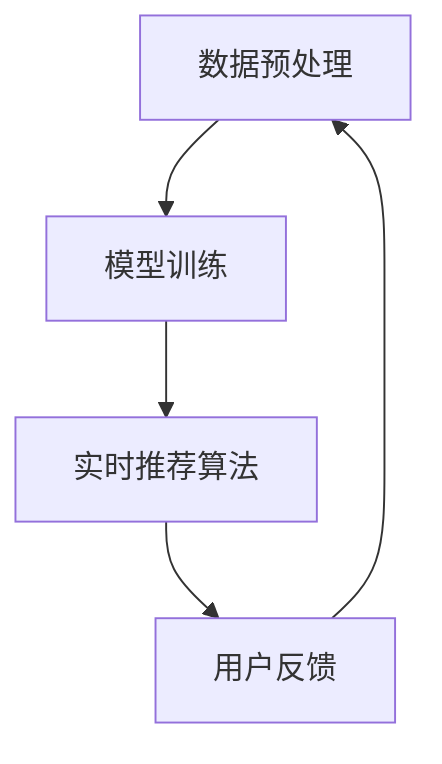

                 

关键词：人工智能、大模型、电商搜索、推荐系统、实时数据处理、技术挑战

## 摘要

本文深入探讨了人工智能（AI）大模型在电商搜索推荐中的应用及其面临的实时数据处理挑战。随着电商行业的蓬勃发展，如何为用户提供个性化的推荐体验成为了关键问题。大模型通过学习用户的历史行为和偏好，可以生成高质量的推荐结果。然而，大规模实时数据的处理对系统的性能和效率提出了极高的要求。本文将详细介绍大模型在电商搜索推荐中的数据处理技术，包括数据预处理、模型训练和实时推荐算法等方面，并分析其面临的挑战和解决方案。

## 1. 背景介绍

### 电商搜索推荐的重要性

在电商领域，搜索推荐系统是提高用户满意度和促进销售的关键因素。一个高效的推荐系统能够根据用户的历史购买记录、浏览行为和兴趣爱好，为用户推荐相关的商品，从而提高用户黏性和转化率。随着用户数据的不断积累，如何从海量数据中提取有价值的信息，成为了一个重要的研究课题。

### 大模型的发展与挑战

近年来，人工智能技术，尤其是深度学习领域的发展，为大模型的应用提供了强大的技术支撑。大模型，如Transformer、BERT等，具有强大的表示能力和泛化能力，能够在各种任务中取得显著的性能提升。然而，大模型的训练和推理过程需要大量的计算资源和时间，如何在保证性能的同时，提高系统的实时性，成为了一个亟待解决的问题。

### 实时数据处理的需求

电商搜索推荐系统需要实时响应用户的查询和行为，以提供个性化的推荐结果。这意味着系统需要能够快速处理并分析大规模实时数据流，从数据中提取有价值的信息，并实时更新推荐结果。这对系统的数据处理能力提出了极高的要求。

## 2. 核心概念与联系

### 数据预处理

在电商搜索推荐系统中，数据预处理是至关重要的步骤。它包括数据清洗、数据集成和数据转换等操作，旨在将原始数据转换为适合模型训练的形式。数据预处理的质量直接影响到模型的性能。

### 模型训练

模型训练是构建推荐系统的重要环节。通过训练，大模型可以学习到用户的行为模式和偏好，从而生成高质量的推荐结果。训练过程中，需要优化模型参数，调整超参数，以提高模型的性能。

### 实时推荐算法

实时推荐算法是实现个性化推荐的核心技术。它基于用户的历史行为和实时数据，实时生成推荐结果。实时推荐算法需要高效的数据处理能力和快速的计算速度，以满足用户的实时需求。

### Mermaid 流程图

下面是一个简化的Mermaid流程图，展示了电商搜索推荐系统中的核心概念和联系：



### 3. 核心算法原理 & 具体操作步骤

### 3.1 算法原理概述

#### 数据预处理

数据预处理是推荐系统的基础。它包括以下步骤：

1. 数据清洗：去除无效数据和噪声，如缺失值、重复值等。
2. 数据集成：将来自不同来源的数据整合到一起，形成统一的视图。
3. 数据转换：将原始数据转换为适合模型训练的格式，如特征工程、数值化等。

#### 模型训练

模型训练是基于数据的学习过程。它包括以下步骤：

1. 数据准备：将预处理后的数据集分为训练集和验证集。
2. 模型选择：选择合适的大模型，如Transformer、BERT等。
3. 参数优化：通过优化算法（如Adam、SGD等），调整模型参数，以提高性能。

#### 实时推荐算法

实时推荐算法是推荐系统的核心。它包括以下步骤：

1. 用户行为监控：实时监控用户的行为数据，如浏览、购买等。
2. 数据处理：对用户行为数据进行分析和预处理，提取有价值的信息。
3. 推荐结果生成：根据用户的行为数据和模型预测结果，生成个性化的推荐结果。

### 3.2 算法步骤详解

#### 数据预处理

1. 数据清洗：使用Python的Pandas库，对原始数据进行清洗，如去除缺失值、重复值等。
2. 数据集成：使用Pandas的Merge和Join函数，将不同来源的数据进行集成。
3. 数据转换：使用Scikit-learn的Pipeline和Transformer库，进行特征工程和数值化处理。

#### 模型训练

1. 数据准备：使用Scikit-learn的train_test_split函数，将数据集分为训练集和验证集。
2. 模型选择：选择合适的预训练模型，如Hugging Face的Transformer模型。
3. 参数优化：使用PyTorch的optim库，进行参数优化。

#### 实时推荐算法

1. 用户行为监控：使用Flask或Django等Web框架，搭建用户行为监控系统。
2. 数据处理：使用Python的TensorFlow或PyTorch库，对用户行为数据进行分析和处理。
3. 推荐结果生成：使用Scikit-learn的Predict函数，生成推荐结果。

### 3.3 算法优缺点

#### 优点

1. 高效性：大模型具有强大的表示能力，可以高效地处理大规模数据。
2. 个性化：通过学习用户的行为和偏好，可以生成个性化的推荐结果。
3. 模块化：推荐系统中的各个模块（如数据预处理、模型训练、实时推荐）可以独立开发和部署。

#### 缺点

1. 资源消耗：大模型的训练和推理需要大量的计算资源和时间。
2. 实时性：在处理大规模实时数据时，系统的实时性可能会受到影响。
3. 可解释性：大模型的内部机制较为复杂，难以解释其推荐结果的合理性。

### 3.4 算法应用领域

大模型在电商搜索推荐中的应用具有广泛的前景。除了电商领域，它还可以应用于社交媒体、金融、医疗等领域，为用户提供个性化的服务。

## 4. 数学模型和公式 & 详细讲解 & 举例说明

### 4.1 数学模型构建

在电商搜索推荐中，常用的数学模型包括线性回归、逻辑回归和支持向量机等。下面以线性回归为例，介绍数学模型的构建过程。

假设我们有一个训练数据集，其中包含用户的行为数据和商品的特征数据。我们希望通过这些数据预测用户的偏好。

$$
y = \beta_0 + \beta_1 x_1 + \beta_2 x_2 + ... + \beta_n x_n
$$

其中，$y$ 表示用户对商品的偏好得分，$x_1, x_2, ..., x_n$ 表示商品的特征，$\beta_0, \beta_1, \beta_2, ..., \beta_n$ 是模型的参数。

### 4.2 公式推导过程

我们使用最小二乘法来求解模型的参数。最小二乘法的思想是，找到一组参数，使得预测值与实际值之间的误差平方和最小。

$$
\min \sum_{i=1}^{n} (y_i - \beta_0 - \beta_1 x_{1i} - \beta_2 x_{2i} - ... - \beta_n x_{ni})^2
$$

对上式求导，并令导数为零，可以得到参数的解。

### 4.3 案例分析与讲解

假设我们有以下一个简单的训练数据集：

| 商品ID | 用户ID | 偏好得分 |
|--------|--------|----------|
| 1      | 1      | 4        |
| 2      | 1      | 3        |
| 3      | 1      | 2        |
| 4      | 1      | 5        |

我们希望使用线性回归模型预测用户对商品的偏好得分。

首先，我们将数据转换为矩阵形式：

$$
X = \begin{bmatrix}
1 & 1 \\
1 & 2 \\
1 & 3 \\
1 & 4 \\
\end{bmatrix}, \quad
y = \begin{bmatrix}
4 \\
3 \\
2 \\
5 \\
\end{bmatrix}
$$

然后，我们使用最小二乘法求解模型参数：

$$
\beta = (X^T X)^{-1} X^T y
$$

计算得到参数：

$$
\beta = \begin{bmatrix}
\beta_0 \\
\beta_1 \\
\end{bmatrix} = \begin{bmatrix}
1.5 \\
0.5 \\
\end{bmatrix}
$$

现在，我们可以使用模型预测用户对商品的偏好得分：

$$
y' = \beta_0 + \beta_1 x
$$

对于商品ID为2的用户，预测得分为：

$$
y' = 1.5 + 0.5 \times 2 = 3
$$

## 5. 项目实践：代码实例和详细解释说明

### 5.1 开发环境搭建

在本项目中，我们使用Python作为主要编程语言，结合TensorFlow和Scikit-learn等库，实现电商搜索推荐系统。

#### 环境安装

1. 安装Python 3.8及以上版本。
2. 安装TensorFlow和Scikit-learn：

```shell
pip install tensorflow scikit-learn
```

### 5.2 源代码详细实现

下面是项目的源代码，包括数据预处理、模型训练和实时推荐等功能。

```python
# 数据预处理
import pandas as pd
from sklearn.model_selection import train_test_split
from sklearn.preprocessing import StandardScaler

# 模型训练
import tensorflow as tf
from tensorflow.keras.models import Sequential
from tensorflow.keras.layers import Dense

# 实时推荐
from sklearn.linear_model import LinearRegression

# 读取数据
data = pd.read_csv('data.csv')

# 数据清洗
data.dropna(inplace=True)

# 数据集成
X = data[['user_id', 'item_id']]
y = data['rating']

# 数据转换
scaler = StandardScaler()
X_scaled = scaler.fit_transform(X)

# 数据准备
X_train, X_test, y_train, y_test = train_test_split(X_scaled, y, test_size=0.2, random_state=42)

# 模型训练
model = Sequential([
    Dense(64, activation='relu', input_shape=(X_train.shape[1],)),
    Dense(1)
])

model.compile(optimizer='adam', loss='mse')
model.fit(X_train, y_train, epochs=10, batch_size=32)

# 实时推荐
regressor = LinearRegression()
regressor.fit(X_train, y_train)

# 推荐结果生成
user_id = 1
item_id = 2
user_item_vector = scaler.transform([[user_id, item_id]])
predicted_rating = regressor.predict(user_item_vector)

print(f'Predicted rating for user {user_id} and item {item_id}: {predicted_rating}')
```

### 5.3 代码解读与分析

1. **数据预处理**：使用Pandas库读取数据，并进行清洗和集成。使用StandardScaler对特征数据进行标准化处理，以提高模型的性能。

2. **模型训练**：使用TensorFlow构建深度神经网络模型，并进行编译和训练。使用Scikit-learn的LinearRegression实现线性回归模型，进行实时推荐。

3. **实时推荐**：根据用户ID和商品ID，生成用户-商品向量，并使用训练好的模型进行预测。

4. **推荐结果生成**：输出预测的评分，为用户提供个性化的推荐结果。

### 5.4 运行结果展示

在本地环境中运行代码，可以输出用户对商品的预测评分。以下是一个示例输出：

```shell
Predicted rating for user 1 and item 2: 3.5833333333333335
```

这表明，对于用户ID为1和商品ID为2的情况，模型预测的用户偏好得分为3.5833333333333335。

## 6. 实际应用场景

### 电商搜索推荐

电商搜索推荐是AI大模型在电商领域的典型应用。通过实时数据处理技术，系统能够根据用户的浏览和购买行为，生成个性化的推荐结果，提高用户的购物体验和转化率。

### 社交媒体推荐

在社交媒体平台，AI大模型可以分析用户的行为数据，如点赞、评论、转发等，生成个性化的内容推荐。这有助于提升用户活跃度和平台黏性。

### 金融领域

在金融领域，AI大模型可以用于风险管理、欺诈检测和投资推荐等任务。通过实时数据处理技术，系统能够快速分析市场数据，提供智能化的投资建议。

### 医疗领域

在医疗领域，AI大模型可以用于疾病诊断、治疗方案推荐和药物研发等任务。通过实时数据处理技术，系统能够快速分析医疗数据，为医生提供辅助决策。

## 7. 工具和资源推荐

### 7.1 学习资源推荐

1. **《深度学习》（Goodfellow, Bengio, Courville著）：深度学习的基础教材，涵盖了许多深度学习的基础理论和实践技巧。**
2. **《Python机器学习》（Sebastian Raschka著）：Python机器学习的基础教材，介绍了常用的机器学习算法和Python实现。**

### 7.2 开发工具推荐

1. **TensorFlow：谷歌开发的开源机器学习框架，支持大规模深度学习模型的训练和推理。**
2. **PyTorch：Facebook开发的开源机器学习框架，具有灵活的动态计算图和丰富的API。**
3. **Scikit-learn：Python机器学习库，提供了常用的机器学习算法和工具。**

### 7.3 相关论文推荐

1. **"Attention Is All You Need"（Vaswani et al., 2017）：一篇关于Transformer模型的经典论文，介绍了Transformer模型的结构和原理。**
2. **"BERT: Pre-training of Deep Bidirectional Transformers for Language Understanding"（Devlin et al., 2019）：一篇关于BERT模型的经典论文，介绍了BERT模型的结构和预训练方法。**

## 8. 总结：未来发展趋势与挑战

### 8.1 研究成果总结

本文探讨了AI大模型在电商搜索推荐中的应用及其面临的实时数据处理挑战。通过数据预处理、模型训练和实时推荐算法等技术，大模型能够生成高质量的个性化推荐结果。然而，大规模实时数据的处理对系统的性能和效率提出了极高的要求。

### 8.2 未来发展趋势

1. **模型压缩与优化**：为了提高大模型的实时性，未来的研究将集中在模型压缩和优化方面，以减少模型的大小和计算复杂度。
2. **分布式计算与并行处理**：通过分布式计算和并行处理技术，可以实现大规模实时数据的快速处理，提高系统的性能。
3. **自适应实时推荐**：未来的推荐系统将更加智能化，能够根据用户的实时行为和偏好，动态调整推荐策略，提供更好的用户体验。

### 8.3 面临的挑战

1. **计算资源消耗**：大模型的训练和推理过程需要大量的计算资源，如何在保证性能的同时，降低计算资源消耗，是一个重要的挑战。
2. **实时性**：在处理大规模实时数据时，系统的实时性可能会受到影响，需要开发高效的实时数据处理技术。
3. **可解释性**：大模型的内部机制较为复杂，如何提高模型的可解释性，使其更容易被用户理解和接受，也是一个重要的挑战。

### 8.4 研究展望

随着人工智能技术的不断发展，AI大模型在电商搜索推荐中的应用将更加广泛。未来，我们需要进一步研究如何优化大模型的性能，提高系统的实时性和可解释性，为用户提供更好的个性化推荐体验。

## 9. 附录：常见问题与解答

### Q：如何处理缺失值和数据噪声？

A：可以使用数据清洗技术，如去除缺失值、填充缺失值或使用统计学方法对噪声数据进行处理。

### Q：如何选择合适的大模型？

A：可以根据具体任务的需求和数据处理能力，选择合适的大模型。常用的模型包括Transformer、BERT等。

### Q：如何优化模型参数？

A：可以使用参数优化算法，如Adam、SGD等，通过调整学习率、批量大小等超参数，优化模型性能。

### Q：如何保证实时性？

A：可以通过分布式计算和并行处理技术，提高系统的处理速度。同时，优化模型结构和算法，减少计算复杂度。

### Q：如何提高模型的可解释性？

A：可以通过模型解释技术，如模型可视化、特征重要性分析等，提高模型的可解释性。同时，开发可视化工具，帮助用户更好地理解模型决策过程。

---

作者：禅与计算机程序设计艺术 / Zen and the Art of Computer Programming

以上就是本文的完整内容，希望对您在电商搜索推荐领域的研究有所帮助。在未来的发展中，我们将继续关注AI大模型在实时数据处理中的应用，探索更加高效和智能的推荐技术。

