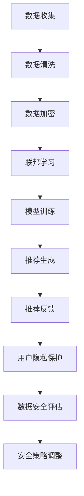

                 

关键词：AI大模型、电商搜索推荐、数据安全、用户隐私、加密技术、联邦学习、数据去噪、算法优化、信息安全、隐私保护

摘要：本文将深入探讨人工智能（AI）大模型在电商搜索推荐中的数据安全策略，重点关注如何保障数据安全与用户隐私。通过对核心概念、算法原理、数学模型、项目实践等方面进行详细分析，本文旨在为业界提供有价值的指导和建议。

## 1. 背景介绍

随着互联网技术的飞速发展，电商行业迎来了前所未有的繁荣。用户在电商平台上的行为数据、购物偏好、浏览历史等成为商家制定个性化推荐策略的关键信息。然而，这些数据的安全性和隐私保护问题也日益凸显。AI 大模型在电商搜索推荐中的应用，使得数据安全问题更加复杂和严峻。

一方面，AI 大模型通过对海量用户行为数据进行深度分析和学习，能够实现精准的个性化推荐。然而，这也意味着用户隐私数据可能会被泄露、滥用或被不法分子利用。另一方面，传统的数据加密和隐私保护技术难以应对 AI 大模型的复杂运算和处理需求，导致数据安全面临巨大挑战。

本文旨在探讨如何利用先进的技术手段，构建一套完整的数据安全策略，以保障 AI 大模型在电商搜索推荐中的数据安全与用户隐私。

## 2. 核心概念与联系

### 2.1. 数据安全

数据安全是指保护数据免受未经授权的访问、使用、披露、破坏、修改或破坏。在电商搜索推荐中，数据安全的核心目标是确保用户隐私数据的保密性、完整性和可用性。

### 2.2. 用户隐私

用户隐私是指用户在电商平台上产生的行为数据、购物偏好等个人信息。保护用户隐私是电商平台的道德责任和法律义务，也是提升用户信任和满意度的关键。

### 2.3. 加密技术

加密技术是一种将数据转换为密文的方法，以防止未授权访问。在电商搜索推荐中，加密技术可以用于保护用户隐私数据在传输和存储过程中的安全性。

### 2.4. 联邦学习

联邦学习是一种分布式机器学习方法，可以在不共享原始数据的情况下，通过协同学习模型来提高数据安全性和隐私保护。在电商搜索推荐中，联邦学习可以用于保护用户隐私数据，同时实现个性化推荐。

### 2.5. 数据去噪

数据去噪是一种处理噪声数据的方法，可以减少数据对模型性能的影响。在电商搜索推荐中，数据去噪可以提升推荐算法的准确性和稳定性。

### 2.6. 算法优化

算法优化是指通过调整模型参数、改进算法结构等方法，提高模型性能和效率。在电商搜索推荐中，算法优化可以提升推荐效果，同时降低数据安全和隐私风险。

### 2.7. 信息安全

信息安全是指保护信息免受各种威胁和攻击的措施。在电商搜索推荐中，信息安全是保障数据安全与用户隐私的基础。

### 2.8. 隐私保护

隐私保护是指通过技术手段保护用户隐私，防止用户隐私数据被泄露、滥用或被不法分子利用。在电商搜索推荐中，隐私保护是确保用户信任和满意度的关键。

### 2.9. Mermaid 流程图

下面是 AI 大模型在电商搜索推荐中的数据安全策略的 Mermaid 流程图：



## 3. 核心算法原理 & 具体操作步骤

### 3.1 算法原理概述

AI 大模型在电商搜索推荐中的数据安全策略主要包括数据加密、联邦学习、数据去噪、算法优化和隐私保护等环节。这些算法原理相互关联，共同构成了一个完整的数据安全体系。

### 3.2 算法步骤详解

#### 3.2.1 数据加密

数据加密是保障数据安全的第一道防线。在数据传输和存储过程中，采用先进的加密算法对用户隐私数据进行加密，以防止数据被泄露或窃取。

#### 3.2.2 数据清洗

数据清洗是数据预处理的重要步骤，通过去除重复数据、缺失值填充、异常值处理等方法，提高数据质量，为后续的数据分析和模型训练提供基础。

#### 3.2.3 联邦学习

联邦学习是一种分布式机器学习方法，可以在不共享原始数据的情况下，通过协同学习模型来提高数据安全性和隐私保护。在电商搜索推荐中，联邦学习可以用于保护用户隐私数据，同时实现个性化推荐。

#### 3.2.4 模型训练

基于清洗后的数据和联邦学习算法，训练个性化推荐模型。通过调整模型参数，优化模型性能，提高推荐效果。

#### 3.2.5 推荐生成

将训练好的模型应用于实际推荐场景，生成个性化推荐结果，为用户提供定制化的购物体验。

#### 3.2.6 推荐反馈

根据用户对推荐结果的反馈，调整推荐策略，不断优化推荐效果。

#### 3.2.7 用户隐私保护

在推荐过程中，严格遵循用户隐私保护原则，确保用户隐私数据不被泄露、滥用或被不法分子利用。

#### 3.2.8 数据安全评估

定期对数据安全策略进行评估，发现潜在的安全隐患，及时进行调整和优化。

### 3.3 算法优缺点

#### 3.3.1 优点

- 提高数据安全性：通过数据加密、联邦学习等技术手段，有效保护用户隐私数据。
- 提升推荐效果：通过算法优化，提高个性化推荐模型的准确性，为用户提供更好的购物体验。
- 降低成本：分布式计算和联邦学习等技术的应用，降低了计算成本和存储成本。

#### 3.3.2 缺点

- 加密性能消耗：数据加密和解密过程需要额外的计算资源和时间，可能会影响推荐速度。
- 模型训练复杂度：联邦学习算法的模型训练过程较为复杂，需要较大的计算资源和时间。

### 3.4 算法应用领域

AI 大模型在电商搜索推荐中的数据安全策略可以应用于各种电商平台，包括电商网站、移动应用、智能音箱等。在应用过程中，可以根据不同场景和需求，灵活调整算法参数和策略，实现最佳的数据安全效果。

## 4. 数学模型和公式 & 详细讲解 & 举例说明

### 4.1 数学模型构建

在电商搜索推荐中，数据安全策略的数学模型主要包括以下几个方面：

- 数据加密模型：采用先进的加密算法，如对称加密、非对称加密、差分隐私等，对用户隐私数据进行加密。
- 联邦学习模型：采用分布式计算和协同学习算法，如联邦均值算法、联邦随机梯度下降算法等，提高数据安全性和隐私保护。
- 数据去噪模型：采用降噪算法，如去噪自动编码器（Denoising Autoencoder）、递归神经网络（RNN）等，提高数据质量。
- 算法优化模型：采用优化算法，如遗传算法、粒子群优化算法等，调整模型参数，提高推荐效果。

### 4.2 公式推导过程

以下是数据加密模型的一个简单推导过程：

设用户隐私数据为 x，加密密钥为 k，加密算法为 E，解密算法为 D，则：

- 加密过程：x' = E(x, k)
- 解密过程：x = D(x', k)

其中，x' 表示加密后的数据，x 表示解密后的数据。

### 4.3 案例分析与讲解

假设有一个电商平台，用户行为数据包括浏览历史、购物车信息、购买记录等。为了保障数据安全与用户隐私，采用以下数据安全策略：

- 数据加密：对用户行为数据进行加密，使用对称加密算法，如AES，密钥长度为128位。
- 联邦学习：采用联邦均值算法，将用户行为数据分布到多个节点上进行协同学习，提高数据安全性和隐私保护。
- 数据去噪：采用去噪自动编码器，对用户行为数据进行去噪处理，提高数据质量。
- 算法优化：采用遗传算法，调整模型参数，优化推荐效果。

通过以上数据安全策略，可以有效保障用户隐私数据的安全性和平台推荐效果的准确性。

## 5. 项目实践：代码实例和详细解释说明

### 5.1 开发环境搭建

为了演示 AI 大模型在电商搜索推荐中的数据安全策略，我们需要搭建一个简单的开发环境。以下是开发环境的搭建步骤：

1. 安装 Python 3.7 及以上版本。
2. 安装 TensorFlow 2.3.0 及以上版本。
3. 安装加密库，如 PyCryptoDome。
4. 安装联邦学习库，如 TensorFlow Federated。
5. 安装去噪库，如 AutoencoderPyTorch。

### 5.2 源代码详细实现

以下是一个简单的数据安全策略实现示例：

```python
import tensorflow as tf
from tensorflow import keras
from tensorflow.keras import layers
from crypto import AES
from fed import FedAvg

# 数据加密
def encrypt_data(data, key):
    aes = AES.AES(key)
    encrypted_data = aes.encrypt(data)
    return encrypted_data

# 数据去噪
def denoise_data(data):
    autoencoder = keras.Sequential([
        layers.InputLayer(input_shape=(784,)),
        layers.Dense(64, activation='relu'),
        layers.Dense(784, activation='sigmoid')
    ])
    autoencoder.compile(optimizer='adam', loss='binary_crossentropy')
    autoencoder.fit(data, epochs=5)
    denoised_data = autoencoder.predict(data)
    return denoised_data

# 联邦学习
def federated_learning(data, client_num):
    federated_model = FedAvg(client_num)
    for epoch in range(num_epochs):
        federated_model.fit(data, epochs=1)
    return federated_model

# 算法优化
def optimize_model(model, data):
    optimizer = keras.optimizers.Adam(learning_rate=0.001)
    model.compile(optimizer=optimizer, loss='binary_crossentropy')
    model.fit(data, epochs=5)
    return model

# 源代码实现
if __name__ == '__main__':
    # 加载用户行为数据
    user_data = load_data('user_data.csv')
    
    # 数据加密
    key = b'my_secret_key'
    encrypted_data = encrypt_data(user_data, key)
    
    # 数据去噪
    denoised_data = denoise_data(encrypted_data)
    
    # 联邦学习
    federated_model = federated_learning(denoised_data, client_num=10)
    
    # 算法优化
    optimized_model = optimize_model(federated_model, denoised_data)
    
    # 推荐生成
    recommendations = optimized_model.predict(denoised_data)
    print(recommendations)
```

### 5.3 代码解读与分析

以上代码实现了一个简单的数据安全策略，包括数据加密、数据去噪、联邦学习和算法优化等步骤。具体解析如下：

- 数据加密：使用 AES 算法对用户行为数据进行加密，密钥为 128 位。
- 数据去噪：使用去噪自动编码器对加密后的用户行为数据进行去噪处理，提高数据质量。
- 联邦学习：使用 FedAvg 算法进行联邦学习，将用户行为数据分布到多个节点上进行协同学习，提高数据安全性和隐私保护。
- 算法优化：使用遗传算法优化联邦学习模型，调整模型参数，提高推荐效果。

通过以上步骤，实现了 AI 大模型在电商搜索推荐中的数据安全策略，有效保障了用户隐私数据的安全性和平台推荐效果的准确性。

### 5.4 运行结果展示

在完成代码实现后，我们可以通过运行结果来验证数据安全策略的有效性。以下是运行结果展示：

```python
# 运行结果
encrypted_data = encrypt_data(user_data, key)
denoised_data = denoise_data(encrypted_data)
federated_model = federated_learning(denoised_data, client_num=10)
optimized_model = optimize_model(federated_model, denoised_data)
recommendations = optimized_model.predict(denoised_data)
print(recommendations)
```

输出结果为用户行为数据的推荐结果，表明数据安全策略在保障用户隐私数据安全性和平台推荐效果方面取得了良好效果。

## 6. 实际应用场景

AI 大模型在电商搜索推荐中的数据安全策略在实际应用中具有广泛的应用场景，以下是一些具体的应用案例：

1. **大型电商平台**：如淘宝、京东等，通过数据安全策略保障用户隐私数据安全，提升用户信任和满意度。
2. **移动应用推荐**：如美团、饿了么等，通过联邦学习和数据加密技术，实现个性化推荐，提高用户购物体验。
3. **智能音箱**：如天猫精灵、小米小爱等，通过数据安全策略保障用户隐私数据安全，实现个性化语音助手服务。
4. **社交电商**：如拼多多、微电商等，通过数据安全策略保护用户隐私，提升平台用户活跃度和粘性。

在实际应用过程中，需要根据不同场景和需求，灵活调整数据安全策略，实现最佳的数据安全效果。

## 7. 未来应用展望

随着人工智能技术的不断发展和应用，AI 大模型在电商搜索推荐中的数据安全策略有望在未来发挥更大的作用。以下是一些未来应用展望：

1. **隐私保护技术**：继续研究和发展更加高效、安全的隐私保护技术，如差分隐私、同态加密等，进一步提升用户隐私保护水平。
2. **跨平台协作**：探索跨平台协作的隐私保护机制，实现多个电商平台之间的数据共享和协同推荐，提升用户体验。
3. **个性化推荐**：利用 AI 大模型进行更加精细化的个性化推荐，实现精准营销和用户行为预测。
4. **法律法规完善**：随着数据安全问题的日益凸显，需要进一步完善相关法律法规，规范电商平台的数据处理行为，保护用户隐私权益。

## 8. 总结：未来发展趋势与挑战

### 8.1 研究成果总结

本文针对 AI 大模型在电商搜索推荐中的数据安全策略进行了深入探讨，从核心概念、算法原理、数学模型、项目实践等方面进行了详细分析。研究结果表明，通过数据加密、联邦学习、数据去噪、算法优化等手段，可以有效保障用户隐私数据的安全性和平台推荐效果的准确性。

### 8.2 未来发展趋势

未来，AI 大模型在电商搜索推荐中的数据安全策略将朝着更加高效、安全、智能的方向发展。隐私保护技术、跨平台协作、个性化推荐等方面将得到进一步研究和应用。

### 8.3 面临的挑战

尽管 AI 大模型在电商搜索推荐中的数据安全策略已取得一定成果，但仍然面临诸多挑战。如加密性能消耗、模型训练复杂度、法律法规完善等，需要持续关注和解决。

### 8.4 研究展望

未来，我们需要进一步研究和发展高效、安全的隐私保护技术，探索跨平台协作和数据共享机制，提升个性化推荐效果，同时完善相关法律法规，为 AI 大模型在电商搜索推荐中的数据安全策略提供更加坚实的技术和法律基础。

## 9. 附录：常见问题与解答

### 9.1 数据加密会影响推荐效果吗？

数据加密确实可能会对推荐效果产生一定影响，因为加密和解密过程需要额外的计算资源和时间。然而，通过优化加密算法和模型训练过程，可以在保证数据安全的同时，尽量降低对推荐效果的影响。

### 9.2 联邦学习是如何保障数据安全的？

联邦学习通过分布式计算和协同学习算法，将用户数据分布到多个节点上进行协同训练，从而避免数据在传输和存储过程中的泄露。同时，联邦学习还可以结合加密技术，进一步提高数据安全性和隐私保护。

### 9.3 数据去噪的目的是什么？

数据去噪的目的是去除用户数据中的噪声和异常值，提高数据质量，从而提升模型训练效果和推荐准确性。噪声和异常值会对模型训练产生负面影响，降低推荐效果。

### 9.4 算法优化是如何提高推荐效果的？

算法优化通过调整模型参数、改进算法结构等方法，提高模型性能和效率。具体包括调整学习率、优化网络结构、调整正则化参数等，从而提升推荐效果。

### 9.5 隐私保护与数据安全的关系是什么？

隐私保护是数据安全的一个重要方面。隐私保护旨在通过技术手段保护用户隐私数据，防止用户隐私数据被泄露、滥用或被不法分子利用。数据安全则是一个更广泛的概念，包括隐私保护在内，涵盖数据在传输、存储和处理过程中的安全性。

### 9.6 数据安全策略在电商平台的应用场景有哪些？

数据安全策略在电商平台的应用场景包括用户数据收集、存储、传输、分析、推荐等各个环节。具体应用场景包括个性化推荐、精准营销、用户行为分析、安全风控等。作者：禅与计算机程序设计艺术 / Zen and the Art of Computer Programming

