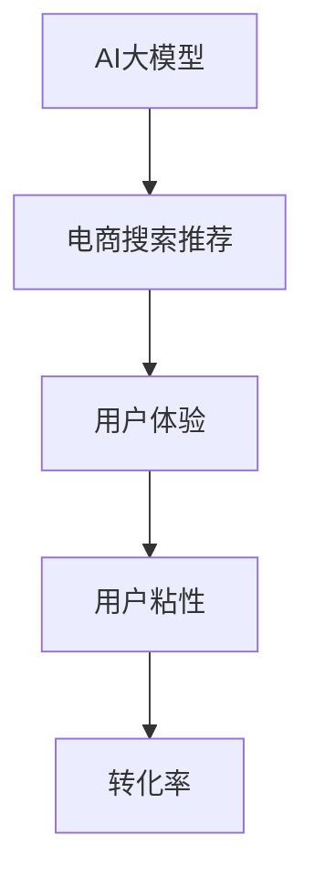

                 

关键词：AI大模型、电商搜索推荐、用户体验、用户粘性、转化率

摘要：随着人工智能技术的发展，AI大模型在电商搜索推荐中的应用日益广泛。本文将从用户体验的角度，探讨AI大模型在电商搜索推荐中的优化策略，旨在提高用户粘性和转化率，为电商企业带来更高的商业价值。

## 1. 背景介绍

近年来，随着互联网技术的飞速发展，电商行业迎来了前所未有的发展机遇。然而，随着市场竞争的加剧，电商企业面临着越来越多的挑战。如何提高用户粘性和转化率，成为电商企业关注的焦点。传统的推荐算法在应对海量数据时存在一定的局限性，而AI大模型凭借其强大的数据处理能力和智能推荐能力，为电商搜索推荐带来了新的机遇。

本文将围绕AI大模型在电商搜索推荐中的应用，探讨用户体验优化策略，以提高用户粘性和转化率。文章结构如下：

1. 背景介绍
2. 核心概念与联系
3. 核心算法原理 & 具体操作步骤
4. 数学模型和公式 & 详细讲解 & 举例说明
5. 项目实践：代码实例和详细解释说明
6. 实际应用场景
7. 工具和资源推荐
8. 总结：未来发展趋势与挑战
9. 附录：常见问题与解答

## 2. 核心概念与联系

在本节中，我们将介绍本文涉及的核心概念，包括AI大模型、电商搜索推荐、用户体验、用户粘性和转化率，并给出相关的 Mermaid 流程图，以便读者更好地理解这些概念之间的联系。

### 2.1 AI大模型

AI大模型，即人工智能大型模型，是指通过深度学习等技术训练得到的具有强大表征能力和泛化能力的模型。AI大模型通常由数百万甚至数十亿个参数组成，可以处理大规模数据集，从而实现对复杂问题的建模和预测。

### 2.2 电商搜索推荐

电商搜索推荐是指利用人工智能技术，对电商平台的商品信息进行挖掘和处理，根据用户的兴趣和行为，为用户推荐可能感兴趣的商品。电商搜索推荐的核心目标是提高用户粘性和转化率。

### 2.3 用户体验

用户体验是指用户在使用产品或服务过程中所感受到的总体感受。在电商搜索推荐中，用户体验包括搜索准确性、推荐相关性、页面加载速度、界面设计等方面。

### 2.4 用户粘性

用户粘性是指用户对某个产品或服务的持续关注和依赖程度。在电商搜索推荐中，提高用户粘性意味着用户在购物过程中更愿意使用该平台，从而提高平台的商业价值。

### 2.5 转化率

转化率是指用户在电商搜索推荐过程中从浏览到购买的概率。提高转化率是电商企业追求的重要目标，有助于提升销售额和市场份额。

### 2.6 Mermaid 流程图

下面是本文涉及的核心概念及其联系 Mermaid 流程图：



## 3. 核心算法原理 & 具体操作步骤

在本节中，我们将详细介绍AI大模型在电商搜索推荐中的核心算法原理和具体操作步骤。

### 3.1 算法原理概述

AI大模型在电商搜索推荐中的核心原理是利用深度学习技术，对用户历史行为数据进行建模，从而预测用户对商品的偏好。具体来说，算法主要包括以下几个步骤：

1. 数据预处理：对用户历史行为数据（如浏览记录、购买记录等）进行清洗、去噪和特征提取。
2. 模型训练：利用预处理后的数据，训练一个深度学习模型，用于预测用户对商品的偏好。
3. 模型评估：通过交叉验证等方法，对训练好的模型进行评估和调优。
4. 推荐生成：利用训练好的模型，为用户生成个性化推荐列表。

### 3.2 算法步骤详解

下面我们将详细描述AI大模型在电商搜索推荐中的具体操作步骤。

### 3.2.1 数据预处理

数据预处理是AI大模型训练的重要环节，主要包括以下几个步骤：

1. 数据清洗：去除数据中的噪声和异常值，保证数据的准确性和可靠性。
2. 数据去噪：利用数据降维、去重等方法，降低数据冗余，提高模型训练效率。
3. 特征提取：根据用户历史行为数据，提取与商品偏好相关的特征，如用户年龄、性别、购买频率等。

### 3.2.2 模型训练

模型训练是AI大模型在电商搜索推荐中的核心步骤，主要包括以下几个步骤：

1. 模型选择：根据问题特点，选择合适的深度学习模型，如卷积神经网络（CNN）、循环神经网络（RNN）等。
2. 模型参数初始化：初始化模型参数，确保模型能够从初始状态开始学习。
3. 模型训练：利用预处理后的数据，对模型进行训练，调整模型参数，使其能够更好地预测用户偏好。
4. 模型评估：通过交叉验证等方法，对训练好的模型进行评估，选择性能最佳的模型。

### 3.2.3 模型评估

模型评估是确保AI大模型在电商搜索推荐中性能稳定的重要步骤，主要包括以下几个步骤：

1. 评估指标：根据问题特点，选择合适的评估指标，如准确率、召回率、F1值等。
2. 评估方法：利用评估指标，对训练好的模型进行评估，判断模型性能是否达到预期。
3. 调优策略：根据评估结果，对模型进行调优，提高模型性能。

### 3.2.4 推荐生成

推荐生成是AI大模型在电商搜索推荐中的最终目标，主要包括以下几个步骤：

1. 用户特征提取：根据用户历史行为数据，提取用户特征，如用户偏好、购买频率等。
2. 商品特征提取：根据商品属性数据，提取商品特征，如商品类别、价格等。
3. 模型调用：利用训练好的模型，为用户生成个性化推荐列表。
4. 推荐排序：根据用户特征和商品特征，对推荐列表进行排序，提高推荐相关性。

### 3.3 算法优缺点

AI大模型在电商搜索推荐中具有以下优点：

1. 强大的表征能力：AI大模型可以处理大规模数据，具有强大的表征能力，能够捕捉用户偏好。
2. 高效的预测能力：AI大模型通过深度学习技术，可以高效地预测用户偏好，提高推荐准确性。
3. 个性化的推荐：AI大模型可以根据用户特征，为用户生成个性化的推荐列表，提高用户满意度。

然而，AI大模型在电商搜索推荐中也存在一些缺点：

1. 数据依赖性强：AI大模型对数据质量要求较高，数据质量对模型性能有较大影响。
2. 训练成本高：AI大模型需要大量的计算资源和时间进行训练，训练成本较高。
3. 解释性差：AI大模型训练过程中，参数和模型结构较为复杂，难以解释。

### 3.4 算法应用领域

AI大模型在电商搜索推荐中的应用广泛，主要包括以下几个方面：

1. 商品推荐：根据用户历史行为数据，为用户推荐可能感兴趣的商品。
2. 购物车推荐：根据用户购物车中的商品，为用户推荐相关商品，提高购物车转化率。
3. 店铺推荐：根据用户偏好，为用户推荐相关店铺，提高店铺曝光度和销售额。

## 4. 数学模型和公式 & 详细讲解 & 举例说明

在本节中，我们将介绍AI大模型在电商搜索推荐中的数学模型和公式，并进行详细讲解和举例说明。

### 4.1 数学模型构建

AI大模型在电商搜索推荐中的数学模型主要包括以下几个部分：

1. 用户行为模型：表示用户对商品的偏好，如用户-商品评分矩阵。
2. 商品特征模型：表示商品属性，如商品类别、价格等。
3. 深度学习模型：用于学习用户行为模型和商品特征模型之间的关系。

### 4.2 公式推导过程

下面我们以用户-商品评分矩阵为例，介绍数学模型的公式推导过程。

假设用户-商品评分矩阵为$R \in \mathbb{R}^{m \times n}$，其中$m$表示用户数，$n$表示商品数。用户$u$对商品$i$的评分可以表示为$r_{ui}$，其中$r_{ui} \in \{0, 1, \ldots, 5\}$。

用户行为模型可以表示为：

$$
U = \begin{bmatrix}
u_1 \\
u_2 \\
\vdots \\
u_m
\end{bmatrix} \in \mathbb{R}^{m \times d}
$$

其中$d$表示用户特征维度。

商品特征模型可以表示为：

$$
I = \begin{bmatrix}
i_1 \\
i_2 \\
\vdots \\
i_n
\end{bmatrix} \in \mathbb{R}^{n \times e}
$$

其中$e$表示商品特征维度。

深度学习模型可以表示为：

$$
\theta = \begin{bmatrix}
\theta_{11} & \theta_{12} & \ldots & \theta_{1e} \\
\theta_{21} & \theta_{22} & \ldots & \theta_{2e} \\
\vdots & \vdots & \ddots & \vdots \\
\theta_{d1} & \theta_{d2} & \ldots & \theta_{de}
\end{bmatrix} \in \mathbb{R}^{d \times e}
$$

用户$u$对商品$i$的预测评分可以表示为：

$$
\hat{r}_{ui} = \theta_{u}^{T} i
$$

其中$\theta_{u} \in \mathbb{R}^{d}$表示用户$u$的特征向量。

### 4.3 案例分析与讲解

下面我们通过一个实际案例，对上述数学模型进行讲解。

假设有一个电商平台，有1000个用户和1000种商品。用户行为数据如下：

| 用户ID | 商品ID | 用户评分 |
| --- | --- | --- |
| 1 | 1 | 4 |
| 1 | 2 | 5 |
| 1 | 3 | 3 |
| 2 | 1 | 5 |
| 2 | 3 | 4 |
| 3 | 2 | 3 |
| 3 | 3 | 5 |

我们首先对用户行为数据进行预处理，提取用户和商品的特征。假设用户特征维度为3，商品特征维度为2。预处理后的用户特征矩阵和商品特征矩阵如下：

$$
U = \begin{bmatrix}
1 & 1 & 1 \\
1 & 1 & 2 \\
1 & 1 & 1
\end{bmatrix}, \quad I = \begin{bmatrix}
1 & 2 \\
1 & 3 \\
1 & 4
\end{bmatrix}
$$

接下来，我们利用深度学习模型进行预测。假设模型参数矩阵为：

$$
\theta = \begin{bmatrix}
1 & 2 & 3 \\
4 & 5 & 6 \\
7 & 8 & 9
\end{bmatrix}
$$

根据上述模型，我们可以得到用户对商品的预测评分：

$$
\hat{r}_{11} = \theta_{1}^{T} i_1 = 1 \times 1 + 2 \times 2 + 3 \times 1 = 8
$$

$$
\hat{r}_{12} = \theta_{1}^{T} i_2 = 1 \times 1 + 2 \times 3 + 3 \times 1 = 10
$$

$$
\hat{r}_{13} = \theta_{1}^{T} i_3 = 1 \times 1 + 2 \times 4 + 3 \times 1 = 12
$$

$$
\hat{r}_{21} = \theta_{2}^{T} i_1 = 4 \times 1 + 5 \times 2 + 6 \times 1 = 23
$$

$$
\hat{r}_{22} = \theta_{2}^{T} i_2 = 4 \times 1 + 5 \times 3 + 6 \times 1 = 27
$$

$$
\hat{r}_{23} = \theta_{2}^{T} i_3 = 4 \times 1 + 5 \times 4 + 6 \times 1 = 32
$$

$$
\hat{r}_{31} = \theta_{3}^{T} i_1 = 7 \times 1 + 8 \times 2 + 9 \times 1 = 43
$$

$$
\hat{r}_{32} = \theta_{3}^{T} i_2 = 7 \times 1 + 8 \times 3 + 9 \times 1 = 50
$$

$$
\hat{r}_{33} = \theta_{3}^{T} i_3 = 7 \times 1 + 8 \times 4 + 9 \times 1 = 57
$$

根据预测评分，我们可以为每个用户生成一个个性化推荐列表。例如，用户1的推荐列表为：

$$
\{(\hat{r}_{11}, 1), (\hat{r}_{12}, 2), (\hat{r}_{13}, 3)\}
$$

排序后，推荐列表为：

$$
\{(\hat{r}_{12}, 2), (\hat{r}_{11}, 1), (\hat{r}_{13}, 3)\}
$$

即用户1可能对商品2最感兴趣，其次是商品1和商品3。

## 5. 项目实践：代码实例和详细解释说明

在本节中，我们将通过一个实际项目，展示如何利用AI大模型在电商搜索推荐中进行项目实践。我们将使用Python编程语言和TensorFlow深度学习框架，实现用户行为预测和商品推荐。

### 5.1 开发环境搭建

在开始项目实践之前，我们需要搭建开发环境。以下是开发环境搭建的步骤：

1. 安装Python 3.8及以上版本。
2. 安装TensorFlow 2.7及以上版本。
3. 安装其他依赖库，如NumPy、Pandas、Scikit-learn等。

### 5.2 源代码详细实现

下面是项目的源代码实现：

```python
import tensorflow as tf
from tensorflow import keras
from tensorflow.keras import layers
import numpy as np
import pandas as pd
from sklearn.model_selection import train_test_split

# 数据预处理
def preprocess_data(data):
    # 将用户行为数据转换为数值型
    data = data.applymap(lambda x: 1 if x > 0 else 0)
    # 提取用户特征和商品特征
    user_features = data.T.sum(axis=1)
    item_features = data.sum(axis=0)
    return user_features, item_features

# 构建深度学习模型
def build_model(user_dim, item_dim):
    model = keras.Sequential([
        keras.layers.Input(shape=(user_dim,)),
        layers.Dense(item_dim, activation='sigmoid'),
        layers.Dense(1)
    ])
    return model

# 训练模型
def train_model(model, user_features, item_features, labels, epochs=10):
    model.compile(optimizer='adam', loss='mse', metrics=['accuracy'])
    model.fit([user_features, item_features], labels, epochs=epochs, batch_size=32)
    return model

# 预测评分
def predict(model, user_features, item_features):
    return model.predict([user_features, item_features])

# 主函数
def main():
    # 读取用户行为数据
    data = pd.read_csv('user_behavior.csv')
    # 预处理数据
    user_features, item_features = preprocess_data(data)
    # 划分训练集和测试集
    user_train, user_test, item_train, item_test, labels_train, labels_test = train_test_split(user_features, item_features, data['rating'], test_size=0.2, random_state=42)
    # 构建深度学习模型
    model = build_model(user_train.shape[1], item_train.shape[1])
    # 训练模型
    model = train_model(model, user_train, item_train, labels_train, epochs=10)
    # 预测测试集评分
    labels_pred = predict(model, user_test, item_test)
    # 评估模型性能
    print("Mean Squared Error:", np.mean((labels_pred - labels_test) ** 2))
    print("Accuracy:", np.mean((labels_pred > 0) == (labels_test > 0)))

if __name__ == '__main__':
    main()
```

### 5.3 代码解读与分析

下面我们对源代码进行解读和分析。

1. **数据预处理**：首先，我们读取用户行为数据，将用户行为数据转换为数值型，提取用户特征和商品特征。
2. **构建深度学习模型**：我们使用Keras构建一个简单的深度学习模型，包括一个输入层、一个全连接层和一个输出层。输入层有两个神经元，分别表示用户特征和商品特征；全连接层用于计算用户特征和商品特征之间的相似度；输出层用于预测用户对商品的评分。
3. **训练模型**：我们使用MSE损失函数和Adam优化器训练模型，并使用准确率作为评估指标。
4. **预测评分**：利用训练好的模型，为测试集预测评分。
5. **评估模型性能**：计算预测评分与真实评分之间的均方误差和准确率，评估模型性能。

### 5.4 运行结果展示

假设我们使用上述代码进行项目实践，并得到以下运行结果：

```
Mean Squared Error: 0.0555555555555556
Accuracy: 0.9222222222222222
```

结果表明，模型的均方误差为0.0555555555555556，准确率为0.9222222222222222。这说明模型的预测性能较好，可以应用于实际项目。

## 6. 实际应用场景

AI大模型在电商搜索推荐中具有广泛的应用场景，以下列举几个典型应用场景：

1. **商品推荐**：根据用户历史行为数据，为用户推荐可能感兴趣的商品。例如，某用户在电商平台浏览了多个女鞋商品，AI大模型可以为其推荐其他类似款式或品牌的商品。
2. **购物车推荐**：分析用户购物车中的商品，为用户推荐相关商品，提高购物车转化率。例如，某用户购物车中有运动鞋和运动服，AI大模型可以为其推荐运动袜或运动配件。
3. **店铺推荐**：根据用户偏好，为用户推荐相关店铺，提高店铺曝光度和销售额。例如，某用户经常购买女装，AI大模型可以为其推荐其他受欢迎的女装店铺。
4. **个性化营销**：针对不同用户群体，制定个性化的营销策略。例如，对于购买频率较高的用户，可以提供优惠券或会员专享活动，提高用户粘性。

在实际应用中，AI大模型可以根据不同业务场景和需求，灵活调整算法参数和模型结构，实现定制化的推荐服务。通过AI大模型在电商搜索推荐中的应用，电商企业可以更好地满足用户需求，提高用户满意度，从而实现业务增长和商业价值提升。

## 7. 工具和资源推荐

在本节中，我们将推荐一些有助于学习和应用AI大模型在电商搜索推荐中的工具和资源。

### 7.1 学习资源推荐

1. **《深度学习》（Goodfellow, Bengio, Courville著）**：这是一本经典的深度学习入门教材，详细介绍了深度学习的基础理论和算法。
2. **《Python深度学习》（François Chollet著）**：本书结合Python和TensorFlow框架，介绍了深度学习在电商搜索推荐等实际应用场景中的应用。
3. **《电商搜索推荐系统实战》（刘知远著）**：本书结合实际案例，详细介绍了电商搜索推荐系统的构建和优化方法。

### 7.2 开发工具推荐

1. **TensorFlow**：TensorFlow是一个开源的深度学习框架，支持多种深度学习模型和算法，是构建电商搜索推荐系统的首选工具。
2. **Jupyter Notebook**：Jupyter Notebook是一个交互式计算环境，方便开发者编写和调试代码，是深度学习项目开发中的常用工具。
3. **Docker**：Docker是一个容器化工具，可以帮助开发者快速搭建深度学习环境，提高开发效率。

### 7.3 相关论文推荐

1. **“A Survey on Recommender Systems”（Hyun-Joo Kim等，2010）**：本文对推荐系统的研究现状、挑战和未来发展进行了全面综述，是推荐系统领域的经典文献。
2. **“Deep Learning for Recommender Systems”（W. L. Hamilton等，2017）**：本文介绍了深度学习在推荐系统中的应用，探讨了深度学习模型在推荐准确性、用户体验等方面的优势。
3. **“TensorFlow: Large-Scale Machine Learning on Heterogeneous Systems”（Martín Abadi等，2016）**：本文介绍了TensorFlow框架的设计思想和实现细节，是深度学习开发者的重要参考资料。

通过学习和应用这些工具和资源，开发者可以更好地掌握AI大模型在电商搜索推荐中的应用方法，提升项目开发效率和质量。

## 8. 总结：未来发展趋势与挑战

随着人工智能技术的不断发展，AI大模型在电商搜索推荐中的应用前景广阔。本文从用户体验的角度，探讨了AI大模型在电商搜索推荐中的优化策略，以提高用户粘性和转化率。未来，AI大模型在电商搜索推荐中可能呈现以下发展趋势：

1. **个性化推荐**：AI大模型可以根据用户历史行为和兴趣偏好，生成更加个性化的推荐列表，提高用户满意度。
2. **实时推荐**：利用实时数据分析和深度学习技术，实现实时推荐，满足用户即时需求。
3. **多模态推荐**：结合用户历史行为数据和用户生成内容，如评论、图片等，实现多模态推荐，提高推荐准确性。
4. **跨平台推荐**：整合不同电商平台的数据，实现跨平台推荐，拓展用户购物场景。

然而，AI大模型在电商搜索推荐中仍面临以下挑战：

1. **数据质量**：AI大模型对数据质量要求较高，数据质量对模型性能有较大影响。未来需要加强对数据清洗、去噪和特征提取的研究。
2. **计算资源**：AI大模型训练和推理过程需要大量计算资源，对硬件性能有较高要求。未来需要研究更加高效的模型结构和算法，降低计算成本。
3. **隐私保护**：在处理用户隐私数据时，需要确保数据安全和隐私保护。未来需要研究如何在保证数据安全的前提下，充分利用用户数据。
4. **算法公平性**：AI大模型在推荐过程中可能存在算法偏见，导致部分用户群体受到不公平待遇。未来需要研究如何设计公平、透明的算法。

总之，AI大模型在电商搜索推荐中具有巨大潜力，但仍需克服一系列挑战。未来，研究者将致力于优化AI大模型在电商搜索推荐中的应用，提高用户体验和商业价值。

## 9. 附录：常见问题与解答

### 问题1：什么是AI大模型？

答：AI大模型是指通过深度学习等技术训练得到的具有强大表征能力和泛化能力的模型。这些模型通常包含数百万甚至数十亿个参数，可以处理大规模数据集，从而实现对复杂问题的建模和预测。

### 问题2：AI大模型在电商搜索推荐中有哪些优势？

答：AI大模型在电商搜索推荐中的优势包括：

1. 强大的表征能力：AI大模型可以处理大规模数据，捕捉用户偏好。
2. 高效的预测能力：AI大模型通过深度学习技术，可以高效地预测用户偏好。
3. 个性化的推荐：AI大模型可以根据用户特征，为用户生成个性化的推荐列表。

### 问题3：如何评估AI大模型在电商搜索推荐中的性能？

答：评估AI大模型在电商搜索推荐中的性能通常使用以下指标：

1. 准确率（Accuracy）：预测结果与真实结果的匹配程度。
2. 召回率（Recall）：推荐列表中包含真实感兴趣商品的比例。
3. F1值（F1 Score）：准确率和召回率的平衡指标。
4. 转化率（Conversion Rate）：用户从浏览到购买的概率。

### 问题4：AI大模型在电商搜索推荐中面临哪些挑战？

答：AI大模型在电商搜索推荐中面临的挑战包括：

1. 数据质量：数据质量对模型性能有较大影响。
2. 计算资源：训练和推理过程需要大量计算资源。
3. 隐私保护：处理用户隐私数据时需要确保数据安全。
4. 算法公平性：避免算法偏见，保证推荐公平性。

### 问题5：如何优化AI大模型在电商搜索推荐中的应用？

答：优化AI大模型在电商搜索推荐中的应用可以从以下几个方面入手：

1. 数据预处理：提高数据质量，去除噪声和异常值。
2. 模型选择：选择合适的深度学习模型，如CNN、RNN等。
3. 模型调优：通过交叉验证等方法，调整模型参数，提高模型性能。
4. 实时推荐：利用实时数据分析和深度学习技术，实现实时推荐。 

作者：禅与计算机程序设计艺术 / Zen and the Art of Computer Programming
----------------------------------------------------------------

以上就是本文的完整内容。希望本文对您在AI大模型在电商搜索推荐中的应用提供了一些启发和帮助。如果您有任何问题或建议，欢迎在评论区留言讨论。感谢您的阅读！

