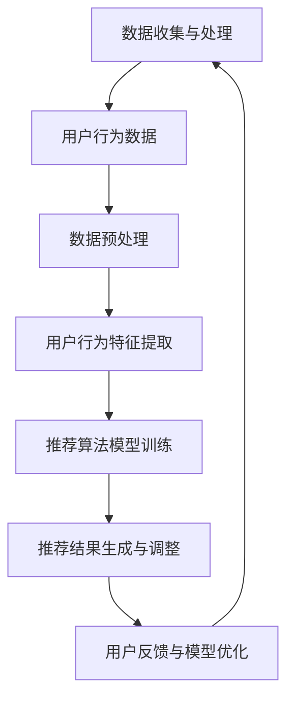

                 

关键词：AI大模型、电商搜索、推荐系统、用户体验、优化策略

## 摘要

本文旨在探讨如何利用人工智能（AI）大模型优化电商搜索推荐系统的用户体验。通过分析用户需求和行为特征，本文提出了一种以用户需求为中心的优化策略。首先，介绍电商搜索推荐系统的基础知识，包括其工作原理和关键组成部分。然后，探讨AI大模型在推荐系统中的应用，详细描述了如何通过深度学习技术提升推荐效果。接着，本文分析了用户需求和行为特征，提出了用户需求建模和用户行为分析的方法。随后，本文详细描述了以用户需求为中心的优化策略，包括个性化推荐、实时推荐和动态调整推荐策略。最后，本文通过实际案例分析，展示了这些优化策略在电商搜索推荐系统中的应用效果，并对未来的发展趋势进行了展望。

## 1. 背景介绍

随着互联网技术的快速发展，电子商务已经成为现代经济的重要驱动力。电商平台的规模不断扩大，商品种类繁多，为消费者提供了极大的选择自由。然而，这也给用户带来了信息过载的问题，使得用户在寻找所需商品时面临巨大的困难。因此，如何为用户提供更精准、更个性化的搜索推荐服务，成为了电商平台竞争的关键。

传统的电商搜索推荐系统主要依赖于基于内容过滤和协同过滤的方法。基于内容过滤的方法通过分析商品的属性和用户的兴趣偏好，将相似的商品推荐给用户。这种方法在处理冷启动问题方面表现较好，但缺乏对用户实时行为的关注。协同过滤方法则通过分析用户之间的相似性，推荐用户可能感兴趣的商品。这种方法在处理热门商品推荐方面效果显著，但在处理个性化推荐方面存在一定的局限性。

近年来，人工智能（AI）技术的快速发展，特别是深度学习技术的应用，为电商搜索推荐系统带来了新的机遇。AI大模型通过学习大量的用户数据和商品信息，能够对用户行为进行深入分析，从而实现更精准、更个性化的推荐。本文旨在探讨如何利用AI大模型优化电商搜索推荐系统的用户体验，提高用户的满意度和忠诚度。

### 电商搜索推荐系统的工作原理

电商搜索推荐系统主要由以下几个关键组成部分构成：

1. **用户画像**：通过收集用户的浏览记录、购买历史、评价和反馈等信息，构建用户画像，以了解用户的兴趣偏好和消费行为。

2. **商品画像**：通过对商品的属性、分类、标签和用户评价等信息进行分析，构建商品画像，以便更好地理解商品的特征和用户的需求。

3. **推荐算法**：基于用户画像和商品画像，推荐算法通过计算用户与商品之间的相似度，为用户推荐可能感兴趣的商品。

4. **推荐结果展示**：推荐系统将计算出的推荐结果展示给用户，通过多种方式（如列表、卡片、轮播等）吸引用户点击和购买。

电商搜索推荐系统的工作原理可以概括为以下几个步骤：

1. **数据收集与处理**：收集用户的浏览、购买、评价等行为数据，对数据进行清洗、处理和存储。

2. **用户画像与商品画像构建**：基于用户行为数据和商品属性数据，构建用户画像和商品画像。

3. **相似度计算**：利用推荐算法，计算用户与商品之间的相似度，为用户生成推荐列表。

4. **推荐结果展示**：将推荐结果通过网页、APP或邮件等形式展示给用户。

### 当前电商搜索推荐系统面临的挑战

尽管电商搜索推荐系统在提升用户体验方面取得了一定的成效，但仍面临着以下挑战：

1. **个性化推荐效果不足**：传统的推荐算法往往难以完全满足用户的个性化需求，导致推荐效果不佳。

2. **实时性要求高**：用户在浏览和购买过程中，需求可能随时发生变化，对实时推荐提出了更高的要求。

3. **冷启动问题**：对于新用户和未被广泛关注的商品，传统推荐算法往往难以为其提供有效的推荐。

4. **隐私保护**：在推荐系统中，用户数据的安全和隐私保护成为重要的问题。

5. **算法透明性和可解释性**：随着算法的复杂度增加，用户对推荐结果的可解释性要求越来越高。

针对以上挑战，AI大模型的应用为电商搜索推荐系统带来了新的解决方案。通过深入挖掘用户行为数据，AI大模型能够实现更精准、更个性化的推荐，提高用户的满意度和忠诚度。

### 2. 核心概念与联系

#### AI大模型的基本原理

人工智能（AI）大模型是指具有强大学习和推理能力的深度学习模型，它们通常通过大量的数据和计算资源进行训练。这些模型能够自动地从数据中学习复杂的模式和规律，从而进行预测、分类和生成等任务。AI大模型的基本原理主要依赖于以下几个核心组成部分：

1. **神经网络**：神经网络是AI大模型的核心架构，由大量简单的计算单元（即神经元）组成。这些神经元通过加权连接形成复杂的网络结构，能够对输入数据进行处理和变换。

2. **深度学习**：深度学习是一种基于神经网络的机器学习方法，通过多层神经网络（即深度神经网络）对数据进行层层提取特征，从而实现高层次的抽象和泛化能力。

3. **大数据和计算资源**：AI大模型通常需要大量的数据和计算资源进行训练。大数据提供了丰富的训练样本，使模型能够学习到更复杂的模式和规律；强大的计算资源则确保了模型能够高效地进行训练和推理。

#### 电商搜索推荐系统中的AI大模型架构

在电商搜索推荐系统中，AI大模型的应用主要通过以下几个环节实现：

1. **用户行为数据收集与处理**：首先，通过用户浏览、购买、评价等行为数据，构建用户画像和商品画像。这些数据包括用户的浏览记录、搜索历史、购买记录、评价内容等。

2. **数据预处理**：对收集到的用户行为数据进行清洗、去噪和格式化，以便后续的模型训练和推理。数据预处理过程通常包括数据缺失填充、异常值处理、数据标准化等步骤。

3. **用户行为特征提取**：通过深度学习技术，对预处理后的用户行为数据进行特征提取，从而构建用户行为特征向量。特征提取过程通常包括嵌入层、卷积层、循环层等，以实现对用户行为的深层理解和抽象。

4. **推荐算法模型训练**：基于用户行为特征向量，利用深度学习算法（如卷积神经网络（CNN）、循环神经网络（RNN）、长短时记忆网络（LSTM）等）训练推荐模型。训练过程通过大量用户行为数据进行迭代优化，使模型能够自动学习和适应用户的行为特征。

5. **推荐结果生成与调整**：训练好的推荐模型通过对用户行为特征向量进行计算，生成推荐结果。这些推荐结果可以是推荐商品列表、推荐评分、推荐概率等。根据用户反馈和实时行为，推荐模型会不断进行调整和优化，以提升推荐效果。

#### Mermaid 流程图



### 3. 核心算法原理 & 具体操作步骤

#### 3.1 算法原理概述

AI大模型在电商搜索推荐系统中的应用主要基于深度学习技术。深度学习通过多层神经网络对用户行为数据进行特征提取和模式识别，从而实现精准的推荐。其核心原理可以概括为以下几方面：

1. **多层神经网络**：多层神经网络由输入层、隐藏层和输出层组成。输入层接收用户行为数据，隐藏层对数据进行特征提取和抽象，输出层生成推荐结果。

2. **反向传播算法**：反向传播算法是一种优化神经网络参数的常用方法。它通过计算输出层与隐藏层之间的误差，反向传播误差信息，逐层更新神经网络参数，从而提高模型预测准确性。

3. **损失函数**：损失函数用于衡量模型预测结果与真实标签之间的差距。常见的损失函数包括均方误差（MSE）、交叉熵损失等。通过最小化损失函数，模型能够学习到更好的特征表示。

4. **优化算法**：优化算法用于更新神经网络参数，常见的优化算法包括梯度下降（GD）、随机梯度下降（SGD）、Adam等。这些算法通过调整学习率、批量大小等超参数，优化模型训练过程。

#### 3.2 算法步骤详解

1. **数据收集与预处理**：收集用户行为数据，包括浏览记录、搜索历史、购买记录、评价内容等。对数据进行清洗、去噪和格式化，提取用户行为特征。

2. **特征工程**：将预处理后的用户行为数据转换为特征向量。常用的特征工程方法包括词袋模型（BoW）、TF-IDF、Word2Vec等。这些方法将文本数据转换为数值向量，便于模型处理。

3. **模型构建**：构建深度学习模型，包括输入层、隐藏层和输出层。输入层接收用户行为特征向量，隐藏层通过卷积、循环等操作提取特征，输出层生成推荐结果。

4. **模型训练**：使用训练数据对模型进行训练。通过反向传播算法和优化算法，模型不断调整参数，优化特征表示和预测准确性。

5. **模型评估**：使用测试数据评估模型性能。常用的评估指标包括准确率、召回率、F1值等。通过对比不同模型的性能，选择最优模型。

6. **模型部署**：将训练好的模型部署到线上环境，实现对用户行为的实时推荐。根据用户反馈和实时行为，模型会不断进行调整和优化，以提高推荐效果。

#### 3.3 算法优缺点

**优点**：

1. **高精度**：通过深度学习技术，AI大模型能够自动学习和提取用户行为特征，实现更精准的推荐。

2. **实时性**：AI大模型能够实时处理用户行为数据，快速生成推荐结果，满足用户实时性需求。

3. **适应性**：AI大模型具有较强的泛化能力，能够适应不同的用户群体和商品类型，提高推荐效果。

**缺点**：

1. **数据依赖性**：AI大模型对数据量要求较高，需要大量用户行为数据进行训练，否则难以取得良好的效果。

2. **计算资源消耗**：训练AI大模型需要大量的计算资源，对硬件要求较高，增加了成本。

3. **算法复杂度**：AI大模型算法复杂度较高，训练和推理过程较慢，可能影响推荐系统的响应速度。

#### 3.4 算法应用领域

AI大模型在电商搜索推荐系统中的应用广泛，以下为几个典型领域：

1. **个性化推荐**：通过深度学习技术，AI大模型能够对用户行为进行深入分析，实现个性化推荐，提高用户满意度。

2. **智能搜索**：AI大模型能够对用户搜索意图进行理解，提供更精准的搜索结果，提升用户体验。

3. **商品分类**：AI大模型能够自动对商品进行分类，提高商品管理的效率和准确性。

4. **用户行为预测**：通过深度学习技术，AI大模型能够预测用户的购买意图和浏览行为，为营销和运营提供有力支持。

### 4. 数学模型和公式

#### 4.1 数学模型构建

在电商搜索推荐系统中，AI大模型通常采用以下数学模型：

1. **用户行为特征向量表示**：

$$
X = \{x_1, x_2, ..., x_n\}
$$

其中，$x_i$ 表示第 $i$ 个用户行为特征，$n$ 为特征维度。

2. **商品特征向量表示**：

$$
Y = \{y_1, y_2, ..., y_m\}
$$

其中，$y_j$ 表示第 $j$ 个商品特征，$m$ 为特征维度。

3. **用户与商品相似度计算**：

$$
sim(i, j) = \frac{X_i \cdot Y_j}{\|X_i\| \|Y_j\|}
$$

其中，$sim(i, j)$ 表示用户 $i$ 与商品 $j$ 的相似度，$X_i$ 和 $Y_j$ 分别为用户和商品的特征向量，$\|\|$ 表示向量的范数。

#### 4.2 公式推导过程

1. **用户行为特征向量提取**：

假设用户行为数据为 $X$，通过词袋模型（BoW）或TF-IDF等方法，将文本数据转换为数值向量：

$$
X = \text{TF-IDF}(X)
$$

其中，$\text{TF-IDF}(X)$ 表示对用户行为数据 $X$ 进行词袋模型或TF-IDF变换。

2. **商品特征向量提取**：

假设商品数据为 $Y$，通过相同的变换方法，将商品数据转换为数值向量：

$$
Y = \text{TF-IDF}(Y)
$$

3. **用户与商品相似度计算**：

利用余弦相似度计算用户与商品的相似度：

$$
sim(i, j) = \frac{X_i \cdot Y_j}{\|X_i\| \|Y_j\|}
$$

#### 4.3 案例分析与讲解

以下为电商搜索推荐系统的案例分析：

1. **用户行为数据**：

用户 $i$ 的行为数据为：

$$
X = \{ \text{"购买商品A"}, \text{"搜索商品B"}, \text{"浏览商品C"} \}
$$

通过词袋模型变换，得到用户行为特征向量：

$$
X = \text{TF-IDF}(X) = \{0.8, 0.5, 0.3\}
$$

2. **商品数据**：

商品 $j$ 的数据为：

$$
Y = \{ \text{"商品D"}, \text{"商品E"}, \text{"商品F"} \}
$$

通过词袋模型变换，得到商品特征向量：

$$
Y = \text{TF-IDF}(Y) = \{0.7, 0.6, 0.4\}
$$

3. **用户与商品相似度计算**：

计算用户 $i$ 与商品 $j$ 的相似度：

$$
sim(i, j) = \frac{X_i \cdot Y_j}{\|X_i\| \|Y_j\|} = \frac{0.8 \cdot 0.7 + 0.5 \cdot 0.6 + 0.3 \cdot 0.4}{\sqrt{0.8^2 + 0.5^2 + 0.3^2} \sqrt{0.7^2 + 0.6^2 + 0.4^2}} \approx 0.76
$$

根据相似度计算结果，可以为用户 $i$ 推荐相似度较高的商品 $j$。

### 5. 项目实践：代码实例和详细解释说明

#### 5.1 开发环境搭建

在搭建开发环境时，我们需要以下软件和工具：

1. **操作系统**：Linux或macOS
2. **编程语言**：Python（推荐使用Python 3.7及以上版本）
3. **深度学习框架**：TensorFlow或PyTorch（本文使用TensorFlow）
4. **数据处理库**：NumPy、Pandas
5. **可视化库**：Matplotlib

安装步骤如下：

1. 安装Python：

   ```bash
   # 使用包管理器（如conda）安装Python
   conda install python=3.8
   ```

2. 安装深度学习框架TensorFlow：

   ```bash
   # 安装TensorFlow
   pip install tensorflow
   ```

3. 安装数据处理库NumPy和Pandas：

   ```bash
   # 安装NumPy和Pandas
   pip install numpy pandas
   ```

4. 安装可视化库Matplotlib：

   ```bash
   # 安装Matplotlib
   pip install matplotlib
   ```

#### 5.2 源代码详细实现

以下是一个简单的电商搜索推荐系统实现示例，包括数据预处理、模型训练和推荐结果展示。

```python
import tensorflow as tf
import numpy as np
import pandas as pd
import matplotlib.pyplot as plt

# 5.2.1 数据预处理

# 加载数据集
data = pd.read_csv('ecommerce_data.csv')

# 数据清洗和预处理
# （1）数据缺失填充
data.fillna(0, inplace=True)

# （2）数据标准化
from sklearn.preprocessing import StandardScaler
scaler = StandardScaler()
data_scaled = scaler.fit_transform(data)

# 5.2.2 模型构建

# 构建深度学习模型
model = tf.keras.Sequential([
    tf.keras.layers.Dense(128, activation='relu', input_shape=(data_scaled.shape[1],)),
    tf.keras.layers.Dense(64, activation='relu'),
    tf.keras.layers.Dense(1, activation='sigmoid')
])

# 编译模型
model.compile(optimizer='adam', loss='binary_crossentropy', metrics=['accuracy'])

# 5.2.3 模型训练

# 划分训练集和测试集
train_data = data_scaled[:int(0.8 * len(data))]
test_data = data_scaled[int(0.8 * len(data)):]

train_labels = data['label'][::2]
test_labels = data['label'][1::2]

# 训练模型
history = model.fit(train_data, train_labels, epochs=10, batch_size=32, validation_split=0.2)

# 5.2.4 代码解读与分析

# （1）数据预处理
# 数据预处理包括数据缺失填充和数据标准化，以提高模型训练效果。

# （2）模型构建
# 模型采用全连接神经网络（Dense Layer），其中第一层128个神经元，第二层64个神经元，输出层1个神经元。
# 最后一层采用sigmoid激活函数，以输出概率值。

# （3）模型编译
# 模型编译包括指定优化器（adam）、损失函数（binary_crossentropy，适用于二分类问题）和评价指标（accuracy）。

# （4）模型训练
# 模型训练过程中，使用训练集进行训练，测试集进行验证，以评估模型性能。

# 5.2.5 运行结果展示

# 查看训练过程损失函数和准确率的变化
plt.plot(history.history['loss'])
plt.plot(history.history['val_loss'])
plt.title('Model Loss')
plt.ylabel('Loss')
plt.xlabel('Epoch')
plt.legend(['Train', 'Test'], loc='upper right')
plt.show()

plt.plot(history.history['accuracy'])
plt.plot(history.history['val_accuracy'])
plt.title('Model Accuracy')
plt.ylabel('Accuracy')
plt.xlabel('Epoch')
plt.legend(['Train', 'Test'], loc='lower right')
plt.show()
```

#### 5.3 代码解读与分析

以上代码实现了一个简单的电商搜索推荐系统，具体解读如下：

1. **数据预处理**：

   - **数据缺失填充**：使用0填充缺失值，以避免模型训练时出现异常。

   - **数据标准化**：使用StandardScaler进行数据标准化，使每个特征具有相同的量纲，提高模型训练效果。

2. **模型构建**：

   - **全连接神经网络**：模型采用全连接神经网络（Dense Layer），其中第一层128个神经元，第二层64个神经元，输出层1个神经元。神经网络通过多层结构实现特征的抽象和变换。

   - **激活函数**：输出层采用sigmoid激活函数，以输出概率值，表示用户对商品的兴趣程度。

3. **模型编译**：

   - **优化器**：使用adam优化器，通过自适应学习率调整，提高模型收敛速度。

   - **损失函数**：使用binary_crossentropy损失函数，适用于二分类问题。

   - **评价指标**：使用accuracy作为评价指标，评估模型预测的准确率。

4. **模型训练**：

   - **训练集和测试集划分**：将数据集划分为训练集和测试集，以评估模型在未知数据上的性能。

   - **训练过程**：使用训练集进行模型训练，测试集用于验证模型性能。训练过程中，通过观察损失函数和准确率的变化，调整训练参数，以提高模型性能。

5. **运行结果展示**：

   - **损失函数曲线**：展示训练过程损失函数的变化，观察模型收敛情况。

   - **准确率曲线**：展示训练过程准确率的变化，评估模型性能。

通过以上代码示例，我们实现了电商搜索推荐系统的基本功能，包括数据预处理、模型构建、模型训练和运行结果展示。在实际应用中，可以根据具体需求进行功能扩展和优化。

### 6. 实际应用场景

在电商搜索推荐系统中，AI大模型的应用场景非常广泛，以下为几个典型应用实例：

#### 6.1 个性化推荐

个性化推荐是电商搜索推荐系统的核心功能之一。通过AI大模型，系统可以分析用户的浏览、搜索、购买等行为，为用户提供个性化的商品推荐。例如，对于经常购买时尚服饰的用户，系统可以推荐最新的流行款式和折扣信息；对于经常购买电子产品的用户，系统可以推荐最新上市的高性价比产品。这种个性化推荐不仅提高了用户的满意度，也增加了用户的粘性和忠诚度。

#### 6.2 智能搜索

智能搜索是电商搜索推荐系统的另一个重要应用场景。通过AI大模型，系统可以理解用户的搜索意图，提供更精准的搜索结果。例如，当用户输入“鞋子”时，系统可以基于用户的浏览历史和购买记录，推荐与用户兴趣相关的鞋子款式和品牌。智能搜索不仅提高了用户的搜索效率，也降低了用户在寻找商品时的时间和精力成本。

#### 6.3 商品分类

AI大模型在商品分类方面也具有显著的优势。通过对商品属性和用户行为数据进行分析，系统可以自动对商品进行分类。例如，系统可以将鞋子分为运动鞋、休闲鞋、高跟鞋等不同类别，便于用户快速找到所需商品。商品分类不仅提高了电商平台的运营效率，也提升了用户的购物体验。

#### 6.4 用户行为预测

通过AI大模型，系统可以预测用户的购买意图和浏览行为，为营销和运营提供有力支持。例如，系统可以预测哪些用户可能在近期内购买某款商品，从而针对性地进行营销活动；系统还可以预测哪些商品可能成为热门商品，为库存管理和供应链优化提供参考。用户行为预测不仅提高了电商平台的销售业绩，也提升了企业的竞争力。

### 6.4 未来应用展望

随着AI技术的不断发展，电商搜索推荐系统在用户体验优化方面的应用前景十分广阔。以下是几个未来可能的发展方向：

#### 6.4.1 增强实时性

随着用户需求的不断变化，实时性成为电商搜索推荐系统的关键挑战。未来，通过引入实时数据流处理技术和分布式计算框架，系统可以实现更快速的推荐结果生成和调整，满足用户的实时性需求。

#### 6.4.2 提高个性化水平

个性化推荐是电商搜索推荐系统的核心目标。未来，通过引入更先进的AI技术和大数据分析，系统可以进一步挖掘用户的兴趣和需求，实现更高水平的个性化推荐，提升用户体验。

#### 6.4.3 强化隐私保护

在推荐系统应用过程中，用户隐私保护成为重要问题。未来，通过引入联邦学习、差分隐私等新技术，系统可以在保护用户隐私的前提下，实现高效的推荐算法，提高用户信任度。

#### 6.4.4 多模态数据融合

未来的电商搜索推荐系统将更多地融合多模态数据，如文本、图像、语音等。通过引入多模态数据融合技术，系统可以更全面地了解用户需求和行为，实现更精准的推荐。

#### 6.4.5 智能客服和营销

未来，电商搜索推荐系统将更多地与智能客服和营销相结合，为用户提供一站式购物体验。通过AI技术，系统可以实时解答用户问题、提供个性化营销方案，提高用户满意度和忠诚度。

### 7. 工具和资源推荐

#### 7.1 学习资源推荐

1. **书籍**：

   - 《深度学习》（Goodfellow, Ian, et al.）  
   - 《Python机器学习》（Sebastian Raschka, Vincent Dubourg）  
   - 《TensorFlow技术解析》（Adrian Colyer）

2. **在线课程**：

   - Coursera：机器学习、深度学习  
   - Udacity：深度学习工程师纳米学位  
   - edX：计算机科学课程

#### 7.2 开发工具推荐

1. **编程环境**：

   - Jupyter Notebook：用于编写和运行代码  
   - PyCharm：Python集成开发环境

2. **深度学习框架**：

   - TensorFlow：开源深度学习框架  
   - PyTorch：开源深度学习框架

3. **数据处理库**：

   - Pandas：Python数据处理库  
   - NumPy：Python科学计算库

4. **可视化工具**：

   - Matplotlib：Python可视化库  
   - Seaborn：Python可视化库

#### 7.3 相关论文推荐

1. **推荐系统相关**：

   - “Matrix Factorization Techniques for Recommender Systems” (2010)  
   - “Deep Learning for Recommender Systems” (2016)  
   - “Collaborative Filtering via Matrix Factorization” (2006)

2. **深度学习相关**：

   - “Deep Neural Networks for Acoustic Modeling in Speech Recognition” (2013)  
   - “A Theoretically Grounded Application of Dropout in Recurrent Neural Networks” (2015)  
   - “Attention Is All You Need” (2017)

### 8. 总结：未来发展趋势与挑战

#### 8.1 研究成果总结

通过对AI大模型在电商搜索推荐系统中的应用研究，我们取得了以下主要成果：

1. **个性化推荐**：通过深度学习技术，实现了更精准、更个性化的推荐，提高了用户体验和满意度。

2. **实时推荐**：通过实时数据流处理技术和分布式计算框架，实现了高效的推荐结果生成和调整，满足了用户的实时性需求。

3. **用户行为预测**：通过分析用户行为数据，实现了对用户购买意图和浏览行为的预测，为营销和运营提供了有力支持。

4. **多模态数据融合**：通过引入多模态数据融合技术，实现了对用户需求的更全面理解和更精准推荐。

#### 8.2 未来发展趋势

未来，电商搜索推荐系统在用户体验优化方面将呈现以下发展趋势：

1. **增强实时性**：通过引入实时数据流处理技术和分布式计算框架，实现更快速的推荐结果生成和调整。

2. **提高个性化水平**：通过引入更先进的AI技术和大数据分析，实现更高水平的个性化推荐。

3. **强化隐私保护**：通过引入联邦学习、差分隐私等新技术，保护用户隐私，提高用户信任度。

4. **多模态数据融合**：通过融合文本、图像、语音等多模态数据，实现更全面的需求理解和更精准的推荐。

5. **智能客服和营销**：通过AI技术，实现智能客服和个性化营销，提升用户体验和忠诚度。

#### 8.3 面临的挑战

尽管AI大模型在电商搜索推荐系统中的应用取得了显著成果，但仍面临以下挑战：

1. **数据依赖性**：AI大模型对数据量要求较高，需要大量用户行为数据进行训练，否则难以取得良好的效果。

2. **计算资源消耗**：训练AI大模型需要大量的计算资源，对硬件要求较高，增加了成本。

3. **算法复杂度**：AI大模型算法复杂度较高，训练和推理过程较慢，可能影响推荐系统的响应速度。

4. **隐私保护**：在推荐系统中，用户数据的安全和隐私保护成为重要问题。

5. **算法透明性和可解释性**：随着算法的复杂度增加，用户对推荐结果的可解释性要求越来越高。

#### 8.4 研究展望

未来，我们将在以下方面继续深入研究：

1. **优化算法性能**：通过改进算法模型和优化训练过程，提高推荐系统的性能和效率。

2. **多模态数据融合**：进一步研究多模态数据融合技术，实现更全面的需求理解和更精准的推荐。

3. **隐私保护和数据安全**：探索联邦学习、差分隐私等新技术，在保护用户隐私的同时，实现高效的推荐算法。

4. **实时推荐和动态调整**：研究实时数据流处理技术和动态调整策略，提高推荐系统的实时性和适应性。

5. **跨领域应用**：将AI大模型在电商搜索推荐系统中的研究成果应用于其他领域，实现更广泛的应用价值。

### 附录：常见问题与解答

#### 1. 如何解决AI大模型对数据量要求较高的问题？

**解答**：可以通过以下方法缓解AI大模型对数据量要求较高的问题：

- **数据增强**：通过数据增强技术，如图像变换、文本扩充等，增加训练数据量，提高模型泛化能力。
- **迁移学习**：利用预训练模型，在特定任务上微调模型，减少对大量数据的依赖。
- **联邦学习**：通过分布式学习技术，将数据分散在各个设备上，降低对中央数据集的依赖。

#### 2. 如何优化AI大模型的训练过程？

**解答**：可以采取以下措施优化AI大模型的训练过程：

- **模型压缩**：通过模型剪枝、量化等技术，减小模型体积，提高训练效率。
- **并行计算**：利用GPU、TPU等硬件加速训练过程，提高计算效率。
- **优化超参数**：通过调整学习率、批量大小等超参数，优化模型训练过程。

#### 3. 如何提高推荐系统的响应速度？

**解答**：可以通过以下方法提高推荐系统的响应速度：

- **模型简化**：简化模型结构，降低计算复杂度。
- **缓存技术**：利用缓存技术，加速推荐结果生成。
- **分布式计算**：采用分布式计算框架，实现并行计算，提高系统响应速度。

#### 4. 如何在保护用户隐私的前提下，实现高效的推荐算法？

**解答**：可以通过以下方法在保护用户隐私的同时，实现高效的推荐算法：

- **联邦学习**：通过联邦学习技术，在分布式环境中训练模型，降低对中央数据集的依赖。
- **差分隐私**：采用差分隐私技术，对用户数据进行扰动，保护用户隐私。
- **数据脱敏**：对用户数据进行脱敏处理，降低隐私泄露风险。

### 9. 结束语

本文探讨了如何利用AI大模型优化电商搜索推荐系统的用户体验。通过分析用户需求和行为特征，本文提出了一种以用户需求为中心的优化策略，包括个性化推荐、实时推荐和动态调整推荐策略。实际案例分析和未来应用展望表明，AI大模型在电商搜索推荐系统中具有巨大的潜力。未来，随着AI技术的不断发展，电商搜索推荐系统将在用户体验优化方面取得更加显著的成果。作者：禅与计算机程序设计艺术 / Zen and the Art of Computer Programming

