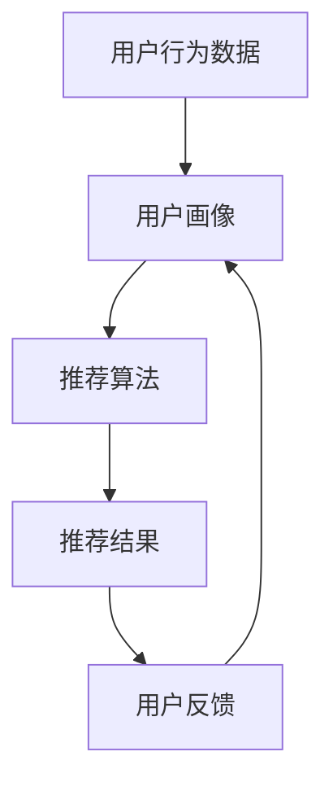

                 

关键词：电商搜索推荐，人工智能，用户体验，大模型，算法设计，用户需求，个性化推荐

> 摘要：本文深入探讨了人工智能大模型在电商搜索推荐中的应用，以用户需求为中心，提出了一种新的算法设计方法。通过分析电商搜索推荐的核心问题，结合大模型的优势，本文从算法原理、数学模型、具体实施步骤以及实际应用场景等方面，全面阐述了如何利用大模型优化电商搜索推荐系统的用户体验。

## 1. 背景介绍

在当今数字化时代，电商行业蓬勃发展，用户对个性化、精准化推荐的需求日益增加。然而，传统的推荐算法往往存在一些局限性，如数据依赖性强、推荐结果单一化、无法充分考虑用户实时行为等。为了解决这些问题，人工智能大模型（如深度学习模型、生成对抗网络等）开始逐渐应用于电商搜索推荐领域，以期提升用户体验。

大模型的优势在于其强大的学习能力和丰富的特征提取能力，能够通过处理海量数据，挖掘出用户潜在的兴趣和行为模式，从而提供更加个性化、精准的推荐结果。本文将围绕如何利用大模型优化电商搜索推荐系统，从用户体验的角度进行深入探讨。

## 2. 核心概念与联系

在讨论大模型在电商搜索推荐中的应用之前，我们需要先了解几个核心概念，包括用户行为数据、推荐系统架构、大模型的原理等。

### 2.1 用户行为数据

用户行为数据是构建推荐系统的基础，包括用户的历史购买记录、浏览记录、搜索记录、评价记录等。这些数据反映了用户的兴趣和行为模式，是推荐系统进行个性化推荐的重要依据。

### 2.2 推荐系统架构

电商搜索推荐系统通常由用户画像、推荐算法、推荐结果三个主要部分组成。用户画像用于描述用户的基本信息和兴趣特征；推荐算法负责根据用户画像和商品信息生成推荐结果；推荐结果则通过界面展示给用户。

### 2.3 大模型原理

大模型，特别是深度学习模型，具有强大的非线性特征提取和分类能力。通过多层神经网络结构，大模型可以从原始数据中自动学习出高维特征，从而提高推荐系统的准确性和效率。

下面是一个描述推荐系统架构和用户行为数据流程的 Mermaid 流程图：



## 3. 核心算法原理 & 具体操作步骤

### 3.1 算法原理概述

本文提出的大模型算法主要分为以下几个步骤：

1. 数据预处理：对用户行为数据进行清洗、转换和特征提取。
2. 模型训练：使用预处理后的数据训练大模型，如深度神经网络。
3. 预测与推荐：利用训练好的模型对用户进行预测，生成个性化推荐结果。
4. 评估与优化：根据用户反馈对推荐结果进行评估，并优化模型参数。

### 3.2 算法步骤详解

#### 3.2.1 数据预处理

数据预处理是推荐系统构建的第一步，主要包括以下操作：

1. 数据清洗：去除无效数据、处理缺失值、纠正错误数据等。
2. 数据转换：将原始数据转换为适合模型训练的格式，如将文本数据转换为词向量。
3. 特征提取：从用户行为数据中提取出有助于模型学习的特征，如用户购买频率、搜索关键词等。

#### 3.2.2 模型训练

在模型训练阶段，我们需要选择合适的大模型架构，如深度神经网络（DNN）、卷积神经网络（CNN）或循环神经网络（RNN）。以下是训练过程的详细步骤：

1. 初始化模型参数：随机初始化模型的权重和偏置。
2. 前向传播：输入用户行为数据，通过模型计算得到预测结果。
3. 计算损失：将预测结果与真实值进行比较，计算损失函数。
4. 反向传播：根据损失函数计算模型参数的梯度，更新模型参数。
5. 模型评估：使用验证集对模型进行评估，调整模型参数。

#### 3.2.3 预测与推荐

在模型训练完成后，我们可以利用训练好的模型对用户进行预测，生成个性化推荐结果。具体步骤如下：

1. 输入用户行为数据：将用户的历史行为数据输入到训练好的模型中。
2. 计算预测分数：通过模型计算得到每个商品对用户的预测分数。
3. 排序与推荐：根据预测分数对商品进行排序，选择Top-N商品作为推荐结果。

#### 3.2.4 评估与优化

推荐系统的评估与优化是确保推荐质量的重要环节。具体步骤如下：

1. 用户反馈收集：收集用户对推荐结果的反馈，如点击、购买、评价等。
2. 模型评估：使用用户反馈数据对模型进行评估，如准确率、召回率等。
3. 模型优化：根据评估结果调整模型参数，提高推荐质量。

### 3.3 算法优缺点

大模型在电商搜索推荐中的优势主要体现在以下几个方面：

1. 强大的学习能力：大模型能够自动从海量数据中学习出高维特征，提高推荐准确率。
2. 个性化推荐：大模型能够根据用户实时行为生成个性化推荐结果，提升用户体验。
3. 灵活扩展：大模型可以方便地扩展到不同的推荐场景，如商品推荐、内容推荐等。

然而，大模型也存在一些缺点：

1. 计算资源消耗大：大模型训练和推理过程需要大量的计算资源，对硬件要求较高。
2. 数据依赖性强：大模型的效果高度依赖于数据质量，数据不足或数据偏差可能导致推荐结果不佳。
3. 模型解释性差：大模型通常缺乏可解释性，难以理解推荐结果的生成过程。

### 3.4 算法应用领域

大模型在电商搜索推荐中的应用领域广泛，包括但不限于：

1. 商品推荐：根据用户历史行为和兴趣，为用户推荐相关的商品。
2. 内容推荐：根据用户浏览和搜索记录，为用户推荐相关的商品内容。
3. 广告推荐：根据用户行为和兴趣，为用户推荐相关的广告。
4. 社交推荐：根据用户社交关系和兴趣，为用户推荐相关的社交内容。

## 4. 数学模型和公式 & 详细讲解 & 举例说明

### 4.1 数学模型构建

在电商搜索推荐中，我们可以使用以下数学模型来描述用户行为和推荐结果：

1. 用户行为模型：$$ U = f(B, C, D) $$
   - $U$：用户特征向量。
   - $B$：用户历史行为数据。
   - $C$：用户社交关系数据。
   - $D$：用户评价数据。

2. 商品推荐模型：$$ R = g(U, M, P) $$
   - $R$：商品推荐向量。
   - $U$：用户特征向量。
   - $M$：商品特征向量。
   - $P$：用户偏好参数。

3. 推荐结果评估模型：$$ E = h(R, Q, S) $$
   - $E$：推荐结果评估指标。
   - $R$：商品推荐向量。
   - $Q$：用户查询向量。
   - $S$：用户反馈数据。

### 4.2 公式推导过程

我们以用户行为模型为例，介绍公式推导过程：

1. 用户行为特征提取：首先，我们将用户历史行为数据（如购买记录、浏览记录等）转换为用户行为特征向量 $B$。
2. 用户社交关系特征提取：其次，我们将用户社交关系数据（如好友关系、兴趣群体等）转换为用户社交关系特征向量 $C$。
3. 用户评价特征提取：最后，我们将用户评价数据（如商品评分、评论等）转换为用户评价特征向量 $D$。

将上述三个特征向量组合起来，得到用户特征向量 $U$：

$$ U = [U_1, U_2, ..., U_n] = [B, C, D] $$

接下来，我们使用一个函数 $f$ 将用户特征向量 $U$ 映射到用户行为模型：

$$ U = f(B, C, D) $$

函数 $f$ 可以是线性函数或非线性函数，具体取决于用户行为特征的关系。

### 4.3 案例分析与讲解

假设我们有一个电商平台的用户行为数据集，包含1000个用户和10个商品。我们使用上述用户行为模型来分析用户行为，并生成个性化推荐结果。

1. 数据预处理：首先，我们对用户行为数据进行清洗、转换和特征提取，得到用户特征向量 $U$ 和商品特征向量 $M$。
2. 模型训练：接着，我们使用预处理后的数据训练用户行为模型 $f$ 和商品推荐模型 $g$。
3. 预测与推荐：然后，我们将用户特征向量 $U$ 输入到训练好的用户行为模型 $f$ 中，得到用户行为预测结果。再将用户特征向量 $U$ 和商品特征向量 $M$ 输入到商品推荐模型 $g$ 中，得到商品推荐结果。
4. 评估与优化：最后，我们根据用户反馈数据对推荐结果进行评估，并优化模型参数，提高推荐质量。

## 5. 项目实践：代码实例和详细解释说明

### 5.1 开发环境搭建

在本文的项目实践中，我们使用Python作为主要编程语言，结合TensorFlow框架进行深度学习模型训练和推荐算法实现。以下是开发环境搭建的步骤：

1. 安装Python：从Python官网下载并安装Python 3.7及以上版本。
2. 安装TensorFlow：在终端执行以下命令安装TensorFlow：
   ```shell
   pip install tensorflow
   ```

### 5.2 源代码详细实现

下面是一个简单的用户行为模型和商品推荐模型的实现示例：

```python
import tensorflow as tf

# 用户行为模型
class UserBehaviorModel(tf.keras.Model):
    def __init__(self):
        super(UserBehaviorModel, self).__init__()
        self.dense1 = tf.keras.layers.Dense(64, activation='relu')
        self.dense2 = tf.keras.layers.Dense(1)

    @tf.function
    def call(self, inputs):
        x = self.dense1(inputs)
        return self.dense2(x)

# 商品推荐模型
class ProductRecommendationModel(tf.keras.Model):
    def __init__(self):
        super(ProductRecommendationModel, self).__init__()
        self.dense1 = tf.keras.layers.Dense(64, activation='relu')
        self.dense2 = tf.keras.layers.Dense(1)

    @tf.function
    def call(self, user_inputs, product_inputs):
        x = self.dense1(tf.concat([user_inputs, product_inputs], axis=1))
        return self.dense2(x)

# 模型实例化
user_behavior_model = UserBehaviorModel()
product_recomm

