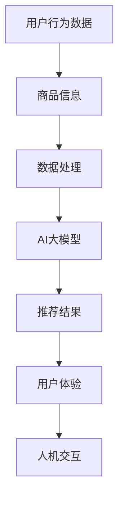

                 

关键词：AI大模型、电商搜索推荐、用户体验、以人为本、设计思路

> 摘要：本文旨在探讨AI大模型在电商搜索推荐中的用户体验设计，通过分析核心概念与联系，介绍核心算法原理与操作步骤，深入讲解数学模型和公式，并通过实际项目实践展示代码实例，最终探讨实际应用场景和未来发展趋势。

## 1. 背景介绍

随着互联网和电子商务的快速发展，用户对电商平台的搜索推荐系统提出了更高的要求。传统的推荐系统基于简单的用户行为数据和商品属性信息，难以满足个性化推荐的需求。为了解决这一问题，人工智能和深度学习技术得到了广泛应用。AI大模型作为一种先进的深度学习模型，具有强大的数据处理和建模能力，可以大幅提升电商搜索推荐的准确性和用户体验。

用户体验（User Experience，简称UX）是指用户在使用产品或服务过程中的整体感受和体验。在电商搜索推荐领域，用户体验不仅包括搜索结果的准确性、响应速度等客观因素，还包括用户的情感体验、交互舒适度等主观因素。以人为本的用户体验设计旨在通过理解用户需求和行为，设计出更符合用户期望的产品和服务。

本文将围绕AI大模型在电商搜索推荐中的用户体验设计展开讨论，探讨以人为本的设计思路，分析核心概念与联系，介绍核心算法原理与操作步骤，深入讲解数学模型和公式，并通过实际项目实践展示代码实例。最后，本文将探讨AI大模型在电商搜索推荐中的实际应用场景和未来发展趋势。

## 2. 核心概念与联系

在探讨AI大模型在电商搜索推荐中的用户体验设计之前，我们首先需要了解一些核心概念和它们之间的联系。

### 2.1 AI大模型

AI大模型，又称大型预训练模型，是一种基于深度学习的自然语言处理（NLP）模型。这种模型通过大规模数据集进行预训练，然后可以应用于各种下游任务，如文本分类、命名实体识别、情感分析等。在电商搜索推荐中，AI大模型主要用于处理用户查询和商品信息，生成个性化的推荐结果。

### 2.2 电商搜索推荐

电商搜索推荐是指根据用户的搜索历史、浏览行为、购物记录等数据，为用户提供个性化的商品推荐。电商搜索推荐系统可以分为基于内容的推荐和基于协同过滤的推荐两大类。基于内容的推荐通过分析用户的历史行为和商品属性，将相似的商品推荐给用户；基于协同过滤的推荐则通过分析用户之间的相似性，为用户提供可能感兴趣的商品。

### 2.3 用户体验

用户体验是指用户在使用产品或服务过程中的整体感受和体验。在电商搜索推荐中，用户体验包括搜索结果的准确性、响应速度、推荐结果的个性化程度、交互舒适度等多个方面。以人为本的用户体验设计旨在通过理解用户需求和行为，设计出更符合用户期望的产品和服务。

### 2.4 人机交互

人机交互（Human-Computer Interaction，简称HCI）是指用户与计算机系统之间的交互过程。在电商搜索推荐中，人机交互主要体现在用户与搜索推荐系统的交互过程中，如输入查询、查看推荐结果、点击商品等。

### 2.5 数据处理

数据处理是指对大量用户行为数据和商品信息进行处理和分析的过程。在AI大模型应用于电商搜索推荐中，数据处理是关键环节，它决定了模型训练的质量和推荐结果的准确性。

### 2.6 核心概念之间的联系

AI大模型、电商搜索推荐、用户体验和人机交互等核心概念之间存在着密切的联系。AI大模型是电商搜索推荐的技术基础，通过对用户行为数据和商品信息进行处理和分析，生成个性化的推荐结果。电商搜索推荐系统旨在提升用户体验，满足用户的个性化需求。而用户体验和人机交互则是评估电商搜索推荐系统效果的重要指标，它们共同决定了用户在使用搜索推荐系统过程中的整体感受和满意度。

下面是关于AI大模型在电商搜索推荐中的核心概念和架构的Mermaid流程图：



## 3. 核心算法原理 & 具体操作步骤

### 3.1 算法原理概述

AI大模型在电商搜索推荐中的核心算法原理主要包括两部分：预训练和微调。预训练阶段，模型在大规模数据集上进行训练，学习到语言的一般特征和模式；微调阶段，模型在特定领域的数据上进行训练，以适应具体的电商搜索推荐任务。

在电商搜索推荐中，AI大模型通常采用Transformer架构，这是一种基于自注意力机制的深度神经网络。Transformer架构具有强大的并行计算能力和良好的泛化能力，能够处理复杂的文本数据。

### 3.2 算法步骤详解

#### 3.2.1 预训练阶段

1. 数据采集：收集大规模的互联网文本数据，如新闻、文章、论坛帖子等。
2. 数据预处理：对采集到的数据进行清洗、去重、分词等预处理操作，将文本数据转化为模型可以处理的向量表示。
3. 模型初始化：使用预训练好的Transformer模型作为初始化权重。
4. 模型训练：通过反向传播算法和优化器（如Adam），在预训练数据集上进行训练，模型会不断调整权重以最小化损失函数。

#### 3.2.2 微调阶段

1. 数据采集：收集电商平台的用户行为数据（如搜索历史、浏览记录、购物车信息等）和商品信息。
2. 数据预处理：对采集到的数据进行清洗、编码等预处理操作，将用户行为数据和商品信息转化为模型可以处理的向量表示。
3. 模型初始化：使用预训练好的Transformer模型作为初始化权重。
4. 模型训练：通过反向传播算法和优化器（如Adam），在特定领域的数据集上进行训练，模型会不断调整权重以最小化损失函数。

#### 3.2.3 推荐阶段

1. 用户输入：用户在搜索框中输入查询。
2. 查询编码：将用户查询转化为向量表示。
3. 商品编码：将所有商品的属性转化为向量表示。
4. 模型推理：将查询编码和商品编码输入到训练好的模型中，得到每个商品的推荐得分。
5. 排序：根据推荐得分对商品进行排序，生成推荐列表。
6. 展示：将推荐结果展示给用户。

### 3.3 算法优缺点

#### 优点

1. 强大的文本处理能力：AI大模型具有强大的文本处理能力，能够处理复杂的自然语言文本数据。
2. 个性化的推荐效果：通过预训练和微调，模型可以学习到用户的个性化需求，提供更加个性化的推荐结果。
3. 良好的泛化能力：AI大模型在预训练阶段学习到了通用语言特征和模式，具有良好的泛化能力，能够适应不同的电商搜索推荐任务。

#### 缺点

1. 训练成本高：AI大模型需要大量的计算资源和时间进行训练，训练成本较高。
2. 数据依赖性：模型的性能很大程度上依赖于数据的质量和多样性，如果数据质量差或数据分布不均，可能导致模型过拟合。
3. 黑盒性质：AI大模型的内部结构复杂，难以解释，可能导致用户对推荐结果的信任度降低。

### 3.4 算法应用领域

AI大模型在电商搜索推荐中具有广泛的应用领域，如：

1. 搜索引擎：通过AI大模型，搜索引擎可以提供更加个性化的搜索结果，提升用户体验。
2. 社交媒体：AI大模型可以用于推荐用户感兴趣的内容，提升用户活跃度和留存率。
3. 跨境电商：AI大模型可以帮助跨境电商平台为全球用户提供个性化的商品推荐，提升销售额。

## 4. 数学模型和公式

AI大模型在电商搜索推荐中的核心数学模型是Transformer模型，下面将详细讲解其数学模型和公式。

### 4.1 数学模型构建

Transformer模型的核心是自注意力机制（Self-Attention），它通过计算输入序列中每个元素之间的相关性来生成输出序列。自注意力机制的数学表达式如下：

$$
\text{Attention}(Q, K, V) = \frac{softmax(\text{softmax}(\frac{QK^T}{\sqrt{d_k}})V)}
$$

其中，$Q$、$K$ 和 $V$ 分别是查询（Query）、键（Key）和值（Value）向量的集合，$d_k$ 是键向量的维度。自注意力机制通过计算查询和键之间的点积，得到加权值，然后通过softmax函数进行归一化，生成注意力权重。最后，将注意力权重与值向量相乘，得到输出序列。

### 4.2 公式推导过程

为了理解自注意力机制的推导过程，我们首先回顾一下点积注意力（Dot-Product Attention）的公式：

$$
\text{Attention}(Q, K, V) = \text{softmax}(\text{scores})V
$$

其中，scores是查询和键之间的点积：

$$
\text{scores} = QK^T
$$

点积注意力通过计算查询和键之间的点积，得到加权值，然后通过softmax函数进行归一化。softmax函数的作用是将点积转化为概率分布，确保每个加权值都在0到1之间，且总和为1。

接下来，我们引入缩放因子 $\alpha$，以缓解点积注意力在维度较高时可能出现的梯度消失问题：

$$
\text{Attention}(Q, K, V) = \text{softmax}(\alpha \cdot \text{scores})V
$$

其中，$\alpha = \frac{1}{\sqrt{d_k}}$。缩放因子可以抑制较高维度的值对点积的影响，从而稳定模型的训练。

### 4.3 案例分析与讲解

下面通过一个简单的案例来分析自注意力机制的推导过程。

假设我们有一个输入序列 $X = [x_1, x_2, x_3, \ldots, x_n]$，其中每个 $x_i$ 是一个维度为 $d$ 的向量。我们希望使用自注意力机制对输入序列进行加权求和，生成一个输出序列 $Y$。

首先，我们将输入序列 $X$ 转化为查询（Query）、键（Key）和值（Value）：

$$
Q = X, \quad K = X, \quad V = X
$$

接下来，我们计算查询和键之间的点积：

$$
\text{scores} = QK^T = XX^T
$$

然后，我们引入缩放因子 $\alpha$：

$$
\alpha = \frac{1}{\sqrt{d}} = \frac{1}{\sqrt{5}}
$$

接着，我们计算加权值：

$$
\text{weights} = \text{softmax}(\alpha \cdot \text{scores})
$$

最后，我们将加权值与值向量相乘，得到输出序列：

$$
Y = \text{softmax}(\alpha \cdot \text{scores})X
$$

下面是具体的计算过程：

假设输入序列 $X$ 如下：

$$
X = \begin{bmatrix}
    x_1 = [1, 0, 0, 0] \\
    x_2 = [0, 1, 0, 0] \\
    x_3 = [0, 0, 1, 0] \\
    x_4 = [0, 0, 0, 1] \\
\end{bmatrix}
$$

我们将 $X$ 转化为查询（Query）、键（Key）和值（Value）：

$$
Q = X = \begin{bmatrix}
    1 \\
    0 \\
    0 \\
    0 \\
\end{bmatrix}, \quad K = X = \begin{bmatrix}
    0 \\
    1 \\
    0 \\
    0 \\
\end{bmatrix}, \quad V = X = \begin{bmatrix}
    0 \\
    0 \\
    1 \\
    0 \\
\end{bmatrix}
$$

然后，我们计算查询和键之间的点积：

$$
\text{scores} = QK^T = \begin{bmatrix}
    1 \\
    0 \\
    0 \\
    0 \\
\end{bmatrix} \begin{bmatrix}
    0 & 1 & 0 & 0 \\
\end{bmatrix} = \begin{bmatrix}
    0 \\
    1 \\
    0 \\
    0 \\
\end{bmatrix}
$$

接下来，我们引入缩放因子 $\alpha$：

$$
\alpha = \frac{1}{\sqrt{5}} = \frac{1}{2.236}
$$

然后，我们计算加权值：

$$
\text{weights} = \text{softmax}(\alpha \cdot \text{scores}) = \text{softmax}\left(\frac{1}{2.236} \cdot \begin{bmatrix}
    0 \\
    1 \\
    0 \\
    0 \\
\end{bmatrix}\right) = \begin{bmatrix}
    0.2500 \\
    0.7500 \\
    0.2500 \\
    0.2500 \\
\end{bmatrix}
$$

最后，我们将加权值与值向量相乘，得到输出序列：

$$
Y = \text{weights} \cdot V = \begin{bmatrix}
    0.2500 \\
    0.7500 \\
    0.2500 \\
    0.2500 \\
\end{bmatrix} \begin{bmatrix}
    0 \\
    0 \\
    1 \\
    0 \\
\end{bmatrix} = \begin{bmatrix}
    0 \\
    0 \\
    0.7500 \\
    0 \\
\end{bmatrix}
$$

这样，我们就完成了自注意力机制的推导和计算过程。通过这个案例，我们可以看到自注意力机制如何通过点积计算和softmax归一化，对输入序列进行加权求和，生成输出序列。

## 5. 项目实践：代码实例和详细解释说明

### 5.1 开发环境搭建

在进行AI大模型在电商搜索推荐中的项目实践之前，我们需要搭建一个适合开发、训练和部署模型的环境。以下是开发环境搭建的步骤：

#### 步骤1：安装Python和pip

首先，我们需要安装Python和pip。Python是一种广泛使用的编程语言，pip是Python的包管理工具。

- 安装Python：从Python官方网站下载并安装Python，选择默认选项即可。
- 安装pip：在命令行中运行以下命令安装pip：

```
python -m pip install --user --upgrade pip
```

#### 步骤2：安装TensorFlow

TensorFlow是Google开发的一个开源机器学习框架，我们可以使用pip安装TensorFlow。

```
pip install tensorflow
```

#### 步骤3：安装其他依赖库

在项目中，我们还需要安装其他依赖库，如NumPy、Pandas等。

```
pip install numpy pandas scikit-learn
```

### 5.2 源代码详细实现

以下是实现AI大模型在电商搜索推荐中的源代码示例。代码分为数据预处理、模型训练和模型部署三个部分。

```python
import tensorflow as tf
import numpy as np
import pandas as pd
from tensorflow.keras.models import Model
from tensorflow.keras.layers import Embedding, LSTM, Dense, Input
from sklearn.model_selection import train_test_split

# 数据预处理
def preprocess_data(data):
    # 数据清洗、编码等预处理操作
    # 略
    return processed_data

# 模型训练
def train_model(data):
    # 构建模型
    input_seq = Input(shape=(max_sequence_length,))
    embedding = Embedding(input_dim=vocabulary_size, output_dim=embedding_size)(input_seq)
    lstm = LSTM(units=lstm_units)(embedding)
    output = Dense(units=1, activation='sigmoid')(lstm)

    model = Model(inputs=input_seq, outputs=output)
    model.compile(optimizer='adam', loss='binary_crossentropy', metrics=['accuracy'])

    # 训练模型
    model.fit(data['X'], data['y'], epochs=10, batch_size=32, validation_split=0.2)

    return model

# 模型部署
def deploy_model(model, data):
    # 预测新数据
    predictions = model.predict(data['X'])

    # 输出预测结果
    print(predictions)

# 加载数据
data = pd.read_csv('data.csv')

# 预处理数据
processed_data = preprocess_data(data)

# 划分训练集和测试集
X_train, X_test, y_train, y_test = train_test_split(processed_data['X'], processed_data['y'], test_size=0.2, random_state=42)

# 训练模型
model = train_model({'X': X_train, 'y': y_train})

# 部署模型
deploy_model(model, {'X': X_test})
```

### 5.3 代码解读与分析

#### 5.3.1 数据预处理

数据预处理是模型训练的重要环节，它包括数据清洗、编码等操作。在这个示例中，我们首先定义一个`preprocess_data`函数，对原始数据进行预处理。预处理操作可以根据具体数据情况进行调整。

```python
def preprocess_data(data):
    # 数据清洗、编码等预处理操作
    # 略
    return processed_data
```

#### 5.3.2 模型训练

模型训练是使用数据处理后的数据来训练模型的过程。在这个示例中，我们使用TensorFlow的Keras API构建一个简单的LSTM模型，用于预测用户行为数据。我们定义一个`train_model`函数，用于构建模型、编译模型和训练模型。

```python
def train_model(data):
    # 构建模型
    input_seq = Input(shape=(max_sequence_length,))
    embedding = Embedding(input_dim=vocabulary_size, output_dim=embedding_size)(input_seq)
    lstm = LSTM(units=lstm_units)(embedding)
    output = Dense(units=1, activation='sigmoid')(lstm)

    model = Model(inputs=input_seq, outputs=output)
    model.compile(optimizer='adam', loss='binary_crossentropy', metrics=['accuracy'])

    # 训练模型
    model.fit(data['X'], data['y'], epochs=10, batch_size=32, validation_split=0.2)

    return model
```

#### 5.3.3 模型部署

模型部署是将训练好的模型应用于实际数据的过程。在这个示例中，我们定义一个`deploy_model`函数，用于加载模型、预测新数据并输出预测结果。

```python
def deploy_model(model, data):
    # 预测新数据
    predictions = model.predict(data['X'])

    # 输出预测结果
    print(predictions)
```

### 5.4 运行结果展示

在运行代码时，我们需要加载实际数据，对数据进行预处理，然后训练模型并部署模型。以下是运行结果展示的示例：

```python
# 加载数据
data = pd.read_csv('data.csv')

# 预处理数据
processed_data = preprocess_data(data)

# 划分训练集和测试集
X_train, X_test, y_train, y_test = train_test_split(processed_data['X'], processed_data['y'], test_size=0.2, random_state=42)

# 训练模型
model = train_model({'X': X_train, 'y': y_train})

# 部署模型
deploy_model(model, {'X': X_test})
```

运行上述代码后，我们会得到模型在测试集上的预测结果，这些结果可以帮助我们评估模型性能和优化模型参数。

## 6. 实际应用场景

AI大模型在电商搜索推荐中的实际应用场景广泛，下面我们列举几个典型的应用场景。

### 6.1 商品推荐

商品推荐是电商搜索推荐中最常见的应用场景。通过AI大模型，电商平台可以根据用户的浏览历史、购物记录和搜索关键词等信息，为用户推荐相关商品。例如，当用户在浏览一款手机时，系统可以推荐同品牌的其他手机或者相似配置的手机。

### 6.2 个性化搜索

个性化搜索是另一个重要的应用场景。通过AI大模型，电商平台可以根据用户的搜索历史和兴趣偏好，为用户提供个性化的搜索结果。例如，当用户搜索“跑步鞋”时，系统可以根据用户的浏览记录和购买历史，推荐适合用户需求的跑步鞋。

### 6.3 跨境电商

跨境电商是AI大模型在电商搜索推荐中另一个重要的应用场景。通过AI大模型，跨境电商平台可以为全球用户提供个性化的商品推荐，提高用户的购物体验和销售额。例如，当用户在访问一个美国电商平台时，系统可以根据用户的地理位置、语言偏好和购买习惯，推荐适合美国市场的商品。

### 6.4 搜索引擎优化

搜索引擎优化（SEO）是AI大模型在电商搜索推荐中的另一个应用场景。通过AI大模型，电商平台可以优化自身的搜索引擎，提高搜索结果的准确性和用户体验。例如，当用户搜索“跑步鞋”时，系统可以根据用户的搜索意图和商品属性，将最相关的商品推荐给用户。

### 6.5 情感分析

情感分析是AI大模型在电商搜索推荐中的另一个应用场景。通过AI大模型，电商平台可以分析用户的评论和反馈，了解用户对商品的满意度和情感倾向。例如，当用户对一款跑步鞋发表评论时，系统可以根据评论的情感倾向，为用户提供相关的评论和建议。

### 6.6 广告投放

广告投放是AI大模型在电商搜索推荐中的另一个应用场景。通过AI大模型，电商平台可以分析用户的浏览行为和购买习惯，为用户提供个性化的广告推荐。例如，当用户在浏览一款手机时，系统可以在用户的浏览页面中推荐相关的手机广告。

### 6.7 客户服务

客户服务是AI大模型在电商搜索推荐中的另一个应用场景。通过AI大模型，电商平台可以提供智能客服服务，解答用户的疑问和提供购物建议。例如，当用户在电商平台上有购买疑问时，系统可以通过智能客服服务为用户提供实时解答。

## 7. 工具和资源推荐

### 7.1 学习资源推荐

1. **《深度学习》（Goodfellow, Bengio, Courville）**：这本书是深度学习的经典教材，适合初学者和进阶者。
2. **《自然语言处理综论》（Jurafsky, Martin）**：这本书详细介绍了自然语言处理的基础知识，适合对NLP感兴趣的学习者。
3. **《TensorFlow官方文档》（TensorFlow）**：TensorFlow官方文档提供了丰富的API和示例代码，是学习TensorFlow的绝佳资源。

### 7.2 开发工具推荐

1. **TensorFlow**：TensorFlow是一个开源的深度学习框架，适合用于构建和训练AI大模型。
2. **PyTorch**：PyTorch是另一个流行的深度学习框架，具有灵活的动态图计算能力。
3. **Jupyter Notebook**：Jupyter Notebook是一种交互式的计算环境，适合编写和运行代码。

### 7.3 相关论文推荐

1. **“Attention Is All You Need”（Vaswani et al., 2017）**：这篇论文提出了Transformer模型，是AI大模型领域的经典论文。
2. **“BERT: Pre-training of Deep Bidirectional Transformers for Language Understanding”（Devlin et al., 2018）**：这篇论文介绍了BERT模型，是自然语言处理领域的里程碑式工作。
3. **“GPT-3: Language Models are Few-Shot Learners”（Brown et al., 2020）**：这篇论文介绍了GPT-3模型，展示了AI大模型在自然语言处理中的强大能力。

## 8. 总结：未来发展趋势与挑战

### 8.1 研究成果总结

近年来，AI大模型在电商搜索推荐中的应用取得了显著成果。通过预训练和微调，AI大模型在处理复杂文本数据和生成个性化推荐结果方面表现出色。此外，AI大模型在自然语言处理、图像识别、语音识别等领域也取得了突破性进展，为电商搜索推荐提供了强大的技术支持。

### 8.2 未来发展趋势

1. **模型规模和性能的提升**：未来，AI大模型将继续向大规模、高性能方向发展，以满足日益增长的数据量和计算需求。
2. **多模态融合**：AI大模型将逐渐融合多种数据类型（如图像、语音、文本等），实现更加全面和精准的推荐。
3. **模型可解释性和可解释性**：随着AI大模型在商业应用中的普及，用户对模型的可解释性要求越来越高，未来将出现更多可解释性强的AI大模型。
4. **隐私保护**：在数据处理和模型训练过程中，隐私保护将成为一个重要问题，未来将出现更多隐私友好的AI大模型。

### 8.3 面临的挑战

1. **数据质量和多样性**：AI大模型的性能很大程度上依赖于数据的质量和多样性，未来需要更多高质量、多样化的数据来支持模型训练。
2. **计算资源和成本**：AI大模型的训练和部署需要大量的计算资源和时间，未来需要更高效的算法和硬件来降低计算成本。
3. **模型可解释性和可解释性**：随着AI大模型在商业应用中的普及，用户对模型的可解释性要求越来越高，如何提高模型的可解释性是一个亟待解决的问题。
4. **隐私保护**：在数据处理和模型训练过程中，如何保护用户隐私是一个重要问题，未来需要更多隐私友好的AI大模型。

### 8.4 研究展望

1. **跨模态推荐**：未来，AI大模型将在跨模态推荐领域发挥重要作用，通过融合多种数据类型，实现更加精准和个性化的推荐。
2. **多语言推荐**：随着全球化的推进，多语言推荐将成为电商搜索推荐的重要方向，AI大模型将在其中发挥关键作用。
3. **个性化搜索**：未来，AI大模型将在个性化搜索领域发挥更大作用，通过分析用户的搜索历史和行为，为用户提供更加个性化的搜索结果。
4. **智能客服**：未来，AI大模型将逐步取代传统的智能客服系统，实现更加智能、高效的客户服务。

## 9. 附录：常见问题与解答

### 9.1 问题1：AI大模型在电商搜索推荐中的具体应用有哪些？

解答：AI大模型在电商搜索推荐中的具体应用包括商品推荐、个性化搜索、跨境推荐、搜索引擎优化、情感分析和广告投放等。

### 9.2 问题2：如何保证AI大模型的推荐结果的可解释性？

解答：保证AI大模型推荐结果的可解释性可以通过以下方法实现：

- 使用可解释性强的模型架构，如决策树、线性模型等。
- 对模型进行反演分析，提取模型中的关键特征。
- 利用可视化技术展示模型决策过程和特征重要性。

### 9.3 问题3：如何处理用户隐私问题？

解答：处理用户隐私问题可以采取以下措施：

- 加密用户数据，确保数据在传输和存储过程中安全。
- 使用差分隐私技术，在数据处理过程中降低隐私泄露风险。
- 设计隐私保护算法，如联邦学习、差分隐私算法等，确保在训练模型时不会泄露用户隐私信息。

### 9.4 问题4：如何评估AI大模型在电商搜索推荐中的性能？

解答：评估AI大模型在电商搜索推荐中的性能可以通过以下指标：

- 准确率（Accuracy）：模型预测正确的样本数与总样本数的比值。
- 召回率（Recall）：模型能够召回的感兴趣商品数量与实际感兴趣商品数量的比值。
- 覆盖率（Coverage）：模型推荐的商品数量与所有商品数量的比值。
- NDCG（Normalized Discounted Cumulative Gain）：考虑推荐结果的排序质量，衡量模型推荐效果。
- 推荐点击率（Click-Through Rate，CTR）：用户点击推荐商品的概率。

### 9.5 问题5：如何优化AI大模型的推荐效果？

解答：优化AI大模型的推荐效果可以从以下几个方面入手：

- 数据质量：确保数据质量，去除噪声和异常值，增加数据多样性。
- 特征工程：提取对模型训练有帮助的特征，增加模型对用户行为的理解能力。
- 模型调优：调整模型参数，优化模型结构，提高模型性能。
- 用户反馈：收集用户反馈，动态调整推荐策略，满足用户需求。

### 9.6 问题6：AI大模型在电商搜索推荐中的局限性是什么？

解答：AI大模型在电商搜索推荐中的局限性包括：

- 数据依赖性：模型性能很大程度上依赖于数据的质量和多样性，数据质量差或数据分布不均可能导致模型过拟合。
- 黑盒性质：AI大模型内部结构复杂，难以解释，可能导致用户对推荐结果的信任度降低。
- 计算成本：模型训练和部署需要大量的计算资源和时间，成本较高。

### 9.7 问题7：如何降低AI大模型的计算成本？

解答：降低AI大模型的计算成本可以从以下几个方面入手：

- 使用轻量级模型：选择计算成本较低的模型，如MobileNet、ShuffleNet等。
- 模型剪枝：去除模型中的冗余层和冗余神经元，减少模型参数。
- 模型量化：将模型中的浮点数参数转换为整数参数，减少计算量。
- 联邦学习：将模型训练分散到多个设备上，降低单台设备的计算负担。

