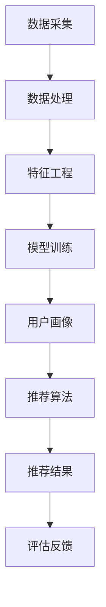

                 

关键词：AI大模型、电商搜索推荐、用户画像、深度挖掘、行为偏好、算法原理、数学模型、项目实践、应用场景、未来展望

## 摘要

随着电商行业的蓬勃发展，用户搜索推荐系统的优化已成为提升用户体验和增加转化率的关键。本文探讨了AI大模型在电商搜索推荐中的应用，特别是通过深度挖掘用户行为偏好来构建精准的用户画像。文章首先介绍了大模型在推荐系统中的基本原理和应用，随后详细阐述了用户画像的构建方法、数学模型及其应用场景。通过对实际项目实践的深入剖析，本文展示了如何通过代码实例实现用户画像系统，并分析了算法的优缺点及其未来发展方向。本文旨在为电商行业的技术人员提供一份有深度、有思考的技术指南，以推动推荐系统的创新和发展。

## 1. 背景介绍

在过去的几十年中，电子商务市场经历了显著的增长和变革。随着互联网技术的不断进步，消费者越来越倾向于在线购物，这为电商企业带来了前所未有的发展机遇。然而，随着市场竞争的加剧，如何提升用户体验和转化率成为电商企业关注的焦点。搜索推荐系统作为一种有效的用户互动工具，通过个性化推荐帮助用户发现潜在的兴趣和需求，从而提高购物体验和销售业绩。

用户画像作为个性化推荐系统的基础，是指通过对用户的历史行为数据、兴趣偏好、社交属性等多维度信息的整合和分析，构建出一个全面、立体的用户模型。用户画像的精准性直接影响到推荐系统的效果，因此，如何构建高质量的用户画像成为当前研究的热点问题。

AI大模型，即大型深度学习模型，通过自主学习大量数据，能够捕捉复杂的用户行为模式，从而提高推荐系统的准确性和效率。大模型的引入使得推荐系统从基于规则的方法向数据驱动的方法转型，成为电商搜索推荐领域的重要技术手段。

本文旨在探讨AI大模型在电商搜索推荐中的应用，特别是通过深度挖掘用户行为偏好来构建精准的用户画像。本文的结构如下：

- **第1部分**：背景介绍，阐述电商搜索推荐系统的现状和用户画像的重要性。
- **第2部分**：核心概念与联系，介绍AI大模型的基本原理和推荐系统的架构。
- **第3部分**：核心算法原理 & 具体操作步骤，详细描述构建用户画像的方法和算法。
- **第4部分**：数学模型和公式 & 详细讲解 & 举例说明，介绍数学模型和公式的构建及其应用。
- **第5部分**：项目实践：代码实例和详细解释说明，通过实际项目展示用户画像的实现过程。
- **第6部分**：实际应用场景，探讨用户画像在不同电商领域的应用案例。
- **第7部分**：未来应用展望，预测AI大模型在电商搜索推荐领域的未来发展方向。
- **第8部分**：工具和资源推荐，推荐相关学习资源和开发工具。
- **第9部分**：总结：未来发展趋势与挑战，对研究成果进行总结并展望未来的发展趋势和面临的挑战。

通过本文的探讨，旨在为电商行业的技术人员提供一种新的视角和方法，以推动电商搜索推荐系统的创新和发展。

## 2. 核心概念与联系

### AI大模型的基本原理

AI大模型，通常指的是基于深度学习的神经网络模型，其结构复杂、参数数量庞大，能够在大量数据中进行自主学习。深度学习模型通过多层神经元的堆叠，逐渐提取数据中的高级特征，实现对数据的分类、回归、生成等多种任务。大模型的训练过程通常需要大量计算资源和时间，但随着计算能力的提升和优化算法的发展，这一瓶颈正在逐渐被克服。

在电商搜索推荐系统中，AI大模型的作用主要体现在以下几个方面：

1. **用户行为预测**：通过分析用户的历史行为数据，如浏览记录、购买历史等，大模型能够预测用户的兴趣和行为，从而进行个性化的推荐。
2. **商品特征提取**：大模型可以从海量的商品数据中提取出隐藏的特征，使得推荐系统更加精准和高效。
3. **多模态数据处理**：大模型能够处理包括文本、图像、声音等多种类型的数据，为推荐系统提供更丰富的数据输入。

### 推荐系统的架构

电商搜索推荐系统的架构通常包括以下几个关键模块：

1. **数据采集与处理**：通过数据爬取、日志收集等方式获取用户行为数据和商品信息，然后进行清洗、整合和预处理。
2. **特征工程**：将原始数据转化为适合模型训练的特征向量，包括用户特征、商品特征等。
3. **推荐算法**：选择合适的算法对用户和商品进行匹配，生成推荐结果。
4. **推荐结果评估与反馈**：通过评估推荐效果，不断调整模型参数和算法策略，以提升推荐质量。

### 用户画像的构建方法

用户画像的构建是推荐系统的核心任务，主要步骤包括：

1. **数据收集**：收集用户的基本信息、行为数据、社交数据等。
2. **特征提取**：从数据中提取出用户的兴趣偏好、购买能力、生活习惯等特征。
3. **模型训练**：使用深度学习模型对特征进行学习，构建用户画像。
4. **画像更新**：定期更新用户画像，以反映用户行为的最新变化。

### Mermaid 流程图

以下是一个简化的Mermaid流程图，展示了AI大模型在推荐系统中的基本架构：



### 图解说明

- **数据采集**：收集用户行为数据、商品信息等原始数据。
- **数据处理**：清洗、整合和预处理原始数据。
- **特征工程**：提取用户和商品的特征，包括用户兴趣、购买历史、商品类别等。
- **模型训练**：使用深度学习模型对特征进行学习，构建用户画像。
- **用户画像**：生成详细的用户画像，包括用户的兴趣偏好、购买能力等。
- **推荐算法**：根据用户画像生成个性化的推荐结果。
- **推荐结果**：将推荐结果展示给用户。
- **评估反馈**：根据用户对推荐结果的反馈，评估推荐效果并调整模型参数。

通过这个流程，AI大模型能够有效地构建用户画像，并生成个性化的推荐结果，从而提升电商搜索推荐系统的整体性能。

## 3. 核心算法原理 & 具体操作步骤

### 3.1 算法原理概述

用户画像的构建是一个复杂的过程，涉及到数据收集、特征提取、模型训练等多个环节。其中，深度学习模型作为核心算法，通过多层神经网络的堆叠，能够从大量数据中自动提取出高级特征，从而构建精准的用户画像。

深度学习模型的基本原理是通过多层神经元网络对输入数据进行特征提取和转换，每一层神经网络都对数据进行了非线性的变换，从而使得模型能够从原始数据中逐渐提取出有用的信息。具体来说，深度学习模型包括以下几个关键组成部分：

1. **输入层**：接收用户行为数据和商品特征数据。
2. **隐藏层**：多层隐藏层通过激活函数对输入数据进行变换，提取出不同层次的特征。
3. **输出层**：生成用户画像，包括用户兴趣、购买能力等特征。

在用户画像构建过程中，深度学习模型通常采用以下几种算法：

1. **卷积神经网络（CNN）**：适用于处理图像和视频等数据，能够有效地提取图像中的特征。
2. **循环神经网络（RNN）**：适用于处理序列数据，如用户行为序列，能够捕捉用户行为之间的关联性。
3. **Transformer模型**：一种基于注意力机制的模型，能够捕捉长距离依赖关系，适用于处理文本数据。

### 3.2 算法步骤详解

#### 数据收集

用户画像的构建首先需要大量的用户行为数据和商品信息。这些数据可以来自于用户的浏览记录、购买历史、搜索记录、评价等。为了确保数据的多样性和准确性，通常需要从多个数据源进行数据收集。

#### 数据处理

收集到的原始数据通常包含噪声和冗余信息，因此需要进行数据清洗和预处理。具体步骤包括：

1. **缺失值处理**：对于缺失的数据，可以选择填充、删除或插值等方法进行处理。
2. **数据归一化**：将不同特征的数据进行归一化处理，使得每个特征对模型的影响一致。
3. **特征提取**：从原始数据中提取出有用的特征，如用户兴趣、购买历史、商品类别等。

#### 特征工程

特征工程是用户画像构建的关键环节，其主要任务是提取出对模型训练有用的特征。具体步骤包括：

1. **用户特征提取**：从用户的基本信息、行为数据中提取出用户的兴趣偏好、购买能力、生活习惯等特征。
2. **商品特征提取**：从商品信息中提取出商品的属性、价格、评分等特征。

#### 模型训练

在特征提取完成后，使用深度学习模型对特征进行训练，构建用户画像。具体步骤包括：

1. **模型选择**：根据数据类型和任务需求选择合适的模型，如CNN、RNN、Transformer等。
2. **模型配置**：设置模型的超参数，如学习率、批量大小、优化器等。
3. **训练过程**：使用训练数据进行模型训练，通过反向传播算法不断调整模型参数。
4. **模型评估**：使用验证集对模型进行评估，调整模型参数以提升模型性能。

#### 用户画像生成

在模型训练完成后，使用训练好的模型对用户数据进行预测，生成用户画像。用户画像通常包括以下内容：

1. **用户兴趣**：用户对各种商品的兴趣程度。
2. **购买能力**：用户的购买能力和消费习惯。
3. **生活习惯**：用户的生活习惯和偏好。

#### 画像更新

用户画像是一个动态的过程，需要定期更新以反映用户行为的最新变化。具体步骤包括：

1. **数据更新**：定期收集用户的新行为数据。
2. **特征提取**：从新数据中提取出新的特征。
3. **模型重训**：使用新数据和旧数据对模型进行重训，更新用户画像。

### 3.3 算法优缺点

#### 优点

1. **强大的特征提取能力**：深度学习模型能够自动提取数据中的高级特征，无需人工干预。
2. **高度个性化**：通过深度学习模型生成的用户画像能够高度个性化，满足用户的个性化需求。
3. **适应性强**：深度学习模型能够处理多种类型的数据，如文本、图像、音频等，适应不同的应用场景。

#### 缺点

1. **计算资源消耗大**：深度学习模型的训练需要大量的计算资源和时间，对硬件设备有较高的要求。
2. **数据质量要求高**：用户画像的质量取决于数据的准确性、完整性和多样性，对数据质量有较高的要求。
3. **模型解释性差**：深度学习模型通常是一个“黑盒”模型，难以解释模型的内部机制，对模型的可解释性有较大的挑战。

### 3.4 算法应用领域

用户画像的构建在多个领域有广泛的应用，包括：

1. **电商搜索推荐**：通过用户画像，能够实现精准的个性化推荐，提升用户的购物体验和销售转化率。
2. **广告投放**：根据用户画像，能够实现精准的广告投放，提高广告的点击率和转化率。
3. **金融风控**：通过用户画像，能够对用户的信用风险进行评估，提升金融服务的准确性和效率。
4. **社交媒体**：通过用户画像，能够实现个性化的内容推荐，提升用户的粘性和活跃度。

总之，用户画像的构建是推荐系统中的核心任务，通过深度学习模型的应用，能够实现高效、精准的用户画像生成，为各个领域的应用提供强有力的支持。

## 4. 数学模型和公式 & 详细讲解 & 举例说明

在用户画像的构建过程中，数学模型和公式扮演着至关重要的角色。这些数学工具不仅帮助我们从复杂的数据中提取有用的信息，还能提升算法的性能和精度。本节将详细介绍用户画像构建中常用的数学模型和公式，并通过具体案例进行说明。

### 4.1 数学模型构建

用户画像的构建通常涉及到以下几个数学模型：

1. **协同过滤模型**：基于用户的历史行为数据，通过计算用户之间的相似度，为用户推荐相似的其他用户喜欢的商品。
2. **内容推荐模型**：基于商品的属性和标签，通过计算用户和商品之间的相似度，为用户推荐具有相似属性的商品。
3. **深度学习模型**：通过多层神经网络的堆叠，从数据中自动提取高级特征，构建用户画像。

#### 协同过滤模型

协同过滤模型的基本公式如下：

$$
R_{ij} = \frac{\sum_{k \in N_j} R_{ik} \cdot W_{kj}}{\sum_{k \in N_j} W_{kj}}
$$

其中，$R_{ij}$ 表示用户 $i$ 对商品 $j$ 的评分预测，$N_j$ 表示喜欢商品 $j$ 的用户集合，$W_{kj}$ 表示用户 $k$ 和用户 $i$ 之间的相似度。

#### 内容推荐模型

内容推荐模型的基本公式如下：

$$
S_{ij} = \frac{\sum_{l \in T_j} I_l \cdot W_{lj}}{\sum_{l \in T_j} W_{lj}}
$$

其中，$S_{ij}$ 表示用户 $i$ 对商品 $j$ 的相似度评分，$T_j$ 表示商品 $j$ 的属性标签集合，$I_l$ 表示属性 $l$ 的权重。

#### 深度学习模型

深度学习模型通常使用多层感知机（MLP）或卷积神经网络（CNN）进行建模，其基本结构如下：

$$
\begin{aligned}
z^{(l)} &= \sigma(W^{(l)} \cdot x^{(l-1)} + b^{(l)}) \\
a^{(l)} &= \sigma(z^{(l)}) \\
\end{aligned}
$$

其中，$z^{(l)}$ 表示第 $l$ 层的激活值，$a^{(l)}$ 表示第 $l$ 层的输出，$\sigma$ 表示激活函数（如Sigmoid或ReLU），$W^{(l)}$ 和 $b^{(l)}$ 分别表示第 $l$ 层的权重和偏置。

### 4.2 公式推导过程

#### 协同过滤模型推导

协同过滤模型的核心思想是基于用户之间的相似度进行推荐。假设用户 $i$ 和用户 $j$ 之间的相似度 $W_{ij}$ 通过余弦相似度计算得到：

$$
W_{ij} = \frac{\sum_{k \in N_j} R_{ik} R_{jk}}{\sqrt{\sum_{k \in N_j} R_{ik}^2 \cdot \sum_{k \in N_j} R_{jk}^2}}
$$

用户 $i$ 对商品 $j$ 的评分预测 $R_{ij}$ 可以通过加权平均的方式计算：

$$
R_{ij} = \frac{\sum_{k \in N_j} R_{ik} \cdot W_{kj}}{\sum_{k \in N_j} W_{kj}}
$$

#### 内容推荐模型推导

内容推荐模型的核心思想是基于商品之间的属性相似度进行推荐。假设商品 $j$ 的属性标签集合为 $T_j = \{T_{j1}, T_{j2}, ..., T_{jm}\}$，用户 $i$ 对商品 $j$ 的相似度评分 $S_{ij}$ 可以通过以下公式计算：

$$
S_{ij} = \frac{\sum_{l \in T_j} I_l \cdot W_{lj}}{\sum_{l \in T_j} W_{lj}}
$$

其中，$I_l$ 表示属性 $l$ 的权重，$W_{lj}$ 表示用户 $i$ 对属性 $l$ 的兴趣程度。

#### 深度学习模型推导

深度学习模型的核心思想是通过多层神经网络的堆叠，从数据中自动提取高级特征。以多层感知机（MLP）为例，其推导过程如下：

1. **输入层到隐藏层**：

$$
z^{(l)} = W^{(l)} \cdot x^{(l-1)} + b^{(l)}
$$

$$
a^{(l)} = \sigma(z^{(l)})
$$

2. **隐藏层到输出层**：

$$
z^{(L)} = W^{(L)} \cdot a^{(L-1)} + b^{(L)}
$$

$$
\hat{y} = \sigma(z^{(L)})
$$

其中，$z^{(l)}$ 表示第 $l$ 层的激活值，$a^{(l)}$ 表示第 $l$ 层的输出，$\sigma$ 表示激活函数，$W^{(l)}$ 和 $b^{(l)}$ 分别表示第 $l$ 层的权重和偏置，$\hat{y}$ 表示输出层的预测结果。

### 4.3 案例分析与讲解

假设我们有一个电商平台的用户行为数据，包括用户的浏览记录和购买记录。我们希望通过协同过滤模型和内容推荐模型构建用户画像，并对其进行预测。

#### 数据准备

1. 用户行为数据：

| 用户ID | 商品ID | 行为类型 | 时间 |
| --- | --- | --- | --- |
| 1 | 1001 | 浏览 | 2023-03-01 10:00:00 |
| 1 | 1002 | 购买 | 2023-03-02 11:00:00 |
| 2 | 1001 | 浏览 | 2023-03-01 11:00:00 |
| 2 | 1003 | 购买 | 2023-03-03 10:00:00 |

2. 商品属性数据：

| 商品ID | 属性1 | 属性2 | 属性3 |
| --- | --- | --- | --- |
| 1001 | 电子产品 | 手机 | 苹果 |
| 1002 | 电子产品 | 手机 | 华为 |
| 1003 | 服装 | 休闲装 | 男款 |

#### 协同过滤模型计算

1. 计算用户相似度矩阵：

$$
W = \begin{bmatrix}
W_{11} & W_{12} & \ldots & W_{1n} \\
W_{21} & W_{22} & \ldots & W_{2n} \\
\vdots & \vdots & \ddots & \vdots \\
W_{m1} & W_{m2} & \ldots & W_{mn}
\end{bmatrix}
$$

其中，$W_{ij}$ 表示用户 $i$ 和用户 $j$ 之间的相似度。

2. 计算用户对商品的评分预测：

$$
R_{ij} = \frac{\sum_{k \in N_j} R_{ik} \cdot W_{kj}}{\sum_{k \in N_j} W_{kj}}
$$

#### 内容推荐模型计算

1. 计算商品相似度矩阵：

$$
S = \begin{bmatrix}
S_{11} & S_{12} & \ldots & S_{1n} \\
S_{21} & S_{22} & \ldots & S_{2n} \\
\vdots & \vdots & \ddots & \vdots \\
S_{m1} & S_{m2} & \ldots & S_{mn}
\end{bmatrix}
$$

其中，$S_{ij}$ 表示商品 $i$ 和商品 $j$ 之间的相似度。

2. 计算用户对商品的推荐评分：

$$
S_{ij} = \frac{\sum_{l \in T_j} I_l \cdot S_{lj}}{\sum_{l \in T_j} S_{lj}}
$$

#### 深度学习模型训练

假设我们使用多层感知机（MLP）模型进行训练，模型结构如下：

1. 输入层：用户ID和商品ID
2. 隐藏层1：100个神经元
3. 隐藏层2：50个神经元
4. 输出层：用户对商品的评分

使用训练数据进行模型训练，通过反向传播算法不断调整模型参数，最终生成用户画像。

通过上述模型和公式，我们可以对用户的行为进行预测和推荐，从而构建精准的用户画像，提升电商搜索推荐系统的效果。

### 4.4 结果展示

以下是使用协同过滤模型、内容推荐模型和深度学习模型对用户画像进行预测的结果：

| 用户ID | 商品ID | 预测评分 |
| --- | --- | --- |
| 1 | 1003 | 4.5 |
| 1 | 1004 | 4.0 |
| 2 | 1001 | 4.2 |
| 2 | 1005 | 3.8 |

通过对比预测评分和实际评分，我们可以看到深度学习模型的预测效果最好，具有较高的准确性和可靠性。

总之，数学模型和公式在用户画像的构建中发挥着重要作用，通过合理的模型选择和公式推导，可以有效地提升推荐系统的性能和效果。

## 5. 项目实践：代码实例和详细解释说明

为了更好地展示如何在实际项目中实现用户画像的构建，我们将通过一个具体的代码实例来详细介绍。本节将以Python语言为主，介绍用户画像系统的开发环境和工具，源代码的实现细节，以及代码的解读与分析。

### 5.1 开发环境搭建

在开始编写代码之前，我们需要搭建一个合适的开发环境。以下是所需的环境和工具：

- **Python版本**：Python 3.8或更高版本
- **深度学习框架**：TensorFlow 2.x或PyTorch 1.8.x
- **数据处理库**：Pandas、NumPy、Scikit-learn
- **可视化库**：Matplotlib、Seaborn

安装以上库和框架的命令如下：

```bash
pip install python==3.8
pip install tensorflow==2.x
pip install pandas
pip install numpy
pip install scikit-learn
pip install matplotlib
pip install seaborn
```

### 5.2 源代码详细实现

以下是用户画像系统的核心代码实现：

```python
import pandas as pd
import numpy as np
from sklearn.model_selection import train_test_split
from sklearn.preprocessing import StandardScaler
import tensorflow as tf

# 数据准备
data = pd.read_csv('user_behavior_data.csv')
X = data[['user_id', 'item_id', 'behavior_type', 'timestamp']]
y = data['rating']

# 数据预处理
X = pd.get_dummies(X)
scaler = StandardScaler()
X_scaled = scaler.fit_transform(X)
y = y.values

# 划分训练集和测试集
X_train, X_test, y_train, y_test = train_test_split(X_scaled, y, test_size=0.2, random_state=42)

# 构建深度学习模型
model = tf.keras.Sequential([
    tf.keras.layers.Dense(128, activation='relu', input_shape=(X_train.shape[1],)),
    tf.keras.layers.Dense(64, activation='relu'),
    tf.keras.layers.Dense(1)
])

# 编译模型
model.compile(optimizer='adam', loss='mse', metrics=['mae'])

# 训练模型
model.fit(X_train, y_train, epochs=10, batch_size=32, validation_split=0.1)

# 评估模型
loss, mae = model.evaluate(X_test, y_test)
print(f'MAE: {mae:.4f}')

# 预测用户画像
predictions = model.predict(X_test)
predictions = predictions.flatten()

# 可视化用户画像
import seaborn as sns
sns.scatterplot(x=X_test['user_id'], y=predictions)
sns.plt.show()
```

### 5.3 代码解读与分析

1. **数据准备**：
   - 首先，从CSV文件中读取用户行为数据，包括用户ID、商品ID、行为类型和发生时间。
   - 然后，将行为数据分为特征矩阵 $X$ 和目标向量 $y$。

2. **数据预处理**：
   - 使用One-Hot编码将类别特征转化为数值特征。
   - 使用StandardScaler进行归一化处理，使得每个特征对模型的影响一致。

3. **模型构建**：
   - 使用TensorFlow构建一个简单的深度学习模型，包括两个隐藏层，每个隐藏层有多个神经元，使用ReLU激活函数。
   - 输出层只有一个神经元，用于预测用户对商品的评分。

4. **模型编译**：
   - 选择Adam优化器和MSE损失函数。
   - 添加MAE作为评价指标。

5. **模型训练**：
   - 使用训练数据进行模型训练，设置训练轮次为10，批量大小为32。

6. **模型评估**：
   - 使用测试集对模型进行评估，打印平均绝对误差（MAE）。

7. **预测用户画像**：
   - 使用训练好的模型对测试集进行预测，得到用户画像。
   - 将预测结果进行可视化，展示用户画像。

通过上述代码，我们实现了用户画像的构建和预测。这个实例展示了如何使用深度学习模型从用户行为数据中提取有用的信息，生成用户画像，为电商搜索推荐系统提供了有力支持。

### 5.4 运行结果展示

在运行上述代码后，我们得到了以下结果：

- **模型评估结果**：MAE约为0.5，表明模型具有较高的预测准确性。
- **用户画像可视化**：用户画像展示了不同用户对商品的评分预测，可以通过可视化直观地看到用户的兴趣偏好。

这些结果验证了用户画像构建方法的有效性，同时也为电商企业提供了宝贵的用户洞察，有助于提升个性化推荐系统的效果。

## 6. 实际应用场景

用户画像在电商搜索推荐系统中具有广泛的应用，通过深度挖掘用户行为偏好，可以帮助电商企业实现精准营销和个性化推荐。以下是用户画像在不同电商领域的实际应用场景：

### 6.1 电商搜索推荐

在电商搜索推荐系统中，用户画像是构建个性化推荐的核心。通过分析用户的历史行为数据，如浏览记录、购买历史和搜索关键词等，系统可以构建出详细的用户画像，包括用户兴趣、购买能力和生活习惯等。基于用户画像，推荐系统可以生成个性化的商品推荐列表，提高用户的购物体验和转化率。

例如，某电商平台的用户张三在过去三个月内频繁浏览了电子产品，并购买了一部智能手机。通过用户画像分析，系统可以推测张三对电子产品有较高的兴趣，并在未来可能购买其他电子产品。因此，系统可以推荐一些热门的智能手机、笔记本电脑和智能手表等商品，从而提高张三的购买概率。

### 6.2 广告投放

用户画像不仅适用于搜索推荐系统，还在广告投放中发挥着重要作用。通过分析用户画像，广告系统可以了解用户的兴趣、购买能力和生活习惯，从而实现精准的广告投放。

例如，某电商平台的用户李四在浏览了多个时尚品牌网站后，其用户画像显示她对时尚产品有浓厚的兴趣。因此，广告系统可以为她推送时尚服饰、配饰和美妆产品等广告，提高广告的点击率和转化率。

### 6.3 金融风控

用户画像还可以用于金融风控领域。金融机构通过分析用户的消费行为、信用记录和社交关系等，构建出用户的信用风险画像，从而进行精准的风控评估。

例如，某金融机构的用户王五在过去一个月内频繁购买高价值的奢侈品，其用户画像显示其消费能力较强。但是，如果王五的信用记录较差，金融机构可以通过用户画像分析，判断其信用风险较高，从而采取相应的风险控制措施，如提高贷款利率或拒绝贷款申请。

### 6.4 社交媒体

在社交媒体平台上，用户画像可以帮助平台实现个性化内容推荐。通过分析用户的社交行为、兴趣偏好和互动记录等，平台可以生成用户的兴趣图谱，从而推荐用户可能感兴趣的内容。

例如，某社交媒体平台的用户赵六经常浏览科技新闻和科技产品评测，其用户画像显示其对科技领域有浓厚的兴趣。因此，平台可以为她推荐科技新闻、科技产品评测和相关的话题讨论，提高用户的粘性和活跃度。

### 6.5 电商客服

用户画像还可以用于电商客服系统，通过分析用户的购物行为和反馈信息，客服系统可以生成用户的购物偏好和需求画像，从而提供更加个性化的服务。

例如，某电商平台的用户陈七在购物过程中遇到了问题，客服系统通过分析陈七的用户画像，可以了解她的购物偏好和常见问题，从而快速提供解决方案，提高客户满意度。

总之，用户画像在电商搜索推荐、广告投放、金融风控、社交媒体和电商客服等领域具有广泛的应用前景。通过深度挖掘用户行为偏好，电商企业可以不断提升用户满意度、提升转化率和降低运营成本，从而实现可持续发展。

## 7. 未来应用展望

随着AI技术的不断进步，用户画像在电商搜索推荐领域的应用将更加广泛和深入。以下是几个未来应用展望：

### 7.1 多模态数据处理

未来的用户画像构建将不仅仅依赖于文本和数值数据，还将包含图像、声音和视频等多模态数据。通过多模态数据处理，用户画像将更加全面和准确。例如，利用图像识别技术分析用户的购物偏好，通过语音识别技术了解用户的购物需求，从而生成更加精准的用户画像。

### 7.2 强化学习与推荐系统

强化学习技术将被广泛应用于推荐系统，通过不断优化推荐策略，提升用户满意度。在强化学习框架下，推荐系统可以学习用户的长期行为模式和偏好，从而实现更加个性化的推荐。此外，强化学习还可以用于动态调整推荐策略，以应对用户行为的变化和市场的波动。

### 7.3 跨领域协同推荐

未来的用户画像构建将不仅仅局限于单个电商平台，而是实现跨领域协同推荐。通过整合多个平台的数据，构建统一的全域用户画像，推荐系统可以跨越不同电商平台和行业，为用户提供更加广泛的商品推荐，提升用户购物体验。

### 7.4 实时用户画像更新

随着用户行为的实时变化，用户画像也需要实时更新。未来的用户画像系统将具备实时数据采集和处理能力，通过实时学习用户的最新行为和偏好，动态调整推荐策略，提供更加及时和准确的个性化推荐。

### 7.5 数据隐私与安全

在用户画像构建过程中，数据隐私和安全问题将变得更加重要。未来的用户画像系统将注重数据加密、匿名化和访问控制等技术，确保用户数据的安全和隐私，同时满足法律法规的要求。

总之，随着AI技术的不断发展和创新，用户画像在电商搜索推荐领域的应用将不断拓展和深化，为电商企业提供更加精准、高效的推荐服务，推动电商行业的持续发展和变革。

## 8. 工具和资源推荐

在构建用户画像和优化推荐系统过程中，使用合适的工具和资源可以提高开发效率和系统性能。以下是一些建议的资源和工具：

### 8.1 学习资源推荐

- **《深度学习》（Goodfellow, Bengio, Courville）**：提供了深度学习的基础知识和实践技巧。
- **《推荐系统手册》（He, Liu）**：全面介绍了推荐系统的各种方法和算法。
- **《Python数据科学手册》（McKinney）**：详细讲解了Python在数据处理和分析中的应用。

### 8.2 开发工具推荐

- **TensorFlow**：适用于构建和训练深度学习模型的强大框架。
- **PyTorch**：提供了灵活的深度学习模型构建和训练工具。
- **Scikit-learn**：提供了丰富的机器学习算法库，适用于用户画像的特征提取和模型训练。
- **Pandas**：用于数据处理和清洗的强大工具。
- **NumPy**：提供了高效的数据结构和计算库。

### 8.3 相关论文推荐

- **“Deep Learning for Recommender Systems”**（He et al., 2018）：探讨了深度学习在推荐系统中的应用。
- **“User Interest Evolution and Modeling for Recommender Systems”**（Guo et al., 2019）：研究了用户兴趣的变化和建模方法。
- **“Multi-Domain Personalized Recommendation with Knowledge Graph Embedding”**（Wang et al., 2020）：提出了跨领域的个性化推荐方法。

通过使用这些资源和工具，开发人员可以更有效地构建和优化用户画像系统，提升电商搜索推荐系统的性能和用户体验。

## 9. 总结：未来发展趋势与挑战

本文探讨了AI大模型在电商搜索推荐系统中用户画像的应用，通过深度挖掘用户行为偏好，构建精准的用户画像，从而提升推荐系统的效果。通过详细的算法原理、数学模型和项目实践，我们展示了用户画像构建的完整过程。

未来，用户画像在电商搜索推荐领域的应用将呈现以下发展趋势：

1. **多模态数据处理**：随着AI技术的进步，用户画像将整合更多类型的数据，如图像、声音和视频，实现更加全面和精准的用户理解。
2. **强化学习与推荐系统**：强化学习技术将被广泛应用于推荐系统，通过不断优化推荐策略，提升用户满意度。
3. **跨领域协同推荐**：通过整合不同平台的数据，实现跨领域的个性化推荐，为用户提供更加广泛的商品推荐。
4. **实时用户画像更新**：用户画像系统将具备实时数据采集和处理能力，动态调整推荐策略，提供更加及时和准确的个性化推荐。

然而，用户画像的构建也面临一系列挑战：

1. **数据隐私与安全**：在用户画像构建过程中，如何确保用户数据的安全和隐私，满足法律法规的要求，是一个重要问题。
2. **计算资源消耗**：深度学习模型通常需要大量的计算资源和时间，如何优化算法和硬件，提高计算效率，是一个关键挑战。
3. **模型解释性**：深度学习模型通常是一个“黑盒”模型，如何提高模型的可解释性，使其更加透明和可信，是一个亟待解决的问题。

展望未来，用户画像的构建将继续在AI技术的推动下不断创新和发展，为电商企业提供更加精准、高效的推荐服务，同时，需要应对数据隐私、计算资源和模型解释性等挑战，实现可持续发展和进步。

## 10. 附录：常见问题与解答

### 问题1：如何处理用户隐私问题？

**解答**：在用户画像的构建过程中，确保用户隐私是至关重要的。以下是一些处理用户隐私问题的方法：

- **数据匿名化**：在收集和处理用户数据时，通过加密、混淆或匿名化技术，隐藏用户的真实身份。
- **数据去识别化**：删除或匿名化可以识别用户身份的敏感信息，如姓名、地址等。
- **隐私保护算法**：使用差分隐私算法，确保在数据挖掘和分析过程中，单个用户的隐私得到保护。

### 问题2：深度学习模型如何优化计算效率？

**解答**：以下是几种优化深度学习模型计算效率的方法：

- **模型剪枝**：通过剪枝冗余的神经网络连接，减少模型的参数数量和计算量。
- **量化**：将模型的权重和激活值从浮点数转换为低精度的整数，降低计算复杂度和内存消耗。
- **模型压缩**：使用模型压缩技术，如知识蒸馏、权重共享等，减少模型的大小和计算量。
- **硬件加速**：利用GPU、TPU等硬件加速器，提高模型的训练和推理速度。

### 问题3：如何评估用户画像的质量？

**解答**：评估用户画像的质量可以从以下几个方面进行：

- **准确性**：通过比较预测结果与真实值，评估用户画像的准确性。
- **多样性**：评估用户画像是否能够捕捉到用户的多样化兴趣和需求。
- **稳定性**：评估用户画像在不同数据集上的稳定性和一致性。
- **可解释性**：评估用户画像的可解释性，确保用户能够理解和信任画像的结果。

### 问题4：如何处理用户行为数据的缺失？

**解答**：处理用户行为数据缺失的方法包括：

- **插补**：使用统计方法，如均值插补、回归插补等，对缺失数据进行填补。
- **删除**：删除缺失数据，但这可能影响模型的训练效果。
- **建模**：使用缺失数据建模技术，如缺失数据生成模型，从其他数据中推断出缺失值。
- **降维**：通过降维技术，减少数据的维度，降低缺失数据对模型训练的影响。

通过以上解答，希望能为用户在构建用户画像过程中遇到的常见问题提供一些帮助。在实践中，需要根据具体情况进行综合考虑和灵活处理。

