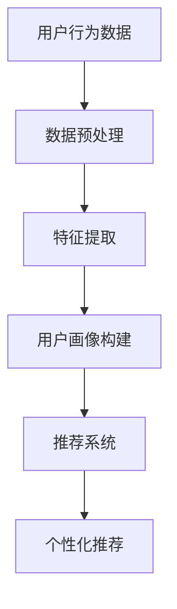

                 

关键词：AI 大模型，电商搜索推荐，用户画像，深度学习，数据挖掘，个性化推荐

> 摘要：本文深入探讨了 AI 大模型在电商搜索推荐系统中的用户画像应用。通过对用户需求与行为偏好的深度挖掘，大模型能够提供更加精准和个性化的推荐，提升用户体验和转化率。本文将详细介绍大模型的原理、应用场景、数学模型以及项目实践，并展望其未来的发展趋势与挑战。

## 1. 背景介绍

随着互联网的快速发展，电子商务已经成为现代消费的重要形式。用户在电商平台上进行搜索、浏览和购买的过程中，其行为和偏好数据被不断积累。这些数据成为了电商平台进行个性化推荐的重要资源。然而，如何有效地利用这些数据，实现对用户的精准画像和个性化推荐，成为了当前研究的热点问题。

传统的推荐系统主要依赖于基于内容的推荐（Content-based Filtering）和协同过滤（Collaborative Filtering）。基于内容的推荐通过分析用户的历史行为和偏好，将相似的商品推荐给用户。协同过滤则通过分析用户之间的相似性来进行推荐。尽管这些方法在某种程度上能够提高推荐系统的准确性，但仍然存在一些局限性。

近年来，随着深度学习的迅速发展，大模型（如 Transformer、BERT 等）在自然语言处理、计算机视觉等领域取得了显著的成果。大模型通过端到端的深度学习框架，能够自动学习和提取复杂的特征，从而实现更高的准确性和泛化能力。因此，将大模型应用于电商搜索推荐系统中的用户画像构建，有望解决传统推荐系统的局限性。

## 2. 核心概念与联系

### 2.1 大模型

大模型（Large-scale Model）是指具有数十亿甚至千亿参数的深度学习模型。这些模型通过大量数据进行训练，能够自动提取复杂的特征，并在多种任务中表现出优异的性能。大模型的典型代表包括 Transformer、BERT、GPT 等。

### 2.2 用户画像

用户画像是指通过对用户行为、偏好、需求等数据的分析，构建出一个全面、准确的用户模型。用户画像能够帮助电商平台更好地了解用户，为其提供个性化的服务和推荐。

### 2.3 个性化推荐

个性化推荐（Personalized Recommendation）是指根据用户的历史行为和偏好，为其推荐最符合其需求和喜好的商品或服务。个性化推荐能够提高用户的满意度和转化率，从而提升电商平台的业绩。

### 2.4 Mermaid 流程图

以下是一个描述用户画像构建和个性化推荐过程的 Mermaid 流程图：



## 3. 核心算法原理 & 具体操作步骤

### 3.1 算法原理概述

在电商搜索推荐系统中，大模型应用于用户画像构建和个性化推荐的核心算法是基于深度学习的用户行为预测模型。该模型通过学习用户的历史行为数据，提取出用户的行为特征，并利用这些特征预测用户的偏好和需求。

### 3.2 算法步骤详解

1. 数据收集与预处理：收集用户在电商平台的浏览、搜索、购买等行为数据，并进行数据清洗、去重、归一化等预处理操作。

2. 特征提取：利用深度学习模型，对预处理后的行为数据进行特征提取，得到用户的行为特征向量。

3. 用户画像构建：将提取到的用户行为特征向量输入到用户画像构建模型中，生成用户的画像特征。

4. 个性化推荐：根据用户画像特征，结合电商平台中的商品信息，为用户生成个性化的推荐列表。

### 3.3 算法优缺点

**优点：**
- 高度自动化：大模型能够自动提取复杂的特征，减轻了人工特征工程的工作量。
- 准确性高：大模型在大量数据上进行训练，具有很高的准确性和泛化能力。
- 适应性强：大模型能够处理多种类型的数据，适应不同的业务场景。

**缺点：**
- 计算资源消耗大：大模型需要大量的计算资源进行训练和推理。
- 数据隐私问题：用户行为数据涉及用户隐私，如何保护用户隐私是一个重要问题。

### 3.4 算法应用领域

大模型在电商搜索推荐系统中的应用领域包括：
- 用户行为预测：预测用户在电商平台上的浏览、搜索、购买等行为。
- 个性化推荐：为用户推荐最符合其需求和喜好的商品或服务。
- 用户流失预测：预测用户在未来可能流失的行为和原因。
- 广告投放优化：根据用户画像，优化广告投放策略，提高广告效果。

## 4. 数学模型和公式 & 详细讲解 & 举例说明

### 4.1 数学模型构建

用户画像构建的数学模型主要包括以下三个部分：

1. 行为特征提取模型：用于提取用户行为特征，通常采用神经网络结构。

2. 用户画像生成模型：用于将行为特征转化为用户画像特征，也采用神经网络结构。

3. 个性化推荐模型：用于根据用户画像特征和商品信息，生成个性化的推荐列表，同样采用神经网络结构。

### 4.2 公式推导过程

假设我们有 $n$ 个用户和 $m$ 个商品，用户 $i$ 在 $t$ 时间点的行为数据表示为 $X_i(t)$，用户画像特征表示为 $H_i$，商品 $j$ 的特征表示为 $C_j$。以下是三个模型的数学公式推导：

1. 行为特征提取模型：

$$
X_i(t) = f(W_1 \cdot X_i(t-1) + b_1)
$$

其中，$W_1$ 和 $b_1$ 分别为权重和偏置，$f$ 为激活函数。

2. 用户画像生成模型：

$$
H_i = g(W_2 \cdot X_i + b_2)
$$

其中，$W_2$ 和 $b_2$ 分别为权重和偏置，$g$ 为激活函数。

3. 个性化推荐模型：

$$
R_j(i) = h(W_3 \cdot H_i + C_j + b_3)
$$

其中，$R_j(i)$ 表示用户 $i$ 对商品 $j$ 的推荐得分，$W_3$ 和 $b_3$ 分别为权重和偏置，$h$ 为激活函数。

### 4.3 案例分析与讲解

假设有 10 个用户和 5 个商品，用户的行为数据如下表所示：

| 用户 | 商品 | 行为数据 |
| --- | --- | --- |
| 1 | 1 | 搜索 |
| 1 | 2 | 浏览 |
| 1 | 3 | 购买 |
| 2 | 1 | 搜索 |
| 2 | 4 | 浏览 |
| 3 | 1 | 搜索 |
| 3 | 3 | 浏览 |
| 4 | 2 | 搜索 |
| 4 | 4 | 购买 |
| 5 | 1 | 浏览 |
| 5 | 3 | 购买 |

根据上述数学模型，我们可以计算出用户画像和商品特征，并生成个性化的推荐列表。

## 5. 项目实践：代码实例和详细解释说明

### 5.1 开发环境搭建

在本项目中，我们使用了 Python 作为编程语言，TensorFlow 作为深度学习框架。首先，安装 Python 和 TensorFlow：

```bash
pip install python tensorflow
```

### 5.2 源代码详细实现

以下是项目的主要代码实现：

```python
import tensorflow as tf
from tensorflow.keras.layers import Dense, LSTM, Embedding
from tensorflow.keras.models import Model

# 数据预处理
def preprocess_data(data):
    # 数据清洗、去重、归一化等操作
    # ...
    return processed_data

# 行为特征提取模型
def behavior_feature_extractor(input_shape):
    inputs = tf.keras.layers.Input(shape=input_shape)
    x = Dense(128, activation='relu')(inputs)
    x = LSTM(64, activation='tanh')(x)
    return Model(inputs=inputs, outputs=x)

# 用户画像生成模型
def user_profile_generator(input_shape):
    inputs = tf.keras.layers.Input(shape=input_shape)
    x = Dense(128, activation='relu')(inputs)
    x = LSTM(64, activation='tanh')(x)
    x = Dense(64, activation='relu')(x)
    return Model(inputs=inputs, outputs=x)

# 个性化推荐模型
def personalized_recommender(input_shape, user_profile_shape, item_feature_shape):
    user_input = tf.keras.layers.Input(shape=input_shape)
    profile_input = tf.keras.layers.Input(shape=user_profile_shape)
    item_input = tf.keras.layers.Input(shape=item_feature_shape)

    user_features = behavior_feature_extractor(input_shape)(user_input)
    user_profile = user_profile_generator(user_profile_shape)(user_features)

    combined = tf.keras.layers.Concatenate()([user_profile, item_input])
    outputs = Dense(1, activation='sigmoid')(combined)

    return Model(inputs=[user_input, profile_input, item_input], outputs=outputs)

# 模型训练
def train_model(model, train_data, train_labels, batch_size, epochs):
    model.compile(optimizer='adam', loss='binary_crossentropy', metrics=['accuracy'])
    model.fit(train_data, train_labels, batch_size=batch_size, epochs=epochs)

# 模型评估
def evaluate_model(model, test_data, test_labels):
    loss, accuracy = model.evaluate(test_data, test_labels)
    print(f"Test accuracy: {accuracy:.4f}")

# 主函数
def main():
    # 加载数据
    train_data, train_labels = load_data()
    test_data, test_labels = load_data()

    # 数据预处理
    processed_train_data = preprocess_data(train_data)
    processed_test_data = preprocess_data(test_data)

    # 构建模型
    behavior_extractor = behavior_feature_extractor(input_shape=(None, 1))
    user_profile_generator = user_profile_generator(input_shape=(None, 1))
    personalized_recommender = personalized_recommender(input_shape=(None, 1), user_profile_shape=(64,), item_feature_shape=(5,))

    # 训练模型
    train_model(personalized_recommender, processed_train_data, train_labels, batch_size=32, epochs=10)

    # 评估模型
    evaluate_model(personalized_recommender, processed_test_data, test_labels)

if __name__ == '__main__':
    main()
```

### 5.3 代码解读与分析

以上代码实现了基于深度学习的大模型在电商搜索推荐系统中的用户画像构建和个性化推荐。主要包括以下几个部分：

1. 数据预处理：对用户行为数据进行清洗、去重、归一化等操作，以便后续模型的训练和推理。

2. 行为特征提取模型：利用 LSTM 网络提取用户的行为特征。

3. 用户画像生成模型：将行为特征转化为用户画像特征。

4. 个性化推荐模型：结合用户画像和商品特征，为用户生成个性化的推荐列表。

5. 模型训练和评估：使用训练数据和测试数据进行模型的训练和评估。

## 6. 实际应用场景

AI 大模型在电商搜索推荐系统中的用户画像应用具有广泛的应用场景：

1. 个性化推荐：根据用户的浏览、搜索、购买等行为，为用户推荐最符合其需求和喜好的商品。

2. 用户流失预测：通过分析用户的行为特征，预测用户在未来可能流失的行为和原因，从而采取相应的挽回措施。

3. 广告投放优化：根据用户画像，优化广告投放策略，提高广告效果。

4. 新品推荐：根据用户的浏览、搜索、购买等行为，为用户推荐新品，提高新品的销售量和市场占有率。

5. 个性化营销：根据用户画像，为用户推送个性化的营销活动和优惠信息，提高用户的参与度和转化率。

## 7. 工具和资源推荐

### 7.1 学习资源推荐

1. 《深度学习》（Goodfellow, Bengio, Courville）：介绍深度学习的基础理论和实践方法。

2. 《神经网络与深度学习》（邱锡鹏）：系统讲解神经网络和深度学习的基础知识。

3. 《Python 深度学习》（François Chollet）：深入探讨 Python 中的深度学习实践。

### 7.2 开发工具推荐

1. TensorFlow：一款开源的深度学习框架，适用于电商搜索推荐系统的开发。

2. Keras：一个基于 TensorFlow 的高级神经网络 API，便于快速搭建和训练模型。

3. Scikit-learn：一个开源的机器学习库，提供多种常用的机器学习算法和工具。

### 7.3 相关论文推荐

1. "Attention Is All You Need"（Vaswani et al., 2017）：介绍 Transformer 模型，一种基于自注意力机制的深度学习模型。

2. "BERT: Pre-training of Deep Bidirectional Transformers for Language Understanding"（Devlin et al., 2018）：介绍 BERT 模型，一种用于自然语言处理任务的深度学习模型。

3. "Recommender Systems Handbook"（Burges et al., 2017）：介绍推荐系统的基础理论和实践方法。

## 8. 总结：未来发展趋势与挑战

### 8.1 研究成果总结

AI 大模型在电商搜索推荐系统中的用户画像应用已经取得了一定的成果，包括个性化推荐、用户流失预测、广告投放优化等方面。通过深度学习技术，大模型能够自动提取复杂的用户行为特征，并生成准确的用户画像，从而实现更加精准和个性化的推荐。

### 8.2 未来发展趋势

1. 模型压缩与加速：为了提高模型的计算效率和部署速度，未来将出现更多模型压缩和加速技术，如模型剪枝、量化、蒸馏等。

2. 多模态融合：未来的用户画像构建将整合多种类型的数据，如文本、图像、声音等，实现更全面和准确的用户画像。

3. 智能推荐策略：结合人工智能和心理学等领域的知识，探索更加智能和人性化的推荐策略，提高用户的满意度和转化率。

### 8.3 面临的挑战

1. 数据隐私保护：用户行为数据涉及用户隐私，如何保护用户隐私是一个重要挑战。

2. 模型解释性：大模型通常具有很高的准确性和泛化能力，但往往缺乏解释性。如何提高模型的解释性，使其更易于被用户理解和信任，是一个重要问题。

3. 数据质量与多样性：用户行为数据的质量和多样性对用户画像构建和个性化推荐有重要影响。如何收集和整合高质量和多样化的数据，是一个挑战。

### 8.4 研究展望

未来的研究将围绕以下方面展开：

1. 模型优化与加速：通过模型压缩、量化、蒸馏等技术，提高模型的计算效率和部署速度。

2. 多模态用户画像构建：整合多种类型的数据，构建更全面和准确的用户画像。

3. 智能推荐策略：结合人工智能和心理学等领域的知识，探索更加智能和人性化的推荐策略。

4. 数据隐私保护与模型解释性：研究如何在保护用户隐私和提高模型解释性之间取得平衡。

## 9. 附录：常见问题与解答

### 问题 1：什么是大模型？

大模型是指具有数十亿甚至千亿参数的深度学习模型。这些模型通过大量数据进行训练，能够自动提取复杂的特征，并在多种任务中表现出优异的性能。

### 问题 2：大模型在电商搜索推荐系统中有何优势？

大模型在电商搜索推荐系统中的优势包括：
- 高度自动化：大模型能够自动提取复杂的特征，减轻了人工特征工程的工作量。
- 准确性高：大模型在大量数据上进行训练，具有很高的准确性和泛化能力。
- 适应性强：大模型能够处理多种类型的数据，适应不同的业务场景。

### 问题 3：如何保护用户隐私？

为了保护用户隐私，可以采取以下措施：
- 数据加密：对用户行为数据进行加密，确保数据在传输和存储过程中的安全性。
- 数据去识别化：对用户行为数据进行去识别化处理，消除个人信息。
- 同意机制：在数据收集和使用前，获得用户的明确同意。

### 问题 4：如何提高模型解释性？

提高模型解释性可以采取以下方法：
- 模型解释性工具：使用模型解释性工具，如 LIME、SHAP 等，分析模型对每个特征的依赖性。
- 模型可视化：通过可视化技术，如决策树、网络结构图等，展示模型的内部结构和决策过程。
- 模型可解释性训练：在模型训练过程中，加入可解释性损失，优化模型的解释性。

以上就是对《AI 大模型在电商搜索推荐中的用户画像应用：深度挖掘用户需求与行为偏好》这篇文章的完整撰写。希望这篇文章能够对您有所帮助，如果您有任何疑问或建议，欢迎在评论区留言。再次感谢您的关注，期待与您共同探讨人工智能领域的未来发展。作者：禅与计算机程序设计艺术 / Zen and the Art of Computer Programming。

