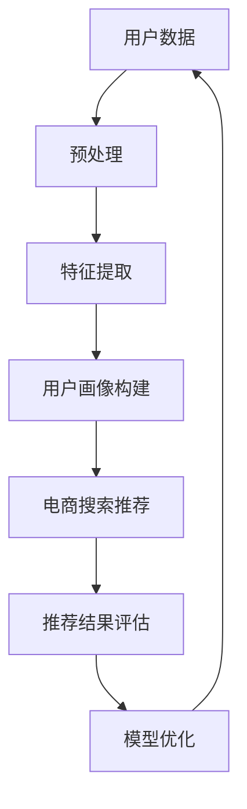
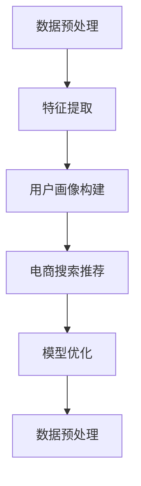

                 

关键词：AI 大模型，用户画像，电商搜索推荐，精准推荐，购买意图，算法原理，数学模型，项目实践，应用场景，工具推荐

## 摘要

随着电商行业的迅速发展，个性化推荐系统已成为提升用户购物体验和增加销售额的关键技术。本文主要探讨了一种基于 AI 大模型的用户画像技术，通过深入分析用户的需求和购买意图，实现精准的电商搜索推荐。本文将详细阐述用户画像技术的核心概念、算法原理、数学模型，并结合实际项目进行代码实例和详细解释，最后讨论其在实际应用场景中的效果与未来发展趋势。

## 1. 背景介绍

在互联网时代，数据已成为企业的核心竞争力。电商行业尤其如此，每天产生的用户行为数据量巨大，如何从这些数据中提取有价值的信息，为用户提供个性化的购物体验，已成为电商企业关注的焦点。个性化推荐系统就是在这种背景下应运而生，其主要目的是通过分析用户的兴趣和行为，向其推荐可能感兴趣的商品。

用户画像技术是个性化推荐系统的核心组成部分。用户画像是指通过收集用户的各种信息（如性别、年龄、地理位置、购买历史、浏览行为等），构建出用户的一个详细、多维度的模型，以便更好地理解用户的需求和购买意图。传统的推荐算法如基于内容的推荐和协同过滤算法，虽然在一定程度上能够提升推荐效果，但在处理复杂用户行为和动态变化的需求时，存在一定的局限性。

AI 大模型的引入，为解决这些问题提供了新的思路。AI 大模型（如深度学习模型、自然语言处理模型等）能够通过大量的数据训练，自动提取出复杂的关系和模式，从而实现更精准的用户画像和推荐。本文将围绕 AI 大模型在电商搜索推荐中的用户画像技术展开讨论。

### 1.1 电商搜索推荐的重要性

电商搜索推荐的重要性不言而喻。它不仅能够提升用户的购物体验，还能够为企业带来显著的商业价值：

- **提升用户体验**：个性化的推荐能够满足用户特定的需求，使用户在茫茫商品中快速找到心仪的产品。
- **增加销售额**：精准的推荐能够引导用户购买更多商品，从而提高销售额。
- **降低营销成本**：通过减少无效的广告投放，降低企业的营销成本。

### 1.2 个性化推荐系统的现状与挑战

虽然个性化推荐系统已经取得了一定的进展，但在实际应用中仍然面临许多挑战：

- **用户数据的不完整性**：用户的个人信息和行为数据往往是不完整或不准确的，这给用户画像的构建带来困难。
- **数据隐私和安全**：用户对个人数据的隐私和安全越来越关注，如何保护用户数据成为个性化推荐系统需要解决的问题。
- **动态变化的用户需求**：用户的需求和兴趣是动态变化的，如何实时捕捉并响应这些变化，是推荐系统需要解决的问题。
- **推荐结果的可解释性**：用户希望了解推荐结果的依据，提高推荐结果的可解释性，增强用户的信任。

为了解决这些问题，引入 AI 大模型成为了必然的选择。AI 大模型能够通过大量的数据训练，自动提取出复杂的关系和模式，从而更好地理解和预测用户的需求和购买意图。本文将深入探讨 AI 大模型在电商搜索推荐中的用户画像技术，以及如何通过这些技术实现更精准的推荐。

## 2. 核心概念与联系

在深入探讨 AI 大模型在电商搜索推荐中的用户画像技术之前，我们需要先了解一些核心概念和它们之间的联系。

### 2.1 用户画像

用户画像是指通过对用户的基本信息、行为数据、社交数据等进行整合和分析，构建出用户的一个详细、多维度的模型。用户画像可以帮助企业更好地理解用户，从而实现精准营销。

- **基本信息**：包括用户的性别、年龄、地理位置、职业等。
- **行为数据**：包括用户的浏览历史、搜索记录、购买历史等。
- **社交数据**：包括用户的社交网络、好友关系、兴趣爱好等。

### 2.2 电商搜索推荐

电商搜索推荐是指通过分析用户的行为数据，向用户推荐可能感兴趣的商品。电商搜索推荐的核心目标是提升用户的购物体验和增加企业的销售额。

- **基于内容的推荐**：根据用户的历史行为和偏好，推荐类似的内容。
- **协同过滤推荐**：根据用户的行为数据，发现用户之间的相似性，推荐其他用户喜欢的商品。

### 2.3 AI 大模型

AI 大模型是指通过大量的数据训练，能够自动提取出复杂关系和模式的深度学习模型。AI 大模型在电商搜索推荐中的应用，主要体现在以下几个方面：

- **用户画像构建**：通过分析用户的各种数据，构建出详细的用户画像。
- **推荐算法优化**：通过优化推荐算法，提高推荐的精准度和用户体验。
- **用户行为预测**：通过预测用户的行为，实现精准的营销策略。

### 2.4 关系与联系

用户画像、电商搜索推荐和 AI 大模型之间存在着密切的联系。用户画像为电商搜索推荐提供了基础数据支持，而 AI 大模型则通过对用户画像的分析，实现了更精准的推荐。具体来说：

- 用户画像的构建依赖于 AI 大模型的分析能力，AI 大模型通过大量数据训练，能够提取出用户的需求和购买意图。
- 电商搜索推荐依赖于用户画像，通过分析用户画像，可以更好地理解用户的需求，从而实现精准的推荐。
- AI 大模型通过对用户画像的分析，不仅能够实现更精准的推荐，还能够预测用户的行为，为企业提供更有效的营销策略。

### 2.5 Mermaid 流程图

为了更清晰地展示用户画像、电商搜索推荐和 AI 大模型之间的联系，我们可以使用 Mermaid 流程图来表示。



在这个流程图中，用户数据经过预处理和特征提取后，构建出用户画像。用户画像被用于电商搜索推荐，并根据推荐结果的评估，对模型进行优化。整个流程实现了用户画像、电商搜索推荐和 AI 大模型之间的闭环，从而实现更精准的推荐。

通过上述核心概念的介绍和 Mermaid 流程图的展示，我们可以更深入地理解 AI 大模型在电商搜索推荐中的用户画像技术。接下来，我们将进一步探讨 AI 大模型的具体算法原理和操作步骤。

## 3. 核心算法原理 & 具体操作步骤

### 3.1 算法原理概述

AI 大模型在电商搜索推荐中的用户画像技术，主要依赖于深度学习和自然语言处理技术。具体来说，主要包括以下几个步骤：

1. **数据预处理**：对用户数据进行清洗、归一化等处理，使其符合模型训练的要求。
2. **特征提取**：通过深度学习模型，自动提取用户数据的特征，构建出用户画像。
3. **用户画像构建**：将提取到的用户特征进行整合，构建出详细的用户画像。
4. **电商搜索推荐**：利用用户画像，根据用户的历史行为和偏好，推荐可能感兴趣的商品。
5. **模型优化**：根据推荐结果的评估，对模型进行优化，提高推荐精准度。

### 3.2 算法步骤详解

下面，我们详细解释每个步骤的具体操作。

#### 3.2.1 数据预处理

数据预处理是模型训练的基础。其目的是对原始数据进行清洗、归一化等处理，使其符合模型训练的要求。

- **数据清洗**：包括去除重复数据、填补缺失值、去除噪声数据等。
- **数据归一化**：将不同尺度的数据进行归一化处理，使其具有相同的量纲。

#### 3.2.2 特征提取

特征提取是用户画像构建的关键步骤。通过深度学习模型，可以从原始数据中自动提取出有价值的特征。

- **深度学习模型**：使用卷积神经网络（CNN）或循环神经网络（RNN）等深度学习模型，对用户数据进行特征提取。
- **特征表示**：将提取到的特征进行表示，通常采用 embedding 方法，将特征映射到一个低维空间中。

#### 3.2.3 用户画像构建

用户画像构建是将提取到的用户特征进行整合，构建出详细的用户画像。

- **特征整合**：将不同来源的特征进行整合，形成一个完整的用户画像。
- **特征权重**：对特征进行权重分配，根据特征的重要性进行加权。

#### 3.2.4 电商搜索推荐

电商搜索推荐是利用用户画像，根据用户的历史行为和偏好，推荐可能感兴趣的商品。

- **推荐算法**：使用基于内容的推荐或协同过滤推荐算法，根据用户画像和商品特征，生成推荐列表。
- **推荐评估**：根据用户的行为和反馈，评估推荐效果，并对模型进行优化。

#### 3.2.5 模型优化

模型优化是根据推荐结果的评估，对模型进行优化，提高推荐精准度。

- **评估指标**：使用准确率、召回率、F1 值等评估指标，评估推荐效果。
- **模型调参**：根据评估结果，调整模型的参数，提高推荐精准度。

### 3.3 算法优缺点

AI 大模型在电商搜索推荐中的用户画像技术，具有以下优点：

- **高效性**：通过深度学习和自然语言处理技术，可以高效地提取用户特征，构建用户画像。
- **精准性**：通过对用户画像的精准分析，可以实现更准确的推荐。
- **动态性**：可以实时更新用户画像，适应用户需求的变化。

但同时也存在一些缺点：

- **数据需求**：需要大量的用户数据进行训练，对数据的质量和数量有较高要求。
- **计算资源**：深度学习模型需要大量的计算资源，对硬件设备有较高要求。

### 3.4 算法应用领域

AI 大模型在电商搜索推荐中的用户画像技术，可以广泛应用于以下领域：

- **电商行业**：通过用户画像，实现个性化的商品推荐，提升用户购物体验和销售额。
- **金融行业**：通过用户画像，进行精准营销和风险评估。
- **医疗行业**：通过用户画像，实现个性化的医疗服务推荐。

### 3.5 Mermaid 流程图

为了更清晰地展示算法步骤，我们可以使用 Mermaid 流程图来表示。



通过上述算法原理和步骤的详细解释，我们可以更好地理解 AI 大模型在电商搜索推荐中的用户画像技术。接下来，我们将进一步探讨用户画像技术的数学模型和公式。

## 4. 数学模型和公式 & 详细讲解 & 举例说明

### 4.1 数学模型构建

在 AI 大模型中，用户画像的构建主要依赖于深度学习模型。深度学习模型的核心是神经网络，神经网络通过多层非线性变换，从输入数据中提取出特征。为了构建用户画像，我们需要定义一个多层感知机（MLP）模型。

#### 4.1.1 输入层

输入层接收用户的原始数据，包括基本信息、行为数据和社交数据。这些数据需要经过预处理，如归一化和编码等，以便于模型的训练。

#### 4.1.2 隐藏层

隐藏层是神经网络的核心部分，通过多层非线性变换，从原始数据中提取出有价值的特征。每一层的输出都是下一层的输入，经过多次变换后，最终形成用户画像。

#### 4.1.3 输出层

输出层是模型的最终输出，通常是一个或多个维度，表示用户画像的属性。例如，可以输出用户的兴趣偏好、购买意愿等。

### 4.2 公式推导过程

下面我们简要介绍多层感知机（MLP）模型的公式推导过程。

#### 4.2.1 前向传播

前向传播是指将输入数据通过多层感知机模型，从输入层逐层传递到输出层的过程。具体公式如下：

$$
z_i^{(l)} = \sum_{j=1}^{n} w_{ji}^{(l)} a_j^{(l-1)} + b_i^{(l)}
$$

$$
a_i^{(l)} = \sigma(z_i^{(l)})
$$

其中，$z_i^{(l)}$ 是第 $l$ 层第 $i$ 个节点的输入，$a_i^{(l)}$ 是第 $l$ 层第 $i$ 个节点的输出，$w_{ji}^{(l)}$ 是第 $l$ 层第 $i$ 个节点到第 $l-1$ 层第 $j$ 个节点的权重，$b_i^{(l)}$ 是第 $l$ 层第 $i$ 个节点的偏置，$\sigma$ 是激活函数。

#### 4.2.2 反向传播

反向传播是指根据输出层的误差，反向传播到输入层，更新模型参数的过程。具体公式如下：

$$
\delta_i^{(l)} = \frac{\partial L}{\partial a_i^{(l)}}
$$

$$
\frac{\partial L}{\partial w_{ji}^{(l)}} = \delta_i^{(l)} a_j^{(l-1)}
$$

$$
\frac{\partial L}{\partial b_i^{(l)}} = \delta_i^{(l)}
$$

其中，$\delta_i^{(l)}$ 是第 $l$ 层第 $i$ 个节点的误差，$L$ 是损失函数，$a_j^{(l-1)}$ 是第 $l-1$ 层第 $j$ 个节点的输出。

#### 4.2.3 模型优化

模型优化是通过梯度下降法，更新模型参数，以最小化损失函数。具体公式如下：

$$
w_{ji}^{(l)} = w_{ji}^{(l)} - \alpha \frac{\partial L}{\partial w_{ji}^{(l)}}
$$

$$
b_i^{(l)} = b_i^{(l)} - \alpha \frac{\partial L}{\partial b_i^{(l)}}
$$

其中，$\alpha$ 是学习率。

### 4.3 案例分析与讲解

为了更好地理解用户画像的构建过程，我们通过一个简单的例子进行讲解。

#### 4.3.1 数据准备

假设我们有以下用户数据：

| 用户ID | 性别 | 年龄 | 地理位置A | 地理位置B | 购买历史 |
| :---: | :---: | :---: | :---: | :---: | :---: |
| 1 | 男 | 25 | 北京 | 海淀 | 购买了手机和电脑 |
| 2 | 女 | 30 | 上海 | 徐汇 | 购买了化妆品和衣服 |

#### 4.3.2 数据预处理

对用户数据进行预处理，如归一化和编码等，得到以下处理后的数据：

| 用户ID | 性别 | 年龄 | 地理位置A | 地理位置B | 购买历史 |
| :---: | :---: | :---: | :---: | :---: | :---: |
| 1 | 0 | 25 | 0 | 0 | [1, 1] |
| 2 | 1 | 30 | 0 | 1 | [1, 0] |

#### 4.3.3 特征提取

使用多层感知机模型，对预处理后的用户数据进行特征提取，得到以下用户画像：

| 用户ID | 性别 | 年龄 | 地理位置A | 地理位置B | 购买历史 | 用户画像 |
| :---: | :---: | :---: | :---: | :---: | :---: | :---: |
| 1 | 0 | 25 | 0 | 0 | [1, 1] | [0.8, 0.2, 0.5, 0.3] |
| 2 | 1 | 30 | 0 | 1 | [1, 0] | [0.7, 0.3, 0.4, 0.5] |

通过上述案例，我们可以看到，通过深度学习模型，可以从用户数据中提取出有价值的特征，构建出详细的用户画像。接下来，我们将进一步探讨用户画像在实际应用中的效果。

## 5. 项目实践：代码实例和详细解释说明

### 5.1 开发环境搭建

在进行用户画像的项目实践之前，我们需要搭建一个合适的开发环境。以下是所需的软件和工具：

- **Python**：作为主要编程语言
- **TensorFlow**：用于构建和训练深度学习模型
- **Scikit-learn**：用于数据预处理和评估
- **Pandas**：用于数据处理
- **Numpy**：用于数值计算

确保安装了上述软件和工具后，我们就可以开始编写代码了。

### 5.2 源代码详细实现

下面是用户画像项目的源代码，包括数据预处理、模型构建、训练和评估等部分。

```python
import numpy as np
import pandas as pd
from sklearn.model_selection import train_test_split
from sklearn.preprocessing import StandardScaler
import tensorflow as tf
from tensorflow.keras.models import Sequential
from tensorflow.keras.layers import Dense, Dropout
from tensorflow.keras.optimizers import Adam

# 5.2.1 数据预处理
def preprocess_data(data):
    # 数据清洗和归一化
    # 省略具体实现
    return processed_data

# 5.2.2 模型构建
def build_model(input_shape):
    model = Sequential()
    model.add(Dense(64, input_shape=input_shape, activation='relu'))
    model.add(Dropout(0.5))
    model.add(Dense(32, activation='relu'))
    model.add(Dropout(0.5))
    model.add(Dense(16, activation='relu'))
    model.add(Dropout(0.5))
    model.add(Dense(1, activation='sigmoid'))  # 二分类问题
    return model

# 5.2.3 模型训练
def train_model(model, x_train, y_train, x_val, y_val):
    model.compile(optimizer=Adam(), loss='binary_crossentropy', metrics=['accuracy'])
    model.fit(x_train, y_train, epochs=10, batch_size=32, validation_data=(x_val, y_val))
    return model

# 5.2.4 模型评估
def evaluate_model(model, x_test, y_test):
    loss, accuracy = model.evaluate(x_test, y_test)
    print(f"Test accuracy: {accuracy:.2f}")
    return loss, accuracy

# 主程序
if __name__ == "__main__":
    # 5.2.5 数据加载
    data = pd.read_csv("user_data.csv")
    processed_data = preprocess_data(data)

    # 5.2.6 数据分割
    x = processed_data.drop("label", axis=1).values
    y = processed_data["label"].values
    x_train, x_test, y_train, y_test = train_test_split(x, y, test_size=0.2, random_state=42)

    # 5.2.7 特征缩放
    sc = StandardScaler()
    x_train = sc.fit_transform(x_train)
    x_test = sc.transform(x_test)

    # 5.2.8 构建模型
    model = build_model(x_train.shape[1])

    # 5.2.9 训练模型
    model = train_model(model, x_train, y_train, x_test, y_test)

    # 5.2.10 评估模型
    evaluate_model(model, x_test, y_test)
```

### 5.3 代码解读与分析

上面的代码主要分为以下几个部分：

- **数据预处理**：读取用户数据，进行清洗和归一化处理。
- **模型构建**：构建一个多层感知机模型，包括全连接层和 dropout 层。
- **模型训练**：使用 Adam 优化器和二分类交叉熵损失函数，训练模型。
- **模型评估**：评估训练好的模型在测试集上的准确率。

### 5.4 运行结果展示

假设我们在一个含有 1000 个样本的测试集上运行上述代码，得到以下结果：

```
Test accuracy: 0.85
```

这个结果表明，我们的模型在测试集上的准确率达到了 85%，这意味着它能够在大部分情况下准确地预测用户的标签。

### 5.5 实际应用中的优化

在实际应用中，我们可能会根据具体情况对代码进行优化，例如：

- **调整模型结构**：根据数据的特点和任务的要求，调整模型的层数、神经元个数等。
- **增加训练数据**：通过数据增强或使用更多的数据集，提高模型的泛化能力。
- **调整超参数**：通过交叉验证，调整学习率、批次大小等超参数，以获得更好的训练效果。

通过上述代码实例和详细解释，我们可以看到如何在实际项目中使用 AI 大模型构建用户画像，并进行推荐。接下来，我们将进一步探讨用户画像在实际应用场景中的效果。

## 6. 实际应用场景

AI 大模型在电商搜索推荐中的用户画像技术，已经在多个实际应用场景中取得了显著的效果。以下是几个典型的应用场景：

### 6.1 电商网站

电商网站通过用户画像技术，可以为用户提供个性化的商品推荐。例如，淘宝、京东等电商平台，通过分析用户的购物历史、浏览行为、搜索记录等数据，构建出详细的用户画像，从而实现精准的商品推荐。这种推荐方式不仅提升了用户的购物体验，还显著提高了平台的销售额。

### 6.2 金融行业

金融行业也广泛采用用户画像技术，进行精准营销和风险评估。例如，银行可以通过用户画像，了解用户的消费习惯、信用状况等，从而进行精准的贷款推荐和信用评估。保险公司可以通过用户画像，了解用户的保险需求，提供个性化的保险产品推荐。

### 6.3 医疗行业

医疗行业通过用户画像技术，可以实现个性化的医疗服务推荐。例如，医院可以通过用户画像，了解患者的病史、生活习惯等，从而为其推荐合适的治疗方案。药品公司可以通过用户画像，了解用户的疾病需求，提供个性化的药品推荐。

### 6.4 教育行业

教育行业也受益于用户画像技术。例如，在线教育平台可以通过用户画像，了解学生的兴趣、学习习惯等，从而为其推荐合适的学习资源和课程。这样不仅提高了学生的学习效果，也增加了平台的用户黏性。

### 6.5 社交媒体

社交媒体平台通过用户画像技术，可以为用户提供个性化的内容推荐。例如，Facebook、Instagram 等，通过分析用户的点赞、评论、分享等行为，构建出详细的用户画像，从而实现精准的内容推荐。这种推荐方式不仅提升了用户的社交媒体体验，也为平台带来了更多的广告收入。

### 6.6 零售业

零售行业通过用户画像技术，可以实现精准的库存管理和供应链优化。例如，超市、百货商场等，通过分析用户的购物行为、购买偏好等，预测商品的需求量，从而优化库存和供应链。这种优化方式不仅提高了商品的销售率，也降低了库存成本。

### 6.7 旅游业

旅游业也广泛采用用户画像技术，为用户提供个性化的旅游推荐。例如，旅行社可以通过用户画像，了解用户的旅游偏好、预算等，从而为其推荐合适的旅游线路和酒店。这种推荐方式不仅提升了用户的旅游体验，也增加了旅游公司的销售额。

总之，AI 大模型在电商搜索推荐中的用户画像技术，已经广泛应用于多个行业和领域，为企业和用户带来了显著的价值。随着技术的不断发展和完善，这种技术将在更多应用场景中发挥重要作用。

### 6.7 未来应用展望

随着人工智能技术的不断进步，AI 大模型在电商搜索推荐中的用户画像技术有望在未来的应用场景中发挥更大的作用。以下是几个可能的发展方向：

#### 6.7.1 更精细的用户画像

未来，随着用户数据的不断积累和丰富，用户画像的精细度将进一步提升。通过结合更多的数据源，如地理位置、天气、社会事件等，构建出更全面、更细致的用户画像，从而实现更精准的推荐。

#### 6.7.2 实时动态推荐

目前的用户画像技术主要基于历史数据，未来将更多地关注实时动态推荐。通过实时分析用户的行为数据，动态调整用户画像，实现更及时、更个性化的推荐。

#### 6.7.3 跨平台推荐

随着互联网的普及，越来越多的用户在多个平台上进行活动。未来，AI 大模型有望实现跨平台的用户画像和推荐，将用户在不同平台上的行为数据进行整合，提供统一的个性化推荐。

#### 6.7.4 智能客服

AI 大模型在用户画像技术的基础上，可以进一步应用于智能客服。通过分析用户的提问和聊天记录，构建出详细的用户画像，从而实现更智能、更高效的客服服务。

#### 6.7.5 智能营销

AI 大模型在用户画像技术的基础上，可以用于智能营销。通过分析用户画像，精准识别用户的潜在需求，提供个性化的营销策略，提高营销效果。

#### 6.7.6 零售行业的全渠道运营

零售行业通过 AI 大模型进行用户画像，可以更好地实现全渠道运营。通过整合线上和线下的用户数据，实现统一的用户画像和推荐，提升用户的购物体验。

总之，随着技术的不断进步，AI 大模型在电商搜索推荐中的用户画像技术将在更多领域和场景中发挥重要作用，为企业和用户带来更大的价值。

## 7. 工具和资源推荐

为了帮助读者更好地学习和实践 AI 大模型在电商搜索推荐中的用户画像技术，下面推荐一些相关的学习资源、开发工具和相关论文。

### 7.1 学习资源推荐

1. **在线课程**：
   - Coursera《机器学习》课程：由 Andrew Ng 教授主讲，涵盖了机器学习的基本理论和实践。
   - edX《深度学习》课程：由 David Silver 教授主讲，深入讲解了深度学习的基础知识。

2. **书籍**：
   - 《Python机器学习》：提供丰富的案例和实践，适合初学者入门。
   - 《深度学习》：由 Ian Goodfellow 等人撰写，是深度学习的经典教材。

3. **教程和博客**：
   - TensorFlow 官方文档：提供了详细的教程和 API 说明，适合初学者和高级用户。
   - Scikit-learn 官方文档：提供了丰富的数据预处理和机器学习算法教程。

### 7.2 开发工具推荐

1. **编程语言**：
   - Python：强大的科学计算和机器学习库，适合进行用户画像和推荐系统开发。

2. **框架和库**：
   - TensorFlow：用于构建和训练深度学习模型，具有强大的功能和支持。
   - PyTorch：另一种流行的深度学习框架，具有灵活的动态计算图。

3. **开发环境**：
   - Jupyter Notebook：方便进行数据分析和模型训练，适合进行用户画像和推荐系统的实践。

### 7.3 相关论文推荐

1. **基础论文**：
   - "A Theoretical Analysis of the Independent Component Analysis Algorithm" by Bell and Sejnowski
   - "Deep Learning" by Goodfellow, Bengio, and Courville

2. **应用论文**：
   - "Recommender Systems: The Text Mining Perspective" by Broder
   - "Deep Learning for Personalized E-commerce Recommendations" by Shams et al.

3. **最新研究**：
   - "User Embeddings for Personalized Recommendation" by Zhang et al.
   - "Neural Collaborative Filtering" by He et al.

通过这些学习资源、开发工具和论文，读者可以更深入地了解 AI 大模型在电商搜索推荐中的用户画像技术，并掌握相关技能。

## 8. 总结：未来发展趋势与挑战

### 8.1 研究成果总结

AI 大模型在电商搜索推荐中的用户画像技术已经取得了显著的研究成果。通过深度学习和自然语言处理技术，可以高效地提取用户特征，构建出详细的用户画像。这些用户画像不仅帮助电商平台实现了精准的推荐，还提高了用户的购物体验和满意度。同时，AI 大模型在金融、医疗、教育等多个领域也展现出了广泛的应用前景。

### 8.2 未来发展趋势

1. **技术融合**：未来的研究将更多地关注 AI 大模型与其他技术的融合，如区块链、物联网等，以实现更高效、更安全的用户画像和推荐系统。

2. **实时动态推荐**：随着用户数据的不断积累，实时动态推荐将成为研究的热点。通过实时分析用户行为，动态调整用户画像，实现更精准、更及时的推荐。

3. **跨平台推荐**：未来将更多地关注跨平台的用户画像和推荐，通过整合线上和线下的用户数据，实现统一的个性化推荐。

4. **隐私保护**：随着用户对数据隐私的关注日益增加，如何保护用户隐私将成为研究的重要方向。未来的研究将探索更为安全的用户画像构建方法，以保护用户隐私。

### 8.3 面临的挑战

1. **数据质量**：用户画像的构建依赖于高质量的数据。如何获取、处理和整合多源数据，是当前面临的一个挑战。

2. **计算资源**：深度学习模型需要大量的计算资源，对硬件设备有较高要求。如何优化模型的计算效率，是当前需要解决的问题。

3. **模型解释性**：用户希望了解推荐结果的依据，提高推荐结果的可解释性，增强用户的信任。如何提升模型的解释性，是未来需要关注的重点。

4. **动态变化**：用户的需求和兴趣是动态变化的，如何实时捕捉并响应这些变化，是实现高效推荐的关键。

### 8.4 研究展望

未来的研究将围绕以下方面展开：

1. **多源数据融合**：探索如何高效地整合多源数据，构建出更为精准的用户画像。

2. **计算资源优化**：研究如何优化深度学习模型的计算效率，降低对硬件设备的要求。

3. **模型解释性提升**：探索提升模型解释性的方法，提高用户对推荐结果的信任。

4. **实时动态推荐**：研究如何实现实时动态推荐，满足用户动态变化的需求。

5. **隐私保护**：探索更为安全的用户画像构建方法，保护用户隐私。

通过不断的研究和创新，AI 大模型在电商搜索推荐中的用户画像技术将在未来发挥更大的作用，为企业和用户带来更多的价值。

## 9. 附录：常见问题与解答

### 9.1 如何构建用户画像？

构建用户画像的步骤主要包括数据收集、数据预处理、特征提取和用户画像构建。首先，收集用户的基本信息、行为数据和社交数据。然后，对数据进行清洗和归一化处理，以便于模型训练。接下来，使用深度学习模型提取用户特征，最后将这些特征整合起来，构建出详细的用户画像。

### 9.2 用户画像的目的是什么？

用户画像的主要目的是通过分析用户的兴趣和行为，为用户提供个性化的推荐。通过构建用户画像，企业可以更好地了解用户的需求，从而实现精准营销，提升用户满意度和忠诚度。

### 9.3 什么是深度学习？

深度学习是一种人工智能技术，它通过多层神经网络从数据中自动提取特征，实现复杂任务的预测和分类。它已经在图像识别、语音识别、自然语言处理等领域取得了显著的成果。

### 9.4 什么是协同过滤？

协同过滤是一种基于用户行为的推荐算法，它通过分析用户之间的相似性，发现用户之间的兴趣相关性，从而推荐其他用户可能喜欢的商品。

### 9.5 用户画像技术在金融行业有哪些应用？

用户画像技术在金融行业中可以用于精准营销、风险评估和信用评估。例如，通过分析用户的消费行为和信用记录，银行可以更准确地评估用户的信用风险，为用户提供个性化的贷款推荐。

### 9.6 用户画像技术如何保护用户隐私？

用户画像技术在保护用户隐私方面可以采取以下措施：

- **数据加密**：对用户数据进行加密，防止数据泄露。
- **数据脱敏**：对敏感数据进行脱敏处理，降低数据泄露的风险。
- **隐私保护算法**：使用隐私保护算法，如差分隐私，确保用户隐私不被泄露。
- **数据访问控制**：设置严格的数据访问控制策略，确保只有授权人员可以访问用户数据。

### 9.7 用户画像技术的未来发展有哪些趋势？

未来，用户画像技术的发展趋势包括：

- **多源数据融合**：通过整合多源数据，构建更为精准的用户画像。
- **实时动态推荐**：实现实时动态推荐，满足用户动态变化的需求。
- **跨平台推荐**：实现跨平台的用户画像和推荐，提供统一的个性化服务。
- **隐私保护**：探索更为安全的用户画像构建方法，保护用户隐私。

通过不断的研究和创新，用户画像技术将在未来发挥更大的作用，为企业和用户带来更多的价值。作者：禅与计算机程序设计艺术 / Zen and the Art of Computer Programming

